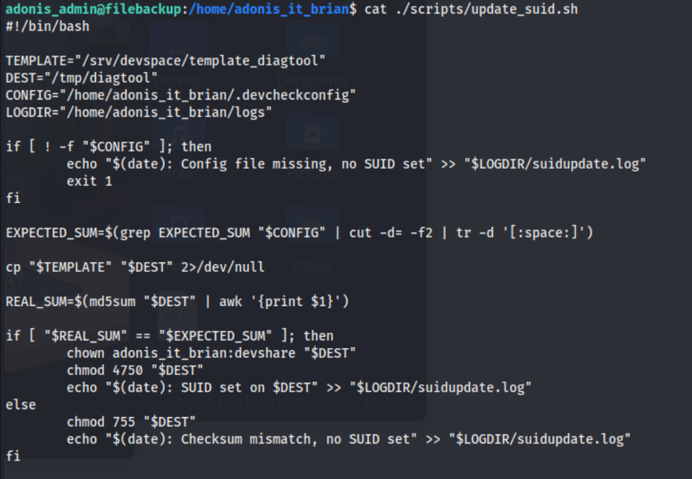

# Excuse My Persistence

*Solution Guide*

## Overview

This challenge involves accessing devices to traverse through the network. There are three tokens to find. The competitor will pull files from an FTP server via anonymous read for initial access, and read query a MySQL database, and build SSH tunnels to enumerate a webserver.  

*Note: All tokens are transforms and will be randomized per challenge launch. While some of the interfaces needing to communicate with the challenge server have static IPs, some IPs are still assigned via DHCP and the IPs referenced in this guide may be different in your instance.*

## Question 1

*What is token1 on the file server?*

This section involves retrieving and digesting information about the target network and exploiting insecure write permissions to compromise a SETUID binary and escalate privileges to another user.  

Begin by opening a web browser and retrieving the provided network diagram from ``challenge.us`` to learn the IP of the FTP server.


Authenticate to the FTP server at `10.5.5.119` with ``anonymous:anonymous``. This guide will refer to the FTP server as its hostname,``filebackup``. 


Retrieve both files available and view locally. Credentials are discovered in the file `TODO.md`. The network map enhances understanding of the environment.

```markdown
FTP> ls
FTP> get TODO.md
FTP> get cant_get_any_work_done.png
```


These files provide additional IP addressing schemes and credentials for ``filebackup``.


Login to the ``filebackup`` with the discovered credentials. While navigating the filesystem, we see another user - ``adonis_it_brian`` with files in the home directory. 


The file in ``/home/adonis_it_brian/logs/suidupdate.log`` appears to be setting a SUID on a file in ``/tmp`` after regular intervals. 


This is confirmed in the ``/etc/crontab`` that ``/home/adonis_it_brian/scripts/update_suid.sh`` is being executed every 2 minutes.


The file ``/home/adonis_it_brian/scripts/update_suid.sh`` seems to copy a 'template' file from ``/srv/devspace/template_diagtool`` and write it to ``/tmp``. An integrity check of the 'template' file is done by comparing the md5 hash to the contents of a file found in ``/home/adonis_it_brian/.devcheckconfig``. If the file hashes match, the SUID bit is set on the newly written file in ``/tmp``




To read into the ``/home/adonis_it_brian/token/`` directory, we need ``adonis_it_brian``'s privileges. We can abuse the SETUID binary and the cronjob to execute a file that will spawn an interactive shell as ``adonis_it_brian`` via the sticky bit. To do so, we will need to ensure the hash check passes. First we will create and compile a binary to spawn a bash shell but maintain permissions. Below is the series of commands used to create the file and take it's md5 hash.


```bash
vim shell.c #write shell code
gcc -o shell shell.c #compile
chmod +x shell #ensure file is executable
mv shell template_diagtool #rename the file so that it is picked up by the cronjob
md5sum template_diagtool #returns the new md5sum that will need to replaced the contents of /home/adonis_it_brian/.devcheckconfig
```

Replace the md5 hash in  ``/home/adonis_it_brian/.devcheckconfig`` with the updated hash and wait for the ``cronjob`` to execute. We can monitor success of the SUID being set via the output of the ``/home/adonis_it_brian/logs/suidupdate.log``


Once the file in ``/tmp/diagtool`` is successfully updated, execute the binary to spawn an interactive shell as ``adonis_it_brian`` and read the contents of ``token1.txt``


*Note: further interactivity as ``adonis_it_brian`` on this machine is not required to progress through the rest of the challenge.*

## Question 2

*What is token2 on the database server?*

This section involves discovering and accessing the database server. Once authenticated, the challenger will have to enumerate the file system to uncover MySQL artifacts with information to retrieve ``token2``.

On the ``filebackup``, read the file `TODO` in the user's home directory to reveal credentials: ``db_user:adonis``. The other documents provide contextual information that describe remotely querying a database server, mention of a secure network, and the requirement for SSH tunneling.


With the network diagram previously discovered, it is clear that discovering the database server is necessary to progress through the network. Enumerate the network information on the ``filebackup``to identify the `192.168.0.0/24` network interface. 


Network enumeration tools on the device are limited. It is possible to ping sweep the CIDR to discover hosts.

``for i in $(seq 254); do ping 192.168.0.$i -c1 -W1 & done | grep from``


To conduct a port scan, it is possible to build an ``ssh`` tunnel from the Kali workstation to the ``filebackup`` server. On the ``filebackup``, open up a dynamic port forward. 

``ssh -D 127.0.0.1:9052 adonis_admin@127.0.0.1``


*Note: While building these tunnels, new ``ssh`` sessions will be established during each hop.  There are ``ssh`` options that don't spawn a new session that this guide does not utilize.*

Again on the ``filebackup``, create a remote port forward to port 9050 on the Kali workstation and connect it to the previously created port.

``ssh -R 127.0.0.1:9050:127.0.0.1:9052 user@kali_ip``


On the Kali workstation, we can run nmap to scan the discovered IPs for MySQL. 

``proxychains nmap -sT -Pn -p 3306 192.168.0.54``


*Note: At this point, if you have been using a single terminal window while building these tunnels you can ``exit`` through each hop. Doing so clears the tunnel built on port 9050 which is the proxychains default SOCKS proxy. If you launch a new terminal instance or otherwise do not clear that port, it may interfere with future tunnels or additional changes to the proxychains configuration. This behavior is common with SSH tunneling and its related knowledge is intended for this challenge*


*Note: For troubleshooting, ``netstat`` is disabled on this box. However it is possible to view listening port activity through a particularly nasty 1-liner which formats the output of ``/proc/net/tcp``.*

```markdown
grep -v "rem_address" /proc/net/tcp  | awk  '{x=strtonum("0x"substr($3,index($3,":")-2,2)); for (i=5; i>0; i-=2) x = x"."strtonum("0x"substr($3,i,2))}{print x":"strtonum("0x"substr($3,index($3,":")+1,4))}'
```


With the previously discovered database account, it is possible to authenticate to the remote server and query the database. 

```markdown
mysql -u db_user -p -h 192.168.0.54 -P 3306
```

``show databases;``


Dumping the database reveals credentials for a local user account: ``adonis_it_brian:config_pw123``, knowledge of the interfaces on the database server, a nudge to a webserver in the secret net, a CIDR range, and mention of a "dev" database.


From the ``filebackup``, authenticate to the database server via `ssh`. The machine will be referenced as ``dbhost`` for the remainder of the guide.


Enumerating the user account files on the ``dbhost`` reveals a raw database backup and a restricted user home directory: ``test``.


The artifacts within ``dev_adonis_db_backup_raw`` are partial but its presence nudges to analyze the MySQL service directory. 


The competitor will need knowledge of ``MySQL`` file structure and will have to navigate to ``/var/lib/mysql_backup/`` and analyze the file ``deleted_ib_logfile0`` to discover credentials for the ``test`` user: ``test:test_adonis123``.


Output of ``strings -n 15 deleted_ib_logfile0``:


We can ``su`` to ``test`` and read the contents of ``token2.txt``.


## Question 3

*What is token3 found in the secret network?*

This section will involve configuring tunnels to enumerate the webserver in the "secret net".

Enumerating the ``dbhost`` reveals interfaces into multiple networks. Using the discovered network diagram, it is clear to enumerate the `10.4.4.0/24` network.


It is possible to ping sweep the CIDR, however, many utilities are disabled for use by the current user.
 
``for i in $(seq 254); do ping 10.4.4.$i -c1 -W1 & done | grep from``


The creation of ssh tunnels will allow scanning the network and target server. 

*Note: Issues related to tunneling can sometimes be fixed by closing out all windows to clear an occupied port. With credentials for the ``dbhost`` and ``filebackup`` discovered, this should be of minimal impact.*

On the ``dbhost``, set a dynamic port forward connection for SOCKS.

``ssh -D 127.0.0.1:9999 adonis_it_brian@127.0.0.1``


Next, still on the ``dbhost``, create a remote port forward to the ``filebackup`` back to the created SOCKS port on the database.

``ssh -R 127.0.0.1:8888:127.0.0.1:9999 adonis_admin@192.168.0.52``


In a new window on the Kali workstation, create a local port forward to the tunnel on the``filebackup``.

``ssh -L 127.0.0.1:9050:127.0.0.1:8888 adonis_admin@192.168.0.52``


In a new window on the Kali workstation, commands can now be ran via ``proxychains``. Using the hosts identified in the ping sweep, it is possible to scan the hosts for port 80 to determine the target machine with the same methodology in Question 2 when discovering the ``dbhost``. Recall an entry in the database: "secure webserver in secret net - too much info on port 80". We will use ``proxychains`` to scan and grab the banner from the ``target-server``, revealing the final token.

``proxychains curl 10.4.4.71``

