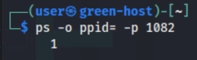
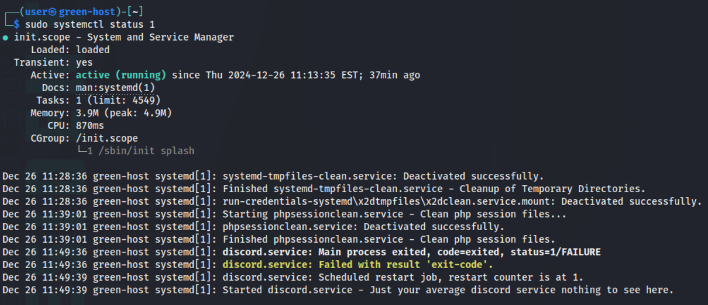
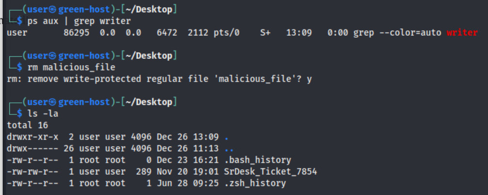
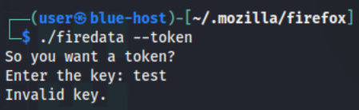
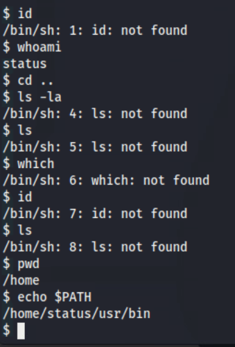

# Return to Sender

*Solution Guide*

## Overview
This challenge involves enumerating two hosts for malicious artifacts which ultimately allow for access of an adversary C2 node for profiling. There is a multi-step grading check on the ``green-host``, a crackme-style challenge on the ``bluehost``, and a restricted shell/TTP matrix for the final token. 
Note: IPs and tokens are static for this challenge. 

## Question 1
*Tidy up the greenhost. Navigate from the Kali workstation to https://challenge.us to check your progress.*

First, in a browser from the Kali workstation, navigate to ``challenge.us`` to download the ``Adversary_TTPs.xls`` which will be needed later on. 


Secondly, we can run the grading script to get a list of the tasks expected.


Using the provided credentials, ``ssh`` onto the ``green-host`` device.


Our ``user`` account can run ``sudo`` with no password. Inspecting the typical user account ``crontabs`` do not reflect any scheduled tasks.  


Brief inspection of ``/etc/passwd`` does not reveal other user accounts on the device.


With knowledge of the cron spool area, we can navigate to to ``/var/spool/cron/crontabs`` as ``root``. 

*Note: Checking scheduled tasks through ``crontab -l`` and manually verifying ``/var/spool/cron`` are typical initial-steps for host enumeration. By finding ``/tmp/historylog``, they can derive it's reoccuring nature as a nudge to scheduled tasks. If they carefully analyze ``/etc/passwd``, the dummy account ``notme`` looks suspicious and would warrant investigation. Lastly, the ``grading check`` directly hints at scheduled tasks through it's grading output: "Malicious tasks are still running on the machine"*


There is a crontab entry from the account ``notme``. 


We can delete this file or run ``crontab -u notme -r`` to remove the entry and complete task 1. 


For task 2, we will list our listening ports and note port 4444.


Listing the running processes with ``ps aux`` shows a ``nc`` process that is spawning a listener with the troublesome port: ``nc -lvp 4444``


We can list the parent process with ``ps -o ppid= -p 1082`` and attempt to identify more information using ``sudo lsof -p 1082``




Attempting to kill the process is unsuccessful as the process re-spawns.


With the parent process of ID of ``1`` we query ``systemctl`` to search for information regarding system services using ``sudo systemctl status 1``. This is successful in uncovering a suspicious process, ``discord.service``.




After reading the contents of ``discord.service``, it is clear we need to disable this service to disable the ``nc`` listener. We can do this by running ``sudo systemctl disable discord.service`` and ``sudo systemctl stop discord.service``.


We can verify these changes were successful the port is no longer listening. This completes task 2.


For the last task, there is a file on `/home/user/Desktop` that needs to be removed. However, simply trying to use `rm` to remove or rename the file does not work nor does moving/renaming the file with `mv`. 


This task can be solved similarly to the previous. If we look higher up the output of ``ps aux`` there is a process executing a command via bash.


The command is a bash script that is monitoring our ``malicious_file``. We can delete this command with ``sudo rm /usr/bin/writer``


With the ``writer`` removed, we can finally remove the ``malicious_file`` and complete our final check.




## Question 2
*Find the malware on the bluehost. Running the file with --token will reveal the 2nd token.*

Using the provided credentials, ``ssh`` to the ``blue-host``.

``ssh user@10.5.5.138``

Listing the processes with ``ps aux``, it is clear that there is suspicious activity occurring from the ``/home/user/.mozilla/firefox/`` directory.


This output is cut off. We can run ``ps aux ww`` to view the whole contents.


The suspicious binary, ``firedata`` seems to function as an ``ssh`` wrapper which utilizes an ``id_rsa`` file. The question hints at running the binary with ``--token`` for the 2nd token.




Executing ``firedata --token`` prompts for a key. We can SCP the file back to our Kali Workstation for further analysis.

``scp /home/user/.mozilla/firefox/firedata user@<Kali_IP>:/home/user/`


On the Kali Workstation, we can launch Ghidra for further analysis of the binary. There are many ways to do this, this guide will cover Ghidra with Aggressive Instruction Finder applied. Lauch Ghidra, start a project, import the file, and select 


We can note in the ``main`` function there is a call to ``validate_key`` function.


Within ``validate_key``, there is a check for a string length of ``10``. The function then checks each character in the string against a different mask for characters at even or odd indices. 


At each ``even`` index, the operation checks the character against a bit mask of ``0x100`` to check if the digit flag is set.


At each ``odd`` index, the operations performs the same check using a mask of  ``0x800``  to check for an uppercase character. 


Lastly, the ASCII value of each character is totaled and must equal a value of ``600``. 


We need to ensure our provided input meets those criteria checks. This can be accomplished manually or automatically, the following python script is an example and can provide possible string variations that meet the criteria:

```python3
from itertools import product

# Define ASCII target sum
TARGET_SUM = 600

# calculate ASCII sum
def ascii_sum(key):
    return sum(ord(c) for c in key)

# Generate all possible keys with alternating uppercase and digits
letters = "ABCDEFGHIJKLMNOPQRSTUVWXYZ"
digits = "0123456789"

# Create all combinations of 5 uppercase letters and 5 digits
for key in product(letters, digits, letters, digits, letters, digits, letters, digits, letters, digits):
    candidate = ''.join(key)  # Convert tuple to string
    if ascii_sum(candidate) == TARGET_SUM:  # Check ASCII sum
        print(f"Valid Key: {candidate}")
```

When supplying a satisfactory value, we are awarded with the token. 


## Question 3
*Access and profile the C2 server. Reference the known Adversary_TTP list. Based on the behavior and evidence of the malware and adversary infrastructure, what TTP did the threat actor employ?*

From the ``blue-host`` using the ``id_rsa`` file found in ``/home/user/.ssh/status/.ssh/`` we can connect to the adversary host as the user ``status`` on IP ``123.45.67.107``. 


We are initially spawned in an ``rbash`` environment. We cannot change directory and have limited usable commands.


The MOTD banner displayed when initially connecting reveals a command, ``showstatus`` that when ran provides minimal useful output. 


While learning about the command, we find it has a dedicated ``man`` page. If ran with the ``--log`` argument, we launched into a text editor reviewing authentication logs.


This text editor is ``vi`` and we can abuse a known shell escape to escape from the ``rbash`` restrictions. Within ``vi``, we can run the following commands sequentially: ``:set shell=/bin/sh`` and ``:shell`` to be spawned into a normal ``sh`` shell.


While in ``vi`` we still have limited control as the ``PATH`` is still set to the restricted directory. 



In our ``vi`` shell, we can set the ``PATH`` as we want. 

``export PATH="$PATH:/usr/bin"``


With freedom of maneuverability, we can read the files of other users on the machine. 


Token 3 is the TTP utilized by the Threat Actors as referenced in the ``Adversary_TTPs.xls``. The artifacts identified on the ``green-host`` and ``blue-host`` alone are not enough to narrow down the correct TTP without guessing. Profiling the ``all-seeing-eye`` based on the user files, custom tools, and implied user account functionality will narrow down the TTP to ``Scarlet_Letter`` as it is the only TTP relevant to accruing hosts for a bot-net. 

Key details: 
- Hacker manifesto in ``/home/n3cromanc3r/manifest.txt``
- Connection log in ``/home/n3cromanc3r/herbeat.log``
- Initial access/custom tooling such as ``horde_attack``, ``keep_alive``, ``implanter``, ``hydra``, ``zombie_squal`` in ``/home/ov3rs1ght/tools``.

	The profile of the ``all-seeing-eye`` matches the description of ``Scarlet_Letter``: *"Downloaded over the internet. Establishes listeners on peer devices. Persists through `systemd` mechanisms. Stores data in environment variables to avoid detection. Collects hosts for Distributed Denial of Service attacks."* This is the only TTP that mentions collection of hosts for a DDoS and the activites match the behavior of the remedied processes from the ``green-host`` and ``blue-host``. 

The third token is ``Scarlet_Letter``
