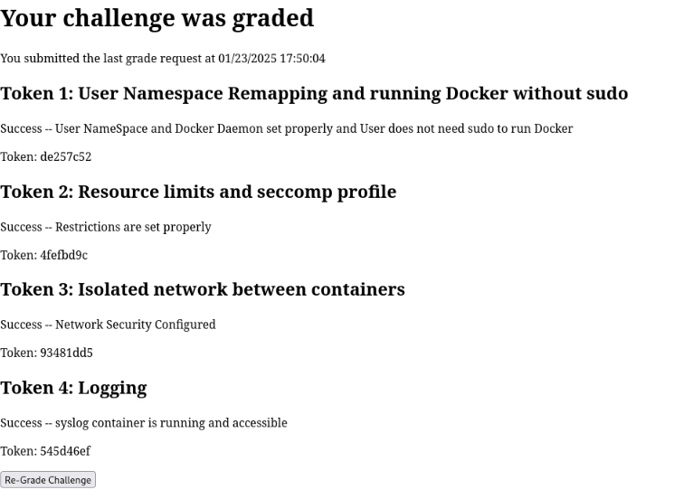

# Uncontained
_Solution Guide_

## Overview

Complete four different Docker challenges. Containers must be running with their configuration to be graded. To see the currently running containers, the user can run `docker ps`. To see the currently available docker images, the user can run `docker image list`


## Part 1: User Namespace and Sudo

After logging into `docker-host1` via ssh, edit the file `/etc/docker/daemon.json` and paste the following code in the file:

```json
{
  "userns-remap": "default"
}
```

Next, add `user` to the `docker` group:

```bash
sudo usermod -aG docker user
```

Finally, restart Docker:

```bash
sudo systemctl restart docker
```

For it to take effect in your session, you must create a new login session.  You can do this by using the `source` command or by logging out and back in.  Once a new session is created, grade your challenge via the browser at `challenge.us`

## Part 2: Resource Limits and Seccomp Profile

Create a file named `ptrace.json`. This file's name and location is not critical, but it will need to be matched in future commands. In the file, type in the following code and save the file:

```json
{
  "defaultAction": "SCMP_ACT_ALLOW",
  "syscalls": [
    {
      "names": ["ptrace"],
      "action": "SCMP_ACT_ERRNO"
    }
  ]
}
```

Next, run the docker images with the `--security-opt` flag specifying the json file. The easiest way to do this is with the simple-web image. I recommend to use a script file, as there will be more changes later:

```bash
docker run -d --name simple-web --rm -p 80:80 \
--memory 1g --cpus 1.0 --blkio-weight 100 \
--security-opt seccomp=ptrace.json \
yeasy/simple-web:latest

```

Visit `challenge.us` and Re-Grade Challenge to receive token.

## Part 3: Docker Isolated Network
First, create the Docker Network. This guide will use the name `app_network`.

```bash
docker network create app_network
```

Next, you must stop and remove the currently running containers:

```bash
docker container stop simple-web
docker container rm simple-web
```

Next, run the two images together using the newly created network with the `--network` flag, isolating the database container and keeping the previous configuration:

```bash
docker run -d --name simple-web --rm -p 80:80 \
--memory 1g --cpus 1.0 --blkio-weight 100 \
--security-opt seccomp=ptrace.json \
--network app_network \
yeasy/simple-web:latest


docker run -d --name my-mysql -e MYSQL_ROOT_PASSWORD=tartans -e MYSQL_DATABASE=mydb \
--memory 1g --cpus 1.0 --blkio-weight 100 \
--security-opt seccomp=ptrace.json \
--network app_network \
mysql:latest
```

Visit `challenge.us` and Re-Grade Challenge to receive token.

## Part 4: Logging

After starting an `ssh` session on `docker-host2`, we can see the available images to build a new image from by running 

```bash
docker image ls
```

This reveals the `token` image. This image is a slightly modified version of the base `ubuntu:latest` image.

First, the syslog service must be enabled. The image does not have rsyslog installed, so a script or program must be made to create the connection. This can be done with a simple python script:

```python
import socket

# Define the server details
HOST = "0.0.0.0"  # Listen on all interfaces
PORT = 514  # Default syslog port

# Create a UDP socket
sock = socket.socket(socket.AF_INET, socket.SOCK_DGRAM)

# Bind the socket to the address and port
try:
    sock.bind((HOST, PORT))
    print(f"Log receiver running on {HOST}:{PORT}")
except Exception as e:
    print(f"Failed to bind to {HOST}:{PORT}: {e}")
    exit(1)

# Infinite loop to receive and print logs
try:
    while True:
        data, addr = sock.recvfrom(1024)  # Buffer size is 1024 bytes
        print(f"Log received from {addr}: {data.decode('utf-8').strip()}")
except KeyboardInterrupt:
    print("Shutting down the log receiver.")
finally:
    sock.close()
```

The name and location of this file is not critical, but it will be needed for later. For the purpose of this guide, it is called `log.py`.

Now a Dockerfile must be created to copy and run the file into a new image:

```dockerfile
FROM token

COPY <PATH TO SCRIPT> /app/log.py

CMD ["python3", "/app/log.py"]
```

Once the Dockerfile is complete, we can create the new image and name it `syslog` by invoking:

```bash
docker build -t syslog .
```

The name of the Dockerfile does not matter. For simplicity, it is named `Dockerfile`, as this is the default name that docker uses to create new images. If you named the Dockerfile something else, you would have to invoke the following:

```bash
docker build -t syslog --file [FILENAME]
```

Then a new container with this image can then be created by invoking:

```bash
docker run --name syslog -p 514:514 -d syslog
```

Visit `challenge.us` and Re-Grade Challenge to receive token.

