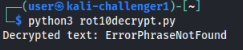
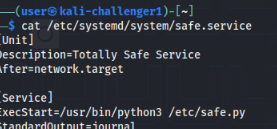
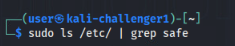

# Covert Conundrum Solution Guide


To find the suspicious network traffic, you first must capture traffic on each subnet until you find the suspicious packets. You can do this by starting an `ssh` session on the VyOS router:

```bash
ssh user@10.5.5.1
```

Then, you can invoke a tcpdump from the VyOS router and pfsense firewall on each network until you find the malicious network traffic.

To save the tcpdump network traffic in a file on the kali machine, you can invoke:

```bash
tcpdump -i [INTERFACE] -w data.pcap
```

and then transfer the file to the kali machine using scp from the kali machine:

```bash
scp user@10.5.5.1:/home/user/data.pcap .
```


## Token 1: Network Spamming


1. To find the spamming network traffic, first run a packet capture on VyOS on the 10.3.3.0/24 network and save it as a pcap file:

    ```bash
    tcpdump -i eth3 -w 10.3.pcap
    ```

    Press Ctrl+C when a few seconds have passed.

    

1. Then exit the ssh session and save the file on the kali machine using `scp`:

    ```bash
    scp user@10.5.5.1:/home/user/10.3.pcap .
    ```

    

1. Then open and analyze the pcap file using Wireshark:

    ```bash
    wireshark 10.3.pcap &
    ```

1. Investigating, we will see that the machine `10.3.3.3` is sending UDP broadcast packets. We can add the filter `ip.addr == 10.3.3.3` to filter out all of the other traffic:

    

1. If you try to `ssh` into the machine, you will notice that you are unable to with the provided credentials, as this machine has been compromised and the passwords have likely changed:

    

1. If we investigate the packet capture further, we will see that the adversary has left clues on how to control this machine remotely. In the packet capture, the UDP broadcast packets have a destination port of 80, and all of them contain seemingly randomized data. However, we will notice that some of them have the same length of data:

    

1. Looking at those, we will notice there is a clue that the data is encrypted using a ROT cipher. We can copy this text by right-clicking on it and selecting Copy Bytes as Printable Text:

    

1. We can decrypt this message using a ROT10 algorithm and get the plaintext using the following Python script. For this example, the file is named `rot10decrypt.py`:

    ```python
    def caesar_cipher_decrypt(ciphertext, shift):
        decrypted_text = []
    
        for char in ciphertext:
            if char.isalpha():
                # Determine if character is uppercase or lowercase
                offset = 65 if char.isupper() else 97
                # Decrypt by shifting backwards
                decrypted_text.append(chr((ord(char) - offset - shift) % 26 + offset))
            else:
                # Non-alphabetic characters remain unchanged
                decrypted_text.append(char)
    
        return ''.join(decrypted_text)


    ciphertext = "ObbybZrbkcoXydPyexn" 
    shift = 10

    decrypted_text = caesar_cipher_decrypt(ciphertext, shift)
    print(f"Decrypted text: {decrypted_text}")
    ```

1. You can run this script by invoking:

    ```bash
    python3 rot10decrypt.py
    ```

    Revealing that the message is "ErrorPhraseNotFound":

    
    

1. Using this information, we can send this passphrase to the machine with another python script, named `spamstopper.py` for the purposes of this guide:

    ```python
    import socket

    def decrypt_passphrase(encrypted_passphrase, key):
        decrypted = ""
        for i in range(len(encrypted_passphrase)):
            decrypted += chr(ord(encrypted_passphrase[i]) ^ ord(key[i % len(key)]))
        return decrypted

    # Hardcoded values
    encrypted_passphrase = "ErrorPhraseNotFound"

    # Create a TCP socket
    client_socket = socket.socket(socket.AF_INET, socket.SOCK_STREAM)
    client_socket.connect(("10.3.3.3", 80))

    # Send the decrypted passphrase to the server
    client_socket.send(encrypted_passphrase.encode())

    # Close the socket
    client_socket.close()
    ```

    and then invoking the script:

    ```bash
    python3 spamstopper.py
    ```

    The machine will accept the passphrase and kill the process. Then you can navigate in a web browser to https://[]()challenge.us and submit for grading to get the first token.

## Token 2: Data exfiltration


1. First, we must perform a packet capture on the network `10.7.7.0` from the pfsense firewall:

    1. Log in to the pfsense in a web browser at `https://10.0.0.1`
    
    - Note that the mapping of networks and interface names

        
    
    1. Navigate to Diagnostics > Packet Capture

        
    
    1. Set the capture options to the DMZ network using `OPT1`

        
    
    1. Start the capture. Let it run for at least 5 seconds, and then stop the capture.
    
    1. By reviewing the capture in the browser, you will notice a connection between `10.7.7.10` and an outside address of `123.45.67.100` on port 54.

        

1. Now that we have identified suspicious traffic, we can remote into the machine using ssh:

    ```bash
    ssh user@10.7.7.10
    ```

1. We can follow the last two steps from part 1 to identify and kill the suspected process:

    ```bash
    sudo cat /proc/[PID]/cmdline
    ```

    

    This will reveal the running python script `/etc/sender.py`

1. We can first inspect the script by invoking 

    ```bash
    cat /etc/sender.py
    ```


    This will reveal that it is sending files from the `/data` directory to the outside address. We will need this information later.

    

1. To kill this file from running persistently, you can rename the file to something else. This way you can keep it and inspect it while preventing whatever process that accesses it from running it by name:

    ```bash
    sudo mv /etc/sender.py senderfile.py
    ```

1. Finally, rebooting the machine will ensure that any process that was dependent on the file will fail to run:

    ```bash
    sudo reboot
    ```

1. Once the machine is back up, you can navigate inside a web browser to http://[]()challenge.us and acquire token #2.

## Token 3: Data Integrity

1. If we inspect the `/data' directory, we will notice there are 100 files encrypted with gpg:

    ```bash
    cd /data
    ls
    ```

    

    We need to find the key to the `.gpg` files and decrypt them.

1. To find the key, we can inspect the python file we renamed previously to `senderfile.py` by using your preferred text editor and inspecting the line containing "sentinel_word":

    

    We can try to see if `ErrorSending` is the phrase we need to decrypt the files by running:

    ```bash
    for file in *.gpg; do gpg --yes --batch --passphrase "ErrorSending" -o "${file%.gpg}" -d "$file"; done
    ```

    This will decrypt all the files within the `/data` directory:

    

    *Be sure to do this again within the `/data/bak` directory*

    Optionally, we can remove all of the `.gpg` files to clean up the space after we have confirmed all of the files have been decrypted:

    ```bash
    sudo rm *.gpg
    ls
    ```

    

1. Next we need to identify the file with obviously false information. To do this, the user can run the following bash script:

    ```bash
    #!/bin/bash
    DIRECTORY="/data"
    COUNTER=0

    for FILE in "$DIRECTORY"/*; do
        # Decode Base64
        #echo "Processing file: $FILE..."
        TEMP=$(mktemp)
        base64 -d "$FILE" > "$TEMP"

        # Use jq to parse and count objects with age > 100
        COUNT=$(jq -r '.[].age' "$TEMP" | awk '{if ($1 > 100) {print}}' | wc -l)

        if [ $COUNT -gt 0 ]; then
            echo "Found $COUNT objects with age over 100 in $(basename "$FILE")"
            COUNTER=$((COUNTER + COUNT))
        fi

        # Clean up the temporary file
        rm "$TEMP"
    done

    echo "Total valid objects found: $COUNTER"

    ```

    This will identify the file with impossible ages is `/data/57user_pii_.txt`

    

1. Next, since the file indicates it holds user data, we must inspect it for integrity issues. The file is a json file encoded in base64. To read its contents, you can invoke:

    ```bash
    cat /data/57user_pii_.txt | base64 --decode 
    ```

    This will reveal 1000 entries of user data. You need to remove any obviously false data. The only data item of each object that could be checked for this is the Age. To identify objects with impossibly large Age numbers, you can invoke:

    ```bash
    cat /data/57user_pii_.txt | base64 --decode | jq -r '.[] | select  (.age > 100)'
    ```

    This will reveal 4 users with the age of 10,000, obviously indicating false data.
    
    

    To fix the data in one line, you can invoke:

    ```bash
    rm /data/57user_pii_.txt && cat /data/bak/57user_pii_.txt | base64 --decode | jq '[.[] | select(.age <= 100)]' | base64 > /data/57user_pii_.txt
    ```

    

    To verify the removal of the data, you can invoke the following:

    ```bash
    cat /data/57user_pii_.txt | base64 -d | grep 10000
    ```

    

    If you accidentally delete all of the contents of the file, you can make a copy of it from the .bak files located in the /data/bak directory.

1. Once the obviously false entries are removed, you can submit for grading token 2.


## Token 4: Keylogger


1. Use the steps to perform the packet capture in part 2, step 1 on the `LAN` interface. You will see a connection to the outside IP on port 80 from an address 10.5.5.x.

    **NOTE:** You will not see this connection unless you are actively typing from kali-challenger1.

    

    

1. Using ssh to login to the machine, you will notice that it is the same machine that you are currently using, `kali-challenger1`.

    

1. We can do similar steps as before to find suspicious systemd services to find suspicious processes:

    ```bash
    ls /etc/systemd/system/
     ```

    This will reveal the `safe.service` file:

    

    We can inspect this file, revealing a python script located in /etc/:

    ```bash
    cat /etc/systemd/system/safe.service
    ```

    

    But searching for this file shows it does not exist:

    ```bash
    sudo ls /etc/ | grep safe
    ```
    
    

    If we check the status of the service, you will notice that it is not running or enabled:

    ```bash
    systemctl status safe.service
    ```

    

1. We can check if there are any running processes with the name "safe" by running:

    ```bash
    ps aux | grep safe
    ```

    This will reveal the running `safe` binary file (or many instances of it) inside `/bin/`:

    

1. There are multiple ways to remove the `safe` process from running. You can either run:

    ```bash
    sudo rm /etc/safe
    ```

    Or you can edit the script that the terminal executes by removing or commenting out the command from the script located at `/usr/sbin/script.sh` using your preferred text editor:

    

    Once either step has been done, you can reboot to ensure that any other processes that relied on this binary file.

1. Once the binary file has been removed from `/bin/` or the script, you can navigate to https://[]()challenge.us to get the final token.