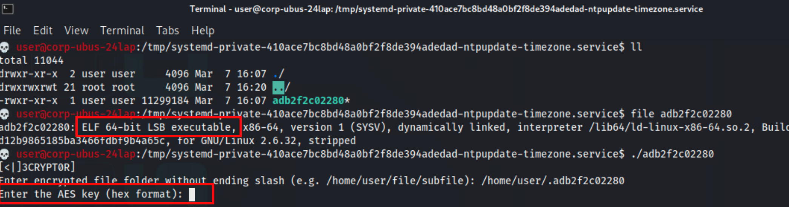
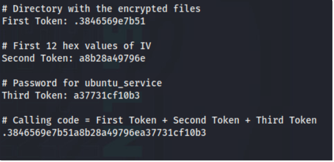

# Ransomware Rhapsody


## Overview (Solution Guide)
🥷 In this challenge, challengers have stumbled upon a compromised system containing a collection of encrypted files. The adversary, in a bashful and hasty fashion, made a critical error on their exit. Your mission is to investigate the remnants of their work and let them know you're on to them.

### Initial Access

Begin this challenge by SSH into the target machine:

```bash
ssh user@10.6.185.57
```

Using the password:

```plaintext
tartans
```


## Question 1: Identifying the Directory 

**Question:** What is the name of the directory (folder only) which contains the encrypted corporate files?

### Solution Approach

We know from the challenge description and intelligence dossier, that this group uses L33T speak regularly and they call themselves "The w4Nt3D."  We should search the file system for any files or directories that stand out based on this information. 

First, we can do a full search for anything owned by our current, compromised user account (narrowed down a bit for brevity sake).  

```bash
find / -user user ! -path '/proc*' 2>/dev/null | more
```

As we review the results, we see a mass of results that look interesting: 


#### Answer
Given the resulting files are in `/home/user/[token1]` where token1 is a directory name beginning with . and containing 12 alphanumeric characters. In our example, `.adb2f2c02280`


### Question 2

**What are the first 12 characters of the AES IV value for decrypting the encrypted corporate files? (numerical values only e.g. (ABCD1234))**

#### Solving Strategy 
To solve this part of the challenge, we will need to figure out _how_ to decrypt the files in our hidden directory found in part 1.  From our initial search, we identified a couple other files that may be of interest: 


The first file `W3_WANT_YOU.zip` is pretty obvious. 
The second file highlighted is a little less obvious, but matches our hidden directory name (without the leading `.`)

Let's inspect these files to see what we can figure out. 

The zip file looks to be a regular, password-protected zip file.


We don't have a password guess at this point, so let's check out the other file too: 


Well we don't have a decryption key either.  We have found the decryptor and our question is about the AES IV value so let's dig in here! 

**Retrieving the AES_IV**

To complete this objective, challengers should view the `encrypted directory` previously found and look at the structure of the files. The file names are the **exact** same length and are the minimum length required for use with decrypting and encrypting AES-CBC based objects.

According `to the intel`, the syndicate likes to place hints in `plain sight`. In this case, the IV is the `name` of *one of these files* (without the extension).


Ok, while one of these filenames is our IV, we still need the key before we can decrypt anything.  Let's try to see what we can get from that zip file.  From our intel, we know that the group uses L33T speak in communications and code - and we have seen some of that up to this point.  


This, filenames, and extensions can give us a good start on developing a pattern.  If we consider the words we've seen up to this point: `[the,wanted,we,are,play,game,shall,want,you]` we can start to build a tailored word list to attempt brute force on the zip password. 

---

This section must be performed ***on our Kali machine*** since the target device does not have hashcat installed and we are living off the land.


First, let's save these words into a file `base_words.txt` by running the command: 

```bash
echo -e "the\nwanted\nwe\nare\nplay\ngame\nshall\nwant\nyou" > base_words.txt
```


Next, let's make a python script to build a rule for `hashcat` to then build us a word list.    

* Pro Tip: Before pasting formatted code like this into vi/vim editor, before entering insert mode, `:set paste` to avoid auto-indentation affecting the formatting.  After pasting your code, `:set nopaste` to get back to normal auto-indent. 

```python
# Generate Hashcat rule file for substitutions and toggles
substitutions = {
    'a': '4', 'e': '3', 'i': '1', 'o': '0', 's': '5', 't': '7'
}
max_length = 10  # Maximum word length

# Generate all substitution combinations (2^6 = 64)
sub_rules = ['']
for letter, repl in substitutions.items():
    new_rules = []
    for rule in sub_rules:
        new_rules.append(rule)  # Without this substitution
        new_rules.append(f"{rule}s{letter}{repl} ".strip())  # With this substitution
    sub_rules = new_rules

# Generate all toggle combinations (2^10 = 1024)
toggle_rules = ['']
for pos in range(max_length):
    new_rules = []
    for rule in toggle_rules:
        new_rules.append(rule)  # Without toggle at this position
        new_rules.append(f"{rule}T{pos} ".strip())  # With toggle at this position
    toggle_rules = new_rules

# Combine all substitution and toggle rules
with open('combined.rule', 'w') as f:
    for sub in sub_rules:
        for tog in toggle_rules:
            rule = f"{sub} {tog}".strip()
            f.write(f"{rule}\n" if rule else ":\n")  # ':' for no transformation
```

Save this file as `makerule.py` and then run it with: 

```bash
python3 makerule.py
```

This creates a file called `combined.rule` in our current directory.  Using this newly built rule, we can run `hashcat` on a list of known base words to generate a full word list based on all permutations of our known words. 

Ok, now using our base words and custom rule, let's use `hashcat` to build a full word list of all permutations: 

```bash
hashcat --stdout base_words.txt -r combined.rule > wordlist.txt
```

Then ensure we remove duplicates: 

```bash
sort -u wordlist.txt > wordlist-unique.txt
``` 

Now that we have our full, unique word list of all possible permutations of the words we have seen this group use, let's get that back onto our target/infected machine. 

```bash
scp wordlist-unique.txt user@10.6.185.57:/home/user/.
```

Now we can go back to our target asset and continue - 

---

At this point, we have `wordlist-unique.txt` on our target machine.  We need to create a python script to attempt all the password combos on our zip file.  

```python
import itertools
import zipfile

def try_password(password, zip_path='/tmp/.cache/W3_WANT_Y0U.zip'):
    """
    Attempts to read a file from the zip using the given password.
    Returns True if successful, False otherwise.
    """
    try:
        with zipfile.ZipFile(zip_path) as zf:
            first_file = zf.namelist()[0]  # Get the first file in the zip
            zf.read(first_file, pwd=password.encode('utf-8'))  # Try to read with the password
        return True
    except Exception:
        return False

# Read the word list from the file
with open('wordlist-unique.txt', 'r') as f:
    words = [line.strip() for line in f]  # Strip whitespace from each line

# Test combinations of 1, 2, and 3 words
for k in range(1, 4):  # 1 to 3 inclusive
    for combo in itertools.product(words, repeat=k):
        password = ' '.join(combo)  # Join words with spaces
        if try_password(password):
            print(f"Success! Password found: {password}")
            exit()  # Stop once the correct password is found
        else:
            print(f"Failed attempt with password: {password}")
```

Save this as `brute.py` and run it against our zip file 

```bash
python3 brute.py
```

The script will stop after the correct password is found. 


NOTE: This example script does not unzip the file, just produces the password.

Next, we can inflate the zip with 

```bash
unzip /tmp/.cache/W3_WANT_Y0U.zip
```  

Then we can review the unzipped content: 


Alternatively, we can view the file contents directly: `cat /tmp/.cache/tmp/.cache/w4Nt3D.txt`  This appears to be the decryptor key we are looking for! 🥳

The format of this key is `raw hex`. We must convert this to numerical hex.  There are several ways to do this, but here is an example from the command line using `python3`:


**Using the Decryter**

We found the decryptor earlier during our `find` results and it is located at `/tmp/systemd-private-410ace7bc8bd48a0bf2f8de394adedad-ntpupdate-timezone.service` and named the same as our token1 answer; in this case, `adb2f2c02280`.  

For ease of use, let's copy this to our home directory: `cp /tmp/systemd-private-410ace7bc8bd48a0bf2f8de394adedad-ntpupdate-timezone.service/adb2f2c02280 .` and then navigate to our home directory `cd`. 


The challenger should then use the decryptor to test the found AES_KEY and AES_IV to try decrypt the `encrypted folder's contents`. A correct key pair yields a success message as seen in the below image.


Rather than individually test all possible IV values (filenames), you guessed it - let's write a script!  

Gather all filenames into `filenames.txt` by running: 

```bash
ls -1 | sed -E 's/\.[^.]+$//' > filenames.txt
```

We'll use this in our script to iterate through all the possible IV values (filenames). 

Create yet another python script `decrypt_files.py`: 

```python
import pexpect
import os

# Configuration
folder_path = "/home/user/.943486f94a18"  # REPLACE with your token1 value
aes_key = "71facf52f45fd1900ca05e461b2a203dfffa13dd4eac0d43f91eeee3e6afe3f8"  # REPLACE with your key
save_directory = os.path.join(os.getcwd(), "decrypted_files")
os.makedirs(save_directory, exist_ok=True)

# Read IVs from filenames.txt, skipping empty lines
with open('filenames.txt', 'r') as f:
    ivs = [line.strip() for line in f if line.strip()]

# Iterate through each IV
for iv in ivs:
    # Use IV as-is (assuming hex format in filenames.txt)
    iv_hex = iv  # If IVs are not in hex, uncomment: iv_hex = iv.encode('utf-8').hex()

    # Spawn a new child process for each attempt
    child = pexpect.spawn("./943486f94a18")  # REPLACE with your program name

    # Send folder path
    child.expect(r".*Enter encrypted file folder.*:")
    child.sendline(folder_path)

    # Send AES key
    child.expect(r".*Enter the Key.*:")
    child.sendline(aes_key)

    # Send IV and check response
    child.expect(r".*IV.*: ")
    child.sendline(iv_hex)

    # Check for success, failure, or unexpected exit
    index = child.expect([
        r".*Enter save directory for decrypted files.*:",  # IV accepted
        r".*no funny stuff.*",                                # IV rejected
        pexpect.EOF                                           # Unexpected exit
    ])

    if index == 0:
        # IV was valid, send save directory
        child.sendline(save_directory)
        child.expect(pexpect.EOF)
        output = child.before.decode()
        if "decryption successful" in output.lower():
            print(f"Success! Decryption completed with IV: {iv}")
            break
        else:
            print(f"Failure with IV: {iv}. Output: {output}")
    elif index == 1:
        # IV caused "no funny stuff" error
        print(f"Failed with IV: {iv}. Error: 'no funny stuff'")
        child.close()
    else:
        # Unexpected EOF
        print(f"Failed with IV: {iv}. Unexpected EOF")
        child.close()

```

* Replace your variables where needed (comments in script)

Run your script and view the successful IV used to decrypt the files.

```bash
python3 decrypt_files.py
``` 

Results: 


##### Answer
The answer to this question is the AES_IV that worked with the AES_KEY to decrypt the files in the home directory hidden folder. In this case `be851c37dc2baa608beef36ad037715b`

### Question 3

**After decryption of the files, what password was discovered for the service user?**

#### Solving Strategy

The solution to this question can be found in several ways however, one approach is very manual and time consuming while the other leans on the fact that we are searching for a password.


The decrypted files may contain credentials. Use the following command to quickly review the first few lines of each file:

```bash
cat * | head -n 10
```

In this case, we find that, what appears to be, binary text is still present. Let's examine the bottom of the files. This can be done using the following command:

```bash
cat <FILE>.wNTD.txt | tail
```

<FILE> is the name of the file to inspect. Looking at the bottom of the file (the purpose of the `tail` command), you will find another phrase that will be used shortly to get new login credentials:

v

Tools such as `binwalk`, `CyberChef` and `XORSearch` can detect the presence of bytes that have been XOR encoded. In this instance, use of the following script will allow you navigate through a file, and examine certain concentrations of bytes that are assumed to have been XOR'd. 

To get the plaintext version of the data present in the file, we'll need a `key`. Fortunately for us, we found a string that can be used as a key (4R3 4r3 w4NTed).

Here's the script in question which can use the key we found to attempt to decode the file we suspect to have credentials for the ubuntu_service account:

```python
import os
import itertools
import string
import argparse
import re

def xor_decrypt_large_file(encrypted_file, output_file, key, chunk_size=4096, preview_size=500):
    """Decrypts an XOR-encrypted file in chunks for large files and extracts readable text."""
    key_bytes = key.encode()
    key_length = len(key_bytes)

    # Get file size
    file_size = os.path.getsize(encrypted_file)
    print(f"🔍 Processing large file: {encrypted_file} ({file_size} bytes)")

    # Read and decrypt in chunks
    decrypted_data = bytearray()
    key_cycle = itertools.cycle(key_bytes)  # Cycle the key

    with open(encrypted_file, "rb") as f_in, open(output_file, "wb") as f_out:
        while chunk := f_in.read(chunk_size):  # Read file in chunks
            decrypted_chunk = bytes([b ^ next(key_cycle) for b in chunk])  # XOR decryption
            decrypted_data.extend(decrypted_chunk)
            f_out.write(decrypted_chunk)  # Write decrypted chunk to output file

    print(f"✅ Decrypted file saved as '{output_file}'")

    # === Extract Readable Text ===
    readable_text = ''.join(chr(b) if chr(b) in string.printable else '.' for b in decrypted_data)

    # Search for possible credential-like patterns
    potential_strings = re.findall(r"[\w@#.$%^&*!-]{4,50}", readable_text)

    if potential_strings:
        print("\n🔍 Potential Credential Candidates:")
        for idx, candidate in enumerate(potential_strings[:10], 1):  # Show top 10 candidates
            print(f"{idx}. {candidate}")

        print("\n⚠️ No strict format assumed—manual verification needed.")
    else:
        print("⚠️ No readable credentials detected.")

    # Optional: Show preview of readable content based on --preview argument
    print(f"\n🔍 Preview of readable content (first {preview_size} characters):")
    print(re.sub(r"[^\x20-\x7E]", ".", readable_text[:preview_size]))  # Show limited preview based on user input

if __name__ == "__main__":
    parser = argparse.ArgumentParser(description="Decrypt a large XOR-encrypted file and extract plaintext credentials.")
    parser.add_argument("-i", "--input", required=True, help="Path to the encrypted file")
    parser.add_argument("-o", "--output", required=True, help="Path to save the decrypted file")
    parser.add_argument("-k", "--key", required=True, help="Decryption key (must match encryption key)")
    parser.add_argument("-c", "--chunk", type=int, default=4096, help="Chunk size for processing large files (default: 4096 bytes)")
    parser.add_argument("-p", "--preview", type=int, default=500, help="Number of readable text characters to preview (default: 500)")

    args = parser.parse_args()
    
    xor_decrypt_large_file(args.input, args.output, args.key, args.chunk, args.preview)
```

This script allows challengers to examine specific sizes and chunks (-c) of files. The wider the area previewed (-p) and chunk size, the more vision we have of the decoding process at any given time.

This is the result of using the script:


```plaintext
ubuntu_service / <password>
```

##### Answer

The `<password>` for `ubuntu_service` found in the decrypted files.


### Question 4 

**After your call with an important person, what is the final "token" the syndicate has left you?**

#### Solving Strategy

The solution to this particular question can be found by "calling the adversary" using the `Call_Mom` binary found on the `Desktop` of the `ubuntu_service` user:


Please note that the user must `ssh` back into the system as `ubuntu_service` as opposed to using `sudo` to change user:


To start `call home` to the syndicate use the binary named below to advance the challenge towards the final token:

```bash
./Call_Mom
```

If the wrong password is entered, the following behavior presents itself:


To create the final password, the challenger must heed the words of the README:


The README hints to "unity" and "as they are received" - this is to lead us to the calling code (password) by combining all three tokens we have received so far. 



After leaving a message (answering the prompt), the binary will simulate a call from the adversary apologizing for not being as crafty as they should have.

As a thank you for catching their mistake, a final token is left for the challenger:


##### Answer
As this is an infinity token (randomized), your submission may vary however, it will be shown as `Final Token: <TOKEN>` in your terminal window after execution.