# Surfin' Safari

*Solution Guide*

## Question 1

*What is the ID of the only animal that is roaming in the Nadari Plains region?*

1. [On Kali] Connect to `collector` using SSH

`ssh user@10.5.5.101`

The password is `tartans`

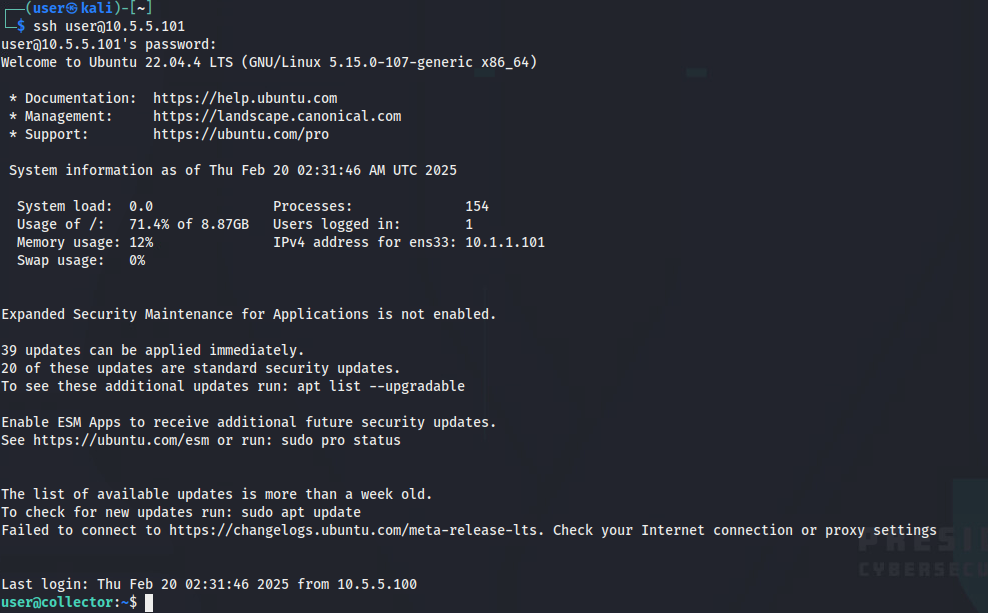

2. [On Collector] Identify the interface that is on the same network as `tracker`

`ip a`

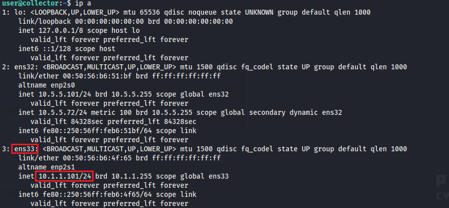

`tracker` is on the `10.1.1.1/24` network, so the corresponding interface is `ens33`

3. [On Collector] Create a packet capture of the UDP traffic using `tcpdump`

`sudo tcpdump -i ens33 -w udp.cap`

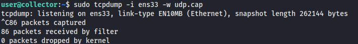

Make sure to wait at least a minute to capture enough traffic.

4. [On Kali] Use scp to transfer the packet capture on to the Kali machine for analysis

`scp user@10.5.5.101:~/udp.cap ~/`

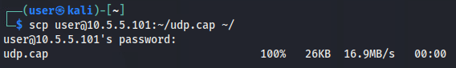

5. [On Kali] Open the packet capture using Wireshark and inspect the UDP traffic

You can use the `udp` filter in Wireshark to filter the traffic. 

Click on any of the UDP packets sent from the tracker (`10.1.1.102`) to the collector (`10.1.1.101`). Then, right-click on the `Data` field from within the packet dissection and select `Copy -> Value`

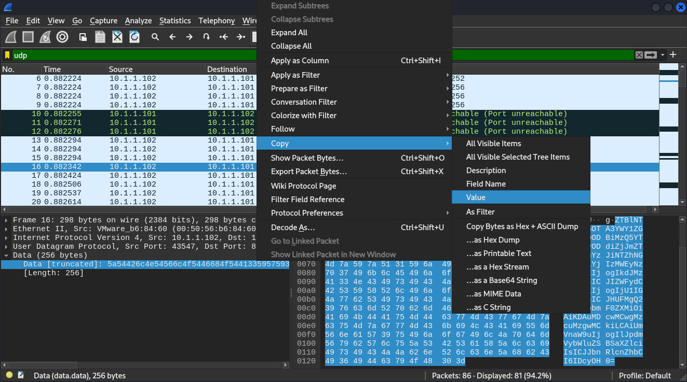

6. [On Kali] Convert the payload into text

The copied data from the previous step is stored in your clipboard as a hexadecimal string. You can try to print this data as text using this command: `echo -n "<YOUR COPIED DATA>" | xxd -r -p`

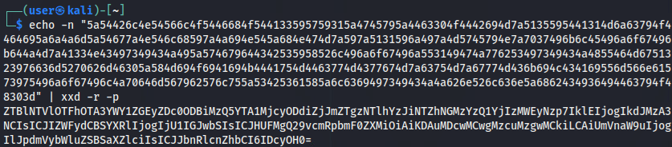

This result appears to be base64-encoded. Perform a base64-decoding to obtain the plaintext. 

`echo -n "<YOUR COPIED DATA>" | xxd -r -p | base64 -d`

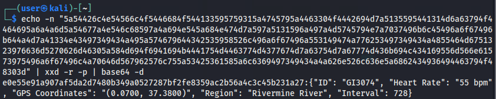

In this example, the result is:

```plain
e0e55e91a907af5da2d7480b349a0527287bf2fe8359ac2b56a4c3c45b231a27:{"ID": "GI3074", "Heart Rate": "55 bpm", "GPS Coordinates": "(0.0700, 37.3800)", "Region": "Rivermine River", "Interval": 728}
```

From this, we can infer that the structure of the payload is in this format: `base64(hmac(json(record)):json(record))`

7. [On Kali] Use tshark to parse the UDP packets in bulk

In the previous step, we were able to decode a single UDP packet. However, to answer the question, it would be beneficial to parse the packets in bulk so the requested data can be found more easily. 

The following command will use tshark to parse the packet capture, extract the udp payload, and then loop through each packet to convert payload back into readable text. 

`tshark -r udp.cap -Y "udp" -T fields -e data | awk 'NF' | while read -r line; do echo "$line" | xxd -r -p | base64 -d; echo ""; done`

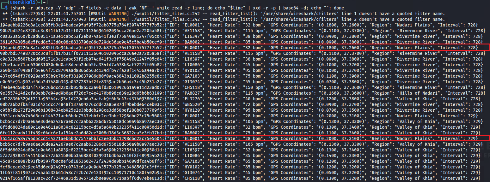

From this output, you should be able to visually find the records that are located in the "Nadari Plains" region. In this example, the animal ID located in that region is `EL0001`, which is the answer for this question. 

## Question 2

*What is the ID of the animal that is being sent by the poachers (i.e. does not have a valid HMAC)?*

1. Write a UDP server to listen for the tracker data

The tcpdump method was sufficient to answer Question 1, but validating the HMAC adds a level of complexity that will make solving Question 2 harder to do entirely from the command line. Instead, write a UDP server that will listen for the tracker data. 

```py
import hmac
import hashlib
import json
import socket
import base64

HMAC_KEY = b'\x00\xc7\x74\x63\xdd\x57\x1c\xe3' # This is the HMAC Key as indicated in the prompt

def start_tracker_server():
    server_socket = socket.socket(socket.AF_INET, socket.SOCK_DGRAM)
    server_socket.bind(('10.1.1.101', 8000)) # The IP address and port are indicated in the prompt 

    while True:
        data, addr = server_socket.recvfrom(4096)

        decoded_data = base64.b64decode(data) # Perform a base64 decode of the UDP packet's payload
        hmac_digest, json_data = decoded_data.split(b':', 1) # Split the payload into two parts - the first part is the HMAC and the second part is the JSON-encoded animal tracker data
        hmac_object = hmac.new(HMAC_KEY, json_data, hashlib.sha256) # Calculate the HMAC of the JSON data

        record = json.loads(json_data.decode()) # Convert the JSON data into a Python dict object

        if hmac_object.hexdigest() != hmac_digest.decode(): # Check if the HMAC in the packet is correct
            print(f"Invalid HMAC: {record['ID']}")
            continue

start_tracker_server()
```

Save this script in a file named `collector.py`

2. Run the UDP server on the `collector` and look at the invalid HMACs

`python3 collector.py`

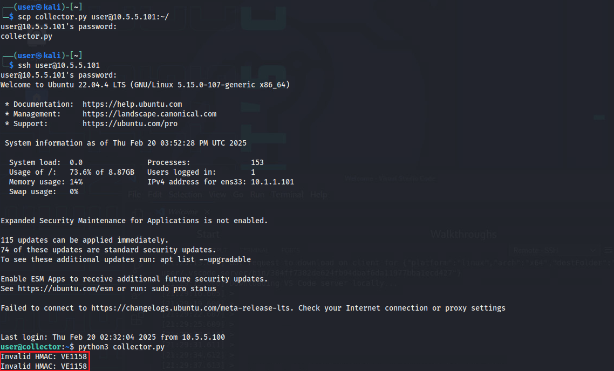

You should be able to see that the Animal ID with the invalid HMAC. In this example, it is "VE1158". 

## Question 3

*What is the token you receive after completing the Grading Check at `challenge.us` for successfully responding to valid data requests for animal data?*

1. Write a UDP server to validate the public key from incoming requests sent in the Grading Check

```py
import socket
from cryptoutil import *

pub_key = read_key('public_key.pem')

def start_sharing_server():
    server_socket = socket.socket(socket.AF_INET, socket.SOCK_DGRAM)
    server_socket.bind(("10.5.5.101", 9000))

    while True:
        data, addr = server_socket.recvfrom(4096)

        # Skip any requests from invalid public keys
        if pub_key.export_key().decode() != data.decode():
            print(f"Public key from {addr} is invalid")
            continue
        else:
            print(f"Public key from {addr} is valid") 

start_sharing_server()
```

Save this script as a file called `server.py`

2. Run a Grading Check to test if the public key validation works

Start the server using `python3 server.py`, then visit `challenge.us` to initiate a Grading Check

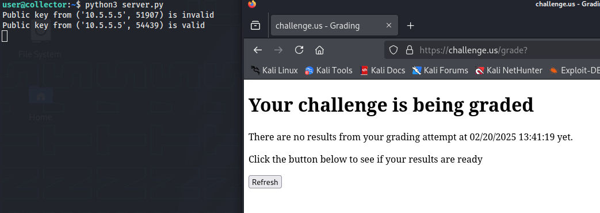

You should see that one request passes and one request fails.

3. Merge the `collector.py` and `server.py` files into a single program to listen to UDP traffic from the `tracker` and UDP traffic from the Grading Checks.

```py
import socket
import base64
import json
import hmac
import hashlib
import threading

from cryptoutil import *

HMAC_KEY = b'\x00\xc7\x74\x63\xdd\x57\x1c\xe3' # This is the HMAC Key as indicated in the prompt

pub_key = read_key('public_key.pem')

# Shared
latest_animal_records = { }
lock = threading.Lock()

def start_tracker_server():
    global latest_animal_records
    server_socket = socket.socket(socket.AF_INET, socket.SOCK_DGRAM)
    server_socket.bind(("10.1.1.101", 8000))

    while True:
        data, addr = server_socket.recvfrom(4096)

        decoded_data = base64.b64decode(data)
        hmac_digest, json_data = decoded_data.split(b':', 1)
        hmac_object = hmac.new(HMAC_KEY, json_data, hashlib.sha256)

        record = json.loads(json_data.decode())

        # Skip any requests from invalid sources
        if hmac_object.hexdigest() != hmac_digest.decode():
            continue

        with lock:
            latest_animal_records[record['ID']] = record

def start_sharing_server():
    global latest_animal_records
    server_socket = socket.socket(socket.AF_INET, socket.SOCK_DGRAM)
    server_socket.bind(("10.5.5.101", 9000))

    while True:
        data, addr = server_socket.recvfrom(4096)

        # Skip any requests from invalid public keys
        if pub_key.export_key().decode() != data.decode():
            print(f"Public key from {addr} is invalid")
            continue
        
        print(f"Public key from {addr} is valid")
        
        with lock:
            encrypted_data = encrypt_message(pub_key, json.dumps(latest_animal_records, sort_keys=True))
            server_socket.sendto(encrypted_data, addr)

if __name__ == "__main__":
    thread1 = threading.Thread(target=start_tracker_server)
    thread2 = threading.Thread(target=start_sharing_server)

    thread1.start()
    thread2.start()

    thread1.join()
    thread2.join()
```

Save this script as a file called `combined.py`

4. Run a Grading Check on the new `combined.py` server

Start the server using `python3 combined.py`, then visit `challenge.us` to initiate a Grading Check

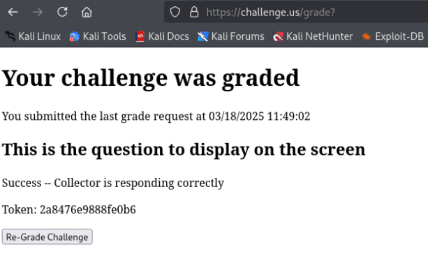

In this example, the token from the Grading Check is `2a8476e9888fe0b6`

## Question 4

*What is the token you receive from successfully decrypting `~/encrypted/token.txt.enc` for user@ransomware?*

1. Download the known plaintext notes file from `challenge.us/files`

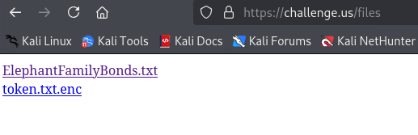

2. Open the `encryptor` in Ghidra and look through the different "Functions" in the "Symbol Tree" panel to determine the crypto algorithm

The symbols were removed during the compilation process, so there are no helpful function names. However, Ghidra decompilation of one of the functions shows a series of left bit rotations of: `0x10`, `0x0c`, `0x08`, `0x07` or `16`, `12`, `8`, and `7` in decimal. 

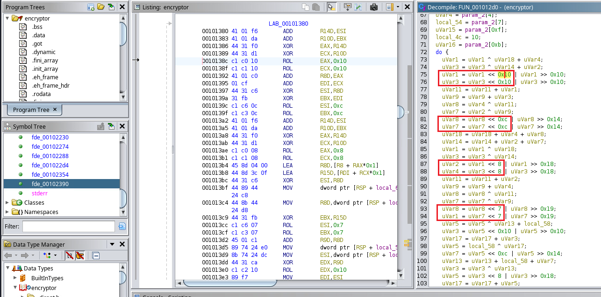

Search online for crypto algorithms that perform left bit rotations of `16`, `12`, `8`, and `7`. The `chacha20` algorithm should appear. It performs left bit rotations with those values in its `quarter-round` function. This indicates that the encryptor program is likely using the chacha20 algorithm. 

3. Identify possible vulnerabilities in the encryption

The results for an online search of "chacha20 vulnerabilities" will show that nonce re-use is one of the top vulnerabilities associated with the chacha20 algorithm. 

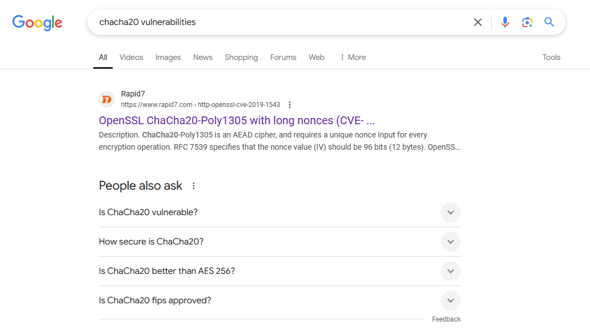

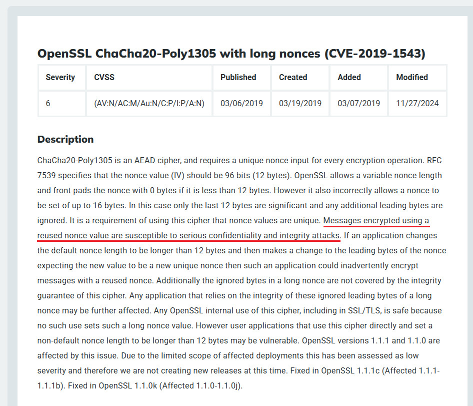

Since this challenge provides both the plaintext and ciphertext versions of the same file (i.e. `ElephantFamilyBonds.txt` and `ElephantFamilyBonds.txt.enc`), it is possible to generate the keystream used in the encryption of that file. If the same nonce was also used to encrypt `token.txt.enc`, then it would be possible to use the same keystream to decrypt the `token.txt.enc` file. 

Here is the mathematical explanation for this attack:

```plain
C1 = Ciphertext1
P1 = Plaintext1
K1 = Keystream1

C2 = Ciphertext2
P2 = Plaintext2
K2 = Keystream2

K1 = C1 ⊕ P1
K2 = C2 ⊕ P2

---

K1 = K2             <- If the same encryption key and nonce are used to encrypt both files, then K1 and K2 are the same.
C1 ⊕ P1 = C2 ⊕ P2   <- Keystream is equal to ciphertext XOR plaintext
C1 ⊕ P1 ⊕ C2 = P2   <- To obtain the plaintext for file2, we need to XOR the ciphertext and plaintext of file1 with the ciphertext of file2

```

3. Write a script to generate the keystream for the known file (`ElephantFamilyBonds.txt`) and use that to decrypt `token.txt.enc`

```py
import sys
import os

def keystream_crypt(p1_filepath : str, c1_filepath : str, c2_filepath : str, p2_filepath : str):
  # Resolve relative filepaths to absolute paths
  p1_filepath = os.path.abspath(p1_filepath)
  c1_filepath = os.path.abspath(c1_filepath)
  c2_filepath = os.path.abspath(c2_filepath)
  p2_filepath = os.path.abspath(p2_filepath)

  # Read the plaintext and ciphertext files as raw bytes
  with open(p1_filepath, 'rb') as p1_file:
    p1 = p1_file.read()
  with open(c1_filepath, 'rb') as c1_file:
    c1 = c1_file.read()
  with open(c2_filepath, 'rb') as c2_file:
    c2 = c2_file.read()

  # Calculate the keystream
  keystream = bytearray()
  for i in range(len(p1)):
    keystream.append(p1[i] ^ c1[i])

  # Decrypt the second ciphertext
  p2 = bytearray()
  length = min(len(keystream), len(c2))
  for i in range(length):
    p2.append(c2[i] ^ keystream[i])

  # Write the decrypted plaintext to the output file
  with open(p2_filepath, 'wb') as p2_file:
    p2_file.write(p2)

if __name__ == "__main__":
  if len(sys.argv) != 5:
    print("Usage: python solver.py <p1_filepath> <c1_filepath> <c2_filepath> <p2_filepath>")
    sys.exit(1)
  
  p1_filepath, c1_filepath, c2_filepath, p2_filepath = sys.argv[1:5]
  keystream_crypt(p1_filepath, c1_filepath, c2_filepath, p2_filepath)
```

Save this script as `decrypt.py`

4. Run the decryption program

`python3 decrypt.py <path_to_ElephantFamilyBonds.txt.enc> <path_to_ElephantFamilyBonds.txt> <path_to_token.txt.enc> <path_to_save_token.txt>`

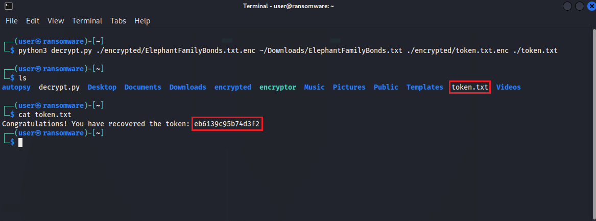

After a successful decryption, you should see the token in plaintext. In this example, the token is: `eb6139c95b74d3f2`.
