# Velocity

*Solution Guide*

## Getting Started
`Velociraptor` is a powerful tool that can be used to collect data from multiple nodes at a time.
`Velociraptor` uses `VQL (Velociraptor Query Language)` to power its collections/hunts. 
We can write our own VQL or we can select from a number of built-in queries called artifacts.

### Steps

1. Let's start by creating a simple hunt using a built-in artifact. 
Select the `Crosshairs icon` from the menu on the left and then select the `+ sign` to create a new hunt.

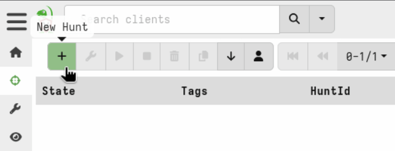

2. Next, we can select from a number of different options to configure our hunt.
Let's leave the defaults and give our hunt a description like `Process List`:

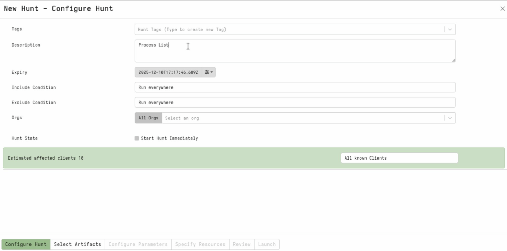

3. Next, press on `Select Artifacts`. Let's use the built-in `Linux.Sys.Pslist` artifact to get the process lists of all of our nodes. We can find this by typing `Linux.Sys.Pslist` into the **search bar** (white box) above the list of artifact types:

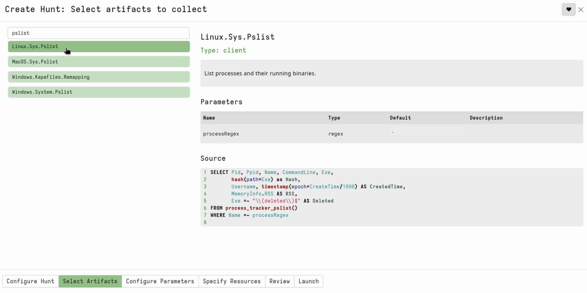

4. After clicking `Linux.Sys.Pslist` (highlighted in green), we select an artifact we can configure the artifact further still. For now, let's just use all of the defaults, which means that this artifact will give the full process list of each node.

We can skip the other tabs (bottom of the screen) and click on the `Launch tab` to create a `hunt`. After creating the hunt, we still need to run it. 

5. Select the hunt from the `pane` on the next screen and click the **"Run Hunt"** (play button icon) to run it. The State will now turn into an hourglass:

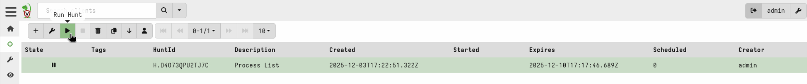

6. After the Hunt is completed, we can see when it was finished in the `Overview` tab:

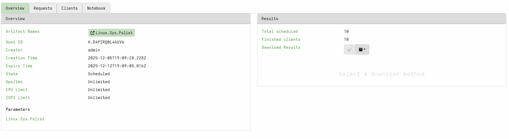

7. Next, we can look through the Requests, Clients, and Notebook tab. The `Notebook tab` is particularly useful for looking through the full results of the hunt. Here we will see the full process list of every node: 

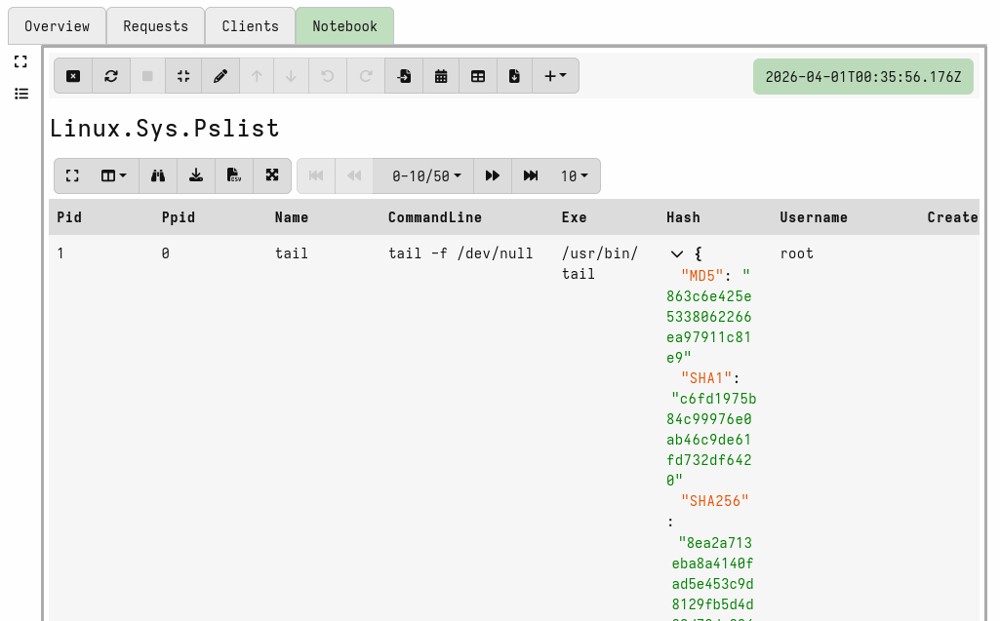

We need to click on the `Edit` cell button in the toolbar above the artifact name (if you don't see this toolbar, simply click anywhere inside the notebook and it will appear). 

8. Next, edit the cell `VQL` by removing the `LIMIT` line, then save your changes. After this hit the `Recalculate button` to ensure that all results from the hunt get passed into the notebook. We must repeat this for every `hunt` that we run.

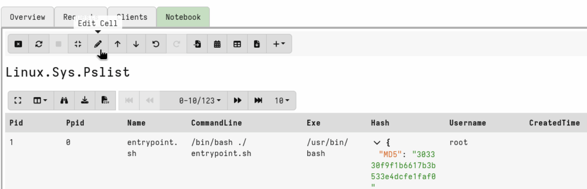

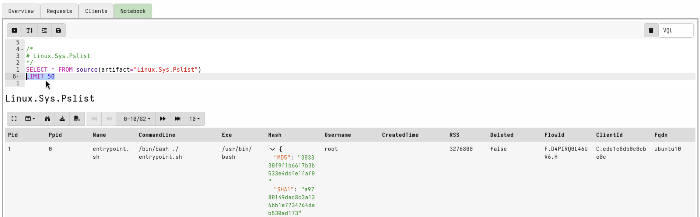

9. After this we can look through all of the results of our hunt, and we can filter and sort based on each of the returned fields (i.e. Pid, Ppid, Name, CommandLine, etc.).

It is important to note that the `fqdn` field is the hostname of the node.

> **Remediation Rule:** Discovering a valid token within an artifact confirms that the artifact is malicious and requires remediation. After extracting a token, remove or restore the associated malware and verify the fix by running the grader at `http://grader`.

<details><summary>IMPORTANT: Creating our own artifacts</summary>
💡 We can also create our own artifacts by clicking on the wrench icon on the toolbar on the left. Next, we can click the plus sign to create a new artifact, where we can enter our own custom VQL.

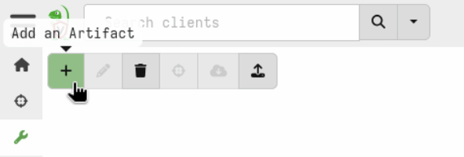

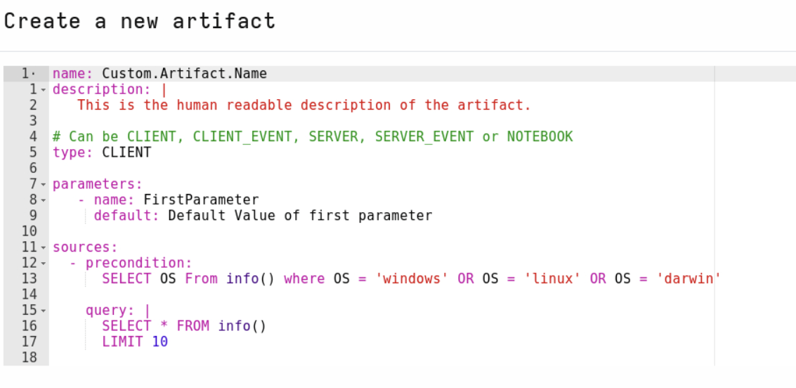

</details>

## Token 1
Let's start by viewing the process list of each node.
If we run a `Linux.Sys.Pslist` hunt, we can view all of the results in the notebook.
We can filter on a variety of fields, and if we filter on the deleted field we will find that two hosts have an executable marked as deleted.
It appears that the `vsftpd` service on `ubuntu02` and `ubuntu03` is actually running a deleted binary called `vsftp`.

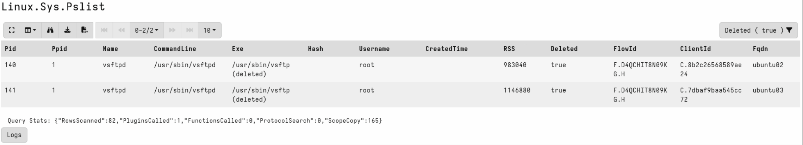

From here we can login to one of the nodes directly and further investigate the binary.

```bash
#on kali
ssh user@ubuntu02
```

Once we are on the ubuntu host we can elevate to root.
We will do this everytime we connect to a host.

```bash
#on ubuntu host
sudo bash
```

We can dump the deleted process with the command:

```bash
cp /proc/$(pgrep vsftpd)/exe /tmp/vsftp
```

If we run `strings` on the binary we will see that there seems to be a debug functionality.
If we run the process with `--debug` we can see that it prints `Entering debug mode…` and then waits.

```bash
strings /tmp/vsftp | grep -b5 debug
/tmp/vsftp --debug

<Ctrl+C>
```

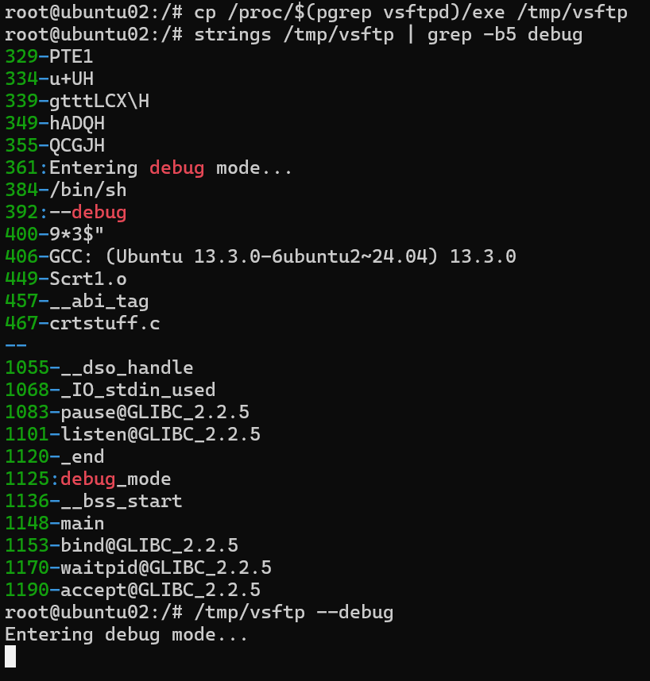

It's possible that the token is written to the stack in debug mode.
If we can show the stack right before the program hangs, we can potentially get the token.
Let's run the process in debug mode with `gdb`.
We can see there is a function called `debug_mode`.

```bash
gdb /tmp/vsftp
```

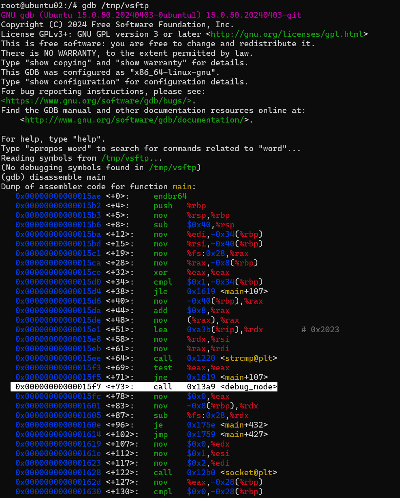

We can set a breakpoint at that function and run in debug mode.

```bash
#in gdb
break debug_mode
run --debug
disassemble debug_mode
```

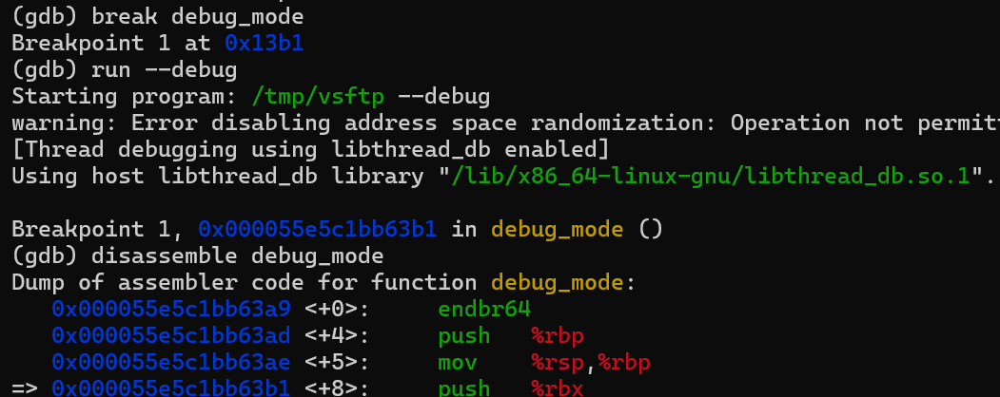

Set a breakpoint at the address of the instruction immediately before the call to `pause`. This should be a `movb` instruction.
Continue execution and then print the string on the stack and get the token.

```bash
#in gdb
break *<address of instruction before call to pause>
continue
x/s $rsp
```

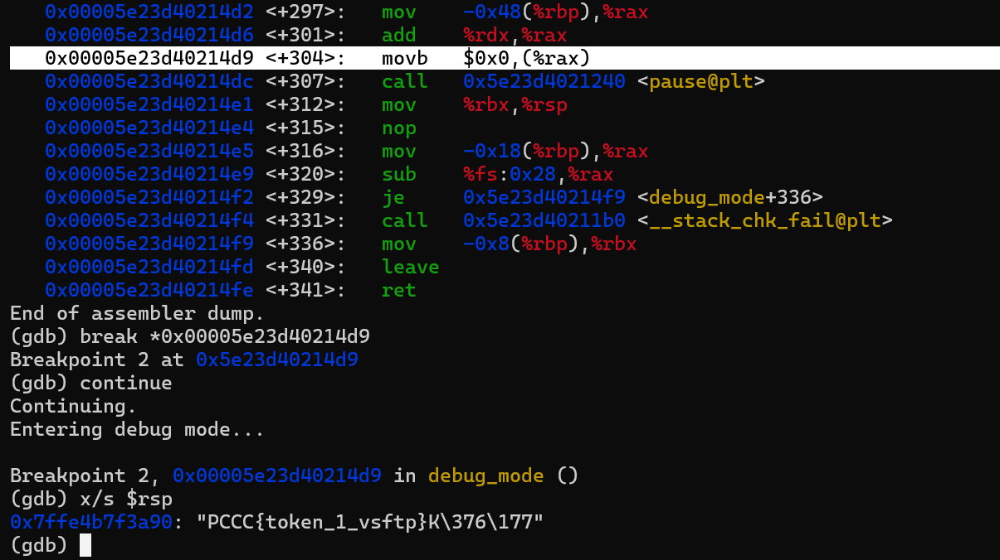

`PCCC{token_1_vsftp}`

### Remediation

Remediation required on `ubuntu02` and `ubuntu03`.

For remediation, all we have to do is kill the `vsftpd` process and then start the `vsftpd` service.

```bash
pkill vsftpd
service vsftpd start
```

If we grep for `deleted` in the process maps we can verify that the correct executable is running (we should get no results from the grep command).

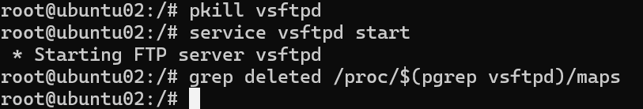

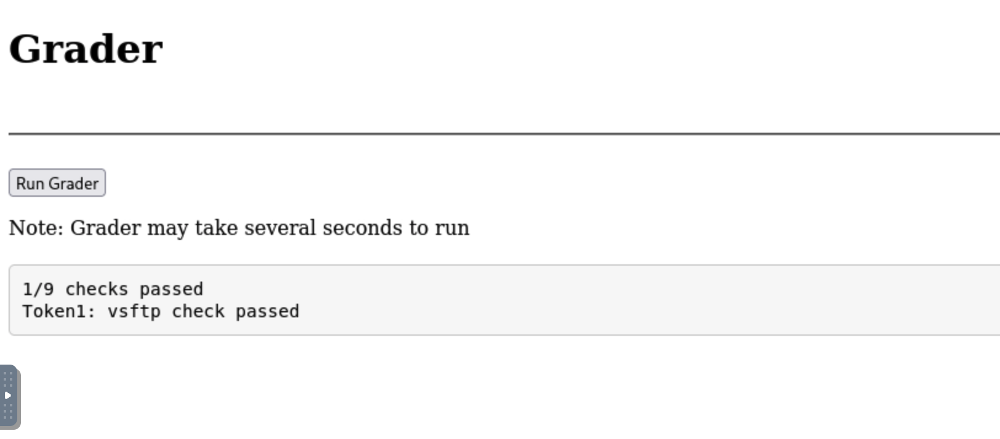

## Token 2
If we want to look even deeper into running processes, we can examine proc maps with the `Linux.Sys.Maps` artifact. If we run a `Hunt` with this artifact we can find some interesting things, like loaded modules.

Before continuing, be sure to create a new Hunt containing this mapping as the result will be our reference point for investigation:

Let's look at individual processes, starting with `apache2`. We can use the filter, and then search by process name.

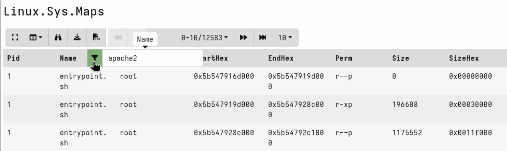

We can use the stack feature to show all filenames:  
* If we sort by filename, a new button called stack will appear. 
* If we click this button, we will see a list of all the filenames and the number of times they appear.  

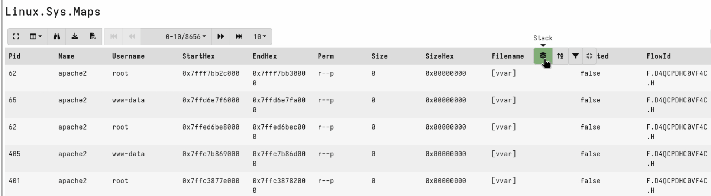

If we sort the stack by count, we will notice that there is a module called `mod_authx_core.so` which has a rather low count of 30.
What's interesting is that there are other modules with similar names like `mod_authn_core.so` and `mod_authz_core`, however they both have counts of 255.
In fact, `mod_authx_core` is the only module that doesn't have a count of 255: 

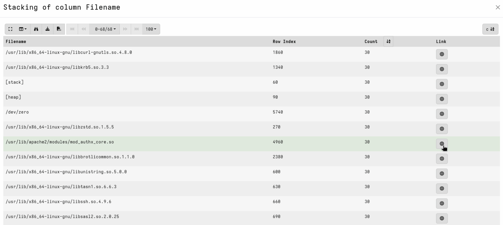

This implies that this module only exists on a small number of hosts rather than on every host in the network.
We can then refine our search by filtering on the `mod_authx_core` filename.
If we apply this filter and then select the fqdn stack we will see that this module only exists on `ubuntu05` and `ubuntu07`.

Let's login to `ubuntu05` and further investigate this module.

We can get this token rather easily by running `strings` and then putting the resulting token ciphertext through `ROT13`:

```bash
strings /usr/lib/apache2/modules/mod_authx_core.so | grep -oE "[A-Z]+\{.*\}" | tr 'a-zA-Z' 'n-za-mN-ZA-M'
```

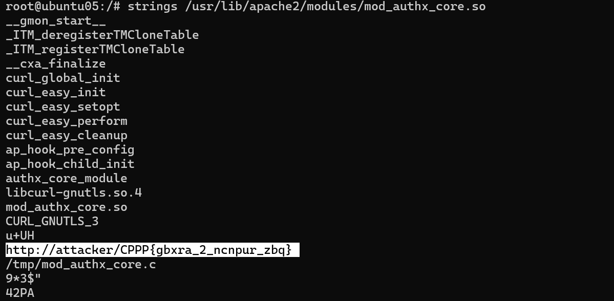

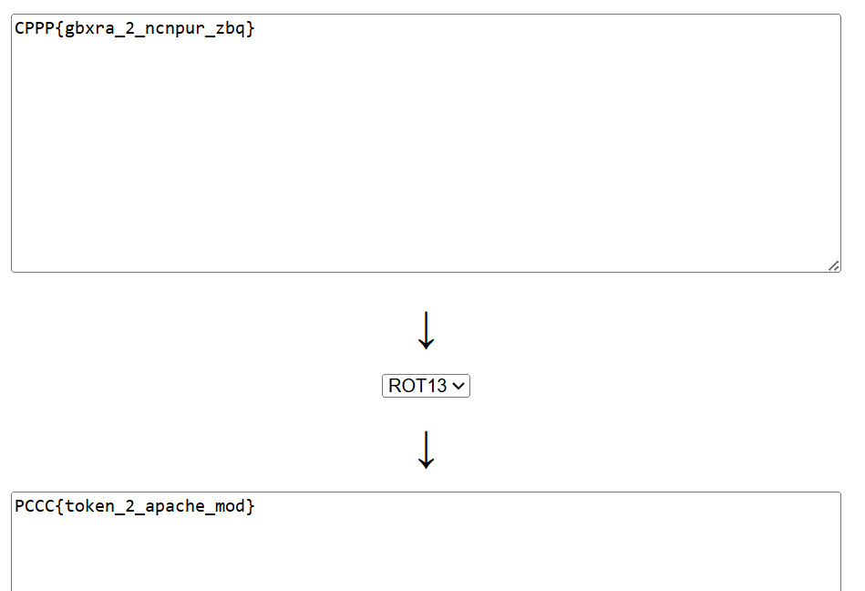

`PCCC{token_2_apache_mod}`

### Remediation

Remediation required on `ubuntu05` and `ubuntu07`.

For remediation we need to delete the `mod_authx_core.so` file as well as `/etc/apache2/mods-enabled/authx_core.load` and then we can restart the server.

Note: If we delete only the .so and not the .load file. Attempting to restart will give us an error message pointing to `/etc/apache2/mods-enabled/authx_core.load`, which helps us understand that we need to delete this file as well.

```bash
rm /usr/lib/apache2/modules/mod_authx_core.so
rm /etc/apache2/mods-enabled/authx_core.load
service apache2 restart
```

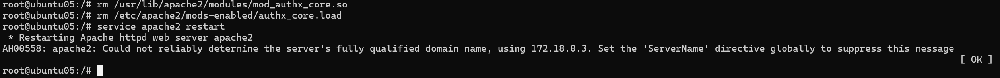

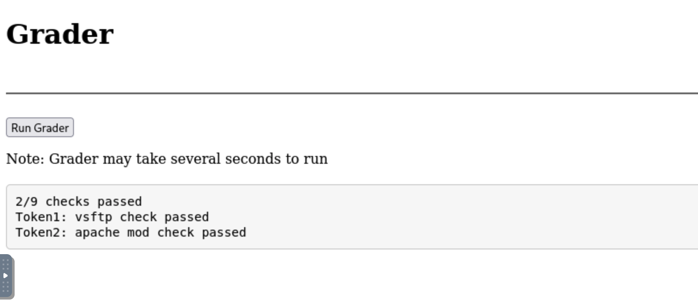

## Token 3
We can continue to look for anomalies in other processes. If we filter on `http_dev_server` and view the fqdn stack we'll see that this process has an additional entry on `ubuntu01` and `ubuntu05`. This means that there is an additional item in the process maps.

If we ssh to `ubuntu01` we can see that there is an empty executable region in the `http_dev_server` process memory, this is often a sign of process injection.

We can view this memory region using the `dd` and `hexdump` commands. This shows us some shellcode which pushes the token onto the stack and executes a shell:

```bash
cat /proc/$(pgrep http_dev_server)/maps
addr=0x$(cat /proc/$(pgrep http_dev_server)/maps | grep r-xp | grep -Ev "vdso|/" | cut -d '-' -f 1)
dd if=/proc/$(pgrep http_dev_server)/mem bs=1 skip=$(($addr)) count=128 2>/dev/null | hexdump -C
```

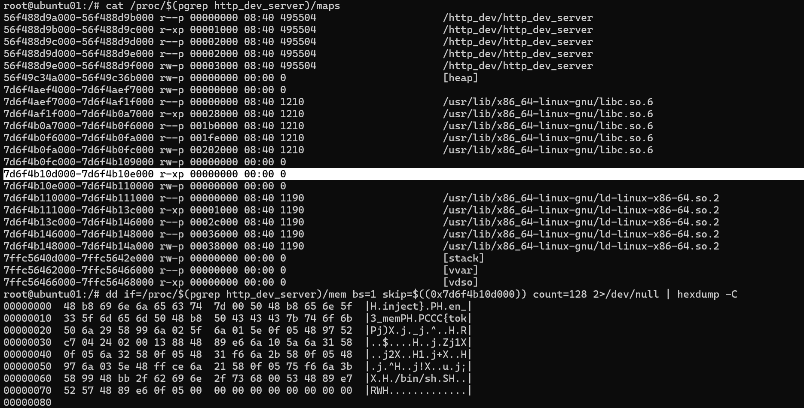

We can also get the full token string from the stack.

```bash
gdb attach $(pgrep http_dev_server)

#in gdb
x/32bc $rsp
x/s $rsp+8
```

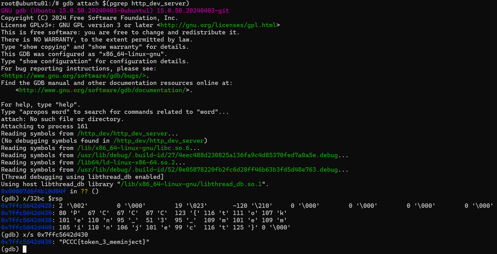

`PCCC{token_3_meminject}`

### Remediation

Remediation required on `ubuntu01` and `ubuntu05`.

For remediation, all we have to do is kill the `http_dev_server` process and then start it again. After restarting the server, we can verify that it no longer has the anonymous, executable memory region.

```bash
pkill http_dev_server
/http_dev/http_dev_server &
```

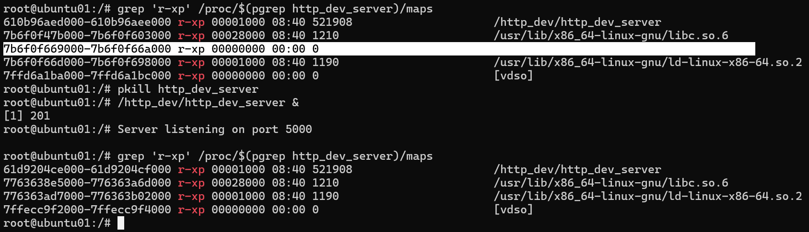

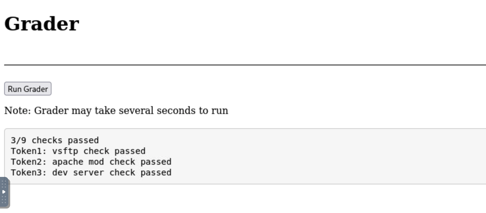

## Token 4
If we shift gears away from running processes for a moment, we can try enumerating services on the hosts. There is a built-in artifact for enumerating linux services but only using `systemctl`. 

Since our nodes do not have this capability, we can just as easily list the files in the `/etc/init.d` directory. Use the `Generic.Collectors.File` artifact and set its parameters to get all files in `/etc/init.d/*`.

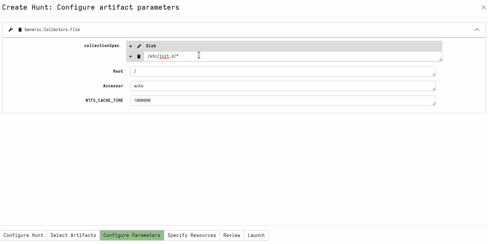

If we run the hunt, we can then view the Fqdn stack and sort by count. We'll notice that `ubuntu04`, and `ubuntu10` have 10 files in the `init.d` directory while all other hosts have 9.

Let's compare `ubuntu04` with a host that has a normal file count like `ubuntu01`. We can edit the notebook vql to only show these two Fqdn's:

```sql
SELECT * FROM source(artifact="Generic.Collectors.File/All Matches Metadata") WHERE Fqdn = "ubuntu04" OR Fqdn = "ubuntu01"
```

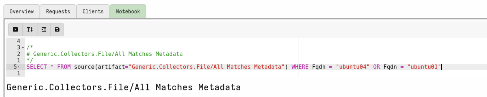

Next, we can sort by SourceFile and we'll see that the `apache` file is the only file that exists on `ubuntu04` but not on `ubuntu01`.

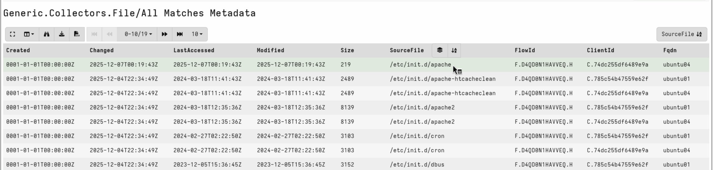

Let's login to `ubuntu04` and examine the `apache` file.

```bash
cat /etc/init.d/apache
```

We can see that the file is a bash script that uses a temporary script to run a command decoded from base64.

If we decode the base64 string ourselves, we'll see that the command creates a user called `eviluser`, who's password is the next token. We can check `/etc/passwd` to verify that `eviluser` does, in fact, exist:

```bash
grep base64 /etc/init.d/apache | cut -d ' ' -f 2 | base64 -d
grep eviluser /etc/passwd
```

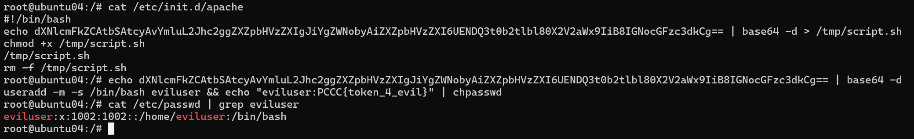

`PCCC{token_4_evil}`

### Remediation

Remediation required on `ubuntu04` and `ubuntu10`.

For remediation we need to delete the malicious `apache` service and delete the `eviluser` account.

```bash
rm /etc/init.d/apache
userdel -r eviluser
```

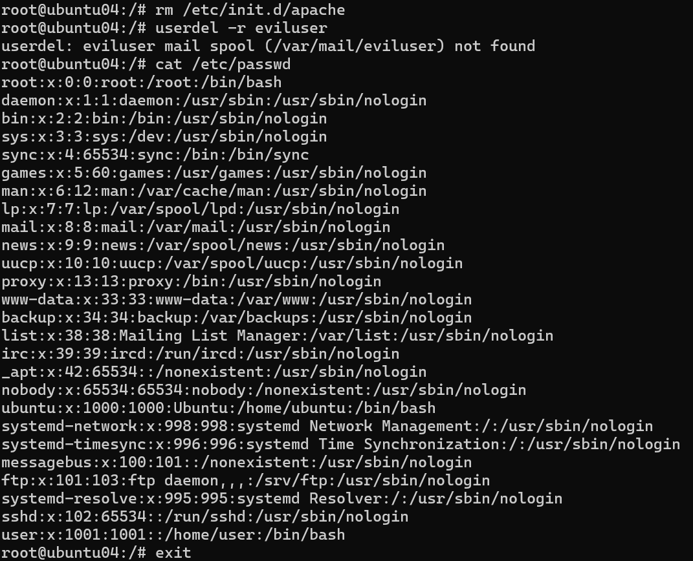

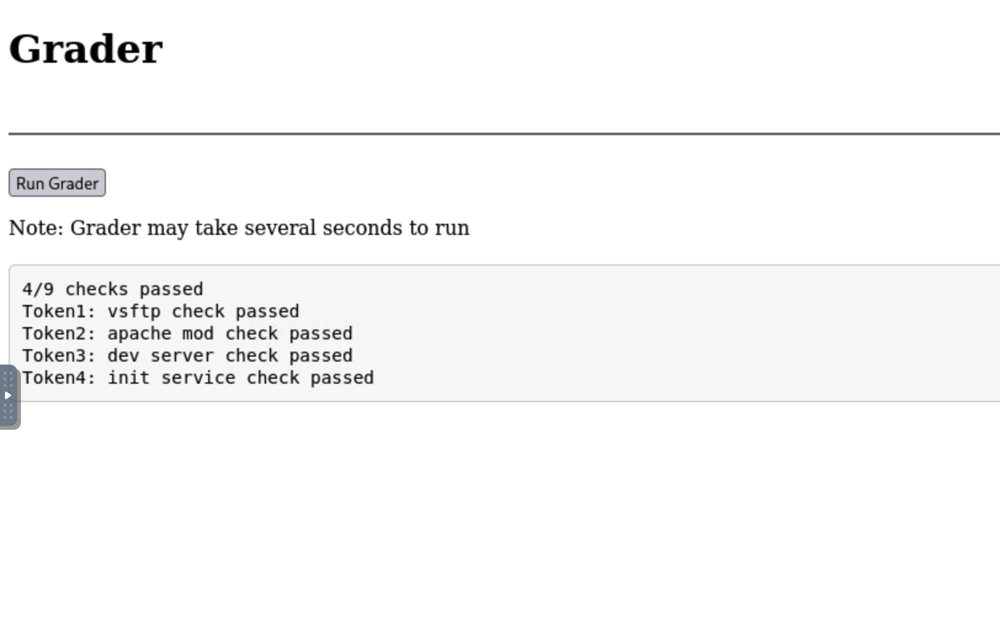

## Token 5
If we continue to look at files, we can focus on common files and directories where attackers operate. One example is `/dev/shm`.

If we use the `Generic.Collectors.File` artifact again we can change the parameters to get all files in `/dev/shm`. Since `/dev/shm` is empty on every node except for a few of them, we don't even have to filter our results, we will only be shown results where `/dev/shm` contains files.

There is a single file in `/dev/shm` on `ubuntu04`, `ubuntu06`, and `ubuntu07`.

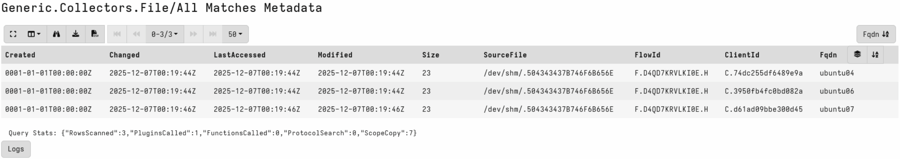

Let's log into `ubuntu04` and investigate the file. From the file contents, we can assume this file is the output of a keylogger.

```bash
cat /dev/shm/.504343437b746f6b656e
```

If we decode the filename we can see that it is the first half of a token.

The second half is likely found in the keylogger itself:
* If we look around the filesystem, we may eventually find that the login binary has been replaced with a keylogger.
* If we run `file /usr/bin/login` we see that it is a bash script instead of the expected ELF executable. 
* If we examine the bash script, we will see that this script captures login credentials and then redirects the user to `/usr/bin/logon`, which is where the real login binary has been moved to.
We will also find the second half of the token in a comment in the script. 

We can convert the combined hex to ascii to get the full token:

```bash
cat /dev/shm/.504343437b746f6b656e
python3 -c 'print(bytes.fromhex("504343437b746f6b656e").decode("ascii"))'
cat $(which login)
python3 -c 'print(bytes.fromhex("<combined hex of filename + comment>").decode("ascii"))'
```

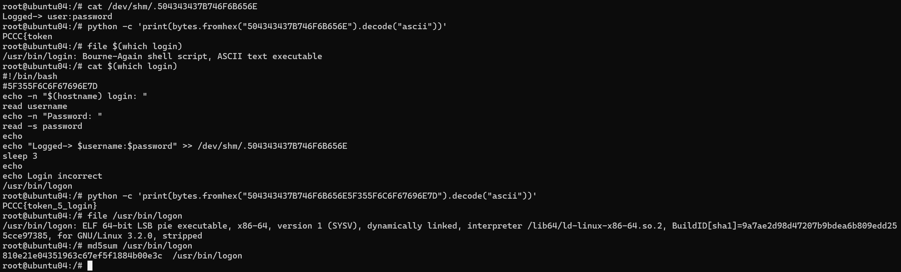

`PCCC{token_5_login}`

### Remediation

Remediation required on `ubuntu04`, `ubuntu06`, and `ubuntu07`.

For remediation we need to delete the file in `/dev/shm` and move `/usr/bin/logon` back to its original location, overwriting the malicious login script.

```bash
rm /dev/shm/.504343437b746f6b656e
mv /usr/bin/logon /usr/bin/login
```

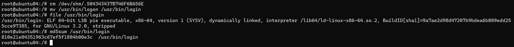

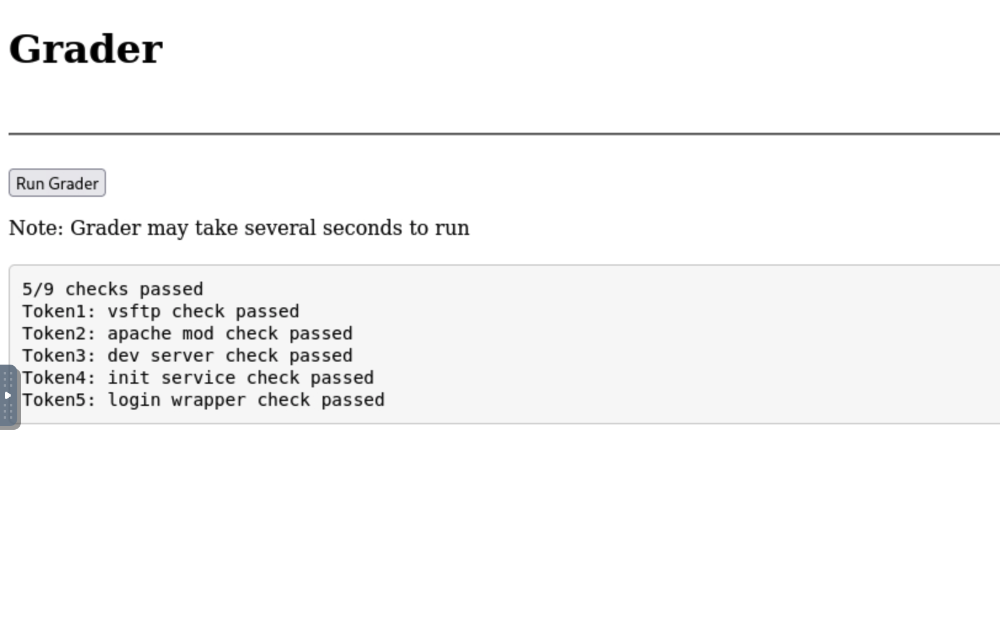

## Token 6
If we narrow our focus down to other files of interest we can look at log files, using a built-in artifact like `Generic.Forensic.Timeline` with `/var/log/*` as our parameter.
We will see on `ubuntu02` and `ubuntu10` that there exists a file called `.dpkg.log.1.gz`
Additionally, when this file is present, all other files in the directory have a more recent `mtime`.
In comparison to other hosts without the `.dpkg.log.1.gz` file, the `lastlog, faillog, btmp, wtmp, and bootstrap.log` typically have less recent modified times than other log files.

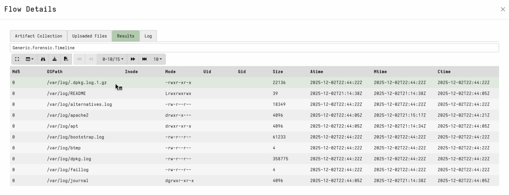

If we examine the .gz file more closely or analyze any of the other log files we can see some interesting things.
The .gz file is not a compressed gzip file as it claims to be, but rather an elf executable file.
Furthermore, if we try to read any of the other log files we get some garbled output.
If we run strings on the file we will find evidence of command line options that suggest this file is used to encrypt and decrypt other files in the directory. We can assume that this .gz file is a malicious program that encrypted all of our log files. 

```bash
strings /var/log/.dpkg.log.1.gz | grep -b6 OPTIONS
```

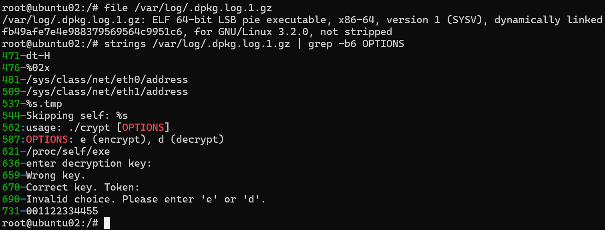

We need to debug this binary in order to decrypt our logs and get the token.
If we look at the functions in `objdump` we can see some interesting function names.
It looks like the program gets the hostname and the mac address and xors two hex strings together.
It's possible that the hostname and mac address are xored to derive the encryption key.

```bash
objdump -d /var/log/.dpkg.log.1.gz | grep ">:"
```

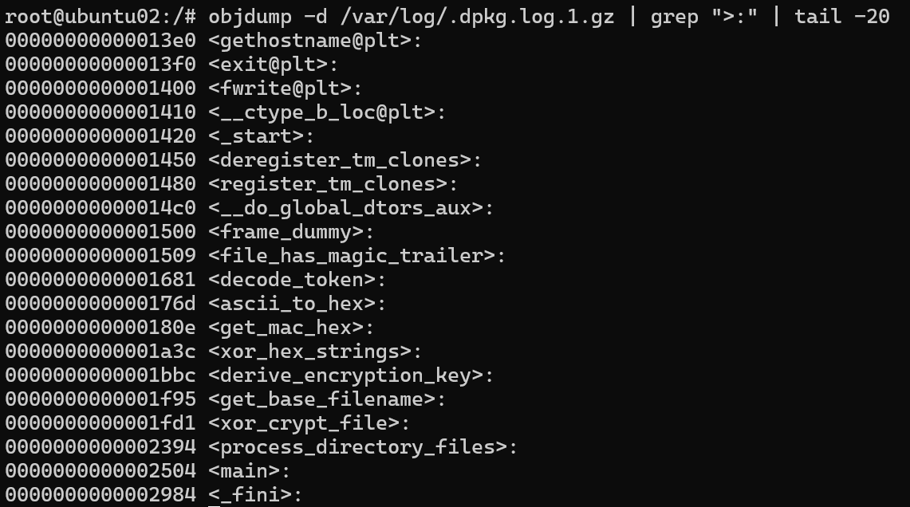

If we use gdb we can start by disassembling the main function.
Looking through main we can see a call to `gethostname` and then a call to `derive_encryption_key`.
Let's set a breakpoint on `derive_encryption_key` and see what’s in the argument registers.

```bash
gdb /var/log/.dpkg.log.1.gz
```

```bash
#in gdb
disassemble main
break derive_encryption_key
run d
x/s $rdi
disassemble derive_encryption_key
```

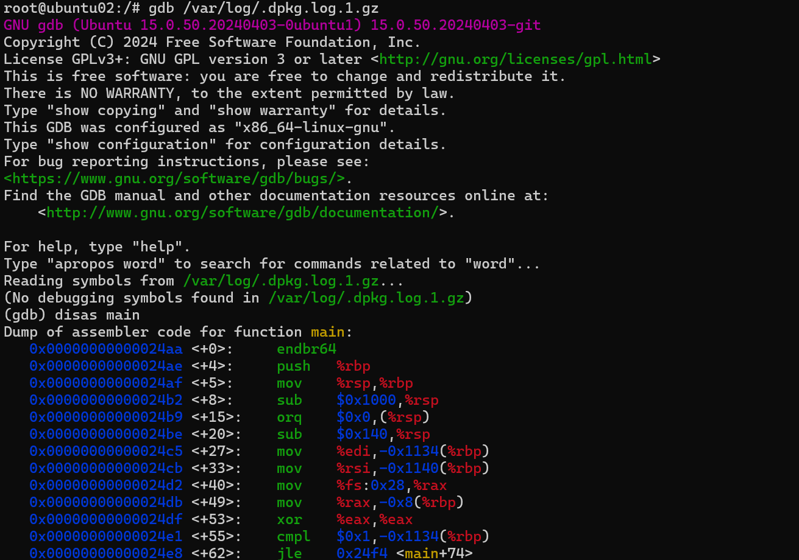
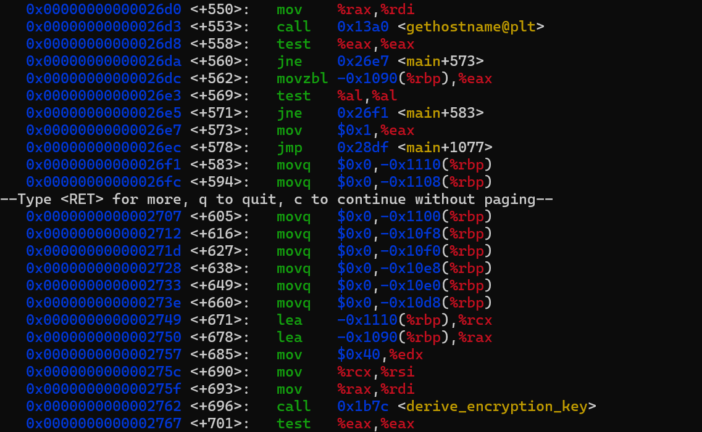

Looking at `$rdi` we can see that the hostname is indeed used as an argument for `derive_encryption_key`.
Let's look more into this derive function by disassembling it.

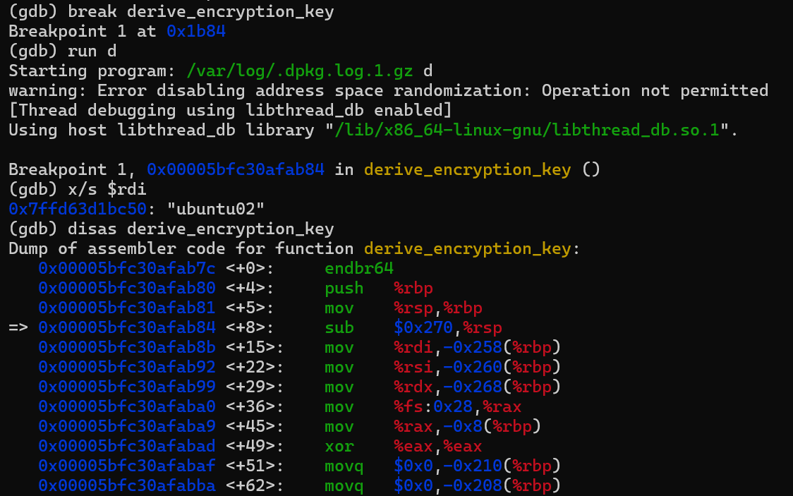

If we disassemble the `derive_encryption_key` function, we can see calls to `get_mac_hex` and `xor_hex_strings`, as well as `snprintf`.
Let's look at the argument registers for `xor_hex_strings`.

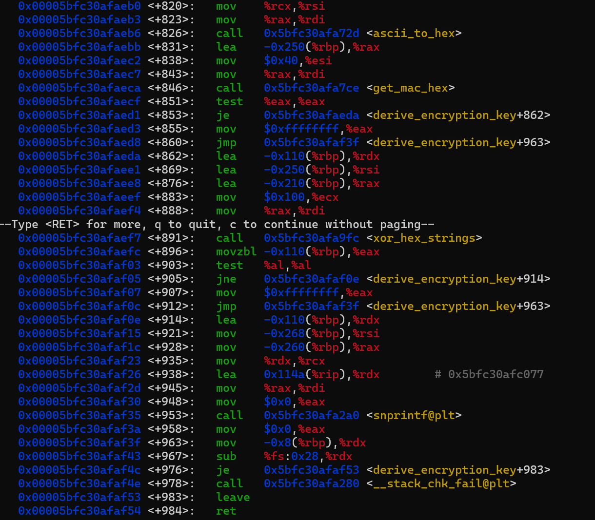

If we break on `xor_hex_strings` and view the argument registers we can see two hex values, one is the hex string of the hostname and the other is the mac address.
Now let's view the argument to the `snprintf` call at the end of the `derive_encryption_key` function.
Let the `xor_hex_strings` function finish and set a breakpoint at the address of `snprintf` and then continue.
The argument register `$rcx` for `snprintf` is indeed the hostname xored with the mac address.
If we continue execution to when the function prompts for decryption key, we can enter the xored string and get the token.
If we look at the contents of the other log files in `/var/log/` we will see that they are no longer encrypted. 

```bash
break xor_hex_strings
continue
x/s $rdi
x/s $rsi
finish
break *<address of snprintf>
continue
x/s $rcx
continue
#Enter decryption key stored in $rcx
```

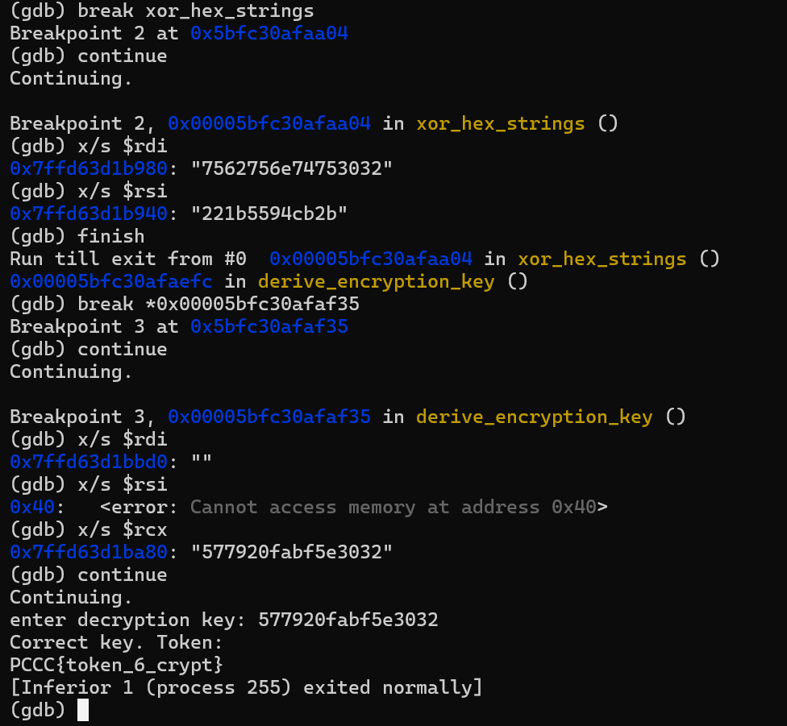

`PCCC{token_6_crypt}`

### Remediation

Remediation required on `ubuntu02` and `ubuntu10`.

For remediation we need to decrypt all of our encrypted files (which we have already done to get the token) and then delete the malicious binary.

We can get the decryption key either through the use of `gdb` as we have done previously or with this python one-liner that derives the key from the hostname and mac address:

```bash
python3 -c 'import uuid,socket; m=uuid.getnode().to_bytes(6,"big"); h=socket.gethostname().encode(); l=max(len(m),len(h)); print("key: " + bytes(a^b for a,b in zip(m.ljust(l,b"\0"),h.ljust(l,b"\0"))).hex())'
```

Then we can decrypt our files and delete the malware.

```bash
/var/log/.dpkg.log.1.gz d
#enter decryption key
rm /var/log/.dpkg.log.1.gz
```

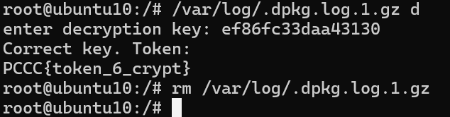

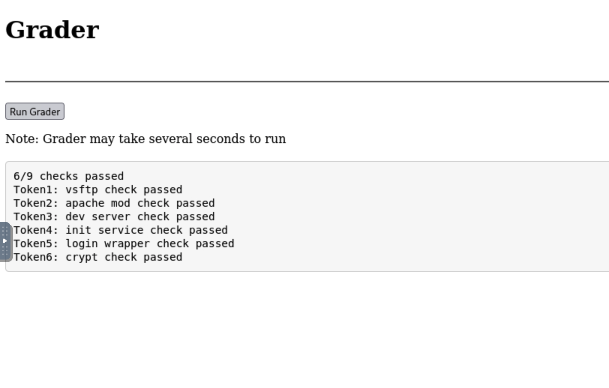

## Token 7
We can focus again on processes, but also on network connections as well.
Let's run a `Linux.Network.Netstat` hunt.
By default, this artifact doesn't include a column for process name.
Let's add one by editing the cell VQL:

```sql
SELECT ProcessInfo.Command AS Command, * FROM source(artifact="Linux.Network.Netstat/TCP4")
```

This will create a column named `Command` that holds the name of all the processes in the netstat results.

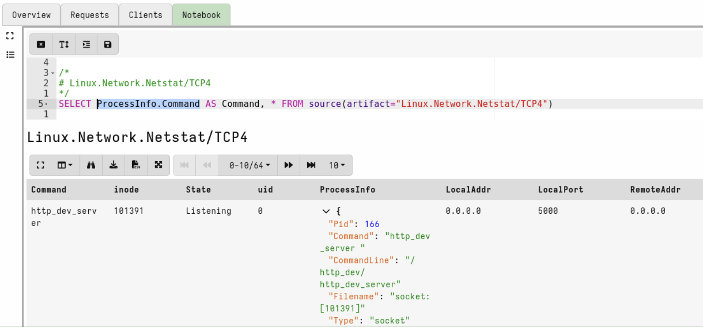

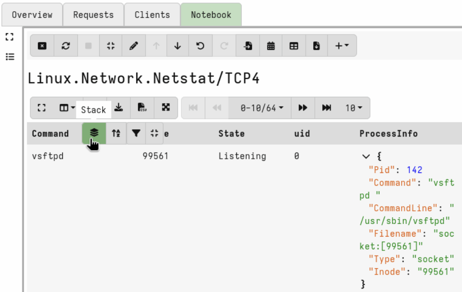

If we click on the stack of our newly created command field, we will notice that there is a `ncat` process open on only the `ubuntu09` host.
If we examine the `ProcessInfo` field of this process, we will see that this is a classic bind shell listening on port `8080`.
We might notice that this `ncat` process doesn't appear in our `Linux.Sys.Pslist` hunt.
Looking closer at `ubuntu09`, we'll see that this host also has an established ssh connection from a remote host.

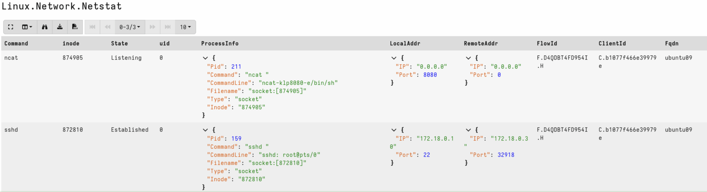

Let's ssh to `ubuntu09` and investigate this.
If we enumerate running process on the host we'll see some interesting things.
We see that the `ncat` connection appears as well as a process called `watchdog` that also didn't show up in our `Linux.Sys.Pslist` hunt.
It seems that these process are being hidden from our velociraptor searches.
If we look back at our `Linux.Sys.Pslist` hunt, we'll notice that the file hash of the `velociraptor_client` on `ubuntu09` is different than the hash of all other clients.
It seems the `ubuntu09` client itself has been compromised.
`Velociraptor` is a `go` based program, and is compiled from many individual go files. There are two main files that dictate how process information is gathered and displayed. These files are `process.go` and `pslist.go`.
If we start by searching for these files in the strings of `velociraptor_client` we might find some interesting things.
If we grep for `pslist` in the strings of `velociraptor_client` we will only get a few results, the last result being the path of the `pslist.go` file. However it seems that the filename has been modified with a base64 string.
If we decode the string we can get the token.

```bash
strings /usr/local/bin/velociraptor_client | grep pslist | tail -1 | cut -d '_' -f 2 | cut -d '.' -f 1 | base64 -d
```

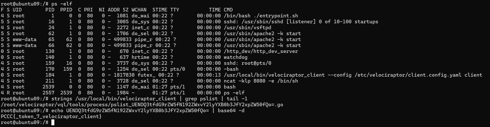

`PCCC{token_7_velociraptor_client}`

### Remediation

Remediation required on `ubuntu09`.

For remediation, we need to replace the compromised `velociraptor_client` with a known good. We can copy the binary from another ubuntu host and use it as a replacement.

```bash
pkill -f /usr/local/bin/velociraptor_client
rm /usr/local/bin/velociraptor_client
scp user@ubuntu08:/usr/local/bin/velociraptor_client /usr/local/bin/velociraptor_client
/usr/local/bin/velociraptor_client --config /etc/velociraptor/client.config.yaml client &
```

If we want, we can even view `ubuntu09` with a `Linux.Sys.Pslist` artifact again and we can see that the `watchdog` and `ncat` processes are no longer hidden, and the `velociraptor_client` process has the correct hash.

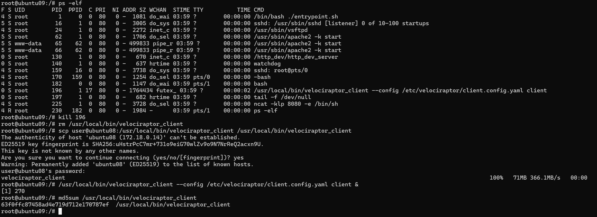

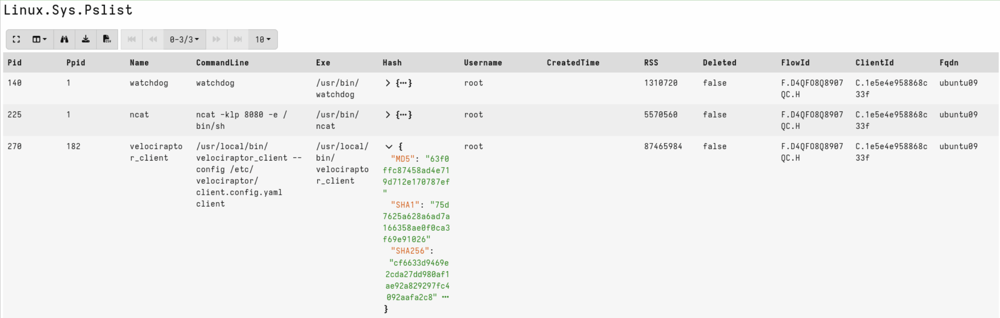

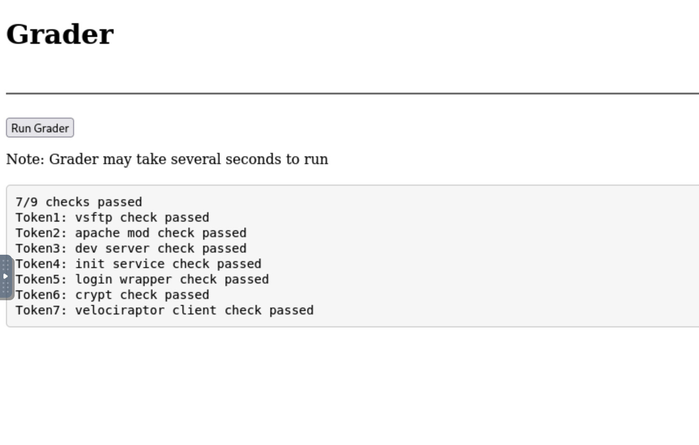

## Token 8
While still on `ubuntu09`, if we take a look at the `watchdog` binary with the `strings` command we can see that this binary seems to mostly run system shell commands.
We can see that the binary flushes `iptables`, ensures ssh root login is enabled, and adds the attacker's public key to `authorized_keys`.

```bash
strings $(which watchdog) | head -15
```

We also see a large binary string, which, if converted to ascii, reveals the token.

```bash
python3 -c 'print("".join([chr(int(b, 2)) for b in "<binary string in watchdog>".split()]))'
```

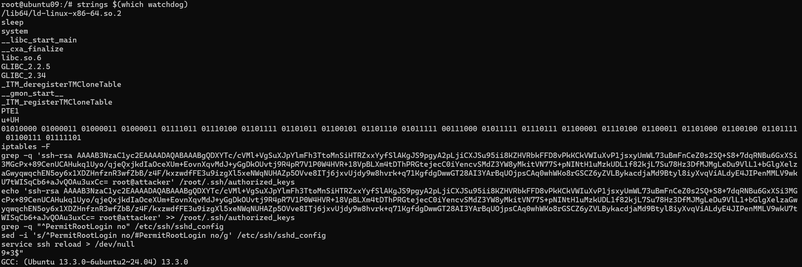

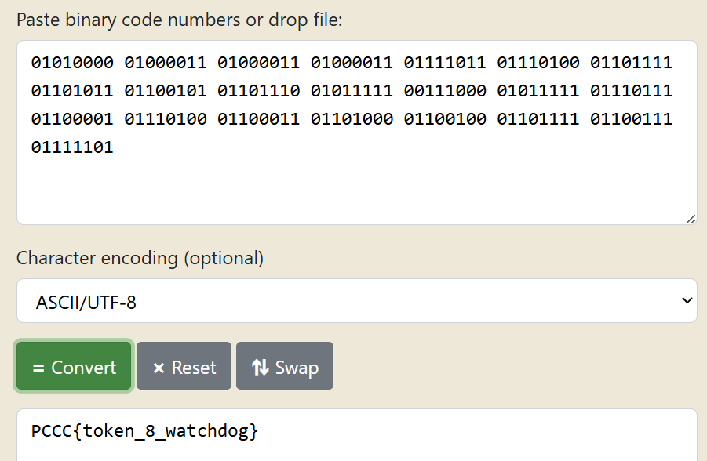

`PCCC{token_8_watchdog}`

### Remediation

Remediation required on `ubuntu09`.

For remediation we need to kill the `watchdog` process and delete the `watchdog` binary. Then we need to remove the attacker's public ssh key from `authorized_keys` and kill the attacker's ssh session.
Then we can use `iptables` to block traffic from `attacker`.

Note: The grader does not explicitly require us to add an `iptables` rule to block `attacker`. However, we might notice that the attacker continues to retry ssh connections which will result in defunct ssh zombie processes being created. If this continues long enough, these zombie processes may even consume all of the available resources on `ubuntu09` which will prevent the grader from working on this host. If this happens, it is recommended to restart the `ubuntu09` container. The `iptables` rule will block these new connections and prevent anymore defunct ssh processes, avoiding any potential resource issues.

```bash
pkill watchdog
rm /usr/bin/watchdog
sed -i /.*attacker.*/d /root/.ssh/authorized_keys
pkill -f "sshd: root@pts/0"
iptables -A INPUT -s attacker -j DROP
```

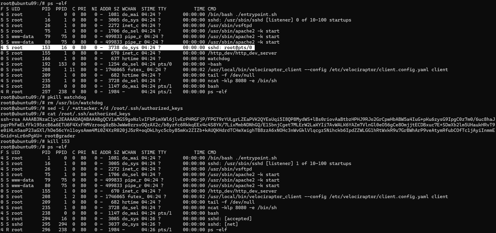

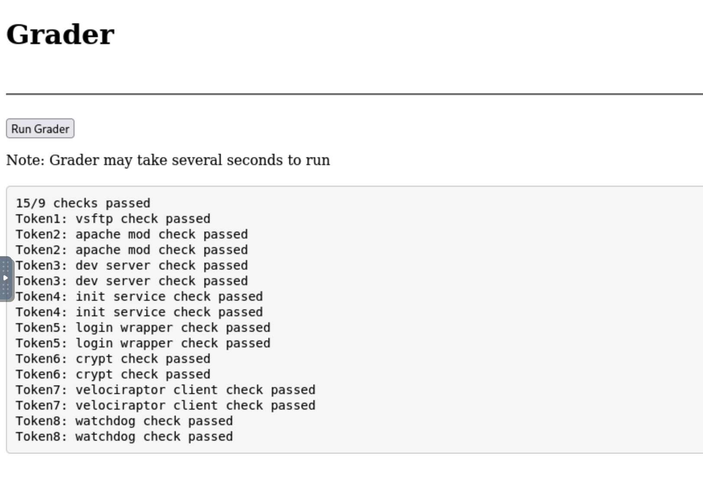

## Token 9
We will remain on `ubuntu09` for this token as well.
Now we need to deal with this `ncat` process, however if we try to kill it, it restarts.
We might notice that if we kill the `watchdog` process and then kill the `ncat` process, the `ncat` process won't start again.
We know what the `watchdog` process does, and it doesn't seem to start `ncat` directly, however it does invoke a few other system binaries like `iptables, grep, sed, and service`.
If we examine these binaries further, we'll notice that the hash of `/usr/bin/grep` is different than it is on all of the other hosts. 
We can even run `grep` after deleting both `watchdog` and `ncat` and the `ncat` process will start again.
It seems that the `grep` command has been compromised, while still maintaining its original functionality.
It's possible the binary has been patched with a malicious shared object that executes `ncat`.
If we list the shared object dependencies of `/usr/bin/grep` we will see a `/lib64/ld-linux-x86-64.so.1` file which wouldn't normally be loaded into `grep`. 
Running `strings` on this file we will see a list of what seems to be base64 encoded characters.
If we decode each of these characters, we will get the token.

```bash
ldd /usr/bin/grep
strings /lib64/ld-linux-x86-64.so.1 
for i in $(strings /lib64/ld-linux-x86-64.so.1 | grep ==);do echo -n $i | base64 -d;done
```

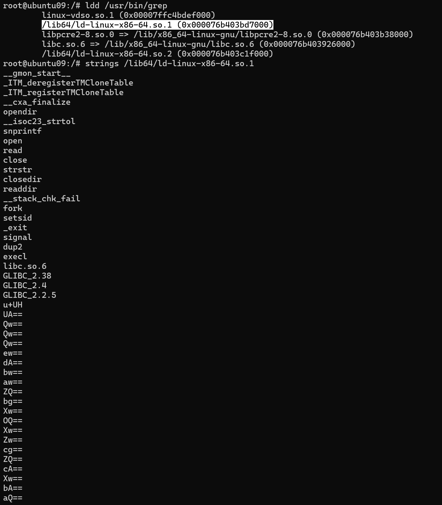

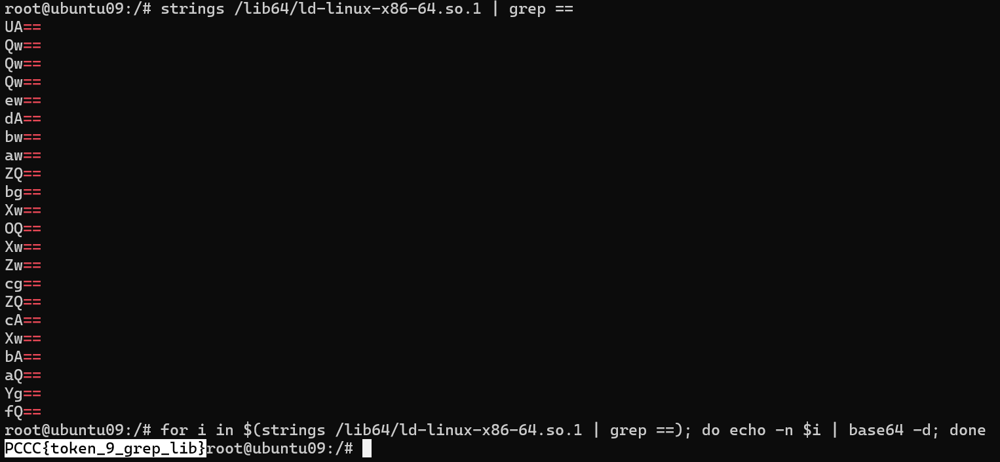

`PCCC{token_9_grep_lib}`

### Remediation

Remediation required on `ubuntu09`.

For remediation, we can use `patchelf` to remove the malicious `/lib64/ld-linux-x86-64.so.1` file from the grep binary. Then we can kill the `ncat` process.
Alternatively, we could replace the `grep` binary with a known good. Both methods work for the purpose of the challenge.

```bash
patchelf --remove-needed /lib64/ld-linux-x86-64.so.1 /usr/bin/grep
pkill ncat
```

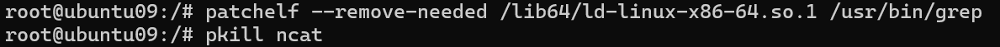

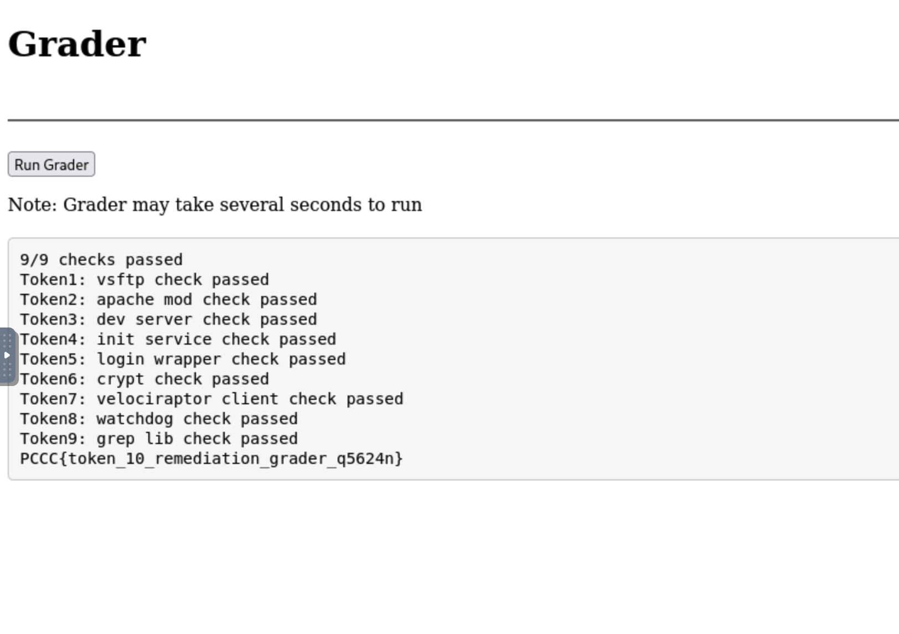

## Token 10
Browse to http://grader
If we have successfully removed all threats, then we can run the grader check and get the token.

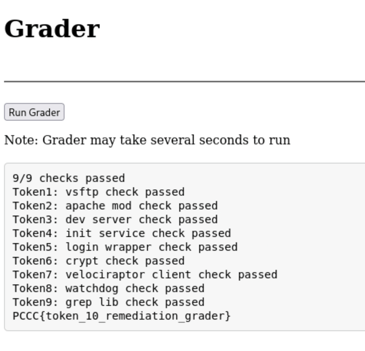

`PCCC{token_10_remediation_grader}`
