# Operation Ghost Stories — Solution Guide

**Total points:** 5000 (5 tokens) | **Target time:** 110 minutes

A counterintelligence reconstruction. The competitor walks the asset's
tradecraft from artifacts: identify the dropper, characterize its
evasion, enumerate every dead drop, recover the handler's instructions,
and intercept the courier channel.

The intended solve uses the Kibana surface for triage and the analysis
sandbox for static deobfuscation. An automated end-to-end solver lives
at `solution/scripts/solve.py`.

The seeded log corpus is ~2400 events total (~2185 Sysmon + ~250
PowerShell). The malicious activity is roughly 1.3% of that volume —
competitors who don't filter will get lost. Concrete Kibana queries
appear in each token section.

### Real-world grounding

This challenge is a direct dramatization of **DEEP#DOOR**, a Python
backdoor + credential-stealer framework documented by Securonix Threat
Research in April 2026 and subsequently covered by The Hacker News,
SecurityWeek, Infosecurity Magazine, gbhackers, and SC Media. The five
tokens map 1:1 to the published tradecraft, so the intended solve
mirrors what a real SOC analyst would do when DEEP#DOOR (or a
close relative) lands on one of their hosts:

| Token | DEEP#DOOR-reported behavior |
|---|---|
| T1 — dropper SHA256 | Obfuscated `.bat` dropper acts as the initial loader. |
| T2 — defensive evasion | Dropper invokes `Set-MpPreference -DisableRealtimeMonitoring $true` (and family) before staging the implant. |
| T3 — dead-drop enumeration | Persistence via **registry Run key**, **Startup-folder VBS**, **scheduled task**, and **WMI EventConsumer** — four redundant footholds. |
| T4 — handler's instructions | Dropper extracts `svc.py` from itself via a self-referential routine (read own bytes, slice marker, base64-decode). |
| T5 — courier intercept | Python RAT tunnels C2 over `bore.pub` and authenticates to the handler with a SHA256 challenge-response activation phrase before commands are accepted. |

The narrative wrapper — *Operation Ghost Stories* — is the codename the
FBI used for its 2010 counterintelligence investigation of the SVR
illegals network (the "Anna Chapman" case). The framing is purely
storytelling; the technical content is current-news DEEP#DOOR
tradecraft. The implant sample under `challenge/artifact-server/payloads/svc.py`
is structurally faithful to the published behavior but **declawed** —
command-handler bodies are redacted comments, so the recovered file is
safe to execute in the sandbox for hash recovery without performing the
real RAT's actions.

**Primary source:** [Securonix — DEEP#DOOR Python Backdoor and
Credential Stealer](https://www.securonix.com/blog/deepdoor-python-backdoor-and-credential-stealer).
Secondary coverage:
[The Hacker News](https://thehackernews.com/2026/04/new-python-backdoor-uses-tunneling.html),
[SecurityWeek](https://www.securityweek.com/sophisticated-deepdoor-backdoor-enables-espionage-disruption/),
[Infosecurity Magazine](https://www.infosecurity-magazine.com/news/deepdoor-python-backdoor-windows/),
[gbhackers](https://gbhackers.com/deepdoor-stealer/),
[SC Media](https://www.scworld.com/brief/clandestine-deepdoor-stealer-facilitates-long-term-data-compromise).

### How to read this guide

Each token section calls out three things to keep the methodology
visible:

- **What you're given vs. what you infer** — every step labels its
  starting information as one of:
  - *given in the README* (the competitor brief tells you to look here)
  - *standard IR knowledge* (every analyst trained on Windows host
    forensics knows this)
  - *inferred from a previous step* (the output of an earlier query
    points you forward)
- **Why this technique** — one-line context on why this is the canonical
  move (no full tutorial, just enough to follow).
- **Where to confirm** — every recovered value is cross-validatable
  against a second artifact so you can be sure before submitting.

---

## Token 1 — Asset Identification

**Objective.** Recover the SHA256 of the dropper that initiated the
compromise and submit it to `challenge.pccc`.

**Investigation reasoning.**
- *Given in the README*: the SOC analyst caught "a chain of suspicious
  child processes spawning off `cmd.exe`". That tells you to start in
  process-creation events.
- *Standard IR knowledge*: Sysmon **Event ID 1** is the canonical
  process-creation event. It records the full command line, parent
  process, user, and the SHA256/MD5 hashes of every image (under the
  `Hashes` field). The first Kibana query of any host-IR triage is some
  variant of "show me EID 1 events for the suspicious process."

**Steps.**

1. **(Kali browser)** Open Kibana at `http://kibana.pccc:5601`. If this
   is your first visit, go to **Stack Management → Index Patterns** and
   create two patterns: `sysmon-*` and `powershell-*`, both using
   `@timestamp` as the time field. Then navigate to **Discover**.

2. **(Kibana)** Select the `sysmon-*` index pattern. **Expand the time
   range** using the date picker in the top-right corner — set it to
   cover the full forensic window:

   > **From:** `2026-04-22 00:00` **To:** `2026-05-13 00:00`

   The event corpus spans from the original install (2026-04-22) through
   the SOC detection (2026-05-12 02:17 UTC). Kibana's default "Last 15
   minutes" range will show zero results.

   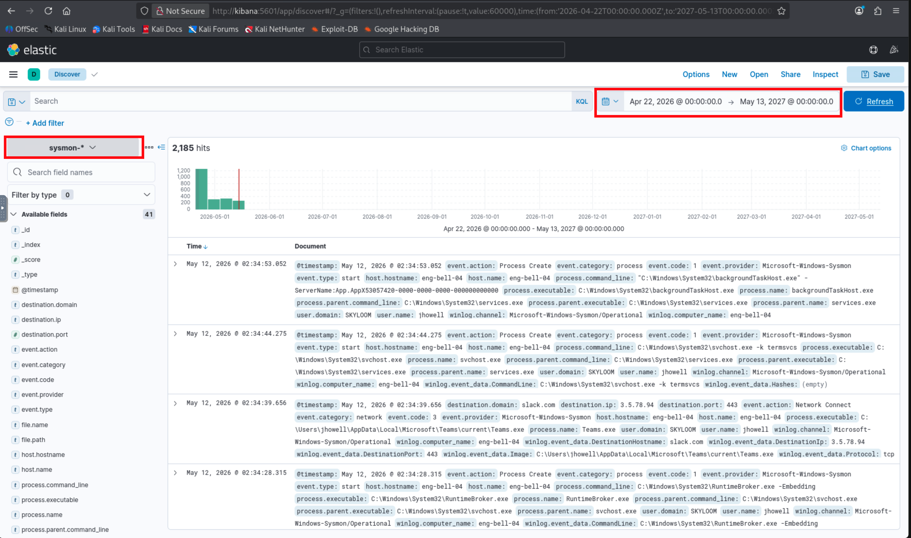

3. **(Kibana)** Filter for the dropper. Enter this query in the KQL bar:

   **Why this filter**: `event.code:"1"` narrows to process-creation
   events only; `process.name:*.bat` matches any batch-script invocation.
   The README told you the SOC caught "a chain of suspicious child
   processes spawning off `cmd.exe`" — a `.bat` file invoked from
   `cmd.exe` is the textbook dropper pattern, so this filter isolates
   the dropper from ~2185 events down to a single hit.

   ```
   event.code:"1" AND process.name:*.bat
   ```

   The single hit is `install_obf.bat`.

   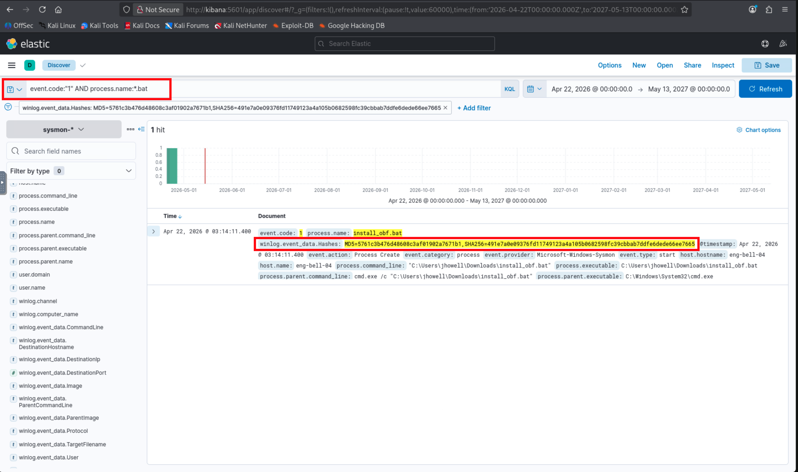

4. **(Kibana)** Open the matched document and find the field
   `winlog.event_data.Hashes`. Sysmon stores hashes as a
   comma-separated string like `MD5=...,SHA256=...`. Take the SHA256
   portion.

5. **(Kali terminal)** Cross-validate against the file on disk —
   `install_obf.bat` is preserved on the artifact server. Hashing it
   directly should produce the same value:

   ```bash
   curl -s http://artifacts.pccc/install_obf.bat | sha256sum
   ```

   *Why bother*: in a real engagement you'd cross-reference EVTX-recorded
   hashes against the file on disk to confirm tamper-free preservation.

6. **(Kali browser)** Submit the hex digest on `challenge.pccc` →
   Token 1 is released.

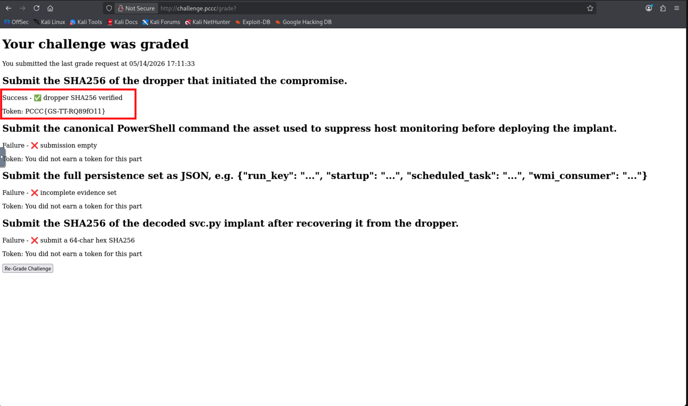

**Expected output.**

```
491e7a0e09376fd11749123a4a105b0682598fc39cbbab7ddfe6dede66ee7665
```

### Answer 

**Flag extraction.** Grader response → `PCCC{GS-T*-*}`.

---

## Token 2 — Defensive Evasion

**Objective.** Identify the canonical PowerShell action the asset took
to suppress monitoring and submit it.

**Investigation reasoning.**
- *Given in the README*: "The asset disabled monitoring before deploying
  the implant." That tells you to look for security-tool tampering
  before the implant process appears.
- *Standard IR knowledge*: malware almost always disables Microsoft
  Defender before unpacking — it's loud and well-known. Two canonical
  detection surfaces:
  1. **PowerShell Script-Block Logging (EID 4104)** records the body of
     every PowerShell script block executed on the host. Defender
     toggles run through PowerShell (`Set-MpPreference`), so they leave
     a 4104 event.
  2. Sysmon EID 1 also records the same command via the `CommandLine`
     field on the `powershell.exe` process creation. Either works.
- *Inferred from Token 1*: the Sysmon process tree from the dropper
  shows `cmd.exe → install_obf.bat → powershell.exe` — confirming that
  the dropper launched PowerShell child processes. The README said
  "seventeen distinct PowerShell child commands," so the PS log is
  the right place to look for what those commands did.
- **Time-window context**: the asset disables Script-Block Logging
  itself in a later step. Once that fires, no further EID 4104 events
  are captured. So the evidence window is bounded; in the seeded data
  it sits between 03:14:13 and 03:14:18 on 2026-04-22.

**Steps.**

1. **(Kibana)** Switch to the `powershell-*` index pattern. Ensure the
   date range still covers the full forensic window
   (`2026-04-22 → 2026-05-13`).

2. **(Kibana)** Enter this query in the KQL bar. **Why this filter**:
   `event.code:"4104"` selects script-block events; wildcarding on
   `*MpPreference*` narrows to Defender-configuration commands. ~6
   results.

   ```
   event.code:"4104" AND winlog.event_data.ScriptBlockText:*MpPreference*
   ```

   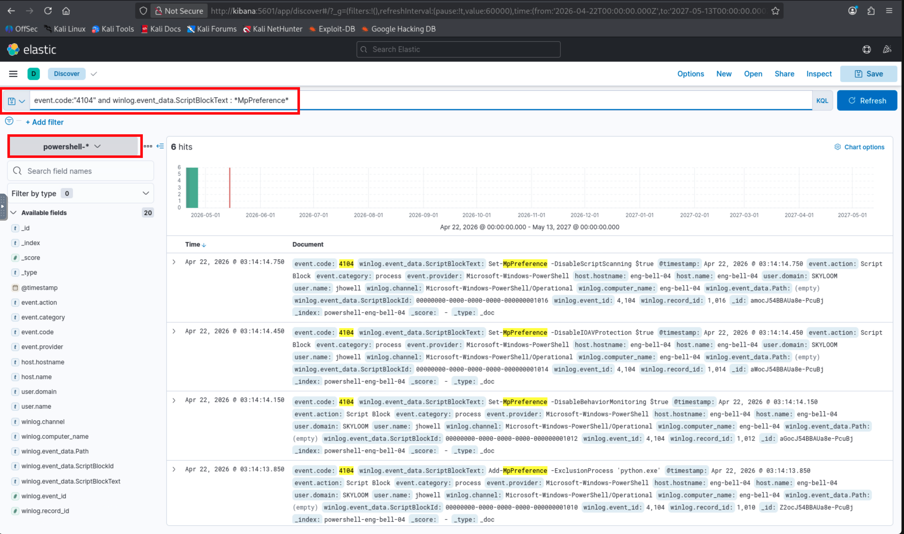

3. **(Kibana)** Sort by `@timestamp` ascending and scan the matched
   documents' `ScriptBlockText` field. The first command in the
   time-sorted list will be the real-time protection disable — the
   canonical first move when malware wants to operate without Defender
   interference. The bare parameter name
   (`-DisableRealtimeMonitoring`) is industry-recognized enough that
   any experienced analyst will identify it instantly.

   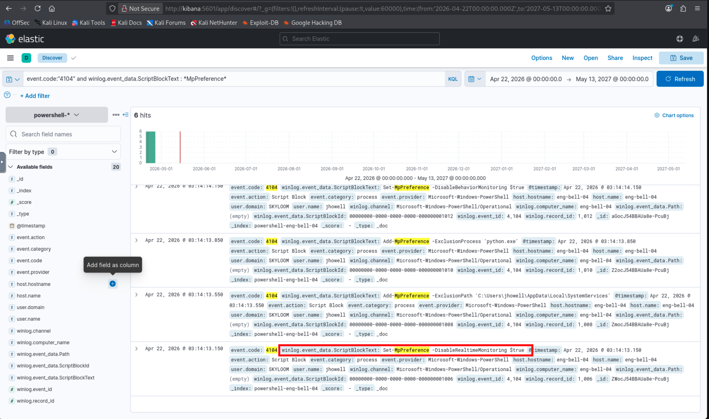

4. **(Kali browser)** Submit the **full command form** on
   `challenge.pccc`. The grader requires the `Set-MpPreference` prefix;
   the bare parameter name on its own is rejected.

**Expected output.**

```
Set-MpPreference -DisableRealtimeMonitoring $true
```

The grader accepts only forms beginning with `Set-MpPreference` (the
bare parameter name on its own is rejected to keep evidence-driven
discovery honest).

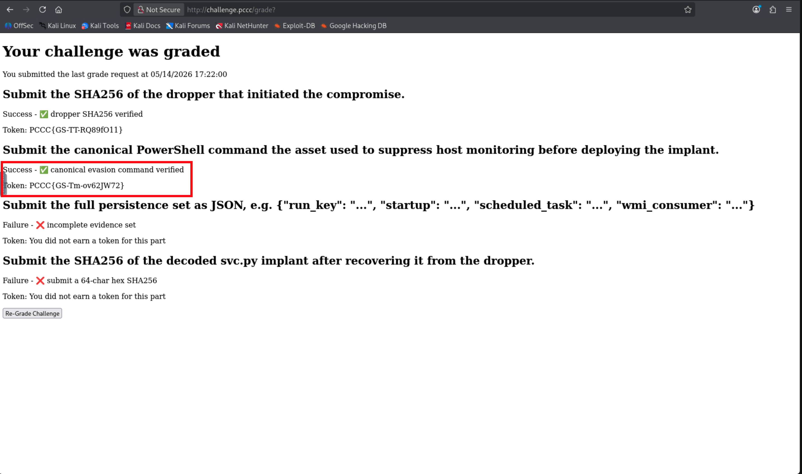

### Answer

**Flag extraction.** Grader response → `PCCC{GS-T*-*}`.

---

## Token 3 — Dead-Drop Enumeration

**Objective.** Enumerate every persistence mechanism and submit the
full set as structured JSON.

**Investigation reasoning.**
- *Given in the README*: "The asset established multiple independent
  footholds on the host." That tells you to expect more than one
  persistence mechanism — losing any single one shouldn't burn the
  implant.
- *Standard IR knowledge*: Windows persistence enumeration is a
  well-trodden checklist. The canonical "Big Four" places malware
  hides on a workstation:
  1. **Registry Run keys** — `HKCU\...\Run` and `HKLM\...\Run` auto-run
     on user logon / system boot.
  2. **Startup folder** — files dropped into
     `%APPDATA%\Microsoft\Windows\Start Menu\Programs\Startup` execute
     on logon.
  3. **Scheduled tasks** — survives reboots, can run as SYSTEM, fires
     on triggers (logon, boot, idle, time, event).
  4. **WMI Event Subscriptions** — fileless persistence:
     EventFilter + EventConsumer + Binding triple in
     `\root\subscription` namespace.
- *Available artifacts*: the artifact server at `http://artifacts.pccc/`
  hosts exports that map directly to the Big Four checklist —
  `NTUSER.DAT.reg` (registry hive), `scheduled-tasks.xml` (task
  export), `wmi-subscriptions.mof` and `wmi-repo-summary.json` (WMI
  repository). The Startup-folder foothold doesn't have a static
  artifact but leaves a Sysmon EID 11 (file-create) event in Kibana.

**Steps.**

1. **(Sandbox terminal)** Fetch the registry export and parse it with
   the provided helper:

   ```bash
   curl -O http://artifacts.pccc/NTUSER.DAT.reg
   python3 ~/helpers/parse_reg.py NTUSER.DAT.reg --filter Run
   ```

   The output shows three values under the `Run` key: `OneDrive`,
   `Teams`, and `SystemServices`. The first two are recognizable
   Microsoft applications. `SystemServices` is the malicious entry —
   its value launches `wscript.exe` pointing at a VBS file in the
   Startup folder.

   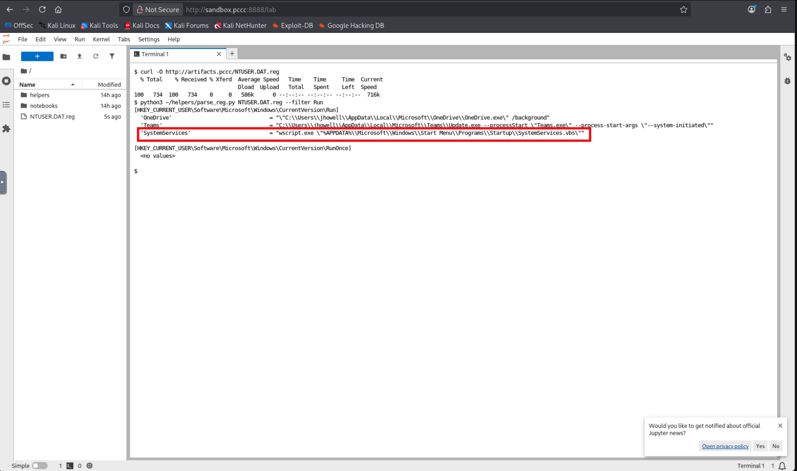

2. **(Kibana)** Switch back to the `sysmon-*` index pattern. Filter for
   file-create events in the Startup directory — Sysmon EID 11 fires on
   every file-create:

   ```
   event.code:"11" AND file.path:*Startup*
   ```

   The result shows a single hit: `SystemServices.vbs` created in the
   Startup folder — the same VBS launcher referenced by the Run key.

   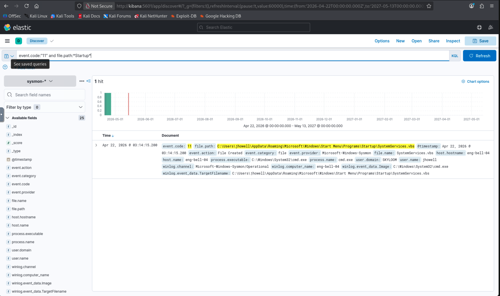

3. **(Kali terminal)** Fetch the scheduled-task XML export and read the
   `<URI>` element:

   ```bash
   curl http://artifacts.pccc/scheduled-tasks.xml
   ```

   Task Scheduler XML exports follow Microsoft's canonical schema. Look
   for the `<URI>` element — it contains the full task path:
   `\Microsoft\Windows\WindowsUpdate\SystemServicesCheck`. That's the
   `scheduled_task` value for submission. **(Kibana)** Cross-validate if
   you want — switch to `sysmon-*` and search for `schtasks.exe`:

   ```
   event.code:"1" AND process.name:schtasks.exe
   ```

   The matching `schtasks.exe /create /tn ...` invocation will show the
   same task path in the command line.

   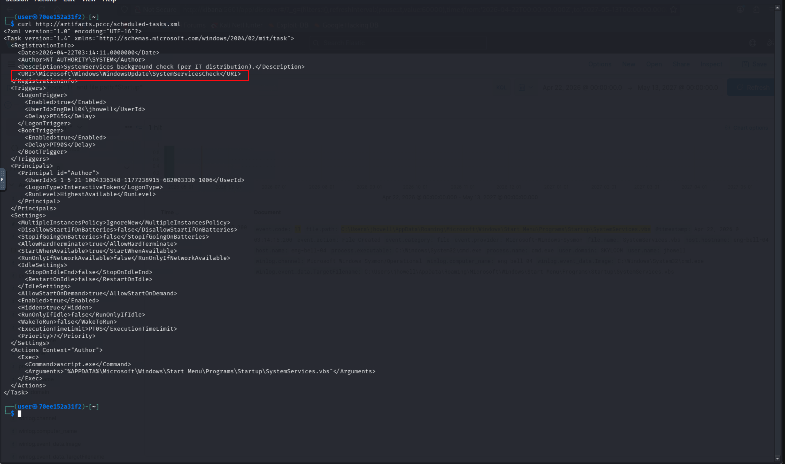

4. **(Kali terminal)** Fetch the WMI repository exports:

   ```bash
   curl http://artifacts.pccc/wmi-subscriptions.mof
   curl http://artifacts.pccc/wmi-repo-summary.json
   ```

   MOF (Managed Object Format) is the canonical WMI definition syntax;
   the JSON file is an inventory parse of the same data. In the JSON
   output, the `consumers` array has one entry with
   `"name": "WindowsHealthMonitor"` — that's the consumer name the
   grader checks. You'll also see it in the `bindings` array
   (`CommandLineEventConsumer.Name="WindowsHealthMonitor"`) and in the
   MOF file as `Name = "WindowsHealthMonitor"` on the
   `CommandLineEventConsumer` instance. The paired EventFilter
   (`WindowsHealthFilter`) is visible too but the grader only checks
   the consumer name.

   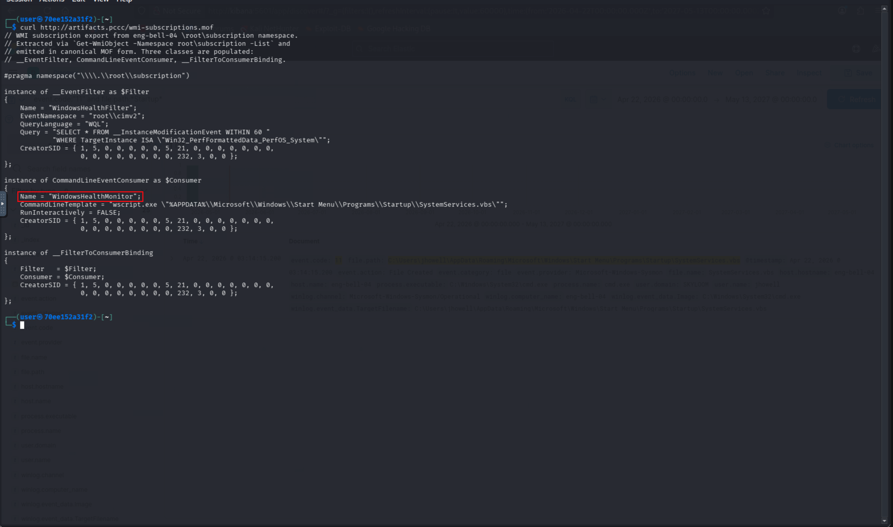

5. **(Kali browser)** Open `challenge.pccc` and look at the Token 3
   text box. The grader label shows the expected JSON format with the
   four field names:
   `{"run_key": "...", "startup": "...", "scheduled_task": "...", "wmi_consumer": "..."}`.
   Fill in the values recovered from steps 1–4. The grading endpoint
   accepts only the full structured set; partial submissions return
   "incomplete evidence set" and rate-limits at 5/min/source:

   ```json
   {
     "run_key":        "SystemServices",
     "startup":        "SystemServices.vbs",
     "scheduled_task": "\\Microsoft\\Windows\\WindowsUpdate\\SystemServicesCheck",
     "wmi_consumer":   "WindowsHealthMonitor"
   }
   ```

   For `run_key`, the grader accepts either the bare value name
   (`"SystemServices"`) or the full hive path
   (`"HKCU\\Software\\Microsoft\\Windows\\CurrentVersion\\Run\\SystemServices"` /
   the `HKEY_CURRENT_USER\\...` long form) — whichever shape the
   defender's notes naturally produce.

   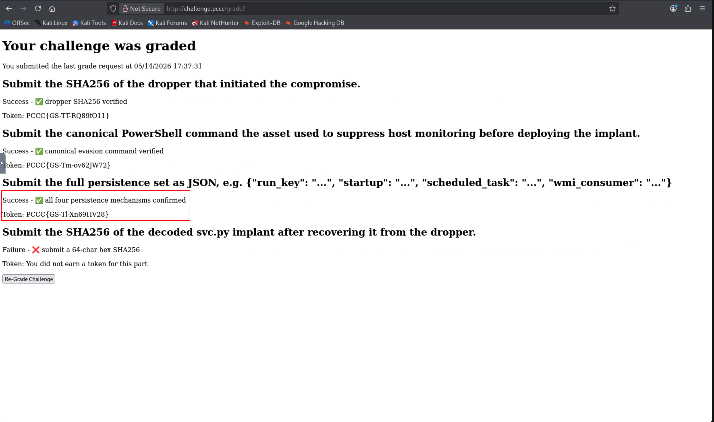

**Expected output.** Token 3 released when all four identifiers match
their canonical values.

### Answer 

**Flag extraction.** Grader response → `PCCC{GS-T*-*}`.

---

## Token 4 — Handler's Instructions

**Objective.** Recover the embedded Python implant from the dropper
and submit its SHA256.

**Investigation reasoning.**
- *Given in the README*: "The dropper carries an embedded payload that
  is extracted at runtime via a self-referential routine. Reproduce the
  extraction in the sandbox."
- *Standard malware-analysis knowledge*: batch / VBScript droppers
  routinely carry their actual payload as base64-encoded blobs between
  sentinel markers, then use PowerShell or Certutil to decode at runtime.
  Recognizing this pattern is a basic static-analysis skill.

**Steps.**

1. **(Sandbox terminal)** Fetch the dropper from the artifact server
   and open it for reading:

   ```bash
   curl -O http://artifacts.pccc/install_obf.bat
   cat install_obf.bat
   ```

2. **(Sandbox)** Read through the batch file top-to-bottom. The
   structure is:

   - **Lines 1–9**: variable setup — note `set "START_MARKER=::PAYLOAD-START::"` and
     `set "END_MARKER=::PAYLOAD-END::"`.
   - **Lines 11–16 (Step 1–2)**: the self-referential routine —
     `findstr /n` locates the marker line numbers in its own file, then
     PowerShell extracts the lines between them and joins them into a
     single base64 string.
   - **Lines 26–34 (Step 3)**: the decode — PowerShell calls
     `[Convert]::FromBase64String(...)` then pipes through
     `IO.Compression.DeflateStream` to decompress. This tells you the
     encoding: **base64 over a zlib-compressed stream**. (The PowerShell
     strips the 2-byte zlib header before `DeflateStream`; in Python you
     can use `zlib.decompress` on the full stream — it handles the
     header.)
   - **Lines 36–68 (Steps 4–10)**: `:: DECLAWED-CMD` placeholders —
     these are the redacted persistence and evasion commands you already
     recovered evidence of in Tokens 2 and 3.
   - **Lines 72–74**: the actual payload blob between
     `::PAYLOAD-START::` and `::PAYLOAD-END::`.

3. **The "double-marker" gotcha**: the markers `::PAYLOAD-START::` and
   `::PAYLOAD-END::` appear twice each — once in the `set` variable
   assignments (line 8–9) and once as the actual sentinels around the
   payload (line 72, 74). A naive `.index()` in Python would grab the
   variable-assignment line instead of the payload. Anchor on the
   **last** opening occurrence with `.rfind()` (or scan line-by-line).

4. **(Sandbox — Jupyter cell or Python shell)** Now reproduce the
   extraction. Using what you read in step 2 — locate the payload
   between the sentinels, base64-decode, zlib-decompress, and hash:

   ```python
   import base64, hashlib, zlib, urllib.request

   bat = urllib.request.urlopen("http://artifacts.pccc/install_obf.bat").read().decode("ascii")

   # Both markers appear twice. Anchor on the *last* opening occurrence
   # and the first closing occurrence after it (see step 3).
   start_tok, end_tok = "::PAYLOAD-START::", "::PAYLOAD-END::"
   start = bat.rfind(start_tok) + len(start_tok)
   end   = bat.find(end_tok, start)
   b64   = "".join(bat[start:end].split())

   raw   = base64.b64decode(b64)
   svc   = zlib.decompress(raw)

   # Write it out so you can read the implant source for Token 5.
   with open("svc.py", "wb") as f:
       f.write(svc)

   print(hashlib.sha256(svc).hexdigest())
   ```

   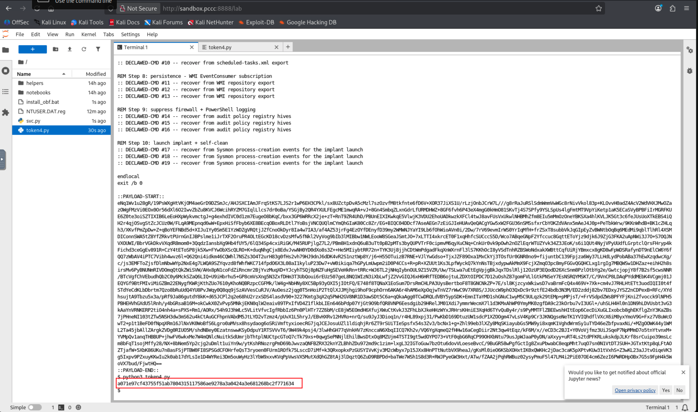

**Expected output.**

```
a071e97cf43755f51ab7804315117586ae9278a3a0424a3e681268bc2f771634
```

5. **(Kali browser)** Submit the hex digest on `challenge.pccc` →
   Token 4 is released.

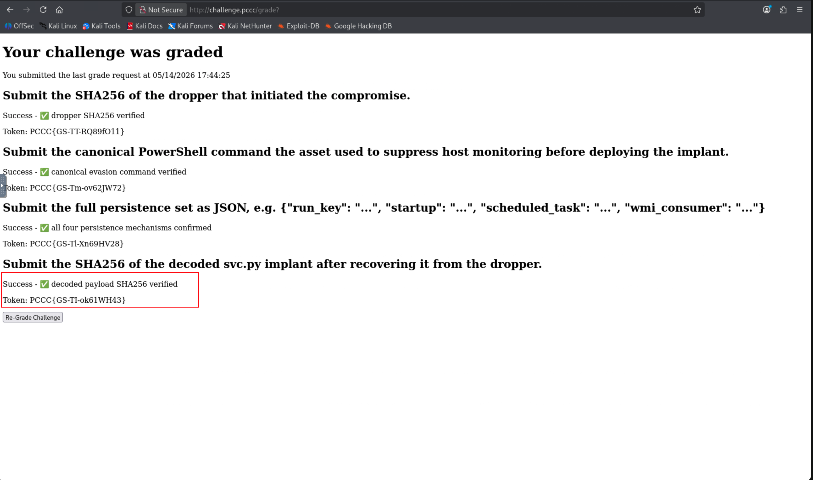

### Answer

**Flag extraction.** Grader response → `PCCC{GS-T*-*}`.

---

## Token 5 — Courier Intercept

**Objective.** Replicate the implant's challenge-response handshake
against the captured handler listener and recover the token it returns
on success.

**Investigation reasoning.**
- *Given in the README*: "Replicate the activation phrase against
  `handler.pccc:41243`."
- *Standard crypto/malware-analysis knowledge*: a per-connection random
  challenge + a digest reply is a classic **challenge-response
  authentication** primitive. It prevents replay attacks (the challenge
  changes every connection) and proves the client knows a shared secret
  without sending it in cleartext. Common digest constructions:
  `SHA256(challenge + secret)`, `SHA256(challenge | secret)`,
  `HMAC-SHA256(secret, challenge)`. You determine which by reading the
  implant source.

**Steps.**

1. **(Sandbox)** Open the `svc.py` file recovered in Token 4. Read
   through it to find the handshake logic. The key pieces are:

   - **Line ~45**: `HANDLER_PASSWORD = "changeme123"` — the shared
     secret.
   - **Line ~202–211**: the `compute_handshake_reply()` function:

     ```python
     encoded = base64.b64encode(password.encode("utf-8"))
     digest = hashlib.sha256()
     digest.update(challenge)
     digest.update(encoded)
     return digest.hexdigest()
     ```

   So the construct is `SHA256(challenge_bytes || base64(password))`,
   returned as lowercase hex.

   - **Line ~229–236**: the `open_handler_channel()` function shows
     the wire protocol — connect, receive a challenge, send the digest
     + newline, read the response.

2. **(Sandbox terminal or Jupyter cell)** Write a script that
   replicates the handshake against the captured handler listener:

   ```python
   import base64, hashlib, socket

   PASSWORD = "changeme123"

   with socket.create_connection(("handler.pccc", 41243)) as s:
       # The handler sends a 64-char hex challenge followed by a newline.
       challenge = s.recv(128).strip()

       # Compute the digest exactly the way svc.py does.
       reply = hashlib.sha256(
           challenge + base64.b64encode(PASSWORD.encode())
       ).hexdigest()

       # Send the digest with a trailing newline.
       s.sendall(reply.encode() + b"\n")

       # On success the handler returns the token (PCCC{...}).
       # On failure it closes silently.
       token = s.recv(256).decode().strip()
       print(token)
   ```

   The output is the token itself — `PCCC{GS-T*-*}`.

   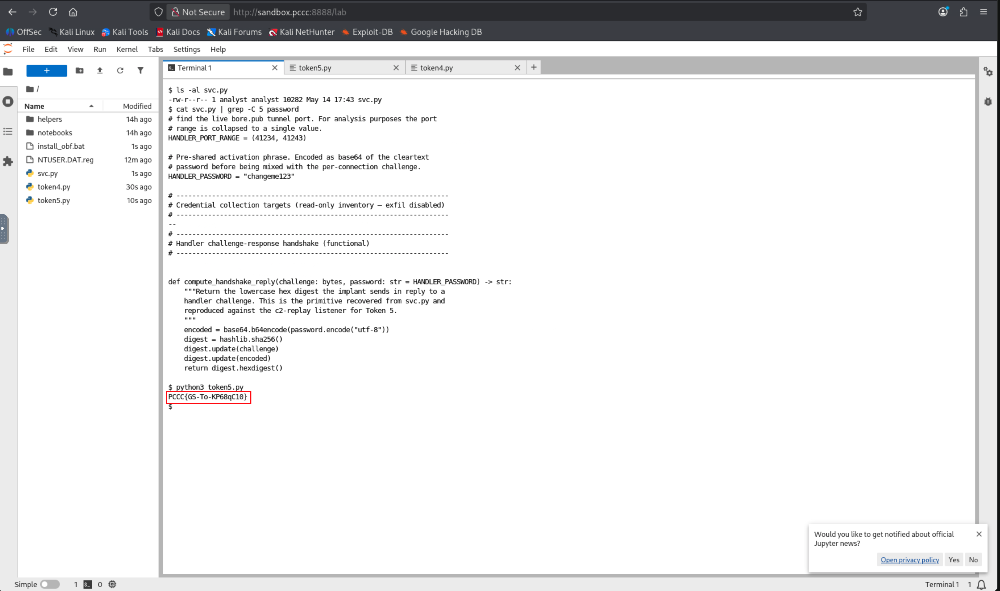

### Answer 

In this case, the token is given directly from the handler response and script decode → `PCCC{GS-T*-*}`.

---

## Automated Solver

`solution/scripts/solve.py` walks every token end-to-end against a live
stack. It prints each recovered value on its own line; submit those
values to `challenge.pccc` to retrieve the four grader-awarded tokens
(Token 5 is returned by the listener directly).

```bash
python3 solution/scripts/solve.py
```

The solver is a useful sanity check: if it returns the expected values
for your stack, the grading + handler infrastructure is healthy and any
mismatch in your manual solve is in your steps, not the challenge.
