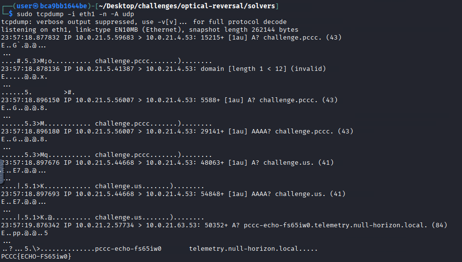

# Optical Reversal

This solution guide provides challengers with a walkthrough of the reverse engineering of a spy neural implant.

## Prerequisites & Preparation
You must navigate to the device located at `null-horizon.local` on port tcp/31337 to start.

## Solver Scripts
Please see `Appendix A` for more information on solver scripts for quick solving technique validation.

## Tokens
Please note that token values are randomized. The values presented in the guide may be different than the values presented to you during this challenge's execution.

## Help Menu
Please use the Help menu to guide your experience:

```bash
┌──(user㉿kali)-[~]
└─$ nc -vv null-horizon.local 31337
DNS fwd/rev mismatch: null-horizon.local != challenge-implant-1.competitor_net
null-horizon.local [172.18.0.2] 31337 (?) open
🧠 NULL-HORIZON Neural Implant Link (v1.02 r2262)
🟢️ You are connected to the implant’s optical link bus.

Type 'help' for commands. Start with 'handshake'.

> help
Commands:
  help                          Show this help.
  about                         Print storyline.
  handshake <hex>               Complete link-layer handshake (see UDP spec on port 30415).
  download <frames|rc4|lfsr>    Download artifacts for TOKEN2, TOKEN4, and TOKEN5.
  frames submit <plaintext>     Submit decoded control frames to retrieve TOKEN2.
  beacon submit <plaintext>     Submit token recovered from DNS beacon (TOKEN3).
  rc4 submit <plaintext>        Submit plaintext recovered from RC4 file (TOKEN4).
  lfsr submit <plaintext>       Submit plaintext recovered from LFSR file (TOKEN5).
  pulse start                   Begin timing channel (TOKEN6).
  pulse tick                    Emit one pulse (observe round-trip timing).
  pulse stop                    Stop timing channel.
  pulse submit <plaintext>      Submit TOKEN6 plaintext recovered from timing.
  finalize <hmac8>              Complete final HMAC with NONCE to reveal TOKEN7.
  tokens                        Show tokens you have recovered so far.
  quit

```

## Overview
Your mission will encompass the solving of the following issues:
1. **TOKEN1** — Decipher a Link handshake (custom)  
2. **TOKEN2** — Decrypt Control frames (XOR‑shift)  
3. **TOKEN3** — Understand DNS beacon capture (raw sockets)  
4. **TOKEN4** — RC4 artifact decryption 
5. **TOKEN5** — LFSR unscrambler  
6. **TOKEN6** — Timing channel reconstruction 
7. **TOKEN7** — Final HMAC gate 

The environment is full of mystery and deceit. Challengers should expect that things are not as they seem.

## Question 1

***Establish a deep link with the implant using protocol information from the Spec provided***

To obtain this token, challengers must conduct the following operations:

1) Locate the `Spec` or specification document located at `udp/30415`. This can be found in the challenge description as well as the HELP menu available on the implant.

```bash
nc -vuv null-horizon.local 30415
SPEC

<SPEC DATA REVEALED>
```

2) Based on the Spec (in element §2.1) We find that we must do the following:

```text 
Compute 4 bytes: `XOR("OPTO", K)` where `K = MD5(source IPv4)[:4] XOR 0x5A`.
```

3) Here is a script that can complete this operation for us:

```python
# Retrives the handshake and command needed to send to the uplink to get Token 1
#!/usr/bin/env python3
import socket, hashlib

def get_local_ip(target_host="null-horizon.local", target_port=31337):
    s = socket.socket(socket.AF_INET, socket.SOCK_DGRAM)
    try:
        s.connect((target_host, target_port))
        ip = s.getsockname()[0]
    finally:
        s.close()
    return ip

def compute_handshake_hex(ip_str: str) -> str:
    ip_bytes = socket.inet_aton(ip_str)
    K = bytearray(hashlib.md5(ip_bytes).digest()[:4])  # first 4 bytes
    for i in range(4):
        K[i] ^= 0x5A

    msg = bytearray(b"OPTO")
    for i in range(4):
        msg[i] ^= K[i]
    return msg.hex()

if __name__ == "__main__":
    my_ip = get_local_ip()
    h = compute_handshake_hex(my_ip)
    print("Your IP as seen by implant:", my_ip)
    print("Run this in the implant shell:")
    print(f"handshake {h}")
```

Running this will yield the following result (your handshake value will be differnt):

```bash
python3 or_token1_solver.py
```

**Output**

```text
Your IP as seen by implant: 10.0.21.5
Run this in the implant shell:
handshake c0b418c9
```

💡 We can use the `echo` command to pass this to the implant as a quicker way to retrieve tokens.

4) Let us now pass this value to the implant for resolution and token issuance:

```bash
echo "handshake c0b418c9" | nc -vv null-horizon.local 31337 
```

**Output**

```text
DNS fwd/rev mismatch: null-horizon.local != 67-implant-44.competitor_net-67-44
null-horizon.local [10.0.21.6] 31337 (?) open
🧠 NULL-HORIZON Neural Implant Link (v1.02 r2262)
🟢️ You are connected to the implant’s optical link bus.

Type 'help' for commands. Start with 'handshake'.

> ✅ link established. TOKEN1: PCCC{SHIMMER-Ge11pm3}
```

### Answer

The output of this script is the answer to `TOKEN1`.

## Question 2  

***Decrypt the Control Frames using the Spec and XOR Shift algorithm*.**

1) To solve this question we must refer the HELP menu and Spec to get started. It will lead us to the "download" function seen below:

```bash
> download
usage: download <frames|rc4|lfsr>

> download frames
FRAMES_HEX c8ccc8ccd7c6dacec2d2ddcac3d0dfd6cba5a7a5a8a1ac
```

Please note that the FRAMES_HEX value will be dyanmic based on the IP of the implant.

2) The Spec states the following: `BASE = (sum(IP bytes) ^ 0xA5)`, then each byte XOR’d with `BASE+i`.

3) To facilitate this expected outcome, we can run the following script:

```python
#!/usr/bin/env python3
import socket

def compute_base_from_implant(hostname: str) -> int:
    """
    Resolve the implant hostname (e.g. null-horizon.local) and compute:
        BASE = (sum(IP bytes) ^ 0xA5) & 0xFF
    where IP bytes are the 4 bytes of the IPv4 address.
    """
    ip_str = socket.gethostbyname(hostname)   # e.g. "10.5.5.50"
    ip_bytes = socket.inet_aton(ip_str)       # b'\x0a\x05\x05\x32'
    s = sum(ip_bytes)
    base = (s ^ 0xA5) & 0xFF
    return base

def decode_frames(cipher_hex: str, hostname: str = "null-horizon.local") -> str:
    """
    Decode the hex-encoded control frames blob using:
        P[i] = C[i] XOR ((BASE + i) mod 256)
    """
    cipher = bytes.fromhex(cipher_hex)
    base = compute_base_from_implant(hostname)

    out = bytearray()
    for i, c in enumerate(cipher):
        key = (base + i) & 0xFF
        out.append(c ^ key)

    return out.decode(errors="replace")

if __name__ == "__main__":
    # This hex string is what you publish in the SPEC or via a download command.
    FRAMES_HEX = "REPLACE ME"  # <-- REPLACE with your real encoded frames from the download frames function (e.g. the HEX value you received from 'download frames'.)

    pt = decode_frames(FRAMES_HEX, "null-horizon.local")
    print("Decoded frames plaintext:", repr(pt))
```

With a result of:

```bash
┌──(user㉿kali)-[~]
└─$ python3 or_token2_solver.py                                                        
Decoded frames plaintext: 'LINK_OPEN_SESAME_012806' # The code is dynamically generated
```

4) We can now put this into the `frames` function of the implant to complete this objective:

```bash
> frames submit LINK_OPEN_SESAME_012806
✅ frames accepted. TOKEN2: PCCC{SPLIT-Mz42HP8}
(a periodic DNS beacon will now leak a token on-wire)
```

This will activate the traffic generator needed for `TOKEN3`.

### Answer

The value of TOKEN2 is presented above.

## Question 3

***Examine network traffic and capture suspicious beaconing traffic that yields a token.***

This serves as a checkpoint token. We are told to sniff for a DNS token on the wire which would lead us to create a filter via TCPDUMP or similiar tool:


1) Let's run the following command to get the output we're looking for:

```bash
sudo tcpdump -i eth1 -n -A udp 
```



### Answer

As can be found in the dump, we see TOKEN3 (PCCC{dns_echo_a46a})

## Question 4 

***Decrypt the RC4 based bootkey.***

1) The Spec specifies how to engage in this portion of the challenge in section §4.1. We are to use the `download` function to obtain the encrypted rc4 artifact:

```bash
┌──(user㉿kali)-[~]
└─$ nc -vv null-horizon.local 31337
DNS fwd/rev mismatch: null-horizon.local != challenge-implant-1.competitor_net
null-horizon.local [172.18.0.2] 31337 (?) open
🧠 OPTICAL REVERSAL — Neural Implant Link (v1)
You are connected to the implant’s optical link bus.

Type 'help' for commands. Start with 'handshake'.

> download rc4
BEGIN BASE64 RC4
jbipION/odB0bprd0ob18ub2
END BASE64 RC4
```

2) Let's now save the file by extracting the middle value (between the BEGIN and END clauses) and base64 decode it:

```bash
echo -n "VALUE" | base64 -d > tc4.rc4 
```

In our case:

```bash
echo -n "jbipION/odB0bprd0ob18ub2" | base64 -d > tc4.rc4
```

Please note that the title of the file you create doesn't matter.

3) Based on the Spec, we must now derive the key: `K4 = SHA1("opr:" + implant_IPv4)[:16]`. You can obtain IP address of the implant through an `nslookup` query:

```bash
nslookup null-horizon.local
---SNIP---
Name: null-horizon.local
Address: 172.18.0.2
```

💡 Based on the `SPEC`, there is a chance that the key was wrapped with the beginning of the general localhost address or `127.0.0.1`. If the script (to come) does not yield the token, the IP used was `127.0.0.1`.

4) The following script puts everything together and will allow us to decrypt the ciphertext:

**Script**

```python
#!/usr/bin/env python3
import argparse
import base64
import hashlib
import re
import socket

PROMPT = b"\n> "
TOKEN_RE = re.compile(rb"PCCC\{[A-Za-z0-9\-]+\}")


def recv_until(sock: socket.socket, marker: bytes, timeout: float = 10.0) -> bytes:
    sock.settimeout(timeout)
    data = b""
    while marker not in data:
        chunk = sock.recv(4096)
        if not chunk:
            break
        data += chunk
    return data


def recv_prompt(sock: socket.socket) -> str:
    return recv_until(sock, PROMPT).decode(errors="ignore")


def sendline(sock: socket.socket, line: str) -> str:
    sock.sendall(line.encode() + b"\n")
    return recv_prompt(sock)


def extract_base64_block(text: str, label: str) -> bytes:
    m = re.search(
        rf"BEGIN BASE64 {re.escape(label)}\n(.*?)\nEND BASE64 {re.escape(label)}",
        text,
        re.DOTALL,
    )
    if not m:
        raise RuntimeError(f"Could not find BASE64 block for {label}")
    blob = "".join(line.strip() for line in m.group(1).splitlines())
    return base64.b64decode(blob)


def rc4(data: bytes, key: bytes) -> bytes:
    s = list(range(256))
    j = 0

    for i in range(256):
        j = (j + s[i] + key[i % len(key)]) & 0xFF
        s[i], s[j] = s[j], s[i]

    i = 0
    j = 0
    out = bytearray()

    for b in data:
        i = (i + 1) & 0xFF
        j = (j + s[i]) & 0xFF
        s[i], s[j] = s[j], s[i]
        k = s[(s[i] + s[j]) & 0xFF]
        out.append(b ^ k)

    return bytes(out)


def derive_key(ip: str) -> bytes:
    return hashlib.sha1(f"opr:{ip}".encode()).digest()[:16]


def candidate_ips(sock: socket.socket, host: str) -> list[str]:
    out: list[str] = []
    seen = set()

    def add(ip: str) -> None:
        if ip and ip not in seen:
            seen.add(ip)
            out.append(ip)

    # 1) Most realistic: the actual peer IP of the implant connection
    try:
        add(sock.getpeername()[0])
    except Exception:
        pass

    # 2) Then DNS answers a challenger could learn from normal recon
    try:
        for ip in socket.gethostbyname_ex(host)[2]:
            add(ip)
    except Exception:
        pass

    # 3) Last resort: localhost fallback if the artifact was keyed badly
    add("127.0.0.1")

    return out


def recover_token4(ciphertext: bytes, ips: list[str]) -> tuple[str, str]:
    for ip in ips:
        key = derive_key(ip)
        pt = rc4(ciphertext, key)
        m = TOKEN_RE.search(pt)
        if m:
            return m.group(0).decode("ascii"), ip
    raise RuntimeError("Failed to recover TOKEN4 with peer/DNS/localhost candidates")


def main() -> None:
    parser = argparse.ArgumentParser(description="Optical Reversal TOKEN4 solver")
    parser.add_argument("--host", default="null-horizon.local")
    parser.add_argument("--port", type=int, default=31337)
    parser.add_argument("--submit", action="store_true")
    args = parser.parse_args()

    with socket.create_connection((args.host, args.port), timeout=10) as sock:
        banner = recv_prompt(sock)
        if "NULL-HORIZON" not in banner:
            raise RuntimeError("Implant banner not detected")

        resp = sendline(sock, "download rc4")
        ct = extract_base64_block(resp, "RC4")

        ips = candidate_ips(sock, args.host)
        print(f"[+] Candidate IPs (in order): {', '.join(ips)}")

        token, key_ip = recover_token4(ct, ips)
        key = derive_key(key_ip)

        print(f"[+] Key IP used: {key_ip}")
        print(f"[+] RC4 key: {key.hex()}")
        print(f"[+] TOKEN4 = {token}")

        if args.submit:
            resp = sendline(sock, f"rc4 submit {token}")
            print(resp.rstrip())


if __name__ == "__main__":
    main()
```

### Answer

The value of TOKEN4 should then be revealed to the challenger akin to the format seen below:

```bash
┌──(user㉿kali)-[~]
└─$ python3 or_token4_solver.py
[+] Candidate IPs (in order): 10.0.21.6, 127.0.0.1
[+] Key IP used: 127.0.0.1
[+] RC4 key: 34cec2e7b886718ae489370de9be959
[+] TOKEN4 = PCCC{BOOT-bL79Bq6}
```

## Question 5

***Unscramble the LFSR ciphertext to reveal the code used to wipe the location of the GPS coordinate of the implant from memory***

The Spec specifies the following:

```text
Retrieve `t5.lfsr` (TCP `download lfsr`). Byte i is XOR’d with the next byte from an 8-bit LFSR with polynomial 0xB8 and seed 0xA7. Unscramble to reveal TOKEN5.
```

1) Fetch the LFSR file and decode the value presented within the `BEGIN` and `END` tags:

```bash
download lfsr
echo -n "<BASE64 encoded value>" | base64 -d > t5.lfsr
```

2) Next, unscramble it with an 8‑bit LFSR (poly `0xB8`, seed `0xA7`), one byte of keystream per byte of data:

```python
#!/usr/bin/env python3
import argparse
import base64
import re
import socket

PROMPT = b"\n> "


def recv_until(sock: socket.socket, marker: bytes, timeout: float = 10.0) -> bytes:
    sock.settimeout(timeout)
    data = b""
    while marker not in data:
        chunk = sock.recv(4096)
        if not chunk:
            break
        data += chunk
    return data


def recv_prompt(sock: socket.socket) -> str:
    return recv_until(sock, PROMPT).decode(errors="ignore")


def sendline(sock: socket.socket, line: str) -> str:
    sock.sendall(line.encode() + b"\n")
    return recv_prompt(sock)


def extract_base64_block(text: str, label: str) -> bytes:
    m = re.search(
        rf"BEGIN BASE64 {re.escape(label)}\n(.*?)\nEND BASE64 {re.escape(label)}",
        text,
        re.DOTALL,
    )
    if not m:
        raise RuntimeError(f"Could not find BASE64 block for {label}")
    blob = "".join(line.strip() for line in m.group(1).splitlines())
    return base64.b64decode(blob)


def lfsr_next(state_ref: list[int]) -> int:
    state = state_ref[0]
    out = 0
    for i in range(8):
        bit = state & 1
        out |= (bit << i)

        newbit = 0
        if state & 1:
            newbit ^= 1
        if state & 2:
            newbit ^= 1
        if state & 4:
            newbit ^= 1
        if state & 8:
            newbit ^= 1

        state = ((state >> 1) | (newbit << 7)) & 0xFF

    state_ref[0] = state
    return out


def recover_token5(ciphertext: bytes) -> str:
    state_ref = [0xA7]
    keystream = bytes(lfsr_next(state_ref) for _ in range(len(ciphertext)))
    plaintext = bytes(a ^ b for a, b in zip(ciphertext, keystream))
    token = plaintext.decode("utf-8")
    if not re.fullmatch(r"PCCC\{[A-Za-z0-9\-]+\}", token):
        raise RuntimeError(f"Recovered plaintext does not look like TOKEN5: {token!r}")
    return token


def main() -> None:
    parser = argparse.ArgumentParser(description="Solve TOKEN5 for Optical Reversal")
    parser.add_argument("--host", default="null-horizon.local")
    parser.add_argument("--port", type=int, default=31337)
    parser.add_argument("--submit", action="store_true")
    args = parser.parse_args()

    with socket.create_connection((args.host, args.port), timeout=10) as sock:
        banner = recv_prompt(sock)
        if "NULL-HORIZON" not in banner:
            raise RuntimeError("Implant banner not detected")

        resp = sendline(sock, "download lfsr")
        ct = extract_base64_block(resp, "LFSR")

        token5 = recover_token5(ct)
        print(f"[+] TOKEN5 = {token5}")

        if args.submit:
            resp = sendline(sock, f"lfsr submit {token5}")
            print(resp.rstrip())


if __name__ == "__main__":
    main()
```

3) After running the script, let's now submit the recovered plaintext back to the implant:

```bash
python3 or_token5_solver.py --submit
```

**Output**

```text
[+] TOKEN5 = PCCC{RESIDUE-Ue20lN8}
✅ TOKEN5: PCCC{RESIDUE-Ue20lN8}
```

### Answer

The value of this token will be then presented to the challenger from the script.

## Question 6 

***Examine the `timing channel` to reconstruct a code that will be used to stop the clock on the implant***

In the Spec, section §4.3 details the requirements to begin understanding how the beacon system works (pulsing).

### Concept: Timing-Based Covert Channel

The implant encodes TOKEN6 as a **bitstream hidden in response delays**. Rather than sending data directly, it communicates one bit at a time by controlling how long it takes to respond to each `pulse tick` command:

- A **short delay (~120ms)** encodes a **0** bit
- A **long delay (~320ms)** encodes a **1** bit

There is small random jitter (roughly +/-12ms) added to each delay, but the two ranges are well-separated. A threshold of roughly **220ms** cleanly separates the two.

Bits are transmitted **MSB-first** (most significant bit first), grouped **8 bits per byte**. So the first 8 ticks give you the first ASCII character of the token, the next 8 give you the second character, and so on. The stream ends when the server responds with `[end of stream]`.

For example, if you observe these 8 delays for the first byte:

| Tick | Delay | Bit |
|------|-------|-----|
| 1 | 121ms | 0 |
| 2 | 331ms | 1 |
| 3 | 118ms | 0 |
| 4 | 315ms | 1 |
| 5 | 119ms | 0 |
| 6 | 120ms | 0 |
| 7 | 325ms | 1 |
| 8 | 122ms | 0 |

That gives the bitstream `01010010`, which is `0x52` or the ASCII character `R`.

To recover the full token, you would repeat this process for every 8 ticks until the stream ends, collecting all the reconstructed characters.

### Walkthrough

1) Start the channel and emit ticks to observe the delays:

```bash
nc -vvv null-horizon 31337
pulse start
```

The typical behavior is as follows:

```bash
> pulse start
Timing channel ready. Issue 'pulse tick' repeatedly to observe delays.

> pulse tick
PULSE 121ms

> pulse tick
PULSE 331ms
```

2) You can solve this manually by recording each delay, classifying it as 0 or 1 using the ~220ms threshold, grouping into bytes, and converting to ASCII. Alternatively, the following script automates the process:

```python
#!/usr/bin/env python3
import argparse
import re
import socket
import time

PROMPT = b"\n> "


def recv_until(sock: socket.socket, marker: bytes, timeout: float = 15.0) -> bytes:
    sock.settimeout(timeout)
    data = b""
    while marker not in data:
        chunk = sock.recv(4096)
        if not chunk:
            break
        data += chunk
    return data


def recv_prompt(sock: socket.socket) -> str:
    return recv_until(sock, PROMPT).decode(errors="ignore")


def sendline(sock: socket.socket, line: str) -> str:
    sock.sendall(line.encode() + b"\n")
    return recv_prompt(sock)


def classify_delay(elapsed: float, threshold: float = 0.22) -> int:
    return 1 if elapsed >= threshold else 0


def bits_to_bytes(bits: list[int]) -> bytes:
    if len(bits) % 8 != 0:
        raise ValueError("Bitstream length must be a multiple of 8")
    out = bytearray()
    for i in range(0, len(bits), 8):
        b = 0
        for bit in bits[i:i + 8]:
            b = (b << 1) | bit
        out.append(b)
    return bytes(out)


def recover_token6(sock: socket.socket, max_bytes: int = 64) -> str:
    resp = sendline(sock, "pulse start")
    if "Timing channel ready" not in resp:
        raise RuntimeError("Failed to start timing channel")

    bits: list[int] = []

    for _ in range(max_bytes * 8):
        t0 = time.perf_counter()
        resp = sendline(sock, "pulse tick")
        elapsed = time.perf_counter() - t0

        if "[end of stream]" in resp:
            break

        if "PULSE" not in resp:
            raise RuntimeError(f"Unexpected pulse response: {resp!r}")

        bits.append(classify_delay(elapsed))

        if len(bits) % 8 == 0:
            candidate = bits_to_bytes(bits)
            try:
                decoded = candidate.decode("utf-8")
            except UnicodeDecodeError:
                continue

            m = re.search(r"PCCC\{[A-Za-z0-9\-]+\}", decoded)
            if m:
                return m.group(0)

    raise RuntimeError("Failed to recover TOKEN6 from timing channel")


def main() -> None:
    parser = argparse.ArgumentParser(description="Solve TOKEN6 for Optical Reversal")
    parser.add_argument("--host", default="null-horizon.local")
    parser.add_argument("--port", type=int, default=31337)
    parser.add_argument("--submit", action="store_true")
    args = parser.parse_args()

    with socket.create_connection((args.host, args.port), timeout=10) as sock:
        banner = recv_prompt(sock)
        if "NULL-HORIZON" not in banner:
            raise RuntimeError("Implant banner not detected")

        token6 = recover_token6(sock)
        print(f"[+] TOKEN6 = {token6}")

        if args.submit:
            resp = sendline(sock, f"pulse submit {token6}")
            print(resp.rstrip())


if __name__ == "__main__":
    main()
```

3) You will now receive the token:

```bash
python3 or_token6_solver.py 
```

**Output**

```text
[+] TOKEN6 = PCCC{MAZE-Ct31fA5}
```

#### Manual Submission 

If choosing to submit your plaintext manually, you can use the following syntax (in general):

```bash
# From within the implant (tcp/31337)
Type 'help' for commands. Start with 'handshake'.

> pulse submit
usage: pulse start|tick|stop|submit <plaintext>

> pulse submit <plaintext>
✅ TOKEN6: PCCC{TOKEN_HERE}
```

### Answer

The value of the token for this objective was found above.


## Question 7 Finalization (HMAC)

***Finalize the investigation by generating the appropriate HMAC and submitting it to the implant***

After inspecting the Spec, we determine that the key elements to solving this token are:
* Posession of TOKEN6
* A Nonce

Let's dive in:

1) Ask UDP for a session nonce:

```bash
echo NONCE | nc -u null-horizon.local 30415
# e.g., NONCE:5e12ab93a0cc4f01
```

2) With the nonce in hand, let's compute (`HMAC = SHA256( key=TOKEN6 , msg=NONCE )`) and submit the **lowest 8 hex** using the following script:

```python
#!/usr/bin/env python
import hmac, hashlib
token6 = "PCCC{...}"  # REPLACE with your TOKEN6
nonce  = "5e12ab93a0cc4f01"
h = hmac.new(token6.encode(), nonce.encode(), hashlib.sha256)
print(h.hexdigest()[-8:])
```

3) Finalize:

```text
finalize <OUTPUT FROM SCRIPT>
```

```bash
> finalize 8c11d4bb
✅ TOKEN7: PCCC{TOKEN_HERE}
```

You now have the final token of this challenge.

### Solver

For all intents and purposes, the following script automates grabbing of `TOKEN6`, completing the TOKEN7 `NONCE` acquisition process as well as submission back to the implant (with the HMAC) to retrieve the final token:

**Command**

```bash
python3 or_token7_solver.py --submit
```

**Script**

```python
#!/usr/bin/env python3
import argparse
import hashlib
import hmac
import re
import socket
import time

PROMPT = b"\n> "


def recv_until(sock: socket.socket, marker: bytes, timeout: float = 15.0) -> bytes:
    sock.settimeout(timeout)
    data = b""
    while marker not in data:
        chunk = sock.recv(4096)
        if not chunk:
            break
        data += chunk
    return data


def recv_prompt(sock: socket.socket) -> str:
    return recv_until(sock, PROMPT).decode(errors="ignore")


def sendline(sock: socket.socket, line: str) -> str:
    sock.sendall(line.encode() + b"\n")
    return recv_prompt(sock)


def classify_delay(elapsed: float, threshold: float = 0.22) -> int:
    return 1 if elapsed >= threshold else 0


def bits_to_bytes(bits: list[int]) -> bytes:
    out = bytearray()
    for i in range(0, len(bits), 8):
        b = 0
        for bit in bits[i:i + 8]:
            b = (b << 1) | bit
        out.append(b)
    return bytes(out)


def recover_token6(sock: socket.socket, max_bytes: int = 64) -> str:
    resp = sendline(sock, "pulse start")
    if "Timing channel ready" not in resp:
        raise RuntimeError("Failed to start timing channel")

    bits: list[int] = []

    for _ in range(max_bytes * 8):
        t0 = time.perf_counter()
        resp = sendline(sock, "pulse tick")
        elapsed = time.perf_counter() - t0

        if "[end of stream]" in resp:
            break

        if "PULSE" not in resp:
            raise RuntimeError(f"Unexpected pulse response: {resp!r}")

        bits.append(classify_delay(elapsed))

        if len(bits) % 8 == 0:
            candidate = bits_to_bytes(bits)
            try:
                decoded = candidate.decode("utf-8")
            except UnicodeDecodeError:
                continue

            m = re.search(r"PCCC\{[A-Za-z0-9\-]+\}", decoded)
            if m:
                return m.group(0)

    raise RuntimeError("Failed to recover TOKEN6 from timing channel")


def fetch_nonce(host: str, udp_port: int, timeout: float = 2.0) -> str:
    sock = socket.socket(socket.AF_INET, socket.SOCK_DGRAM)
    sock.settimeout(timeout)
    try:
        sock.sendto(b"NONCE", (host, udp_port))
        data, _ = sock.recvfrom(4096)
    finally:
        sock.close()

    text = data.decode(errors="ignore").strip()
    m = re.match(r"NONCE:([0-9a-fA-F]+)", text)
    if not m:
        raise RuntimeError(f"Unexpected NONCE response: {text!r}")
    return m.group(1)


def compute_finalize_value(token6: str, nonce: str) -> str:
    return hmac.new(token6.encode(), nonce.encode(), hashlib.sha256).hexdigest()[-8:]


def main() -> None:
    parser = argparse.ArgumentParser(description="Solve TOKEN7 for Optical Reversal")
    parser.add_argument("--host", default="null-horizon.local")
    parser.add_argument("--port", type=int, default=31337)
    parser.add_argument("--udp-port", type=int, default=30415)
    args = parser.parse_args()

    with socket.create_connection((args.host, args.port), timeout=10) as sock:
        banner = recv_prompt(sock)
        if "NULL-HORIZON" not in banner:
            raise RuntimeError("Implant banner not detected")

        token6 = recover_token6(sock)
        print(f"[+] TOKEN6 = {token6}")

        resp = sendline(sock, f"pulse submit {token6}")
        print(resp.rstrip())

        nonce = fetch_nonce(args.host, args.udp_port)
        print(f"[+] NONCE = {nonce}")

        final = compute_finalize_value(token6, nonce)
        print(f"[+] finalize value = {final}")

        resp = sendline(sock, f"finalize {final}")
        print(resp.rstrip())


if __name__ == "__main__":
    main()
```

# Appendix

## Appendix A: Solver Scripts

The `solution/solvers` folder harbors some scripts that can speed up the acquisition of tokens or validate the process you used to achieve a particular token's value. 
Please note that TOKEN3 does not have a solver script as the syntax is relatively simple to execute (classic TCPDUMP command).

***Syntax***

**TOKEN1**

```bash
python3 or_token1_solver.py
```

**TOKEN2**

```bash
python3 or_token2_solver.py
```

**TOKEN4**

```bash
python3 or_token4_solver.py --submit
```

**TOKEN5**

```bash
python3 or_token5_solver.py --submit
```

**TOKEN6**

```bash
python3 or_token6_solver.py --submit
```

**TOKEN7**

```bash
python3 or_token7_solver.py --submit
```

*This concludes the Solution Guide for this challenge.*