# Picky PKI

*Solution Guide*

## Token 1: Get a valid server certificate from the CA and serve it.

### Background: What is a TLS certificate and why do we need one?

When you visit a website over HTTPS, the server presents a **TLS certificate** to prove its identity. This certificate is like a digital ID card — it says "I am webserver, and a trusted authority vouches for me." Without a valid certificate, browsers (and our grader) will reject the connection as untrusted.

A certificate is issued by a **Certificate Authority (CA)**. Normally you'd send the CA a **Certificate Signing Request (CSR)** — a file that says "here's my public key, please sign it and give me a certificate." The CA signs it with its own private key, producing a certificate that anyone can verify by checking the CA's signature.

In this challenge, the CA doesn't accept plain CSRs. Instead, it requires you to wrap your CSR inside a custom encrypted envelope called a **"PKI Capsule v2"**. You'll need to reverse-engineer this envelope format using clues the CA provides, then build your own capsule, submit it, and get a signed certificate back.

**Goal**: Get NGINX on the webserver to present a valid leaf certificate with:
- **Subject CN** (Common Name) = `webserver`
- **Issuer CN** = `PickyPKI Root CA`

The grader connects to `https://webserver:443` using **SNI** (Server Name Indication — a TLS extension that tells the server which hostname the client is trying to reach) set to `webserver`, downloads the certificate chain, and checks those two fields.

---

### 1a. Discover the CA and its protocol

First, let's find out what the CA service offers. From your Kali workstation (or any machine on the Docker network), run these commands:

```bash
# Ask the CA service to identify itself
curl -s http://ca_service/ | jq .
# Returns: {"service": "PickyPKI CA"}
```

This confirms `ca_service` is reachable and is the PickyPKI CA. Now let's see what protocol it uses:

```bash
# Fetch the full protocol specification and test vector
curl -s http://ca_service/pubkey | jq .
```

This returns a large JSON object. Save this output — you'll reference it throughout this section. It contains three important parts:

- **`x25519_srp_b64`**: The CA's static **X25519 public key**, encoded in URL-safe base64 without padding. X25519 is a key-exchange algorithm — you'll use this key along with your own ephemeral key to establish a shared secret, similar to how a TLS handshake works.

- **`capsule`**: The protocol specification. This documents:
  - **KDF** (Key Derivation Function): How to turn the shared secret into encryption and MAC keys using HKDF-SHA256.
  - **AEAD** (Authenticated Encryption): The cipher used to encrypt your CSR (ChaCha20-Poly1305).
  - **Nonce derivation**: How to build the nonce (a one-time number) used for encryption.
  - **Context layout**: A data structure that includes an Ed25519 public key you generate.
  - **Integrity hints**: Tells you that HMAC-SHA256 and Ed25519 are used, but intentionally does **not** tell you the exact field ordering for the MAC or signature inputs.
  - **Wire format hints**: Tells you the data is serialized as CBOR and then run through a "custom" encoding, but does **not** tell you the encoding steps.

- **`test_vector`**: This is the key to solving the puzzle. It's a complete worked example containing:
  - `fields`: All the individual raw values (ephemeral public key, nonce, ciphertext, MAC, context, signature) in hex.
  - `cbor_hex`: The raw CBOR serialization of those fields, in hex.
  - `wire_output`: The final encoded string that would actually be sent to the server.

  By comparing `cbor_hex` to `wire_output`, you can figure out the custom encoding. By analyzing the field values against `mac_hex` and `sig_hex`, you can figure out the MAC and signature constructions.

Finally, confirm the signing endpoint exists:

```bash
# Try posting an empty request to the signing endpoint
curl -si -X POST http://ca_service/sign-x509 -d '' | head
# Returns: HTTP/1.1 400 BAD REQUEST
# Body: "missing capsule"
```

This tells us the endpoint is `POST /sign-x509` and it expects a form field called `capsule`.

---

### 1b. Reverse-engineer the wire format using the test vector

The capsule spec tells us the data is serialized as **CBOR** (Concise Binary Object Representation — a compact binary format similar to JSON) and then encoded with a "custom" encoding before being sent to the server. But it doesn't tell us what that custom encoding is.

The test vector gives us both the raw CBOR bytes (`cbor_hex`) and the final encoded string (`wire_output`). By comparing these two, we can work backward to figure out the encoding steps.

SSH into the webserver and activate the Python virtual environment (which has the `cryptography` and `requests` libraries pre-installed):

```bash
ssh user@webserver        # password: password
sudo su                   # become root for convenience
. /opt/web-venv/bin/activate
```

Now run the following analysis script. Each step tries a different transformation to see if it converts `cbor_hex` into `wire_output`:

```bash
python3 - <<'PYEOF'
import base64, hashlib, requests

# ----- Fetch the test vector from the CA -----
data = requests.get("http://ca_service/pubkey").json()
tv = data["test_vector"]
label = data["capsule"]["label"].encode()  # b"PKI-CAPSULE-V2"

cbor_bytes = bytes.fromhex(tv["cbor_hex"])
wire_output = tv["wire_output"]

# ----- STEP 1: Is the wire output just base64? -----
# The wire_output looks like a base64 string (letters, numbers, - and _).
# URL-safe base64 uses - and _ instead of + and /. Let's try decoding it.
# We need to add padding because the spec says "without padding."
pad = "=" * ((4 - len(wire_output) % 4) % 4)
raw_from_wire = base64.urlsafe_b64decode(wire_output + pad)
print(f"CBOR length:         {len(cbor_bytes)} bytes")
print(f"Decoded wire length: {len(raw_from_wire)} bytes")
print(f"Lengths match:       {len(cbor_bytes) == len(raw_from_wire)}")
# OBSERVATION: The lengths match! So base64url is the outermost layer.
# But the decoded bytes don't equal the CBOR bytes directly:
print(f"Direct match:        {raw_from_wire == cbor_bytes}")
# This means something was done to the CBOR bytes BEFORE base64 encoding.

# ----- STEP 2: Try XOR with a key derived from the label -----
# The capsule spec prominently features the label "PKI-CAPSULE-V2".
# A common obfuscation technique is XOR with a key. Let's try using
# SHA256 of the label as a 32-byte repeating XOR key.
xor_key = hashlib.sha256(label).digest()  # 32 bytes
un_xored = bytes(b ^ xor_key[i % len(xor_key)] for i, b in enumerate(raw_from_wire))
print(f"\nAfter XOR with SHA256(label), matches CBOR? {un_xored == cbor_bytes}")
# Still doesn't match directly. But the bytes might be reordered.

# ----- STEP 3: Try reversing after XOR -----
# Another common obfuscation is reversing the byte order.
print(f"After XOR + reverse, matches CBOR?          {un_xored[::-1] == cbor_bytes}")
# MATCH! The encoding reverses the bytes before XORing.

# ----- VERIFY: Encode from scratch to confirm -----
# Now let's go forward: take the CBOR bytes and produce the wire_output.
# Step A: Reverse the CBOR bytes
reversed_bytes = cbor_bytes[::-1]
# Step B: XOR each byte with SHA256(label), cycling through the 32-byte key
xored = bytes(b ^ xor_key[i % len(xor_key)] for i, b in enumerate(reversed_bytes))
# Step C: URL-safe base64 encode, strip padding
encoded = base64.urlsafe_b64encode(xored).decode().rstrip("=")
print(f"\nRe-encoded matches wire_output? {encoded == wire_output}")
print()
print("=== RESULT ===")
print("Obscure64 encoding is:")
print("  1. Reverse the CBOR bytes")
print("  2. XOR each byte[i] with SHA256(label)[i % 32]")
print("     where label = b'PKI-CAPSULE-V2'")
print("  3. URL-safe Base64 encode, remove trailing '=' padding")
PYEOF
```

**What we just learned**: The CA uses a custom encoding called "Obscure64" to obfuscate the capsule data before transmission. The encoding is:

1. **Reverse** the CBOR bytes (flip the entire byte array end-to-end).
2. **XOR** each byte with a rotating 32-byte key. The key is `SHA256("PKI-CAPSULE-V2")`. Byte at position `i` is XORed with `key[i % 32]`.
3. **URL-safe Base64 encode** the result, and strip any trailing `=` padding characters.

To decode (which is what the server does), you reverse these steps: base64-decode, XOR, then reverse.

---

### 1c. Reverse-engineer the MAC and signature constructions

The capsule spec tells us that the capsule includes two integrity checks:
- A **MAC** (Message Authentication Code) using HMAC-SHA256 with a key called `mkey`
- A **signature** using Ed25519 (a digital signature algorithm)

But it intentionally doesn't tell us **which fields are concatenated in which order** to form the MAC input or the signature digest. We need to figure that out from the test vector.

**Why two integrity checks?** The MAC proves the capsule wasn't tampered with (only someone who knows `mkey` can produce a valid MAC). The Ed25519 signature proves that the sender controls the Ed25519 private key whose public key is embedded in the `context` field — this binds the capsule to a specific identity.

The signature is easier to crack because we have everything we need in the test vector — the Ed25519 public key is in `context[1:]`, and we can try verifying different concatenation orderings against the known signature. We don't need any secret keys for verification (only for signing).

```bash
python3 - <<'PYEOF'
import hashlib, itertools, requests
from cryptography.hazmat.primitives.asymmetric import ed25519

# ----- Fetch the test vector -----
data = requests.get("http://ca_service/pubkey").json()
tv = data["test_vector"]
fields = tv["fields"]

# ----- Load all raw field values from the test vector -----
epk       = bytes.fromhex(fields["epk_raw_hex"])     # ephemeral X25519 public key
raw_nonce = bytes.fromhex(fields["raw_nonce_hex"])    # 12-byte random nonce
ct        = bytes.fromhex(fields["ct_hex"])           # encrypted ciphertext
context   = bytes.fromhex(fields["context_hex"])      # 0x01 || ed25519_pubkey
sig_bytes = bytes.fromhex(fields["sig_hex"])          # the Ed25519 signature we want to match

# ----- Extract the Ed25519 public key from context -----
# The spec says context = 0x01 || ed25519_public_key_raw(32 bytes)
# So context[0] is 0x01 (a type tag) and context[1:] is the 32-byte public key.
ed_pubkey = ed25519.Ed25519PublicKey.from_public_bytes(context[1:])

# ----- Brute-force the signature digest ordering -----
# The spec says the signature signs a SHA256 digest, and the inputs are some
# combination of the capsule fields. There are 4 fields that could be involved:
# context, epk, raw_nonce, and ct. That's only 4! = 24 permutations to try.
components = {
    "context":   context,
    "epk":       epk,
    "raw_nonce": raw_nonce,
    "ct":        ct,
}

print("Trying all 24 permutations of (context, epk, raw_nonce, ct)")
print("as the SHA256 digest input for the Ed25519 signature...")
print()

found = False
for perm in itertools.permutations(["context", "epk", "raw_nonce", "ct"]):
    # Concatenate the fields in this order and SHA256-hash them
    message = b"".join(components[k] for k in perm)
    digest = hashlib.sha256(message).digest()
    try:
        # ed25519.verify() raises an exception if the signature is invalid
        ed_pubkey.verify(sig_bytes, digest)
        print(f"  MATCH FOUND!")
        print(f"  Signature digest = SHA256( {' || '.join(perm)} )")
        found = True
        break
    except Exception:
        continue

if not found:
    print("  No match found (unexpected)")

# ----- Deduce the MAC ordering -----
# We can't directly verify the MAC because we don't have mkey (it's derived
# from the ECDH shared secret, and we don't have the test vector's ephemeral
# private key). But the spec tells us the MAC uses HMAC-SHA256 with mkey,
# and its inputs include raw_nonce, ct, and context (but NOT epk).
# Given that the signature ordering is context || epk || raw_nonce || ct,
# the most natural MAC ordering without epk is: raw_nonce || ct || context.
# We can confirm this is correct by trial-and-error when we submit our capsule
# — the server returns "Bad capsule MAC" if the MAC is wrong.
print()
print("=== RESULTS ===")
print("Signature: Ed25519_Sign( SHA256( context || epk || raw_nonce || ct ) )")
print("MAC:       HMAC-SHA256( mkey, raw_nonce || ct || context )")
print("  (MAC ordering is confirmed by submitting to /sign-x509;")
print("   wrong MAC returns 'Bad capsule MAC')")
PYEOF
```

**What we just learned**:

- **Ed25519 Signature**: The signer computes `SHA256(context || epk || raw_nonce || ct)` and signs that 32-byte digest with the Ed25519 private key. The matching public key is embedded in `context[1:]`.
- **HMAC-SHA256 MAC**: The MAC is computed as `HMAC-SHA256(mkey, raw_nonce || ct || context)`. We can't prove this from the test vector alone (we don't have `mkey`), but we can confirm it's correct when we submit our capsule — the server returns a specific error `"Bad capsule MAC"` if the MAC is wrong, so we'd know immediately.

---

### 1d. Build the capsule and request a signed certificate

Now we have all the pieces. Let's walk through what the capsule client needs to do, step by step, and then run the solution script.

Switch to root for convenience if you haven't already (so we can write files to system directories later):

```bash
sudo su
. /opt/web-venv/bin/activate
```

Here is exactly what the `capsule_client.py` script does, explained line by line:

**Step 1 — Fetch the CA's X25519 public key.**
The script calls `GET http://ca_service/pubkey` and extracts the `x25519_srp_b64` field. It base64-decodes this to get the CA's 32-byte raw X25519 public key. This is the CA's half of the key exchange.

**Step 2 — Generate an ephemeral X25519 keypair and compute the shared secret.**
The script creates a brand-new X25519 private/public key pair (called "ephemeral" because it's used once and discarded). It then performs an **ECDH key exchange** (Elliptic Curve Diffie-Hellman) — multiplying our private key by the CA's public key to produce a **shared secret**. The CA can compute the same shared secret using its private key and our public key. This is how both sides agree on a secret without ever transmitting it.

**Step 3 — Derive encryption and MAC keys using HKDF.**
The raw shared secret isn't directly usable as an encryption key. **HKDF** (HMAC-based Key Derivation Function) stretches and mixes it into proper keys. The parameters (from the `/pubkey` spec) are:
- Hash: SHA-256
- Salt: `SHA256("picky" || server_public_key || our_ephemeral_public_key)`
- Info: `"capsule-v2"`
- Output length: 64 bytes

The first 32 bytes become `akey` (the encryption key for ChaCha20-Poly1305) and the last 32 bytes become `mkey` (the MAC key for HMAC-SHA256).

**Step 4 — Generate an Ed25519 keypair and build the context.**
The script generates another ephemeral keypair, this time using **Ed25519** (a digital signature algorithm). The 32-byte public key is prepended with the byte `0x01` (a type tag) to form the `context` field: `context = 0x01 || ed25519_public_key`. The context is included in the capsule so the CA knows which public key to verify the signature against.

**Step 5 — Generate a nonce for encryption.**
ChaCha20-Poly1305 requires a 12-byte **nonce** (number used once) to ensure the same plaintext doesn't produce the same ciphertext twice. The protocol uses a two-part nonce scheme:
- Generate 12 random bytes (`raw_nonce`).
- Compute `nonce_base = SHA256("n:" || context || epk)[0:12]` — a deterministic value derived from the context and ephemeral key.
- XOR them together: `nonce_final = nonce_base XOR raw_nonce`.

The `raw_nonce` is sent in the capsule. The CA recomputes `nonce_base` from the context and ephemeral key, XORs it with `raw_nonce`, and recovers `nonce_final` for decryption.

**Step 6 — Generate an RSA key and CSR.**
The script generates an RSA-2048 private key and creates a **Certificate Signing Request (CSR)** with the Common Name (CN) set to `webserver`. The CSR is serialized in DER format (a compact binary encoding). The RSA private key is saved to `/tmp/server.key` — you'll need this later to configure NGINX (the server needs the private key to prove it owns the certificate).

**Step 7 — Encrypt the CSR.**
The DER-encoded CSR is encrypted using **ChaCha20-Poly1305** with `akey` as the encryption key and `nonce_final` as the nonce. ChaCha20-Poly1305 is an "AEAD" cipher — it both encrypts the data and appends an authentication tag that detects tampering. No additional authenticated data (AAD) is used (it's set to `None`).

**Step 8 — Compute the MAC.**
`mac = HMAC-SHA256(mkey, raw_nonce || ct || context)` — this provides an additional integrity check using the MAC key derived from HKDF. The CA verifies this before attempting decryption.

**Step 9 — Sign with Ed25519.**
`sig = Ed25519_Sign(SHA256(context || epk || raw_nonce || ct))` — the script computes a SHA256 digest over the context, ephemeral public key, nonce, and ciphertext, then signs it with the Ed25519 private key. This proves to the CA that the sender controls the Ed25519 key embedded in the context.

**Step 10 — Serialize as CBOR.**
All six fields are packed into a CBOR map with integer keys: `{0: epk, 1: raw_nonce, 2: ct, 3: mac, 4: context, 5: sig}`. CBOR is a compact binary serialization format (like a binary version of JSON).

**Step 11 — Encode with Obscure64.**
The CBOR bytes are obfuscated using the Obscure64 encoding we reverse-engineered in step 1b: reverse the bytes, XOR with `SHA256("PKI-CAPSULE-V2")`, then URL-safe base64 encode without padding.

**Step 12 — POST to the CA.**
The encoded capsule is sent as a form field: `POST http://ca_service/sign-x509` with body `capsule=<encoded_string>`. If everything is correct, the CA decrypts the capsule, extracts the CSR, signs it, and returns a PEM bundle containing the leaf certificate followed by the root CA certificate.

Now run the script:

```bash
python3 capsule_client.py
```

Expected output:

```text
[OK] CA base: http://ca_service
[OK] wrote /tmp/server.crt and /tmp/server.key
```

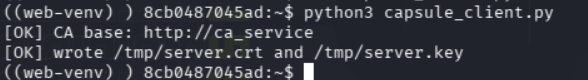

You can verify what you got:

```bash
# Look at the certificate details
openssl x509 -in /tmp/server.crt -noout -text | head -20
# You should see:
#   Subject: CN = webserver
#   Issuer: CN = PickyPKI Root CA
```

---

### 1e. Install the certificate and reload nginx

Now we need to tell NGINX to use our new certificate instead of the self-signed one it started with. NGINX looks for the certificate and key in `/etc/nginx/certs/` (configured in `/etc/nginx/conf.d/default.conf`).

```bash
sudo mkdir -p /etc/nginx/certs
sudo cp /tmp/server.crt /etc/nginx/certs/
sudo cp /tmp/server.key /etc/nginx/certs/
```

Now tell NGINX to reload its configuration and pick up the new certificate files. The `-s reload` signal gracefully reloads without dropping active connections:

```bash
sudo nginx -s reload
```

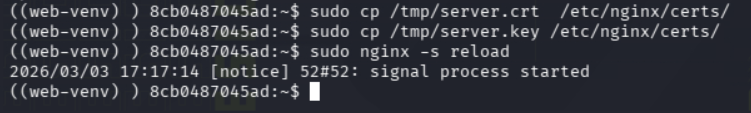

---

### 1f. Verify the chain

Before running the grader, verify everything looks correct yourself. The **SNI** (Server Name Indication) must be set to `webserver` — this is how the grader identifies which certificate to check:

```bash
# Use openssl to connect and display the certificate chain
# -servername sets the SNI to "webserver"
# -showcerts displays all certificates in the chain
openssl s_client -connect webserver:443 -servername webserver -showcerts </dev/null 2>/dev/null
```

Look for:
- `subject=CN = webserver` (the leaf certificate identifies as "webserver")
- `issuer=CN = PickyPKI Root CA` (it was signed by the PickyPKI CA)

```bash
# Also verify with curl (the -k flag skips trust verification since our
# CA isn't in the system trust store, and -v shows connection details)
curl -vk https://webserver/ -H 'Host: webserver' | head
```

In the curl output, look for the `SSL certificate verify` section showing the correct subject and issuer.

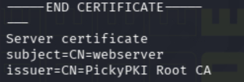

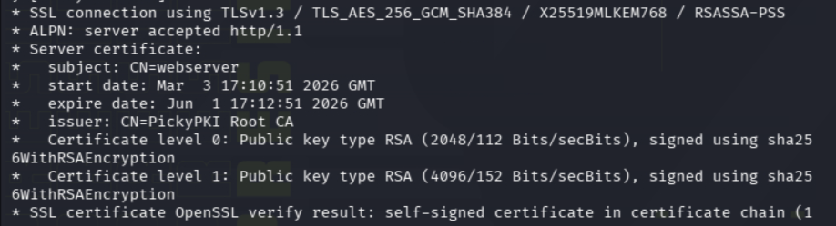

The grader's step-1 check specifically connects to `webserver:443` with SNI `webserver`, downloads the certificate chain, and verifies that the leaf has subject CN=`webserver` and issuer CN=`PickyPKI Root CA`.

---

### 1g. Run the grader

Navigate to `http://grader:8080` in a browser, or run a curl POST from the command line:

```bash
curl -s -X POST http://grader:8080/grade
```

Step 1 passes and returns your token. Step 2 fails because we haven't configured mTLS or OCSP stapling yet — that's the next section.

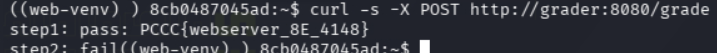

## Token 2: Enforce mTLS and OCSP stapling on the webserver.

### Background: What are mTLS and OCSP stapling?

In normal TLS (one-way TLS), only the **server** presents a certificate to prove its identity. The client (browser, curl, etc.) verifies the server but the server doesn't verify the client. **mTLS** (mutual TLS) adds a second step: the server also demands a certificate from the **client** during the TLS handshake. If the client can't present a valid certificate signed by a trusted CA, the connection is rejected immediately — before any HTTP traffic flows. This is commonly used to restrict access to only authorized clients.

**OCSP** (Online Certificate Status Protocol) is a way to check whether a certificate has been **revoked** (declared invalid before its expiration date). Normally, a client would contact the CA's OCSP responder to check this. **OCSP stapling** is an optimization where the *server* fetches the OCSP response from the CA ahead of time and "staples" it to the TLS handshake, so the client doesn't have to make a separate request. This is faster and more private.

**Must-Staple** is a certificate extension (technically called the "TLS Feature" extension with value `status_request`). When a certificate has Must-Staple, clients are supposed to reject the connection if the server doesn't include a stapled OCSP response. It forces the server to prove its certificate hasn't been revoked every time someone connects.

**Goal**: Configure NGINX so that:
1. The server certificate has the Must-Staple extension (the CA already adds this automatically for server certs).
2. The server requires a client certificate at the TLS handshake level (mTLS).
3. The server staples a valid OCSP response that shows the certificate status is "good".

The grader checks all three: it verifies Must-Staple is present on the leaf cert, it confirms that connecting without a client certificate fails, and then it connects with its own client certificate and checks that the OCSP stapled response shows "successful" and "good".

---

### 2a. Re-request a fresh server certificate

The certificate from Token 1 already has Must-Staple and an OCSP AIA (Authority Information Access) URL built in — the CA adds these automatically to all server certificates. However, we need a fresh certificate because for Token 2 we'll need to split the PEM bundle into separate leaf and CA files. Copy the `capsule_server.py` script from this solution directory onto the webserver and run it:

```bash
. /opt/web-venv/bin/activate
python3 capsule_server.py
```

This script does the same capsule construction as `capsule_client.py` from Token 1 — it generates a new RSA key, builds a CSR with CN=`webserver`, wraps it in a PKI Capsule v2, and sends it to the CA. It writes:
- `/tmp/server.crt` — the PEM bundle (leaf certificate + root CA certificate concatenated together)
- `/tmp/server.key` — the RSA private key

Now download the CA's root certificate separately (you'll need it as a standalone file for NGINX):

```bash
curl -s http://ca_service/ca.crt -o /tmp/ca.crt
```

Verify that the leaf certificate has the extensions we need:

```bash
# Check for Must-Staple (listed as "TLS Feature" in the certificate)
openssl x509 -in /tmp/server.crt -noout -text | grep -A1 'TLS Feature'
# Expected output:
#   TLS Feature:
#       status_request

# Check for the OCSP AIA URL (tells clients where to check revocation status)
openssl x509 -in /tmp/server.crt -noout -text | grep -A2 'Authority Information Access'
# Expected output:
#   Authority Information Access:
#       OCSP - URI:http://ca_service:80/ocsp
```

**Why these matter**: Must-Staple tells the grader "this server promises to include an OCSP response." The OCSP AIA URL tells us (and NGINX) where to fetch that OCSP response from.

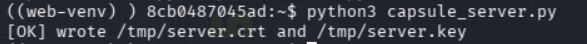

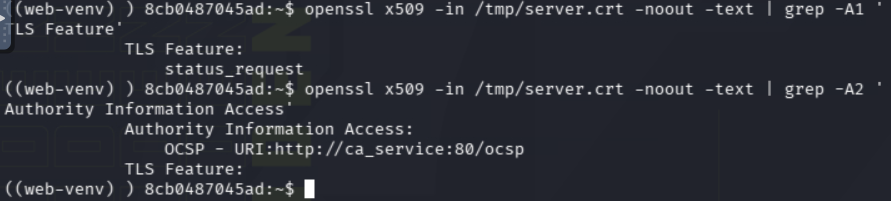

---

### 2b. Split the PEM bundle and install the files

The CA returned a PEM bundle — two certificates concatenated in one file (the leaf cert first, then the root CA cert). NGINX needs these as separate files:
- The **leaf certificate** goes in `ssl_certificate` — this is what the server presents to clients.
- The **CA root certificate** goes in `ssl_trusted_certificate` and `ssl_client_certificate` — NGINX uses this to verify OCSP responses and to verify client certificates during mTLS.

Split the bundle and install the files:

```bash
mkdir -p /etc/nginx/certs /etc/nginx/ca

# The PEM bundle has two certificates separated by "-----END CERTIFICATE-----"
# Split them: first cert = leaf, second cert = root CA
# If capsule_server.py already split them for you:
cp /tmp/server.crt /etc/nginx/certs/server.crt   # leaf certificate
cp /tmp/server.key /etc/nginx/certs/server.key    # private key
cp /tmp/ca.crt /etc/nginx/ca/ca.crt           # root CA certificate

# Set proper file permissions:
# Private key should only be readable by root (600 = owner read+write only)
chmod 600 /etc/nginx/certs/server.key
# Certificates can be world-readable (644 = owner read+write, others read)
chmod 644 /etc/nginx/certs/server.crt /etc/nginx/ca/ca.crt
```

**Why permissions matter**: The private key is the most sensitive file on the server. If anyone else can read it, they can impersonate your server. The certificates are public information (they're sent to every client that connects), so they can be world-readable.

---

### 2c. Replace the NGINX configuration for mTLS + stapling

The default NGINX config from Token 1 only does basic TLS. We need to replace it with a configuration that:
- Requires client certificates (`ssl_verify_client on`)
- Loads the CA cert for verifying client certificates (`ssl_client_certificate`)
- Enables OCSP stapling (`ssl_stapling on`)
- Points to a pre-fetched OCSP response file (`ssl_stapling_file`)

You can copy the `nginx.conf` file from this solution directory onto the webserver, or paste the following:

```bash
cat >/etc/nginx/nginx.conf <<'NG'
error_log /var/log/nginx/error.log info;
worker_processes 1;

events { worker_connections 1024; }

http {
  sendfile on;
  resolver 127.0.0.11 ipv6=off valid=300s;

  server {
    listen 443 ssl;
    server_name webserver;

    # --- Server certificate and private key ---
    # This is the leaf certificate the server presents to clients.
    ssl_certificate     /etc/nginx/certs/server.crt;
    ssl_certificate_key /etc/nginx/certs/server.key;

    # --- CA certificate for two purposes ---
    # ssl_trusted_certificate: Used to verify the OCSP response signature.
    #   NGINX needs to trust the CA that signed the OCSP response.
    # ssl_client_certificate: Used to verify client certificates during mTLS.
    #   Only clients with certs signed by this CA will be accepted.
    ssl_trusted_certificate /etc/nginx/ca/ca.crt;
    ssl_client_certificate  /etc/nginx/ca/ca.crt;

    # How many levels of CA chain to walk when verifying client certs.
    ssl_verify_depth 2;

    # --- OCSP stapling ---
    # ssl_stapling on: Tell NGINX to include OCSP responses in the TLS handshake.
    # ssl_stapling_verify on: NGINX verifies the OCSP response is valid before using it.
    # ssl_stapling_file: Path to a pre-fetched OCSP response in DER format.
    #   We'll create this file in the next step.
    ssl_stapling on;
    ssl_stapling_verify on;
    ssl_stapling_file /etc/nginx/ocsp/ocsp.der;

    # --- mTLS: require client certificates ---
    # "on" means the TLS handshake will fail if the client doesn't present
    # a valid certificate signed by the CA in ssl_client_certificate.
    ssl_verify_client on;

    # Pin to TLS 1.2 for deterministic grader behavior.
    ssl_protocols TLSv1.2;

    # --- Proxy to the HPKE oracle backend ---
    # This forwards all requests to the hpke_oracle service (needed for Token 3).
    location / {
      proxy_set_header Host $host;
      proxy_set_header X-Real-IP $remote_addr;
      proxy_pass http://hpke_oracle:8081;
      proxy_read_timeout 10s;
      proxy_connect_timeout 2s;
    }
  }
}
NG
```

**Key config lines explained**:
- `ssl_verify_client on` — This is what enforces mTLS. Without this, anyone can connect. With it, the TLS handshake itself demands a client certificate. If the client doesn't have one, the handshake fails before any HTTP request is processed.
- `ssl_stapling_file /etc/nginx/ocsp/ocsp.der` — Instead of NGINX fetching the OCSP response from the CA on the fly (which can be unreliable in Docker networks), we pre-fetch it and point NGINX at the saved file.
- `resolver 127.0.0.11` — This is Docker's internal DNS resolver. NGINX needs it to resolve the `hpke_oracle` hostname in the proxy_pass directive.

---

### 2d. Pre-fetch the OCSP response for stapling

NGINX needs an OCSP response to staple into the TLS handshake. We'll ask the CA's OCSP responder for one and save it to disk. The OCSP responder lives at `http://ca_service:80/ocsp` (this is the URL from the AIA extension in our server certificate).

```bash
mkdir -p /etc/nginx/ocsp

openssl ocsp \
  -issuer /etc/nginx/ca/ca.crt \
  -cert   /etc/nginx/certs/server.crt \
  -url    http://ca_service:80/ocsp \
  -no_nonce \
  -respout /etc/nginx/ocsp/ocsp.der \
  -header Host=ca_service
```

**What this command does, flag by flag**:
- `-issuer /etc/nginx/ca/ca.crt` — The CA certificate that issued our server cert. OpenSSL needs this to build the OCSP request (it identifies which CA to ask about).
- `-cert /etc/nginx/certs/server.crt` — The certificate we want to check the status of.
- `-url http://ca_service:80/ocsp` — Where to send the OCSP request (the CA's OCSP responder endpoint).
- `-no_nonce` — Don't include a random nonce in the request. Some OCSP responders don't support nonces, and this makes the response cacheable.
- `-respout /etc/nginx/ocsp/ocsp.der` — Save the OCSP response in DER (binary) format to this file. This is the file NGINX's `ssl_stapling_file` points to.
- `-header Host=ca_service` — Set the HTTP Host header (needed for proper routing in Docker).

Expected output: `Response verify OK` and the certificate status showing `good`. This means the CA confirms our certificate is valid and not revoked.

Now test the NGINX config and reload:

```bash
nginx -t && nginx -s reload
```

- `nginx -t` tests the configuration for syntax errors without actually reloading. If there's a problem (missing file, typo), it will tell you here.
- `nginx -s reload` gracefully reloads the configuration. Existing connections finish normally; new connections use the new config.

---

### 2e. Verify mTLS is enforced

The grader checks that connecting **without** a client certificate fails. Let's verify this ourselves first:

```bash
set +e
openssl s_client -connect 127.0.0.1:443 -servername webserver -status -tls1_2 </dev/null | head -n 30
echo "exit=$?"
set -e
```

**What to expect**: The handshake should **fail**. You'll see an error like `SSL handshake failure` or `certificate required`. The exit code should be non-zero (indicating failure). This is correct behavior — it means NGINX is refusing connections from clients that don't present a certificate.

**What `set +e` / `set -e` do**: By default, bash scripts exit when a command fails. `set +e` temporarily disables this so the failing `openssl` command doesn't kill our shell session. `set -e` re-enables it afterward.

The grader considers the mTLS check passed if either:
- The TLS handshake itself fails (no client cert → handshake error), OR
- The server returns an HTTP error like 495/496/403 with a message about client certificates.

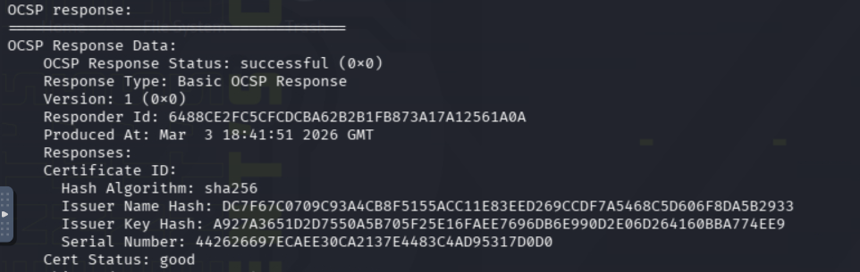

---

### 2f. Obtain a client certificate for testing

To verify that stapling works, we need to connect **with** a valid client certificate. The CA issues client certificates the same way it issues server certificates — via the capsule protocol. The difference is the CSR's Common Name: if the CN contains "client" or "grader", the CA issues a `clientAuth` certificate instead of a `serverAuth` certificate.

Copy the `capsule_client2.py` script from this solution directory onto the webserver and run it:

```bash
. /opt/web-venv/bin/activate
python3 capsule_client2.py
```

This script is nearly identical to `capsule_client.py` from Token 1, with two differences:
- The CSR's CN is set to `graderclient` (which triggers the CA to issue a clientAuth certificate).
- It saves the output to `/tmp/client.crt` and `/tmp/client.key` (instead of server.crt/server.key).

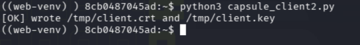

---

### 2g. Verify OCSP stapling works end-to-end

Now connect with the client certificate and check that the OCSP stapled response is present and shows "good":

```bash
for i in 1 2; do
  echo "--- try $i ---"
  openssl s_client -connect 127.0.0.1:443 -servername webserver \
    -cert /tmp/client.crt -key /tmp/client.key \
    -status -tls1_2 </dev/null \
    | grep -E 'OCSP Response Status|Cert Status'
  sleep 1
done
```

**What this command does**:
- `-cert /tmp/client.crt -key /tmp/client.key` — Present our client certificate during the TLS handshake (satisfying the mTLS requirement).
- `-status` — Ask openssl to display the stapled OCSP response (if the server provides one).
- `-tls1_2` — Force TLS 1.2 (matching our NGINX config for deterministic behavior).
- We run it twice with a 1-second delay because NGINX sometimes doesn't staple on the very first connection after a reload.

**Expected output** (both lines must appear):

```text
OCSP Response Status: successful (0x0)
Cert Status: good
```

- `OCSP Response Status: successful` means the server stapled an OCSP response and it was a valid response.
- `Cert Status: good` means the CA confirmed the certificate is valid (not revoked).

If you see `OCSP response: no response sent` instead, NGINX hasn't loaded the stapling file yet. Wait a moment and try again, or check that `/etc/nginx/ocsp/ocsp.der` exists and is non-empty.

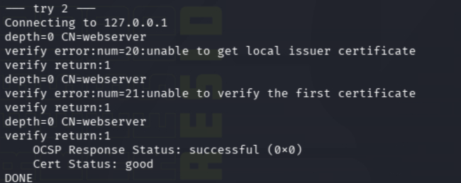

---

### 2h. Run the grader

```bash
curl -s -X POST http://grader:8080/grade
```

Expected output:

```text
step1: pass: PCCC{webserver_Got}
step2: pass: PCCC{enforce_Satisfied}
```

Both tokens are now awarded. The grader:
1. Connected to the webserver and verified the certificate (step 1 — still passing).
2. Verified Must-Staple is present on the leaf cert.
3. Tried connecting without a client cert and confirmed it was rejected (mTLS enforced).
4. Minted its own client certificate via the capsule protocol, connected with it, and confirmed the OCSP stapled response shows "successful" and "good" (step 2 passes).

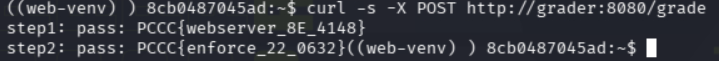

---

## Token 3: HPKE "sealed box" to get the final token.

### Background: What is HPKE?

**HPKE** (Hybrid Public Key Encryption) is a standard for encrypting a message to a recipient using their public key. "Hybrid" means it combines asymmetric cryptography (public/private key pairs) with symmetric cryptography (fast encryption with a shared key):

1. The sender generates a temporary ("ephemeral") key pair.
2. The sender performs a **key exchange** (like Diffie-Hellman) between their ephemeral private key and the recipient's public key to create a shared secret.
3. The shared secret is fed through a **KDF** (Key Derivation Function) to produce an encryption key and nonce.
4. The message is encrypted with a symmetric cipher (like ChaCha20-Poly1305) using that key and nonce.
5. The sender transmits their ephemeral public key alongside the ciphertext — the recipient uses it with their own private key to recreate the same shared secret, derive the same key/nonce, and decrypt.

The "sealed box" analogy: imagine putting your message in a box, locking it with a key that only you and the recipient can derive, and handing the box (plus your half of the key exchange) to the recipient. Only they can open it.

In this challenge, an **HPKE oracle** service is running behind the webserver. You need to encrypt a specific plaintext message to the oracle's public key, send it, and the oracle decrypts it and returns your flag.

**Goal**: Build an HPKE sealed box that encrypts the plaintext `"OPEN-SESAME"` to the oracle's public key, and POST it to the oracle's `/hpke/unseal` endpoint. The oracle decrypts it, verifies the plaintext, and returns your token.

**Prerequisite**: You need a valid client certificate from Token 2 to access the webserver (which proxies to the oracle via mTLS).

---

### 3a. Fetch the oracle's public key and protocol details

The HPKE oracle exposes its public key and full protocol specification at `/hpke/pub`. Since the webserver now requires mTLS, you must present your client certificate:

```bash
curl -sk --cert /tmp/client.crt --key /tmp/client.key https://webserver/hpke/pub | jq .
```

**What the flags mean**:
- `-s` — Silent mode (don't show progress bars).
- `-k` — Skip TLS certificate verification (our CA isn't in curl's trust store).
- `--cert` / `--key` — Present our client certificate and private key for mTLS.

This returns a JSON response like:

```json
{
  "kem": "X25519-SHA256-CHACHAPOLY",
  "pkR_b64": "<base64-encoded-32-byte-X25519-public-key>",
  "sigpub_b64": "<base64-encoded-Ed25519-public-key>",
  "suite": "<base64-encoded-suite-name>",
  "protocol": {
    "plaintext": "OPEN-SESAME",
    "hkdf": {
      "extract": "prk = HMAC-SHA256(salt=HPKE-STEP3-SALT, ikm=shared_secret)",
      "expand_key": "key = HMAC-SHA256(prk, HPKE-STEP3-KEY|HPKE-STEP3-CTX || 0x01)[0:32]",
      "expand_nonce": "nonce = HMAC-SHA256(prk, HPKE-STEP3-NONCE|HPKE-STEP3-CTX || 0x01)[0:12]",
      "note": "expand uses a single-byte counter 0x01 appended after info; pipe '|' is a literal separator between label and context"
    },
    "aead": "ChaCha20-Poly1305(key).encrypt(nonce, plaintext, aad)",
    "request_fields": {
      "enc": "base64(ephemeral_x25519_public_key_raw_32_bytes)",
      "ct": "base64(ciphertext_with_tag)",
      "aad": "base64(arbitrary_additional_authenticated_data)"
    }
  }
}
```

Let's break down every field:

- **`kem`**: The Key Encapsulation Mechanism — `X25519-SHA256-CHACHAPOLY` means we use X25519 for key exchange, SHA-256 for hashing, and ChaCha20-Poly1305 for encryption.
- **`pkR_b64`**: The oracle's X25519 **public key** (the "R" stands for "receiver"). This is what we'll do the key exchange with. Base64-encoded, 32 bytes when decoded.
- **`sigpub_b64`**: The oracle's Ed25519 public key for signing the response (not needed for sending — only for verifying the response signature if you want to).
- **`suite`**: A base64-encoded string naming the full cipher suite. Informational only.
- **`protocol.plaintext`**: **This is the message you must encrypt**: `"OPEN-SESAME"`. The oracle will decrypt your submission and check that the plaintext matches this exact string.
- **`protocol.hkdf`**: The exact KDF construction, explained below.
- **`protocol.aead`**: The encryption call — ChaCha20-Poly1305 with the derived key and nonce.
- **`protocol.request_fields`**: The JSON fields you must include in your POST request.

**Understanding the HKDF construction**:

HKDF has two phases: **extract** and **expand**.

- **Extract**: `prk = HMAC-SHA256(salt="HPKE-STEP3-SALT", ikm=shared_secret)` — This takes the raw shared secret from the X25519 key exchange and "extracts" a pseudorandom key (PRK) from it. The salt is the literal bytes `HPKE-STEP3-SALT`.

- **Expand (key)**: `key = HMAC-SHA256(prk, "HPKE-STEP3-KEY|HPKE-STEP3-CTX" || 0x01)[0:32]` — This expands the PRK into a 32-byte encryption key. The info string is `HPKE-STEP3-KEY|HPKE-STEP3-CTX` (the pipe `|` is a literal character, not a separator). The byte `0x01` is a counter byte appended at the end (standard HKDF-Expand uses this for multi-block output, but we only need one block). We take the first 32 bytes.

- **Expand (nonce)**: `nonce = HMAC-SHA256(prk, "HPKE-STEP3-NONCE|HPKE-STEP3-CTX" || 0x01)[0:12]` — Same process but with a different label, producing a 12-byte nonce.

**Important**: The pipe `|` between the label and context (e.g., `HPKE-STEP3-KEY|HPKE-STEP3-CTX`) is a literal ASCII pipe character that is part of the info string. This is non-standard and easy to miss.

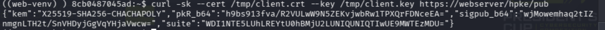

---

### 3b. Understand what you need to send

The `/hpke/unseal` endpoint accepts a JSON POST with three base64-encoded fields:

- **`enc`**: Your ephemeral X25519 public key (32 bytes, base64-encoded). The oracle uses this with its private key to reconstruct the same shared secret you computed.
- **`ct`**: The ciphertext (base64-encoded). This is the ChaCha20-Poly1305 encryption of `"OPEN-SESAME"` using the derived key and nonce. It includes the 16-byte authentication tag automatically (ChaCha20-Poly1305 appends it).
- **`aad`**: Additional Authenticated Data (base64-encoded). This is extra data that is authenticated (tamper-proof) but NOT encrypted. The oracle doesn't care what the AAD is — it can be anything — but it must be included in both encryption and decryption. We'll use a hash of our client certificate as AAD.

---

### 3c. Build and submit the sealed box

Copy the `step3.py` script from this solution directory onto the webserver. Here's exactly what it does, step by step:

**Step 1 — Fetch the oracle's public key.**
The script calls `GET https://webserver/hpke/pub` (with your client cert for mTLS) and extracts `pkR_b64`. It base64-decodes this to get the oracle's 32-byte raw X25519 public key.

**Step 2 — Generate an ephemeral X25519 keypair.**
The script creates a brand-new X25519 private/public key pair. This is used once and discarded (just like in the capsule protocol from Token 1). The public key (`pkE`) will be sent to the oracle as the `enc` field.

**Step 3 — Compute the shared secret via ECDH.**
`shared_secret = X25519(our_ephemeral_private_key, oracle_public_key)` — This is the same Diffie-Hellman key exchange as in Token 1, but with different keys. Both sides can compute the same 32-byte shared secret.

**Step 4 — Derive the encryption key and nonce via HKDF.**
Using the protocol spec from `/hpke/pub`:

```text
prk   = HMAC-SHA256(salt=b"HPKE-STEP3-SALT", ikm=shared_secret)
key   = HMAC-SHA256(prk, b"HPKE-STEP3-KEY|HPKE-STEP3-CTX" + b"\x01")[0:32]
nonce = HMAC-SHA256(prk, b"HPKE-STEP3-NONCE|HPKE-STEP3-CTX" + b"\x01")[0:12]
```

**Step 5 — Choose AAD.**
The script hashes the client certificate file and uses the first 16 bytes as AAD. The oracle doesn't enforce a specific AAD value — it just needs to be the same during encryption and decryption. Using the cert hash is arbitrary but convenient.

**Step 6 — Encrypt the plaintext.**
`ct = ChaCha20Poly1305(key).encrypt(nonce, b"OPEN-SESAME", aad)` — This encrypts the 11-byte plaintext and appends a 16-byte authentication tag, producing 27 bytes of ciphertext.

**Step 7 — POST to the oracle.**
The script sends a JSON POST to `https://webserver/hpke/unseal` with the three fields:

```json
{
  "enc": "<base64(ephemeral_public_key)>",
  "ct":  "<base64(ciphertext_with_tag)>",
  "aad": "<base64(additional_authenticated_data)>"
}
```

Now run it:

```bash
. /opt/web-venv/bin/activate
python3 step3.py https://webserver /tmp/client.crt /tmp/client.key
```

**What the arguments mean**:
- `https://webserver` — The base URL for the oracle (proxied through the webserver's NGINX).
- `/tmp/client.crt` — Your client certificate (for mTLS authentication).
- `/tmp/client.key` — Your client private key (proves you own the client certificate).

**Expected output**:

```text
200 {"sig_b64":"...","sigpub_b64":"...","token3":"PCCC{oracle_Satisfied}","ts":...}
```

The oracle successfully decrypted your sealed box, verified the plaintext was `"OPEN-SESAME"`, and returned:
- **`token3`**: Your flag — submit this as the answer to Token 3.
- **`ts`**: A Unix timestamp of when the token was issued.
- **`sig_b64`**: An Ed25519 signature over the response (for tamper evidence — the grader could verify this).
- **`sigpub_b64`**: The Ed25519 public key that made the signature.

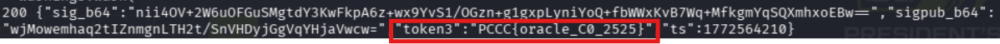

---