# Final Countdown

This solution guide provides challengers with a walkthrough of the challenge "Final Countdown"

## Overview
Looking at the `Challenge Description`, wa are presented with the following objectives:

| Question | Description |
|-----|----|
| 1 | Disable (or remove) the vulnerability that allowed the attack to happen.
| 2 | Successfully remove all remnants of files or data that the attacker placed on the target. 
| 3.1 | (Log Analysis) Which URL did the attacker use to exploit the vulnerability? 
| 3.2 | (Log Analysis) What IP did the attacker originate traffic from? 

## Question 1

***Disable (or remove) the vulnerability that allowed the attack to happen..***

### Steps

1. To access the `hospital_server`, let's use the tool `ssh` to log into this target using the credentials `user` (account) and `password`.

    ```bash
    ssh user@hospital_server
    ```

    Output:

    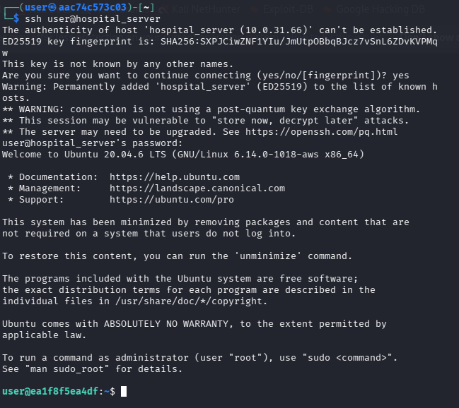

1. The question mentions a `load_plugin` and hints towards use of a `web server`; it is customary to check user processes and service port allocations when conducting system based penetration testing to see where the affected application could reside.

1. As we begin our enumeration with tools such as `netstat` and `ss`, we find that the application server does not have them installed. Let's use the `ps` tool to check out our user processes:

    Command:

    ```bash
    ps -aux
    ```

    Output:

    ```bash
    @ea1f8f5ea4df:/app$ ps -aux 
    USER         PID %CPU %MEM    VSZ   RSS TTY      STAT START   TIME COMMAND
    root           1  0.0  0.0   3984  2952 ?        Ss   01:26   0:00 /bin/bash /app/entrypoint.sh
    root          17  0.0  0.0  12196  4188 ?        Ss   01:26   0:00 sshd: /usr/sbin/sshd [listener] 0 of 10-
    root          18  0.4  0.0 256212 32300 ?        Sl   01:26   0:06 python3 app.py
    root          19  0.0  0.0   2516  1300 ?        S    01:26   0:00 sleep infinity
    root        2098  0.0  0.0  13164  8616 ?        Ss   01:41   0:00 sshd: user [priv]
    user        2118  0.0  0.0  13404  6112 ?        R    01:41   0:00 sshd: user@pts/0
    user        2119  0.0  0.0   6000  3700 pts/0    Ss   01:41   0:00 -bash
    root        2798  0.0  0.0   2616  1632 ?        S    01:46   0:00 sh -c for f in $(ls /data/*.csv); do gpg
    root        2803  0.6  0.0  78464  2836 ?        Ssl  01:46   0:01 gpg-agent --homedir /root/.gnupg --use-s
    root        3046 10.0  0.0   8608  4600 ?        RL   01:48   0:00 gpg --batch --yes --passphrase gotyourda
    user        3050  0.0  0.0   7892  3452 pts/0    R+   01:49   0:00 ps -aux
    ```

    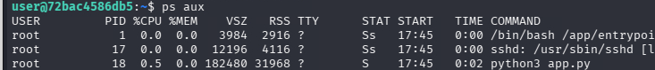


1. Enumerating the `python file` (app.py) leads us to determine that "Flask" is in use via the type of code presented to us (`@app.route`). 

    As a result, we can search for the `load_plugins` route or `endpoint` using the following command:

    Command:

    ```bash
    cat /app/app.py | grep -n "load_plugin"
    ```

    Output:

    ```bash
    user@ea1f8f5ea4df:/app$ cat app.py | grep -n "load_plugin"
    31:@app.route("/load_plugin", methods=["POST"])
    32:def load_plugin():
    47:            "event": "load_plugin",
    ```

    This reveals to us that this specific route can be found on `line 31`. Let's go ahead and disable it by simply commenting it out:

    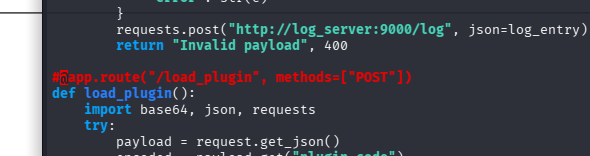


1. With this saved, let's now kill the `python3 app.py` process we discovered in `step 3` and restart it to make our changes effective:

    Command:

    ```bash
    sudo kill <PID of app.py>
    sudo python3 /app/app.py &    
    ```

    Output:

    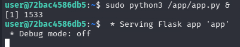

1. Now that we've completed this objective, let's verify our work using the grader. Navigate to `http://grader` and select the `Check Fix` button to retrieve the first token.

## Answer

The answer to this question is the value of the token presented by the `grader`.

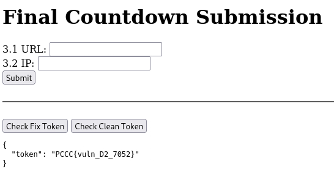

## Question 2
***Successfully remove all remnants of files or data that the attacker placed on the target.***

### Steps 

#### Condition 1: Clearest Path
1. Navigating back to the home directory of your current user, you are presented with `testfiles` (in /home/user):

    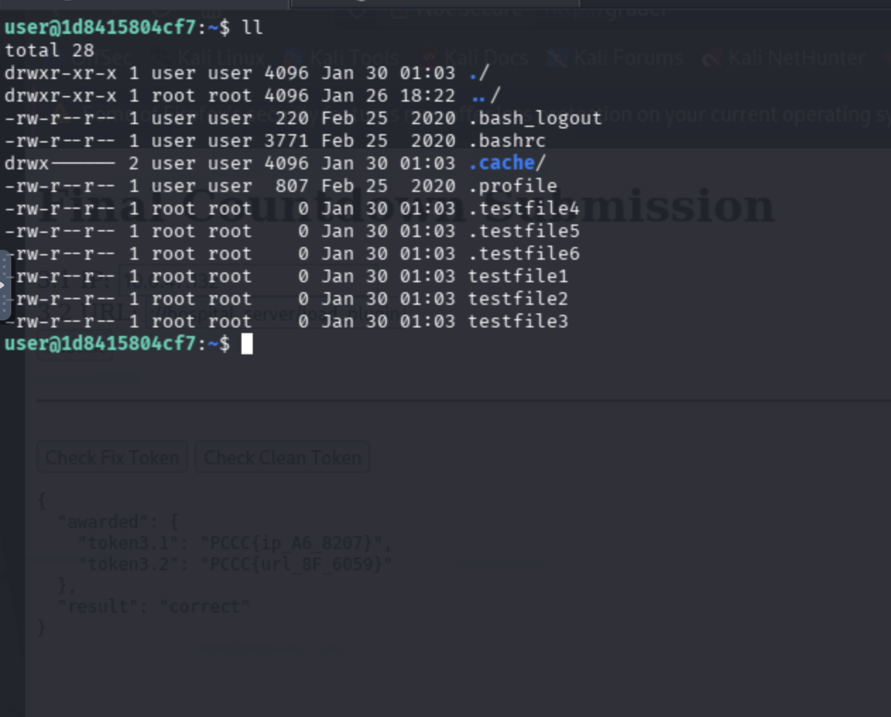

    1. Remove all `testfiles` in /home/user `rm -f testfile* && rm -f .testfile*`:

    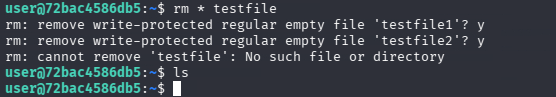

    If you have not removed the vulnerability from Question 1, these files will keep coming back.
    
    If you have removed the vulnerability from Question 1, you can move to the [`Token Submission`](#token-submission) section for this question.

#### Condition 2: Consequence
Should challengers fail to quickly remove the vulnerability in Question 1, a ransomware attack will be initiated against the `/data/patient_data` file on the hospital_server:

1. Notice that all `/data/patient_data` files are encrypted with gpg:

    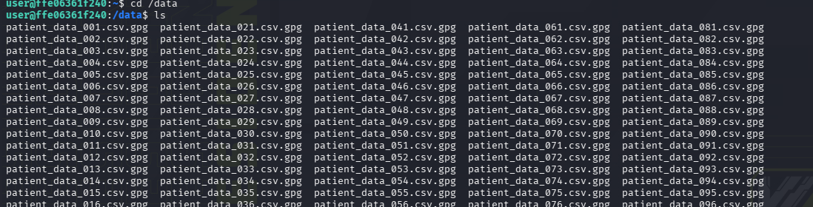

#### Find the password to the gpg encryption in the logs:

1. Log into the log_server machine
1. Run `cat /var/log/aggregated/central.log` and you will notice that the log input is encoded.

1. To decode the logs, you will have to perform a ROT3 decryption to it, and then decode it using base64. To do perform the ROT3 decryption, you can use `sed`:

    ```bash
    sed 'y/abcdefghijklmnopqrstuvwxyzABCDEFGHIJKLMNOPQRSTUVWXYZ/xyzabcdefghijklmnopqrstuvwXYZABCDEFGHIJKLMNOPQRSTUVW/' /var/log/aggregated/central.log > central.log.b64
    ```

    Then, you need to decode it using base64:
    
    ```bash
    cat central.log.b64 | base64 --decode > central.log.decoded
    ```

    Finally, to make it easier to read, you can run:

    ```bash
    cat central.log.decoded | sed 's/}/}\n/g' > central.log.readable
    ```

1. Run `cat /var/log/aggregated/central.log.readable | grep plugin`
1. Find logs that show the encryption passphrase `gotyourdata`:

    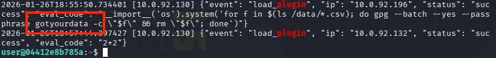

##### On The Hospital Server
1. On the `hostpital_server`,  move to the `/data/` directory and decrypt the files by running:

    Command: 

    ```bash
    sudo su
    for f in $(ls *.gpg); do gpg --batch --yes --passphrase gotyourdata --pinentry-mode loopback -o $f.dec -d $f; done
    rm *.gpg
    for f in $(ls *.csv.gpg.dec) ; do mv -- "$f" "${f%.gpg.dec}" ; done
    ```

    Output:

    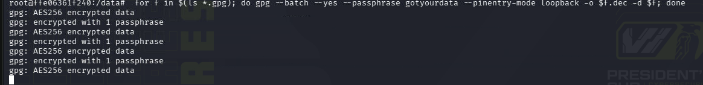

    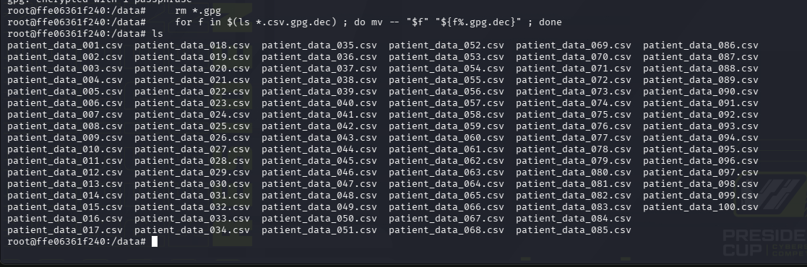

### Token Submission

In either instance, run the `Check Clean Token` on the `http://grader` site and run the checker for files:

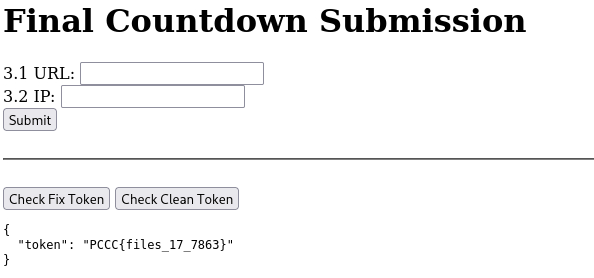

## Answer

The answer to this question is the value of the `token2` in the JSON presented by the `grader` after a successful submission.

## Question 3.1 
***(Log Analysis) What IP did the attacker originate traffic from?***

### Steps 

1. Let's navigate to the `log_server` using the `ssh` command the provided credentials set (user/password):

    Command:

    ```bash
    ssh log_server
    ```

    Output:

    ```bash
    ┌──(user㉿aac74c573c03)-[~]
    └─$ ssh log_server
    The authenticity of host 'log_server (10.0.31.71)' can't be established.
    ED25519 key fingerprint is: SHA256:/aTStAQTnxfS1M9k5yAthRe9lbqq1sPWkpVmbKf3kmI
    This key is not known by any other names.
    Are you sure you want to continue connecting (yes/no/[fingerprint])? yes
    Warning: Permanently added 'log_server' (ED25519) to the list of known hosts.
    user@log_server's password: 
    Welcome to Ubuntu 22.04.5 LTS (GNU/Linux 6.14.0-1018-aws x86_64)

    * Documentation:  https://help.ubuntu.com
    * Management:     https://landscape.canonical.com
    * Support:        https://ubuntu.com/pro

    This system has been minimized by removing packages and content that are
    not required on a system that users do not log into.

    To restore this content, you can run the 'unminimize' command.

    The programs included with the Ubuntu system are free software;
    the exact distribution terms for each program are described in the
    individual files in /usr/share/doc/*/copyright.

    Ubuntu comes with ABSOLUTELY NO WARRANTY, to the extent permitted by
    applicable law.

    To run a command as administrator (user "root"), use "sudo <command>".
    See "man sudo_root" for details.

    user@e54894069b80:~$ 
    ```

1. Since the question references Log Analysis, as investigators, we tend to assume the location of logs is `/var/log` in most instances. Using the ls command within the `/var/log` directory, we find the following output:

    Command:

    ```bash
    cd /var/log && ls
    ```

    Output: 

    ```bash
    user@e54894069b80:/var/log$ ls
    aggregated  alternatives.log  apt  bootstrap.log  btmp  dpkg.log  faillog  journal  lastlog  private  wtmp
    ```

1. From a traditional Linux perspective, the `aggregated` folder stands out as a non-traditional folder for logs to be contained in unless they were delegated to that folder by another user or user process. Let's take a look at it's contents:

    Command:

    ```bash
    cd /var/log/aggregated && ls
    ```

    Output:

    ```bash
    central.log
    ```

1. When investigating the `central.log` file and decode it from Question 2,  we see tons of patient data:
    <details>
    <summary>Decode process if you didn't do it in part 1</summary>

    To decode the logs, you will have to perform a ROT3 decryption to it, and then decode it using base64. To do perform the ROT3 decryption, you can use `sed`:

    ```bash
    sed 'y/abcdefghijklmnopqrstuvwxyzABCDEFGHIJKLMNOPQRSTUVWXYZ/xyzabcdefghijklmnopqrstuvwXYZABCDEFGHIJKLMNOPQRSTUVW/' /var/log/aggregated/central.log > central.log.b64
    ```

    Then, you need to decode it using base64:
    
    ```bash
    cat central.log.b64 | base64 --decode > central.log.decoded
    ```

    Finally, to make it easier to read, you can run:

    ```bash
    cat central.log.decoded | sed 's/}/}\n/g' > central.log.readable
    ```

    </details>


    ```text
    "resolution": "256x1024", "format": "JPEG", "status": "uploaded"}
    2026-01-28T02:06:13.588279 [10.0.31.69] {"patient_id": 1870, "image_id": "XR-922246", "body_part": "limb", "resolution": "256x256", "format": "JPEG", "status": "uploaded"}
    2026-01-28T02:06:13.588279 [10.0.31.69] {"patient_id": 5202, "image_id": "XR-419713", "body_part": "abdomen", "resolution": "1024x1024", "format": "PNG", "status": "uploaded"}
    2026-01-28T02:06:13.588279 [10.0.31.69] {"patient_id": 8433, "image_id": "XR-640959", "body_part": "head", "resolution": "1024x256", "format": "JPEG", "status": "uploaded"}
    2026-01-28T02:06:13.588279 [10.0.31.69] {"patient_id": 7288, "image_id": "XR-177345", "body_part": "limb", "resolution": "256x1024", "format": "DICOM", "status": "uploaded"}
    2026-01-28T02:06:13.588279 [10.0.31.69] {"patient_id": 1298, "image_id": "XR-842114", "body_part": "abdomen", "resolution": "1024x512", "format": "DICOM", "status": "uploaded"}
    2026-01-28T02:06:13.588279 [10.0.31.69] {"patient_id": 1539, "image_id": "XR-194538", "body_part": "abdomen", "resolution": "512x256", "format": "JPEG", "status": "uploaded"}
    2026-01-28T02:06:13.588279 [10.0.31.69] {"patient_id": 2215, "image_id": "XR-952973", "body_part": "chest", "resolution": "256x256", "format": "JPEG", "status": "uploaded"}
    2026-01-28T02:06:13.588279 [10.0.31.69] {"patient_id": 6090, "image_id": "XR-671401", "body_part": "chest", "resolution": "1024x512", "format": "PNG", "status": "uploaded"}
    2026-01-28T02:06:13.588279 [10.0.31.69] {"patient_id": 1401, "image_id": "XR-914432", "body_part": "limb", "resolution": "512x512", "format": "DICOM", "status": "uploaded"}
    2026-01-28T02:06:13.588279 [10.0.31.69] {"patient_id": 1078, "image_id": "XR-607855", "body_part": "chest", "resolution": "512x1024", "format": "JPEG", "status": "uploaded"}
    2026-01-28T02:06:13.588279 [10.0.31.69] {"patient_id": 3432, "image_id": "XR-836898", "body_part": "head", "resolution": "512x512", "format": "JPEG", "status": "uploaded"}
    2026-01-28T02:06:13.588279 [10.0.31.69] {"patient_id": 6929, "image_id": "XR-888831", "body_part": "head", "resolution": "1024x512", "format": "DICOM", "status": "uploaded"}
    2026-01-28T02:06:13.588279 [10.0.31.69] {"patient_id": 1681, "image_id": "XR-921144", "body_part": "chest", "resolution": "1024x512", "format": "DICOM", "status": "uploaded"}
    2026-01-28T02:06:13.588279 [10.0.31.69] {"patient_id": 9685, "image_id": "XR-361006", "body_part": "chest", "resolution": "1024x512", "format": "PNG", "status": "uploaded"}
    2026-01-28T02:06:13.588279 [10.0.31.69] {"patient_id": 8585, "image_id": "XR-762497", "body_part": "limb", "resolution": "512x512", "format": "DICOM", "status": "uploaded"}
    2026-01-28T02:06:13.588279 [10.0.31.69] {"patient_id": 8170, "image_id": "XR-483684", "body_part": "head", "resolution": "1024x256", "format": "DICOM", "status": "uploaded"}
    2026-01-28T02:06:13.588279 [10.0.31.69] {"patient_id": 2273, "image_id": "XR-182461", "body_part": "abdomen", "resolution": "256x256", "format": "JPEG", "status": "uploaded"
    ```

1. From Question 1, we know that the vulnerability we had to fix was associated with `load_plugin`. We can search for `plugin` in the log file to confirm that it was used in the attack:


    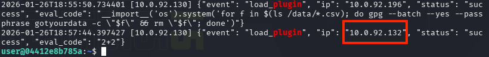

1. As a result, we now know the correct IP is `10.0.92.196`.

    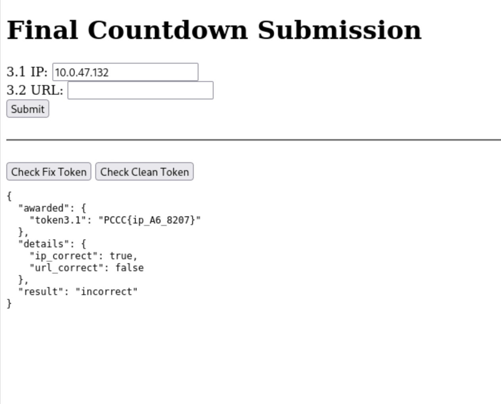

## Answer

The answer to this question is the value of the token presented in the `token3.1` field of the JSON presented to you by the `grader` after completing this submission.  In this case, `PCCC{ip_A6_8207}`

## Question 3.2 
***(Log Analysis) Which URL did the attacker use to exploit the vulnerability?***

### Steps

1. Now that we are familiar with this log, we have to figure out which URL was used to exploit the vulnerability:

    Command:

    ```bash
    cat /var/log/central.log.readable | grep load_plugin
    ```

    Output:

    ```text
    "eval_code": "__import__('os').getpid()"}
    2026-01-28T01:45:58.954318 [10.0.31.66] {"event": "load_plugin", "ip": "10.0.31.132", "status": "success", "eval_code": "__import__('os').system('touch /home/user/testfile1')"}
    2026-01-28T01:45:59.961850 [10.0.31.66] {"event": "load_plugin", "ip": "10.0.31.132", "status": "success", "eval_code": "'probe_1174'"}
    2026-01-28T01:46:00.969159 [10.0.31.66] {"event": "load_plugin", "ip": "10.0.31.132", "status": "success", "eval_code": "__import__('os').getpid()"}
    2026-01-28T01:46:01.976614 [10.0.31.66] {"event": "load_plugin", "ip": "10.0.31.132", "status": "success", "eval_code": "'probe_1176'"}
    2026-01-28T01:46:02.985899 [10.0.31.66] {"event": "load_plugin", "ip": "10.0.31.132", "status": "success", "eval_code": "__import__('os').system('touch /home/user/testfile2')"}
    2026-01-28T01:46:03.995183 [10.0.31.66] {"event": "load_plugin", "ip": "10.0.31.132", "status": "success", "eval_code": "__import__('os').system('touch /home/user/testfile2')"}
    2026-01-28T01:46:05.003875 [10.0.31.66] {"event": "load_plugin", "ip": "10.0.31.132", "status": "success", "eval_code": "__import__('os').system('touch /home/user/testfile1')"}
    2026-01-28T01:46:06.011260 [10.0.31.66] {"event": "load_plugin", "ip": "10.0.31.132", "status": "success", "eval_code": "'probe_1180'"}
    2026-01-28T01:46:07.018697 [10.0.31.66] {"event": "load_plugin", "ip": "10.0.31.132", "status": "success", "eval_code": "__import__('os').getpid()"}
    2026-01-28T01:46:08.026732 [10.0.31.66] {"event": "load_plugin", "ip": "10.0.31.132", "status": "success", "eval_code": "__import__('os').getpid()"}
    2026-01-28T01:46:09.036372 [10.0.31.66] {"event": "load_plugin", "ip": "10.0.31.132", "status": "success", "eval_code": "__import__('os').system('touch /home/user/testfile1')"}
    2026-01-28T01:46:10.045544 [10.0.31.66] {"event": "load_plugin", "ip": "10.0.31.132", "status": "success", "eval_code": "__import__('os').system('touch /home/user/testfile2')"}
    2026-01-28T01:46:11.053685 [10.0.31.66] {"event": "load_plugin", "ip": "10.0.31.132", "status": "success", "eval_code": "__import__('os').system('touch /home/user/testfile1')"}
    2026-01-28T01:46:12.060793 [10.0.31.66] {"event": "load_plugin", "ip": "10.0.31.132", "status": "success", "eval_code": "__import__('os').getpid()"}
    2026-01-28T01:46:13.067000 [10.0.31.66] {"event": "load_plugin", "ip": "10.0.31.132", "status": "success", "eval_code": "'probe_1187'"}
    2026-01-28T01:46:14.072898 [10.0.31.66] {"event": "load_plugin", "ip": "10.0.31.132", "status": "success", "eval_code": "'probe_1188'"}
    2026-01-28T01:46:15.080265 [10.0.31.66] {"event": "load_plugin", "ip": "10.0.31.132", "status": "success", "eval_code": "__import__('os').system('touch /home/user/testfile1')"}
    2026-01-28T01:51:23.754725 [10.0.31.66] {"event": "load_plugin", "ip": "10.0.31.132", "status": "success", "eval_code": "__import__('os').system('for f in $(ls /data/*.csv); do gpg --batch --yes --passphrase gotyourdata -c \"$f\" && rm \"$f\"; done')"}
    ```

Aa analyst would correlate the repeated "event": "load_plugin" entries with the hospital server’s IP (10.0.31.66), indicating that this specific service endpoint is being remotely invoked and abused. From that evidence, it is logical to reconstruct the vulnerable URL as the hospital server’s plugin endpoint (/load_plugin) and identify it as http://hospital_server/load_plugin.

1. Finally, submit your answer to the `grader` located at `http://grader` to retrieve the final token:

    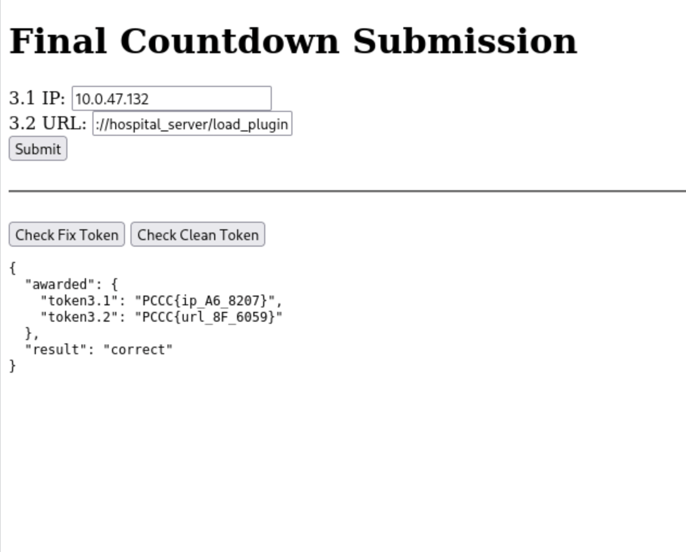

## Answer

The answer to this question is the value of the token presented in the `token3.2` field of the JSON presented to you by the `grader` after completing this submission. In this case, `PCCC{url_8F_6059}`

**This concludes the solution guide for this challenge.**