# Project Overwatch - Solution Guide

## Overview

Specter, a rogue insider, has been communicating with unknown actors and hiding his activities on an internal workstation. Your task is to uncover his hidden trails, decrypt his communications, and extract the secrets he tried to conceal.  Intelligence suggests Specter has been embedding sensitive information on his host in unusual ways, blending operational tradecraft with technical misdirection. While the machine looks clean at first glance, his activities are buried in encrypted communications, manipulated filesystems, and tampered system behavior.

Your mission is to investigate his host thoroughly, recover his secret messages, and identify the methods Specter used to conceal them.


## Question 1 – Encrypted Message Forensics
*Enter the token found by analyzing Specter's encrypted communications.*

1. Log in to the shadow-target machine using provided credentials (specter : fieldwork).

   ``` bash
   ssh specter@shadow-target
   ```

2. Given that we are logged in as the agent, let's review their bash command history and see if that gives us anything useful: 
`history`

   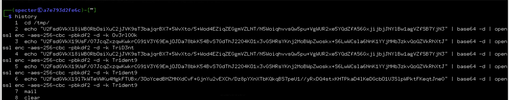

*Analysts often review .bash_history early in insider investigations because operators frequently test or reuse encoding and encryption pipelines interactively.*

3. We can re-run these commands and see messages from the handler to the agent.  The final message indicates that Specter should check their email. 

   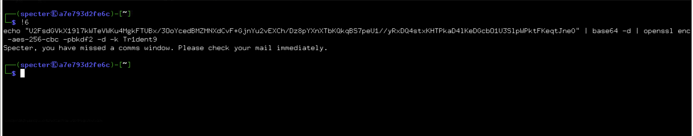

   <details>
   <summary> We also could have noticed this in the login banner.</summary>

   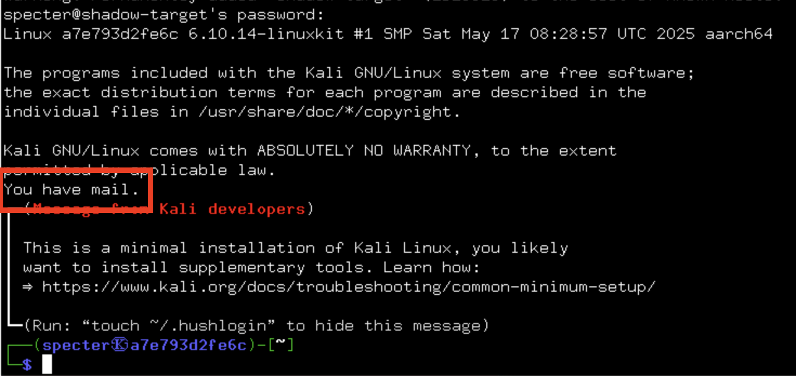
   </details>


4. Using the postfix `mail` command, we can review our mail and step through each looking for something relevant. Enter `n` + [Enter] to step through the emails.  Note the final email has some encoded text that we'll want to investigate: 

   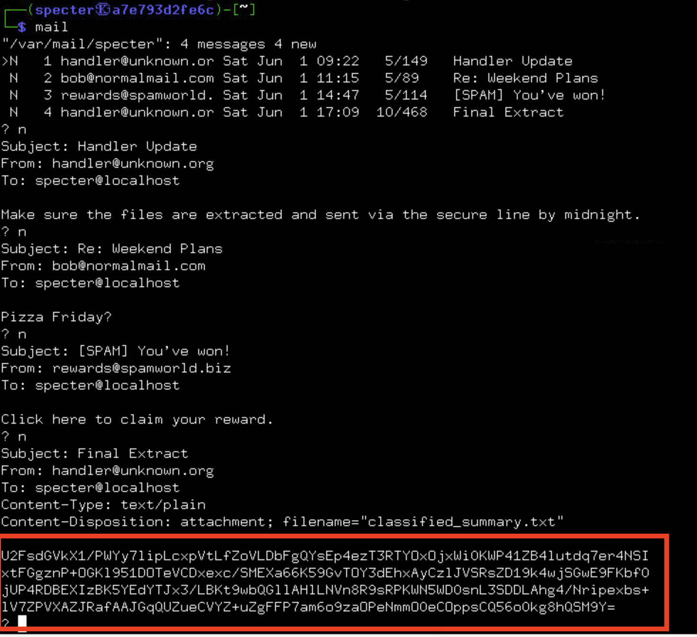

5. We need to decrypt the contents of the most recent email.  Noting the pattern from the command history `base64 -d | openssl enc -aes-256-cbc -pbkdf2 -d -k <password>`, let's try using the most recent password found in the command history hoping that it has not yet rotated. 

   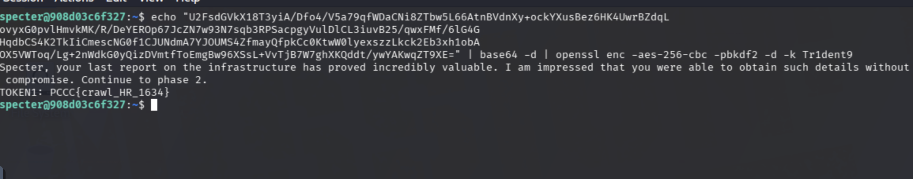

6. Using the latest password `Tr1dent9` worked and revealed token 1.  

### Answer
Submit the token revealed by decrypting the message. In this case `PCCC{crawl_HR_1634}`

## Question 2 – USB Device Forensics
*Enter the token retrieved by analyzing the USB drive image WITHOUT mounting the disk to your workstation.*

1. On the target machine, search for suspicious files in the home directory:

   ```bash
   ls -la /home/specter
   ```

   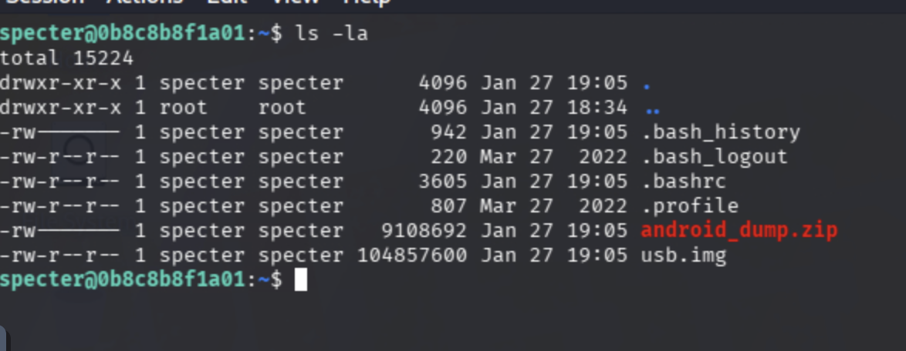

2. You should find a file named `usb.img`. This represents a USB device that was imaged and is no longer actively mounted.  Because the target machine `shadow-target` has a limited toolset, we need to copy this file down to our Kali workstation to conduct our investigation.

```bash
   # From our Kali workstation:
   scp specter@shadow-target:/home/specter/usb.img .
```

   * Note:  Remember one of our historical commands from earlier indicated that the agent should "send as photo." 

   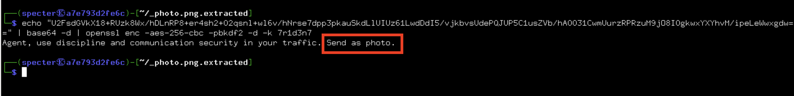
<br><br>

3. Extract the `photo.png` file directly from the `usb.img` without mounting, using `debugfs`:

   ```bash
   debugfs /home/user/usb.img
   ```

   Inside the debugfs prompt, use the `ls` and `cat` commands to locate and extract `photo.png`:

   ```bash
   debugfs: ls
   debugfs: dump photo.png /tmp/photo.png
   debugfs: quit
   ```

*Because the image uses an EXT filesystem, debugfs allows direct inode-level access without mounting, preserving forensic integrity.*

4. Run `binwalk` with extraction on the extracted `photo.png` to analyze embedded data:

   ```bash
   binwalk --dd='.*' /tmp/photo.png
   ```

   This creates a folder "_photo.png.extracted" which contains all identifiable file types that were able to be automatically extracted.  The output also shows us that there is gzip compressed data within this png which indicates a hidden payload. 
   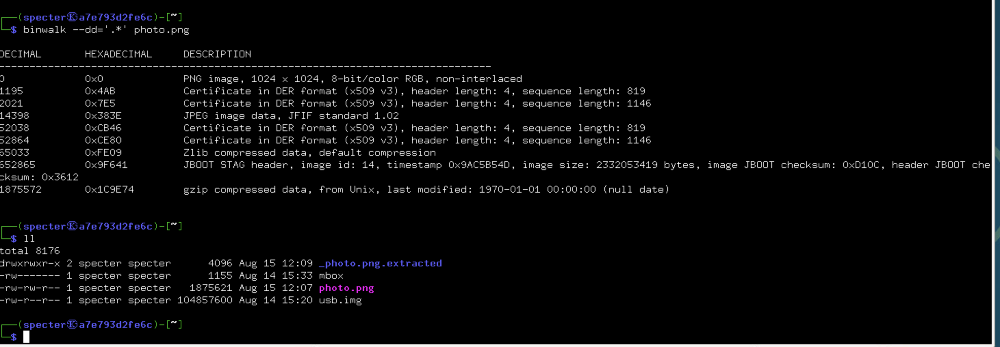


5. If needed, manually decompress and decode the `.gz` file extracted by binwalk:

   ```bash
   gzip -d extracted_file.gz
   ```

   Then decode the contents as necessary. Note that sometimes binwalk will have already decompressed the file for you.

6. Use forensic tools such as `strings` on the extracted data to recover hidden information - in this case, a fairly obvious base64 encoded string.

   ```bash
   strings extracted_file
   ```

   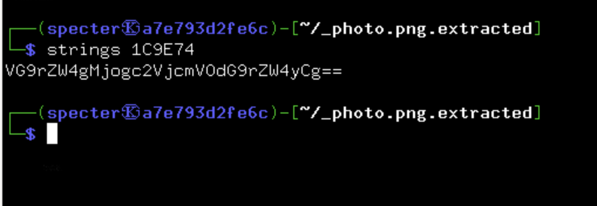

7. Decode the recovered string to reveal Token 2. 

   ``` bash
   echo "encrypted_string" | base64 -d
   ```

   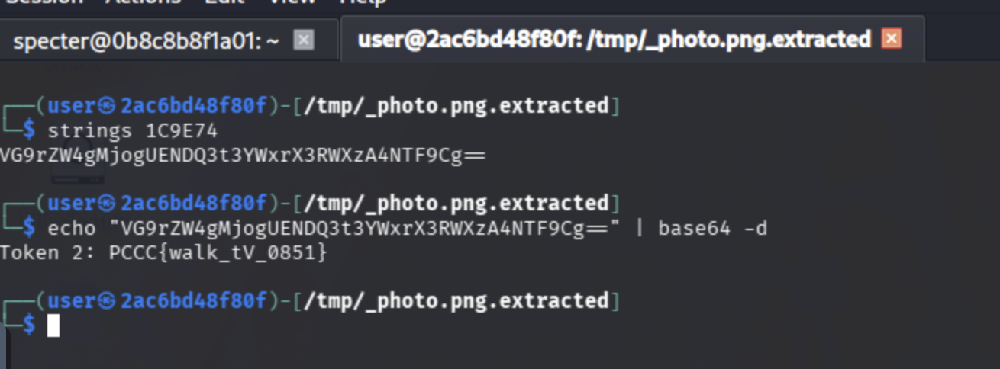

### Answer
Submit the token revealed by decrypting the payload from the USB image. In this case `PCCC{walk_tV_0851}`

## Question 3 – Covert Network Exfiltration (Live Capture)
*Enter the token extracted from Specter's exfiltrated data stream.*

The agent has been exfiltrating data using DNS queries on a remote "exfil" host. Your task is to capture and reconstruct the payload.
*DNS exfiltration commonly embeds payload fragments in subdomain labels to blend with legitimate queries*

1. Determine which interface is connected to the exfil host.  We are not able to reach the exfil host from our Kali workstation, but can from `shadow-target`.

   ```bash
      # From shadow-target
      ping exfil
      ifconfig
   ```

   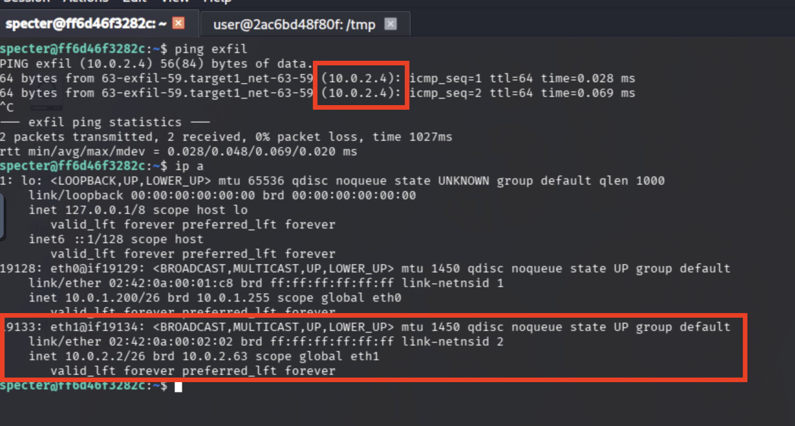

2. Given the correct interface (in our example, `eth1`), collect network traffic to identify possible exfil methods.  Here, we have filtered traffic to only capture DNS traffic.  We can narrow this down through regular analysis and/or by the "WhoIs" clue in our challenge instructions, eluding to dns - a common exfil method.

   ``` bash
   sudo tcpdump -i eth1 -s0 -w /home/specter/exfil.pcap udp port 53
   # This will capture for 45 seconds then quit.
   ```

   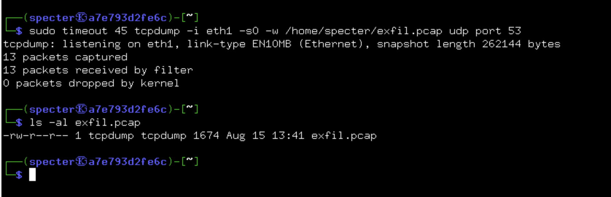

   - We should have noted earlier in mail from our handler, the domain in question

   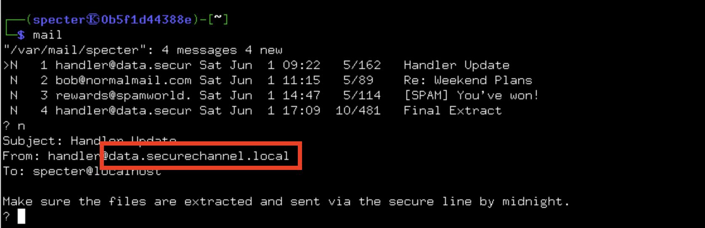


3. Extract DNS query names containing the exfil domain.  This is easier on our Kali workstation so let's first transfer the file over to our workstation for further analysis:

   ``` bash
   # From your workstation, run the command:
   scp specter@shadow-target:/home/specter/exfil.pcap .
   # Continue analysis on your workstation with the following steps...
   ``` 

   ```bash
   tshark -r exfil.pcap -Y "dns.qry.name contains data.securechannel.local" -T fields -e dns.qry.name > qnames.txt
   ```

      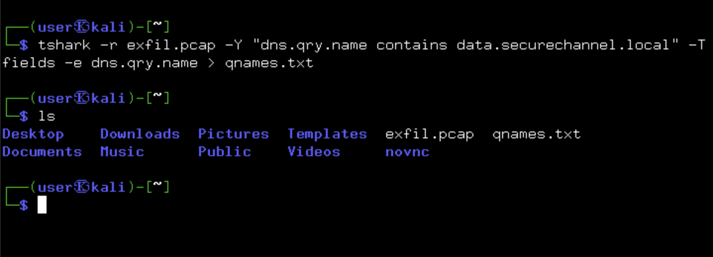


   If `tshark` isn’t available, you can also inspect with:
   
   ```bash
   tcpdump -nlA -r exfil.pcap | grep -i "data.securechannel.local"
   ```


4. Reassemble and decode the payload:
   The first label of each query contains a piece of a **base32** string (lowercased). Concatenate the first labels **in order** and decode twice (base32 → base64 → plaintext):

   ``` bash
   awk -F'.' '{print $1}' qnames.txt | tr -d '\n' | tr '[:lower:]' '[:upper:]' | base32 -d | base64 -d > exfil_payload.txt
   ```

      * _You may get a base32/base64 "invalid input" error even when working properly._

   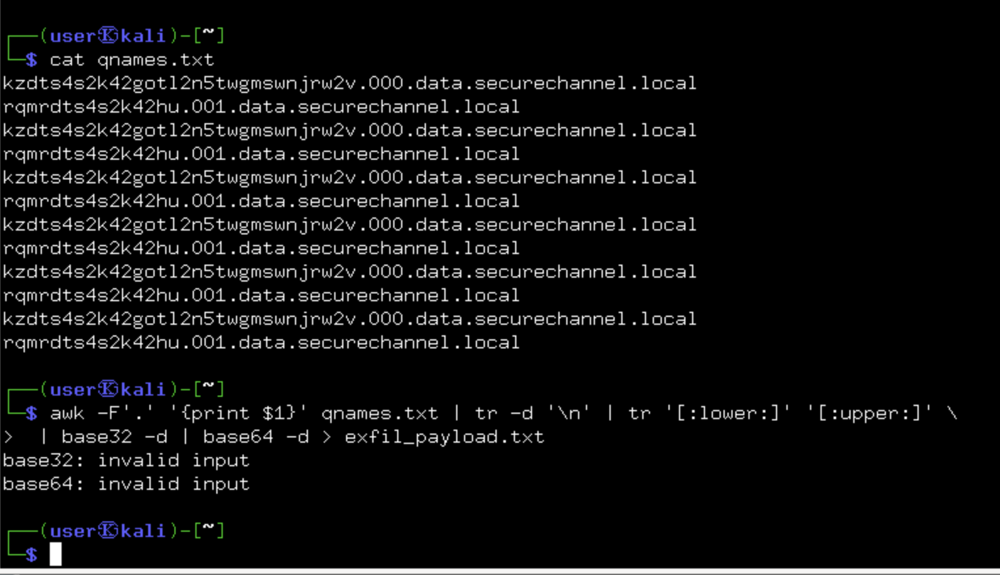

5. Review the resulting file contents to retrieve the token:

   ```bash
   cat exfil_payload.txt
   ```

   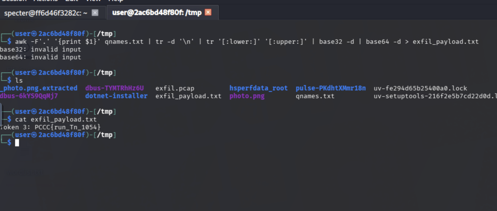

### Answer
Submit the token recovered from the exfiltrated data stream. In this case `PCCC{run_Tn_1054}`

## Question 4 – Stealth File Hiding via LD_PRELOAD
*Enter the token uncovered by detecting and analyzing the rootkit Specter used to hide files **on his workstation** `shadow-target`.*

**Analyst Note:**

When files or artifacts are referenced but do not appear in standard directory listings, and system behavior differs depending on the tool used, analysts often suspect a **userland rootkit**. One of the most common mechanisms for this on Linux systems is `LD_PRELOAD`, which allows a shared library to intercept functions such as `open()`, `readdir()`, or `stat()` for all dynamically linked binaries.

For this reason, `/etc/ld.so.preload` is a high-value file to inspect during host-based forensic analysis.

1. Notice hints in the challenge narrative - "static" "specter_secret" and missing files.

2. Inspect the `/etc/ld.so.preload` file to discover a preloaded shared library:

   ```bash
   cat /etc/ld.so.preload
   ```

   You should find a path such as `/usr/local/lib/libprocfilter.so`

   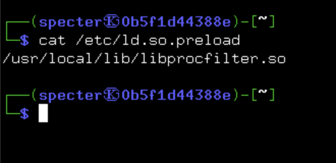

   <details>
   <summary>We are not able to see this file in the directory listing - which is a clue as to what is happening</summary>

      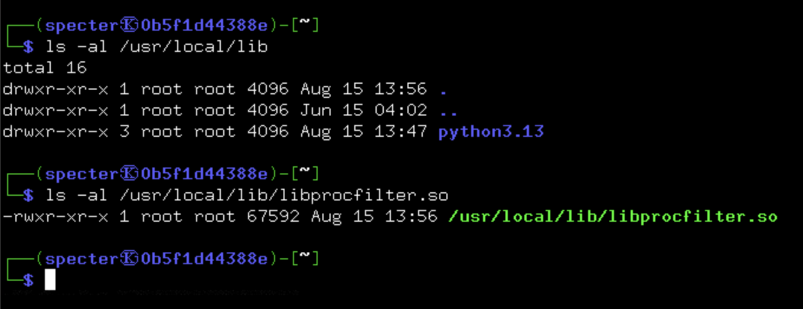

   </details>


3. Use `strings` and `grep` on the shared library to locate the hardcoded secret file path and understand its behavior:

   ```bash
   strings /usr/local/lib/libprocfilter.so
   ```

   This reveals the secret file path `/usr/local/share/specter_secret.dat` and indicates the preload intercepts `open` calls to hide this file from dynamically linked binaries.

   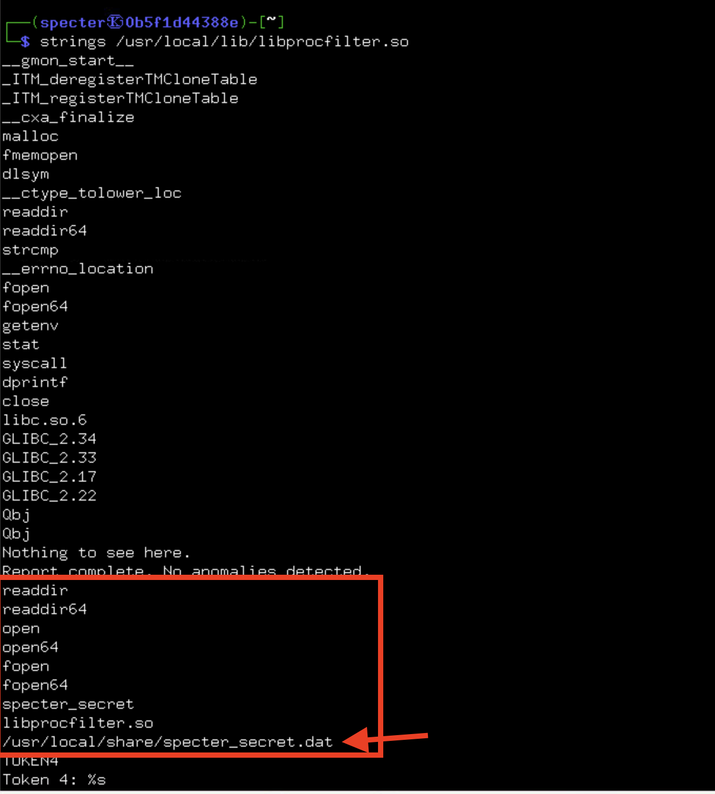

4. The preload library hooks `open` calls to prevent the secret file from being accessed or listed by typical dynamically linked programs.

*Because LD_PRELOAD only affects dynamically linked binaries, statically linked tools bypass these hooks entirely.*

5. As a non-root user, bypass this restriction by using a statically linked binary such as `busybox-static`:

   ```bash
   busybox cat /usr/local/share/specter_secret.dat
   ```

   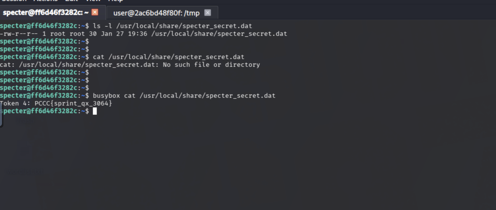

6. Retrieve the `TOKEN4` from the contents of the secret file.

### Answer
Submit the token found in the hidden file. In this case `PCCC{sprint_qx_3064}`

## Question 5 – Android Backup Analysis
*Enter the token found by analyzing the dump retrieved from Specter's Android device.*

1. Investigate the home directory for any additional artifacts:

   ```bash
   ls -la /home/specter
   ```

   You should find a file named `android_dump.zip` - this appears to be a backup archive from Specter's mobile device.

   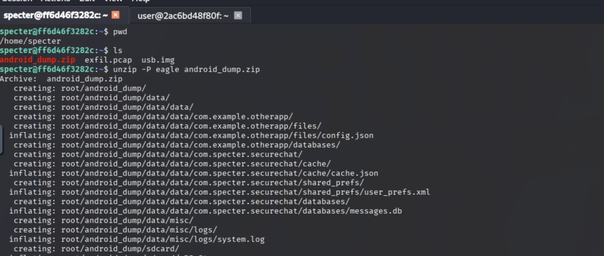

2. The zip file is password-protected. Try common passwords or look for hints in previously discovered communications. The password `eagle` can be *found in our initial instructions*:

   ```bash
   unzip -P eagle /home/specter/android_dump.zip
   ```

   This extracts the Android backup to `./root/android_dump/`

3. Explore the extracted backup structure to understand the application data:

   ```bash
   find ./root/android_dump -type f | head -20
   ```

   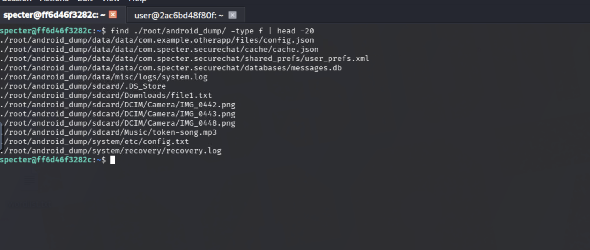

   You'll find a secure chat application's data structure including a SQLite database and cache files.

   **Side Quest**
      At this point, it is highly recommended to copy `token-song.mp3` to your kali box and inspect, though it has nothing to do with solving this challenge. 

4. We can work on examining all the file, let's skip to the point - examine the cache configuration to understand the encryption method:

   ```bash
   cat ./root/android_dump/data/data/com.specter.securechat/cache/cache.json
   ```

   This reveals the encryption algorithm (aes-256-cbc), key derivation function (pbkdf2), and the cache key needed for decryption.

   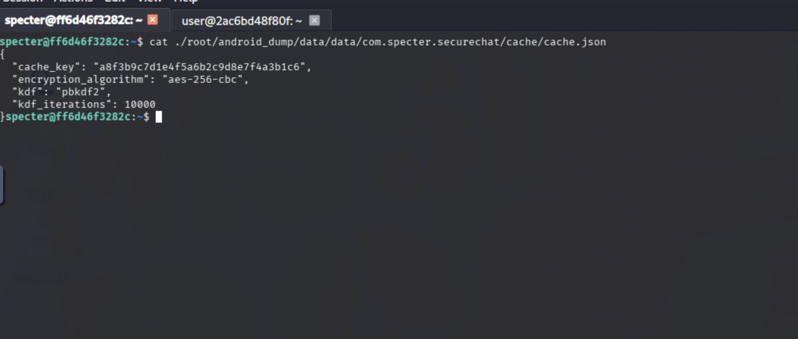

5. Examine the messages database to see the encrypted communications:

   ```bash
   sqlite3 ./root/android_dump/data/data/com.specter.securechat/databases/messages.db
   ```

   ```sql
   .tables
   SELECT _id, body FROM messages WHERE body IS NOT NULL;
   .quit
   ```

   You'll see that message bodies are encrypted (and base64-encoded).

   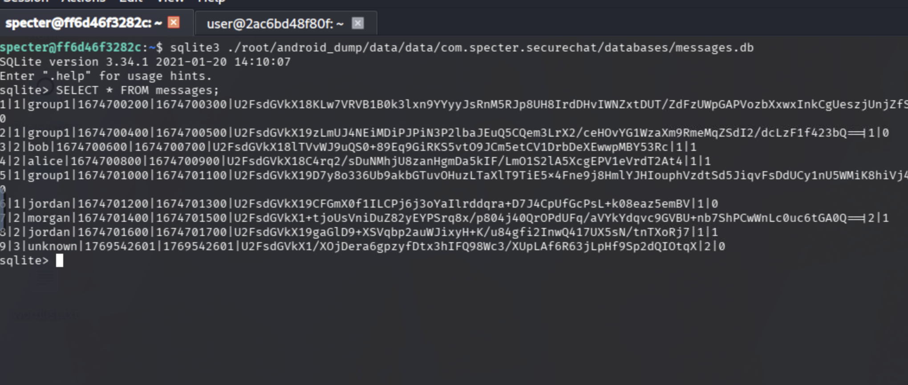

6. Create a decryption script or use OpenSSL directly to decrypt the messages. The encryption method from cache.json shows:
   - Algorithm: AES-256-CBC 
   - KDF: PBKDF2
   - Cache key: Used as the passphrase

   Example OpenSSL decryption command for a single message:
   
   ```bash
   echo "<base64_encrypted_message>" | base64 -d | openssl enc -aes-256-cbc -pbkdf2 -d -k "<cache_key>"
   ```

7. Alternatively, create a Python script to decrypt all messages systematically:

   ```python
   import sqlite3
   import base64
   import subprocess
   import json

   # Load the cache key
   with open("./root/android_dump/data/data/com.specter.securechat/cache/cache.json", "r") as f:
       cache_data = json.load(f)
   cache_key = cache_data["cache_key"]

   # Connect to database and decrypt messages
   conn = sqlite3.connect("./root/android_dump/data/data/com.specter.securechat/databases/messages.db")
   cursor = conn.cursor()
   cursor.execute("SELECT _id, body FROM messages WHERE body IS NOT NULL;")
   
   for message_id, encrypted_body in cursor.fetchall():
       encrypted_data = base64.b64decode(encrypted_body)
       process = subprocess.run(
           ["openssl", "enc", "-aes-256-cbc", "-pbkdf2", "-d", "-k", cache_key],
           input=encrypted_data, stdout=subprocess.PIPE, stderr=subprocess.PIPE
       )
       if process.returncode == 0:
           decrypted = process.stdout.decode("utf-8").strip()
           print(f"Message ID: {message_id}, Decrypted: {decrypted}")
   
   conn.close()
   ```

8. Run the decryption to reveal all hidden messages, including TOKEN5:

   ```bash
   python3 decrypt_messages.py
   ```

   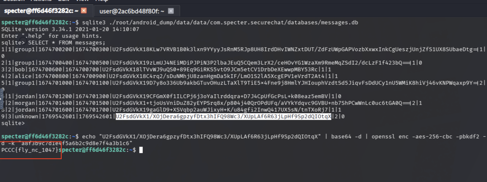

9. Extract TOKEN5 from the decrypted message contents and submit as your solution.

### Answer
Submit the token found in the decrypted mobile application messages. In this case `PCCC{fly_nc_1047}`
