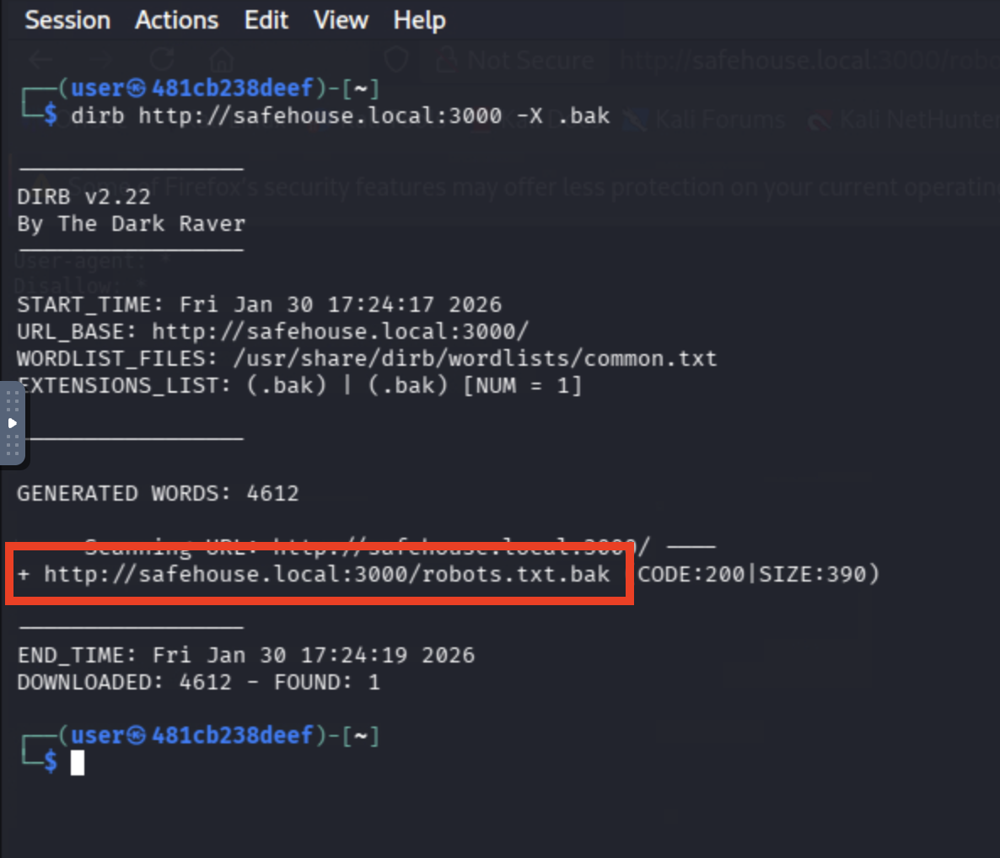
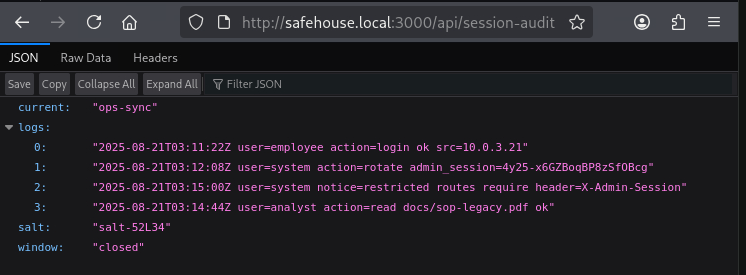
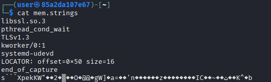

# Safehouse

*Solution Guide*

## Overview

This walkthrough will allow you to dive deep into Safehouse and extract information on agents of the past. Please note that the tokens presented in this walkthrough may not be the same tokens you receive during your investigation (dynamic).

## Question 1

***Enumerate the application and hijack an administrator's session token to gain further access into the application.***

### Steps 

1) Users can begin enumerating the application using tools such as `dirb`. This tool will discover any directories and common files that may exist on the server which may be of your interest (here's the help options for those unfamiliar with the tool):

**Command** 

```bash
dirb -h 
```

**Output** 

```bash
┌──(user㉿85a2da107e67)-[~]
└─$ dirb -h
-----------------
DIRB v2.22    
By The Dark Raver
-----------------


(!) FATAL: Invalid URL format: -h/
    (Use: "http://host/" or "https://host/" for SSL)
```

2) This file typically tells automated bots to "ignore" the existence of listed directories, objects, and User-Agents. It looks like `robots.txt` was discovered:

Command:

```bash
dirb http://safehouse.local:3000
```

Output:

```bash
┌──(user㉿85a2da107e67)-[~]
└─$ dirb http://safehouse.local:3000

-----------------
DIRB v2.22    
By The Dark Raver
-----------------

START_TIME: Mon Dec 29 02:25:41 2025
URL_BASE: http://safehouse.local:3000/
WORDLIST_FILES: /usr/share/dirb/wordlists/common.txt

-----------------

GENERATED WORDS: 4612                                                          

---- Scanning URL: http://safehouse.local:3000/ ----
+ http://safehouse.local:3000/api (CODE:200|SIZE:12)                                                                                          
+ http://safehouse.local:3000/app (CODE:500|SIZE:1227)                                                                                        
+ http://safehouse.local:3000/package (CODE:200|SIZE:684)                                                                                     
+ http://safehouse.local:3000/portal (CODE:302|SIZE:0)                                                                                        
+ http://safehouse.local:3000/robots.txt (CODE:200|SIZE:27)                                                                                                               
-----------------
END_TIME: Mon Dec 29 02:26:43 2025
DOWNLOADED: 4612 - FOUND: 5
```

💡 NOTE: dirb is not the *only* tool that can perform this operation. If available, use of tools such as nuclei and BurpSuite Professional's `Discover Content` module can perform this discovery test.

3) The Briefing/Challenge Introduction states that we should be on the lookout for ".bak" files that may have been left behind on the server mistakenly. Let's go ahead and zero-in on `robots.txt` and then also look for `robots.txt.bak` and `robots.bak`:

Command:

```bash
curl -s -v http://safehouse.local:3000/robots.txt # Normal robots file
```

Output:

```bash
┌──(user㉿85a2da107e67)-[~]
└─$ curl -s -v http://safehouse.local:3000/robots.txt
*   Trying safehouse.local:3000...
* Connected to safehouse.local (safehouse.local) port 3000
* using HTTP/1.x
> GET /robots.txt HTTP/1.1
> Host: safehouse.local:3000
> User-Agent: curl/8.15.0
> Accept: */*
> 
* Request completely sent off
< HTTP/1.1 200 OK
< Vary: Origin
< Content-Length: 27
< Content-Type: text/plain
< Last-Modified: Mon, 25 Aug 2025 09:14:07 GMT
< ETag: W/"27-1756113247808"
< Cache-Control: no-cache
< Date: Tue, 26 Aug 2025 20:39:42 GMT
< Connection: keep-alive
< Keep-Alive: timeout=5
< 
User-agent: *
Disallow: *
```

Given our intel (.bak files exist), we can expand our enumeration a bit (using -X) to explicitly look for those files.  

```bash
dirb http://safehouse.local:3000 -X .bak
```

This shows us that there is also a robots.txt.bak file not found with our default dirb enumeration. 



Let's grab that one and review the contents:

Command:

```bash
curl -s -v http://safehouse.local:3000/robots.txt.bak # Backup robots file
```

```bash
┌──(user㉿85a2da107e67)-[~]
└─$ curl -s -v http://safehouse.local:3000/robots.txt.bak
*   Trying safehouse.local:3000...
* Connected to safehouse.local (safehouse.local) port 3000
* using HTTP/1.x
> GET /robots.txt.bak HTTP/1.1
> Host: safehouse.local:3000
> User-Agent: curl/8.15.0
> Accept: */*
> 
* Request completely sent off
< HTTP/1.1 200 OK
< Vary: Origin
< Content-Length: 390
< Content-Type: 
< Last-Modified: Mon, 25 Aug 2025 09:13:29 GMT
< ETag: W/"390-1756113209576"
< Cache-Control: no-cache
< Date: Tue, 26 Aug 2025 20:45:27 GMT
< Connection: keep-alive
< Keep-Alive: timeout=5
< 
User-agent: *
# Internal crawler guidance — do not index.
Disallow: /api/
Disallow: /portal/
Disallow: /artifacts/

# Specific endpoints (training hints)
Disallow: /api/session-audit
Disallow: /portal/admin-entry
Disallow: /api/artifacts
Disallow: /artifacts/web_access.log
Disallow: /artifacts/dead_drop.zip
Disallow: /artifacts/mem.strings
Disallow: /api/docs
Disallow: /api/docs/list
```

4) Let's take our enumeration further and navigate to the first endpoint on the list (`/api/session-audit`) from the `robots.txt.bak` file:



💡 We now notice that the following content:
* Two users (system and analyst)
* admin_session (value of '4y25-x6GZBoqBP8zSfOBcg') - randomly generated per challenge
* A notice stating that "X-Admin-Session" is required

5) Next, let's try to log into the application through the current session; we'll use the GET HTTP method to access the admin-entry endpoint we found earlier but we'll add our new `credentials` into the mix:

**Command**

```bash
curl -v http://safehouse.local:3000/portal/admin-entry -H "X-Admin-Session: 4y25-x6GZBoqBP8zSfOBcg"
```

**Output**

```bash
┌──(user㉿85a2da107e67)-[~]
└─$ curl -v http://safehouse.local:3000/portal/admin-entry -H "X-Admin-Session: 4y25-x6GZBoqBP8zSfOBcg"
* Host safehouse.local:3000 was resolved.
* IPv6: (none)
* IPv4: 10.0.71.68
*   Trying 10.0.71.68:3000...
* Established connection to safehouse.local (10.0.71.68 port 3000) from 10.0.71.69 port 57790 
* using HTTP/1.x
> GET /portal/admin-entry HTTP/1.1
> Host: safehouse.local:3000
> User-Agent: curl/8.17.0
> Accept: */*
> X-Admin-Session: 4y25-x6GZBoqBP8zSfOBcg
> 
* Request completely sent off
< HTTP/1.1 200 OK
< Vary: Origin
< server: Werkzeug/3.1.4 Python/3.11.14
< date: Mon, 29 Dec 2025 02:46:57 GMT
< content-type: application/json
< content-length: 90
< access-control-allow-origin: *
< connection: close
< 
{"message":"\ud83d\udfe2 Administrative capabilities enabled","token":"PCCC{SFH-t27b18}"}
* shutting down connection #0
```

This leads us to the token we desire.

### Answer

The `answer` is the value of `token1` from the returned JSON. In this case, it's `PCCC{SFH-t27b18}`.

## Question 2
***Investigate the `artifacts` endpoints, download the web access log and reconstruct a reversed payload. The adversary attempted to mask their traffic to appear as normal web traffic.***

### Steps 

To make things easier going forward, in your terminal do the following to set the Admin Session token to a callable variable:

```bash
ADMIN_TOKEN=4y25-x6GZBoqBP8zSfOBcg
```

Now that we have the admin token set, we can use `$ADMIN_TOKEN` to call the value when we need. 

1) We must revisit the previous dump of endpoints to investigate. Navigating to `/api/artifacts` reveals three separate items for investigation. In this case, we are looking to analyze the `web_access.log` file:


**Command**

```bash
curl -s -H "X-Admin-Session: $ADMIN_TOKEN" http://safehouse.local:3000/api/artifacts | jq
```

<details>
<summary>Why the pipe to `jq`<summary>
This allows us to see the "beautiful" version of the JSON output making more human readable and organized.
</details>

**Output**

```bash
┌──(user㉿aac74c573c03)-[~/dd]
└─$ curl -v http://safehouse.local:3000/api/artifacts -H "X-Admin-Session: $ADMIN_SESSION" | jq  % Total    % Received % Xferd  Average Speed   Time    Time     Time  Current
                                 Dload  Upload   Total   Spent    Left  Speed
  0     0   0     0   0     0     0     0  --:--:-- --:--:-- --:--:--     0* Host safehouse.local:3000 was resolved.
* IPv6: (none)
* IPv4: 10.0.88.4
*   Trying 10.0.88.4:3000...
* Established connection to safehouse.local (10.0.88.4 port 3000) from 10.0.88.5 port 59138 
* using HTTP/1.x
> GET /api/artifacts HTTP/1.1
> Host: safehouse.local:3000
> User-Agent: curl/8.17.0
> Accept: */*
> X-Admin-Session: P6Fne_f4nDlwO3jETneSDw
> 
* Request completely sent off
< HTTP/1.1 200 OK
< Server: nginx/1.29.4
< Date: Sat, 31 Jan 2026 01:44:23 GMT
< Content-Type: application/json
< Content-Length: 367
< Connection: keep-alive
< Access-Control-Allow-Origin: *
< 
{ [367 bytes data]
100   367 100   367   0     0 86170     0  --:--:-- --:--:-- --:--:-- 91750
* Connection #0 to host safehouse.local:3000 left intact
{
  "artifacts": [
    {
      "desc": "Edge proxy access log - 2025-08-21",
      "file": "web_access.log",
      "size": 662645
    },
    {
      "desc": "OPSEC field card (metadata reminder)",
      "file": "opsec_fieldcard.txt",
      "size": 268
    },
    {
      "desc": "Recovered operator dead-drop archive.",
      "file": "dead_drop.zip",
      "size": 6665
    },
    {
      "desc": "Strings from short memory capture (XOR hint inside)",
      "file": "mem.strings",
      "size": 188
    }
  ]
}

```

💡 Keep these files in mind as they will be used for tokens 2 - 4. We actually find a file that's **not** listed in the Disallow list, we should investigate that as well.

2) Let us now download the `web_access.log`:

**Command**

```bash
curl -s -H "X-Admin-Session: $ADMIN_TOKEN" -O http://safehouse.local:3000/artifacts/web_access.log
```

You won't receive any feedback but the file will be written.

**Output**

```bash
┌──(user㉿85a2da107e67)-[~]
└─$ ls | grep web
web_access.log
```

3) With the file in hand, let's look for various characteristics of normal web traffic and attempt to create a delta for investigation. We can start with the `User-Agents` that are present in the file:

**Command**

```bash
head -n 10 web_access.log 
```

**Output**

In our case, we find several types of data with user agents from bots, Mozilla Web Browser, and even an AWS health check (presumed). 

```bash
┌──(user㉿aac74c573c03)-[~]
└─$ head -n 10 web_access.log 
10.0.3.156 - - [21/Aug/2025:21:05:00 +0000] "GET /docs/sop-legacy.pdf HTTP/1.1" 200 1446 "-" "ELB-HealthChecker/2.0"
10.0.2.192 - - [21/Aug/2025:19:21:50 +0000] "GET /favicon.ico HTTP/1.1" 404 4236 "-" "Mozilla/5.0 (Macintosh; Intel Mac OS X 10_15_7) AppleWebKit/605.1.15 Safari/605.1.15"
10.0.2.137 - - [21/Aug/2025:08:55:41 +0000] "GET /api/health HTTP/1.1" 200 1644 "-" "kube-probe/1.26"
10.0.1.88 - - [21/Aug/2025:00:13:29 +0000] "GET /docs/sop-legacy.pdf HTTP/1.1" 200 5509 "-" "Mozilla/5.0 (Windows NT 10.0; Win64; x64) AppleWebKit/537.36 Chrome/120.0.0.0 Safari/537.36"
10.0.1.247 - - [21/Aug/2025:20:25:05 +0000] "GET /status HTTP/1.1" 500 6348 "-" "curl/7.68.0"
10.0.2.28 - - [21/Aug/2025:06:17:15 +0000] "GET /api/health HTTP/1.1" 404 2142 "-" "Mozilla/5.0 (Macintosh; Intel Mac OS X 10_15_7) AppleWebKit/605.1.15 Safari/605.1.15"
10.0.5.197 - - [21/Aug/2025:02:56:40 +0000] "GET /favicon.ico HTTP/1.1" 200 3068 "-" "Mozilla/5.0 (Macintosh; Intel Mac OS X 10_15_7) AppleWebKit/605.1.15 Safari/605.1.15"
10.0.1.143 - - [21/Aug/2025:07:20:17 +0000] "GET /login HTTP/1.1" 200 6664 "-" "curl/7.68.0"
10.0.5.200 - - [21/Aug/2025:08:57:45 +0000] "GET /favicon.ico HTTP/1.1" 200 2573 "-" "Mozilla/5.0 (compatible; Googlebot/2.1; +http://www.google.com/bot.html)"
10.0.5.206 - - [21/Aug/2025:09:19:08 +0000] "GET /docs/sop-legacy.pdf HTTP/1.1" 304 6275 "-" "Mozilla/5.0 (X11; Linux x86_64) Gecko/20100101 Firefox/118.0"

```

4) Looking deeper into the logs we find that we have a non-standard Mozilla User-Agent in use that is supposedly being called from "SecureOS" which doesn't exist. We can use the grep, cut, sort and uniq commands to create a condition where all "Mozilla based" headers will present themselves to us:

**Command**

```bash
cat web_access.log | grep "Mozilla" | cut -d" " -f12- | sort | uniq
```

**Output**

```bash
┌──(user㉿aac74c573c03)-[~]
└─$ cat web_access.log | grep "Mozilla" | cut -d" " -f12- | sort | uniq
"Mozilla/5.0 (Macintosh; Intel Mac OS X 10_15_7) AppleWebKit/605.1.15 Safari/605.1.15"
"Mozilla/5.0 (Windows NT 10.0; Win64; x64) AppleWebKit/537.36 Chrome/120.0.0.0 Safari/537.36"
"Mozilla/5.0 (Windows NT 10.0; Win64; x64) AppleWebKit/537.36 Chrome/120.0.0.0 Safari/537.36; SecureOS; rv:91.3)"
"Mozilla/5.0 (X11; Linux x86_64) Gecko/20100101 Firefox/118.0"
"Mozilla/5.0 (compatible; Googlebot/2.1; +http://www.google.com/bot.html)"
```

5) Let's take it a step further and only grep for `SecureOS` in the web log. We find that we have drastically less results and one very suspicious event where a URI called `callback` is present:


**Command**

```bash
grep -n SecureOS web_access.log
```

**Output**

```bash
┌──(user㉿aac74c573c03)-[~]
└─$ grep -n SecureOS web_access.log
1676:10.0.3.21 - - [21/Aug/2025:03:10:11 +0000] "GET /status HTTP/1.1" 200 42 "-" "Mozilla/5.0 (Windows NT 10.0; Win64; x64) AppleWebKit/537.36 Chrome/120.0.0.0 Safari/537.36; SecureOS; rv:91.3)"
1677:172.18.0.9 - legacy [21/Aug/2025:03:44:44 +0000] "GET /legacy-intake?stage=1&callback=%3D%3DQf0MzT4ITVtgkRTt3QDNEU HTTP/1.1" 404 0 "-" "Mozilla/5.0 (Windows NT 10.0; Win64; x64) AppleWebKit/537.36 Chrome/120.0.0.0 Safari/537.36; SecureOS; rv:91.3)"
1678:172.18.0.9 - legacy [21/Aug/2025:03:45:12 +0000] "GET /legacy-intake?stage=2&ddpw=%3D%3DgV2VjQ2oWOr1yVQRER HTTP/1.1" 404 0 "-" "Mozilla/5.0 (Windows NT 10.0; Win64; x64) AppleWebKit/537.36 Chrome/120.0.0.0 Safari/537.36; SecureOS; rv:91.3)"
1679:10.0.3.21 - - [21/Aug/2025:03:45:59 +0000] "GET /docs/sop-legacy.pdf HTTP/1.1" 200 1204 "-" "Mozilla/5.0 (Windows NT 10.0; Win64; x64) AppleWebKit/537.36 Chrome/120.0.0.0 Safari/537.36; SecureOS; rv:91.3)"
```

6) We must now fixate on the `callback` parameter and its associated value. The question states that the content is `reversed`. 

Based on looking at the string structure, we can assume it's base64 encoded.

7) Let us try to decode the current string normally:

**Command**

```bash
echo -n "%3D%3DQfzEjU0kDZtgkRTt3QDNEU" | base64 
```

**Output**

```bash
┌──(user㉿85a2da107e67)-[~]
└─$ echo -n "%3D%3DQfzEjU0kDZtgkRTt3QDNEU" | base64 -d                                                                                        
base64: invalid input
```

As wee can see here, the content passed back to us cannot be recognized; we must reverse the `actual` base64 string then decode it to get token 2. This script can make this happen for us:

```python
#!/usr/bin/env python3
"""
Token 2 Unscrambler:
- URL-decodes input
- reverses the string
- fixes Base64 padding
- decodes Base64
"""

import base64
import sys
from urllib.parse import unquote_plus

def fix_padding(s: str) -> str:
    return s + "=" * (-len(s) % 4)

def main():
    if len(sys.argv) > 1:
        raw = sys.argv[1]
    else:
        raw = input("Enter reversed, URL-encoded Base64 > ").strip()

    # 1) URL decode
    decoded = unquote_plus(raw)

    # 2) Reverse
    reversed_b64 = decoded[::-1]

    # 3) Fix padding
    reversed_b64 = fix_padding(reversed_b64)

    try:
        # 4) Base64 decode
        result = base64.b64decode(reversed_b64)
    except Exception as e:
        print(f"[!] Decode failed: {e}")
        sys.exit(1)

    # 5) Print result
    try:
        print(result.decode("utf-8"))
    except UnicodeDecodeError:
        print(result)

if __name__ == "__main__":
    main()
```

The result is:

```bash
┌──(user㉿85a2da107e67)-[~]
└─$ python3 token2-unscrambler.py 
Enter reversed, URL-encoded Base64 > %3D%3DQfzEjU0kDZtgkRTt3QDNEU
PCCC{SFH-d94R13}
```

### Answer

The output will be the output from the script; in our case, it is `PCCC{SFH-d94R13}`.

## Question 3
***The dead-drop bundle contains multiple false payloads. The real token was hidden using operational tradecraft that survives encryption (EOCD Zip Forensics). Analyze the archive structure and metadata to retrieve a key that be used to decrypt the packaged `payload.bin` file in every archive.***

### Steps

1) Download the dead-drop bundle

```bash
curl -O http://safehouse.local:3000/artifacts/dead_drop.zip \
  -H "X-Admin-Session: $ADMIN_SESSION"
```

**Outcome**

```text
dead_drop.zip  (≈ 6–7 KB)
```

2) Inspect the archive contents (no extraction yet):

**Command**

```bash
unzip -l dead_drop.zip
```

**Output**

```text
Archive:  dead_drop.zip
  Length      Date    Time    Name
---------  ---------- -----   -------------------
      643  01-30-26   22:xx   dead_drop_01.zip
      645  01-30-26   22:xx   dead_drop_02.zip
      640  01-30-26   22:xx   dead_drop_03.zip
      640  01-30-26   22:xx   dead_drop_04.zip
      642  01-30-26   22:xx   dead_drop_05.zip
      639  01-30-26   22:xx   dead_drop_06.zip
      651  01-30-26   22:xx   dead_drop_07.zip
      645  01-30-26   22:xx   dead_drop_08.zip
      642  01-30-26   22:xx   dead_drop_09.zip
      641  01-30-26   22:xx   dead_drop_10.zip
---------                     -------------------
```

Additionally let's grab the `opsec_fieldcard.txt` file from the endpoint:

**Command**

```bash
curl -O http://safehouse.local:3000/artifacts/opsec_fieldcard.txt \
  -H "X-Admin-Session: $ADMIN_SESSION" 
```

You will receive standard download output from `curl`.

Now, let's examine the file:

**Output**

```bash
┌──(user㉿aac74c573c03)-[~/dd]
└─$ cat opsec_fieldcard.txt 
SAFEHOUSE // OPSEC FIELD CARD // DEAD DROP RECOVERY TTPS

- When operational, trust your gut.
- Archives have *metadata* (comments) that survive encryption.
- If you find ciphertext in an archive comment, remember: the XOR key is usually hidden in *another* comment (cmt-k) at the top level (zip archive itself).
```

💡 Remember the "Comment" reference for later.

3) Extract the inner ZIPs:

**Command**

```bash
unzip dead_drop.zip
```

**Output**

```text
dead_drop_01.zip … dead_drop_10.zip
```

4) Confirm ZIP password protection and try extracting one of the archives **without** a password:

**Command**

```bash
unzip dead_drop_01.zip
```

**Output**

In some cases, we may find that some of the decoy zip files have passwords that will never be known to us.

```text
Archive:  dead_drop_01.zip
   skipping: ops_memo.txt   unable to get password
   skipping: payload.bin   unable to get password
```

5) We are told that we are looking for **metadata** to get us a key; in EOCD based foresnics, we are looking at the data after the final record of data is created in an archive. This is typically where `comments` reside and why `unzip -z` is able to read them (every Zip has an effective `end of archive` marker). 

During our investigation, we also find that some archives allow us to unzip them while others may require passwords. For those that can be unzipped, we receive several files which include a file called `ops_memo.txt` and en encrypted file called `payload.bin`:

**Command**

```bash
unzip dead_drop_XX.zip # where XX is a number 01-10
```

**Output**

```bash
┌──(user㉿aac74c573c03)-[~/dd]
└─$ unzip dead_drop_02.zip 
Archive:  dead_drop_02.zip
SAFEHOUSE_DD3
replace ops_memo.txt? [y]es, [n]o, [A]ll, [N]one, [r]ename: y
  inflating: ops_memo.txt            
replace payload.bin? [y]es, [n]o, [A]ll, [N]one, [r]ename: y
  inflating: payload.bin             

┌──(user㉿aac74c573c03)-[~/dd]
└─$ unzip dead_drop_01.zip
Archive:  dead_drop_01.zip
SAFEHOUSE_DD3
replace ops_memo.txt? [y]es, [n]o, [A]ll, [N]one, [r]ename: A
  inflating: ops_memo.txt            
  inflating: payload.bin             

┌──(user㉿aac74c573c03)-[~/dd]
└─$ unzip dead_drop_03.zip                                                                                 
Archive:  dead_drop_03.zip
SAFEHOUSE_DD3
replace ops_memo.txt? [y]es, [n]o, [A]ll, [N]one, [r]ename: A
  inflating: ops_memo.txt            
  inflating: payload.bin             
```

6) With all this in mind and referring back to the Question, let's find the XOR key in the `Comment` section of each archive. Use verbose ZIP inspection to view the `cmt-k` or `comment key` present in each archive:

**Command**

```bash
unzip -v dead_drop_01.zip | sed -n '1,120p'
```

**Output**

```bash
┌──(user㉿aac74c573c03)-[~/dd]
└─$ unzip -v dead_drop_01.zip 
Archive:  dead_drop_01.zip
SAFEHOUSE_DD3
 Length   Method    Size  Cmpr    Date    Time   CRC-32   Name
--------  ------  ------- ---- ---------- ----- --------  ----
     126  Defl:N      113  10% 1980-01-01 00:00 8d266b15  ops_memo.txt
cmt-k:41
     256  Defl:N      261  -2% 2026-01-30 22:53 94aa8d1f  payload.bin
--------          -------  ---                            -------
     382              374   2%                            2 files

┌──(user㉿aac74c573c03)-[~/dd]
└─$ unzip -v dead_drop_02.zip 
Archive:  dead_drop_02.zip
SAFEHOUSE_DD3
 Length   Method    Size  Cmpr    Date    Time   CRC-32   Name
--------  ------  ------- ---- ---------- ----- --------  ----
     126  Defl:N      113  10% 1980-01-01 00:00 8d266b15  ops_memo.txt
cmt-k:52
     256  Defl:N      261  -2% 2026-01-30 22:53 dd43c154  payload.bin
--------          -------  ---                            -------
     382              374   2%                            2 files
```

👉 `cmt-k:41` means the XOR key for payload.bin is `0x41`.


7) Using the EOCD technique, we would have typically found ciphertext after the `SAFEHOUSE_DD3` and `\x00` found at the end of the archive however, in our case, the agent who created these archives wanted to split the encrypted data from the overall payload (hence the creation of payload.bin).

8) As you attempt to decrypt each of the archives (by XORing the cmt-k value against the ciphertext), you'll find some false tokens:


❌ Decoy Tokens

```text
b'OP://OPERATION_SILENT_WATCH//'
b'OP:{OPERATION_BLACK_TIDE}'
```

The real token's hex is in this format: 

✅ Real Token ciphertext

```text
b'T3:504343437b7265616c2d746f6b656e7d'
```

9) At this juncture, we may have decrypted the payload leaving us with a hexadecimal based value:

```text
* Starts with `T3:`
* Followed by **hexadecimal**
```

Extract and decode it to receive `token 3`.

```bash
echo "504343437b7265616c2d746f6b656e7d" | xxd -r -p
```

**Output**

```text
PCCC{real-token}
```

### All in One solver

For ease of solving, we've created this solving script that will unzip the dead drop archive, determine the XOR key and then decrypt the final output to get `token 3`:

```python
#!/usr/bin/env python3
import io
import re
import sys
import zipfile
import binascii

HDR = b"SAFEHOUSE_DD3\x00"
KEY_RE = re.compile(br"cmt-k:([0-9a-fA-F]{2})")

def xor_bytes(data: bytes, key: int) -> bytes:
    k = key & 0xFF
    return bytes(b ^ k for b in data)

def extract_key_from_zip(zf: zipfile.ZipFile) -> int | None:
    """
    Find XOR key from any per-file comment containing b'cmt-k:XX'.
    (Your code puts it on ops_memo.txt, but we search all to be resilient.)
    """
    for info in zf.infolist():
        c = info.comment or b""
        m = KEY_RE.search(c)
        if m:
            return int(m.group(1), 16)
    return None

def decrypt_comment(zcomment: bytes, key: int) -> bytes | None:
    """
    Parse archive comment and decrypt the ciphertext following HDR.
    """
    idx = zcomment.find(HDR)
    if idx == -1:
        return None
    cipher = zcomment[idx + len(HDR):]
    if not cipher:
        return None
    return xor_bytes(cipher, key)

def solve_from_outer_zip(path: str) -> str | None:
    with zipfile.ZipFile(path, "r") as outer:
        # only consider inner zips that match your naming scheme
        inner_names = [n for n in outer.namelist()
                       if re.fullmatch(r"dead_drop_\d{2}\.zip", n)]

        if not inner_names:
            raise RuntimeError("No inner dead_drop_XX.zip files found inside dead_drop.zip")

        for name in sorted(inner_names):
            inner_bytes = outer.read(name)

            # Open inner zip from bytes (no extraction)
            with zipfile.ZipFile(io.BytesIO(inner_bytes), "r") as inner:
                key = extract_key_from_zip(inner)
                if key is None:
                    continue

                plain = decrypt_comment(inner.comment or b"", key)
                if plain is None:
                    continue

                # Real payload format: b"T3:" + hex(token3)
                if plain.startswith(b"T3:"):
                    hexpart = plain[3:].strip()

                    # hexpart should be ASCII hex; if not, skip
                    try:
                        token_bytes = binascii.unhexlify(hexpart)
                        token = token_bytes.decode("utf-8", errors="strict")
                    except Exception:
                        continue

                    # Basic sanity check
                    if "PCCC{" in token and token.endswith("}"):
                        return f"{token} (from {name})"
                    return f"{token} (from {name})"

                # Decoys are OP:... ; ignore
        return None

def main():
    if len(sys.argv) != 2:
        print(f"Usage: {sys.argv[0]} /path/to/dead_drop.zip", file=sys.stderr)
        sys.exit(2)

    path = sys.argv[1]
    try:
        result = solve_from_outer_zip(path)
    except Exception as e:
        print(f"[-] Error: {e}", file=sys.stderr)
        sys.exit(1)

    if not result:
        print("[-] Token 3 not found. Verify your dead_drop.zip contains the 10 inner zips and that inner zips have comments.")
        sys.exit(1)

    print(f"[+] TOKEN3: {result}")

if __name__ == "__main__":
    main()
```

**Command**

```bash
python3 token3_solver.py dead_drop.zip
```

**Output**

```bash
┌──(user㉿aac74c573c03)-[~/dd]
└─$ python3 token3_solver.py dead_drop.zip                                                                            
[+] TOKEN3: PCCC{SFH-f42A84} (from dead_drop_08.zip)
```

### Answer

Upon execution, you will receive token 3.

## Question 4
***An operator posted a short “strings” capture that is only accessible to authorized sessions. Inside it, a line begins with ENCHEX: followed by hex bytes. A single‑byte XOR was used to obfuscate the token; the key is hinted in system notices.***

### Steps

1) We must now download the final artifact, `mem.strings`:

```bash
curl -s -H "X-Admin-Session: $ADMIN_TOKEN" -O http://safehouse.local:3000/artifacts/mem.strings
```

2) Based on the format presented to us, we must first extract the hex payload. First, examine any loose strings in the file:

```bash
cat mem.strings
```

**Output**



❗ Please note that your offset may vary as it is randomized.

We find an `offset` and `size` which tell us the byte location and size of the hex string (potentially).

3) Based on the tip in the description, let's save ourselves some work and confirm where the encrypted blob starts and the regular metadata ends:

**Command**

```python
python3 - <<'PY'
data = open("mem.strings","rb").read()
marker = b"end_of_capture\n"
i = data.find(marker)
if i < 0:
    raise SystemExit("end_of_capture marker not found")
start = i + len(marker)
print(hex(start))
PY
```

**Output**

```text
0x6c
```

This is significantly different than the 0x50 offset presented. Let's carve `this` portion out with the size provided:

```bash
dd if=mem.strings bs=1 skip=$((0x6c)) count=16 2>/dev/null
```

**Output**

```bash
┌──(user㉿85a2da107e67)-[~]                                                                                                                    
└─$ dd if=mem.strings bs=1 skip=$((0x6c)) count=16 2>/dev/null 
s```XpekKW   
```

This blob is the 16 character string we need to decode; now we need something to find a viable XOR key for us knowing that the format of tokens starting with `PCCC{`.

4) Since we don't have the XOR key, we must create a brute forcer to try all 256 permutations against the carved out bytes. A script can be found here:

```python
#!/usr/bin/env python3
"""
Brute-force all 256 XOR keys against a carved binary blob
from mem.strings. Prints any plausible ASCII output.
"""

import sys, string

def score(candidate: bytes) -> int:
    """Return a score based on how printable/token-like the text looks."""
    try:
        text = candidate.decode("utf-8")
    except UnicodeDecodeError:
        return 0
    # Heuristic: must be mostly printable
    if all(c in string.printable for c in text):
        # bonus if it looks like a flag
        if text.startswith("PCCC{") and text.endswith("}"):
            return 999
        return len([c for c in text if c in string.ascii_letters + "{}_"])
    return 0

def brute(blob: bytes):
    best = None
    for key in range(256):
        out = bytes(b ^ key for b in blob)
        s = score(out)
        if s > 0:
            text = ""
            try:
                text = out.decode("utf-8")
            except: pass
            print(f"[key=0x{key:02x}] {text}")
            if s == 999:
                best = (key, text)
    if best:
        print("\n*** Likely token recovered! ***")
        print(f"Key = 0x{best[0]:02x}, Token = {best[1]}")

if __name__ == "__main__":
    data = sys.stdin.buffer.read()
    if not data:
        sys.exit("Usage: dd if=mem.strings bs=1 skip=<offset> count=<size> | python3 xor_bruter.py")
    brute(data)

```

5) Simply pipe the output of `dd` to the tool and wait for the magic to happen:

**Command**

```bash
dd if=mem.strings bs=1 skip=$((0x6c)) count=16 2>/dev/null | python3 token4-solver.py
```

💡 You will find that `0x23` is actually the XOR key. Increase the `count` size to get the full token.

**Output**

```bash
┌──(user㉿aac74c573c03)-[~]
└─$ dd if=mem.strings bs=1 skip=$((0x6c)) count=16 2>/dev/null | python3 solver.py                        
[key=0x20] S@@@xPEK.s;6`5;~
[key=0x22] QBBBzRGI,q94b79|
[key=0x23] PCCC{SFH-p85c68}
[key=0x24] WDDD|TAO*w?2d1?z
[key=0x25] VEEE}U@N+v>3e0>{
[key=0x26] UFFF~VCM(u=0f3=x
[key=0x28] [HHHpXMC&{3>h=3v
[key=0x29] ZIIIqYLB'z2?i<2w
[key=0x2a] YJJJrZOA$y1<j?1t
[key=0x2b] XKKKs[N@%x0=k>0u
[key=0x2d] ^MMMu]HF#~6;m86s
[key=0x2e] ]NNNv^KE }58n;5p
[key=0x2f] \OOOw_JD!|49o:4q
[key=0x30] CPPPh@U[>c+&p%+n
[key=0x31] BQQQiATZ?b*'q$*o
[key=0x32] ARRRjBWY<a)$r')l
[key=0x33] @SSSkCVX=`(%s&(m
[key=0x34] GTTTlDQ_:g/"t!/j
[key=0x35] FUUUmEP^;f.#u .k
[key=0x36] EVVVnFS]8e- v#-h
[key=0x37] DWWWoGR\9d,!w",i
[key=0x38] KXXX`H]S6k#.x-#f
[key=0x39] JYYYaI\R7j"/y,"g
[key=0x3a] IZZZbJ_Q4i!,z/!d
[key=0x3b] H[[[cK^P5h -{. e
[key=0x3c] O\\\dLYW2o'*|)'b
[key=0x3d] N]]]eMXV3n&+}(&c
[key=0x3e] M^^^fN[U0m%(~+%`

*** Likely token recovered! ***
Key = 0x23, Token = PCCC{SFH-p85c68}
```

### Answer

The tool will reveal token 4's value. In our case, it's `PCCC{SFH-p85c68}`.