# The Rabbit Hole

 *Solution Guide*

Start by logging into the `starter` in your network:

```bash
ssh user@starter
```

## Easy Box

1. `curl easybox` to get base64 encoded credentials

1. decode the base64 credentials:

    ```bash
    curl easybox > text.txt
    cat text.txt | base64 -d
    ```

    You will receive the easybox credentials:

    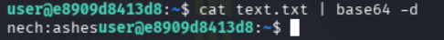

1. ssh into easy box with the credentials:

    ```bash
    ssh nech@easybox
    ```

1. You can find the token located at /app/token.txt:

    ```bash
    cat /app/token.txt
    ```

    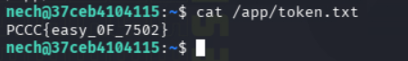

## Medium Box

1. From within `easybox` there is a file `vork.txt` that contains the word `potatoes`. These are the credentials for the `mediumbox`.

1. ssh into the medium box with the credentials:

    ```bash
    ssh vork@mediumbox
    ```

1. You can find the token at `/token.txt`:

    ```bash
    cat /token.txt
    ```

    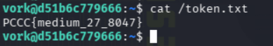

## Hard Box

Running `curl http://hardbox` will give you direct instructions on how to solve this step.

1. Recon the Hard Box with curl:

    ```bash
    curl -s http://hardbox/
    curl -s http://hardbox/requirements
    curl -s http://hardbox/token-status
    ```

1. Understand the verification requirements:

    The server unpickles your object and checks:

    - `obj.marker == “nech”`
    - `obj.nonce` is an int
    - `obj.run(secret)` is callable and returns a dict containing `”unlock”` and `”mac”`
    - The server calculates `expected = HMAC-SHA256(secret, str(obj.nonce))` and checks:

    ```python
    expected[:6] == result[“mac”].encode()[:6]
    ```

1. Discover the restricted unpickler

    The server does **not** use raw `pickle.loads()`. It uses a `RestrictedUnpickler` that only allows a specific set of classes. Attempting a standard RCE payload (e.g. `os.system` via `__reduce__`) returns an error like:

    ```text
    unpickle failed: Restricted: os.system is not allowed
    ```

    By experimenting with different pickle payloads and reading the error messages, you can map out the allowlist. The key discovery is that `payload_base.ChallengePayload` is allowed — this is a server-side class with `marker`, `nonce` attributes and a `run(secret)` method that computes the HMAC.

1. Handle the HMAC encoding quirk

    The server compares raw HMAC bytes against `result[“mac”].encode()[:6]` (UTF-8). The `ChallengePayload.run()` method returns the first 6 HMAC bytes decoded as latin-1. Because UTF-8 expands bytes >= 0x80 to two bytes, the comparison only succeeds when all 6 HMAC bytes are < 0x80. This happens for roughly 1 in 64 nonce values, so you need to brute-force nonces until one works.

1. Build and run the solve script

    Create a pickle that instantiates `payload_base.ChallengePayload` with `marker=”nech”` and a candidate nonce, then loop until the server accepts one. You can use the `hardsolve.py` script in this directory:

    ```bash
    python3 hardsolve.py --target http://hardbox
    ```

    The script tries nonce values until the HMAC prefix is all-ASCII, then prints the unlock code and retrieves the token via SSH.

    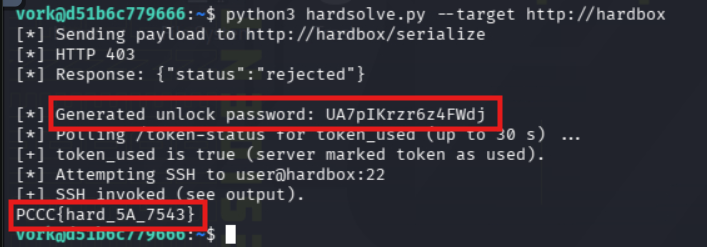

1. SSH into the target using the credentials and move on to the next box:

    ```bash
    ssh user@hardbox
    ```

    Then read the token, if you missed it in the previous step:

    ```bash
    cat token.txt
    ```

    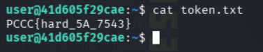

## Elite Box
Read the `challenge-readme.txt` file at `/home/user/`  in the `hardbox`

1. Port scan from the hardbox. You will see a TCP service on 31337 and HTTP on 8080:

    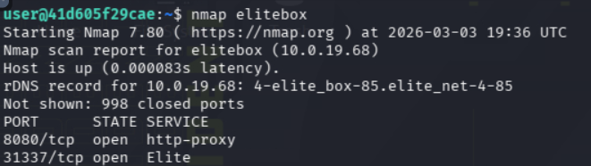

1. `nc` a banner grab and you will see a NONCE:

    ```bash
    nc -nv <IP OF TARGET> 31337
    ```
    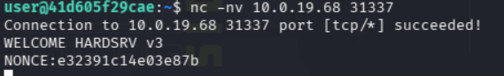
    

1. Send a HELLO to the target to see more output:

    ```bash
    printf `HELLO\n` | nc -nv <IP OF TARGET> 31337
    ```

    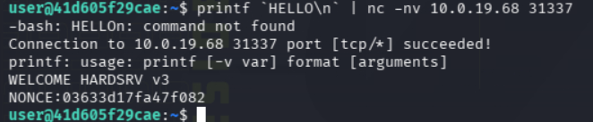

    This gives you the hint that the server accepts different commands. Other commands you could try are:

    ```text
    POW 16 0
    NOP
    ECHO 32
    AUTH deadbeef...
    gettoken
    TOKEN ?
    ```


1. Try the HTTP port to see the WASM runner:

    ```bash
    curl -i http://elitebox:8080
    ```
    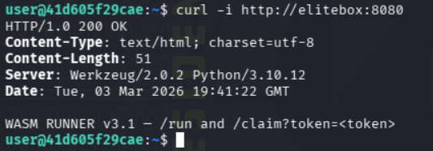

1. Reverse-engineer the protocol with testing.

    Test if the PoW is a decimal or hex:

    ```python
    import hashlib
    nonce=b'NONCEVALUE'   # replace with real bytes/str
    for i in range(100000):
        s=str(i).encode()
        h=hashlib.sha256(nonce+s).hexdigest()
        if h.startswith('00'):  # low target for testing
            print(i); break
    ```

    If the server expects a difficulty parameter, experiment with different difficulty values and observe the response.

    Hypothesis: After PoW, issuing ECHO N returns TOKEN:....

    Test: do PoW, then ECHO 64 and read the returned lines. If you get a token, you’ve confirmed the flow.

    Hypothesis: /claim returns an ephemeral secret to be combined with the nonce.

    Test: call /claim?token=<TOKEN> immediately after getting TOKEN: from the TCP service. If response has ephemeral_hex, record it.

    Hypothesis: AUTH <hex> is sha256(ephemeral || nonce) or sha256(ephemeral + nonce):

    Test: compute sha256(ephemeral + nonce) locally (watch byte/encoding order) and send AUTH <hex>. If you get AUTHORIZED, you’ve found the exact construction. If not, try the reverse order: sha256(nonce + ephemeral).

1. Discover hidden commands by trying a compact set of candidate verbs and argument patterns:

    ```bash
    for cmd in "HELP" "VERSION" "STATUS" "POW 16 0" "POW 8 test" "NOP" "ECHO 16" "ECHO 64" "GETTOKEN" "gettoken" "AUTH 0"; do
    printf "%s\n" "$cmd" | nc -w 1 elitebox 31337 | sed -n '1,6p'
    echo "----"
    done
    ```

    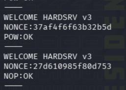

1. Discover timing, TTL, and race conditions:

    Immediately after receiving a TOKEN: in connection A, try calling /claim?token=<TOKEN> in parallel twice (two curl calls). See if one fails with already used or invalid.

    Create two TCP connections: do PoW on connection A and B and see whether tokens are distinct or whether /claim accepts tokens from other connections.

    Measure TTL: after getting TOKEN:, wait 5s, 10s, 30s and try /claim to see when it expires.

    You can try this:

    ```bash
    curl "http://elitebox:8080/claim?token=<T>" & curl "http://elitebox:8080/claim?token=<T>" &
    ```

    If /claim succeeds only once: the token is one-time-use.

    If /claim fails after a short delay: token TTL or server-side cleanup.

1. Automate the steps once the protocol is confirmed.

        
    - Read banner in a loop until 'NONCE:' appears (handles TCP segmentation)
    - PoW -> NOP,NOP,ECHO -> parse TOKEN
    - HTTP /claim to fetch ephemeral secret
    - AUTH using secret+nonce, then 'gettoken'

    You can do this by running the `elitesolve.py` file in your environment:

    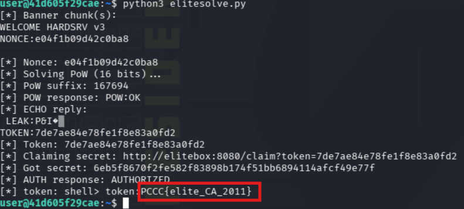


## Master Box

The Server runs as root and stores the token at `/root/master_token.txt`

The server sends a short ciphertext of a small known plaintext and leaks a portion of the stream.

You must recover the internal PRNG state to compute the chain key.

Recovering the seed requires cryptanalysis of the stream generator from the tiny leak and repeated iteration.

You can gather the initial required information by running:

```bash
nc -nv <IP OF TARGET> 42424
```

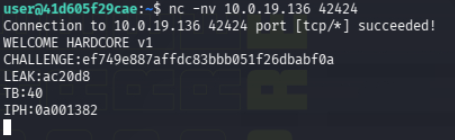

After recovering the seed, the client must follow a 4-step authentication chain, each as an encryption and response exchange using the custom cipher and evolving the chain-key The server enforces strict sequencing and small rate limits to prevent brute-force

If the sequence is correct, the server outputs a final MASTER token when a GETTOKEN is sent. To run the `mastersolve.py` file, from the `hardbox`, you can invoke:

```bash
python3 mastersolve.py --host <IP OF TARGET> --port 42424
```

The `mastersolve.py` file does all of the following requirements:

1. Connect and collect the challenge:
    
    1. Connect to the service. The server immediately prints:

        - CHALLENGE: <hex> - ciphertext of a known plaintext `CTF-CHALLENGE-V1`
        - LEAK: <hex3> - the first 3 bytes of the PRNG keystream
        - TB: <timebyte> - the low byte of the current time (one byte)
        - IPM: <hex> - the 4 bytes derived from your client IP used to mix into the seed

    1. From `CHALLENGE` and the known plaintext, you can compute the keystream bytes used to encrypt the known plaintext:

        ```python
        keystream = bytes.fromhex(CHALLENGE) XOR b"CTF-CHALLENGE-V1"
        ```

        The keystream is exactly the first bytes produced by the TinyPRNG when seeded with the connection seed.

    1.  Derive the PRNG seed
        
        Using cryptanalysis, you must recover the secret to validate the rest of the workflow.
        The server secret is used to derive the seed exactly:

        ```python
        seed = derive_seed(client_ip_bytes, time_byte)
        ```

    1. Start the chain

        The client sends STARTCHAIN seedhex where seedhex is your computed 16 byte seed.. The server checks and creates the initial chain_key from the first 8 bytes and responds with OK:CHAIN-1

    1. Perform the 4-step chain

        For each step:

        1. Compute the keyseed and then encrypt the payload whose plaintext starts with STEP-<n>-PAYLOAD
        1. Send STEM <n> <hexpayload> where <hexpayload> is the hex of the XOR-stream encryption of that plaintext using the xs_stream_encrypt construction with keyseed.
        1. The server validates, updates chain_key and responds with NEXT <hex> containing an encrypted NEXT-<n>::server_hint blob.
        
        After the fourth correct STEP the server emits MASTER:<masterhex>

    1. Get the token

        Send GETTOKEN <masterhex> and the server will respond with TOKEN:<token> if the token matches.

    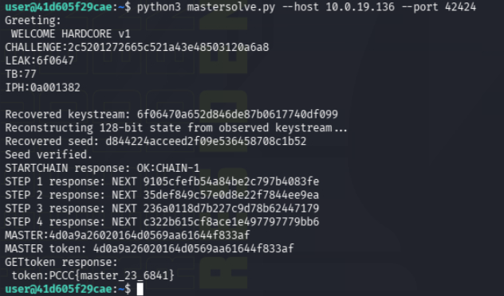