# Wargames

*Solution Guide*

## Overview

In `Wargames`, the competitors must exploit a Use-After-Free (UAF) vulnerability that allows them to write directly to a `pthread_t` struct. By changing the thread's target function, a race condition occurs where arbitrary code can be executed.

## Question 1

*Identify the address of the `printToken` function, and submit it to `WOPR/Joshua` for this token.*

This challenge follows the very standard format of exposing a vulnerable binary over a port, which we connect to directly with `Netcat`, `nc wopr.pccc 1337`. On connecting, we are shown ASCII art of some kind of missile silo, and told to type `help` for the available commands:

- loadkey - Checks for authorization to launch
- clearkey - Relinquish claimed authorization codes
- launch - Launch missile system
- help - Prints this message
- quit - Exit after all missiles complete

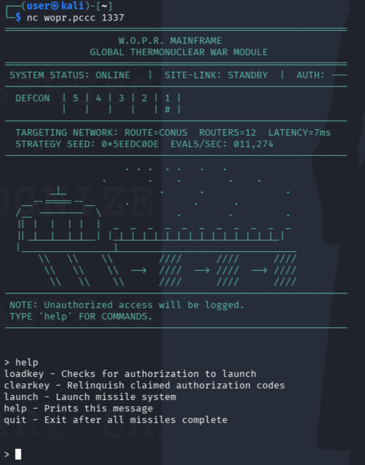

After exploring some of the options, let's start by first downloading the artifacts mentioned in the challenge description at `http://wopr.pccc`. Visit the address in your browser to find three files:

1. demo - The binary we will be exploiting
2. ld-linux-x86-64.so.2 - The dynamic linker we can use to run binary with the following `glibc` library
3. libc.so.6 - The compiled `glibc` file 

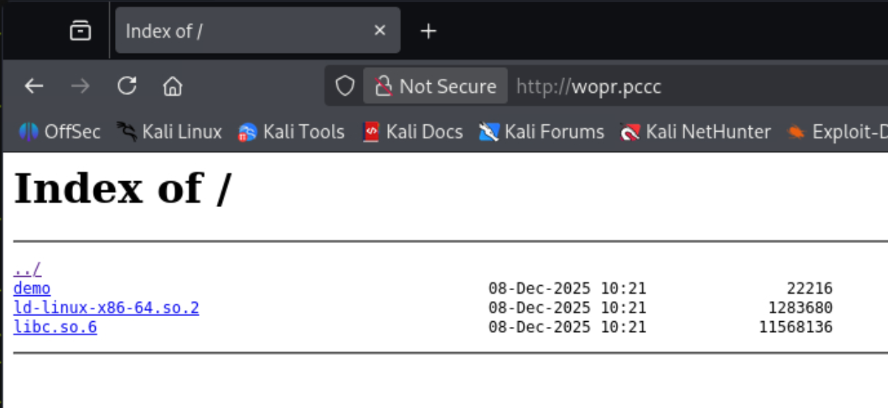

This allows us to run the vulnerable program with the same conditions as `wopr.pccc`. First, navigate to the directory containing your downloaded files, and run `chmod +x ./ld-linux-x86-64.so.2` to make the dynamic linker executable. We can run the program with `./ld-linux-x86-64.so.2 --library-path . ./demo`. 

When we run the program now, however, the binary will segfault on any mission launch. Unlike when connected with `netcat` earlier, there is now an error message at the top reading "Could not allocate key". Why this is occurring is unclear at the moment, but intuition tells us this is most likely a environment configuration issue. If we can recreate the environment, this issue should disappear.

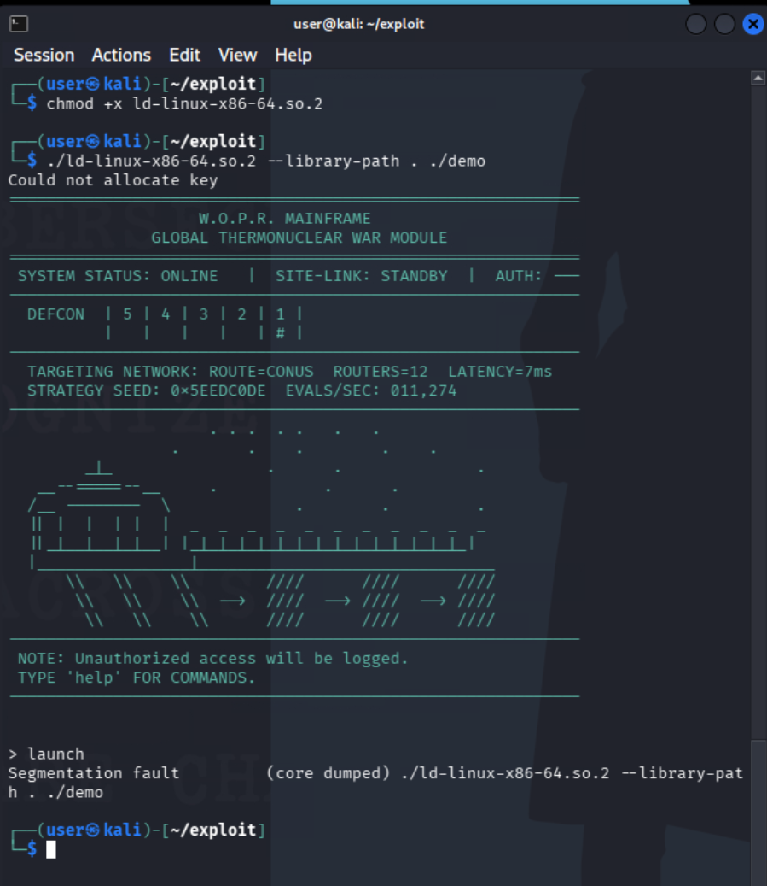

Let's put this in Ghidra. If you have not used Ghidra before, it may be useful to review to an outside tutorial first. Run `ghidra` to start the program, then click `File > New Project` to start a new project. Use a non-shared project, and enter a project name when prompted.

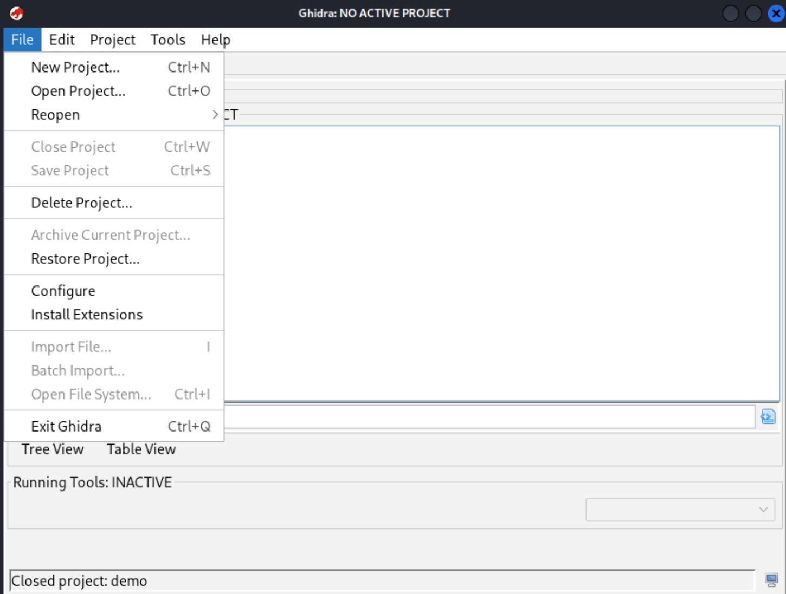

With a new active project, open the file command again and select `Batch Import` to import our binary files. You can then `CTRL` click each of the files we downloaded to import them into Ghidra. Click `OK` at the bottom to finish the import, and now you should see the three files. Click on `demo` to start analyzing the main binary.

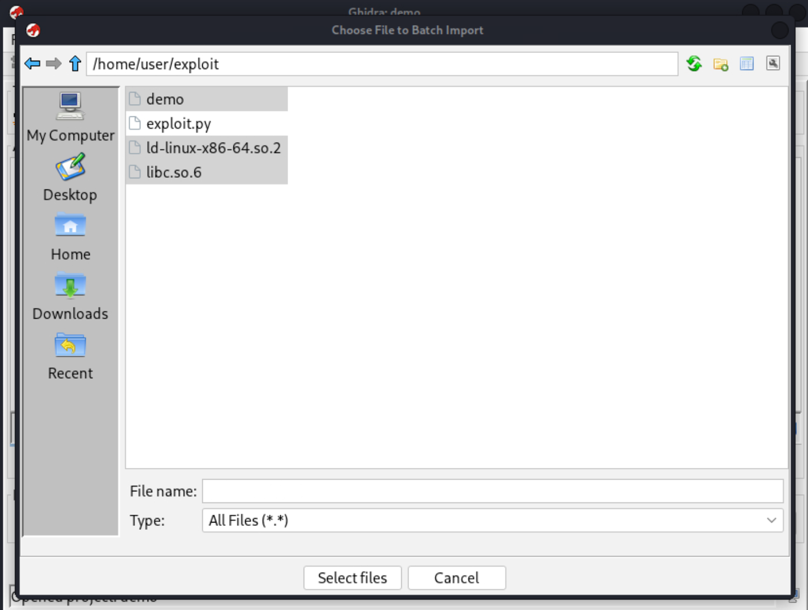

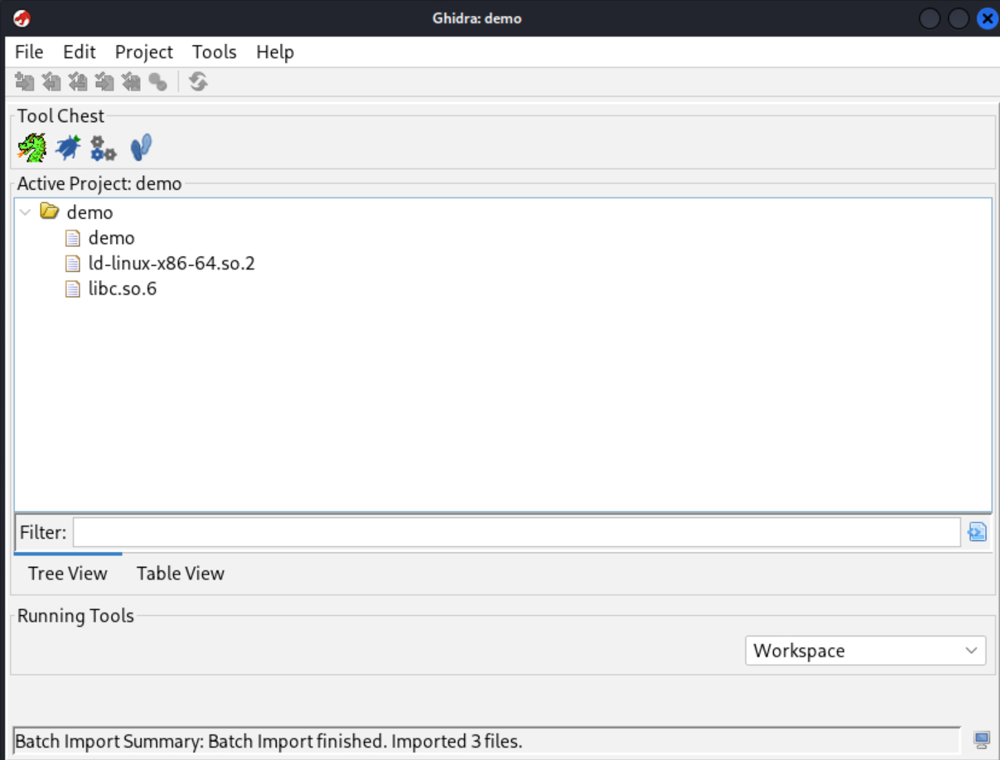

You will be asked if you want the file analyzed. Select yes, and accept to start the analysis. In the meantime, you will be presented with the main Ghidra screen. On the left side, you'll see a section labelled `Symbol Tree`, which includes `Functions`. Click `Functions` to expand the list, and unfortunately, we see the binary has been stripped and functions are instead only referenced by their offsets. Fortunately, we can quickly find the `main` function by inspecting the `entry` point. In this binary, we see that the function `FUN_00101d65` is called. Right-click `FUN_00101d65` and rename the function as `main`, then click it twice to open the `main` function for analysis. 

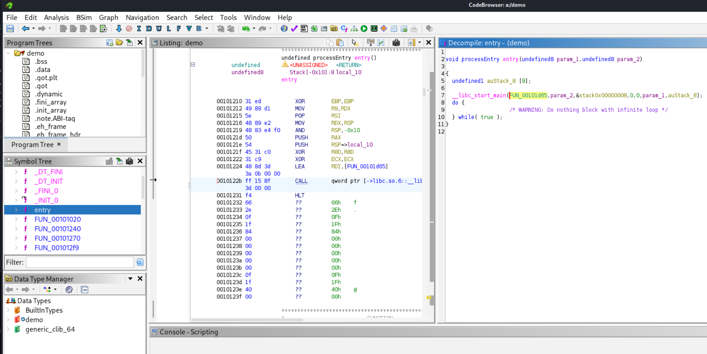

Now the right-most window contains the decompiled C code for the `main` function. Of course, compiling is a lossy process, so the code does not decompiled exactly back into the source code and can be difficult to read. However, scrolling through the code with our understanding of it so far, we can see a section where `strcmp` is called and compared to the string `launch`. We also see similar sections for `debugpatch` and `debugdump`.

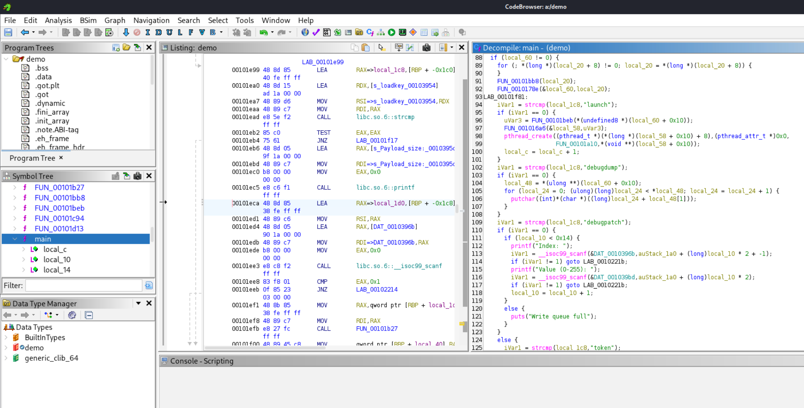

These commands, labelled as debug commands, were not listed by the help command. Searching further, we can also find a `token` command. When entered, this command calls the function `FUN_0010149f`, which we will rename to `handle_token_command` and then also inspect.

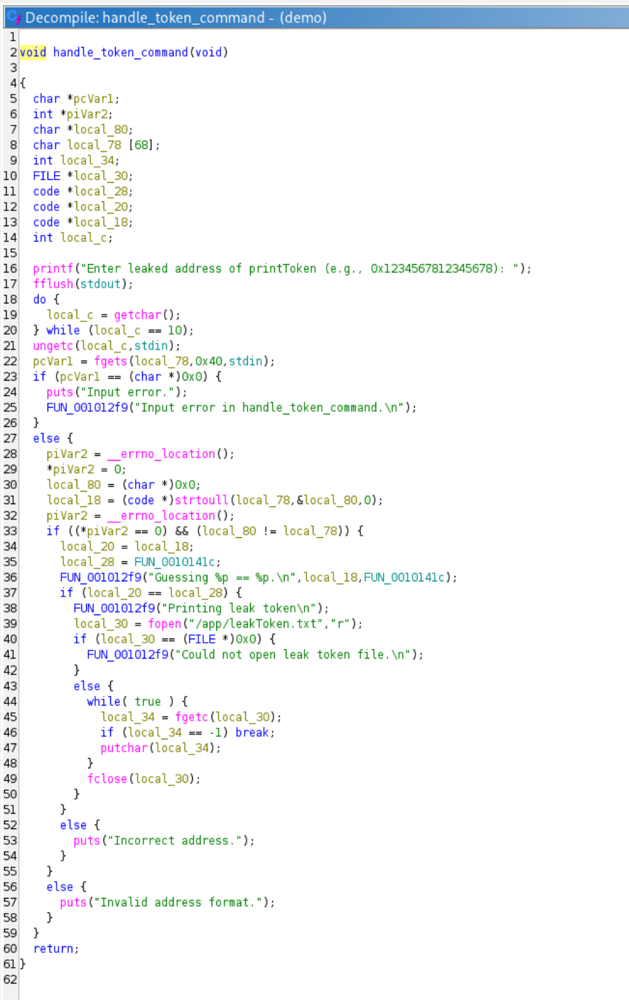

Inspecting this code, this is the command we will want to run to enter the first token. It prompts us to enter the address of `printToken`, and gives us a token if it is correct. Through manual inspection of the other functions, we can find `FUN_0010141c` is likely `printToken`, as it contains the code `FUN_001012f9("Inside printToken!\n");`. Note that `FUN_001012f9` is clearly some kind of logging function, as it simply prints the passed strings to `stderr` using `vfprintf`. 

However, we have not yet figured out the environment. There is function `FUN_00101b27`, which we will name `addKey`. When inspected, this function passes the string `"Could not allocate key\n"` to the logging function, so this is likely where the issue is occurring. The error message prints when `malloc` fails or the function `FUN_0010185f` returns `0`.

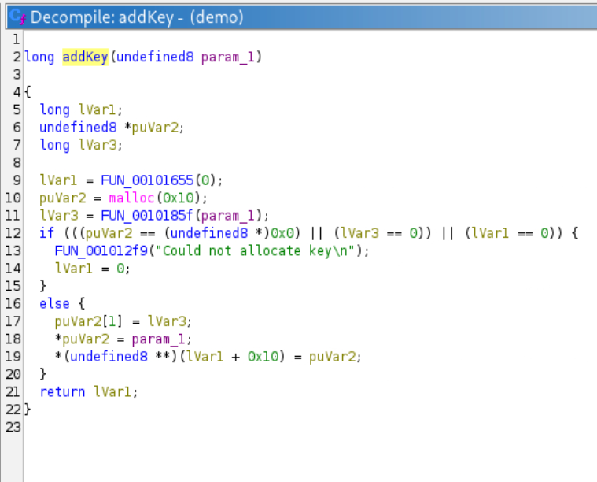

Checking `FUN_0010185f`, there is a call to `open("/devices/clearance_codes")`. This is the likely culprit for the environment misconfiguration as that file does not exist. We do not know what the contents should be at the moment, so for now we should just put any file there. We will redirect it to `/dev/urandom` (this is what the server actually does as well), but you can put any file there as long as it is sufficiently large for the full read to succeed.

```bash
sudo mkdir -p /devices
sudo ln -s /dev/urandom /devices/clearance_codes
sudo chmod 555 /devices/clearance_codes
```

One last function to identify is `FUN_00101a10`, which we will rename to `launch_missile`. This can be identified in `main` when the function is passed to `pthread_create`. This short decompiled segment is shown below.

```C
iVar1 = strcmp(local_1c8,"launch");
if (iVar1 == 0) {
    uVar3 = FUN_00101beb(*(undefined8 *)(local_60 + 0x10));
    FUN_001016a6(&local_58,uVar3);
    pthread_create((pthread_t *)(*(long *)(local_58 + 0x10) + 8),(pthread_attr_t *)0x0,
                    FUN_00101a10,*(void **)(local_58 + 0x10));
    local_c = local_c + 1;
}
```

With our token located and the environment fixed, we now need to figure out how to actually leak the address. The vulnerability in this case can be hard to identify. The most likely way it will be discovered, especially without the original source code, is to mess around with the application and watch for odd behavior.

To find the vulnerability, follow the process below:

1. Run the program, and start with the command `debugdump`. It will print random non-printable ASCII characters.
2. Run it again to see that contents do not change (while we can't read it exactly, we can see the non-printing characters are the same).
3. Now, run `clearkey` to delete the loaded key. Strangely, we can keep clearing the key, and `debugdump` will continue to work. An in-depth analysis of `main` would show only one key is allocated by default. 
4. Run `launch`, and enter a mission identifier like `A` when prompted.
5. Now run `debugdump`. The program now outputs a very different set of data.

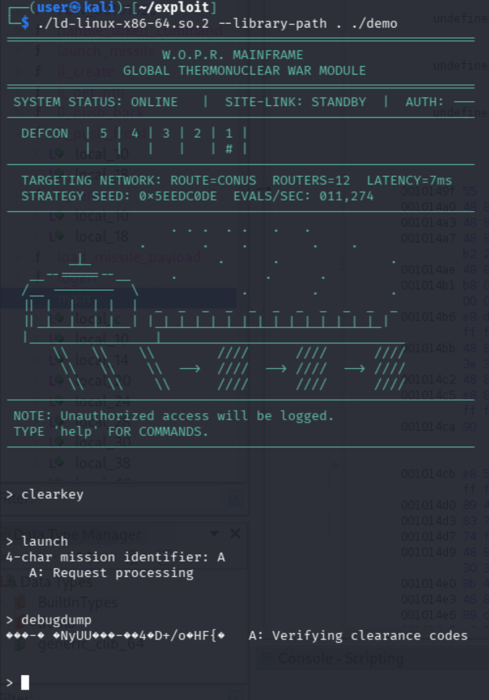

This odd behavior is occurring because the program uses the same `LinkedList` struct to store both the missile launch thread information and clearance keys. The function `FUN_0010178e` (which is `ll_remove` from the [source code](../challenge/server/app/main.c)), which is very difficult to follow in Ghidra, does not correctly reset the head pointer for the list to `NULL` after it is freed. When a new missile launch occurs, a new thread is created and stored in a linked list. The program reuses the linked list node that was just containing the key and freed. When we run `debugdump`, the key pointer still exists but now points to the thread, which results in the thread being printed instead!

Finally, the last thing to observe is that the dumped data is much shorter. The keys normally store a size, which is overwritten by the mission identifier when we launch the thread. That means if we instead enter `AA`, which is equivalent to `0x4141`, even more data will be printed. 

With this leak now identified, we can start inspecting the memory for useful addresses. We need to be running the program to do this, so we will now switch to using the Python library `pwntools` to investigate the program. The easiest way to identify the addresses would be to print out some useful addresses, print a hex dump of the leaked memory, and then just manually compare the addresses to the hex dump. Refer to the included solution script [./exploit.py](./exploit.py).

The `exploit.py` script uses `pwntools` to solve all three parts of the challenge. It is also programmed to dump memory just as we described. While going through the code would be too lengthy for this solution guide, the script is heavily commented. The script is run as `python exploit.py {step_number} {local_debug}`, where step_number is `1`, `2`, `3` (for the three tokens) or `d` for the memory dumping feature. If anything is provided as a second argument, the exploit is run against our local version of the binary.

Copy the `exploit.py` program onto your Kali machine in the same directory as the vulnerable binary, and run the program with `python exploit.py d l` so we can analyze the memory.

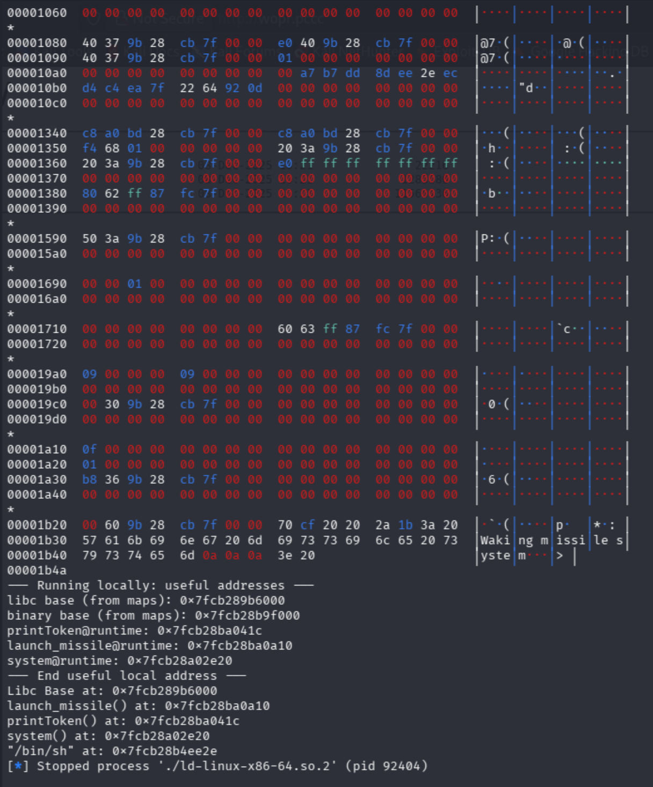

The program uses the `hexdump` function from `pwntools` to dump the extracted memory in a readable format. Since we are running locally, it also directly extracts several useful addresses from the local running process in the first marked location. The final section uses the addresses in the memory dump to calculate the addresses instead (and thus works on the remote version as well). While we aren't quite there yet, we can see the script did correctly extract, for example, the base address of `libc`.

Reading through the memory dump, at offset `0x638` we can see the address of `launch_missile`, `0x00005624ca8bfa10`. Note that your addresses will differ from mine and that the address is stored in Little Endian, so it is "backwards" in the dump.

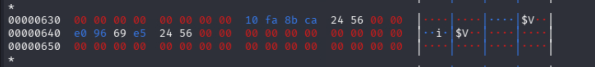

We can reliably use the offset `0x638` to find the address of `launch_missile`. While we don't need that address directly, we can use the following code to calculate the location of `printToken` and defeat `ASLR`.

```python
# launch_addr contains the realtime address of launch_missile
# launchMissileOffset contains the offset for launch_missile from the start of the user code
# printTokenOffset contains the offset for printToken from the start of the user code
printToken = (launch_addr - launchMissileOffset) + printTokenOffset
```

That is, if we know `launch_missile` is `100` bytes from the start of the code, and `launch_missile` is at `800`, we can determine the code starts at `700`. We can then add the offset for `printToken` to `700` to get the real address for that function!

Note that the `launchMissileOffset` and `printTokenOffset` offsets, hardcoded in the provided solution script, can be found in Ghidra by selecting the function and hovering over the starting instruction address in the disassembly view, or from the automated function names (e.g., launch_missile was named FUN_00101a10 and the offset is 0x1a10).

With this calculation, we can also use `pwntools` to submit the calculated value. Note that if you want to run it locally, you will first need to create files that contain fake tokens. The exact file names can be extracted with Ghidra, just like we did before when we determined how to fix the environment.

```bash
sudo mkdir /app
sudo chown user /app
echo "PCCC{Token1}" > /app/leakToken.txt
echo "PCCC{Token2}" > /app/functionToken.txt
echo "PCCC{Token3}" > /app/systemToken.txt
```

With that setup, run it with `python exploit.py 1 l`.

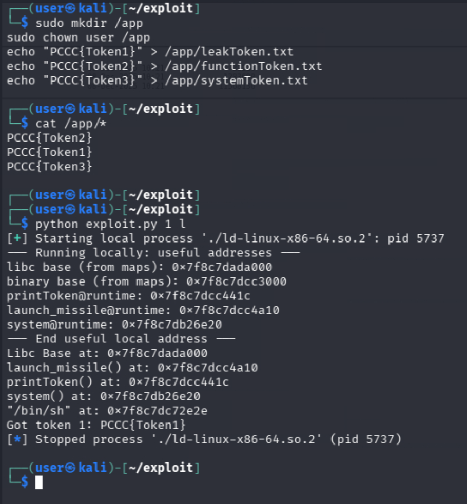

With that confirmed to work, we can now run it against the remote version with `python exploit.py 1`.

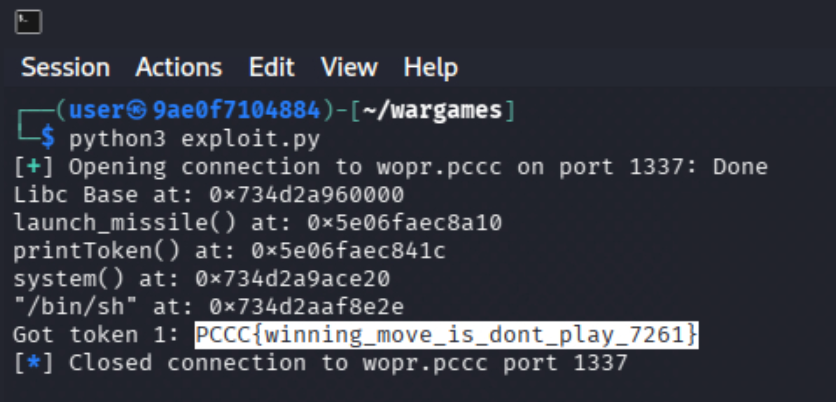

In this case, the token is `PCCC{winning_move_is_dont_play_7261}`.

## Question 2

*This token can be retrieved by executing `printToken`.*

Now that we have the address of `printToken`, we now need it to execute. Note that this and the following section will be deceptively short, as we will be relying on the script, and we can also immediately determine what we are looking at without researching the x64 thread internals, which we would need to do during the challenge.

The location (offset `0x638`) that contained the address of `launch_missile` is actually the thread's `start_routine`, or the function that the thread should execute. If we can overwrite this address before the thread starts, we can call a function that we want. We can use the `debugPatch` function we found earlier to patch a "key", which is really the thread. 

There are two hiccups to consider. The first is that we need to start one thread to dump memory. Before we can write, we need to wait for that thread to end and be freed before we can repeat the UAF vulnerability. This can be overcome by sleeping for several seconds. The next issue is that the writing is done with an odd format, which the script resolves with the function `rev_hex`. 

The provided `exploit.py` script, when runs with argument `2` handles this process for us. For more exact details, please refer to the comments in `exploit.py`. When ready, run `python exploit.py 2`.

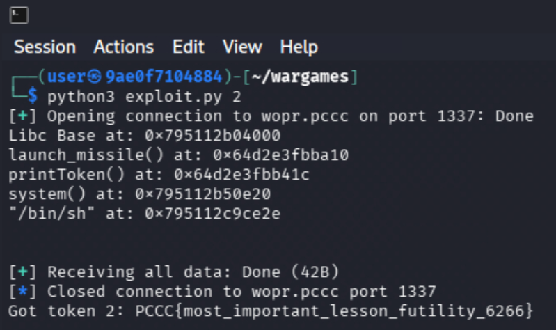

In this case, the token is `PCCC{most_important_lesson_futility_6266}`.

## Question 3

*Retrieve this token from the `/app` directory.*

Similar to Question 2, this section will also be deceptively short; for full details, refer to the comments in `exploit.py`. 

We now want to call the function `system` with the argument `/bin/sh`, which will give us a shell. One of the addresses that we can leak if we dump a sufficient amount of memory is the base address of `libc` itself. Using this address, we can use `pwntools` to calculate an address for both `system` and a pointer to the string `/bin/sh`.

```python
system = libc_base + libc.sym.system
binsh = libc_base + next(libc.search(b"/bin/sh"))
```

The argument should be stored in the thread directly after the `start_routine`. When ready, run `python exploit.py 3`. This will spawn a shell, and then uses `cat` to retrieve the token directly. Finally, note that since we are launching `system` from a thread, input will be split between `sh` and the main thread. We can force the main thread to stop by repeatedly entering `quit`. The script should handle this for you, and has further explanatory comments, but it is possible (but unlikely) that all of the `quit` lines will be captured by `sh`. In that case, the script will drop you into an interactive shell, where you can then use `quit` and `cat` yourself.

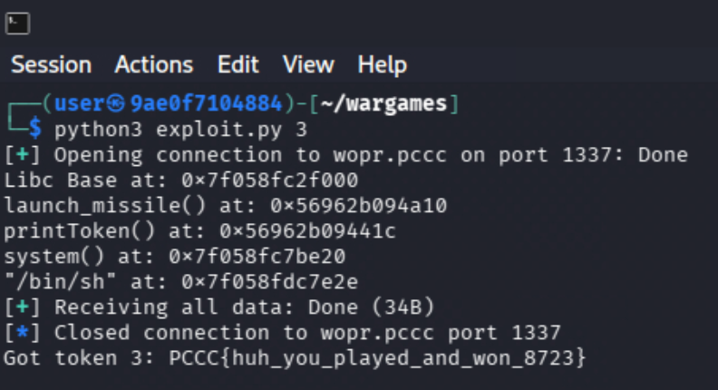

In this case, the token is `PCCC{huh_you_played_and_won_8723}`.