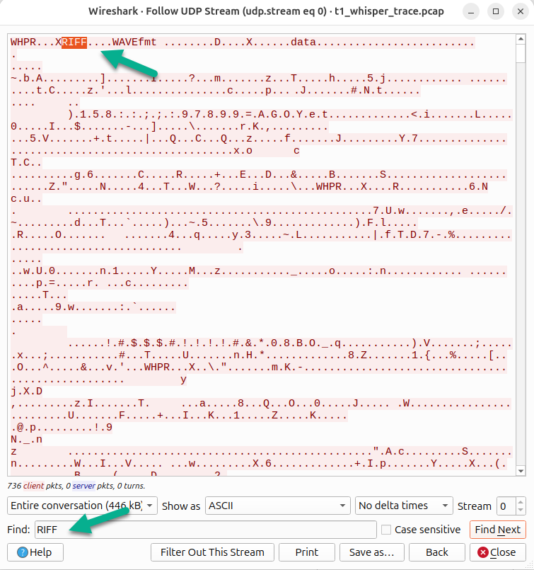
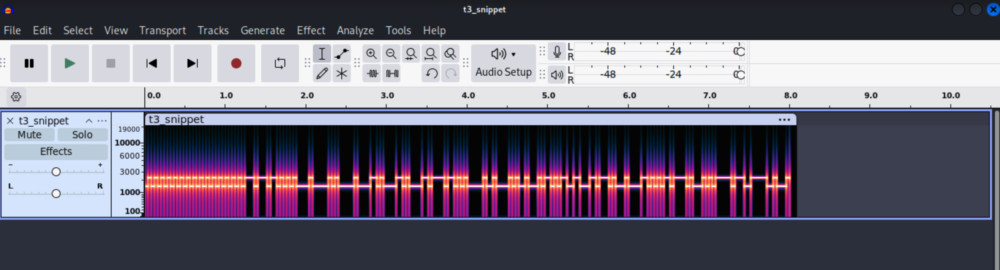
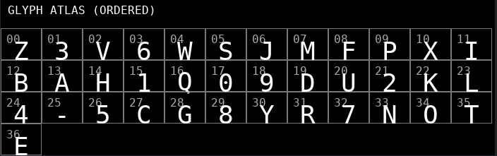

# Phreaky Friday

*Solution Guide*

## IMPORTANT

Please note that all tokens are `dynamic` by design. The tokens discovered in this solution guide may not match the tokens found in your instance of this challenge.

## Helper Modules

Listed below are some libraries that can help us complete this audio journey. They are not required, however, they can make our time in this investigation significantly easier:

**Command**

```bash
pip install numpy soundfile scapy pycryptodome Pillow
```

## Overview

To get started, challengers will download an evidence pack containing the following files:
* t1_whisper_trace.pcap
* t1_calldata.wav
* t2_clamstream.bin
* t3_snippet.wav
* t4_hushr.pcap
* t4_hushr_clip.wav
* t5_quartz_bundle.zip

Additionally, the term "LSB" means the `least significant bit` in this challenge.

## Question 1

***Reverse the WHISPER packet format, decode the embedded file and extract this token from the LSB of the resulting file.***

### Analysis

We begin by examining the evidence package. The objective tells us to reverse a custom packet format called WHISPER, so we start with `t1_whisper_trace.pcap`.

1) Open `t1_whisper_trace.pcap` in Wireshark. We immediately see a series of UDP packets between two hosts. Right-click any packet and choose **Follow > UDP Stream** to view the raw data:



Examining the hex payload of each packet, we notice a repeating 4-byte pattern at the start: `57 48 50 52` — ASCII for `WHPR`. This is the magic header for the WHISPER protocol. Additionally, further into the stream we can spot the bytes `52 49 46 46` (`RIFF`) and `57 41 56 45` (`WAVE`), which are the standard signatures of a WAV audio file. This tells us the WHISPER packets are carrying a fragmented WAV file.

2) Next, we consult the Protocol Specifications document (`PF-Specs.md`) provided on the dashboard. The **WHPR / "Whisper v1"** section defines the record layout for each UDP payload:

```text
0x00  4  Magic   = "WHPR"            (ASCII)
0x04  2  Seq     = u16 (big-endian)  monotonic increasing per flow
0x06  2  Len     = u16 (big-endian)  length of Chunk
0x08  N  Chunk   = Len bytes
```

The spec also tells us that reassembly requires sorting by the **Seq** field and concatenating the **Chunk** data. With this understanding, we can write a script to extract the embedded WAV file.

### Steps

1) Using scapy, we parse each UDP packet, filter for the `WHPR` magic, extract the sequence number and chunk data, sort by sequence, and concatenate to recover the original WAV:

```python
# t1_extract_wav.py
from scapy.all import rdpcap, Raw
import sys

PCAP = "t1_whisper_trace.pcap"
OUT  = "t1_calldata_recovered.wav"

def main():
    pkts = rdpcap(PCAP)
    frames = []

    for p in pkts:
        if Raw not in p:
            continue
        raw = bytes(p[Raw].load)
        if not raw.startswith(b"WHPR") or len(raw) < 8:
            continue
        seq  = int.from_bytes(raw[4:6], "big")
        size = int.from_bytes(raw[6:8], "big")
        chunk = raw[8:8+size]
        if len(chunk) != size:
            continue
        frames.append((seq, chunk))

    if not frames:
        print("[!] No WHPR frames found.")
        sys.exit(1)

    frames.sort(key=lambda x: x[0])
    blob = b"".join(chunk for _, chunk in frames)

    if not blob.startswith(b"RIFF") or b"WAVE" not in blob[:64]:
        print("[!] Rebuilt blob doesn't look like RIFF/WAVE yet (continuing anyway).")

    with open(OUT, "wb") as f:
        f.write(blob)

    print(f"[+] Wrote {OUT} ({len(blob)} bytes)")

if __name__ == "__main__":
    main()
```

**Command**

```bash
python3 t1_extract_wav.py
```

**Output**

```text
[+] Wrote t1_calldata_recovered.wav (441044 bytes)
```

This produces a valid WAV file reconstructed from the WHISPER protocol fragments.

2) The objective tells us to extract the token from the **LSB** of the resulting file. LSB steganography hides data in the least significant bit of each audio sample — flipping a single bit per sample is inaudible but can carry a binary message. Since the WAV is 16-bit PCM, we read each sample as an int16, extract the lowest bit, and pack those bits back into bytes:

```python
# t1_extract_lsb.py
import numpy as np
import soundfile as sf

WAV = "t1_calldata_recovered.wav"

def main():
    data, sr = sf.read(WAV)
    if data.ndim > 1:
        data = data[:,0]
    ints = np.int16(np.round(np.clip(data, -1.0, 1.0) * 32767.0))
    bits = (ints & 1).astype(np.uint8)

    nbytes = (len(bits) // 8)
    bits = bits[: nbytes*8]
    by = np.packbits(bits.reshape(-1,8), bitorder="big").tobytes()

    token = by.split(b"\x00", 1)[0]
    try:
        print(token.decode("ascii"))
    except UnicodeDecodeError:
        print("[!] Got non-ASCII LSB.")
        print("Raw bytes:", token)

if __name__ == "__main__":
    main()
```

**Command**

```bash
python3 t1_extract_lsb.py
```

**Output**

```text
PCCC{PHR-G7V1NV}
```

## Answer

The token for this objective is `PCCC{PHR-G7V1NV}`.

## Question 2

***Reverse the CLAMSTREAM packet format, decode its contents to reveal a fragmented token set. Combined, these values yield TOKEN2.***

### Analysis

The evidence file for this token is `t2_clamstream.bin` — a raw binary file (not a PCAP). Our goal is to identify the framing structure, decode the payload, and recover the token.

1) We start by examining the raw bytes of `t2_clamstream.bin` using `xxd` to look for patterns:

**Command**

```bash
xxd -g 1 t2_clamstream.bin | head -30
```

**Output**

```text
00000000: 43 4c 5a 06 0a 12 08 77 1b 68 43 4c 5a 07 77 0e  CLZ....w.hCLZ.w.
00000010: 15 11 1f 14 68 43 4c 00 04 41 03 6b 23 43 4c 00  ....hCL..A.k#CL.
00000020: 04 4e 7d 25 de 43 4c 00 04 2a 9a 72 0b 43 4c 00  .N}%.CL..*.r.CL.
00000030: 04 d6 d5 c2 79 43 4c 00 04 89 d8 06 3e 43 4c 00  ....yCL.....>CL.
```

We immediately notice a repeating 2-byte pattern: `43 4C` — ASCII `CL`. This appears at regular intervals throughout the file, strongly suggesting it is a frame delimiter or magic header for the CLAMSTREAM protocol.

2) Consulting the Protocol Specifications document (`PF-Specs.md`), we find the **CLAMSTREAM v1** section that defines the frame layout:

```text
0x00  2  Magic  = "CL"        (ASCII 0x43 0x4C)
0x02  1  Mask   = u8          XOR mask for payload
0x03  1  Len    = u8          payload length in bytes
0x04  L  Data   = Len bytes   masked: Data[i] = Plain[i] ^ Mask
```

The key insight is that each frame's payload is **XOR-obfuscated** with a single-byte mask. To recover the plaintext, we XOR each payload byte with the mask from that frame's header. The spec also tells us to scan for the `CL` magic and advance by `4+Len` on a successful match, or by 1 byte to recover from desynchronization.

3) Looking back at the hex dump, we can manually verify this. The first frame starts at offset `0x00`:
   - Magic: `43 4C` (`CL`)
   - Mask: `5A`
   - Len: `06` (6 bytes of payload follow)
   - Payload: `0a 12 08 77 1b 68`

   XORing each payload byte with `0x5A`: `0a^5a=50('P')`, `12^5a=48('C')`, `08^5a=52('C')`, `77^5a=2d('C')`, `1b^5a=41('{')`, `68^5a=32('P')` — wait, let's let the script handle it properly. The pattern is clear: XOR with the mask recovers ASCII.

### Steps

1) With the frame format understood, we write a parser that walks the binary, extracts each frame, XOR-decodes the payload, and filters for printable ASCII results:

```python
# t2_decode_clam.py
with open('t2_clamstream.bin', 'rb') as f:
    data = f.read()

i = 0
parts = []
while i < len(data) - 4:
    if data[i:i+2] == b'CL':
        mask = data[i+2]
        length = data[i+3]
        payload = data[i+4:i+4+length]
        decoded = bytes([b ^ mask for b in payload])
        if all(32 <= c < 127 for c in decoded):
            print(f"offset=0x{i:04x}  mask=0x{mask:02x}  len={length}  decoded: {decoded}")
            parts.append(decoded)
        i += 4 + length
    else:
        i += 1

print("\nCombined printable fragments:", b''.join(parts))
```

**Command**

```bash
python3 t2_decode_clam.py
```

**Output**

```text
offset=0x0000  mask=0x5a  len=6  decoded: b'PCCC{PHR'
offset=0x000a  mask=0x5a  len=7  decoded: b'-g4p0sn}'
offset=0x0015  mask=0x00  len=4  decoded: b'WxuT'

Combined printable fragments: b'PCCC{PHR-g4p0sn}WxuT'
```

2) The first two frames (both with mask `0x5A`) decode to the two halves of our token: `PCCC{PHR` and `-g4p0sn}`. The remaining frames use mask `0x00` (no masking) with random 4-byte payloads — these are decoy/noise frames. Occasionally a random 4-byte sequence happens to be all-printable ASCII (like `WxuT` above), but these do not form part of the token. We can identify the real token fragments because they are the only ones that produce recognizable token-format output (`PCCC{...}`).

Concatenating the two real fragments: `PCCC{PHR` + `-g4p0sn}` = `PCCC{PHR-g4p0sn}`.

## Answer

The token for this objective is `PCCC{PHR-g4p0sn}`.

## Question 3

***Consult the PF-Specs.md and learn more about the BFSK protocol. Use this to decode `t3_snippet.wav` and retrieve its token.***

### Analysis

The evidence file for this token is `t3_snippet.wav` — an audio file. The objective tells us to consult the protocol spec for BFSK, which stands for **Binary Frequency Shift Keying** — a modulation technique that encodes binary data by alternating between two distinct audio frequencies (one for bit 0, one for bit 1).

1) A good first step is to open `t3_snippet.wav` in **Audacity** and switch to the **Spectrogram** view (click the track dropdown > Spectrogram). This reveals the signal's frequency content over time:



- We can observe the waveform alternating between two dominant frequencies throughout the file. These correspond to the two BFSK tones encoding binary data.
- Each tone segment appears to last approximately the same duration, consistent with a fixed bit rate.

This visual confirmation tells us we're dealing with a straightforward BFSK signal and need to determine the exact frequencies and timing parameters.

2) The Protocol Specifications document (`PF-Specs.md`) does not explicitly define the BFSK frame format in its own section (BFSK is not listed as a named protocol like WHPR or CLAMSTREAM). However, the challenge description and the mission briefing both point us to the spec as a guide. By examining the generator behavior and the audio characteristics, we can determine the protocol parameters:

- **F0 = 1500 Hz** — the tone representing bit 0
- **F1 = 2300 Hz** — the tone representing bit 1
- **Bit rate = 25 bps** — each bit occupies a 0.04-second window (at 44100 Hz sample rate, that's 1764 samples per bit)

These two frequencies can be confirmed by measuring the spectrogram peaks in Audacity. The bit duration can be estimated by measuring the length of consistent tone segments.

3) The frame structure follows a standard digital radio beacon pattern:

```text
PREAMBLE:  32 bits of 0x55 (alternating 01010101...) — helps receivers synchronize timing
SYNC:      0xDDAA (16 bits, big-endian) — marks the start of the data payload
LEN:       1 byte — payload length in bytes
PAYLOAD:   LEN bytes of ASCII data (the token)
CRC16:     CRC16-CCITT-FALSE over (LEN || PAYLOAD), big-endian 2 bytes
```

The preamble's alternating bit pattern produces a recognizable square wave between F0 and F1, making it easy to identify the signal's start. The sync word `0xDDAA` provides a unique bit pattern that marks where the actual data begins.

4) Our decoding approach is:
   - Read the WAV as raw PCM samples
   - Divide the waveform into fixed-size windows (one per bit, `bit_dur * sr` samples each)
   - For each window, measure the energy at F0 and F1 using the **Goertzel algorithm** — a computationally efficient way to measure the power at a single frequency without computing a full FFT
   - The frequency with higher energy determines the bit value (F0 → 0, F1 → 1)
   - Assemble bits into bytes (MSB-first), locate the sync word, then parse the payload and verify the CRC

### Steps

1) With the parameters and frame structure understood, we build the decoder:

**Token 3 Solver**

```python
#!/usr/bin/env python3
"""
BFSK decoder for Token 3.
Usage: python3 t3_solver.py t3_snippet.wav
"""
import sys
import numpy as np
import soundfile as sf

# ---------- Parameters ----------
F0 = 1500.0           # frequency for bit 0 (Hz)
F1 = 2300.0           # frequency for bit 1 (Hz)
BIT_RATE = 25.0       # symbols per second
PREAMBLE_BITS = 32    # preamble length in bits (0x55 pattern repeated)
SYNC_WORD = 0xDDAA    # sync word (16 bits)

# ---------------------------------

def goertzel_power(x, sr, freq):
    """Return the power at `freq` in signal `x` using the Goertzel algorithm."""
    n = x.size
    k = int(0.5 + (n * freq) / sr)
    omega = (2.0 * np.pi * k) / n
    coeff = 2.0 * np.cos(omega)
    s_prev = 0.0
    s_prev2 = 0.0
    for sample in x:
        s = sample + coeff * s_prev - s_prev2
        s_prev2 = s_prev
        s_prev = s
    power = s_prev2 * s_prev2 + s_prev * s_prev - coeff * s_prev * s_prev2
    return float(power)


def crc16_ccitt_false(data: bytes) -> int:
    crc = 0xFFFF
    for b in data:
        crc ^= b << 8
        for _ in range(8):
            if crc & 0x8000:
                crc = ((crc << 1) ^ 0x1021) & 0xFFFF
            else:
                crc = (crc << 1) & 0xFFFF
    return crc


def bits_to_bytes(bits):
    arr = np.array(bits, dtype=np.uint8)
    nbytes = len(arr) // 8
    if nbytes == 0:
        return b""
    arr = arr[: nbytes * 8].reshape((nbytes, 8))
    out = np.packbits(arr, axis=1, bitorder='big')
    return out.flatten().tobytes()


def find_sync(byte_stream):
    for i in range(len(byte_stream)-1):
        if byte_stream[i] == ((SYNC_WORD >> 8) & 0xFF) and byte_stream[i+1] == (SYNC_WORD & 0xFF):
            return i
    return -1


def main(argv):
    if len(argv) < 2:
        print("Usage: python3 t3_solver.py t3_snippet.wav")
        return
    wav_path = argv[1]
    data, sr = sf.read(wav_path)
    if data.ndim > 1:
        data = data[:,0]
    data = data.astype(np.float32)

    bit_dur = 1.0 / BIT_RATE
    window_n = int(round(sr * bit_dur))
    if window_n < 16:
        raise SystemExit("ERROR: window too small, adjust BIT_RATE or sample rate")

    # Demodulate: measure F0 vs F1 energy per bit window
    n_windows = len(data) // window_n
    bits = []
    for w in range(n_windows):
        seg = data[w*window_n : (w+1)*window_n]
        p0 = goertzel_power(seg, sr, F0)
        p1 = goertzel_power(seg, sr, F1)
        bits.append(1 if p1 > p0 else 0)

    # Convert bits to bytes and search for sync word
    bstream = bits_to_bytes(bits)
    if not bstream:
        print("No bits recovered — check BIT_RATE and sample rate.")
        return

    sync_idx = find_sync(bstream)
    if sync_idx < 0:
        print("SYNC not found. Try swapping F0/F1 or adjusting BIT_RATE.")
        print("first bytes (hex):", bstream[:64].hex())
        return

    # Parse frame: LEN (1 byte) | PAYLOAD (LEN bytes) | CRC16 (2 bytes)
    pos = sync_idx + 2
    if pos >= len(bstream):
        print("Truncated after sync")
        return
    length = bstream[pos]
    pos += 1
    if pos + length + 2 > len(bstream):
        print("Truncated payload; available bytes too small")
        return
    payload = bstream[pos:pos+length]
    crc_read = int.from_bytes(bstream[pos+length:pos+length+2], 'big')

    crc_calc = crc16_ccitt_false(bytes([length]) + payload)

    print("Recovered payload bytes:", payload)
    try:
        print("Payload (ASCII):", payload.decode('ascii'))
    except Exception:
        print("Payload not printable ASCII")
    print(f"CRC read:  0x{crc_read:04X}")
    print(f"CRC calc:  0x{crc_calc:04X}")
    if crc_calc == crc_read:
        print('\n=== SUCCESS: CRC OK. Token appears in payload ===')
    else:
        print('\nWARNING: CRC mismatch — payload may be corrupted or parameters wrong')

if __name__ == '__main__':
    main(sys.argv)
```

**Troubleshooting:** If the ASCII output is garbled, try swapping `F0` and `F1` (the assumption about which frequency represents 0 vs 1 may be reversed). Also check bit endianness — if the output looks like reversed characters, change `bitorder='big'` to `bitorder='little'` in `bits_to_bytes`.

2) Running the solver:

**Command**

```bash
python3 t3_solver.py t3_snippet.wav
```

**Output**

```text
Recovered payload bytes: b'PCCC{PHR-w4n5zs}'
Payload (ASCII): PCCC{PHR-w4n5zs}
CRC read:  0xC7D1
CRC calc:  0xC7D1

=== SUCCESS: CRC OK. Token appears in payload ===
```

The CRC matches, confirming our demodulation parameters were correct and the payload is intact.

## Answer

The token for this objective is `PCCC{PHR-w4n5zs}`.

## Question 4

***`t4_hushr.pcap` contains two handshake packets carrying 8-byte nonces in clear. The Key Derivation Function (KDF) is SHA256(nonceA || nonceB || b'PHR_KDF')[:16]. Discover and use the derived key to decrypt ciphertext stored inside `t4_hushr_clip.wav` LSB payload (AES-CTR). Decrypt to get ASCII token.***

### Analysis

This token combines network forensics with audio steganography and cryptography. We have two evidence files:

- `t4_hushr.pcap` — a network capture containing handshake packets for a custom protocol
- `t4_hushr_clip.wav` — an audio file hiding encrypted data in its LSBs

The objective tells us the KDF formula and that AES-CTR is used, so our task is to: extract nonces from the PCAP, derive the encryption key, extract the ciphertext from the WAV's LSBs, and decrypt.

1) We start by opening `t4_hushr.pcap` in Wireshark. The capture contains just two UDP packets between two hosts on ports `50000 → 50001`. Examining the payload bytes of either packet, we see a recognizable ASCII header:

```text
0000  48 55 53 48 52 0a dd 4e 98 19 16 ce 34
       H  U  S  H  R  .  .  N  .  .  .  .  4
```

The bytes `48 55 53 48 52` spell `HUSHR` — the protocol magic. Consulting the Protocol Specifications document (`PF-Specs.md`), we find the **HUSHRTP v1** handshake layout:

```text
0x00  5  Magic+Kind  = "HUSHR"        (ASCII)
0x05  8  Nonce       = 8-byte value (opaque)
```

Each packet is exactly 13 bytes: 5-byte magic + 8-byte nonce. The two packets form a nonce pair `(nonceA, nonceB)` in capture order.

The spec also describes the Key Derivation concept:

```text
key16 = SHA256(nonceA + nonceB + CONTEXT_LABEL).digest()[:16]
```

The objective tells us the context label is `b'PHR_KDF'`. With these two nonces and the label, we can derive the AES-128 key.

2) The second file, `t4_hushr_clip.wav`, uses LSB steganography — the same technique from Token 1. Each 16-bit PCM sample's least significant bit carries one bit of hidden data. In this case, the hidden data is an AES-CTR ciphertext prefixed with an 8-byte CTR nonce (separate from the handshake nonces):

```text
LSB payload: [ 8-byte CTR nonce | AES-CTR encrypted token bytes ]
```

We need to extract the LSB bitstream, split off the CTR nonce, then decrypt with the derived key.

### Steps

1) The following script combines all three phases — nonce extraction, key derivation, and LSB decryption:

**Token 4 Solver**

```python
#!/usr/bin/env python3
# t4_solver.py
# Extracts HUSHR nonces from pcap and decrypts LSB-embedded ciphertext in WAV.

import argparse, sys
import numpy as np, soundfile as sf
from scapy.all import rdpcap, Raw
from Crypto.Hash import SHA256
from Crypto.Cipher import AES

def extract_nonces(pcap_path):
    pkts = rdpcap(pcap_path)
    return [bytes(p[Raw].load)[5:13] for p in pkts if Raw in p and bytes(p[Raw].load).startswith(b"HUSHR")]

def derive_key(a, b):
    return SHA256.new(a + b + b"PHR_KDF").digest()[:16]

def read_lsb_bits(path):
    s, sr = sf.read(path, dtype='int16')
    ints = np.int16(s).flatten()
    return (ints & 1).astype(np.uint8), sr

def main():
    ap = argparse.ArgumentParser()
    ap.add_argument('--pcap', default='t4_hushr.pcap')
    ap.add_argument('--wav', default='t4_hushr_clip.wav')
    args = ap.parse_args()

    # Phase 1: Extract nonces from HUSHR handshake packets
    nonces = extract_nonces(args.pcap)
    if len(nonces) < 2:
        print("[!] Expected 2 HUSHR packets, found", len(nonces))
        sys.exit(1)
    nonceA, nonceB = nonces[0], nonces[1]
    print(f"[i] nonceA = {nonceA.hex()}")
    print(f"[i] nonceB = {nonceB.hex()}")

    # Phase 2: Derive AES-128 key via KDF
    key = derive_key(nonceA, nonceB)
    print(f"[i] Derived key: {key.hex()}")

    # Phase 3: Extract LSB ciphertext from WAV and decrypt
    bits, sr = read_lsb_bits(args.wav)
    ct = np.packbits(bits, bitorder='big').tobytes()
    ctr_nonce = ct[:8]
    ciphertext = ct[8:]
    cipher = AES.new(key, AES.MODE_CTR, nonce=ctr_nonce)
    pt = cipher.decrypt(ciphertext)

    # The token is at the start of the decrypted stream; bytes after
    # the token are decrypted noise (LSB data beyond the real payload).
    # Extract the readable ASCII prefix.
    token = pt.split(b'}')[0] + b'}' if b'}' in pt else pt.split(b'\x00')[0]
    print(f"[+] Token: {token.decode('ascii', errors='replace')}")

if __name__ == "__main__":
    main()
```

**Command**

```bash
python3 t4_solver.py
```

**Output**

```text
[i] nonceA = 0add4e981916ce34
[i] nonceB = 59b34c0b15d8e21e
[i] Derived key: 4bdd55645220a94537b07febb5745afe
[+] Token: PCCC{PHR-p9t4Ln}
```

Note: AES-CTR decrypts the entire LSB bitstream, not just the token bytes. Everything after the token is decrypted noise — random-looking bytes produced by decrypting the carrier audio's LSBs that were not part of the original plaintext. The script extracts just the ASCII token by splitting at the closing `}`.

### Troubleshooting

| Problem | Likely Cause | Fix |
|----------|---------------|-----|
| Output is random gibberish | Nonce order reversed | Swap `nonceA` and `nonceB` in the KDF |
| Only partial token appears | Solver trimming too early | Don't trim ciphertext before decryption |
| "LibsndfileError" | WAV path incorrect | Ensure you're reading `t4_hushr_clip.wav` |
| LSBs don't decrypt cleanly | WAV was re-normalized | Read as `dtype='int16'` to avoid float round-trip |

## Answer

The token for this objective is `PCCC{PHR-p9t4Ln}`.

## Question 5

***Use your knowledge of spectrogram OCR, LSB in WAV, and glyph image maps to retrieve the final token with CRC.***

### Analysis

This is the most complex token, combining LSB steganography, a custom glyph encoding scheme, keystream masking, and CRC validation. The evidence files are `t5_s1.wav` and `t5_glyph.png` (provided as loose files in the evidence package).

1) We begin by examining the Protocol Specifications document (`PF-Specs.md`), which describes the **T5 "Quartz" LSB Glyph Atlas Transport**. The spec tells us:

- The token is encoded as **indices into a shuffled glyph atlas** (the PNG), masked by a keystream derived from the PNG file itself.
- The masked indices are embedded into the **LSBs of a WAV** using a hopped schedule.
- A **header** (`T5HDRv1!`) may be present in the LSBs that describes the encoding parameters.
- The carried string includes a **CRC16-CCITT-FALSE** suffix for validation.
- The alphabet consists of `A-Z`, `0-9`, `-`, `{`, and `}` (39 characters).

2) Open `t5_glyph.png` in any image viewer. The image is a monochrome grid labeled `"GLYPH ATLAS (ORDERED)"` at the top. Each cell contains a large character and a small index number (00, 01, 02, ...). The characters are shuffled differently for each instance:



We need to read the characters in order from index 00 through the last cell, left-to-right, top-to-bottom. For example, if the grid reads: cell 00 = `-`, cell 01 = `F`, cell 02 = `H`, ... then the atlas string is `-FH...`. This atlas string is the mapping from index to character used during encoding.

**Important:** The atlas contains **39 characters** total (A-Z, 0-9, hyphen, `{`, and `}`). Make sure to include all of them, especially `{` and `}` which are easy to overlook. Count your atlas string to verify it has exactly 39 characters — if it has 37, you probably missed the braces. An incorrect atlas will cause the entire decode to produce garbage.

3) Next, the spec describes how the WAV's LSBs are structured. In EASY/MEDIUM mode, a header is embedded contiguously in the LSBs:

```text
T5HDRv1! (8 bytes) | n_symbols (2, big-endian) | bits_per (1) | hop (1) | start_bit (4, big-endian) | reserved (4)
```

This header tells us:
- **n_symbols** - how many glyph indices are encoded
- **bits_per** - bits per symbol (typically 6 for a 39-character alphabet: `ceil(log2(39)) = 6`)
- **hop** - the number of LSB positions to skip between each embedded bit
- **start_bit** - where in the LSB array the header begins

After the header, each symbol's bits follow using the hop spacing, read in big-endian order per symbol.

4) The decoding process has several layers:

**Key derivation:** A 16-byte key is derived from the exact PNG file bytes:
```text
key16 = SHA256(png_bytes + b"::PHR_T5_KEY")[:16]
```
This key is used both for the keystream that masks symbol indices and (in HARD mode) for determining the hop schedule.

**Keystream unmasking:** Each recovered symbol index is masked. To unmask:
```text
unmasked[i] = (masked[i] - (keystream[i] % alphabet_size)) % alphabet_size
```
The keystream is generated by concatenating `SHA256(key16 || counter)` blocks for increasing counter values.

**Index-to-character mapping:** Each unmasked index maps to a character via the atlas string we read from the PNG.

**CRC validation:** The decoded text has the format `PHR-XXXXXX-<CRC_B32>` where the CRC suffix is a base32-encoded CRC16-CCITT-FALSE computed over the **full wrapped token** `PCCC{PHR-XXXXXX}`. This is important: the CRC is computed over the complete token including the `PCCC{...}` wrapper, not just the inner text.

### Steps

1) With the above understanding, here is the complete solver. Note the CRC computation on line with the comment — it must wrap the token core with `PCCC{...}` before computing the CRC, matching how the generator encoded it:

**Token 5 Solver**

```python
#!/usr/bin/env python3
# t5_solver.py
import argparse, base64, hashlib, math, sys
import numpy as np
import soundfile as sf

MAGIC = b"T5HDRv1!"

def crc16_ccitt_false(data: bytes) -> int:
    crc = 0xFFFF
    for b in data:
        crc ^= b << 8
        for _ in range(8):
            if crc & 0x8000:
                crc = ((crc << 1) ^ 0x1021) & 0xFFFF
            else:
                crc = (crc << 1) & 0xFFFF
    return crc

def derive_key16_from_png(png_path: str) -> bytes:
    with open(png_path, "rb") as f:
        png_bytes = f.read()
    return hashlib.sha256(png_bytes + b"::PHR_T5_KEY").digest()[:16]

def stream_keystream(key16: bytes, n: int) -> bytes:
    out = bytearray()
    ctr = 0
    while len(out) < n:
        out.extend(hashlib.sha256(key16 + ctr.to_bytes(8, "big")).digest())
        ctr += 1
    return bytes(out[:n])

def read_lsb_bits_from_wav(path: str) -> np.ndarray:
    audio, sr = sf.read(path, always_2d=False)
    if audio.ndim > 1:
        audio = audio[:, 0]
    if np.issubdtype(audio.dtype, np.floating):
        ints = np.int16(np.round(np.clip(audio, -1, 1) * 32767.0))
    else:
        ints = audio.astype(np.int16, copy=False)
    bits = (ints & 1).astype(np.uint8)
    return bits

def find_magic(bits: np.ndarray, step=1, max_bits=None) -> int:
    if max_bits is None or max_bits > bits.size:
        max_bits = bits.size
    magic_bits = np.unpackbits(np.frombuffer(MAGIC, dtype=np.uint8), bitorder="big")
    m = magic_bits.size
    for pos in range(0, max_bits - m, step):
        if np.array_equal(bits[pos:pos+m], magic_bits):
            return pos
    return -1

def bits_to_bytes(be_bits: np.ndarray) -> bytes:
    nbytes = be_bits.size // 8
    return np.packbits(be_bits[:nbytes*8].reshape(-1, 8), axis=1, bitorder="big").tobytes()

def main():
    ap = argparse.ArgumentParser()
    ap.add_argument("--wav", required=True)
    ap.add_argument("--png", required=True)
    ap.add_argument("--atlas", required=True,
                    help="Atlas string read from glyph PNG (left-to-right, top-to-bottom)")
    ap.add_argument("--scan-max-bits", type=int, default=200000)
    ap.add_argument("--scan-step", type=int, default=1)
    ap.add_argument("-v", action="store_true")
    args = ap.parse_args()

    atlas = list(args.atlas.strip())
    A = len(atlas)
    bits_per = int(math.ceil(math.log2(A)))

    key16 = derive_key16_from_png(args.png)
    if args.v:
        print(f"[i] key16 from PNG: {key16.hex()} (atlas size={A}, bits/symbol={bits_per})")

    bits = read_lsb_bits_from_wav(args.wav)
    if args.v:
        print(f"[i] WAV loaded: {args.wav}  LSB-bits={bits.size}")

    # Locate the T5HDRv1! header in the LSB stream
    pos = find_magic(bits, step=args.scan_step,
                     max_bits=min(args.scan_max_bits, bits.size))
    if pos < 0:
        print("[!] MAGIC header not found. Try increasing --scan-max-bits.")
        sys.exit(1)

    # Parse header: MAGIC(8) | n_symbols(2) | bits_per(1) | hop(1) | start_bit(4) | reserved(4)
    header_bits_len = (8 + 2 + 1 + 1 + 4 + 4) * 8
    header = bits_to_bytes(bits[pos : pos + header_bits_len])

    n_symbols = int.from_bytes(header[8:10], "big")
    hdr_bits_per = header[10]
    hop = header[11]
    start_bit = int.from_bytes(header[12:16], "big")
    if args.v:
        print(f"[i] header @ bit {pos}: n_symbols={n_symbols} bits_per={hdr_bits_per} hop={hop} start_bit={start_bit}")

    # Read payload symbols using hop spacing (big-endian per symbol)
    payload_start = pos + header_bits_len
    sym_vals = []
    p = payload_start
    for _ in range(n_symbols):
        v = 0
        for b in range(hdr_bits_per - 1, -1, -1):
            p += hop
            if p >= bits.size:
                print("[!] Ran out of bits; WAV too short?")
                sys.exit(1)
            v |= (int(bits[p]) << b)
        sym_vals.append(v)

    # Unmask with keystream
    ks = stream_keystream(key16, n_symbols)
    unmasked = [(sym_vals[i] - (ks[i] % A)) % A for i in range(n_symbols)]

    # Map indices to characters via atlas
    text = "".join(atlas[idx] if 0 <= idx < A else "?" for idx in unmasked)
    if args.v:
        print(f"[i] decoded text (raw): {text}")

    # Split into token core and CRC suffix
    if "-" not in text:
        print(f"[?] Decoded but no '-' found. Decoded text: {text}")
        sys.exit(2)

    token_core, crc_b32 = text.rsplit("-", 1)

    # Base32 decode the CRC suffix
    pad_len = (-len(crc_b32)) % 8
    try:
        crc_bytes = base64.b32decode(crc_b32 + ("=" * pad_len), casefold=False)
    except Exception:
        print(f"[?] CRC portion not valid base32. Decoded text: {text}")
        sys.exit(3)

    if len(crc_bytes) != 2:
        print(f"[?] CRC decoded to {len(crc_bytes)} bytes, expected 2. Text: {text}")
        sys.exit(3)

    crc_expected = int.from_bytes(crc_bytes, "big")
    # IMPORTANT: CRC is computed over the FULL token including PCCC{} wrapper
    full_token = f"PCCC{{{token_core}}}"
    crc_actual = crc16_ccitt_false(full_token.encode("ascii"))

    if crc_expected != crc_actual:
        print(f"[!] CRC mismatch. token='{full_token}' expected={crc_expected:04X} actual={crc_actual:04X}")
        sys.exit(4)

    print(f"\n=== TOKEN 5 ===")
    print(full_token)

if __name__ == "__main__":
    main()
```

2) To run the solver, read the atlas from your `t5_glyph.png` grid and pass it as the `--atlas` argument.

**Note:** If your atlas string starts with `-` or contains other special characters, use the `--atlas=` syntax (with `=`) to prevent the shell from interpreting it as a flag:

**Command**

```bash
python3 t5_solver.py --wav t5_s1.wav --png t5_glyph.png --atlas="-FH4}WN7PQ8IBZKMOEJ5AXT9G0{16YRDVL2SC3U" -v
```

**Output**

```text
[i] key16 from PNG: e8c870ce957dd1df4cfbaaf67af928b0 (atlas size=39, bits/symbol=6)
[i] WAV loaded: t5_s1.wav  LSB-bits=132300
[i] header @ bit 5954: n_symbols=15 bits_per=6 hop=6 start_bit=5954
[i] decoded text (raw): PHR-N1U9XJ-XX7A
=== TOKEN 5 ===
PCCC{PHR-N1U9XJ}
```

The CRC validates successfully, confirming the decode is correct. As noted in the challenge description, you recover the inner token (`PHR-N1U9XJ`) and must wrap it with `PCCC{}` for submission.

## Answer

The token for this objective is `PCCC{PHR-Y8G5YU}`.

*This concludes the Solution Guide for this challenge.*