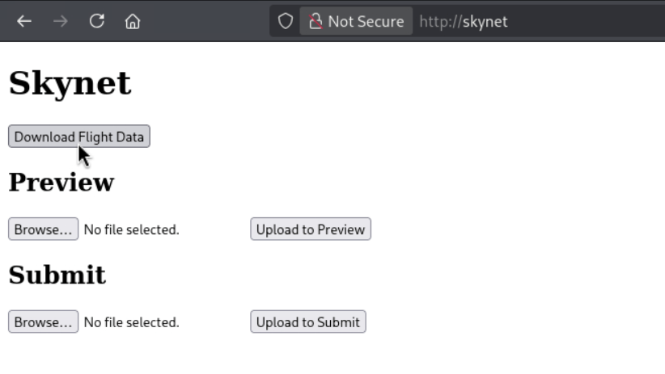
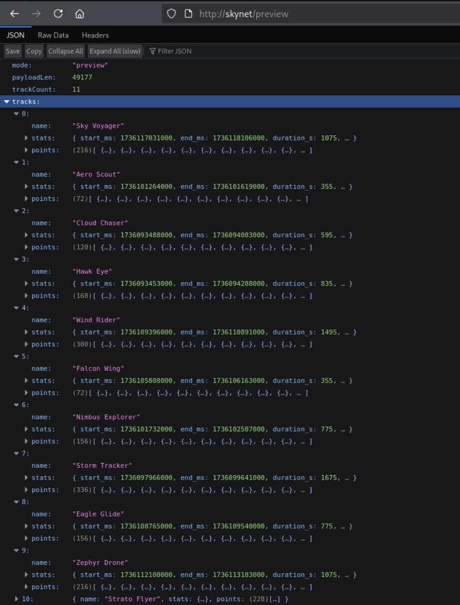
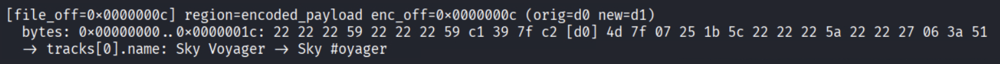
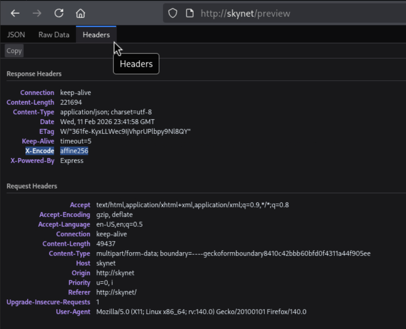
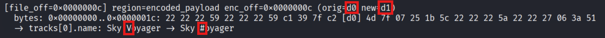
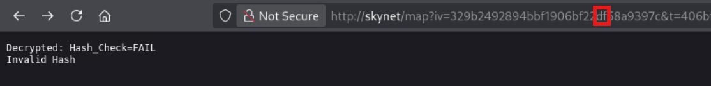
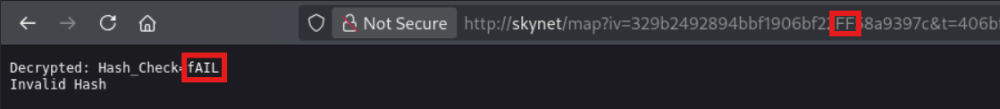
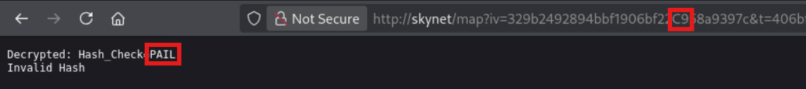
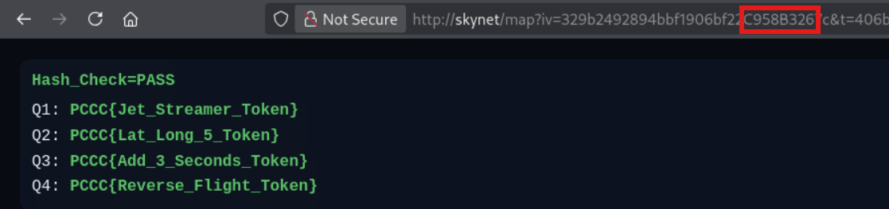

# Skynet

*Solution Guide*

**Challenge Name:** Skynet
**Total Points:** 3195
**Tokens:** 4
**Difficulty:** Hard

Competitors must download and reverse-engineer a custom binary file containing drone flight path data. The binary is encoded with an affine cipher (mod 256). After decoding the format, competitors answer four geospatial analysis questions by modifying specific fields in the binary, re-encoding, and submitting. The server validates the modifications but rejects them with a MAC check, requiring competitors to perform a CBC IV bitflip attack to bypass the hash verification and reveal the tokens.

---

## Getting Started

Browse to `http://skynet` from the Kali machine and download the flight data file `coords.bin`.



The web application exposes three endpoints that are relevant to the challenge:

- `/uploads/coords.bin` — download the original binary flight data
- `/preview` — upload a binary and receive decoded JSON showing all drone tracks
- `/submit` — upload a modified binary for grading; redirects to `/map` with an encrypted token

---

## Phase 1 — Understanding the Binary Format

### Step 1: Preview the data

Upload `coords.bin` to the `/preview` endpoint using the form on the landing page. This decodes the binary and returns a JSON representation of all drone tracks, including names, timestamps, latitudes, and longitudes.



The preview response includes a `trackCount` field (the total number of drones) and an array of `tracks`, each containing a `name`, `stats` (flight start/end times and duration), and an array of `points` with `t_ms` (timestamp in milliseconds), `lat`, and `lon` fields.

### Step 2: Discover the data structure through fuzzing

To modify specific fields in the binary, we need to understand which byte offsets correspond to which data fields. We can do this by systematically mutating one byte at a time in `coords.bin`, uploading each mutated version to `/preview`, and comparing the output to the baseline.

The following script automates this process. It XORs each byte in the encoded payload with `0x01`, uploads the result, and reports any differences in the decoded output:

```python
#!/usr/bin/env python3

# fuzz_preview.py
# Systematically mutate bytes in coords.bin to map byte offsets to data fields.
# Usage: python3 fuzz_preview.py [--base-url http://skynet] [--file coords.bin]
#
# This script will take approximately 10-20 minutes to run depending on file size.

import argparse
import json
import struct
import sys
import requests

MAC_LEN = 32
LEN_LEN = 4

def split_wrapped(file_bytes: bytes):
    if len(file_bytes) < MAC_LEN + LEN_LEN:
        raise ValueError("file too small")
    mac = file_bytes[-MAC_LEN:]
    payload_len = struct.unpack(">I", file_bytes[-(MAC_LEN+LEN_LEN):-MAC_LEN])[0]
    enc = file_bytes[:-(MAC_LEN+LEN_LEN)]
    return enc, payload_len, mac

def region_of_offset(file_len: int, off: int) -> str:
    if off < file_len - (MAC_LEN + LEN_LEN):
        return "encoded_payload"
    if off < file_len - MAC_LEN:
        return "payload_len_field"
    return "mac_field"

def hexdump_window(buf: bytes, off: int, radius: int = 16) -> str:
    start = max(0, off - radius)
    end = min(len(buf), off + radius + 1)
    chunk = buf[start:end]
    rel = off - start
    parts = []
    for i, b in enumerate(chunk):
        s = f"{b:02x}"
        if i == rel:
            s = f"[{s}]"
        parts.append(s)
    return f"0x{start:08x}..0x{end-1:08x}: " + " ".join(parts)

def summarize(preview_json: dict) -> dict:
    out = {
        "trackCount": preview_json.get("trackCount"),
        "payloadLen": preview_json.get("payloadLen"),
        "tracks": []
    }
    for t in preview_json.get("tracks", []):
        pts = t.get("points", [])
        out["tracks"].append({
            "name": t.get("name"),
            "pointCount": len(pts),
            "start": pts[0].get("t_iso") if pts else None,
            "end": pts[-1].get("t_iso") if pts else None,
        })
    return out

def diff_summary(a: dict, b: dict) -> list[str]:
    diffs = []
    if a.get("trackCount") != b.get("trackCount"):
        diffs.append(f"trackCount: {a.get('trackCount')} -> {b.get('trackCount')}")
    if a.get("payloadLen") != b.get("payloadLen"):
        diffs.append(f"payloadLen: {a.get('payloadLen')} -> {b.get('payloadLen')}")

    ta = a.get("tracks", [])
    tb = b.get("tracks", [])
    if len(ta) != len(tb):
        diffs.append(f"tracks length: {len(ta)} -> {len(tb)}")

    n = min(len(ta), len(tb))
    for i in range(n):
        if ta[i]["name"] != tb[i]["name"]:
            diffs.append(f"tracks[{i}].name: {ta[i]['name']} -> {tb[i]['name']}")
        if ta[i]["pointCount"] != tb[i]["pointCount"]:
            diffs.append(f"tracks[{i}].pointCount: {ta[i]['pointCount']} -> {tb[i]['pointCount']}")
        if ta[i]["start"] != tb[i]["start"]:
            diffs.append(f"tracks[{i}].start: {ta[i]['start']} -> {tb[i]['start']}")
        if ta[i]["end"] != tb[i]["end"]:
            diffs.append(f"tracks[{i}].end: {ta[i]['end']} -> {tb[i]['end']}")
    return diffs

def preview(base_url: str, file_bytes: bytes) -> dict:
    r = requests.post(
        f"{base_url}/preview",
        files={"file": ("coords.bin", file_bytes, "application/octet-stream")},
        timeout=30,
    )
    try:
        return r.json()
    except Exception:
        return {"error": "BAD_JSON", "status": r.status_code, "text": r.text[:5000]}

def main():
    ap = argparse.ArgumentParser()
    ap.add_argument("--base-url", default="http://skynet")
    ap.add_argument("--file", default="coords.bin")
    ap.add_argument("--start", type=lambda x: int(x, 0), default=0, help="start offset into encoded payload")
    ap.add_argument("--end", type=lambda x: int(x, 0), default=None, help="end offset into encoded payload (exclusive)")
    ap.add_argument("--step", type=int, default=1)
    ap.add_argument("--xor", type=lambda x: int(x, 0), default=0x01)
    ap.add_argument("--limit", type=int, default=0, help="stop after N hits (0 = no limit)")
    args = ap.parse_args()

    original = open(args.file, "rb").read()
    enc, payload_len, mac = split_wrapped(original)
    encoded_len = len(enc)

    start = max(0, args.start)
    end = encoded_len if args.end is None else min(args.end, encoded_len)

    print(f"[i] file_len={len(original)} encoded_len={encoded_len} payload_len={payload_len} footer=36")
    print(f"[i] fuzz range in encoded payload: 0x{start:x}..0x{end:x} step={args.step} xor=0x{args.xor:02x}")

    base_resp = preview(args.base_url, original)
    if "error" in base_resp:
        print("Baseline preview error:", base_resp, file=sys.stderr)
        sys.exit(1)
    base_sum = summarize(base_resp)

    hits = 0
    for off_in_enc in range(start, end, args.step):
        mutated = bytearray(original)
        file_off = off_in_enc
        mutated[file_off] ^= args.xor

        resp = preview(args.base_url, bytes(mutated))
        if "error" in resp:
            continue

        new_sum = summarize(resp)
        diffs = diff_summary(base_sum, new_sum)
        if not diffs:
            continue

        hits += 1
        reg = region_of_offset(len(original), file_off)
        print(f"\n[file_off=0x{file_off:08x}] region={reg} enc_off=0x{off_in_enc:08x} (orig={original[file_off]:02x} new={mutated[file_off]:02x})")
        print("  bytes:", hexdump_window(original, file_off, radius=16))
        for d in diffs:
            print("  ->", d)

        if args.limit and hits >= args.limit:
            break

if __name__ == "__main__":
    main()
```

Run the fuzzer and save the output:

```bash
python3 fuzz_preview.py > out.txt
```

This will take approximately 10–20 minutes. When complete, examine `out.txt`. Each hit shows which byte offset affected which field in the decoded output (drone name, latitude, longitude, timestamp, etc.).



The binary format (after decoding) follows this structure:

| Field | Size | Encoding |
|-------|------|----------|
| Track Count | 4 bytes | UInt32BE |
| *Per track:* | | |
| Name Length | 4 bytes | UInt32BE |
| Name | N bytes | UTF-8 |
| Point Count | 4 bytes | UInt32BE |
| *Per point:* | | |
| Timestamp | 8 bytes | BigUInt64BE (milliseconds since epoch) |
| Latitude | 8 bytes | DoubleBE |
| Longitude | 8 bytes | DoubleBE |

The file is structured as: `[encoded_payload][payload_length (4 bytes)][MAC (32 bytes)]`. The last 36 bytes are a footer containing the payload length and a SHA-256 MAC. The encoded payload is the data above, transformed through an encoding layer.

---

## Phase 2 — Cracking the Encoding

### Step 3: Identify the cipher

Inspect the HTTP response headers from any request to the Skynet server. Both the main page and the `/uploads/coords.bin` download include a custom header:

```text
X-Encode: affine256
```



This header is also present as a `<meta name="encode" content="affine256">` tag in the page HTML.

### Step 4: Understand the affine cipher

An affine cipher encrypts each byte independently using the formula:

```Text
ciphertext = (a * plaintext + b) mod m
```

The name `affine256` tells us that `m = 256`, meaning the cipher operates on full bytes (values 0x00–0xFF) rather than the traditional alphabet of 26 letters.

To decode, we need the inverse formula:

```Text
plaintext = a_inv * (ciphertext - b) mod 256
```

where `a_inv` is the modular multiplicative inverse of `a` modulo 256.

### Step 5: Recover the keys

We can recover `a` and `b` if we have two known plaintext–ciphertext pairs. From the fuzz output (Phase 1), we can correlate specific bytes in `coords.bin` with their decoded plaintext values from the preview JSON.

For example, if we know a drone name contains the character `V` (hex `0x56`) and the corresponding byte in `coords.bin` is `0xd0`, that gives us one pair: `c1 = 0xd0`, `p1 = 0x56`. If another character `#` (hex `0x23`) maps to `0xd1`, that gives us: `c2 = 0xd1`, `p2 = 0x23`.



Using two pairs, we solve the system of equations:

```Text
c1 = a * p1 + b  (mod 256)
c2 = a * p2 + b  (mod 256)
```

Subtracting eliminates `b`:

```Text
c2 - c1 = a * (p2 - p1)  (mod 256)
```

Therefore:

```Text
a = (c2 - c1) * (p2 - p1)^(-1)  (mod 256)
```

And once `a` is known:

```Text
b = c1 - a * p1  (mod 256)
```

The following script computes `a` and `b` from two ciphertext/plaintext pairs:

```python
#!/usr/bin/env python3

# affine_keys.py
# Recover affine cipher keys (a, b) from two known plaintext/ciphertext pairs.
# Usage: python3 affine_keys.py <c1> <c2> <p1> <p2>
#   Arguments accept hex (0xNN) or decimal.

import sys

MOD = 256

def parse(x):
    return int(x, 0)

def modinv(a, m):
    try:
        return pow(a, -1, m)
    except ValueError:
        return None

def main():
    if len(sys.argv) != 5:
        print("Usage: ./affine_keys.py c1 c2 p1 p2")
        print("c = ciphertext byte, p = plaintext byte")
        sys.exit(1)

    c1 = parse(sys.argv[1])
    c2 = parse(sys.argv[2])
    p1 = parse(sys.argv[3])
    p2 = parse(sys.argv[4])

    dp = (p2 - p1) % MOD
    dc = (c2 - c1) % MOD

    inv_dp = modinv(dp, MOD)
    if inv_dp is None:
        print("Error: dp has no inverse mod 256 (must be odd).")
        sys.exit(1)

    a = (dc * inv_dp) % MOD
    print(f"a = {a} (0x{a:02x})")

    a_inv = modinv(a, MOD)
    if a_inv is None:
        print("Error: a has no inverse mod 256 (invalid affine multiplier).")
        sys.exit(1)

    b = (c1 - a * p1) % MOD
    print(f"b = {b} (0x{b:02x})")

if __name__ == "__main__":
    main()
```

Run it with the pairs identified above:

```bash
python3 affine_keys.py 0xd0 0xd1 0x56 0x23
```

")

The output reveals the cipher parameters: **a = 5**, **b = 34 (0x22)**. The modular inverse of 5 mod 256 is **205 (0xcd)**.

With these values we can freely decode and re-encode any byte in the binary:

- Decode: `plaintext = (205 * (ciphertext - 34)) mod 256`
- Encode: `ciphertext = (5 * plaintext + 34) mod 256`

---

## Phase 3 — Answering the Questions

Now that we can decode and re-encode the binary, we need to parse the plaintext payload, identify the correct drones for each question, apply the required modifications, re-encode, and reassemble the file.

The following script (`solve.py`) does all of this in one pass. Each question is addressed in a dedicated section below, and the full script is provided at the end.

### Token 1 — Rename the Last Alphabetical Drone (798 pts)

**Objective:** Sort the drone names from A to Z and find the last drone in the list. Change this drone's name to `Jet Streamer`.

**Approach:**

1. Decode the binary and parse all track names from the payload.
2. Sort the names alphabetically. The 11 drones in alphabetical order are: Aero Scout, Cloud Chaser, Eagle Glide, Falcon Wing, Hawk Eye, Nimbus Explorer, Sky Voyager, Storm Tracker, Strato Flyer, Wind Rider, Zephyr Drone.
3. The last name alphabetically is **Zephyr Drone**.
4. Replace the name bytes with `Jet Streamer` in the parsed data. Both names are 12 characters in UTF-8, so the payload length is preserved — this is critical because the file footer contains a fixed payload length field.
5. Re-encode and write the modified binary.

**Key constraint:** The replacement name must have the same byte length as the original. `Zephyr Drone` and `Jet Streamer` are both 12 bytes in UTF-8, so this works. If they differed, the payload length would change and the server would reject the submission.

### Token 2 — Shift the Non-US Drone's Coordinates (798 pts)

**Objective:** Find the only drone that is not located within the US. Reduce the latitude and longitude of each coordinate on the flight path by `5`.

**Approach:**

1. From the preview data, examine the starting coordinates of each drone. Most drones operate within the continental US (roughly lat 24–49, lon -125 to -66) or Alaska (lat 51–72, lon -170 to -129).
2. One drone — **Cloud Chaser** — starts near latitude 43.7, longitude -79.4. These coordinates correspond to **Toronto, Canada**, which is north of the US border despite being within the latitude range of CONUS. The Toronto area (approximately lat 43.4–44.1, lon -80.2 to -78.5) falls outside US territory.
3. For every point in Cloud Chaser's flight path, subtract 5.0 from both the latitude and the longitude. Timestamps remain unchanged.

**Key detail:** The subtraction must be applied to every coordinate in the flight path, not just the first point.

### Token 3 — Extend the Longest Flight Time (798 pts)

**Objective:** Find the drone with the longest flight time. Add `3` seconds to the flight time between each coordinate in the drone's flight path.

**Approach:**

1. Calculate the flight duration for each drone as: `last_timestamp - first_timestamp`.
2. The drone with the longest flight time is **Storm Tracker**, which has a flight duration of approximately 28 minutes (1680 seconds). This is the longest because its duration parameter is explicitly set to 28 minutes in the data generation, while most other drones have shorter random durations.
3. The modification adds 3 seconds (3000 milliseconds) to the interval between each pair of consecutive points, applied cumulatively. This means point 0 keeps its original timestamp, point 1 gets +3000ms, point 2 gets +6000ms, point 3 gets +9000ms, and so on. Formally: `new_timestamp[i] = original_timestamp[i] + (i * 3000)`.

**Key detail:** The 3-second addition is cumulative per segment. Point `i` is shifted by `i * 3000` milliseconds relative to its original value. Latitude and longitude remain unchanged.

### Token 4 — Reverse the Longest Flight Path (801 pts)

**Objective:** Find the drone with the longest flight path. Reverse the flight path so the last point on the flight path becomes the first point and vice versa.

**Approach:**

1. Calculate the total path distance for each drone by summing the haversine distances between consecutive points.
2. The drone with the longest total flight path is **Wind Rider**, which has a high speed (13 m/s) and a 25-minute duration, resulting in approximately 19,500 meters of travel.
3. Reverse only the spatial coordinates (latitude and longitude), keeping the timestamps in their original ascending order. The first point's coordinates become the last, the last become the first, and so on — but each point retains its original timestamp.

**Key detail:** Only the lat/lon pairs are reversed. The timestamps stay in their original order. If the timestamps were also reversed, they would be in descending order and the server would not grade the submission correctly.

### Combined Solver Script

The following script applies all four modifications and produces `coords_mod.bin`:

```python
#!/usr/bin/env python3

# solve.py
# Decodes coords.bin, applies all four required modifications, and produces
# coords_mod.bin ready for submission to the /submit endpoint.
#
# Prerequisites: coords.bin in the current directory (downloaded from http://skynet)
# Output: coords_mod.bin
#
# Affine cipher parameters (recovered via affine_keys.py):
#   a = 5, b = 34 (0x22), a_inv = 205, mod = 256

import struct
import math

# ---- Affine256 params ----
A = 5
B = 34  # 0x22
A_INV = 205
MOD = 256

INFILE = 'coords.bin'
OUTFILE = 'coords_mod.bin'

FOOTER_LEN = 36  # 4 bytes payload_len + 32 bytes mac (preserved)

def affine_decode(buf: bytes) -> bytes:
    out = bytearray(len(buf))
    for i, c in enumerate(buf):
        out[i] = (A_INV * ((c - B) & 0xFF)) & 0xFF
    return bytes(out)

def affine_encode(buf: bytes) -> bytes:
    out = bytearray(len(buf))
    for i, p in enumerate(buf):
        out[i] = (A * p + B) & 0xFF
    return bytes(out)

# ---- Binary parsing/serialization ----
def parse_payload(payload: bytes):
    off = 0
    def need(n):
        if off + n > len(payload):
            raise ValueError(f"parse past end at 0x{off:x}, need {n}")

    need(4)
    track_count = struct.unpack_from(">I", payload, off)[0]
    off += 4

    tracks = []
    for _ in range(track_count):
        need(4)
        name_len = struct.unpack_from(">I", payload, off)[0]
        off += 4

        need(name_len)
        name = payload[off:off+name_len].decode("utf-8", errors="strict")
        off += name_len

        need(4)
        point_count = struct.unpack_from(">I", payload, off)[0]
        off += 4

        points = []
        for __ in range(point_count):
            need(24)
            t_ms = struct.unpack_from(">Q", payload, off)[0]; off += 8
            lat  = struct.unpack_from(">d", payload, off)[0]; off += 8
            lon  = struct.unpack_from(">d", payload, off)[0]; off += 8
            points.append([t_ms, lat, lon])

        tracks.append({"name": name, "points": points})

    return track_count, tracks, off

def serialize_payload(tracks):
    chunks = []
    chunks.append(struct.pack(">I", len(tracks)))
    for tr in tracks:
        name_bytes = tr["name"].encode("utf-8")
        chunks.append(struct.pack(">I", len(name_bytes)))
        chunks.append(name_bytes)
        pts = tr["points"]
        chunks.append(struct.pack(">I", len(pts)))
        for (t_ms, lat, lon) in pts:
            chunks.append(struct.pack(">Q", int(t_ms)))
            chunks.append(struct.pack(">d", float(lat)))
            chunks.append(struct.pack(">d", float(lon)))
    return b"".join(chunks)

# ---- Geospatial helpers ----
def haversine_m(lat1, lon1, lat2, lon2):
    R = 6371000.0
    p1 = math.radians(lat1)
    p2 = math.radians(lat2)
    dphi = math.radians(lat2 - lat1)
    dlmb = math.radians(lon2 - lon1)
    a = math.sin(dphi/2)**2 + math.cos(p1)*math.cos(p2)*math.sin(dlmb/2)**2
    return 2*R*math.asin(math.sqrt(a))

def total_path_m(points):
    if len(points) < 2:
        return 0.0
    total = 0.0
    for i in range(1, len(points)):
        _, lat1, lon1 = points[i-1]
        _, lat2, lon2 = points[i]
        total += haversine_m(lat1, lon1, lat2, lon2)
    return total

def duration_ms(points):
    if len(points) < 2:
        return 0
    return int(points[-1][0]) - int(points[0][0])

def in_us_rough(lat, lon):
    # Exclude the Toronto area (Canadian territory near the border)
    if 43.0 <= lat <= 44.5 and -80.5 <= lon <= -78.0:
        return False
    # CONUS
    if 24.0 <= lat <= 49.5 and -125.0 <= lon <= -66.0:
        return True
    # Alaska
    if 51.0 <= lat <= 72.0 and -170.0 <= lon <= -129.0:
        return True
    return False

def track_is_in_us(tr):
    pts = tr["points"]
    if not pts:
        return True
    _, lat, lon = pts[0]
    return in_us_rough(lat, lon)

# ---- Apply all four modifications ----
def apply_mods(tracks):
    # Q1: Rename last alphabetical drone to "Jet Streamer"
    names_sorted = sorted([t["name"] for t in tracks])
    last_name = names_sorted[-1]
    for t in tracks:
        if t["name"] == last_name:
            t["name"] = "Jet Streamer"
            break

    # Q2: Non-US drone — reduce lat/lon by 5 for each point
    non_us = [t for t in tracks if not track_is_in_us(t)]
    if len(non_us) != 1:
        raise ValueError(f"expected exactly 1 non-US drone, found {len(non_us)}")
    t2 = non_us[0]
    for p in t2["points"]:
        p[1] -= 5.0  # lat
        p[2] -= 5.0  # lon

    # Q3: Longest flight time — add 3s between each coordinate (cumulative)
    t3 = max(tracks, key=lambda t: duration_ms(t["points"]))
    pts = t3["points"]
    if len(pts) >= 2:
        new_pts = [pts[0][:]]
        for i in range(1, len(pts)):
            prev_t = new_pts[i-1][0]
            orig_dt = int(pts[i][0]) - int(pts[i-1][0])
            new_t = int(prev_t) + int(orig_dt) + 3000
            new_pts.append([new_t, pts[i][1], pts[i][2]])
        t3["points"] = new_pts

    # Q4: Longest flight path — reverse lat/lon order, keep timestamps
    t4 = max(tracks, key=lambda t: total_path_m(t["points"]))
    pts = t4["points"]
    if len(pts) >= 2:
        times = [p[0] for p in pts]
        coords = [(p[1], p[2]) for p in pts]
        coords.reverse()
        t4["points"] = [[times[i], coords[i][0], coords[i][1]] for i in range(len(pts))]

    return last_name, t2["name"], t3["name"], t4["name"]

def main():
    raw = open(INFILE, "rb").read()
    if len(raw) < FOOTER_LEN:
        raise SystemExit("file too small")

    encoded = raw[:-FOOTER_LEN]
    footer = raw[-FOOTER_LEN:]  # preserved exactly (payload_len + mac)

    decoded = affine_decode(encoded)
    track_count, tracks, consumed = parse_payload(decoded)
    original_payload = decoded[:consumed]

    last_name, non_us_name, longest_time_name, longest_path_name = apply_mods(tracks)

    new_payload = serialize_payload(tracks)

    if len(new_payload) != len(original_payload):
        raise SystemExit(
            "Refusing to write output: payload length changed.\n"
            f"original payload bytes: {len(original_payload)}\n"
            f"new payload bytes:      {len(new_payload)}\n"
            "This usually means you changed a string to a different byte length.\n"
            "Use same-length replacements (e.g., rename to same UTF-8 length)."
        )

    decoded2 = new_payload + decoded[consumed:]
    encoded2 = affine_encode(decoded2)
    out = encoded2 + footer

    open(OUTFILE, "wb").write(out)

    print("[OK] wrote:", OUTFILE)
    print("Q1 last alpha drone:", last_name, "-> renamed to Jet Streamer")
    print("Q2 non-US drone:", non_us_name, "-> lat/lon -5 applied")
    print("Q3 longest time drone:", longest_time_name, "-> +3s per segment applied")
    print("Q4 longest path drone:", longest_path_name, "-> points reversed")

if __name__ == "__main__":
    main()
```

Run the solver:

```bash
python3 solve.py
```

Expected output:

```bash
[OK] wrote: coords_mod.bin
Q1 last alpha drone: Zephyr Drone -> renamed to Jet Streamer
Q2 non-US drone: Cloud Chaser -> lat/lon -5 applied
Q3 longest time drone: Storm Tracker -> +3s per segment applied
Q4 longest path drone: Wind Rider -> points reversed
```

---

## Phase 4 — Bypassing the Hash Check (CBC IV Bitflip)

### Step 6: Submit the modified binary

Upload `coords_mod.bin` to the `/submit` endpoint. The server will redirect to `/map` with an encrypted token in the URL. However, because we modified the payload without knowing the MAC secret, the MAC no longer matches. The page will display:

```bash
Decrypted: Hash_Check=FAIL
Invalid Hash
```



### Step 7: Understand the token structure

The URL contains two hex parameters: `iv` and `t`. These are the initialization vector and ciphertext of an AES-128-CBC encrypted token. The decrypted plaintext has the structure:

```bash
Hash_Check=FAIL id=<submission_id>;
```

The server decrypts this token, checks the first 16 bytes for `Hash_Check=PASS`, and only reveals the grading results if the check passes. Crucially, the CBC encryption has **no integrity protection** (no HMAC), which makes it vulnerable to an IV bitflip attack.

### Step 8: Perform the IV bitflip

In AES-CBC, the first block of plaintext is computed as `AES_decrypt(ciphertext_block_0) XOR IV`. This means flipping a bit in the IV flips the corresponding bit in the decrypted first block, without affecting subsequent blocks.

The first 16 bytes of plaintext are `Hash_Check=FAIL ` (with a trailing space). We need to change `FAIL` to `PASS` — that's four bytes at positions 11, 12, 13, and 14 in the plaintext.

For each byte position, the process is:

1. Note the current IV byte at that position (call it `iv_byte`).
2. Determine the XOR key: `key = iv_byte XOR current_plaintext_char`.
3. Compute the replacement: `new_iv_byte = key XOR desired_plaintext_char`.

**Worked example — changing `F` to `P` (position 11):**

The ASCII values are: `F` = 0x46, `P` = 0x50.

1. Read the current IV byte at position 11 from the URL. Suppose it is `0xDF`.
2. Compute the XOR key: `0xDF XOR 0x46 = 0x99`.
3. Compute the new IV byte: `0x99 XOR 0x50 = 0xC9`.
4. Replace the two hex characters at position 11 in the `iv` URL parameter (characters 22–23 in the hex string) with `C9`.



After replacing only the byte for `F` → `P`, the page shows `PAIL`:



**Complete the remaining substitutions:**

| Position | Original char | Target char | Original hex | Target hex | Formula |
|----------|--------------|-------------|-------------|------------|---------|
| 11 | `F` (0x46) | `P` (0x50) | iv[11] | `(iv[11] XOR 0x46) XOR 0x50` | XOR with 0x16 |
| 12 | `A` (0x41) | `A` (0x41) | iv[12] | No change needed | — |
| 13 | `I` (0x49) | `S` (0x53) | iv[13] | `(iv[13] XOR 0x49) XOR 0x53` | XOR with 0x1A |
| 14 | `L` (0x4C) | `S` (0x53) | iv[14] | `(iv[14] XOR 0x4C) XOR 0x53` | XOR with 0x1F |

Note that `A` → `A` requires no change. For each of the other three positions, read the current IV byte from the URL, XOR it with the corresponding value in the Formula column, and substitute the result back into the URL.

After modifying all necessary IV bytes, reload the page.

### Step 9: Retrieve the tokens

The server now sees `Hash_Check=PASS` and displays the grading results with tokens for each correctly answered question.



If any question's modification was incorrect, that token will show as "incorrect" in red instead of the flag value. All four tokens should display in green if the `solve.py` script ran correctly.
