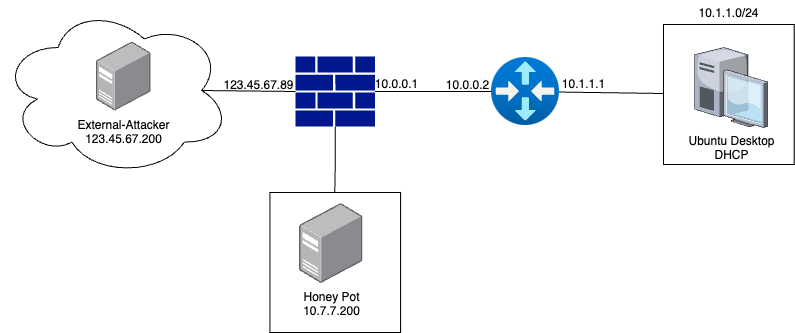
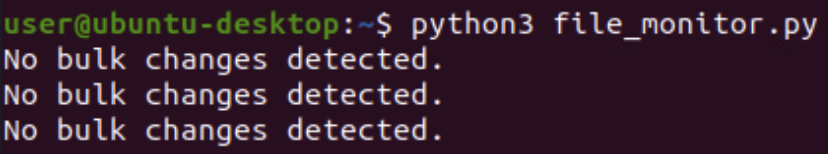
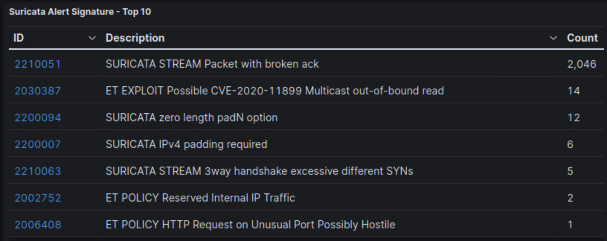

# Automated Defenses

Automated defense incorporates proactive automated response to threats and events. Where traditional security tools such as firewalls, anti-virus, or host/network IPS are more preventative, automated defense strategies are more reactive, but without requiring direct human interaction.

In this lab, you will step through a simulated Endpoint Detection and Response (EDR) process, perform network throttling and denial-of-service blocks on a firewall, and review attacker behaviors on a honeypot.

The <a href="https://www.cisa.gov/topics/cybersecurity-best-practices/executive-order-improving-nations-cybersecurity" target="_blank">Executive Order on Improving the Nation's Cybersecurity</a> calls upon the use of EDR tools to better protect data. Countermeasures to help combat ransomware include removing systems from the network whenever a compromise is detected.

<a href="https://www.cisa.gov/news-events/news/understanding-denial-service-attacks" target="_blank">Denial-of-Service attacks</a> are also a threat to all organizations with public-facing services. DoS mitigations, such as rate-limiting and traffic reduction, are covered in this guide on <a href="https://www.cisa.gov/sites/default/files/2024-03/understanding-and-responding-to-distributed-denial-of-service-attacks_508c.pdf" target="_blank">Understanding and Responding to Distributed Denial-of-Service Attacks</a>

<a href="https://www.cisa.gov/sites/default/files/2024-08/Federal_Government_Cybersecurity_Incident_and_Vulnerability_Response_Playbooks_508C.pdf" target="_blank">CISA's Cybersecurity Incident & Vulnerability Response Playbooks</a> recommends the use of honeypots to detect attempted exploitations as a measure of active defense.

| &#9201; LAB TIME |
|---|
| This lab is expected to take one 90 minutes. |

*Please consider filling out the lab feedback survey at the bottom of your screen. The survey is available to you at any time while conducting the lab.*

| &#9888; CAUTION |
|---|
| You must complete *all*  phases of the lab and complete the mini-challenge to receive your completion certificate. We encourage you to attempt mini-challenges on your own, but links to the solution guides are available in the Mini-Challenge section of the lab document if you need them. |

## Learning Objectives

 - Understand Endpoint Detection and Response techniques
 - Apply and evaluate Endpoint Detection and Response processes
 - Understand network traffic throttling and queue management
 - Demonstrate network throttling and queue management processes
 - Understand denial-of-service type attacks
 - Apply intrusion prevention rules to block denial-of-service type attacks
 - Understand honeypots
 - Analyze and categorize attacker behaviors against honeypot systems

## Learner Expectations

 - Learners should be comfortable with command-line operations and Secure Shell connections
 - Learners should be comfortable with administrative webGUIs

## FOCAL and NICE Framework Mappings

This lab maps with <a href="https://www.cisa.gov/resources-tools/resources/federal-civilian-executive-branch-fceb-operational-cybersecurity-alignment-focal-plan" target="_blank">Federal Civilian Executive Branch (FCEB) Operational Cybersecurity Alignment (FOCAL)</a> area 2 (Vulnerability Management) and 5 (Incident Response and Detection) by managing and reducing vulnerabilities and by introducing proactive incident response strategies. 

**NICE Work Role**

- <a href="https://niccs.cisa.gov/workforce-development/nice-framework" target="_blank">Incident Response, Defensive Cybersecurity</a>

**NICE Tasks**

- <a href="https://niccs.cisa.gov/workforce-development/nice-framework" target="_blank">T1260</a>: Perform real-time cyber defense incident handling
- <a href="https://niccs.cisa.gov/workforce-development/nice-framework" target="_blank">T1299</a>: Determine causes of network alerts
- <a href="https://niccs.cisa.gov/workforce-development/nice-framework" target="_blank">T1347</a>: Detect cybersecurity attacks and intrusions
- <a href="https://niccs.cisa.gov/workforce-development/nice-framework" target="_blank">T1348</a>: Distinguish between benign and potentially malicious cybersecurity attacks and intrusions
- <a href="https://niccs.cisa.gov/workforce-development/nice-framework" target="_blank">T1371</a>: Mitigate potential cyber defense incidents
- <a href="https://niccs.cisa.gov/workforce-development/nice-framework" target="_blank">T1406</a>: Construct cyber defense network tool signatures

<!-- cut -->

# Scenario

The lab environment consists of a small network of systems. A single Ubuntu client will serve to demonstrate Endpoint Detection and Response techniques and will act as your main desktop system for the lab. Additionally, you will leverage an external-attacker Kali Linux system to conduct test attacks against the firewall. The firewall protects the network and performs port forwarding to a variety of fake services on the honeypot system in a demilitarized zone (DMZ). Port-forwarding ensures that only a single address is exposed externally, yet internal services are made available to the public. The honeypot system includes several services used in the lab - such as email, SSH, and web services - that will be targeted by attackers. 



## System Tools and Credentials

| system | OS type/link |  username | password |
|--------|---------|-----------|----------|
| Ubuntu Desktop | Ubuntu |user | tartans|
| External-Attacker | Kali Linux | user | tartans |
| pfSense Administrative WebGUI | `https://pfsense.skills.hub` | user | tartans |
| T-Pot web tools |  `https://10.7.7.200:64297/` | web-user | tartans |

## Phase 1: Detecting Ransomware and Restoring Your Data

Endpoint Detection and Response (EDR) is intended to act without a user's involvement to monitor and protect endpoint devices against potential threats that include reconnaissance attempts, compromised accounts, ransomware, and other malware threats. EDR technologies and process can take actions to lock accounts, recover data, or remove a system from the network until triage and analysis can be performed.

In this phase, you will create a simulated EDR process that monitors for bulk file integrity changes, indicating potential ransomware, and then restores the data while taking the system offline until further response can be conducted.

<details>
<summary>
<h3>Complete Initial EDR Setup</h3>
</summary>
<p>

1. Open the `Ubuntu-Desktop` console and login with student | tartans, if not automatically logged in.

2. (**Ubuntu-Desktop**) Open Firefox and browse to the Skills Hub Hosted Files page at `https://skills.hub/lab/files` (`https://10.5.5.5/lab/files`).

*Note: The Skills Hub website takes roughly 5 minutes before it is available after starting the lab. This ensures the lab is properly configured before beginning.*


3. (**Ubuntu-Desktop, Firefox**) Download the zip file named `EDR-Files.zip`. The default download location of /home/user/Downloads is assumed in the next step. You can ignore the `emailer.sh` script for now.

You may minimize the browser for the time being.

4. (**Ubuntu-Desktop**) Open a Terminal from the shortcut on the left side of the screen.


5. (**Ubuntu-Desktop, Terminal**) Extract the contents of the zip file to the home folder with the following command:

```
unzip /home/user/Downloads/EDR-Files.zip -d ~/
```

Leave the Terminal window open, as you will use it again in later steps.

6. (**Ubuntu-Desktop**) Open the `user` folder from the Desktop shortcut. You should see the following files.


7. (**Ubuntu-Desktop**)Take inventory of the various items necessary for this phase of the lab:

 - A set of data files - three(3) text files and three(3) images - that will be monitored for integrity changes on the system.
 - A file_hashes.txt file that contains the initial MD5 hash values of the above six(6) files
 - A file_monitor.py script that will check for bulk file changes, indicating potential ransomware
 - An encryptor.py script that will be used to simulate ransomware

8. (**Ubuntu-Desktop**) Copy the three(3) text files and three(3) images to the Documents folder (but not the file_hashes.txt file). You may leave the scripts and file_hashes.txt file in the /home/user directory.

9. (**Ubuntu-Desktop, Terminal**) In the Terminal, create a backup directory and then mount the backup network share to the system with the following commands (enter the sudo password of `tartans` if prompted):

```
sudo mkdir /mnt/backup
sudo mount 10.5.5.5:/srv/nfs/backups /mnt/backup
```

This connects a network share on a remote server which hosts the backups to the files in the Documents folder. The share is linked to the directory at /mnt/backup. We will use this external backup share to restore our files should they become compromised.

10. (**Ubuntu-Desktop, Terminal**) You can verify the backup share is connected by running the following command:

```
ls /mnt/backup
```


You should see all six (6) files duplicated in the backup network share.

#### Grading Check

(**Ubuntu-Desktop, Firefox, New Tab**) To check your work, browse to the grading page at `https://skills.hub/lab/tasks` or `(https://10.5.5.5/lab/tasks)` from the Ubuntu-Desktop. Click the `Submit/Re-Grade Tasks` button to trigger the grading checks. Refresh the results after a few moments to see your results.

This first check will validate the network share has been mounted and ensure all files are in the proper location before moving on.


Grading Check 1: Successfully mount the backup network share and copy files to the Documents directory 
 - All six(6) text and image files were copied to the Documents directory
 - The backup network share was properly mounted

`Copy the token or flag string to the corresponding question submission field to receive credit.`

</p>
</details>

<details>
<summary>
<h3>Validate the EDR Script to Detect and Respond to Ransomware</h3>
</summary>
<p>

1. (**Ubuntu-Desktop**) First, review the contents of the file_monitor.py script by opening them in a text editor, such as Visual Studio code.

| &#128736; file_monitor.py |
|---|
|_You do not need to understand Python to walk through the script. The script has a few crucial functions. It maintains a dictionary of the current hashes of the files and the original file hashes found in file hashes text file. The script runs every 30 seconds, calculating the current hashes for every file in the monitored directory - /home/user/Documents. If the hashes have changed for every file within the monitored directory, the script invokes the restore data function. The restore function recovers the encrypted files from the backup share and moves the encrypted files to the 'bad' directory for later analysis. As a final precaution, the script removes the system from the network and locks out the current user. Otherwise, if the files remain unchanged, it continues checking every 30 seconds for changes._ |

<details>
<summary>
<h3>The full script can be viewed here:</h3>
</summary>
<p>

```
import os
import hashlib
import time
import subprocess
import shutil

MONITOR_DIR = "/home/user/Documents"
HASH_FILE = "/home/user/file_hashes.txt"

def calculate_file_hash(file_path):
    """Calculate the MD5 hash of a file."""
    hash_md5 = hashlib.md5()
    with open(file_path, "rb") as f:
        for chunk in iter(lambda: f.read(4096), b""):
            hash_md5.update(chunk)
    return hash_md5.hexdigest()

def get_directory_hashes():
    """Get a dictionary of file hashes for all files in the directory."""
    hashes = {}
    for root, _, files in os.walk(MONITOR_DIR):
        for name in files:
            file_path = os.path.join(root, name)
            hashes[file_path] = calculate_file_hash(file_path)
    return hashes

def load_previous_hashes():
    """Load previously saved hashes from the hash file."""
    if not os.path.exists(HASH_FILE):
        return {}
    with open(HASH_FILE, "r") as f:
        return dict(line.strip().split(" ", 1) for line in f)

def save_current_hashes(hashes):
    """Save the current file hashes to the hash file."""
    with open(HASH_FILE, "w") as f:
        for file_path, file_hash in hashes.items():
            f.write(f"{file_path} {file_hash}\n")

def restore_files():
    """Restore files after detecting a bulk change."""
    print("Creating 'bad' directory")
    bad_dir = "/home/user/bad"
    if not os.path.exists(bad_dir):
        os.makedirs(bad_dir)

    print("Copying encrypted files to 'bad' directory")
    for file in os.listdir(MONITOR_DIR):
        file_path = os.path.join(MONITOR_DIR, file)
        if os.path.isfile(file_path):
            shutil.copy(file_path, os.path.join(bad_dir, file))  # Copy the files to bad directory

    print("Restoring data from backups")
    backup_dir = "/mnt/backup"
    for file in os.listdir(backup_dir):
        backup_file_path = os.path.join(backup_dir, file)
        if os.path.isfile(backup_file_path):
            destination_file_path = os.path.join(MONITOR_DIR, file)
            try:
                # Use shutil.copy() to handle copying files from backup to monitor directory
                shutil.copy(backup_file_path, destination_file_path)
                print(f"Restored {file} from backup.")
            except Exception as e:
                print(f"Failed to restore {file}: {e}")

    print("Disabling network interface and locking session")
    try:
        subprocess.run(["sudo", "ip", "link", "set", "dev", "ens32", "down"], check=True)
        subprocess.run(["sudo", "loginctl", "lock-session"], check=True)
    except Exception as e:
        print(f"Failed to execute subprocess commands: {e}")

def detect_bulk_change():
    """Detect if every file's hash has changed."""
    previous_hashes = load_previous_hashes()
    current_hashes = get_directory_hashes()

    if not previous_hashes:
        print("No previous hashes found. Saving current state.")
        save_current_hashes(current_hashes)
        return

    changed_files = [file for file in current_hashes if file in previous_hashes and current_hashes[file] != previous_hashes[file]]
    if len(changed_files) == len(current_hashes) and len(changed_files) > 0:
        print("ALERT: Bulk file change detected!")
        restore_files()
        print("Exiting monitor mode. Please investigate files in the bad directory. System has been taken offline.")
        exit(0)
    else:
        print("No bulk changes detected.")

    save_current_hashes(current_hashes)

if __name__ == "__main__":
    while True:
        detect_bulk_change()
        time.sleep(30) 

```

</p>
</details>

2. (**Ubuntu-Desktop, Terminal**) Run the monitoring script by entering the following command:

```
sudo python3 file_monitor.py
```

The script will check the integrity of the files every 30 seconds and compare their current MD5 hashes to the hashes stored in the file_hashes.txt file.



| &#129513; HASHES |
|---|
|_File hashes are fixed-length strings generated by mathematical algorithms applied to the contents of a file or set of files. If the contents of a file change, even a single character, so will the file hash. File integrity hashes can be used to confirm that files have not been altered since the hash was generated. When something like ransomware encrypts data, it dramatically changes the file contents. Therefore, we can use bulk file integrity changes to detect possible ransomware attacks._ |

3. (**Ubuntu-Desktop, Documents Directory**) Test the script by altering one of the text files in the Documents directory. You may add any text you like through the default text editor. Make sure to save your changes.

4. (**Ubuntu-Desktop, Terminal**) Notice that the file monitor does not trigger a restoration because only one file has changed, which may be due to normal operations.

Image files, however, and other binary file types, are things we would not expect to change. Any file changes to these types of files in bulk might indicate that something malicious is occurring.

5. (**Ubuntu-Desktop, Terminal**) Keep the Terminal window running the file monitor script in view. In a new terminal window or tab, run the sample encryption script with the following command:

```
python3 encryptor.py
```

This will XOR each file in the Documents directory.


6. (**Ubuntu-Desktop, Terminal**) Within 30 seconds, you should see the file monitor's output change, indicating that bulk changes were made.


The follow-on commands will disable the network interface to ensure the system remains isolated until it can be investigated and locks out the current Gnome Desktop user.

7. (**Ubuntu-Desktop**) Log back into the system and review the Terminal message where the monitor script ended. Then, open the Documents directory after opening the user directory shortcut on the Desktop, if not already open.

8. (**Ubuntu-Desktop, Documents Directory**) Notice that the files in the Documents directory were restored from the backup and that the encrypted files were also moved to /home/user/bad for further investigation. The files may no longer show their respective thumbnail preview icons, and the text files will be illegible if you open them.


If, for some reason, there was a malfunction in the restoration script, you can repeat the process of unzipping the files and placing them in the Documents folder and try again.

| &#9888; Make sure to do the following step |
|---|

9. (**Ubuntu-Desktop**) Lastly, to restore network connectivity to run the grading checks and continue with the lab, enter the following command in the Terminal:

```
sudo ip link set dev ens32 up
```

This process emulates what some types of Endpoint Detection and Response tools can do to combat ransomware attempts. However, there are many caveats to this example that must be considered in a real-world scenario:

 - EDR tools themselves can be affected by the ransomware. EDR tools should be stored in protected areas of the filesystem. Generally, ransomware will encrypt user files in hopes of eliciting a ransom payment versus completely encrypting the entire system, which would preclude anyone from receiving the ransom message.
 - Triggers would need to account for daily operations on protected or monitored files/data. Hashes should be updated as files are updated and look more for bulk changes or changes that would indicate encryption versus normal user behaviors.
 - If the backed-up data is stored locally, then it could become a target for the ransomware as well. Backup data should always be stored somewhere else.

#### Grading Check

(**Ubuntu-Desktop, Firefox, New Tab**) To check your work, browse to the grading page at `https://skills.hub/lab/tasks` or `(https://10.5.5.5/lab/tasks)` from the Ubuntu-Desktop. Click the `Submit/Re-Grade Tasks` button to trigger the grading checks. Refresh the results after a few moments to see your results.

The second check will verify that you were able to achieve both results during your lab attempt.


Grading Check 2: Successfully restore encrypted data
 - Encrypted files were moved to the "bad" directory
 - Original files were restored from the backup network share

`Copy the token or flag strings to the corresponding question submission field to receive credit.`

`You should complete all phase 1 tasks before moving on to phase 2.`

</p>
</details>

## Phase 2: DoS/DDoS Mitigations with pfSense Firewall

<details>
<summary>
<h3>Throttling</h3>
</summary>
<p>

For this phase you will be swapping back and forth between the Ubuntu Desktop and an external Kali system to produce attacks on the firewall. Remember to check the context of each instruction before conducting each step.

1. Open the external-attacker console, which is a Kali Linux system.

2. (**External-Attacker, Terminal**) Open a Terminal and enter the following command to provide an IP address to the system:

```
sudo ifconfig eth0 123.45.67.201/24
```

If at any time the system loses its IP settings, you can rerun this command as needed.

3. (**External-Attacker**) Open Firefox from the Desktop shortcut and browse to `https://123.45.67.89:65000`, making sure to include the port number.

4. (**External-Attacker, Firefox**) Download the emailer.sh script found on the Hosted Files page. You will use this script later in the lab. For now you do not need to do anything further with it.


5. (**External-Attacker**) Open a Terminal using either the Desktop shortcut or the icon in the top menu bar.

6. (**External-Attacker, Terminal**) Next, you will run a load test against the website that is running on the honeypot server. This will serve as a test of the "normal" web traffic throughput for the firewall and the server. Run the following command in the Terminal:

```
ab -n 2500 -c 100 http://123.45.67.89/
```

*Note that you must include the trailing slash for the `ab` command to work.*

Here, "ab" stands for Apache Benchmarking tool, and the tool can be used by developers to help test their sites and web services. The command will send 2,500 web requests to the target URL using 100 concurrent threads. The output of the command will be a report on the statistics of the benchmark.

7. (**External-Attacker, Terminal**) You'll see progress noting every 250 requests (or 10% of the total) being handled. Once all 2500 requests are complete scroll up slightly and note the following information in the Terminal. Note that your data will differ slightly.


Note a few items in the screenshot above:

 - The total time needed to make all 2500 requests was roughly 50.5 seconds
 - The rate of requests per second was 49.51
 - The transfer rate was 794.77 kilobytes per second

Hypothetically, let's say that this transfer rate was too much for the web server to handle for a single client and we wanted to throttle this traffic. What could we do?

Luckily, many modern-day firewalls and routing devices have the ability to throttle and limit incoming connections. pfSense is no exception to this feature.

8. Return to or reopen the Ubuntu Desktop console.

9. (**Ubuntu-Desktop, Firefox**) Open Firefox, open a new tab and browse to the pfSense Admin webGUI at `https://pfsense.skills.hub`, ignore and bypass any certificate warnings, and login with the credentials: `user` | `tartans`


10.  (**Ubuntu-Desktop, Firefox, pfSense Admin WebGUI**) Click on the Firewall heading from the top menu and select "Traffic Shaper".

11.  (**Ubuntu-Desktop, Firefox, pfSense Admin WebGUI**) Click on the "Limiters" tab and select "+ New Limiter".

12.  (**Ubuntu-Desktop, Firefox, pfSense Admin WebGUI**) Add the following configuration changes to the limiter:

 - Check the box next to "Enable limiter and its children"
 - Add a name of `Throttle` (this will be used for grading purposes)
 - Set the bandwidth amount to `100` and ensure the "Bw type" is "Kbits/s"
 - Change the Mask setting to `Source address`
 - Change the Queue Management Algorithm to `CoDel` (CoDel stands for Controlled Delay and was designed to help prevent congestion in network traffic, and it just happens to work better in this lab environment.)


Here, we are creating a limit or throttle on the amount of traffic that any unique host can send with a threshold of 100 kb/s. We can then apply this limiter to a firewall rule, specifying the type of traffic that we wish to limit.

13.  (**Ubuntu-Desktop, Firefox, pfSense Admin WebGUI**) Click "Save" and then "Apply changes" on the following screen.

Next, we must apply this limiter to a rule.

14.  (**Ubuntu-Desktop, Firefox, pfSense Admin WebGUI**) Click on the Firewall heading from the top menu and select "Rules" and remain on the WAN tab or select it if not there by default.

You will see the current ruleset. We must add the limit/throttle rule to our WAN in order to affect traffic destined for the web server.

15. (**Ubuntu-Desktop, Firefox, pfSense Admin WebGUI**) Click on the green button that has an up arrow, and the word "Add", which adds a new rule at the top of the rule list.

16. (**Ubuntu-Desktop, Firefox, pfSense Admin WebGUI**) Leave the top two sections of this new rule as they are and make the following changes:

 - Set the destination port range "From" value to `HTTP (80)` from the dropdown. This will automatically set the "To" field as well.

 - Check the box next to "Log packets that are handled by this rule" (this will be used for grading purposes)
 - Add a Description `Throttle` (this will be used for grading purposes)

 - Click on the "Display Advanced" button at the bottom of the page, right above the "Save" button. Scroll all the way down to "In/Out pipe" and select the `Throttle` rule from the lefthand dropdown.
 
This rule applies our limiter/throttle to all HTTP traffic coming "IN" to the firewall's WAN interface.

17. (**Ubuntu-Desktop, Firefox, pfSense Admin WebGUI**) Click "Save" and then "Apply Changes" on the following screen.

You will see the new firewall rule at the top of the rules list, meaning it will be the first rule checked and applied. The cog wheel icon on the left implies that advanced settings have been applied, i.e. our limiter being applied to the "IN" pipe.


18. Return to the External-Attacker console.

19. (**External-Attacker, Terminal**) Try the benchmark test again with the following command:

```
ab -n 2500 -c 100 http://123.45.67.89/
```

You should notice that the requests take quite a bit longer than before, though the exact amount is somewhat dependent on the network throughput at the time.

At the very least, the total time, requests per second, and transfer rate will be lower than the earlier test, signifying that we were successful in rate limiting web traffic for any individual host.


This process not only helps tune all http web traffic to a consistent maximum per host but can be used to prevent overloading of the web server and WAN interface by denial-of-service type attacks.

</p>
</details>

<details>
<summary>
<h3>Queue Management</h3>
</summary>
<p>

Queue Management is another option for limiting certain types of traffic while prioritizing others. Let's say that your web service is the utmost priority for your organization, but things like incoming emails could be considered less time sensitive. This is just an example for lab purposes, but you could think about the different types of traffic required to cross your networks, and how being able to prioritize key traffic protocols might be useful to continuous and optimal operations.

1. (**Ubuntu-Desktop, Firefox, pfSense Admin WebGUI**) Click on the Firewall heading from the top menu and select "Traffic Shaper".

2. (**Ubuntu-Desktop, Firefox, pfSense Admin WebGUI**) Click on the Wizards tab and then click on the dedicated link for `traffic_shaper_wizard_dedicated.xml`. This will help us create our queueing rules.

3. (**Ubuntu-Desktop, Firefox, pfSense Admin WebGUI**) Click the Next button six (6) times until you are presented with the "Raise or lower other Applications" settings page and check the box next to "Enable" at the top.


This will allow us to select certain TCP, UDP, and even ICMP protocols and define priority levels for each. If one protocol is higher than another, and bandwidth is consumed for a specific host, then the higher priority traffic will be processed and passed while the lower priority traffic is queued for later sending.

4. (**Ubuntu-Desktop, Firefox, pfSense Admin WebGUI**) Scroll further down so you can see the "Web" and "Mail" headings in the same view. Set the HTTP priority to `Higher priority` and the SMTP priority to `Lower priority`.


5. (**Ubuntu-Desktop, Firefox, pfSense Admin WebGUI**) Scroll down to click "Next" and on the following screen, click "Finish"

We have now set up a traffic shaping tool that prioritizes http/web traffic over SMTP/mail traffic. You could prioritize any type of traffic over others that you like, keeping lower priority types of traffic in a queue until the higher priority traffic types are complete.

6. (**Ubuntu-Desktop, Firefox, pfSense Admin WebGUI**) Return to the WAN rules page (Firewall -> Rules) and click the edit button - &#9999; - next to the rule you created earlier with the description "Throttle".

7. (**Ubuntu-Desktop, Firefox, pfSense Admin WebGUI**) Make the following change to make this throttling rule more generic:

 - Change the protocol in the top section to "Any"

This will apply the Throttle rule to ALL protocols, not just HTTP. Clients can now only use up to 100 Kb/s total and the higher priority protocols will take precedence.

8. (**Ubuntu-Desktop, Firefox, pfSense Admin WebGUI**) Click "Save" and then "Apply Changes" on the following screen.

9. Return to the External-Attacker console.

10. (**External-Attacker**) Keep the previous Terminal open but open a new Terminal and ensure you can see both Terminals at the same time. We'll call the original Terminal window "Terminal 1" and the new Terminal window "Terminal 2"

11. (**External-Attacker, Terminal 2**) Enter and run the following command to change directories to the one that contains the emailer.sh script and give it the executable flag.

```
cd /home/user/Downloads && chmod +x emailer.sh
```

The contents of the script are as follows:

```
#!/bin/bash

SMTP_SERVER="123.45.67.89"
SMTP_PORT="25"
FROM_ADDRESS="test@example.com"
TO_ADDRESS="recipient@example.com"

for i in {1..25}; do
  (
    echo "EHLO localhost"
    echo "MAIL FROM:<$FROM_ADDRESS>"
    echo "RCPT TO:<$TO_ADDRESS>"
    echo "DATA"
    echo "Subject: Test Email $i"
    echo "This is test email number $i."
    echo "."
    echo "QUIT"
  ) | telnet $SMTP_SERVER $SMTP_PORT
  echo "Email $i sent."
done
```

This simple SMTP email script will attempt to send 25 email messages to the email server that is bound to the firewall's WAN address through port forwarding.

12. (**External-Attacker, Terminal 2**) Execute the email script to see how fast it normally operates.

```
./emailer.sh
```


The results should be nearly instantaneous.

13. (**External-Attacker, Terminal 1**) In the previously opened Terminal rerun the benchmark test one last time.

```
ab -n 2500 -c 100 https://123.45.67.89/
```

14. (**External-Attacker, Terminal 2**) As soon as the benchmark begins, run the email script in the second Terminal with the command:

```
./emailer.sh
```

You should now notice that the emails are being sent much more slowly, due to the prioritizing of the HTTP/web traffic. While the emails are still sent relatively quickly, this example demonstrates how we can prioritize certain protocols and services over others to maintain availability in times of high bandwidth usage. If certain protocols are being DoS'd, you can prioritize the more crucial protocols to your operations.

You may end the benchmarking command with CTRL+C at this time, if it has not completed on its own by now. 

#### Grading Check

(**Ubuntu-Desktop, Firefox, New Tab**) To check your work, browse to the grading page at `https://skills.hub/lab/tasks` or `(https://10.5.5.5/lab/tasks)` from the Ubuntu-Desktop. Click the `Submit/Re-Grade Tasks` button to trigger the grading checks. Refresh the results after a few moments to see your results.


Grading Check 3: Throttling and Queue Management Settings and Rules Were Implemented Correctly
 - Throttle rule exists and was triggered while running the benchmarking tests
 - Queue management rules properly prioritize HTTP traffic over SMTP traffic

`Copy the token or flag strings to the corresponding question submission field to receive credit.`

</p>
</details>

<details>
<summary>
<h3>Blocking DDoS Type Attacks with Suricata</h3>
</summary>
<p>

Let's be a little more proactive about blocking specific types of Dos/DDoS type attacks. pfSense includes the Suricata intrusion detection/prevention system service. We can leverage Suricata in blocking mode to monitor for and drop unsolicited packets that might be part of a denial-of-service attack.

| &#128270; INFORMATION |
|---|
|_A SYN flood, as defined by <a href="https://www.cisa.gov/sites/default/files/publications/DDoS%20Quick%20Guide.pdf" target="_blank">CISA's DDoS Quick Guide</a>, "works by establishing half-open connections to a node. When the target receives a SYN packet to an open port, the target will respond with a SYN-ACK and try to establish a connection. However, during a SYN flood, the three-way handshake never completes because the client never responds to the server's SYN-ACK. As a result, these "connections" remain in the half-open state until they time out." This not only creates large amounts of traffic and bandwidth usage on the networking devices, but floods can overload the receiving service by leaving these numerous connections incomplete, meaning clients can no longer establish legitimate connections._ |

1. (**Ubuntu-Desktop, Firefox, pfSense Admin WebGUI**) First, we will disable the rule previously generated. Go to Firewall -> Rules -> WAN and click the “Disable” button for this rule, which looks like &#128683;

The rule should now be dimmed.


2. (**Ubuntu-Desktop, Firefox, pfSense Admin WebGUI**) Go to Services -> Suricata. You should see the following:


3. (**Ubuntu-Desktop, Firefox, pfSense Admin WebGUI**) Click on the Edit button - &#9999; - for the WAN interface.

4. (**Ubuntu-Desktop, Firefox, pfSense Admin WebGUI**) Click on the "WAN Rules" tab to see the current rules applied to the WAN interface.

5. (**Ubuntu-Desktop, Firefox, pfSense Admin WebGUI**) Change the Category in the top dropdown selector to `custom.rules`.

6. (**Ubuntu-Desktop, Firefox, pfSense Admin WebGUI**) On the following screen add the following rule to the Defined Custom Rules field and then save the rule at the bottom of the page.

`drop tcp any any -> $HOME_NET 80 (msg:"SYN Flood Detected"; flags:S; threshold:type threshold, track by_dst, count 100, seconds 1; classtype:attempted-dos; sid:10001; rev:1;)`

This rule will DROP any packets from a source, once the threshold of 100 SYN packets in 1 second is surpassed for the same destination over port 80. The rule also tags the rule with an ID value of 10001, making it easy to know when this rule has been triggered.

Effectively, you have created a rule that will not only detect a potential SYN flood type attack but will also then drop such traffic at the external firewall before it gets to the web server.

Additionally, Suricata has been preconfigured to automatically block any sources that trigger drop rules. In a real-world scenario, you would want to be very careful about dropping or blocking external traffic without being sure it is necessary.

7. (**Ubuntu-Desktop, Firefox, pfSense Admin WebGUI**) Click on the WAN Rules tab again to return to the normal rules view, then select "Active Rules" from the category dropdown.

You should notice the rule that you just added at the top of the list, thanks to the low SID value of 10001.


8. Return to the External-Attacker console.

9. (**External-Attacker, Terminal**) Open a Terminal, or use one of the Terminals currently open and enter the following command to ping the firewall at 123.45.67.89:

```
ping -c 4 123.45.67.89
```

These pings should succeed, meaning we still have the ability to pass traffic to the firewall.

Next, you will initiate a SYN flood against the web server over port 80/HTTP. Remember that the threshold is only 100 SYNs per second before the DROP rule is applied. 

10. (**External-Attacker, Terminal**) Enter the following command to trigger the SYN flood using hping3:

```
sudo hping3 -S -p 80 -c 1000 -i u500 123.45.67.89
```

The hping3 command has a few notable components:
 - The `-S` flag denotes that we will be sending TCP SYNs
 - The `-p` option specifies the target port; 80
 - The `-c` option tells hping3 how many packets to send
 - The `-i` option denotes how often to send a packet. In this case, packets are sent once per 500 microseconds or every 5 ms, or 200 packets per second, double our threshold value
 - The final IP address is the target IP of our web server, which is forwarded by the firewall

11. Return to the Ubuntu-Desktop.

12. (**Ubuntu-Desktop, Firefox, pfSense Admin WebGUI**) You should still be on the main Suricata page viewing the WAN rules. If not, click on Services -> Suricata. In either case, find the Alerts tab and click on it to view the recent alerts. You should see some alerts for the SYN flood rule.


13. (**Ubuntu-Desktop, Firefox, pfSense Admin WebGUI**) Click on the next tab over - "Blocks". Here you should see that the IP of the External-Attacker is now recorded and blocked.


Note that this block is implemented purely by Suricata and Suricata does not create an additional rule in the firewall's main rule set.

*Note that if you need to remove the block to repeat any previous part of the lab, you can do so from this page by clicking the "clear" button or by removing the individual block.*

14. (**External-Attacker, Terminal**) Return to the External-Attacker and try to rerun the ping command from earlier:

```
ping -c 4 123.45.67.89
```


These pings will not go through due to the block. Not only is our access to the web site blocked, but all traffic from our source IP of 123.45.67.201 is dropped at the firewall. If we were a malicious actor trying to perform a DoS, this would at the very least prevent this IP address from conducting the same type of attack again until or unless an administrator removes the block.

#### Grading Check

(**Ubuntu-Desktop, Firefox, New Tab**) To check your work, browse to the grading page at `https://skills.hub/lab/tasks` or `(https://10.5.5.5/lab/tasks)` from the Ubuntu-Desktop. Click the `Submit/Re-Grade Tasks` button to trigger the grading checks. Refresh the results after a few moments to see your results.


Grading Check 4: Suricata Rules Have Blocked SYN Flood Attempts
 - Suricata successfully blocked the SYN flood attack and flagged/blocked the 123.45.67.9 IP address

`Copy the token or flag strings to the corresponding question submission field to receive credit.`

`You should complete all phase 2 tasks before moving on to phase 3.`

</p>
</details>

## Phase 3: Luring Attackers with Honeypots

<details>
<summary>
<h3>Investigating Honeypot Kibana Alerts to Identity Threat Actors</h3>
</summary>
<p>

| &#128270; INFORMATION |
|---|
|_A honeypot is a decoy that lures attackers into making their presence and actions known before they attempt to penetrate your operational network. This allows security practitioners to learn about attacker behaviors and better prepare their defenses. Honeypots are often placed at the border to your network or in a DMZ protected by a firewall, as is the case in this lab. Honeypots can mimic a variety of services including SSH, FTP, email, web sites, and even specific devices._ |

1. Open the Ubuntu-Desktop console

2. (**Ubuntu-Desktop**) Open Firefox and browse to the honeypot's administrative Kibana site at `https://10.7.7.200:64297/kibana/` and login with the credentials `web-user | tartans`.

T-pot comes with its own set of dashboards to monitor and log activities and includes a Suricata IDS as well. 

3. (**Ubuntu-Desktop, Firefox**) From the list of available dashboards, right-click on the following dashboards and open them in new tabs and keep them open for the duration of the lab.

 - Cowrie: logs SSH login attempts and commands
 - Mailoney: logs SMTP traffic and incoming emails
 - Suricata: monitors the honeypot and displays alerts tied to existing rulesets

Each tab should eventually be titled with the honeypot you are viewing.


*Note that you can safely mute and/or dismiss any warning or popup messages that Elastic/Kibana displays in the lower right of the browser pages*

4. (**Ubuntu-Desktop, Firefox**) Start with the Cowrie dashboard. You should see some "attack" logs present in the dashboard.


Scroll down to find the username and password tagcloud visualizations. Use these visualizations to answer the following question:

**Knowledge Check Question 1:** *What is the user/username that tried to log in via SSH?*

The Cowrie honeypot acts as an open SSH service, enticing attackers to attempt to login, upload files, or run comands. This might provide insight into whether any of your organization’s credentials have been leaked before they are used or the types of ssh commands attackers might try.

Further down from the user/password visualizations you will see a "Cowrie Input - Top 10" visualization. This visualization can show follow-on commands that attackers tried after believing they were connected to a system via SSH. These logs help you gain insight into attackers' methodologies and then create IDS or IPS rules to alert on and prevent these activities.

Your visualization is empty, but if attackers were to attempt to enter commands, it would look like the following image.


The information or responses returned from these commands may even look real to the attacker, but it is all fake and part of the honeypot.

5. (**Ubuntu-Desktop, Firefox**) Switch to the Mailoney dashboard. You should see some "attack" logs present in the dashboard.

The Mailoney honeypot appears as an open SMTP mail server or relay. If attackers send emails to this honeypot the basic SMTP commands are logged as well as the sending IP address, sender, recipient, etc.

Scroll down to find the "Mailoney eMails - Top 10" visualization. Use this visualization to answer the following question:

**Knowledge Check Question 2:** *What is the domain of the sender who sent email to the honeypot? e.g. google.com*

The Mailoney honeypot is great for collecting information on things like phishing campaigns. This allows organizations to train their personnel against the specific threats the organization may be facing and gather data about senders.

Mailoney also logs the specific message and attachment names of the messages received.

6. (**Ubuntu-Desktop, Firefox**) Lastly, switch to the Suricata dashboard. You should see some "attack" logs present in the dashboard.

Our prior hping3 SYN flood traffic has already created some IDS alerts for the IP address of 123.45.67.201. Scroll down to see the alerts flagged under the "Suricata Alert Signature - Top 10" list labelled as "SURICATA STREAM Packet with broken ack". The exact count of alerts may vary depending on how quickly the firewall blocked the traffic in phase 2.



5. (**Ubuntu-Desktop, Firefox**) Further down and near the center of the page you should find the "Suricata Source Ip - Top 10" visualization. Note the IP address of 123.45.67.206 that was found in the previous Cowrie and Mailoney logs.

6. (**Ubuntu-Desktop, Firefox**) Create a filter for just this IP address by using the add filter button in the upper lefthand corner of the page (the blue + symbol). Add the following details:

 - Start to type and then select `src_ip` as the field (you'll have to click on it to select it)
 - Set the operator to `is`
 - Type the value as `123.45.67.206`
 - Click on "Add Filter to apply it


7. (**Ubuntu-Desktop, Firefox**) Scroll back down to the "Suricata Alert Signature - Top 10" visualization. You should see some additional alerts that are tied to traffic from this source. This traffic is what we want to investigate. Use the following table to identify the type of scan that was conducted against the honeypot based on the unique alert ID found in the visualization.

| Scan Type | Unique Alert ID(s) | Unique Alert Label |
|-----------|-----------------|--------------------|
| enum4linux | 2102466, 20233997, 2102472, 2102475  | Alludes to SMB access attempts |
| nikto | 2009885, 2010151 | Alludes to cross site scripting, file inclusion, and 404 errors |
| nmap | 2002910, 2002911, 2010935, 2010936 | Alludes to port scanning attempts |
| ssh-audit | 2001219, 2001978 | Aludes to SSH service scans |
| sqlmap | 2008538, 2006445, 2006446 | Alludes to SQL injection attempts |

Locate the alert IDs present in your lab instance and answer the following question:

**Knowledge Check Question 3:** *What type of scan did the attackers attempt against the honeypot website?*

Analyzing IDS alerts can provide further information on the types of activites attackers are conducting against your network or the type of information and data they are seeeking. Once you have this information you can work on mitigation or preventative measures to comabt these attampts if they were to strike your operational network.

Honeypots can offer a variety of fake services to lure attackers in and expose their presence and tactics.

While this lab barely scratches the surface on what honeypots can offer, feel free to review the <a href="https://github.com/telekom-security/tpotce/tree/master" target="_blank">T-pot Project</a> to learn more.

Also, check out the "A Beeautiful Sting Operation" challenge in the Practice area for more on performing incident response against honeypot traffic.

</p>
</details>

## Mini-Challenge

<details>
<summary>
<h3>Mini-Challenge Scenario</h3>
</summary>
<p>

For the mini-challenge you will be tasked with two main objectives:

1. Add a new custom Suricata rule to DROP a TCP RST flood DoS attack against port 21 with a threshold of 100 packets per second. Internet research is allowed. You may use the following rule template, changing the necessary pieces wrapped with asterisks:

`*action* *protocol* any any -> $HOME_NET *port* (msg:"RST Flood Detected"; flags:*flag*; threshold:type threshold, track by_dst, count 100, seconds 1; classtype:attempted-dos; sid:10001; rev:1;)`

You can check the Suricata block list for the WAN interface to see if a new IP in the 123.45.67.101-199 range shows up once the grading check is triggered. You can also test if your rule is working by conducting a RST flood on your own using the external-attacker system with the following hping3 command:

```
sudo hping3 -R -p 21 -c 1000 -i u500 123.45.67.89
```

2. *After triggering the grading check at least once:* Analyze Honeypot activity and determine the threat actor involved based on the logs and alerts in the Mailoney and Suricata dashboards using the matrix below:

 
|Indicators|CrimsonViper|IronFalcon|SilentRaven|FeralWolf|SilentLynx|PhantomCobra|BurningMantis|GlacierFox|
|-|-|-|-|-|-|-|-|-|
|enum4linux scans|X|X| |X| |X| | |
|nikto scans     | | |X| |X| |X|X|
|nmap scans      | |X|X|X|X| | | |
|ssh-audit scans |X| | | | |X|X|X|
|darkindex.com   |X| | |X|X| | |X|
|necrobyte.net   |X|X| | |X| |X| |
|shadowhack.org  | | |X| | |X| | |
|venomstrike.io  | |X|X|X| |X|X|X|

Each threat actor is responsible for certain types of scans and for sending phishing messages from specific domains. While some behaviors overlap, there is only ever one clear culprit. Here is the scan <-> alert ID table again for reference:

| Scan Type | Unique Alert ID(s) | Unique Alert Label |
|-----------|-----------------|--------------------|
| enum4linux | 2102466, 20233997, 2102472, 2102475  | Alludes to SMB access attempts |
| nikto | 2009151, 2012997, 2009714, 2101122 and more | Alludes to cross site scripting, file inclusion, webapps, and various exploits |
| nmap | 2009582, 2101418, 2101418 | Alludes to nmap attempts and snmp requests |
| ssh-audit | 2001219, 2001978 | Aludes to SSH service scans |
| sqlmap | 2008538, 2006445, 2006446 | Alludes to SQL injection attempts |

You can ID the new source IP address and filter for just this new IP, or you can also set the time filter on the dashboards to only view the last 15 or 30 minutes, which should help reduce the logs and alerts in the visualizations to only the logs and alerts related to the mini-challenge.


#### Mini-Challenge Traffic Trigger

(**Ubuntu-Desktop, Firefox, New Tab**) To trigger the mini-challenge traffic, browse to the grading page at `https://skills.hub/lab/tasks` or `(https://10.5.5.5/lab/tasks)` from the Ubuntu-Desktop. Click the `Submit/Re-Grade Tasks` button to trigger the traffic script. When the page returns to the task list, the traffic is complete. The traffic will usually take 4-5 minutes to complete.

**Knowledge Check 4:** *Which threat actor is responsible for targeting the honeypot based on the most recent logs and alerts?*

**Knowledge Check 5:** *What IP address in the 123.45.67.101-199 range was blocked by the RST flood rule?*

`Submit the answers to the corresponding question submission field to receive credit.`

*Please attempt the mini-challenge as best you can, but if you get stuck you can reference the solution guide using the link below*
  
</p>
</details>

<details>
<summary>
<h3>Lab Wrap-up</h3>
</summary>
<p>

### Conclusion

By completing this lab, you have become more familiar with the concept of automated defenses, and have gained valuable experience in how EDR tools work, how to better protect against denial-of-service type attacks, and how to monitor honeypots for attacker behaviors.

To recap:
 - You configured a simulated EDR process to mitigate the effects of a ransomware-type encyption attack
 - You implemented various throttling and queue management configurations on the firewall to mitigate denial-of-service type attacks and better manage network throughput
 - You created Suricata intrusion prevention rules to drop and block denial-of-service attack sources
 - You analyzed attacker behaviors on the honeypot to detect potential techniques, tactics, and procedures and identified the threat actor responsible

Skills exercised:
 - S0572: Skill in detecting host- and network-based intrusions
 - S0618: Skill in configuring network protection components
 - S0667: Skill in assessing security controls
 - S0867: Skill in performing malicious activity analysis

Automated defenses are a more proactive response to cybersecurity risks. When used in conjunction with proper monitoring and hardening techniques, an organization can improve its defense-in-depth capabilities to better protect their assets and users.

### References

 - <a href="https://www.cisa.gov/sites/default/files/2024-08/Federal_Government_Cybersecurity_Incident_and_Vulnerability_Response_Playbooks_508C.pdf" target="_blank">CISA's Cybersecurity Incident & Vulnerability Response Playbooks</a>
 - <a href="https://www.cisa.gov/sites/default/files/publications/DDoS%20Quick%20Guide.pdf" target="_blank">CISA's DDoS Quick Guide</a>
 - <a href="https://www.cisa.gov/news-events/news/understanding-denial-service-attacks" target="_blank">Denial-of-Service attacks</a>
 - <a href="https://www.cisa.gov/topics/cybersecurity-best-practices/executive-order-improving-nations-cybersecurity" target="_blank">Executive Order on Improving the Nation's Cybersecurity</a>
 - <a href="https://www.cisa.gov/resources-tools/resources/federal-civilian-executive-branch-fceb-operational-cybersecurity-alignment-focal-plan" target="_blank">Federal Civilian Executive Branch (FCEB) Operational Cybersecurity Alignment (FOCAL)</a>
 - <a href="https://niccs.cisa.gov/workforce-development/nice-framework" target="_blank">NICE Framework</a>
 - <a href="https://www.cisa.gov/known-exploited-vulnerabilities" target="_blank">Reducing the Significant Risk of Known Exploited Vulnerabilities</a>
 - <a href="https://github.com/telekom-security/tpotce/tree/master" target="_blank">T-pot Project</a>
 - <a href="https://www.cisa.gov/sites/default/files/2024-03/understanding-and-responding-to-distributed-denial-of-service-attacks_508c.pdf" target="_blank">Understanding and Responding to Distributed Denial-of-Service Attacks</a>

</p>
</details>

<details>
<summary>
<h3>Answer Key</h3>
</summary>
<p>

**Knowledge Check Question 1**: *What is the user/username that tried to log in via SSH?*

- The answer is randomized per lab session, but is always one of the following: *phil*, *sarah*, *dave*, *tom*, or *jessica*

**Knowledge Check Question 2**: *What is the domain of the sender who sent email to the honeypot?*

- The answer is randomized per lab session, but is always one of the following: *badguys.net*, *malworm.com*, *malificent.org*, *evildoer.com*, or *badware.com* 

**Knowledge Check Question 3**: *What type of scan did the attackers attempt against the honeypot website?*

- *sqlmap*

</p>
</details>

