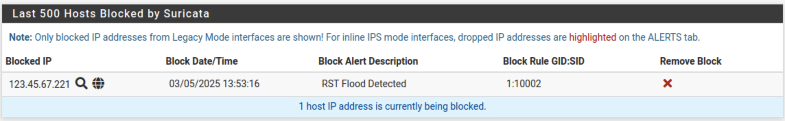
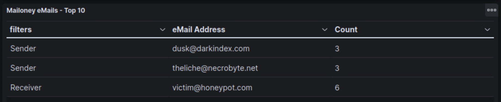
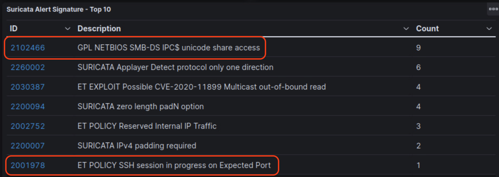

# Automated Defenses

## Mini-challenge Solution

### Add RST Flood Rule

1. (**Ubuntu-Desktop, Firefox, pfSense Admin WebGUI**) Go to Services -> Suricata.

2. (**Ubuntu-Desktop, Firefox, pfSense Admin WebGUI**) Click on the Edit button - &#9999; - for the WAN interface.

3. (**Ubuntu-Desktop, Firefox, pfSense Admin WebGUI**) Click on the "WAN Rules" tab to see the current rules applied to the WAN interface.

4. (**Ubuntu-Desktop, Firefox, pfSense Admin WebGUI**) Change the Category in the top dropdown selector to `custom.rules`.

5. (**Ubuntu-Desktop, Firefox, pfSense Admin WebGUI**) On the following screen add the following rule to the Defined Custom Rules field and then save the rule at the bottom of the page.

`drop tcp any any -> $HOME_NET 21 (msg:"RST Flood Detected"; flags:R; threshold:type threshold, track by_dst, count 100, seconds 1; classtype:attempted-dos; sid:10002; rev:1;)`

6. (**Ubuntu-Desktop, Firefox, pfSense Admin WebGUI**) Click on the "Blocks" tab and monitor for new IP addresses. After triggering the grading check, a new IP in the range of 123.45.67.101-199 should appear after a few minutes.

### Identify the Threat Actor

1. Open the Ubuntu-Desktop console

2. (**Ubuntu-Desktop**) Open Firefox and browse to the honeypot Kibana at `https://10.7.7.200:64297/kibana/` and login with the credentials `web-user | tartans`.

3. (**Ubuntu-Desktop, Firefox**) From the list of available dashboards, right-click on the following dashboards and open them in new tabs and keep them open for the duration of the lab.

 - Mailoney: logs SMTP traffic and incoming emails
 - Suricata: monitors the honeypot and displays alerts tied to existing rulesets

Each tab should eventually be titled with the honeypot you are viewing.

4. (**Ubuntu-Desktop, Firefox, Mailoney Dashboard**) Scroll down and view the "Mailoney eMails - Top 10" visualization. This should display two of the domains found in the threat actor table. Your two domains may differ.

|Indicators|CrimsonViper|IronFalcon|SilentRaven|FeralWolf|SilentLynx|PhantomCobra|BurningMantis|GlacierFox|
|-|-|-|-|-|-|-|-|-|
|enum4linux scans|X|X| |X| |X| | |
|nikto scans     | | |X| |X| |X|X|
|nmap scans      | |X|X|X|X| | | |
|ssh-audit scans |X| | | | |X|X|X|
|darkindex.com   |X| | |X|X| | |X|
|necrobyte.net   |X|X| | |X| |X| |
|shadowhack.org  | | |X| | |X| | |
|venomstrike.io  | |X|X|X| |X|X|X|

Based on the threat actor table this would reduce the possible threat actors to CrimsonViper or SilentLynx, but we want to be sure.

5. (**Ubuntu-Desktop, Firefox, Suricata Dashboard**) Scroll down and view the "Suricta Alert Signature - Top 10" visualization. You should see alert IDs that match the scan types from the guide. Even if only one scan type shows, this reduces the two possible threat actors to one. Your scan types and alert IDs may differ.

| Scan Type | Unique Alert ID(s) | Unique Alert Label |
|-----------|-----------------|--------------------|
| enum4linux | 2102466, 20233997, 2102472, 2102475  | Alludes to SMB access attempts |
| nikto | 2009151, 2012997, 2009714, 2101122 and more | Alludes to cross site scripting, file inclusion, webapps, and various exploits |
| nmap | 2009582, 2101418, 2101418 | Alludes to nmap attempts and snmp requests |
| ssh-audit | 2001219, 2001978 | Aludes to SSH service scans |
| sqlmap | 2008538, 2006445, 2006446 | Alludes to SQL injection attempts |

In the screenshot above we see evidence of enum4linux and ssh-audit scans, meaning CrimsonViper is the threat actor responsible for targeting the honeypot. 
