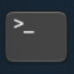
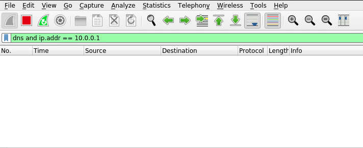

# Enhanced Security with DNS and Domain Name-based Solutions

DNS tooling is essential for developing skills in network management and cybersecurity, directly supporting CISA's mission to manage and reduce risks to both cyber and physical infrastructure. Recognizing the importance of DNS is crucial, as it plays a key role in safeguarding domain name services against cyber-attacks.

Tools like <a href="https://www.ci.protectivedns.cisa.gov/" target="_blank">Protective DNS</a> not only enhance security but also align with DNS-related requirements outlined in the <a href="https://www.whitehouse.gov/wp-content/uploads/2022/01/M-22-09.pdf" target="_blank">Office of Management and Budget (OMB) Memorandum M-22-09</a>

Additional guidance on the implementation of Encrypted DNS can be found <a href="https://www.cisa.gov/news-events/news/cisa-publishes-encrypted-dns-implementation-guidance-federal-agencies" target="_blank">here</a> while additional guidance on the use of Protective DNS can be found <a href="https://www.cisa.gov/resources-tools/services/protective-domain-name-system-resolver" target="_blank">here</a>

 - This lab is expected to take 1 (one) hour

## Learning Objectives

 - Explain the principles of Domain Name Services
 - Explain and apply sinkholing or blocklisting by domain with `Pi-hole`
 - Identify suspicious inbound mail using mail logs with `webmin`
 - Explain and apply mail blocklisting by domain and IP with `Postfix`
 - Implement encrypted DNS for outbound DNS queries
 - Demonstrate proficiency in identifying malicious domains to block inbound mail messages from and outbound requests to these domains

## Learner Expectations

 - Learners should be comfortable with command-line operations and Secure Shell connections
 - Learners should be comfortable with administrative webGUIs
 - Learners should be familiar with Domain Name Service lookups and how domain names relate to a resource's accessible Internet Protocol address

## FOCAL and NICE Framework Mappings

This lab maps with <a href="https://www.cisa.gov/resources-tools/resources/federal-civilian-executive-branch-fceb-operational-cybersecurity-alignment-focal-plan" target="_blank">Federal Civilian Executive Branch (FCEB) Operational Cybersecurity Alignment (FOCAL)</a> area 2 (Vulnerability Management) by preventing access to known malicious domains and area 3 (Defensible Architecture) by enforcing zero-trust principles to identify and block email spam and phishing attempts from malicious senders.

**NICE Work Role**

- <a href="https://niccs.cisa.gov/workforce-development/nice-framework" target="_blank">Infrastructure Support, Threat Analysis, Systems Security Analysis, Vulnerability Analysis</a>

**NICE Tasks**

- <a href="https://niccs.cisa.gov/workforce-development/nice-framework" target="_blank">T0751</a>: Monitor open source websites for hostile content directed towards organizational or partner interests
- <a href="https://niccs.cisa.gov/workforce-development/nice-framework" target="_blank">T1084</a>: Identify anomalous network activity
- <a href="https://niccs.cisa.gov/workforce-development/nice-framework" target="_blank">T1177</a>: Determine if security control technologies reduce identified risk to acceptable levels
- <a href="https://niccs.cisa.gov/workforce-development/nice-framework" target="_blank">T1212</a>: Implement cybersecurity countermeasures for systems and applications
- <a href="https://niccs.cisa.gov/workforce-development/nice-framework" target="_blank">T1555</a>: Implement cyber defense tools

<!-- cut -->

# Scenario

Domain Name Systems (DNS) are a critical component for network resource availability. DNS allows users and systems to query and connect to resources by name instead of by their logical Internet Protocol (IP) address. Could you imagine having to enter an IP address instead of www.google.com every time you wanted to perform a Google search in your web browser? DNS allows us to attach an easily recognizable name to an entity or resource on the network or the Internet. While this provides convenience, it also allows us to enact security controls based on names alone.

In this lab, you will implement several DNS or name-based controls to prevent internal resources from accessing known malicious sources, and prevent those malicious resources from connecting to your resources or users via email. Lastly, you will implement and compare plaintext and encrypted DNS query traffic to better secure DNS communications.

The lab network consists of a Combined Server that hosts local DNS, mail, and web services on one system. A Pi-hole instance has been incorporated into the network, but remains to be configured as a DNS sinkhole as part of the lab. A router and pfSense firewall serve as networking devices for connectivity and the pfSense firewall also serves as your upstream DNS server. Lastly, you will simulate external mail traffic from the Red-Kali system placed outside of the local network.


## System Tools and Credentials

| system | OS type/link |  username | password |
|--------|---------|-----------|----------|
| Ubuntu Desktop | Ubuntu |user | tartans|
| Red-Kali | Kali Linux | user | tartans |
| pfSense Administrative WebGUI | `https://10.0.0.1` | user | tartans |
| Pi-Hole Administrative WebGUI | `http://10.3.3.10/admin` | none | tartans |
| webmin Administrative WebGUI | `http://10.3.3.11:10000` | user | tartans |

| &#128270; INFORMATION |
|---|
|_While some tools still use the terms "whitelist" and "blacklist", the preferred terms are now "allowlist" and "blocklist" to remove inferences about good or bad as they relate to color, instead applying a naming scheme more related to their purpose. Throughout the lab you will see the term blocklist used except when the tool explicitly refers to a "blacklist" by function or file. Know that the two are equivalent in their purpose._ |


## Phase 1: Using Pi-hole to Perform DNS Blackholing, Monitoring, and Redirection

<details>
<summary>
<h3>Test and Validate the Current DNS Server</h3>
</summary>
<p>

1. Open the `Ubuntu-Desktop` and open the Terminal from the left-hand side menu:



Currently, the combined server offers DNS at IP address 10.3.3.13. You can perform DNS lookups by pointing directly to this IP as the name server. We will lookup the hostnames of the mail and web services installed on the combined server to verify their IP addresses match the network diagram and to verify that local DNS is working as intended. 

| &#128736; NSLOOKUP |
|---|
|_`nslookup` is a lookup tool that responds with the logical IP address of the requested resource. For example, if you looked up `www.google.com`, nslookup will query the DNS server and respond with the IP address for `www.google.com`._ |

2. (**Ubuntu-Desktop, Terminal**) In the terminal type the following command:

```
nslookup mail.lab.net 10.3.3.13
```

The command `nslookup` will perform a DNS query for the provided hostname, "mail.lab.net", from the DNS server at 10.3.3.13. The 


The DNS server responds with mail.lab.net's IP address of 10.3.3.11

3. (**Ubuntu-Desktop, Terminal**) Repeat the step above for the hostname "web.lab.net".


The DNS server responds with web.lab.net's IP address of 10.3.3.12

4. (**Ubuntu-Desktop, Terminal**) Finally, attempt one of these lookups without pointing to the nameserver of 10.3.3.13 explicitly. For example:

```
nslookup web.lab.net
```

This lookup will eventually timeout with an error that 10.3.3.10, our Pi-hole instance, is unreachable.


Let's investigate why.

5. (**Ubuntu-Desktop, Terminal**) View Ubuntu-Desktop's current DNS server settings by viewing the resolv.conf file. Use the sudo password of `tartans` if prompted.

```
sudo less /etc/resolv.conf
```


The resolv.conf file lists the nameservers set for the system. In this case, our system is already configured to use the address of Pi-hole (10.3.3.10) by default. The reason our lookups fail is because Pi-hole is receiving requests directly and has not yet been configured to forward our requests to the DNS server. To close the resolv.conf file, press `Q` on your keyboard. 

The next section will explain Pi-hole in detail and walk you through the process for integrating Pi-hole into the DNS querying process.

</p>
</details>

<details>
<summary>
<h3>Configure Pi-hole</h3>
</summary>
<p>

| &#128736; PI-HOLE |
|---|
|_<a href="https://pi-hole.net/" target="_blank">Pi-hole</a> is an open-source proxy of sorts for DNS queries on the network. The lab systems are pre-configured to use Pi-hole as their primary DNS server. Pi-hole then forwards this request to the DNS server for processing. Pi-hole not only logs each request for later review but also affords the capability to sinkhole DNS queries that are destined for known malicious domains. Blackholing the query prevents it from ever being sent to the DNS server. In essence, Pi-hole has captured the request, marked it as disallowed, and sunk it. This protects the system or user making the query from reaching the malicious destination without manual intervention. Pi-hole is primarily used to block malicious ads within webpages. It can also be used to block domains and sites by name as well as redirect the user to an alternate site with additional DNS configurations._ |

*NOTE: It is normal that the default browser page of `https://skills.hub` will fail to load until you complete the following steps. Once you complete step 7, the page will load normally.*

1. (**Ubuntu-Desktop**) Open Firefox and browse to the Pi-hole administration webGUI at `http://10.3.3.10/admin`

2. (**Ubuntu-Desktop, Firefox**) Login with the password `tartans` at the Pi-hole login prompt. You do not need to specify a username.


Once logged in, you should see the Pi-hole Dashboard.


| &#128270; INFORMATION |
|---|
|_The Pi-hole Dashboard provides several metrics for monitoring DNS queries across the network. Pi-hole keeps track of queries over time and by system.<br><br> - The Query Log page allows you to search for a specific domain or client name.<br> - The Adlists page allows you to point to or add your own Adlists for known malicious content to block.<br> - The Disable Blocking option allows you to temporarily or indefinitely suspend domain blocking.<br> - The Local DNS page allows you to add your own custom DNS responses for certain domains or resource lookups. This could be useful if you need to bypass your local DNS server to provide a different response._ |

3. (**Ubuntu-Desktop, Firefox**) First, you will configure the DNS server chain that Pi-hole will use to perform its queries. Click `Settings` entry from the left-side menu.

4. (**Ubuntu-Desktop, Firefox**) Next, click on the `DNS` tab at the top of the Settings menu.

5. (**Ubuntu-Desktop, Firefox**) Here you will configure the DNS servers that Pi-hole will query when it receives a request from a client system. In the `Upstream DNS Servers` section, enter `10.3.3.13` in the field for `Custom 1` and enter `10.0.0.1` in the field for `Custom 2`. Also check the box for each entry to enable it in the chain.


This configuration tells Pi-hole to first ask the DNS server at 10.3.3.13 to resolve queried names. If the local DNS server does not contain a record for the requested item, it will then ask the upstream DNS server running on pfSense at 10.0.0.1. If either responds with the IP address of the requested item, Pi-hole will respond to the requesting client.

6. (**Ubuntu-Desktop, Firefox**) Select the option in the Interface settings section to `Permit all origins` since we are using Pi-hole in a safe lab environment. This allows us to query Pi-hole for DNS requests from anywhere within our network.


In a real-world setup, you might use multiple Pi-hole instances, one per network segment. Otherwise, firewall and network access control lists could be used to restrict who can make requests to Pi-hole.

7. (**Ubuntu-Desktop, Firefox**) Once you have made these changes, scroll down to the bottom of the DNS settings page and click the blue `Save` button.

8. (**Ubuntu-Desktop, Terminal**) Return to the Terminal or open a new instance if necessary. Perform a new lookup like before, but this time, do not point to the DNS server at 10.3.3.13. Allow Pi-hole to respond on its behalf.

```
nslookup web.lab.net
```


This time the lookup succeeds, and you will notice that the responding server is the address of Pi-hole, 10.3.3.10. This also has the added benefit of obfuscating the actual DNS server's IP address, which could provide additional security benefits.

Now that DNS is forwarding properly through Pi-hole, you can implement and test a blocked domain resource lookup.

</p>
</details>


<details>
<summary>
<h3>Implement a New Domain blocklist</h3>
</summary>
<p>

For the purpose of this lab a simple web site has been configured at `web.lab.net`.

1. (**Ubuntu-Desktop, Firefox**) In Firefox, open a new tab and browse to the local website at `web.lab.net`.


You will see three tabs across the top of the page. Feel free to explore these pages.

 - The Home page is the landing page
 - The Ads page will display two example advertisements within the page
 - The Warning page will be used in the next section of the lab

2. (**Ubuntu-Desktop, Firefox, Local Web Site**) Browse to the Ads page and notice there are two ads present: a "safe" ad and a malicious one.


If the malicious ad was actually malicious, we may have been presented with inappropriate content or worse, the ad might contain scripts that triggered in the background without us knowing.

| &#129513; WEBPAGES |
|---|
|_When you browse to a webpage your system first requests and downloads the main HTML (Hypertext Markup Language) structure of the page. Then, based on the contents of the HTML page, your system will request and download any further content that might be hosted by an additional party or service, such as ad content. Examples of this might be iframes and other types of embedded content, like images and video._ |

3. (**Ubuntu-Desktop, Firefox, Local Web Site**) Right-click within the malicious ad's box and select `View Page Source`. You should see the HTML of the ad displayed in a new tab. Pay attention to the following section.


Note that the iframe for the malicious ad is pointing to `www.malicious-ad.com`.

Next, you will block this content using Pi-hole so that the request from your local system to the malicious domain is never made.

4. (**Ubuntu-Desktop, Firefox, Pi-hole Admin Page**) Return to the Firefox tab for Pi-hole's administration page or open a new tab and browse to `http://10.3.3.10/admin`. Use the password `tartans`, if needed, to login.

5. (**Ubuntu-Desktop, Firefox, Pi-hole Admin Page**) Click `Domains` tab from the left-side menu.

Here you can add malicious domains manually that are not part of an already published list.

**Knowledge Check Question 1:** *Review the domains currently in the blocklist and answer Knowledge Check Question 1 by submitting the full name of the domain.*


6. (**Ubuntu-Desktop, Firefox, Pi-hole Admin Page**) In the `Domain:` field add the domain name of the malicious ad, `www.malicious-ad.com`, and then click on `Add to Blacklist`.


If we were sure that the entire domain of malicious-ad.com was unsafe, we could leave off the "www." and block the entire wildcard domain, meaning anything that ended in `malicious-ad.com` would also be blocked.

7. (**Ubuntu-Desktop, Firefox, New Tab**) In a new tab, browse to `http://www.malicious-ad.com`. What happens?


The page is now blocked because the request for the domain's lookup was also blocked. Thus, we never received the content from the malicious domain.

8. (**Ubuntu-Desktop, Terminal**) Return to the Terminal and perform a lookup for `www.malicious-ad.com`.

```
nslookup www.malicious-ad.com
```


The server responds with 0.0.0.0 as a null response due to the query for this domain being rejected by the blocklist.

9. (**Ubuntu-Desktop, Firefox, Local Web Site**) Return to the tab displaying the Ads page of the local web site and refresh the page. What happens? *Note that you may need to refresh the page a few times or wait for a minute or two before the cached page expires.*


You should see that while the rest of the content is displayed for the page and the safe ad, the malicious ad's iframe content is now blocked.

10. (**Ubuntu-Desktop, Firefox, Pi-hole Admin Page**) Return to the tab displaying the Pi-Hole administration page. Click on the `Dashboard` and notice that the `Queries Blocked` visualization is now showing data. Note that your data will look different than the screenshow below.


11. (**Ubuntu-Desktop, Firefox, Pi-hole Admin Page**) Click on the link in the `Queries Blocked` visualization marked with `List Blocked Queries`. Here you can track all the malicious domain requests that have been blocked.


Note that you can see which client or system in your environment made the requests. This data might be of value to understand trends or commonalities in user behaviors in order to implement further security controls to help prevent malicious content or actions on the network.

</p>
</details>

<details>
<summary>
<h3>Redirect Malicious Requests to a Warning Page.</h3>
</summary>
<p>

An additional step you could take for commonly requested malicious pages might be a redirection page to warn users that their attempt to request a resource was blocked and logged. You could also implement this with other networking devices that act as web proxies.

| &#128270; INFORMATION |
|---|
|_Pi-hole used to include a redirection page for every blocklisted domain request by default. However, with the prevalence of HTTPS, this would become harder to implement with Pi-hole alone since the request would redirect to an unencrypted HTTP page during an HTTPS request (causing the browser to drop the connection).<br><br>Network and web-based proxies are better suited at redirecting blocked requests to a warning page, but for the sake of this lab, we can achieve the same outcome by redirecting the queries at the Pi-hole DNS service level._ |

1. (**Ubuntu-Desktop, Firefox, Pi-hole Admin Page**) Click on the `Local DNS` tab from the left-side menu of the Pi-hole administration page and then click on `DNS Records` in the exposed menu listings.

2. (**Ubuntu-Desktop, Firefox, Pi-hole Admin Page**) In the `Domain:` field enter `www.malicious-ad.com` and in the `IP Address:` field enter `10.3.3.15`.


This setting will automatically preempt any requests for `www.malicious-ad.com` to the DNS server and instead respond with the IP address of 10.3.3.15 for this resource. 

A website has been configured at 10.3.3.15 that provides the warning page.

3. (**Ubuntu-Desktop, Firefox, Pi-hole Admin Page**) Click on the `Domains` tab from the left-side menu.

4. (**Ubuntu-Desktop, Firefox, Pi-hole Admin Page**) For the time being, click on the green `Enabled` button next to the entry for `www.malicious-ad.com` so we can instead perform a redirection. This action will disable blocking of just this domain, otherwise the redirect would fail.

5. (**Ubuntu-Desktop, Firefox, New Tab**) In a new tab, browse again to `http://www.malicious-ad.com`. This time you should be redirected to the warning page hosted by 10.3.3.15 instead of seeing an error message.


As you may have guessed, when redirecting lookups for the domain name only, we leave the possibility that someone could still retrieve the contents of `www.malicious-ad.com` by its IP address. If we were to redirect queries for a malicious domain in this manner, you would also want to block access to the domain at the firewall or other networking device. This would achieve both goals of informing the user that they attempted to access a malicious site and prevent access to the actual resource.

| &#129513; REDIRECTIONS |
|---|
|_Redirections could also be useful for redirecting general traffic destined for external resources. Since local DNS records typically only provide responses to queries about local resources, redirecting an external resource before the request leaves your network is a powerful security control. Think about the hype surrounding current Large Language Models such as chatGPT. If chatGPT was disallowed by policy, you could add a DNS query that might redirect a local user to an internal LLM instead of allowing them to browse to the official chatGPT site, or simply blocking it without an explanation._ |

#### Grading Check

(**Ubuntu-Desktop, Firefox, New Tab**) To check your work, browse to the grading page at `https://skills.hub/lab/tasks` or `(https://10.5.5.5/lab/tasks)` from the Ubuntu-Desktop. Click the `Submit/Re-Grade Tasks` button to trigger the grading checks. Refresh the results after a few moments to see your results.

These two checks will verify that you were able to achieve both results during your lab attempt.


Grading Check 1: Successfully blocked traffic to `www.malicious-ad.com`
 - `www.malicious-ad.com` was added to the Domains blocklist in Pi-hole
 - Requests in the browser for `www.malicious-ad.com` were blocked by Pi-hole

Grading Check 2: Successfully redirected the traffic for `www.malicious-ad.com` to the warning page
 - A local DNS entry was added to redirect `www.malicious-ad.com` to 10.3.3.15
 - The entry for `www.malicious-ad.com` in the Domain blocklist was disabled
 - Browsing to `www.malicious-ad.com` redirects to the warning page at 10.3.3.15

`Copy the token or flag strings to the corresponding question submission field to receive credit.`

`You should complete all phase 1 tasks before moving on to phase 2.`

</p>
</details>

## Phase 2: Using webmin and Mail Logs to Monitor Incoming Mail Messages

<details>
<summary>
<h3>Stage the Tools and Applications</h3>
</summary>
<p>

| &#128736; SMTP |
|---|
|_The lab environment uses Postfix as its SMTP (Simple Mail Transport Protocol) mail server/service. Postfix is simple to setup, easy to use and affords the ability to allow or deny incoming mail messages based on source domain or client IP. Each mail service will differ. Commercial examples such as Microsoft Exchange and free-to-use public options such as Google or Yahoo mail have their own suite of security tools and options. You can apply the same concepts taught in this lab to other mail services and applications._|

You will begin by staging the various tools for this phase of the lab.

1. (**Ubuntu-Desktop, Firefox, New Tab**) Browse to the webmin webGUI at `http://10.3.3.11:10000`. Ignore and click through any certificate warnings. Use the username `user` and the password `tartans`.


2. (**Ubuntu-Desktop, Firefox, webmin Landing Page**) Expand the `System` heading from the left side menu and click on `System Logs`.


3. (**Ubuntu-Desktop, Firefox, webmin System Logs Page**) Filter for only the mail.log file by selecting it from the dropdown and change the last log count to 25. This amount will be sufficient for our purposes.


The log entries contain useful information:
 - The `to=` entry lists the user the email message was sent to
 - The `from=` entry lists the sender's address, including a username and domain
 - The `client` entry will list the domain/host name of the client, if it can be resolved by DNS, and also its IP address

Review the logs currently in view. Do you notice anything suspicious? You should see multiple entries from a single source domain/client. This could be an indication of a spam or phishing campaign against users in your organization, albeit on a much smaller scale.

**Knowledge Check Question2:** *Based on the current mail logs, find the sender that has already sent messages to a user in your organization and submit this sender's full address in the corresponding question.*

4. (**Ubuntu-Desktop**) Open a new Terminal from the left-hand side menu: 


5. (**Ubuntu-Desktop, Terminal**) Connect to the Mail Server via Secure Shell (SSH), type and enter "Yes" when asked if you are sure you want to connect, and use the password `tartans` when asked:

```
ssh user@10.3.3.11
```


The terminal's command prompt should change to the `user@combined-server` context, verifying that you are now interacting with the command line of the server.


</p>
</details>


<details>
<summary>
<h3>Trigger a Simulated Bulk Email Campaign and Monitor for Suspicious Domains</h3>
</summary>
</p>

| &#9888; NOTE |
|---|
|_The next few steps of the lab will require you to rotate between the various systems and tools in the following process loop:<br><br> - *Run a mail sending script on Red-Kali to send some test emails*<br> - *Identify the malicious domain using mail logs via webmin*<br> - *Modify the Postfix blocklist via SSH in the Terminal*<br> - *Re-run the mail sending script on Red-Kali to test the new blocklist rule(s)*<br> - *Review the results in the mail logs via webmin*<br><br>*Each instruction will be preceded by the system and application you need to be in before executing. Pay close attention to these marking as you complete each step.*_ |

1. Open the `Red-Kali` console and, if needed, log on with the credentials of `user` | `tartans`

2. (**Red-Kali**) Open the Terminal from the top menu bar.

You will use the Terminal to trigger a Python script that sends bulk email messages to users in your network. The script uses the following options that will be provided to you at each use:

 - `-s` : Specifies the sender's email address and domain
 - `-r` : Specifies the recipient's email address, or a file containing a list of recipient addresses
 - `-p` : Specifies the email server port
 - `-S` : Specifies the email server IP address
 - `-n` : Specifies how many emails to send the user, or user list
 - `-c` : Specifies the subject and body content of the message

3. (**Red-Kali, Terminal**) Execute the email script with the following command. You may use the clipboard feature to copy and paste the command or type it in full.

```
python3 send_mail1.py -s badguy@baddomain.com -r jsmith@lab.net -p 25 -S 123.45.67.89 -n 10 -c '{"subject":"Malicious Message","body":"This is the message"}'
```


4. (**Ubuntu-Desktop, Firefox, webmin System Logs Page**) Return to the webmin tab and click the blue Filter button. You should notice that the mail logs have flagged the sender's username and domain, as well as the IP address of the client that sent the email.


Now we have enough information to create a blocklist by learning the domain of the user and the IP address of the sender.

</p>
</details>

<details>
<summary>
<h3>Add a Domain Blocklist Entry in Postfix and Verify the Rule is Working</h3>
</summary>
</p>

1. (**Ubuntu-Desktop, Terminal, SSH Session to Combined-Server**) Change directories to the Postfix directory.

```
cd /etc/postfix
```

| &#128204; REMINDER |
|---|
|_Postfix will use a file titled "blacklist", as this is preconfigured in the postfix settings. The term "blocklist" can be interchanged for the purpose of this file, though you should not change the filename itself, or the commands listed in the next section._ |

2. (**Ubuntu-Desktop, Terminal, SSH Session to Combined-Server**) Open the blocklist file for editing with the following command, using the password of `tartans` when prompted.

```
sudo nano /etc/postfix/blacklist
```

3. (**Ubuntu-Desktop, Terminal, SSH Session to Combined-Server**) Add the domain of the malicious sender, `baddomain.com` and also the IP address of the client for good measure, `123.45.67.202`. Use the structure already provided in the file and enter each item on its own line.

```
baddomain.com   REJECT
123.45.67.202   REJECT
```


4. (**Ubuntu-Desktop, Terminal, SSH Session to Combined-Server**) Press `CTRL+X` to save, type and enter `Y` to confirm, and then press `Enter` to confirm the same filename.

This will update our blocklist file but there is one more step to ensure Postfix can act upon it. You must use the `postmap` command to process the names and addresses in the blocklist file into a more efficient data structure for Postfix to use when processing incoming messages. To do this, you will use the hashing option with postmap.

5. (**Ubuntu-Desktop, Terminal, SSH Session to Combined-Server**) Enter the following command to process your blocklist file, where `hash` is the selected conversion type and `blacklist` is the name of the file to process.

```
sudo postmap hash:blacklist
```

If successful, the process will create a file called `blacklist.db` in the same directory. You can view whether this file exists with the `ls` command.


| &#128270; INFORMATION |
|---|
|_Postfix has been pre-configured to leverage this blocklist when processing client, sender, and recipient rules. Client rules apply directly to the domain/IP of the client sending a message. Sender rules apply directly to the username and domain address in the "from" line of the message. Recipient rules apply to the username and domain address in the "To" line of the message. While you could apply different rule files to each item, the lab applies the same blocklist to all 3 since the needs are aligned._ |

Now you are ready to rerun the mail script from Red-Kali and test whether the messages are blocked.

6. (**Red-Kali, Terminal**) Return to the Red-Kali system, but this time execute the email script using `send_mail2.py`. You can simply press the Up arrow within the terminal, change the script filename from `send_mail1.py` to `send_mail2.py`, and press `Enter` to run the same script again. The full command, should you need it, is:

```
python3 send_mail2.py -s badguy@baddomain.com -r jsmith@lab.net -p 25 -S 123.45.67.89 -n 10 -c '{"subject":"Malicious Message","body":"This is the message"}'
```

This script uses a different IP address for the client than before. This lets us test if domain blocking is working by itself.

Notice in the failure message that the sender address was rejected due to the bad domain of `baddomain.com`.


7. (**Ubuntu-Desktop, Firefox, webmin System Logs Page**) Return to the webmin tab and click the blue `Filter` button again to refresh the results. You can confirm that these attempts were indeed blocked with the message `Sender address rejected`, even though the IP address of the client was changed to 123.45.67.201.


This validates that even though the sender used a different address than 123.45.67.202, the incoming mail was still blocked based solely on the domain of the sender's address including badddomain.com.

Let's next validate that we can also block incoming messages by IP address.

8. (**Red-Kali, Terminal**) Let's test that we can also block by that suspicious IP address `123.45.67.202`. This time you will use `send_mail3.py` to test the original IP address but use a different and allowed sender address domain.

You can simply press the Up arrow within the terminal, change the script filename from `send_mail2.py` to `send_mail3.py`, change the sender address from `badguy@baddomain.com` to `badguy@gooddomain.com`, and press `Enter` to run the same script again. The full command, should you need it, is:

```
python3 send_mail3.py -s badguy@gooddomain.com -r jsmith@lab.net -p 25 -S 123.45.67.89 -n 10 -c '{"subject":"Malicious Message","body":"This is the message"}'
```

Notice the same failure message as before.


9. (**Ubuntu-Desktop, Firefox, webmin System Logs Page**) Return to the webmin tab and click the blue `Filter` button again to refresh the results. You can confirm that these attempts were indeed blocked with the message `Client host rejected`, even though the domain was changed to `gooddomain.com`.


This validates that even though the sender used a different domain than baddomain.com, the incoming mail was still blocked based solely on the IP address of the sender's client system.

The ability to monitor incoming mail messages for any suspicious sender domains is a crucial integration with domain name-based security controls. The additional flexibility to also block a sender by IP address adds another layer of protection if the domain ever changes but the source IP does not. Blocking by IP also helps prevent spoofed senders from getting through.

#### Grading Check

(**Ubuntu-Desktop, Firefox, New Tab**) To check your work, browse to the grading page at `https://skills.hub/lab/tasks` or `(https://10.5.5.5/lab/tasks)` from the Ubuntu-Desktop. Click the `Submit/Re-Grade Tasks` button to trigger the grading checks. Refresh the results after a few moments to see your results.


Grading Check 3: Successfully implement a mailing blocklist for the domain `baddomain.com` and the IP address `123.45.67.202`
 - Incoming mail messages sent from anything@baddomain.com are denied or were denied at least once based on the mail logs, regardless of the IP address of the client
 - Incoming mail messages sent from 123.45.67.202 are denied or were denied at least once based on the mail logs, regardless of the domain of the sender

`Copy the token or flag strings to the corresponding question submission field to receive credit.`

`You should complete all phase 2 tasks before moving on to phase 3.`

</p>
</details>

## Phase 3: Implement Encrypted DNS over TLS for Outgoing Requests

<details>
<summary>
<h3>Enable and Validate Encrypted DNS Support in pfSense</h3>
</summary>
</p>

| &#128270; INFORMATION |
|---|
|_As you will see in the upcoming steps, DNS requests are not encrypted when using the standard UDP port of 53. The current DNS server is not encrypting our local requests. This means every domain or resource that you look up is visible to anyone sniffing your local network traffic.<br><br>It is relatively uncommon to need to encrypt local DNS traffic that never leaves your network. DNS queries leaving your network in cleartext can expose the resources, domains, and websites that you frequent to others. This information could be used to craft higher quality phishing emails and provides more information about the users of a network and their behaviors. This also exposes the traffic to adversary-in-the-middle or spoofing attacks.<br><br>Encrypting outbound DNS is a smart move that can help hide tour DNS queries from network traffic analyzers, without sacrificing functionality or efficiency._ |

pfSense has been serving as our simulated upstream DNS server within the lab environment. Implementing encrypted DNS is typically something that your service provider, VPN/proxy service, or IT staff would already provide. However, it's a valuable lesson to see it in action and validate that you cannot view the same information in a packet capture.

| &#129513; KEY POINT - UPSTREAM DNS |
|---|
|_A local DNS server will query an upstream DNS server when it cannot resolve a domain name. Commonly the upstream DNS server is outside of your local network and hosted by your internet service provider (ISP) or another third-party on the public internet. In steps 1 through 4 you will be enabling services to support encrypted DNS within the lab environment. Typically these configurations would already be implemented by the upstream DNS provider if DNS encryption is available._ |

1. (**Ubuntu-Desktop, Firefox, New Tab**) Browse to the pfSense Admin webGUI at `https://10.0.0.1`, ignore and bypass any certificate warnings, and login with the credentials: `user` | `tartans`

2. (**Ubuntu-Desktop, Firefox, pfSense Admin webGUI**) Click on the `Services` tab and select `DNS Resolver`.


You will be presented with the settings for the upstream DNS resolver.

3. (**Ubuntu-Desktop, Firefox, pfSense Admin webGUI**) Make the following modifications as you scroll down the page, enabling Secure Shell/Transport Layer Security (SSL/TLS) encryption support for DNS.

 - Check the box next to `Enable SSL/TLS Service`


 - Change the `SSL/TLS Certificate` to `Encrypted DNS` from the dropdown menu. This file was pre-generated for you. If a certificate did not already exist, you would need to create one in order to complete the TLS handshake (an example of this is provided at the end of this step).


 - Note the SSL/TLS Listen port of `853` but do not change it. This is the default/standard port for DNS over TLS.

 - Scroll down further to the `Custom options` field and add the following lines beneath the existing lines, but do not remove any of the existing lines. This tells the service which files to use for the TLS certificate and key.

  ```
  tls-service-key: "/var/unbound/encrypteddns.key"
  tls-service-pem: "/var/unbound/encrypteddns.pem"
  ```


Again, the certificate (.pem) and key files were pregenerated for you and are already placed at the listed location on the firewall's file system.

| &#128270; INFORMATION |
|---|
|_To create the TLS certificate files you could use the following command: `openssl req -newkey rsa:2048 -nodes -keyout newtlskey.key -x509 -days 365 -out newtlspem.pem`. these files are ready for use as soon as they are generated. Once generated, simply copy the files to the required system and point to them in any configuration files that require them._ |

4. (**Ubuntu-Desktop, Firefox, pfSense Admin webGUI**) Review that you have correctly made all the changes listed in the step above and click the blue `Save` button. Afterwards, scroll to the top of the page and click the green `Apply Changes` button as well.


You will see a new message at the top of the page that states that the changes have been applied successfully.

Time to test whether our changes were successful.

5. (**Ubuntu-Desktop, Terminal**) Open a new Terminal like before and use the `dig` command, which supports encrypted lookups, to perform a lookup of our old friend, `www.malicious-ad.com`; this time using the encrypted method over TLS.

With the dig command you can specify the DNS server, 10.0.0.1, the server's port, 853, and that you want to use TLS.

```
dig @10.0.0.1 -p 853 +tls www.malicious-ad.com
```


If you see the response above then DNS over TLS is working properly. If you receive an error stating "no servers could be reached," go back and double check that the pfSense DNS Resolver settings match the steps above and that they have been properly saved and applied. Then try again.

6. (**Ubuntu-Desktop, Terminal**) Open a second Terminal like before and open Wireshark with the following command. We use the `sudo` option here rather than simply opening the application because Wireshark requires root or administrator privileges in order to sniff traffic. Leave this terminal window open as closing it will also close Wireshark.

Use the password of `tartans` if prompted.


```
sudo wireshark
```

Wireshark should then launch normally. 

7. (**Ubuntu-Desktop, Wireshark**) Double-click on the `ens32` interface listing and then Wireshark will start sniffing traffic on this interface.


8. (**Ubuntu-Desktop, Wireshark**) In the Filter field (where it says "Apply a display filter"), type `dns and ip.addr == 10.0.0.1` and press Enter to apply the filter. This filter makes it so we only see DNS requests made to the upstream DNS server (pfSense) at 10.0.0.1.



Since we have not sent any requests to the DNS Resolver since starting the capture, seeing 0 packets present is normal.

9. (**Ubuntu-Desktop, Terminal**) Back in the Terminal not running Wireshark, perform a standard DNS lookup for `www.malicious-ad.com`.

```
nslookup www.malicious-ad.com 10.0.0.1
```

10. (**Ubuntu-Desktop, Wireshark**) Return to Wireshark and you should see the packets generated for this traffic. 


Notice that several pieces of information are visible:
 - The queried domain/site of `www.malicious-ad.com`
 - The DNS server's response of `123.45.67.201`

11. (**Ubuntu-Desktop, Wireshark**) Click into the Filter field again and this time change the filter to `tcp.port == 853` to filter for only encrypted DNS over TLS traffic. You do not need to stop or restart the capture.


12. (**Ubuntu-Desktop, Terminal**) Return to the Terminal not running Wireshark and rerun the dig lookup over TLS.

```
dig @10.0.0.1 -p 853 +tls www.malicious-ad.com
```

13. (**Ubuntu-Desktop, Wireshark**) Return to Wireshark and you should see the packets generated for this traffic. 


This time, you will see many more packets due to the overhead heavy nature of TCP versus DNS' standard UDP protocol.

 - The first three packets in the sequence initiate the TCP three-way handshake of SYN->SYNACK -> ACK to establish the connection.
 - The next packet initiates the TLS connection and starts by specifying the cipher used to encrypt the traffic.
 - Eventually the connection is closed once the query is returned.

Notice that nowhere in the `Info` field is the requested resource name or IP address revealed. This means that if a bad actor were to sniff this DNS traffic they still would not gain any insight into the types of domains or resources that users are asking about.

#### Grading Check

(**Ubuntu-Desktop, Firefox, New Tab**) To check your work, browse to the grading page at `https://skills.hub/lab/tasks` or `(https://10.5.5.5/lab/tasks)` from the Ubuntu-Desktop. Click the `Submit/Re-Grade Tasks` button to trigger the grading checks. Refresh the results after a few moments to see your results.


Grading Check 4: Successfully implement DNS over TLS at the pfSense firewall
 - DNS over TLS is working properly in the pfSense DNS Resolver
 - DNS requests over TLS are returning the correct information

`Copy the token or flag strings to the corresponding question submission field to receive credit.`

`You should complete all phase 3 tasks before moving on to the mini-challenge.`

</p>
</details>

## Mini-Challenge

<details>
<summary>
<h3>Mini-Challenge Scenario</h3>
</summary>
<p>

For the mini-challenge, your objective is to review mail logs and then add the malicious domains present to both the Postfix and Pi-hole blocklists.

To do this, a mailing script has been created for you.

1. Return to the **Red-Kali** console and open a Terminal.

2. (**Red-Kali, Terminal**) Execute the mini-challenge mail script with the following command:

```
python3 /home/user/minichallenge.py
```


The script will send several emails to your mail server. It will randomly select two malicious domains from a list and randomly select the recipients, so your output will look different from the screenshot above. You can run this script as many times as needed to test your work.

*A solution guide link is available following the grading section, should you need it.*

### Mini-challenge Objectives

Once the email script has been executed, you must do the following. Draw on your previous experience in the lab and apply the same concepts to the mini-challenge objectives:

 - 1. Review the mail logs using webmin and identify **two(2)** malicious sender domains. The malicious domains will send several email messages to multiple recipients in your organization. Remember to note only the domain portion of these addresses (i.e. everything after the @ symbol).
 - 2. Add these malicious domains to the Postfix blocklist file and rebuild the hashed blocklist database afterwards. You do not need to block by IP address for the mini-challenge, only by domain. This will block any future emails from senders at these domains.
 - 3. Add these domains to Pi-hole's blocklisted domains to prevent users from requesting and browsing to these malicious domains in the future.

The grading server will use IP address 10.5.5.5 to validate whether the emails are blocked. You can ignore any mail log messages regarding this client IP address.

*NOTE: Before running the grading check you could trigger the minichallenge.py email script again and see if the corresponding malicious emails are blocked in the mail logs. You can also perform nslookups of the malicious domains and verify that pi-hole is blocking the requests by providing the 0.0.0.0 IP address in the response.*

#### Mini-Challenge Grading Check

(**Ubuntu-Desktop, Firefox, New Tab**) To check your work, browse to the grading page at `https://skills.hub/lab/tasks` or `(https://10.5.5.5/lab/tasks)` from the Ubuntu-Desktop. Click the `Submit/Re-Grade Tasks` button to trigger the grading checks. Refresh the results after a few moments to see your results.


Grading Check 5: Successfully implement a mailing blocklist for the domains identified from the mail logs
 - Both domains are present in the Postfix blocklist file
 - Incoming mail messages sent from these domains are denied

Grading Check 6: Successfully blocked traffic to the domains identified from the mail logs
 - The malicious domains were added to the Domains blocklist in Pi-hole
 - DNS lookups for these domains will respond with the 0.0.0.0 address

`Copy the token or flag strings to the corresponding question submission field to receive credit.`

*Please attempt the mini-challenge as best you can, but if you get stuck you can use the solution guide found <a href="https://github.com/cisagov/prescup-challenges/tree/main/skilling-continuation-labs/network-segmentation-with-ics-or-hmi/solution/README.md" target="_blank">here</a> for assistance.*

</p>
</details>

<details>
<summary>
<h2>Lab Wrap Up</h2>
</summary>
<p>

### Conclusion

By completing this lab, you have become more familiar with leveraging DNS and name-based security controls to better protect your assets and users.

To recap:
 - You configured Pi-hole to proxy DNS requests made within your organization's network
 - You implemented a malicious domain blocklist and redirect using Pi-hole's domain blocking and DNS features
 - You implemented a Postfix blocklist using domain and IP address information found within mail logs to block future mail messages from these sources
 - You configured the upstream DNS resolver on pfSense to serve DNS over TLS, further protecting outbound DNS requests by encrypting the traffic from traffic sniffers
 
Preventing unwanted access to external sites and blocking malicious or otherwise unwanted email messages certainly protects users, their systems, and the network. Malicious domains and email messages pose constant threats, but leveraging DNS and domain-based information to strengthen security—integrated within a defense-in-depth strategy—is essential for any organization.

### References

 - <a href="https://www.ci.protectivedns.cisa.gov/" target="_blank">Protective DNS</a>
 - <a href="https://www.cisa.gov/resources-tools/services/protective-domain-name-system-resolver" target="_blank">Protective DNS Resolver</a>
 - <a href="https://www.whitehouse.gov/wp-content/uploads/2022/01/M-22-09.pdf" target="_blank">Office of Management and Budget (OMB) Memorandum M-22-09</a>
 - <a href="https://www.cisa.gov/news-events/news/cisa-publishes-encrypted-dns-implementation-guidance-federal-agencies" target="_blank">Encrypted DNS</a>
 - <a href="https://pi-hole.net/" target="_blank">Pi-hole</a>
 - <a href="https://www.cisa.gov/resources-tools/resources/federal-civilian-executive-branch-fceb-operational-cybersecurity-alignment-focal-plan" target="_blank">Federal Civilian Executive Branch (FCEB) Operational Cybersecurity Alignment (FOCAL) Plan</a>
 - <a href="https://niccs.cisa.gov/workforce-development/nice-framework" target="_blank">NICE Framework</a>