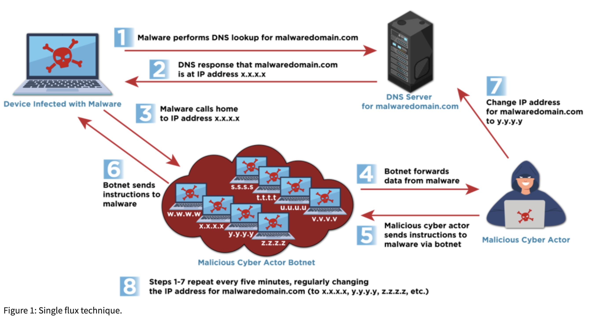

# Fast Flux Attacks and Defensive Measures

In April, 2025 CISA published a <a href="https://www.cisa.gov/news-events/cybersecurity-advisories/aa25-093a" target="_blank">cybersecurity advisory</a> on the dangers of fast flux, which was also warned about by the National Security Agency (NSA) Federal Bureau of Investigation (FBI) and others:

“This technique poses a significant threat to national security, enabling malicious cyber actors to consistently evade detection. Malicious cyber actors, including cybercriminals and nation-state actors, use fast flux to obfuscate the locations of malicious servers by rapidly changing Domain Name System (DNS) records. Additionally, they can create resilient, highly available command and control (C2) infrastructure, concealing their subsequent malicious operations. This resilient and fast changing infrastructure makes tracking and blocking malicious activities that use fast flux more difficult.”

The lab will simulate an example of a fast flux attack and how to detect such attacks using traffic analysis techniques with Wireshark. The lab will also draw upon DNS blocking of malicious domains by name, which are covered in more depth in the Skilling Continuation Lab titled DNS and Name-based Security Solutions.

 - This lab is expected to take 30 minutes

*Please consider filling out the lab feedback survey at the bottom of your screen. The survey is available to you at any time while conducting the lab.*

**Caution!** You must complete _all_ phases of the lab to receive your completion certificate.

## Learning Objectives

 - Understand fast flux attacks
 - Implement an IP-based firewall rule to block the malicious domain
 - Analyze network traffic for evidence of fast flux attacks
 - Implement a name-based block for the malicious domain
 - Implement an exclusive allowlist to prevent fast flux-sourced content

## Learner Expectations

 - Learners should be familiar with the purpose of Domain Name Systems (DNS)
 - Learners should be comfortable with command-line operations and Web GUIs

## FOCAL and NICE Framework Mappings

This lab maps with <a href="https://www.cisa.gov/resources-tools/resources/federal-civilian-executive-branch-fceb-operational-cybersecurity-alignment-focal-plan" target="_blank">Federal Civilian Executive Branch (FCEB) Operational Cybersecurity Alignment (FOCAL)</a> area 3 (Defensible Architecture) by detecting an “upstream” attack outside of an organizations control.

**NICE Work Role**

- <a href="https://niccs.cisa.gov/workforce-development/nice-framework" target="_blank">Incident Response, Systems Security Analysis</a>

**NICE Tasks**

- <a href="https://niccs.cisa.gov/workforce-development/nice-framework" target="_blank">T1084</a>: Identify anomalous network activity
- <a href="https://niccs.cisa.gov/workforce-development/nice-framework" target="_blank">T1177</a>: Determine if security control technologies reduce identified risk to acceptable levels 
- <a href="https://niccs.cisa.gov/workforce-development/nice-framework" target="_blank">T1212</a>: Implement cybersecurity countermeasures for systems and applications

<!-- cut -->

# Scenario

Network diagram:


The lab environment consists of multiple systems:
 - An Ubuntu Desktop - your client system and workstation - this is the only system you will need to access for the lab
 - A pfSense firewall that serves as our DNS server and monitors traffic between our network and the Internet
 - A Pi-hole server that performs DNS proxying and blocking
 - Additional upstream DNS servers external to our network

## System Tools and Credentials

| system | OS type/link |  username | password |
|--------|---------|-----------|----------|
| Ubuntu Desktop | Ubuntu |user | tartans|
| pfSense Web GUI | `https://pfsense.skills.hub` | user | tartans |
| Pi-hole Web GUI | `https://pihole.skills.hub/admin` |user | tartans|

<!-- cut -->

## Fast Flux - Attack Details 

The following section will outline what fast flux attacks are, how they work, and how malicious actors use them to propagate malware and phishing attacks. If you are already familiar with fast flux, you may skip ahead to Phase 1 of the lab. This initial section explaining fast flux is a 5-minute read.

<details> 
<summary> 
<h3>Fast Flux Explained</h3> 
</summary> 
<p> 

#### What is Fast Flux?

Whenever you browse to a website, your system performs a DNS lookup to link the hostname you pass via the URL bar to a logical IP address. This allows the use of an easy-to-remember naming convention for web resources while the underlying system uses the more specific IP addressing convention. Because DNS tends to run "under the hood," many users are more than happy to ignore the underpinnings of how DNS operates as long as it works properly.

Fast flux is a method of changing the name-to-IP address mappings through rapid DNS record updates. Most users would never realize that the IP address of a resource has changed. These malicious fully qualified domain names (FQDN) are then used to host malicious content and malware and are often used in phishing attacks.

Malicious actors often use compromised botnet clients as web proxies for their malicious web content. A proxy is a middleman, or broker, for the incoming web connections to their malicious hosts. When requesting a malicious site the client system queries the resolved IP address of the FQDN, which will point to the proxy instead of the IP address of the actual malicious host. The proxy then passes the request along and the user is none the wiser that they are interacting with a proxy and not the end web server. This obfuscates the existence of the true malicious host. These hosts are sometimes referred to as "bulletproof" since there is no way to block something that you can't find.


  
Let's say that traffic analysis and security reports noted a malicious site or domain, and you were able to determine its IP address. You could block the IP address to prevent access to or from this domain. With fast flux malicious actors simply move the proxy service to a new botnet client with a new IP address and update the DNS record to match. The malicious content and site remains active on the bulletproof host while security staff continue scrambling to block ever changing web proxy IPs.

#### Time to Live and Double Fast Flux

Whenever you request a website your browser asks the system to find the resolved IP address through DNS. This can create a large amount of traffic for every web request. Think not just the sites you type into the browser, but every link you click, and every piece of external content loaded into the page. To alleviate this, your local system will often cache or store the resolved IP addresses for a specific host or domain. The value that determines how long to store this information is called Time to Live (TTL). The TTL value is specified in the domain's zone file and becomes a part of the configuration for this domain's DNS records.

| &#128270; INFORMATION |
|---|
|_Zone files include the host-to-IP address mappings for the various hosts that belong to a domain. For example, the `google.com` zone file might contain records for `mail` and `maps`, each with their own IP addresses and each serving their own unique content as an individual site, i.e. `mail.google.com` and `maps.google.com`._ |


When using fast flux, actors will set very short TTL values for their DNS zone files, such as 30 seconds or even 0. This ensures that as the name-to-IP address mappings change, systems are required to query for the most recent IP address for the malicious host. The stale cached DNS information is deleted and the new information is stored by the system for the duration of the TTL value. If set to 0, it won't cache the information at all.

To add another layer of abstraction, actors will incorporate DNS proxies into the chain of attack, again using compromised botnet clients to provide these services. This is known as double fast flux, as now both the web and DNS services are proxied behind systems that the malicious actors control. Block one or the other or both and a new one will pop up in its place. The process becomes an endless game of whack-a-mole.

  
  
In some cases, an Internet Service Provider (ISP) will block an entire malicious domain from network access if it can be demonstrated that the domain is unequivocally bad. However, malicious actors have a workaround for this as well. They will simply register or bulk register a series of new malicious domains and continue on using fast flux methods.

#### Preventing Fast Flux

So if blocking the web proxies won't work, blocking the DNS proxies won't work, and blocking entire domains is only a stop gap, how can we prevent fast flux techniques from sourcing malicious content to our assets?

There is something known as "DNS Reputation". DNS Reputation is a concept that applies statuses to well-known, long standing, and reputable sites and domains. You wouldn't think twice about browsing to `www.amazon.com` or `www.cisa.gov`, but you might think twice about browsing to something like `ma1.havok1e5c7a.can.net`. Tools such as Whois (https://whois.domaintools.com) make it easy to lookup information on a domain, including how long it has been around. If a site or domain such as google.com has been around for decades, then we can assume it is legitimate and reputable.


If a site or domain has only existed for a few days or weeks, then we should be cautious and properly vet the site before allowing access.

In this manner, DNS Reputation services act as intermediaries for DNS and web traffic and help ensure that clients can only access reputable sites and domains. DNS reputation lists can also be used locally to restrict traffic. With the Zero Trust model we assume that nothing can be trusted and should employ the principal of "deny by default". Using DNS allowlists, reputable sites and domains can be allowed by exception while all other sites and domains are blocked by default. Any new requests should be vetted before they are added to the allowlists.

While this process cannot completely avoid the risks of fast flux and typically involves the use of a third-party vendor or service, such as <a href="https://www.cisa.gov/resources-tools/services/protective-domain-name-system-dns-resolver" target="_blank">CISA's Protective DNS</a>, it is the only realistic technical measure an organization can take without spending resources on constantly applying new IP block rules based on security and intelligence reports.

</p>
</details>

## Phase 1 - Testing Fast Flux

In this phase you will test and demonstrate how malicious hosts protected by fast flux evade standard IP blocking. You will perform DNS lookups for a legitimate site and then block it by IP address at the firewall. You will then perform the same lookup and IP address block for a malicious site behind a fast flux environment.

<details> 
<summary> 
<h3>Test DNS and IP Blocks of a Legitimate Host</h3> 
</summary> 
<p> 

First, we'll look up the IP address of a legitimate web host and then test a firewall block rule against it.

1. Open the `Ubuntu-Desktop` and open the Terminal from the left-hand side menu.


| &#128736; NSLOOKUP |
|---|
|_`nslookup` is a lookup tool that responds with the logical IP address of the requested resource. For example, if you looked up `www.google.com`, nslookup will query the DNS server and respond with the IP address for `www.google.com`._ |

2. (**Ubuntu-Desktop, Terminal**) In the terminal type the following command:

```
nslookup legit.safe.org
```


**Knowledge Check Question 1:** *What is the resolved IP address of legit.safe.org?*

3. (**Ubuntu-Desktop**) Open Firefox and browse to `http://legit.safe.org`.

The site should load normally.

If this were a malicious site, we could block access entirely by adding a firewall rule.

4. (**Ubuntu-Desktop, Firefox**) Open a new tab and browse to the pfSense Admin webGUI at `https://pfsense.skills.hub`, ignore and bypass any certificate warnings, and login with the credentials: `user` | `tartans`

5. (**Ubuntu-Desktop, Firefox, pfSense Admin WebGUI**) Click on the "Firewall" heading from the top menu, select "Rules" and change to the "LAN" rules tab.

6. (**Ubuntu-Desktop, Firefox, pfSense Admin WebGUI**) Click on the green button that has an up arrow, and the word "Add", which adds a new rule at the top of the rules list.

7. (**Ubuntu-Desktop, Firefox, pfSense Admin WebGUI**) Make the following changes and leave all other options as their default setting:

 - Change the Action to "Block" in the dropdown
 - Under Destination, change the dropdown selection from "Any" to "Address or Alias"
 - Add a Destination Address of 123.45.67.20
 
This rule applies our limiter/throttle to all HTTP traffic coming "IN" to the firewall's WAN interface.


8. (**Ubuntu-Desktop, Firefox, pfSense Admin WebGUI**) Click "Save" and then "Apply Changes" on the following screen.

You will see the new firewall rule at the top of the rules list, meaning it will be the first rule checked and applied.

9. (**Ubuntu-Desktop, Firefox**) Open a new tab and browse to `http://legit.safe.org`.

This time the site will fail to load due to the firewall rule just implemented. We'll come back to this rule in a moment, so leave the current tabs open.

10. (**Ubuntu-Desktop, Terminal**) Return to the terminal and rerun the nslookup command:

```
nslookup legit.safe.org
```

Notice that because we only blocked access to the web host for `legit.safe.org` lookups will still resolve the address. After all, we did not block DNS queries at this stage.

</p>
</details>

<details> 
<summary> 
<h3>Test DNS and IP Blocks of a Malicious Host Accessed Through a Fast Flux Environment</h3> 
</summary> 
<p> 

1. (**Ubuntu-Desktop, Terminal**) Return to the terminal and enter the following command:

```
nslookup phished.mal.ware
```


The command will perform a DNS query for the provided hostname, `phished.mal.ware`, from the local DNS server running on Pi-hole. Note that the response provides the IP address of the site, and your IP address may differ from the image above.

2. (**Ubuntu-Desktop**) Open Firefox and browse to `http://phished.mal.ware`.

The site should load normally, but also you should notice a file was automatically downloaded.


3. (**Ubuntu-Desktop, Firefox**) This doesn't look good. Close the current browser tab for `phished.mal.ware`.

Accessing this site performed a drive-by download of what appears to be malware. Let's try to block it at the firewall.

4. (**Ubuntu-Desktop, Firefox, pfSense Admin WebGUI**) Return to the pfSense Admin webGUI and the "LAN" rules tab.

5. (**Ubuntu-Desktop, Firefox, pfSense Admin WebGUI**) Click on the Edit button - &#9999; - for the previously created rule.


6. (**Ubuntu-Desktop, Firefox, pfSense Admin WebGUI**) Change the IP address in the Destination section to the one you found in your nslookup results.
 
7. (**Ubuntu-Desktop, Firefox, pfSense Admin WebGUI**) Click "Save" and then "Apply Changes" on the following screen.

The rule is now updated to block outgoing access to the IP address of "phished.mal.ware"...or is it?

8. (**Ubuntu-Desktop, Firefox**) Open a new tab and browse to `http://phished.mal.ware`.

The site still opens and should once again download the malicious.exe file. So it seems like our firewall rule had no effect.

9. (**Ubuntu-Desktop, Terminal**) Return to the terminal and rerun the nslookup command:

```
nslookup phished.mal.ware
```


Hmmmm? It appears that the IP address for the site has changed, making our firewall rule ineffective at blocking access to the malicious site.

This is an example of how fast flux works, by rapidly changing the IP address of various malicious hosts so that defenders can't use standard IP blocking strategies against them. In reality these records do not change as quickly as in the lab, but still change on the order of daily or weekly. Whether we block access outgoing to the site or from returning into our network, the IP rule block will only work for a limited time. We need a better way to detect and then prevent traffic to this site.

#### Grading Check

(**Ubuntu-Desktop, Firefox**) To check your work, browse to the grading page at `https://skills.hub/lab/tasks` or `(https://10.5.5.5/lab/tasks)` from the Ubuntu-Desktop system. Click the `Submit/Re-Grade Tasks` button to trigger the grading checks. Refresh the results after a few moments to see your results.


Grading Check 1: Verify that adding the IP block still does not block the malicious download from phished.mal.ware
 - Ubuntu-Desktop can access `phished.mal.ware`
 - `malicious.exe` is still downloaded automatically when accessing the site

*This check ensures the firewall is in the correct state for the remainder of the lab, as accessing the malicious site is necessary to phase 2 and 3.*

`Copy the token or flag strings to the corresponding question submission field to receive credit.`

</p>
</details>

## Phase 2 - Analyze Network Traffic for Identifiers of Fast Flux Methods

In this phase you will analyze live network traffic for the DNS lookups for a malicious host protected behind a fast flux environment.

<details> 
<summary> 
<h3>Analyze Network Traffic for Identifiers of Fast Flux Methods</h3> 
</summary> 
<p> 

1. (**Ubuntu-Desktop, Terminal**) Open a terminal if not already open and enter the following command to create a new script file:

```
nano query.sh
```

2. (**Ubuntu-Desktop, Terminal**) Within the edit mode of nano, add the following text:

```
#!/bin/bash
for _ in {1..20}; do
     nslookup phished.mal.ware
     sleep 10
done
```

3. (**Ubuntu-Desktop, Terminal**) After entering the text above press CTRL+X, enter 'y' when asked if you want to save the modified buffer, and then press Enter again to confirm the filename.

4. (**Ubuntu-Desktop, Terminal**) Lastly, give the script executable permissions with the following command:

```
chmod +x query.sh
```

The script will perform an nslookup of phsihing.mal.ware every 10 seconds for 18 iterations, or 200 seconds. We will use this script to generate the necessary DNS network traffic.

5. (**Ubuntu-Desktop, Firefox**) Open a new browser tab and browse to the pfSense admin webGUI at `https://pfsense.skills.hub`. Then sign in with a username of `admin` and a password of `tartans`.

We will use the firewall to capture network traffic leaving our network.

6. (**Ubuntu-Desktop, Firefox, pfSense Admin WebGUI**) Click on "Diagnostics" from the top menu bar and then select "Packet Capture".

7. (**Ubuntu-Desktop, Firefox, pfSense Admin WebGUI**) In the top half "Packet Capture Options" section change the "Capture Options" interface to `LAN(em1)` and set the "Max Number of packets to capture" value to `0`.


8. (**Ubuntu-Desktop, Firefox, pfSense Admin WebGUI**) To filter for only DNS traffic, add a value of `53 udp` to the "PROTOCOL" field in the "Custom Filter Options" section.


9. (**Ubuntu-Desktop, Firefox, pfSense Admin WebGUI**) Click on the green "Start" button at the bottom of the page to begin the packet capture with the parameters specified. After a few seconds you should see packet information appear meaning the capture is working.


10. (**Ubuntu-Desktop, Terminal**) Return to the terminal and run the query script with the following command:

```
./query.sh
```

Let the script run until its completion.

11. (**Ubuntu-Desktop, Firefox, pfSense Admin WebGUI**) Once the script completes return to the packet capture page and click the yellow "Stop" button to end the capture. If the capture does not stop immediately and provide the "Download" option, click "Stop" again to force the page to refresh.

12. (**Ubuntu-Desktop, Firefox, pfSense Admin WebGUI**) You may now download the .pcapng file by clicking the blue "Download" button. This will download the file to the Downloads folder.


13. (**Ubuntu-Desktop, Firefox**) You can click on the file download directly within Firefox or browse to the Downloads folder in the file browser and double-click the packet capture file to open it in Wireshark.

14. (**Ubuntu-Desktop, Firefox, Wireshark**) The traffic is already filtered specifically for DNS traffic over UDP port 53 only. We can further filter for the queries for `phished.mal.ware` by adding the following display filter to Wireshark: `dns.qry.name == "phished.mal.ware"`.


Analyze the filtered results for the `phished.mal.ware` queries. You may need to resize the Wireshark window or sections panes. Within each query response you will see the hostname of `phished.mal.ware` and the resolved IP address for the host at that time.


You can then scroll through the filtered packets to answer the following question.

**Knowledge Check Question 2:** *Based on your analysis of the traffic, what is the highest number of times a resolved IP address appears consecutively before it changes?*

Each iteration of the script returns the results for the A record and the AAAA record for `phished.mal.ware`. The A record returns the IP address at the time while the AAAA record returns the IPv6 address, if it had one.

We can see that the IP address for `phished.mal.ware` changes many times during the script. While it is unrealistic in the real world to change the address this often, it fluxes on a short enough time scale for us to notice it in the lab. 

15. (**Ubuntu-Desktop, Firefox, Wireshark**) Click on "Statistics" -> "Resolved Addresses" from the top menu bar in Wireshark and then change the "All Entries" dropdown menu to "Hosts".


In this output you would be able to view just how many addresses have been associated with this host. However, we can't leave DNS querying scripts running all day long to try and detect the IP addresses and we also know that blocking these IP addresses alone would be fruitless.

In the next phase of the lab you will use a tool called Pi-hole to further analyze the DNS query logs and implement a block to prevent this traffic.

</p>
</details>

## Phase 3  - Implement an Allow-by-exception/Block-by-default Policy in Pi-hole

In this phase of the lab you will implement a hostname block for `phished.mal.ware` using Pi-hole. Then you will instead implement an allow-by-exception policy to block all non-reputable domains by default.

<details> 
<summary> 
<h3>Implement an Allow-by-exception/Block-by-default Policy in Pi-hole</h3> 
</summary> 
<p> 

1. (**Ubuntu-Desktop, Firefox**) Open a new browser tab and browse to the Pi-hole admin webGUI at `http://pihole.skills.hub/admin` (Note that this site uses `http` and not `https`). Then sign in with a password of `tartans`.

| &#128736; PI-HOLE |
|---|
|_<a href="https://pi-hole.net/" target="_blank">Pi-hole</a> is an open-source proxy of sorts for DNS queries on the network. The Ubuntu client is pre-configured to use Pi-hole as the primary DNS server. Pi-hole then forwards this request to the pfSense DNS service. Pi-hole not only logs each request for later review but also affords the capability to sinkhole DNS queries that are destined for known malicious domains. Blocklisting the query prevents it from ever being sent to the pfSense DNS service. In essence, Pi-hole has captured the request, marked it as disallowed, and denied it. This protects the system or user making the query from reaching the malicious destination without manual intervention based on the name alone, regardless of IP._ |

2. (**Ubuntu-Desktop, Firefox, Pi-hole Admin WebGUI**) Pi-hole allows us to view the recent query logs for DNS requests. Since the standard "Query Logs" page only shows the most recent 100 logs, we will use the "Long-term Data" page to view the query logs for `phished.mal.ware`. Click on the "Long-term Data" link on the menu to the left to expand the option and then click "Query Log".

3. (**Ubuntu-Desktop, Firefox, Pi-hole Admin WebGUI**) Click the "Click to select date and time range" button at the top and select the "All Time" option to ensure we see every query log available.

4. (**Ubuntu-Desktop, Firefox, Pi-hole Admin WebGUI**) Scroll down to find the search field in the "Recent queries" section and enter a search term of "phished.mal.ware" to filter for only these query logs. The filtered logs will automatically be displayed below.


While the Wireshark statistics showed us the resolved IP address for each lookup, these logs only show the query. However, they do give us the important ability to add this host to a blacklist/blocklist directly from the log list.

 | &#128270; INFORMATION |
|---|
|_While some tools still use the terms "whitelist" and "blacklist", the preferred terms are now "allowlist" and "blocklist" to remove inferences about good or bad as they relate to color, instead applying a naming scheme more related to their purpose. In this phase you will see the term blocklist/allowlist used except when the tool explicitly refers to a "blacklist"/"whitelist" by function. Know that the two are equivalent in their purpose._ |

5. (**Ubuntu-Desktop, Firefox, Pi-hole Admin WebGUI**) Click on any of the &#128683;"Blacklist" buttons next to one of the `phished.mal.ware` log entries to add it to the blacklist/blocklist. You may click "Close" on the popup or simply click anywhere on the screen to remove it.

6. (**Ubuntu-Desktop, Terminal**) Return to the terminal and run the query script again with the following command:

```
./query.sh
```

Notice this time that the resolved address is different.

**Knowledge Check Question 3:** *What is the returned address for phished.mal.ware after adding it to the blocklist?*

Since we have added `phished.mal.ware` to the blocklist the DNS query will not respond with an answer, as this query is stopped, or sinkholed, at Pi-hole before it reaches out to an upstream DNS provider. If you were to browse to the site in the browser it would also fail.

7. (**Ubuntu-Desktop, Firefox**) However, this doesn't prevent access to the malicious content if the malicious actors move the domain elsewhere. Open a new browser tab and browse to `http://phish3d.mal.ware`.

Well, it looks like we're back to square one. The content and site have simply moved to a new domain and site, which we would also have to block. This would still be only a temporary solution as the site could just move again.

Let's finally block this site once and for all by implementing an allow-by-exception policy within Pi-hole so only allowed sites can be accessed and everything else not explicitly allowed is blocked.

8. (**Ubuntu-Desktop, Firefox, Pi-hole Admin WebGUI**) Return to the Pi-hole admin page and click on the "Domains" tab from the menu on the left to access the Domain Management page.


9. (**Ubuntu-Desktop, Firefox, Pi-hole Admin WebGUI**) Click on the "RegEx filter" tab and add the following two regex filters to allow both the "skills.hub" and "safe.org" domains. Make sure to click the "Add to Whitelist" button.

```
*.skills.hub
*.safe.org
```


Your list should look like the following screenshot.


These two sites are now allowed by exception.

10. (**Ubuntu-Desktop, Firefox, Pi-hole Admin WebGUI**) Next, add a wildcard domain of simply `*.*` and click "Add to Blacklist".


This will effectively block every domain in existence except for those under the skills.hub and safe.org domains.

11. (**Ubuntu-Desktop, Firefox, Pi-hole Admin WebGUI**) Open new browser tabs and try to browse back to `http://legit.safe.org` or `https://skills.hub`. Meanwhile, `http://phish3d.mal.ware` should be blocked.

With this final measure we can now safely block all potentially malicious content and allow only the sites we wish to allow access to. This is an example of how DNS reputation services work, by allowing sites that have a high reputation level and blocking those that do not.

#### Grading Check

(**Ubuntu-Desktop, Firefox**) To check your work, browse to the grading page at `https://skills.hub/lab/tasks` or `(https://10.5.5.5/lab/tasks)` from the Ubuntu-Desktop system. Click the `Submit/Re-Grade Tasks` button to trigger the grading checks. Refresh the results after a few moments to see your results.


Grading Check 2: Verify that all malicious sites are blocked but legit.safe.org is still accessible.
 - `phish3d.mal.ware` and an unknown site are blocked
 - `legit.safe.org` is accessible

`Copy the token or flag strings to the corresponding question submission field to receive credit.`

</p>
</details>

<details> 
<summary> 
<h3>Lab Wrap Up</h3> 
</summary> 
<p> 

### Conclusion

By completing this lab you should be more familiar with the concept of fast flux and how DNS tools and services like DNS reputation can help prevent access to the malicious sites and content sourced by fast flux-sourced attacks.

To Recap:
 - You walked through an example demonstrating why IP address-based blocks are not effective against malicious content behind fast flux environments
 - You captured and analyzed DNS query traffic and identified queries for a fluxed site, albeit at a much faster rate than normal
 - You implemented a domain-based block with Pi-hole to deny lookups for the original malicious site
 - You implemented an allowlist and blocklist in Pi-hole to block all unknown malicious content while still allowing reputable or required sites

Skills exercised:

 - S0615: Skill in protecting a network against malware
 - S0667: Skill in assessing security controls
 - S0688: Skill in performing network data analysis

Detecting fast flux can be difficult due to its ever-changing nature. However, with the proper logging, monitoring, use of DNS reputation or Protective DNS services, and increased user training and awareness, many attempts to serve malicious content through fast flux can be mitigated if not prevented.

### Answer Key

**Knowledge Check Question 1**: What is the resolved IP address of legit.safe.org?
 - 123.45.67.20


**Knowledge Check Question 2**: Based on your analysis of the traffic, what is the highest number of times a resolved IP addresses appears consecutively before it changes?
 - 6


**Knowledge Check Question 3**: *What is the returned Address for phished.mal.ware after adding it to the blocklist?
 - 0.0.0.0


### References
 - <a href="https://www.cisa.gov/news-events/cybersecurity-advisories/aa25-093a" target="_blank">Fast Flux: A National Security Threat</a>
 - <a href="https://www.cisa.gov/resources-tools/resources/federal-civilian-executive-branch-fceb-operational-cybersecurity-alignment-focal-plan" target="_blank">Federal Civilian Executive Branch (FCEB) Operational Cybersecurity Alignment (FOCAL)</a>
 - <a href="https://niccs.cisa.gov/workforce-development/nice-framework" target="_blank">NICE Framework</a>
 - <a href="https://www.cisa.gov/resources-tools/services/protective-domain-name-system-dns-resolver" target="_blank">Protective DNS</a>

</p>
</details>

