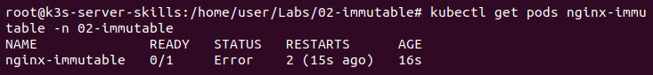
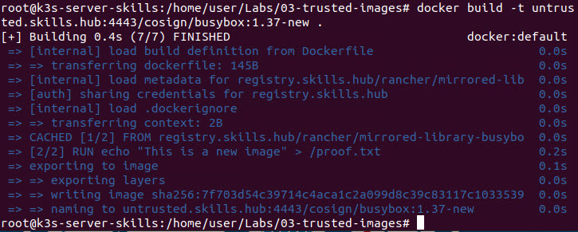
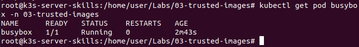
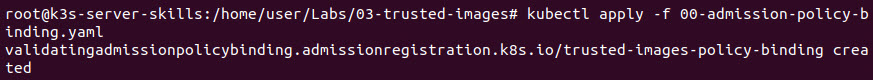
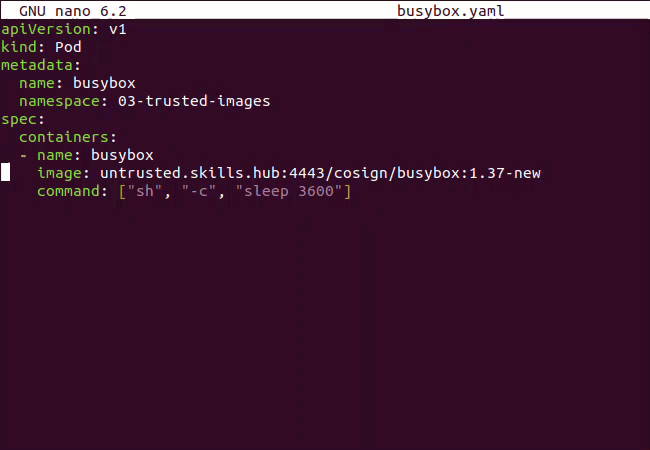
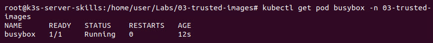
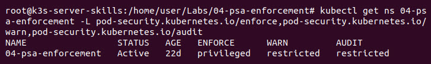

# Hardening Kubernetes: Pod Security

Kubernetes has become a critical part of modern IT infrastructure as organizations increasingly adopt cloud-native architectures and microservices to improve efficiency and scalability. Because Kubernetes' environments often contain sensitive data and control access to business-critical systems, securing them is essential. This lab focuses on the Pod Security section of the <a href="https://media.defense.gov/2022/Aug/29/2003066362/-1/-1/0/CTR_KUBERNETES_HARDENING_GUIDANCE_1.2_20220829.PDF" target="_blank">Joint Cybersecurity Technical Report: Kubernetes Hardening guide</a> published by CISA in collaboration with the National Security Agency (NSA). The hands-on exercises provide examples and a chance to practice using the recommendations detailed in the guide.

| &#9201; LAB TIME |
|---|
| This lab is expected to take ninety (90) minutes. |

*Please consider filling out the lab feedback survey at the bottom of your screen. The survey is available to you at any time while conducting the lab.*

| &#9888; CAUTION |
|---|
| You must complete *all* phases of the lab to receive your completion certificate. |

## Learning Objectives

- Recognize insecure default configurations in Kubernetes workloads and comprehend their security implications.
- Apply Pod security recommendations from the *Kubernetes Hardening Guide* to mitigate specific risks.
- Compare workload behavior before and after hardening to see the impact of each security measure.

## Learner Expectations

- Learners should be comfortable with command-line operations.

## FOCAL and NICE Framework Mappings

This lab maps with <a href="https://www.cisa.gov/resources-tools/resources/federal-civilian-executive-branch-fceb-operational-cybersecurity-alignment-focal-plan" target="_blank">Federal Civilian Executive Branch (FCEB) Operational Cybersecurity Alignment (FOCAL)</a> Area 3 (Defensible Architecture) by promoting resiliency through the application of hardening recommendations.

**NICE Work Role**

- <a href="https://niccs.cisa.gov/workforce-development/nice-framework" target="_blank">Systems Administration</a>

**NICE Tasks**

- <a href="https://niccs.cisa.gov/workforce-development/nice-framework" target="_blank">T1228</a>: Maintain baseline system security.
- <a href="https://niccs.cisa.gov/workforce-development/nice-framework" target="_blank">T1527</a>: Define baseline system security requirements.
- <a href="https://niccs.cisa.gov/workforce-development/nice-framework" target="_blank">T1578</a>: Monitor system and server configurations.
- <a href="https://niccs.cisa.gov/workforce-development/nice-framework" target="_blank">T1579</a>: Maintain system and server configurations.

<!-- cut -->

## Scenario

This lab follows the **Kubernetes Pod Security** section of the *Kubernetes Hardening Guide* through a series of isolated phases. Each phase focuses on a specific hardening measure such as non-root containers, immutable container file systems, building secure container images, Pod security enforcement, protecting service account tokens, and hardening container environments. For each measure, you first observe the insecure default behavior, then apply the guide’s recommended configuration to see its impact in a controlled Kubernetes environment. The lab demonstrates how these Pod Security measures strengthen container workloads and reduce the attack surface in Kubernetes clusters.

| &#8505; NOTE |
| ---- |
| Each phase uses a unique namespace and working directory to isolate experiments and avoid resource conflicts. |

## System Tools and Credentials

|     system     | IP address | operating system | username | password |
|----------------|------------|------------------|----------|----------|
| Ubuntu Desktop |  10.3.3.X (DHCP) |      Ubuntu      |   user   | tartans  |
|   k3s-server   | 10.3.3.10  |      Ubuntu      |   user   | tartans  |

## Kubernetes Overview

The name Kubernetes originates from the Ancient Greek word for "pilot" or "helmsman" of a ship. This name was intentionally chosen by Google, the originators of Kubernetes, because of the role Kubernetes plays in container orchestration. From the <a href="https://kubernetes.io/" target="_blank">official Kubernetes website</a>, Kubernetes is an open source system for automating deployment, scaling, and management of containerized applications. It ensures these applications are running smoothly, can handle changes on-demand, and recover if something goes wrong.

| &#128270; SO WHAT IS K8S? |
| --- |
| "K8s" is a numeronym for Kubernetes. The 8 represents the eight characters between the "k" and "s". It is common to see Kubernetes shortened to k8s. |

Containers are a technology that combine the code for an application with the configurations required to run the code. Having these components combined into a single image eliminates dependencies and provides a great deal of flexibility. This allows them to be quickly created and destroyed. They also typically require less system resources and can be run on virtually any operating system with a container engine installed.

A Kubernetes cluster has two primary components: a *control plane* and at least one *worker node*.

### Control Plane

The control plane is made of several individual components that work together to oversee the Kubernetes cluster and ensure that nodes and Pods are created, modified, and deleted successfully. Components of the control plane include:
- **API Server** - Exposes the Kubernetes API allowing the cluster to be interacted with by other components in the cluster and the command line using `kubectl` and `kubeadm`.
- **Etcd** - An open source key value store used to save all data about the state of the cluster. Only the Kube API server can directly communicate with etcd.
- **Scheduler** - Identifies newly created Pods without worker nodes and chooses a node for the Pod to run on.
- **Controller Manager** - Runs a loop to continuously check on the status of the cluster, making sure things are running properly. If something is broken, it removes the node and replaces it with a new worker node.
- **Cloud Controller Manager** - Allows for connection to a cloud provider's API allowing cloud resources to be used by the cluster.

### Worker Node(s)

Every Kubernetes cluster has at least one worker node, though a minimum of three is recommended for redundancy. Worker nodes can be physical or virtual and are where Pods are run. Components of a worker node include:

- **Kubelet** - An agent that runs on the worker node and communicates directly with the Kube API Server. It looks for new Pods that have been assigned to run on the worker node.
- **Container Runtime** - Responsible for starting the container(s) once Pods have been assigned to the worker node.
- **Kube-proxy** - Communicates directly with the Kube API Server and ensures Pods and services on the worker node can communicate with other Pods and the control plane.


*Source: https://kubernetes.io/docs/concepts/overview/components/*

### Quick Reference

- **Container Image** – A lightweight, standalone software package that includes an application and everything it needs to run. A container image can be run as a container.
- **Control Plane** - The part of Kubernetes that makes decisions and manages the Kubernetes cluster.
- **kubectl** – The command-line tool used to interact with Kubernetes. It can deploy applications, inspect and manage cluster resources, and view logs.
- **Namespaces** - Provides a way to isolate groups of resources within a single Kubernetes cluster.
- **Node** – A physical or virtual machine that runs Pods.
- **Pod** – The smallest unit in Kubernetes; it runs one or more container images.

## Accessing the Kubernetes Server

1. Open the `Ubuntu-Desktop` console.

2. (**Ubuntu-Desktop**) Open a Terminal by clicking on the Terminal shortcut in the left launcher.

    

3. (**Ubuntu-Desktop**, **Terminal**) Use SSH to connect to the `K3s-Server` by typing the command `ssh user@10.3.3.10` and pressing <kbd>Enter</kbd>. If asked if you want to continue connecting, type `yes` and press <kbd>Enter</kbd>.

4. (**Ubuntu-Desktop**, **Terminal**) Type the password `tartans` and press <kbd>Enter</kbd> to connect.

5. (**Ubuntu-Desktop**, **SSH Session**) Switch to the root user by typing the command `sudo su` and pressing <kbd>Enter</kbd>.

6. (**Ubuntu-Desktop**, **SSH Session**) When prompted, type the password `tartans` and press <kbd>Enter</kbd>.

| &#128204; Leave this Terminal and SSH session open. You will use it throughout this lab. |
|---|

## Phase 1

| &#8505; NOTE |
|---|
| This phase aligns with the *Kubernetes Hardening Guide*'s call to use non-root containers. Rootless container engines are not covered here due to limited Kubernetes support. |

<details>
<summary>
<h3>"Non-root" Containers and "Rootless" Container Engines</h3>
</summary>
<p>

The *Kubernetes Hardening Guide* recommends running containers as *non-root users* whenever possible. Containers running as root present a security risk if compromised because they can modify the container file system, access sensitive data, or attempt to escape to the host system.

In this phase, we explore how containers behave with and without root privileges and how Kubernetes `securityContext` settings help enforce safer defaults.

| &#8505; We use BusyBox and NGINX containers to observe behavior differences between root and non-root execution. |
|---|
| **BusyBox** is a container image that has many basic Linux utilities in a very small size. You can read more about BusyBox on the <a href="https://hub.docker.com/_/busybox" target="_blank">BusyBox DockerHub page</a>. <br>**NGINX** is a multipurpose webserver. You can read more about NGINX on the <a href="https://hub.docker.com/_/nginx" target="_blank">NGINX DockerHub page</a>. |

### Initialize Namespace and Working Directory

To begin, verify you are operating within the correct namespace and file structure.

1. (**Ubuntu-Desktop**, **SSH Session**) Change to the Phase 1 directory by entering the following command.

   ```bash
   cd /home/user/Labs/01-nonroot
   ```

2. (**Ubuntu-Desktop**, **SSH Session**) Set the Kubernetes context to the Phase 1 namespace by entering the following command.

   ```bash
   kubectl config set-context --current --namespace=$(basename "$PWD")
   ```

3. (**Ubuntu-Desktop**, **SSH Session**) Confirm the correct namespace is active by entering the following command.

   ```bash
   kubectl config view --minify | grep namespace
   ```

   

   You should see `namespace: 01-nonroot` in the output, which is the correct namespace. If not, repeat the previous two steps.

</p>
</details>

<details>
<summary>
<h3>Run BusyBox as Root and Observe File Permissions</h3>
</summary>
<p>

Begin by running BusyBox *with default (root) permissions*, which can help us understand the potential risks of containers running as root.

| &#129513; KEY POINT  |
| ---- |
| Many container images, including BusyBox, run as root by default unless explicitly restricted. |

1. (**Ubuntu-Desktop**, **SSH Session**) Create a new manifest file for the BusyBox Pod by entering the following command.

   ```bash
   nano busybox-root.yaml
   ```

    | &#128736; MANIFEST FILE |
    |---|
    | In Kubernetes, a manifest file is a YAML file that describes a resource. Here a manifest file is being created to describe how the BusyBox container image should be run. Later in this lab you create other manifest files to define and apply security policies. |

2. (**Ubuntu-Desktop**, **SSH Session**) Create the manifest by pasting the following configuration into the Nano editor.

   ```yaml
   apiVersion: v1
   kind: Pod
   metadata:
     name: busybox-root
     namespace: 01-nonroot
   spec:
     containers:
     - name: busybox
       image: registry.skills.hub/rancher/mirrored-library-busybox:1.37
       command: ["sh", "-c", "sleep 3600"]
   ```

    | &#9888; This pod runs as root (UID 0) because no `securityContext` is specified. |
    | --- |

3. (**Ubuntu-Desktop**, **SSH Session**, **Nano Editor**) Write out (save) your changes in Nano by pressing <kbd>Ctrl</kbd>+<kbd>o</kbd>.

4. (**Ubuntu-Desktop**, **SSH Session**, **Nano Editor**) Confirm the filename by pressing <kbd>Enter</kbd>.

5. (**Ubuntu-Desktop**, **SSH Session**, **Nano Editor**) Exit Nano by pressing <kbd>Ctrl</kbd>+<kbd>x</kbd>.

6. (**Ubuntu-Desktop**, **SSH Session**) Deploy the manifest by entering the following command.

    ```bash
    kubectl apply -f busybox-root.yaml
    ```

    Confirm you receive a response of "pod/busybox-root created".

7. (**Ubuntu-Desktop**, **SSH Session**) Verify the Pod successfully deployed by entering the following command.

    ```bash
    kubectl get pod busybox-root -n 01-nonroot
    ```

    

    The Pod should have a status of "Running".

8. (**Ubuntu-Desktop**, **SSH Session**) Open an interactive shell on the container by entering the following command.

   ```bash
   kubectl exec -it busybox-root -n 01-nonroot -- sh
   ```

9. (**Ubuntu-Desktop**, **SSH Session**, **Shell Session to BusyBox Pod**) Type the following command to print the text "can write" to standard output and then redirect it (`>`) to a file named "proof-root.txt" on the root directory.

   ```bash
   echo "can write" > /proof-root.txt
   ```

10. (**Ubuntu-Desktop**, **SSH Session**, **Shell Session to BusyBox Pod**) Use `cat` to read the contents of the file you just created by typing the following command. It will print the text "can write" to the terminal, confirming you were able to successfully write to the root directory.

    ```bash
    cat /proof-root.txt
    ```

    | &#129513; SECURITY RISK |
    | ------------- |
    | Containers running as root can modify any file in the container file system. If exploited, an attacker could write scripts, install software, or exploit host resources. |

11. (**Ubuntu-Desktop**, **SSH Session**, **Shell Session to BusyBox Pod**) Close the interactive shell by typing `exit` and pressing <kbd>Enter</kbd>.

   | &#9888; WARNING |
   |---|
   | Make sure you are still connected to the `k3s-server-skills` as the `root` user (your terminal should start with: `root@k3s-server-skills:`). If not, follow the steps in "Accessing the Kubernetes Server" to reconnect. |

</p>
</details>

<details>
<summary>
<h3>Run BusyBox as Non-root and Observe File Permissions</h3>
</summary>
<p>

To restrict running BusyBox as a *non-root user*, a `securityContext` can be applied to the manifest.

| &#128736; ENFORCING A USER ID |
| ---- |
| `securityContext.runAsUser` enforces a specific User ID (UID), improving isolation. Kubernetes does not default to non-root; it must be manually configured. |

1. (**Ubuntu-Desktop**, **SSH Session**) Use Nano to open the `busybox-nonroot.yaml` file by entering the following command.

   ```bash
   nano busybox-nonroot.yaml
   ```

2. (**Ubuntu-Desktop**, **Terminal**, **SSH Session**) Add the `securityContext` configuration to the end of the file by using <kbd>&#11015;</kbd> on your keyboard to move the cursor and paste the following configuration into the Nano editor.

   ```yaml
       securityContext:
         runAsUser: 1000
   ```

   The full configuration should now match the following.

   ```yaml
   apiVersion: v1
   kind: Pod
   metadata:
     name: busybox-nonroot
     namespace: 01-nonroot
   spec:
     containers:
     - name: busybox
       image: registry.skills.hub/rancher/mirrored-library-busybox:1.37
       command: ["sh", "-c", "sleep 3600"]
       securityContext:
         runAsUser: 1000
   ```

   | &#9888; UID 1000 is a common unprivileged user ID in Linux systems. |
   |---|

3. (**Ubuntu-Desktop**, **SSH Session**, **Nano Editor**) Write out (save) your changes in Nano by pressing <kbd>Ctrl</kbd>+<kbd>o</kbd>.

4. (**Ubuntu-Desktop**, **SSH Session**, **Nano Editor**) Confirm the filename by pressing <kbd>Enter</kbd>.

5. (**Ubuntu-Desktop**, **SSH Session**, **Nano Editor**) Exit Nano by pressing <kbd>Ctrl</kbd>+<kbd>x</kbd>.

6. (**Ubuntu-Desktop**, **SSH Session**) Deploy the manifest by entering the following command.

   ```bash
   kubectl apply -f busybox-nonroot.yaml
   ```

    Confirm you receive a response of "pod/busybox-nonroot created".

7. (**Ubuntu-Desktop**, **SSH Session**) Open an interactive shell on the container by entering the following command.

   ```bash
   kubectl exec -it busybox-nonroot -- sh
   ```

8. (**Ubuntu-Desktop**, **SSH Session**, **Shell Session to BusyBox Pod**) Type the following command to print the text "will fail" to standard output and then attempt to redirect it (`>`) to a file named "proof-nonroot.txt" on the root directory.

   ```bash
   echo "will fail" > /proof-nonroot.txt
   ```

    You receive a "Permission denied" message.

    | &#129513; KEY POINT |
    | --- |
    | Since UID 1000 is an unprivileged user, it does not have permission to write to the root file system. |

9. (**Ubuntu-Desktop**, **SSH Session**, **Shell Session to BusyBox Pod**) Type the following command to print the text "will not fail" to standard output and redirect it (`>`) to a file named "proof-nonroot.txt" in the `/tmp` directory.

   ```bash
   echo "will not fail" > /tmp/proof-nonroot.txt
   ```

10. (**Ubuntu-Desktop**, **SSH Session**, **Shell Session to BusyBox Pod**) List the contents of the `/tmp` directory by entering the following command.

    ```bash
    ls -l /tmp/
    ```

    You should see the "proof-nonroot.txt" file you just created.

11. (**Ubuntu-Desktop**, **SSH Session**, **Shell Session to BusyBox Pod**) Use `cat` to read the contents of the `/tmp/proof-nonroot.txt` file by typing the following command.

    ```bash
    cat /tmp/proof-nonroot.txt
    ```

    The text "will not fail" prints to the terminal, confirming you were able to successfully write to the `/tmp` directory.


    | &#129513; BEST PRACTICE |
    | ------------- |
    | Using non-root containers limits what an attacker can do. They cannot write to most of the container file system, making persistence and escalation more difficult. |

12. (**Ubuntu-Desktop**, **SSH Session**, **Shell Session to BusyBox Pod**) Close the interactive shell by typing `exit` and pressing <kbd>Enter</kbd>.

    | &#9888; WARNING |
    |---|
    | Make sure you are still connected to the `k3s-server-skills` as the `root` user (your terminal should start with: `root@k3s-server-skills:`). If not, follow the steps in "Accessing the Kubernetes Server" to reconnect. |

</p>
</details>

<details>
<summary>
<h3>Run NGINX as Root Versus Non-root</h3>
</summary>
<p>

NGINX expects to write to directories such as `/run` and `/var`, which are owned by `root`. Let us test how NGINX behaves when running with and without `root` permissions.

#### Run NGINX as root

1. (**Ubuntu-Desktop**, **SSH Session**) A manifest file with the NGINX container image running as `root` has already been created. Deploy the manifest by entering the following command.

   ```bash
   kubectl apply -f nginx-root.yaml
   ```

   Confirm you receive a response of "pod/nginx-root created".

2. (**Ubuntu-Desktop**, **SSH Session**) Verify the Pod successfully deployed by entering the following command.

   ```bash
   kubectl get pod nginx-root -n 01-nonroot
   ```

   The Pod should have a status of "Running".

3. (**Ubuntu-Desktop**, **SSH Session**) Verify there are no errors in the NGINX logs by entering the following command.

   ```bash
   kubectl logs nginx-root -n 01-nonroot
   ```

   

#### Run NGINX as Non-root

1. (**Ubuntu-Desktop**, **Terminal**, **SSH Session**) Use Nano to open the `nginx-nonroot.yaml` file by entering the following command.

   ```bash
   nano nginx-nonroot.yaml
   ```

2. (**Ubuntu-Desktop**, **Terminal**, **SSH Session**) Add the `securityContext` configuration to the end of the file by using <kbd>&#11015;</kbd> on your keyboard to move the cursor and paste the following configuration into the Nano editor.

   ```yaml
       securityContext:
         runAsUser: 101
   ```

   The full configuration should now match the following.

   ```yaml
   apiVersion: v1
   kind: Pod
   metadata:
     name: nginx-nonroot
     namespace: 01-nonroot
   spec:
     containers:
     - name: nginx
       image: registry.skills.hub/rancher/nginx:1.29
       ports:
       - containerPort: 80
       args: ["nginx", "-g", "daemon off;"]
       securityContext:
         runAsUser: 101
   ```

3. (**Ubuntu-Desktop**, **SSH Session**, **Nano Editor**) Write out (save) your changes in Nano by pressing <kbd>Ctrl</kbd>+<kbd>o</kbd>.

4. (**Ubuntu-Desktop**, **SSH Session**, **Nano Editor**) Confirm the filename by pressing <kbd>Enter</kbd>.

5. (**Ubuntu-Desktop**, **SSH Session**, **Nano Editor**) Exit Nano by pressing <kbd>Ctrl</kbd>+<kbd>x</kbd>.

6. (**Ubuntu-Desktop**, **SSH Session**) Deploy the manifest by entering the following command.

   ```bash
   kubectl apply -f nginx-nonroot.yaml
   ```

   Confirm you receive a response of "pod/nginx-nonroot created".

7. (**Ubuntu-Desktop**, **SSH Session**) Check the Nginx logs by entering the following command.

   ```bash
   kubectl logs nginx-nonroot -n 01-nonroot
   ```

   

   Notice the error messages in the logs indicating a file could not be modified (written to) and permission denied when trying to create directories. Running NGINX as a non-root user causes the application to break.

    | &#129513; LEARNING POINT |
    | -------------- |
    | Not all apps are "non-root ready". You might need to mount writable volumes or use non-root-compatible images. |

</p>
</details>

<details>
<summary>
<h3>Grading Check</h3>
</summary>
<p>

1. (**Ubuntu-Desktop, Firefox**) Browse to `https://skills.hub/lab/tasks` or click **Tasks** from the Skills Hub landing page.

2. (**Ubuntu-Desktop, Firefox, Skills Hub Tasks**) At the task for Phase 1, click the **Submit** button to start the grading process.

3. (**Ubuntu-Desktop, Firefox, Skills Hub Grading Results**) Successfully completing all steps in Phase 1 provides a "Result" token. Copy this eight (8) character hexadecimal token into the corresponding question submission field to receive credit.

*Complete all Phase 1 tasks before moving on to Phase 2.*

</p>
</details>

<details>
<summary>
<h3>Phase 1 Wrap-Up</h3>
</summary>
<p>

| &#128204; SECURITY STRATEGY |
| ----------------- |
| Instead of allowing containers to run as full root, set user privileges to restrict access to the root file system. Some containers require additional configurations to allow them to run as a non-root user. |

We learned that:

- Root containers are powerful and risky.
- Kubernetes lets you limit user privileges via `securityContext.runAsUser`.
- Some applications (like NGINX) may break when not run as root.

In the next phase, we lock down containers even more using *immutable file systems*, preventing even legitimate users from modifying base layers.

</p>
</details>

## Phase 2

<details>
<summary>
<h3>Immutable Container File Systems</h3>
</summary>
<p>

The *Kubernetes Hardening Guide* recommends making container root file systems read-only to reduce the impact of a compromise. Attackers often rely on writing scripts, modifying configuration files, or installing tools into a writable container environment. By locking down the root file system, these actions are blocked.

Some applications need to write to certain paths during startup or normal operation. The guide advises using ephemeral writable volumes mounted only where required, keeping the rest of the container immutable. We continue using the NGINX container, now with an immutable root, and gradually restore just the paths it needs to function correctly.

| &#128270; WHAT IS AN IMMUTABLE CONTAINER? |
|---|
| An immutable container is one whose root file system is mounted as read-only at runtime, preventing changes to files in the base image. Writable areas are provided through temporary, explicitly defined volumes, ensuring changes are limited in scope and discarded when the container stops. |

### Initialize Namespace and Working Directory

To begin, verify you are operating within the correct namespace and file structure.

1. (**Ubuntu-Desktop**, **SSH Session**) Change to the Phase 2 directory by entering the following command.

   ```bash
   cd /home/user/Labs/02-immutable
   ```

2. (**Ubuntu-Desktop**, **SSH Session**) Set the Kubernetes context to the lesson namespace by entering the following command.

   ```bash
   kubectl config set-context --current --namespace=$(basename "$PWD")
   ```

3. (**Ubuntu-Desktop**, **SSH Session**) Confirm the correct namespace is active by entering the following command.

   ```bash
   kubectl config view --minify | grep namespace
   ```

  You should see `namespace: 02-immutable` in the output, which is the correct namespace. If not, repeat the previous two steps.

</p>
</details>

<details>
<summary>
<h3>Run NGINX with a Read-Only Root File System</h3>
</summary>
<p>

We will configure NGINX to use a *read-only root file system*, while still running as a non-root user. No writable volumes are mounted yet.

| &#128736; ENFORCING READ-ONLY ROOT FILE SYSTEM |
| ---- |
| Adding the `readOnlyRootFilesystem: true` to a container manifest file sets the root file system to read-only. This ensures no part of the container's root file system can be modified, hardening the container even if it is running as root. |

1. (**Ubuntu-Desktop**, **SSH Session**) Use Nano to open the `nginx-readonly.yaml` file by entering the following command.

   ```bash
   nano nginx-readonly.yaml
   ```

2. (**Ubuntu-Desktop**, **Terminal**, **SSH Session**) Add the `readOnlyRootFilesystem` key to the end of the file by using <kbd>&#11015;</kbd> on your keyboard to move the cursor and then paste the following configuration into the Nano editor.

   ```yaml
         readOnlyRootFilesystem: true
   ```

   The full configuration should now match the following.

   ```yaml
   apiVersion: v1
   kind: Pod
   metadata:
     name: nginx-readonly
     namespace: 02-immutable
   spec:
     containers:
     - name: nginx
       image: registry.skills.hub/rancher/nginx:1.29
       ports:
         - containerPort: 80
       args: ["nginx", "-g", "daemon off;"]
       securityContext:
         runAsUser: 101
         readOnlyRootFilesystem: true
   ```

3. (**Ubuntu-Desktop**, **SSH Session**, **Nano Editor**) Write out (save) your changes in Nano by pressing <kbd>Ctrl</kbd>+<kbd>o</kbd>.

4. (**Ubuntu-Desktop**, **SSH Session**, **Nano Editor**) Confirm the filename by pressing <kbd>Enter</kbd>.

5. (**Ubuntu-Desktop**, **SSH Session**, **Nano Editor**) Exit Nano by pressing <kbd>Ctrl</kbd>+<kbd>x</kbd>.

6. (**Ubuntu-Desktop**, **SSH Session**) Deploy the manifest by entering the following command.

   ```bash
   kubectl apply -f nginx-readonly.yaml
   ```

   Confirm you receive a response of "pod/nginx-readonly created".

7. (**Ubuntu-Desktop**, **SSH Session**) Verify the Pod deployed by entering the following command.

   ```bash
   kubectl get pods nginx-readonly -n 02-immutable
   ```

   

   The Pod should have a status of "Error" or "CrashLoopBackOff".

8. (**Ubuntu-Desktop**, **SSH Session**) Check the NGINX logs by entering the following command.

   ```bash
   kubectl logs nginx-readonly -n 02-immutable
   ```

   

   Notice the error messages in the logs for being unable to create a directory. These error appears because NGINX tries to write to `/var/cache/nginx`, but the root file system is now read-only.

</p>
</details>

<details>
<summary>
<h3>Add Ephemeral Writable Storage for /var/cache/nginx</h3>
</summary>
<p>

To resolve the cache directory write error, we can mount an ephemeral `emptyDir` volume at `/var/cache/nginx`.

| &#8505; MOUNTING AN EPHEMERAL VOLUME |
| ---- |
| `emptyDir` provides temporary, container-local writable space. Once the container stops, the data is discarded. |

1. (**Ubuntu-Desktop**, **SSH Session**) Use Nano to open the `nginx-immutable.yaml` file by entering the following command.

   ```bash
   nano nginx-immutable.yaml
   ```

2. (**Ubuntu-Desktop**, **SSH Session**) Add a writable volume mount for `/var/cache/nginx` by using <kbd>&#11015;</kbd> on your keyboard to move the cursor to the end of the file and then paste the following configuration into the Nano editor.

   ```yaml
       volumeMounts:
         - name: cache
           mountPath: /var/cache/nginx
     volumes:
       - name: cache
         emptyDir: {}
   ```

   The full configuration should now match the following.

   ```yaml
   apiVersion: v1
   kind: Pod
   metadata:
     name: nginx-immutable
     namespace: 02-immutable
   spec:
     containers:
     - name: nginx
       image: registry.skills.hub/rancher/nginx:1.29
       ports:
         - containerPort: 80
       args: ["nginx", "-g", "daemon off;"]
       securityContext:
         runAsUser: 101
         readOnlyRootFilesystem: true
       volumeMounts:
         - name: cache
           mountPath: /var/cache/nginx
     volumes:
       - name: cache
         emptyDir: {}
   ```

3. (**Ubuntu-Desktop**, **SSH Session**, **Nano Editor**) Write out (save) your changes in Nano by pressing <kbd>Ctrl</kbd>+<kbd>o</kbd>.

4. (**Ubuntu-Desktop**, **SSH Session**, **Nano Editor**) Confirm the filename by pressing <kbd>Enter</kbd>.

5. (**Ubuntu-Desktop**, **SSH Session**, **Nano Editor**) Exit Nano by pressing <kbd>Ctrl</kbd>+<kbd>x</kbd>.

6. (**Ubuntu-Desktop**, **SSH Session**) Deploy the manifest by entering the following command.

   ```bash
   kubectl apply -f nginx-immutable.yaml
   ```

   Confirm you receive a response of "pod/nginx-immutable created".

7. (**Ubuntu-Desktop**, **SSH Session**) Verify the Pod deployed by entering the following command.

   ```bash
   kubectl get pods nginx-immutable -n 02-immutable
   ```

   

   The Pod should have a status of "Error" or "CrashLoopBackOff".

8. (**Ubuntu-Desktop**, **SSH Session**) Check the NGINX logs by entering the following command.

   ```bash
   kubectl logs nginx-immutable -n 02-immutable
   ```

   

   Notice the error messages in the logs. With the cache directory writable, NGINX now fails at the next location it needs: `/run`.

</p>
</details>

<details>
<summary>
<h3>Mount Writable Storage for /run and Validate Clean Execution</h3>
</summary>
<p>

Next, we provide a second ephemeral volume at `/run` so NGINX can write its PID file. This completes the minimal set of writable paths required for NGINX to run while keeping the root file system locked down.

1. (**Ubuntu-Desktop**, **SSH Session**) Use Nano to open the `nginx-immutable.yaml` file with the following command.

   ```bash
   nano nginx-immutable.yaml
   ```

2. (**Ubuntu-Desktop**, **SSH Session**) Use <kbd>&#11015;</kbd> on your keyboard to move the cursor to the end of the file. Delete the `volumeMounts` and `volumes` sections and paste the following configuration into the Nano editor.

   ```yaml
       volumeMounts:
         - name: cache
           mountPath: /var/cache/nginx
         - name: run
           mountPath: /run
     volumes:
       - name: cache
         emptyDir: {}
       - name: run
         emptyDir: {}
   ```

   The full configuration should now match the following.

   ```yaml
   apiVersion: v1
   kind: Pod
   metadata:
     name: nginx-immutable
     namespace: 02-immutable
   spec:
     containers:
     - name: nginx
       image: registry.skills.hub/rancher/nginx:1.29
       ports:
         - containerPort: 80
       args: ["nginx", "-g", "daemon off;"]
       securityContext:
         runAsUser: 101
         readOnlyRootFilesystem: true
       volumeMounts:
         - name: cache
           mountPath: /var/cache/nginx
         - name: run
           mountPath: /run
     volumes:
       - name: cache
         emptyDir: {}
       - name: run
         emptyDir: {}
   ```

3. (**Ubuntu-Desktop**, **SSH Session**, **Nano Editor**) Write out (save) your changes in Nano by pressing <kbd>Ctrl</kbd>+<kbd>o</kbd>.

4. (**Ubuntu-Desktop**, **SSH Session**, **Nano Editor**) Confirm the filename by pressing <kbd>Enter</kbd>.

5. (**Ubuntu-Desktop**, **SSH Session**, **Nano Editor**) Exit Nano by pressing <kbd>Ctrl</kbd>+<kbd>x</kbd>.

6. (**Ubuntu-Desktop**, **SSH Session**) Delete the currently running NGINX Pod by entering the following command.

   ```bash
   kubectl delete pod nginx-immutable -n 02-immutable --force
   ```

7. (**Ubuntu-Desktop**, **SSH Session**) Deploy the manifest by entering the following command.

   ```bash
   kubectl apply -f nginx-immutable.yaml
   ```

   Confirm you receive a response of "pod/nginx-immutable created".

8. (**Ubuntu-Desktop**, **SSH Session**) Verify the Pod successfully deployed by entering the following command.

   ```bash
   kubectl get pod nginx-immutable -n 02-immutable
   ```

   The Pod should have a status of "Running". Creating the `/run` ephemeral volume allowed NGINX to successfully start with the immutable file system.

</p>
</details>

<details>
<summary>
<h3>Grading Check</h3>
</summary>
<p>

1. (**Ubuntu-Desktop, Firefox**) Browse to `https://skills.hub/lab/tasks` or click **Tasks** from the Skills Hub landing page.

2. (**Ubuntu-Desktop, Firefox, Skills Hub Tasks**) At the task for Phase 2, click the **Submit** button to start the grading process.

3. (**Ubuntu-Desktop, Firefox, Skills Hub Grading Results**) Successfully completing all steps in Phase 2 provides a "Result" token. Copy this eight (8) character hexadecimal token into the corresponding question submission field to receive credit.

*Complete all Phase 2 tasks before moving on to Phase 3.*

</p>
</details>

<details>
<summary>
<h3>Phase 2 Wrap-Up</h3>
</summary>
<p>

| &#128204; SECURITY STRATEGY |
| ----------------- |
| Keep the container immutable except where write access is absolutely required. This reduces the attack surface without breaking application functionality. |

This phase applied the *Kubernetes Hardening Guide*'s recommendation to use `readOnlyRootFilesystem: true` combined with targeted writable volumes.

</p>
</details>

## Phase 3

<details>
<summary>
<h3>Building Secure Container Images</h3>
</summary>
<p>

Container images can be created from scratch or layered on top of existing public container images. According to the *Kubernetes Hardening Guide*, unverified base images and weak supply chain controls create security gaps. This phase focuses on hardening the image supply chain with trusted registries, digest pinning, signature verification, and vulnerability attestations.

### Initialize Namespace and Working Directory

To begin, verify you are operating within the correct namespace and file structure.

1. (**Ubuntu-Desktop**, **SSH Session**) Change to the Phase 3 directory by entering the following command.

   ```bash
   cd /home/user/Labs/03-trusted-images
   ```

2. (**Ubuntu-Desktop**, **SSH Session**) Set the Kubernetes context to the lesson namespace by entering the following command.

   ```bash
   kubectl config set-context --current --namespace=$(basename "$PWD")
   ```

3. (**Ubuntu-Desktop**, **SSH Session**) Confirm the correct namespace is active by entering the following command.

   ```bash
   kubectl config view --minify | grep namespace
   ```

  You should see `namespace: 03-trusted-images` in the output, which is the correct namespace. If not, repeat the previous two steps.

</p>
</details>

<details>
<summary>
<h3>Build and Push a Minimal Image to a Registry</h3>
</summary>
<p>

Starting with an existing BusyBox image, we customize it and push the image to a container registry. This sets the foundation for *repository controls*, which can help enforce deploying images only from trusted registries.

1. (**Ubuntu-Desktop**, **SSH Session**) Create a `Dockerfile` to define your image by entering the following command.

   ```bash
   nano Dockerfile
   ```

   | &#128270; WHAT IS A DOCKERFILE? |
   |---|
   | A `Dockerfile` is a declarative set of layered instructions that Docker uses to assemble a container image. Each instruction, such as FROM, RUN, or COPY, creates a new immutable layer in the image. |

2. (**Ubuntu-Desktop**, **SSH Session**) Paste the following configuration into the Nano editor to build a custom image. It uses the `BusyBox` trusted base and adds a proof file to verify the new image builds successfully.

   ```Dockerfile
   FROM registry.skills.hub/rancher/mirrored-library-busybox:1.37
   RUN echo "This is a new image" > /proof.txt
   ```

3. (**Ubuntu-Desktop**, **SSH Session**, **Nano Editor**) Write out (save) your changes in Nano by pressing <kbd>Ctrl</kbd>+<kbd>o</kbd>.

4. (**Ubuntu-Desktop**, **SSH Session**, **Nano Editor**) Confirm the filename by pressing <kbd>Enter</kbd>.

5. (**Ubuntu-Desktop**, **SSH Session**, **Nano Editor**) Exit Nano by pressing <kbd>Ctrl</kbd>+<kbd>x</kbd>.

6. (**Ubuntu-Desktop**, **SSH Session**) Log in to the registry used for publishing internal images by entering the following command.

   ```bash
   docker login untrusted.skills.hub:4443 -u user -p tartans
   ```

7. (**Ubuntu-Desktop**, **SSH Session**) To help differentiate this container image from others, build it with the tag `1.37-new` by entering the following command.

   ```bash
   docker build -t untrusted.skills.hub:4443/cosign/busybox:1.37-new .
   ```

   | &#9888; MAKE SURE TO INCLUDE THE PERIOD AT THE END OF THE BUILD COMMAND! |
   |---|

   

8. (**Ubuntu-Desktop**, **SSH Session**) Use the `push` command to add the container image you built to the repository by entering the following command.

   ```bash
   docker push untrusted.skills.hub:4443/cosign/busybox:1.37-new
   ```

   

   | &#8505; NOTE |
   | ---- |
   | We deploy a Pod using this image, then begin applying *repository restrictions* to enforce that future workloads only come from explicitly trusted sources. |

</p>
</details>

<details>
<summary>
<h3>Deploy a Pod Using the Image</h3>
</summary>
<p>

By default, Kubernetes does not restrict which repository a container image comes from as long as it can reach the registry. To demonstrate this, we can pull from the `untrusted.skills.hub` repository and deploy the container image you just created.

1. (**Ubuntu-Desktop**, **SSH Session**) Use Nano to open the `busybox.yaml` file by entering the following command.

   ```bash
   nano busybox.yaml
   ```

2. (**Ubuntu-Desktop**, **SSH Session**) Update the manifest so that the container image is pulled from the `untrusted.skills.hub` repository. Do this by using <kbd>&#11015;</kbd> on your keyboard to move the cursor to the end of the file and then paste the following configuration into the Nano editor.

   ```yaml
       image: untrusted.skills.hub:4443/cosign/busybox:1.37-new
       command: ["sh", "-c", "sleep 3600"]
   ```

   The full configuration should now match the following.

   ```yaml
   apiVersion: v1
   kind: Pod
   metadata:
     name: busybox
     namespace: 03-trusted-images
   spec:
     containers:
     - name: busybox
       image: untrusted.skills.hub:4443/cosign/busybox:1.37-new
       command: ["sh", "-c", "sleep 3600"]
   ```

3. (**Ubuntu-Desktop**, **SSH Session**, **Nano Editor**) Write out (save) your changes in Nano by pressing <kbd>Ctrl</kbd>+<kbd>o</kbd>.

4. (**Ubuntu-Desktop**, **SSH Session**, **Nano Editor**) Confirm the filename by pressing <kbd>Enter</kbd>.

5. (**Ubuntu-Desktop**, **SSH Session**, **Nano Editor**) Exit Nano by pressing <kbd>Ctrl</kbd>+<kbd>x</kbd>.

6. (**Ubuntu-Desktop**, **SSH Session**) Deploy the manifest by entering the following command.

   ```bash
   kubectl apply -f busybox.yaml
   ```

   

   Confirm you receive a response of "pod/busybox created".

7. (**Ubuntu-Desktop**, **SSH Session**) Verify the Pod successfully deployed by entering the following command.

   ```bash
   kubectl get pod busybox -n 03-trusted-images
   ```

   

   The Pod should have a status of "Running".

   | &#8505; NOTE |
   | ---- |
   | At this point, Kubernetes is not enforcing any registry restrictions. In the next section, we apply an **admission policy** that restricts allowed registries and requires all images to be referenced by immutable digests. |

</p>
</details>

<details>
<summary>
<h3>Apply Repository Controls via Admission Policy</h3>
</summary>
<p>

Using container images from unverified repositories creates a risk for supply chain attacks. A container image could be intentionally created with malicious or vulnerable applications installed. If your organization uses that image, those malicious or vulnerable applications are now present in your organization and could be exploited.

The Kubernetes Hardening Guide recommends using *repository controls* to restrict image sources to known, trusted registries. Using an *Admission Policy* we can enforce that container images must:

- Come from a specific trusted registry (`registry.skills.hub`)
- Be referenced by immutable digests, not mutable tags (e.g., `@sha256:...` instead of `:1.37`)

This policy inspects the images used by Pods and blocks anything that does not match our expectations.

| &#128270; WHAT IS AN IMAGE DIGEST? |
|---|
| An image digest is a cryptographic hash (e.g., sha256:...) that uniquely identifies a specific container image build. Unlike tags such as busybox:1.37, which can be re-pointed to different images over time, a digest always refers to the exact same image content. Using digests ensures that what you deploy is exactly what you tested. |

1. (**Ubuntu-Desktop**, **SSH Session**) Create a new manifest file for the admission policy by entering the following command.

   ```bash
   nano 00-admission-policy.yaml
   ```

2. (**Ubuntu-Desktop**, **SSH Session**) Create the manifest by pasting the following configuration into the Nano editor.

   ```yaml
   apiVersion: admissionregistration.k8s.io/v1
   kind: ValidatingAdmissionPolicy
   metadata:
     name: trusted-images-policy
   spec:
     failurePolicy: Fail
     matchConstraints:
       resourceRules:
         - apiGroups: [""]
           apiVersions: ["v1"]
           operations: ["CREATE", "UPDATE"]
           resources: ["pods"]
     variables:
       - name: containerImages
         expression: "object.spec.containers.map(c, c.image)"
       - name: initContainerImages
         expression: "has(object.spec.initContainers) ? object.spec.initContainers.map(c, c.image) : []"
       - name: allImages
         expression: "variables.containerImages + variables.initContainerImages"
     validations:
       - expression: "variables.allImages.all(img, img.startsWith('registry.skills.hub/'))"
         message: "All container images must come from registry.skills.hub/"
         reason: Forbidden
       - expression: "variables.allImages.all(img, img.contains('@sha256:'))"
         message: "All container images must use a digest (e.g., ...@sha256:<digest>)."
         reason: Forbidden
   ```

   Under `spec:` is where the configuration and validation logic is placed.

   - `failurePolicy: Fail` - Provides strict enforcement. If the policy requirements are not met, the action fails.
   - `matchConstraints:` specifies when this policy should run. Here `resources:` specifies that this policy should only apply to `pods` and `operations:` further specifies that it is when someone creates a new Pod or updates an existing Pod.
   - `variables:` are reusable values which here are gathering a list of image values so they can be validated.
   - `validations:` are the actual rules that are being enforced by this policy. Specifically, that every image name must start with `registry.skills.hub/` and every image must have a SHA256 digest in its name.

3. (**Ubuntu-Desktop**, **SSH Session**, **Nano Editor**) Write out (save) your changes in Nano by pressing <kbd>Ctrl</kbd>+<kbd>o</kbd>.

4. (**Ubuntu-Desktop**, **SSH Session**, **Nano Editor**) Confirm the filename by pressing <kbd>Enter</kbd>.

5. (**Ubuntu-Desktop**, **SSH Session**, **Nano Editor**) Exit Nano by pressing <kbd>Ctrl</kbd>+<kbd>x</kbd>.

6. (**Ubuntu-Desktop**, **SSH Session**) Deploy the manifest by entering the following command.

   ```bash
   kubectl apply -f 00-admission-policy.yaml
   ```

   

   Confirm you receive a response of "validatingadmissionpolicy.admissionregistration.k8s.io/trusted-images-policy created".

7. (**Ubuntu-Desktop**, **SSH Session**) Kubernetes separates rules and where those rules should be enforced. A binding tells Kubernetes where to apply the `00-admission-policy`. Create a new manifest file for the admission policy binding by entering the following command.

   ```bash
   nano 00-admission-policy-binding.yaml
   ```

8. (**Ubuntu-Desktop**, **SSH Session**) Create the manifest by pasting the following configuration into the Nano editor.

   ```yaml
   apiVersion: admissionregistration.k8s.io/v1
   kind: ValidatingAdmissionPolicyBinding
   metadata:
     name: trusted-images-policy-binding
   spec:
     policyName: trusted-images-policy
     validationActions: [Deny]
     matchResources:
       namespaceSelector:
         matchLabels:
           kubernetes.io/metadata.name: "03-trusted-images"
   ```

   | &#8505; NOTE |
   | ---- |
   | This policy binding tells Kubernetes to apply the policy only to Pods created in the `03-trusted-images` namespace. |

9. (**Ubuntu-Desktop**, **SSH Session**, **Nano Editor**) Write out (save) your changes in Nano by pressing <kbd>Ctrl</kbd>+<kbd>o</kbd>.

10. (**Ubuntu-Desktop**, **SSH Session**, **Nano Editor**) Confirm the filename by pressing <kbd>Enter</kbd>.

11. (**Ubuntu-Desktop**, **SSH Session**, **Nano Editor**) Exit Nano by pressing <kbd>Ctrl</kbd>+<kbd>x</kbd>.

12. (**Ubuntu-Desktop**, **SSH Session**) Deploy the manifest by entering the following command.

    ```bash
    kubectl apply -f 00-admission-policy-binding.yaml
    ```

    

    Confirm you receive a response of "validatingadmissionpolicybinding.admissionregistration.k8s.io/trusted-images-policy-binding created".

13. (**Ubuntu-Desktop**, **SSH Session**) Delete the currently running BusyBox Pod by entering the following command.

    ```bash
    kubectl delete pod busybox -n 03-trusted-images --force
    ```

14. (**Ubuntu-Desktop**, **SSH Session**) Attempt to deploy the manifest by entering the following command.

    ```bash
    kubectl apply -f busybox.yaml
    ```

    

    Notice the error message upon deployment attempt. Recall the BusyBox container image is using the `untrusted.skills.hub` registry. This is not an approved registry based on the admission policy applied to the `03-trusted-images` namespace so the deploy fails.

</p>
</details>

<details>
<summary>
<h3>Push Image to Trusted Registry and Test Digest Requirement</h3>
</summary>
<p>

The BusyBox Pod is failing deployment because it is pulling from the `untrusted.skills.hub` registry. To bring this container image into compliance, we push it to our trusted registry, `registry.skills.hub`.

1. (**Ubuntu-Desktop**, **SSH Session**) Log out from the `untrusted.skills.hub` registry by entering the following command.

   ```bash
   docker logout
   ```

2. (**Ubuntu-Desktop**, **SSH Session**) Log in to the `registry.skills.hub` registry by entering the following command.

   ```bash
   docker login registry.skills.hub -u user -p tartans
   ```

3. (**Ubuntu-Desktop**, **SSH Session**) Build and tag the image for the trusted registry by entering the following command.

   ```bash
   docker build -t registry.skills.hub/cosign/busybox:1.37-new .
   ```

   | &#9888; MAKE SURE TO INCLUDE THE PERIOD AT THE END OF THE BUILD COMMAND! |
   |---|

4. (**Ubuntu-Desktop**, **SSH Session**) Push it to the trusted registry by entering the following command.

   ```bash
   docker push registry.skills.hub/cosign/busybox:1.37-new
   ```

5. (**Ubuntu-Desktop**, **SSH Session**) Open Nano to edit the `busybox.yaml` manifest by entering the following command.

   ```bash
   nano busybox.yaml
   ```

6. (**Ubuntu-Desktop**, **SSH Session**) Update the `image:` key to use `registry.skills.hub/cosign/busybox:1.37-new`.

   

   The full configuration should now match the following.

   ```yaml
   apiVersion: v1
   kind: Pod
   metadata:
     name: busybox
     namespace: 03-trusted-images
   spec:
     containers:
     - name: busybox
       image: registry.skills.hub/cosign/busybox:1.37-new
       command: ["sh", "-c", "sleep 3600"]
   ```

7. (**Ubuntu-Desktop**, **SSH Session**, **Nano Editor**) Write out (save) your changes in Nano by pressing <kbd>Ctrl</kbd>+<kbd>o</kbd>.

8. (**Ubuntu-Desktop**, **SSH Session**, **Nano Editor**) Confirm the filename by pressing <kbd>Enter</kbd>.

9. (**Ubuntu-Desktop**, **SSH Session**, **Nano Editor**) Exit Nano by pressing <kbd>Ctrl</kbd>+<kbd>x</kbd>.

10. (**Ubuntu-Desktop**, **SSH Session**) Attempt to re-deploy the manifest by entering the following command.

    ```bash
    kubectl apply -f busybox.yaml
    ```

    

    Notice the error message is different this time. The deployment failed because the container image does not contain a digest as specified in the admission policy.

</p>
</details>

<details>
<summary>
<h3>Pin the Image by Digest and Deploy</h3>
</summary>
<p>

Now, let us obtain the *digest* for the image you just pushed, update your Pod manifest to use it, and verify that the Pod is accepted.

1. (**Ubuntu-Desktop**, **SSH Session**) Get the digest for the container image you created by entering the following command.

   ```bash
   docker manifest inspect registry.skills.hub/cosign/busybox:1.37-new -v | jq -r '.Descriptor.digest'
   ```

   

2. (**Ubuntu-Desktop**, **SSH Session**) Highlight and copy the result from the Terminal. It will look similar to the following digest.

   ```bash
   sha256:e5327a11b505f246d63788e79f5a6016e803ce5594bbef4ba4d5f325b4d5f188
   ```

   | &#128736; HELPFUL TIP |
   |---|
   | Open *Text Editor* or *Visual Studio Code* on `Ubuntu-Desktop` and paste your digest there. This will keep it handy for the upcoming steps that require it. |

3. (**Ubuntu-Desktop**, **SSH Session**) Use Nano to open `busybox.yaml` by entering the following command.

   ```bash
   nano busybox.yaml
   ```

4. (**Ubuntu-Desktop**, **SSH Session**) Replace the `image:` key by pasting the following configuration into Nano. **Make sure to use the digest you obtained from the command above to replace <YOUR_DIGEST_VALUE_HERE>.**

   ```yaml
       image: registry.skills.hub/cosign/busybox@<YOUR_DIGEST_VALUE_HERE>
   ```

   

   The full configuration should now match the following. Remember your SHA256 value will be different!

   ```yaml
   apiVersion: v1
   kind: Pod
   metadata:
     name: busybox
     namespace: 03-trusted-images
   spec:
     containers:
     - name: busybox
       image: registry.skills.hub/cosign/busybox@sha256:e5327a11b505f246d63788e79f5a6016e803ce5594bbef4ba4d5f325b4d5f188
       command: ["sh", "-c", "sleep 3600"]
   ```

5. (**Ubuntu-Desktop**, **SSH Session**, **Nano Editor**) Write out (save) your changes in Nano by pressing <kbd>Ctrl</kbd>+<kbd>o</kbd>.

6. (**Ubuntu-Desktop**, **SSH Session**, **Nano Editor**) Confirm the filename by pressing <kbd>Enter</kbd>.

7. (**Ubuntu-Desktop**, **SSH Session**, **Nano Editor**) Exit Nano by pressing <kbd>Ctrl</kbd>+<kbd>x</kbd>.

8. (**Ubuntu-Desktop**, **SSH Session**) Re-deploy the manifest by entering the following command.

   ```bash
   kubectl apply -f busybox.yaml
   ```

   

   Confirm you receive a response of "pod/busybox created".

9. (**Ubuntu-Desktop**, **SSH Session**) Verify the Pod successfully deployed by entering the following command.

   ```bash
   kubectl get pod busybox -n 03-trusted-images
   ```

   

   The Pod should have a status of "Running".

</p>
</details>

<details>
<summary>
<h3>Require Digitally Signed Images with Kyverno + Cosign</h3>
</summary>
<p>

The *Kubernetes Hardening Guide* recommends verifying the authenticity of container images by requiring *digital signatures*. In this step, we will use **Cosign** to sign an image and **Kyverno** to enforce that a digital signature is present and valid at deployment time.

| &#128270; WHAT IS KYVERNO? |
|---|
| Kyverno is an open-source Kubernetes policy engine used for validating, mutating, and generating Kubernetes resources based on custom rules. In security contexts, Kyverno is used to enforce controls such as restricting image sources, requiring digest pinning, and verifying digital signatures before workloads are admitted to the cluster. |

| &#128270; WHAT IS COSIGN? |
|---|
| Cosign is an open-source container signing tool from the Sigstore project, used for signing, verifying, and attesting container images. It enables Kubernetes to verify that images are created by trusted parties and have not been modified by checking cryptographic signatures stored alongside the image in its registry. |

1. (**Ubuntu-Desktop**, **SSH Session**) Use `cosign` to generate a key pair by entering the following command. When prompted for a password for your private key, enter the password `tartans`.

   ```bash
   cosign generate-key-pair
   ```

   

   This creates:

   - `cosign.key` - your private signing key.
   - `cosign.pub` - your public verification key.

2. (**Ubuntu-Desktop**, **SSH Session**) Create a Kubernetes secret from the public key by entering the following command.

   ```bash
   kubectl -n kyverno create secret generic cosign-pub \
     --from-file=cosign.pub \
     --dry-run=client -o yaml > 01-cosign-pub-secret.yaml
   ```

   

3. (**Ubuntu-Desktop**, **SSH Session**) Apply the Kubernetes secret to the cluster by entering the following command.

   ```bash
   kubectl apply -f 01-cosign-pub-secret.yaml
   ```

   

   Confirm you receive a response of "secret/cosign-pub created". This secret will be used by the Kyverno policy to validate the image was signed with your key.

4. (**Ubuntu-Desktop**, **SSH Session**) Create a new manifest file for the `kyverno` policy by entering the following command.

   ```bash
   nano 01-kyverno-policy.yaml
   ```

5. (**Ubuntu-Desktop**, **SSH Session**) Create the manifest by pasting the following configuration into the Nano editor.

   ```yaml
   apiVersion: kyverno.io/v1
   kind: ClusterPolicy
   metadata:
     name: require-signed-images
   spec:
     background: false
     validationFailureAction: Enforce
     failurePolicy: Fail
     rules:
     - name: verify-cosign
       match:
         any:
         - resources:
             kinds: ["Pod"]
             namespaces: ["03-trusted-images"]
       verifyImages:
       - imageReferences:
         - "registry.skills.hub/*"
         mutateDigest: true
         verifyDigest: true
         required: true
         attestors:
         - count: 1
           entries:
           - keys:
               publicKeys: "k8s://kyverno/cosign-pub"
               rekor: { ignoreTlog: true }
               ctlog: { ignoreSCT: true }
   ```

   | &#8505; NOTE |
   | ---- |
   | This policy verifies that images from `registry.skills.hub/` are *signed with your public key* and *mutates the manifest* to ensure digest verification is preserved. |

6. (**Ubuntu-Desktop**, **SSH Session**, **Nano Editor**) Write out (save) your changes in Nano by pressing <kbd>Ctrl</kbd>+<kbd>o</kbd>.

7. (**Ubuntu-Desktop**, **SSH Session**, **Nano Editor**) Confirm the filename by pressing <kbd>Enter</kbd>.

8. (**Ubuntu-Desktop**, **SSH Session**, **Nano Editor**) Exit Nano by pressing <kbd>Ctrl</kbd>+<kbd>x</kbd>.

9. (**Ubuntu-Desktop**, **SSH Session**) Apply the policy manifest to the cluster by entering the following command.

   ```bash
   kubectl apply -f 01-kyverno-policy.yaml
   ```

   

   Confirm you receive a response of "clusterpolicy.kyverno.io/require-signed-images created".

10. (**Ubuntu-Desktop**, **SSH Session**) Delete the currently running BusyBox Pod by entering the following command.

    ```bash
    kubectl delete pod busybox -n 03-trusted-images --force
    ```

11. (**Ubuntu-Desktop**, **SSH Session**) Re-deploy the manifest by entering the following command.

    ```bash
    kubectl apply -f busybox.yaml
    ```

    

    You will receive an error message for `resource blocked due to the following policies` and another error message for `no signatures found`. This is because the image is unsigned and confirms the policy is active and correctly blocked unsigned workloads from running.

12. (**Ubuntu-Desktop**, **SSH Session**) Sign your image using `cosign` by entering the following command. **Make sure to replace the image digest with your obtained value.** Enter the cosign password `tartans` when prompted.

    ```bash
    cosign sign --key cosign.key --tlog-upload=false registry.skills.hub/cosign/busybox@<YOUR_DIGEST_VALUE_HERE>
    ```

    

13. (**Ubuntu-Desktop**, **SSH Session**) Attempt to deploy the manifest again by entering the following command.

    ```bash
    kubectl apply -f busybox.yaml
    ```

    

    Confirm you receive a response of "pod/busybox created".

14. (**Ubuntu-Desktop**, **SSH Session**) Verify the Pod successfully deployed by entering the following command.

    ```bash
    kubectl get pod busybox -n 03-trusted-images
    ```

    

    The Pod should have a status of "Running".

</p>
</details>

<details>
<summary>
<h3>Require a Recent Vulnerability Attestation</h3>
</summary>
<p>

Digital signatures confirm *who* created a container image, but not if it is safe to run. To address this, the *Kubernetes Hardening Guide* recommends enforcing that images have undergone *vulnerability scanning*, and that the scan results are attached to the image as an attestation.

In this step, we:

- Create a Kyverno policy that requires a Trivy attestation no older than 168 hours (7 days).
- Generate and attach the attestation locally using offline scanning.
- Redeploy the image to confirm the policy passes.

| &#128270; WHAT IS TRIVY? |
|---|
| Trivy is an open-source vulnerability scanner used for detecting known security issues in container images, file systems, and source code. In Kubernetes supply chain security, Trivy can generate attestations proving that an image has been scanned within a required time frame. This allows enforcement policies to block outdated or unscanned workloads. |

1. (**Ubuntu-Desktop**, **SSH Session**) Create a new manifest file for the additional `kyverno` policy by entering the following command.

   ```bash
   nano 02-kyverno-trivy-policy.yaml
   ```

2. (**Ubuntu-Desktop**, **SSH Session**) Create the manifest by pasting the following configuration into the Nano editor.

   ```yaml
   apiVersion: kyverno.io/v1
   kind: ClusterPolicy
   metadata:
     name: require-vuln-attestation
   spec:
     background: false
     validationFailureAction: Enforce
     failurePolicy: Fail
     rules:
     - name: trivy-vuln-attestation-recent
       match:
         any:
         - resources:
             kinds: ["Pod"]
             namespaces: ["03-trusted-images"]
       verifyImages:
       - imageReferences:
         - "registry.skills.hub/*"
         attestations:
         - type: "https://cosign.sigstore.dev/attestation/vuln/v1"
           attestors:
           - entries:
             - keys:
                 publicKeys: "k8s://kyverno/cosign-pub"
                 rekor: { ignoreTlog: true }
                 ctlog: { ignoreSCT: true }
           conditions:
           - all:
             - key: "{{ time_since('','{{metadata.scanFinishedOn}}','') }}"
               operator: LessThanOrEquals
               value: "168h"
   ```

   This policy enforces that any image deployed in the `03-trusted-images` namespace must have a vulnerability attestation no older than 168 hours and is signed by your trusted public key.

3. (**Ubuntu-Desktop**, **SSH Session**, **Nano Editor**) Write out (save) your changes in Nano by pressing <kbd>Ctrl</kbd>+<kbd>o</kbd>.

4. (**Ubuntu-Desktop**, **SSH Session**, **Nano Editor**) Confirm the filename by pressing <kbd>Enter</kbd>.

5. (**Ubuntu-Desktop**, **SSH Session**, **Nano Editor**) Exit Nano by pressing <kbd>Ctrl</kbd>+<kbd>x</kbd>.

6. (**Ubuntu-Desktop**, **SSH Session**) Apply the policy manifest to the cluster by entering the following command.

   ```bash
   kubectl apply -f 02-kyverno-trivy-policy.yaml
   ```

   

   Confirm you receive a response of "clusterpolicy.kyverno.io/require-vuln-attestation created".

7. (**Ubuntu-Desktop**, **SSH Session**) Delete the currently running BusyBox Pod by entering the following command.

   ```bash
   kubectl delete pod busybox -n 03-trusted-images --force
   ```

8. (**Ubuntu-Desktop**, **SSH Session**) Re-deploy the manifest by entering the following command.

   ```bash
   kubectl apply -f busybox.yaml
   ```

   

   You will receive an error message for `resource blocked due to the following policies` and another error message for `no matching attestations`. This confirms the policy is correctly blocking unsigned or outdated attestations.

9. (**Ubuntu-Desktop**, **SSH Session**) To generate a Trivy vulnerability scan attestation in offline mode, enter the following command. **Make sure to replace the image digest with your obtained value.**

   ```bash
   TRIVY_CACHE_DIR=/root/.cache/trivy trivy image \
     --format cosign-vuln --output vuln.json \
     --skip-db-update --skip-java-db-update \
     --offline-scan registry.skills.hub/cosign/busybox@<YOUR_DIGEST_VALUE_HERE>
   ```

   

   | &#8505; NOTE |
   | ---- |
   | This produces a file called `vuln.json`, formatted to match Cosign's expected attestation schema. |

10. (**Ubuntu-Desktop**, **SSH Session**) Use your private key to attach the attestation. Enter the password `tartans` when prompted. **Make sure to replace the image digest with your obtained value.**

    ```bash
    cosign attest --key cosign.key \
      --predicate vuln.json --type vuln \
      --tlog-upload=false registry.skills.hub/cosign/busybox@<YOUR_DIGEST_VALUE_HERE>
    ```

    

11. (**Ubuntu-Desktop**, **SSH Session**) To verify attestation is present enter the following command. **Make sure to replace the image digest with your obtained value.**

    ```bash
    cosign verify-attestation \
      --key cosign.pub --type vuln \
      --insecure-ignore-tlog=true \
      registry.skills.hub/cosign/busybox@<YOUR_DIGEST_VALUE_HERE>
    ```

    

12. (**Ubuntu-Desktop**, **SSH Session**) Deploy the manifest by entering the following command.

    ```bash
    kubectl apply -f busybox.yaml
    ```

    

    Confirm you receive a response of "pod/busybox created".

13. (**Ubuntu-Desktop**, **SSH Session**) Verify the Pod successfully deployed by entering the following command.

    ```bash
    kubectl get pod busybox -n 03-trusted-images
    ```

    

    The Pod should have a status of "Running".

</p>
</details>

<details>
<summary>
<h3>Grading Check</h3>
</summary>
<p>

1. (**Ubuntu-Desktop, Firefox**) Browse to `https://skills.hub/lab/tasks` or click **Tasks** from the Skills Hub landing page.

2. (**Ubuntu-Desktop, Firefox, Skills Hub Tasks**) At the task for Phase 3, click the **Submit** button to start the grading process.

3. (**Ubuntu-Desktop, Firefox, Skills Hub Grading Results**) Successfully completing all steps in Phase 3 provides a "Result" token. Copy this eight (8) character hexadecimal token into the corresponding question submission field to receive credit.

*Complete all Phase 3 tasks before moving on to Phase 4.*

</p>
</details>

<details>
<summary>
<h3>Phase 3 Wrap-Up</h3>
</summary>
<p>

| &#128204; SECURITY STRATEGY |
| ----------------- |
| Enforce trusted registry usage, digest pinning, image signatures, and vulnerability attestations to secure your container supply chain from build to deploy. |

This phase directly reflects the guidance from the *Kubernetes Hardening Guide* on building secure container images. You started by building on top of a base image and gradually introduced controls to ensure that only trusted, verified, and safe images are deployed in your environment.

Repository restrictions enforced through admission policies ensured that images could only come from approved registries and were pinned by digest to prevent tag-based drift. Signature verification confirmed provenance, while vulnerability attestations validated that images were scanned before use.

Scan policies can be extended further to block images with known high or critical CVEs, enforce SBOM (Software Bill of Materials) attestations, or integrate with organization-specific vulnerability criteria. The combination of tooling and enforcement in this phase creates a strong foundation for a trusted container supply chain.

</p>
</details>

## Phase 4

<details>
<summary>
<h3>Pod Security Enforcement</h3>
</summary>
<p>

To protect workloads at runtime, the *Kubernetes Hardening Guide* recommends enforcing strict Pod-level security controls. Kubernetes offers a built-in mechanism for this: *Pod Security Admission (PSA)*.

PSA categorizes workloads into three profiles:

- **Privileged** - No restrictions (for debugging or legacy workloads).
- **Baseline** - Blocks known privilege escalation paths, but remains broadly compatible.
- **Restricted** - Enforces the strongest set of security requirements (non-root, read-only rootfs, seccomp, etc.).

In this phase, you start by running a Pod in a *privileged* namespace (no restrictions), then progressively tighten the policy to *baseline* and finally *restricted*, adjusting the Pod configuration as needed.

| &#9888; NOTE |
| ---- |
| PodSecurityPolicies (PSPs) are deprecated and are not used in this lesson. PSA is the current native mechanism for security enforcement. |

### Initialize Namespace and Working Directory

To begin, verify you are operating within the correct namespace and file structure.

1. (**Ubuntu-Desktop**, **SSH Session**) Change to the Phase 4 directory by entering the following command.

   ```bash
   cd /home/user/Labs/04-psa-enforcement
   ```

2. (**Ubuntu-Desktop**, **SSH Session**) Set the Kubernetes context to the lesson namespace by entering the following command.

   ```bash
   kubectl config set-context --current --namespace=$(basename "$PWD")
   ```

3. (**Ubuntu-Desktop**, **SSH Session**) Confirm the correct namespace is active by entering the following command.

   ```bash
   kubectl config view --minify | grep namespace
   ```

  You should see `namespace: 04-psa-enforcement` in the output, which is the correct namespace. If not, repeat the previous two steps.

</p>
</details>

<details>
<summary>
<h3>Allow Everything (Privileged) - No Warnings</h3>
</summary>
<p>

1. (**Ubuntu-Desktop**, **SSH Session**) Apply the privileged PSA labels by entering the following command.

   ```bash
   kubectl label ns 04-psa-enforcement \
     pod-security.kubernetes.io/enforce=privileged \
     pod-security.kubernetes.io/audit=privileged \
     pod-security.kubernetes.io/warn=privileged --overwrite
   ```

2. (**Ubuntu-Desktop**, **SSH Session**) Confirm the labels were applied.

   ```bash
   kubectl get ns 04-psa-enforcement -L pod-security.kubernetes.io/enforce,pod-security.kubernetes.io/warn,pod-security.kubernetes.io/audit
   ```

   

3. (**Ubuntu-Desktop**, **SSH Session**) Deploy the `busybox.yaml` manifest by entering the following command.

   ```bash
   kubectl apply -f busybox.yaml
   ```

   Confirm you receive a response of "pod/busybox created".

4. (**Ubuntu-Desktop**, **SSH Session**) Verify the Pod successfully deployed by entering the following command.

   ```bash
   kubectl get pod busybox -n 04-psa-enforcement
   ```

   The Pod should have a status of "Running". The Pod deployed successfully because Kubernetes is not imposing any security restrictions at this level.

</p>
</details>

<details>
<summary>
<h3>Switch to Restricted (Warn/Audit Only) - See What Would Break</h3>
</summary>
<p>

Before blocking anything, we can identify violations using warnings. This helps to identify non-compliant Pods without blocking them.

1. (**Ubuntu-Desktop**, **SSH Session**) Update only the `warn` and `audit` labels by entering the following command.

   ```bash
   kubectl label ns 04-psa-enforcement \
     pod-security.kubernetes.io/warn=restricted \
     pod-security.kubernetes.io/audit=restricted --overwrite
   ```

   

2. (**Ubuntu-Desktop**, **SSH Session**) Confirm the label changes by entering the following command.

   ```bash
   kubectl get ns 04-psa-enforcement -L pod-security.kubernetes.io/enforce,pod-security.kubernetes.io/warn,pod-security.kubernetes.io/audit
   ```

   

3. (**Ubuntu-Desktop**, **SSH Session**) Delete the currently running BusyBox Pod by entering the following command.

   ```bash
   kubectl delete pod busybox -n 04-psa-enforcement --force
   ```

4. (**Ubuntu-Desktop**, **SSH Session**) Deploy the manifest by entering the following command.

   ```bash
   kubectl apply -f busybox.yaml
   ```

   

   The Pod is created, but you will see PSA warning messages showing which settings would be blocked if `restricted` were enforced.

</p>
</details>

<details>
<summary>
<h3>Enforce Baseline - Safe Defaults, No Major Breakage</h3>
</summary>
<p>

The *baseline* profile blocks known escalation vectors (like privileged containers or unsafe sysctls) but still admits most common workloads.

1. (**Ubuntu-Desktop**, **SSH Session**) Set `enforce` to `baseline` by entering the following command.

   ```bash
   kubectl label ns 04-psa-enforcement \
     pod-security.kubernetes.io/enforce=baseline --overwrite
   ```

2. (**Ubuntu-Desktop**, **SSH Session**) Confirm the label changes by entering the following command.

   ```bash
   kubectl get ns 04-psa-enforcement -L pod-security.kubernetes.io/enforce,pod-security.kubernetes.io/warn,pod-security.kubernetes.io/audit
   ```

   

3. (**Ubuntu-Desktop**, **SSH Session**) Delete the currently running BusyBox Pod by entering the following command.

   ```bash
   kubectl delete pod busybox -n 04-psa-enforcement --force
   ```

4. (**Ubuntu-Desktop**, **SSH Session**) Deploy the manifest by entering the following command.

   ```bash
   kubectl apply -f busybox.yaml
   ```

   

   The Pod is created because the manifest does not request unsafe options. However, warnings will continue for what would break if the `restricted` profile were enforced.

</p>
</details>

<details>
<summary>
<h3>Enforce Restricted - Adjust the Pod for Compliance</h3>
</summary>
<p>

The *restricted* profile is the strongest. It enforces non-root users, disables privilege escalation, requires seccomp, disables write access to root file systems, and drops all Linux capabilities.

1. (**Ubuntu-Desktop**, **SSH Session**) Enforce the `restricted` profile by entering the following command.

   ```bash
   kubectl label ns 04-psa-enforcement \
     pod-security.kubernetes.io/enforce=restricted --overwrite
   ```

2. (**Ubuntu-Desktop**, **SSH Session**) Delete the currently running BusyBox Pod by entering the following command.

   ```bash
   kubectl delete pod busybox -n 04-psa-enforcement --force
   ```

3. (**Ubuntu-Desktop**, **SSH Session**) Deploy the manifest by entering the following command.

   ```bash
   kubectl apply -f busybox.yaml
   ```

   

   The Pod is now denied because it lacks required fields such as `runAsNonRoot`, `seccompProfile`, and `readOnlyRootFilesystem`.

4. (**Ubuntu-Desktop**, **SSH Session**) Edit the manifest to meet the `restricted` requirements by entering the following command.

   ```bash
   nano busybox.yaml
   ```

5. (**Ubuntu-Desktop**, **SSH Session**) Update the manifest by pasting the following configuration into the Nano editor.

   ```yaml
   apiVersion: v1
   kind: Pod
   metadata:
     name: busybox
     namespace: 04-psa-enforcement
   spec:
     securityContext:
       runAsNonRoot: true
       seccompProfile:
         type: RuntimeDefault
     containers:
     - name: busybox
       image: registry.skills.hub/rancher/mirrored-library-busybox:1.37
       command: ["sh", "-c", "sleep 3600"]
       securityContext:
         runAsUser: 1000
         allowPrivilegeEscalation: false
         readOnlyRootFilesystem: true
         capabilities:
           drop: ["ALL"]
   ```

6. (**Ubuntu-Desktop**, **SSH Session**, **Nano Editor**) Write out (save) your changes in Nano by pressing <kbd>Ctrl</kbd>+<kbd>o</kbd>.

7. (**Ubuntu-Desktop**, **SSH Session**, **Nano Editor**) Confirm the filename by pressing <kbd>Enter</kbd>.

8. (**Ubuntu-Desktop**, **SSH Session**, **Nano Editor**) Exit Nano by pressing <kbd>Ctrl</kbd>+<kbd>x</kbd>.

9. (**Ubuntu-Desktop**, **SSH Session**) Deploy the manifest by entering the following command.

   ```bash
   kubectl apply -f busybox.yaml
   ```

     Verify the Pod successfully deployed by entering the following command.

    ```bash
    kubectl get pod busybox -n 04-psa-enforcement
    ```

    

    The Pod should have a status of "Running". The Pod is now accepted under the `restricted` profile without any warnings. You have successfully hardened the workload to meet the highest Pod-level security standards.

</p>
</details>

<details>
<summary>
<h3>Grading Check</h3>
</summary>
<p>

1. (**Ubuntu-Desktop, Firefox**) Browse to `https://skills.hub/lab/tasks` or click **Tasks** from the Skills Hub landing page.

2. (**Ubuntu-Desktop, Firefox, Skills Hub Tasks**) At the task for Phase 4, click the **Submit** button to start the grading process.

3. (**Ubuntu-Desktop, Firefox, Skills Hub Grading Results**) Successfully completing all steps in Phase 4 provides a "Result" token. Copy this eight (8) character hexadecimal token into the corresponding question submission field to receive credit.

*Complete all Phase 4 tasks before moving on to Phase 5.*

</p>
</details>

<details>
<summary>
<h3>Phase 4 Wrap-Up</h3>
</summary>
<p>

| &#128204; SECURITY STRATEGY |
| ----------------- |
| Use Pod Security Admission (PSA) to progressively tighten workload-level restrictions. Start by auditing and warning on violations, then enforce the restricted policy once workloads are compliant. This helps secure runtime behavior by requiring non-root users, read-only file systems, dropped capabilities, and other defense-in-depth settings. |

In this phase, you enforced workload-level security using Kubernetes' native *Pod Security Admission (PSA)* framework. You progressed from permissive settings to the strongest *restricted* policy. These runtime protections complement the previous phases by securing *how containers behave once deployed*, ensuring attackers cannot easily escalate privileges or tamper with the environment if a container is compromised.

</p>
</details>

## Phase 5

<details>
<summary>
<h3>Protecting Pod Service Account Tokens</h3>
</summary>
<p>

By default, Kubernetes automatically mounts a *service account token* into every Pod. This token allows the application, or an attacker within the Pod, to authenticate with the Kubernetes API. Even when the default service account has no permissions, *the presence of the token alone is a risk*, especially if RBAC {Role Based Access Control) is misconfigured or overly permissive.

The *Kubernetes Hardening Guide* recommends not mounting the service account token unless the application requires it.

In this phase, you observe this risk firsthand, then disable the token cleanly for Pods that do not need it.

### Initialize Namespace and Working Directory

To begin, verify you are operating within the correct namespace and file structure.

1. (**Ubuntu-Desktop**, **SSH Session**) Change to the Phase 5 directory by entering the following command.

   ```bash
   cd /home/user/Labs/05-sa-token
   ```

2. (**Ubuntu-Desktop**, **SSH Session**) Set the Kubernetes context to the lesson namespace by entering the following command.

   ```bash
   kubectl config set-context --current --namespace=$(basename "$PWD")
   ```

3. (**Ubuntu-Desktop**, **SSH Session**) Confirm the correct namespace is active by entering the following command.

   ```bash
   kubectl config view --minify | grep namespace
   ```

  You should see `namespace: 05-sa-token` in the output, which is the correct namespace. If not, repeat the previous two steps.

</p>
</details>

<details>
<summary>
<h3>Observe the Mounted Token and Attempt API Access</h3>
</summary>
<p>

Begin by deploying a simple Pod and examining its automatically mounted service account token.

1. (**Ubuntu-Desktop**, **SSH Session**) Deploy the `busybox.yaml` manifest by entering the following command.

   ```bash
   kubectl apply -f busybox.yaml
   ```

   Confirm you receive a response of "pod/busybox created".

2. (**Ubuntu-Desktop**, **SSH Session**) Verify the Pod successfully deployed by entering the following command.

   ```bash
   kubectl get pod busybox -n 05-sa-token
   ```

   The Pod should have a status of "Running".

3. (**Ubuntu-Desktop**, **SSH Session**) Open an interactive shell on the container by entering the following command.

   ```bash
   kubectl exec -it busybox -n 05-sa-token -- sh
   ```

   

4. (**Ubuntu-Desktop**, **SSH Session**, **Shell Session to BusyBox Pod**) Type the following command to save the service account token to a variable called "Token".

   ```bash
   TOKEN=$(cat /var/run/secrets/kubernetes.io/serviceaccount/token)
   ```

5. (**Ubuntu-Desktop**, **SSH Session**, **Shell Session to BusyBox Pod**) Type the following command to print the service account token to the terminal.

   ```bash
   echo $TOKEN
   ```

   

6. (**Ubuntu-Desktop**, **SSH Session**, **Shell Session to BusyBox Pod**) Type the following command to attempt to access the Kubernetes API from within the BusyBox Pod.

   ```bash
   wget --no-check-certificate \
      --header "Authorization: Bearer $TOKEN" \
      https://kubernetes.default.svc/api/v1/namespaces/05-sa-token/pods/busybox \
      -O -
   ```

    

    You receive a "403 Forbidden" message. Even though this token does not have privileges, it still provides authenticated access that could be exploited.

7. (**Ubuntu-Desktop**, **SSH Session**, **Shell Session to BusyBox Pod**) Close the interactive shell by typing `exit` and pressing <kbd>Enter</kbd>.

   | &#9888; WARNING |
   |---|
   | Make sure you are still connected to the `k3s-server-skills` as the `root` user (your terminal should start with: `root@k3s-server-skills:`). If not, follow the steps in "Accessing the Kubernetes Server" to reconnect. |

</p>
</details>

<details>
<summary>
<h3>Simulate the Risk of Misconfigured RBAC</h3>
</summary>
<p>

To demonstrate how quickly a token can become dangerous, we give the default service account read access to its own Pod. This simulates what could happen if RBAC were too loose.

1. (**Ubuntu-Desktop**, **SSH Session**) Create an RBAC policy by entering the following command.

   ```bash
   nano 01-rbac.yaml
   ```

2. (**Ubuntu-Desktop**, **SSH Session**, **Nano Editor**) Paste the following configuration into the Nano editor.

   ```yaml
   apiVersion: rbac.authorization.k8s.io/v1
   kind: Role
   metadata:
     name: allow-self-pod-read
     namespace: 05-sa-token
   rules:
   - apiGroups: [""]
     resources: ["pods"]
     verbs: ["get"]
   ```

3. (**Ubuntu-Desktop**, **SSH Session**, **Nano Editor**) Write out (save) your changes in Nano by pressing <kbd>Ctrl</kbd>+<kbd>o</kbd>.

4. (**Ubuntu-Desktop**, **SSH Session**, **Nano Editor**) Confirm the filename by pressing <kbd>Enter</kbd>.

5. (**Ubuntu-Desktop**, **SSH Session**, **Nano Editor**) Exit Nano by pressing <kbd>Ctrl</kbd>+<kbd>x</kbd>.

6. (**Ubuntu-Desktop**, **SSH Session**) Deploy the manifest by entering the following command.

   ```bash
   kubectl apply -f 01-rbac.yaml
   ```

   Confirm you receive a response of "role.rbac.authorization.k8s.io/allow-self-pod-read created".

7. (**Ubuntu-Desktop**, **SSH Session**) Create an RBAC policy binding by entering the following command.

   ```bash
   nano 01-rbac-binding.yaml
   ```

8. (**Ubuntu-Desktop**, **SSH Session**, **Nano Editor**) Paste the following configuration into the Nano editor.

   ```yaml
   apiVersion: rbac.authorization.k8s.io/v1
   kind: RoleBinding
   metadata:
     name: bind-default-sa-read
     namespace: 05-sa-token
   subjects:
   - kind: ServiceAccount
     name: default
     namespace: 05-sa-token
   roleRef:
     kind: Role
     name: allow-self-pod-read
     apiGroup: rbac.authorization.k8s.io
   ```

9. (**Ubuntu-Desktop**, **SSH Session**, **Nano Editor**) Write out (save) your changes in Nano by pressing <kbd>Ctrl</kbd>+<kbd>o</kbd>.

10. (**Ubuntu-Desktop**, **SSH Session**, **Nano Editor**) Confirm the filename by pressing <kbd>Enter</kbd>.

11. (**Ubuntu-Desktop**, **SSH Session**, **Nano Editor**) Exit Nano by pressing <kbd>Ctrl</kbd>+<kbd>x</kbd>.

12. (**Ubuntu-Desktop**, **SSH Session**) Deploy the manifest by entering the following command.

    ```bash
    kubectl apply -f 01-rbac-binding.yaml
    ```

    Confirm you receive a response of "rolebinding.rbac.authorization.k8s.io/bind-default-sa-read created".

13. (**Ubuntu-Desktop**, **SSH Session**) Delete the currently running BusyBox Pod by entering the following command.

    ```bash
    kubectl delete pod busybox -n 05-sa-token --force
    ```

14. (**Ubuntu-Desktop**, **SSH Session**) Deploy the manifest by entering the following command.

    ```bash
    kubectl apply -f busybox.yaml
    ```

15. (**Ubuntu-Desktop**, **SSH Session**) Open an interactive shell on the container by entering the following command.

    ```bash
    kubectl exec -it busybox -n 05-sa-token -- sh
    ```

16. (**Ubuntu-Desktop**, **SSH Session**, **Shell Session to BusyBox Pod**) Type the following command to save the service account token to a variable called "Token".

    ```bash
    TOKEN=$(cat /var/run/secrets/kubernetes.io/serviceaccount/token)
    ```

17. (**Ubuntu-Desktop**, **SSH Session**, **Shell Session to BusyBox Pod**) Type the following command to attempt to access the Kubernetes API from within the Busybox Pod.

    ```bash
    wget --no-check-certificate \
      --header "Authorization: Bearer $TOKEN" \
      https://kubernetes.default.svc/api/v1/namespaces/05-sa-token/pods/busybox \
      -O -
    ```

    

    The Pod can now access its own metadata. While this may seem like limited access, it can still be exploited to carry out an attack on the environment. This is why the Hardening Guide stresses not to mount tokens at all unless explicitly needed.

18. (**Ubuntu-Desktop**, **SSH Session**, **Shell Session to BusyBox Pod**) Close the interactive shell by typing `exit` and pressing <kbd>Enter</kbd>.

    | &#9888; WARNING |
    |---|
    | Make sure you are still connected to the `k3s-server-skills` as the `root` user (your terminal should start with: `root@k3s-server-skills:`). If not, follow the steps in "Accessing the Kubernetes Server" to reconnect. |

</p>
</details>

<details>
<summary>
<h3>Disable the Token When it is not Needed</h3>
</summary>
<p>

If your application does not require API access, the safest option is to disable the service account token entirely.

1. (**Ubuntu-Desktop**, **SSH Session**) Update the `busybox.yaml` manifest by entering the following command.

   ```bash
   nano busybox.yaml
   ```

2. (**Ubuntu-Desktop**, **SSH Session**, **Nano Editor**) Update the manifest by pasting the following configuration into the Nano editor.

   ```yaml
   apiVersion: v1
   kind: Pod
   metadata:
     name: busybox
     namespace: 05-sa-token
   spec:
     automountServiceAccountToken: false
     containers:
     - name: busybox
       image: registry.skills.hub/rancher/mirrored-library-busybox:1.37
       command: ["sh", "-c", "sleep 3600"]
   ```

3. (**Ubuntu-Desktop**, **SSH Session**, **Nano Editor**) Write out (save) your changes in Nano by pressing <kbd>Ctrl</kbd>+<kbd>o</kbd>.

4. (**Ubuntu-Desktop**, **SSH Session**, **Nano Editor**) Confirm the filename by pressing <kbd>Enter</kbd>.

5. (**Ubuntu-Desktop**, **SSH Session**, **Nano Editor**) Exit Nano by pressing <kbd>Ctrl</kbd>+<kbd>x</kbd>.

6. (**Ubuntu-Desktop**, **SSH Session**) Delete the currently running BusyBox Pod by entering the following command.

   ```bash
   kubectl delete pod busybox -n 05-sa-token --force
   ```

7. (**Ubuntu-Desktop**, **SSH Session**) Deploy the manifest by entering the following command.

   ```bash
   kubectl apply -f busybox.yaml
   ```

8. (**Ubuntu-Desktop**, **SSH Session**) Open an interactive shell on the container by entering the following command.

   ```bash
   kubectl exec -it busybox -n 05-sa-token -- sh
   ```

9. (**Ubuntu-Desktop**, **SSH Session**, **Shell Session to BusyBox Pod**) Run the following command to confirm the service account token is no longer present inside the BusyBox Pod. This means the Pod cannot access the Kubernetes API, even if RBAC granted access.

   ```bash
   ls /var/run/secrets/kubernetes.io/serviceaccount
   ```

   

10. (**Ubuntu-Desktop**, **SSH Session**, **Shell Session to BusyBox Pod**) Close the interactive shell by typing `exit` and pressing <kbd>Enter</kbd>.

    | &#9888; WARNING |
    |---|
    | Make sure you are still connected to the `k3s-server-skills` as the `root` user (your terminal should start with: `root@k3s-server-skills:`). If not, follow the steps in "Accessing the Kubernetes Server" to reconnect. |

</p>
</details>

<details>
<summary>
<h3>Grading Check</h3>
</summary>
<p>

1. (**Ubuntu-Desktop, Firefox**) Browse to `https://skills.hub/lab/tasks` or click **Tasks** from the Skills Hub landing page.

2. (**Ubuntu-Desktop, Firefox, Skills Hub Tasks**) At the task for Phase 5, click the **Submit** button to start the grading process.

3. (**Ubuntu-Desktop, Firefox, Skills Hub Grading Results**) Successfully completing all steps in Phase 5 provides a "Result" token. Copy this eight (8) character hexadecimal token into the corresponding question submission field to receive credit.

*Complete all Phase 5 tasks before moving on to Phase 6.*

</p>
</details>

<details>
<summary>
<h3>Phase 5 Wrap-Up</h3>
</summary>
<p>

| &#128204; SECURITY STRATEGY |
| ----------------- |
| Do not automatically mount service account tokens into Pods unless the application needs them. Even with minimal RBAC, token presence creates risk, especially if a Pod is compromised. Disabling token injection limits Kubernetes API access from within containers and prevents lateral movement by attackers. |

This phase demonstrated why Kubernetes' default behavior of mounting service account tokens into every Pod can introduce unnecessary risk. While many applications do not need direct access to the Kubernetes API, the token is still injected unless explicitly disabled. If a Pod is compromised, that token can be misused.

You observed this risk in action and then disabled the token cleanly when it was not needed. This approach directly follows the *Kubernetes Hardening Guide*, which advises disabling token mounts for Pods that do not require API access, reducing lateral movement opportunities during an attack.

</p>
</details>

## Phase 6

<details>
<summary>
<h3>Hardening Container Environments</h3>
</summary>
<p>

The *Kubernetes Hardening Guide* recommends reducing the kernel attack surface by limiting what system calls a container can make. This is especially important because even non-privileged containers can interact with the kernel, and vulnerabilities at that level are highly impactful.

Among the kernel-level defenses available, the guide highlights seccomp as a built-in option for hardening.

   | &#8505; NOTE |
   | ---- |
   | The seccomp tool, which is disabled by default, can be used to limit a container's system call abilities, thereby lowering the kernel's attack surface. |

In this phase, we explore how to apply and test custom seccomp profiles to audit, block, and log specific syscalls. This gives you precision control over container behavior and helps detect or prevent unusual system-level activity. This builds on the restricted security context introduced in previous phases, layering in kernel-level isolation for additional protection.

### Initialize Namespace and Working Directory

To begin, verify you are operating within the correct namespace and file structure.

1. (**Ubuntu-Desktop**, **SSH Session**) Change to the Phase 6 directory by entering the following command.

   ```bash
   cd /home/user/Labs/06-hardening
   ```

2. (**Ubuntu-Desktop**, **SSH Session**) Set the Kubernetes context to the lesson namespace by entering the following command.

   ```bash
   kubectl config set-context --current --namespace=$(basename "$PWD")
   ```

3. (**Ubuntu-Desktop**, **SSH Session**) Confirm the correct namespace is active by entering the following command.

   ```bash
   kubectl config view --minify | grep namespace
   ```

  You should see `namespace: 06-hardening` in the output, which is the correct namespace. If not, repeat the previous two steps.

</p>
</details>

<details>
<summary>
<h3>Audit a Specific Syscall</h3>
</summary>
<p>

This first part demonstrates *syscall auditing*. Instead of blocking anything, we configure seccomp to log every time `clock_nanosleep` is invoked. This syscall is used by `sleep`, so we can easily observe its behavior.

1. (**Ubuntu-Desktop**, **SSH Session**) Create an audit-only seccomp profile by entering the following command.

   ```bash
   nano /var/lib/kubelet/seccomp/profiles/audit-sleep.json
   ```

2. (**Ubuntu-Desktop**, **SSH Session**, **Nano Editor**) Create the seccomp profile by pasting the following configuration into the Nano editor.

   ```json
   {
     "defaultAction": "SCMP_ACT_ALLOW",
     "syscalls": [
       {
         "names": ["clock_nanosleep"],
         "action": "SCMP_ACT_LOG"
       }
     ]
   }
   ```

   Only explicitly matched syscalls will be logged. If you set `"SCMP_ACT_LOG"` as the default, many calls may be missed.

3. (**Ubuntu-Desktop**, **SSH Session**, **Nano Editor**) Write out (save) your changes in Nano by pressing <kbd>Ctrl</kbd>+<kbd>o</kbd>.

4. (**Ubuntu-Desktop**, **SSH Session**, **Nano Editor**) Confirm the filename by pressing <kbd>Enter</kbd>.

5. (**Ubuntu-Desktop**, **SSH Session**, **Nano Editor**) Exit Nano by pressing <kbd>Ctrl</kbd>+<kbd>x</kbd>.

6. (**Ubuntu-Desktop**, **SSH Session**)  Create a new manifest file for the BusyBox Pod by entering the following command.

   ```bash
   nano nginx-audit-sleep.yaml
   ```

7. (**Ubuntu-Desktop**, **SSH Session**) Create the manifest file by pasting the following configuration into the Nano editor.

   ```yaml
   apiVersion: v1
   kind: Pod
   metadata:
     name: nginx-audit-sleep
     namespace: 06-hardening
   spec:
     securityContext:
       runAsNonRoot: true
       seccompProfile:
         type: Localhost
         localhostProfile: profiles/audit-sleep.json
     containers:
     - name: nginx
       image: registry.skills.hub/rancher/nginx:1.29
       args: ["nginx", "-g", "daemon off;"]
       ports:
         - containerPort: 80
       securityContext:
         runAsUser: 101
         allowPrivilegeEscalation: false
         readOnlyRootFilesystem: true
         capabilities:
           drop: ["ALL"]
       volumeMounts:
         - name: cache
           mountPath: /var/cache/nginx
         - name: run
           mountPath: /run
     volumes:
       - name: cache
         emptyDir: {}
       - name: run
         emptyDir: {}
   ```

8. (**Ubuntu-Desktop**, **SSH Session**, **Nano Editor**) Write out (save) your changes in Nano by pressing <kbd>Ctrl</kbd>+<kbd>o</kbd>.

9. (**Ubuntu-Desktop**, **SSH Session**, **Nano Editor**) Confirm the filename by pressing <kbd>Enter</kbd>.

10. (**Ubuntu-Desktop**, **SSH Session**, **Nano Editor**) Exit Nano by pressing <kbd>Ctrl</kbd>+<kbd>x</kbd>.

11. (**Ubuntu-Desktop**, **SSH Session**) Deploy the manifest by entering the following command.

    ```bash
    kubectl apply -f nginx-audit-sleep.yaml
    ```

    Confirm you receive a response of "pod/nginx-audit-sleep created".

12. (**Ubuntu-Desktop**, **SSH Session**) Open an interactive shell in the container and trigger a one-second sleep by running the following command.

    ```bash
    kubectl exec -it nginx-audit-sleep -n 06-hardening -- sh -c "sleep 1"
    ```

13. (**Ubuntu-Desktop**, **SSH Session**) View the local system logs to verify the audit entry generated by the sleep command inside the NGINX Pod. The Pod operates normally. Kernel logs record each time sleep is used, showing entries with `comm="sleep"` and `syscall=230`.

    ```bash
    journalctl -k | grep sleep | tail
    ```

    

</p>
</details>

<details>
<summary>
<h3>Block All Syscalls</h3>
</summary>
<p>

This part demonstrates the impact of applying an overly strict profile. We deny all syscalls by default, which causes the Pod to crash immediately.

1. (**Ubuntu-Desktop**, **SSH Session**) Inspect the deny-all seccomp profile already created for you by entering the following command.

   ```bash
   cat /var/lib/kubelet/seccomp/profiles/violation.json
   ```

   

2. (**Ubuntu-Desktop**, **SSH Session**) Edit the Pod manifest by entering the following command.

   ```bash
   nano nginx-violation.yaml
   ```

3. (**Ubuntu-Desktop**, **SSH Session**, **Nano Editor**) Update the manifest to point to the deny-all seccomp policy by pasting the following configuration into the Nano editor.

   ```yaml
   apiVersion: v1
   kind: Pod
   metadata:
     name: nginx-violation
     namespace: 06-hardening
   spec:
     securityContext:
       runAsNonRoot: true
       seccompProfile:
         type: Localhost
         localhostProfile: profiles/violation.json
     containers:
     - name: nginx
       image: registry.skills.hub/rancher/nginx:1.29
       args: ["nginx", "-g", "daemon off;"]
       ports:
         - containerPort: 80
       securityContext:
         runAsUser: 101
         allowPrivilegeEscalation: false
         readOnlyRootFilesystem: true
         capabilities:
           drop: ["ALL"]
       volumeMounts:
         - name: cache
           mountPath: /var/cache/nginx
         - name: run
           mountPath: /run
     volumes:
       - name: cache
         emptyDir: {}
       - name: run
         emptyDir: {}
   ```

4. (**Ubuntu-Desktop**, **SSH Session**, **Nano Editor**) Write out (save) your changes in Nano by pressing <kbd>Ctrl</kbd>+<kbd>o</kbd>.

5. (**Ubuntu-Desktop**, **SSH Session**, **Nano Editor**) Confirm the filename by pressing <kbd>Enter</kbd>.

6. (**Ubuntu-Desktop**, **SSH Session**, **Nano Editor**) Exit Nano by pressing <kbd>Ctrl</kbd>+<kbd>x</kbd>.

7. (**Ubuntu-Desktop**, **SSH Session**) Deploy the manifest by entering the following command.

   ```bash
   kubectl apply -f nginx-violation.yaml
   ```

   Confirm you receive a response of "pod/nginx-violation created".

8. (**Ubuntu-Desktop**, **SSH Session**) Verify the Pod successfully deployed by entering the following command.

   ```bash
   kubectl get pod nginx-violation -n 06-hardening
   ```

   

   The Pod enters a status of `CrashLoopBackOff` or `RunContainerError`. It cannot make syscalls, so it fails immediately.

</p>
</details>

<details>
<summary>
<h3>Block specific syscalls</h3>
</summary>
<p>

Instead of blocking all syscalls, we can selectively deny them. In this section a single syscall used by `sleep` will be denied while allowing everything else. This lets the Pod run but blocks a specific syscall.

1. (**Ubuntu-Desktop**, **SSH Session**) Create a new custom seccomp profile file by entering the following command.

   ```bash
   nano /var/lib/kubelet/seccomp/profiles/custom-block.json
   ```

2. (**Ubuntu-Desktop**, **SSH Session**) Create the seccomp profile by pasting the following configuration into the Nano editor.

   ```json
   {
     "defaultAction": "SCMP_ACT_ALLOW",
     "architectures": ["SCMP_ARCH_X86_64", "SCMP_ARCH_X86", "SCMP_ARCH_X32"],
     "syscalls": [
       {
         "names": ["clock_nanosleep"],
         "action": "SCMP_ACT_ERRNO"
       }
     ]
   }
   ```

3. (**Ubuntu-Desktop**, **SSH Session**, **Nano Editor**) Write out (save) your changes in Nano by pressing <kbd>Ctrl</kbd>+<kbd>o</kbd>.

4. (**Ubuntu-Desktop**, **SSH Session**, **Nano Editor**) Confirm the filename by pressing <kbd>Enter</kbd>.

5. (**Ubuntu-Desktop**, **SSH Session**, **Nano Editor**) Exit Nano by pressing <kbd>Ctrl</kbd>+<kbd>x</kbd>.

6. (**Ubuntu-Desktop**, **SSH Session**) Edit the Pod manifest by entering the following command.

   ```bash
   nano nginx-custom.yaml
   ```

7. (**Ubuntu-Desktop**, **SSH Session**) Update your manifest to use the `custom-block.json` profile by pasting the following configuration.

   ```yaml
   apiVersion: v1
   kind: Pod
   metadata:
     name: nginx-custom
     namespace: 06-hardening
   spec:
     securityContext:
       runAsNonRoot: true
       seccompProfile:
         type: Localhost
         localhostProfile: profiles/custom-block.json
     containers:
     - name: nginx
       image: registry.skills.hub/rancher/nginx:1.29
       args: ["nginx", "-g", "daemon off;"]
       ports:
         - containerPort: 80
       securityContext:
         runAsUser: 101
         allowPrivilegeEscalation: false
         readOnlyRootFilesystem: true
         capabilities:
           drop: ["ALL"]
       volumeMounts:
         - name: cache
           mountPath: /var/cache/nginx
         - name: run
           mountPath: /run
     volumes:
       - name: cache
         emptyDir: {}
       - name: run
         emptyDir: {}
   ```

8. (**Ubuntu-Desktop**, **SSH Session**, **Nano Editor**) Write out (save) your changes in Nano by pressing <kbd>Ctrl</kbd>+<kbd>o</kbd>.

9. (**Ubuntu-Desktop**, **SSH Session**, **Nano Editor**) Confirm the filename by pressing <kbd>Enter</kbd>.

10. (**Ubuntu-Desktop**, **SSH Session**, **Nano Editor**) Exit Nano by pressing <kbd>Ctrl</kbd>+<kbd>x</kbd>.

11. (**Ubuntu-Desktop**, **SSH Session**) Deploy the manifest by entering the following command.

    ```bash
    kubectl apply -f nginx-custom.yaml
    ```

    Confirm you receive a response of "pod/nginx-custom created".

12. (**Ubuntu-Desktop**, **SSH Session**) Open an interactive shell in the container and trigger a one-second sleep by running the following command.

    ```bash
    kubectl exec -it nginx-custom -n 06-hardening -- sh -c "sleep 2 || echo blocked"
    ```

    

    You receive a `sleep: cannot read realtime clock: Operation not permitted` error. This confirms that the sleep syscall was successfully denied by our policy.

</p>
</details>

<details>
<summary>
<h3>Grading Check</h3>
</summary>
<p>

1. (**Ubuntu-Desktop, Firefox**) Browse to `https://skills.hub/lab/tasks` or click **Tasks** from the Skills Hub landing page.

2. (**Ubuntu-Desktop, Firefox, Skills Hub Tasks**) At the task for Phase 6, click the **Submit** button to start the grading process.

3. (**Ubuntu-Desktop, Firefox, Skills Hub Grading Results**) Successfully completing all steps in Phase 6 provides a "Result" token. Copy this eight (8) character hexadecimal token into the corresponding question submission field to receive credit.

</p>
</details>

<details>
<summary>
<h3>Phase 6 Wrap-Up</h3>
</summary>
<p>

| &#128204; SECURITY STRATEGY |
| ----------------- |
| Apply custom seccomp profiles to limit which system calls containers can make. This reduces the kernel attack surface and blocks high-risk behaviors, even if an attacker gains control of the container. Seccomp complements higher-level protections with low-level enforcement. |

Containerized applications run on a shared host kernel, which makes minimizing the kernel's exposure critical for securing workloads. The *Kubernetes Hardening Guide* highlights seccomp as a key mechanism for reducing risk by limiting the set of system calls a container can make. This effectively narrows the kernel's attack surface and can help detect or block suspicious behavior at runtime.

While seccomp is not enabled by default, it is supported natively in Kubernetes and complements other security layers such as Pod Security Admission and least-privilege configurations. When used thoughtfully, seccomp policies provide low-level isolation and enforcement, forming a crucial part of defense-in-depth in hardened container environments.

</p>
</details>

## Lab Wrap Up

<details>
<summary>
<h3>Conclusion</h3>
</summary>
<p>

Throughout this lab you followed the **Kubernetes Pod Security** section of the *Kubernetes Hardening Guide* to incrementally apply security recommendations. By observing the default behavior first and then applying the guide's recommendations you were able to observe the impact hardening had.

Skills exercised:

- S0487: Skill in operating IT systems
- S0488: Skill in maintaining IT systems
- S0662: Skill in managing servers
- S0741: Skill in administering servers

</p>
</details>

<details>
<summary>
<h3>References</h3>
</summary>
<p>

- <a href="https://hub.docker.com/_/busybox" target="_blank">BusyBox DockerHub page</a>
- <a href="https://docs.sigstore.dev/cosign/" target="_blank">Cosign Documentation</a>
- <a href="https://media.defense.gov/2022/Aug/29/2003066362/-1/-1/0/CTR_KUBERNETES_HARDENING_GUIDANCE_1.2_20220829.PDF" target="_blank">Kubernetes Hardening Guide (PDF)</a>
- <a href="https://kyverno.io/docs/" target="_blank">Kyverno Documentation</a>
- <a href="https://hub.docker.com/_/nginx" target="_blank">NGINX DockerHub page</a>
- <a href="https://kubernetes.io/" target="_blank">Official Kubernetes Website</a>
- <a href="https://aquasecurity.github.io/trivy/v0.59/docs/" target="_blank">Trivy Documentation</a>

</p>
</details>