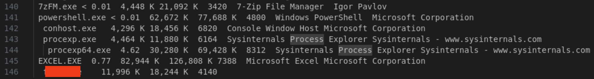

# Incident Response with Velociraptor

This lab demonstrates how to manage digital forensics and incident response cases using Velociraptor, an open-source endpoint incident response and hunt collection tool.

Intrusion detection and proper incident response are vital components of any cybersecurity program. Ransomware, phishing, insider threats, and vulnerabilities are ever-increasing problems. Being able to respond quickly and efficiently helps reduce the reputational and financial costs of data breaches as well as reduce further harm to the organization.

Click <a href="https://www.cisa.gov/topics/cybersecurity-best-practices/organizations-and-cyber-safety/cybersecurity-incident-response" target="_blank"> here</a> for more information on CISA Incident Response resources and training.

 - This lab is expected to take 60 minutes.

*Please consider filling out the lab feedback survey at the bottom of your screen. The survey is available to you at any time while conducting the lab.*

**Caution!** You must complete _all_ phases of the lab to receive your completion certificate.

## Learning Objectives

-	Understand Velociraptor's main features and abilities
-	Add a new client endpoint to Velociraptor
-	Compare baseline volatile system information to a compromised system for IOCs
-	Review additional endpoint data to analyze intrusion artifacts
-	Build Hunts using Velociraptor to identify and document malware intrusion artifacts

## Learner Expectations

 - Learners should be familiar with common digital evidence artifacts, such as volatile system information data, and common Linux log files
 - Learners should be comfortable with command-line operations and Web GUIs

## FOCAL and NICE Framework Mappings

This lab maps with <a href="https://www.cisa.gov/resources-tools/resources/federal-civilian-executive-branch-fceb-operational-cybersecurity-alignment-focal-plan" target="_blank">Federal Civilian Executive Branch (FCEB) Operational Cybersecurity Alignment (FOCAL)</a> area 5 (Incident Detection and Response) by analyzing several indicators of compromise on various client systems.

**NICE Work Role**

- <a href="https://niccs.cisa.gov/workforce-development/nice-framework" target="_blank">Incident Response, Digital Evidence Analysis, Defensive Cybersecurity</a>

**NICE Tasks**

- <a href="https://niccs.cisa.gov/workforce-development/nice-framework" target="_blank">T1102</a>: Identify intrusions
- <a href="https://niccs.cisa.gov/workforce-development/nice-framework" target="_blank">T1103</a>: Analyze intrusions
- <a href="https://niccs.cisa.gov/workforce-development/nice-framework" target="_blank">T1254</a>: Determine the effectiveness of an observed attack
- <a href="https://niccs.cisa.gov/workforce-development/nice-framework" target="_blank">T1370</a>: Collect intrusion artifact
- <a href="https://niccs.cisa.gov/workforce-development/nice-framework" target="_blank">T2013</a>: Look for indicators of intrusions

<!-- cut -->

# Scenario

The lab first walks through the process of adding client agents to remote systems and the basics of the Velociraptor interface. Then it walks through the analysis of a Windows 10 malware sample by comparing baseline volatile system information with the information taken during compromise. Continuing on, you package this data and evidence into a new investigative case where you investigate additional indicators of compromise on an active Ubuntu client system.

Network diagram:


The lab environment consists of the following systems:
 - A Kali workstation that you will use to retrieve and analyze digital evidence artifacts
 - The Velociraptor server
 - Three clients that will serve as victims of malware intrusions:
   - Two offline Windows client that have been removed from the network
   - A live Ubuntu client

## System Tools and Credentials

| system | OS type/link |  username | password |
|--------|---------|-----------|----------|
| Kali-Investigator | Kali | user | tartans |
| Ubuntu Desktop | Ubuntu |user | tartans|
| Velociraptor web GUI | `https://10.4.4.10:8889` | user | tartans |

<!-- cut -->

## Phase 1 - Getting Familiar with Velociraptor

This phase is to familiarize yourself with the features and layout of the Velociraptor web GUI. Review how to view host information and how to add client endpoints to Velociraptor for monitoring and data gathering.

<details> 
<summary> 
<h3>Stepping Through the Velociraptor Interface</h3> 
</summary> 
<p>  


1. (**Velociraptor**) Open the `Velociraptor` console and launch Firefox from the Desktop shortcut.

2. (**Velociraptor, Firefox**) Firefox should automatically open the Velociraptor login page. If this does not occur, open a new tab and browse to `https://10.4.4.10:8889`. You can safely ignore any certificate warnings by clicking 'Advanced' and then 'Accept the Risk and Continue'.

3. (**Velociraptor, Firefox**) When prompted, log in with the credentials: `user` | `tartans`. You may ignore or accept any prompts to save the password to the browser.

You should be at the Velociraptor home page.

| &#128736; Velociraptor |
|---|
|_Velociraptor allows incident response teams to rapidly collect and examine artifacts from across a network and deliver forensic detail following a security incident. In the event of an incident, an investigator controls the Velociraptor agents to hunt for malicious activity, run targeted collections, perform file analysis, or pull large data samples. The Velociraptor Query Language (VQL) allows an investigator to develop custom hunts that meet specific investigation needs with the ability to adapt queries quickly in response to shifting threats and new information gained through the investigation._ |

You can read more about Velociraptor at their <a href="https://docs.velociraptor.app/" target="_blank"> webpage</a> and in this <a href="https://www.cisa.gov/resources-tools/services/velociraptor" target="_blank">CISA reference page</a>.

The home page displays dashboards with relevant system status information such as memory, CPU, and disk usage. There is also a graph that displays how many active clients are currently connected. There are currently 0 clients connected, but we will be adding one later.


4. (**Velociraptor, Firefox, Velociraptor Web GUI**) Click on the "hamburger" icon (&#9776;) in the upper-left to expand the side menu bar and see the following options:


**Artifacts**

Velociraptor uses slightly different terminology than what you may be used to. Artifacts to us might be pieces of digital or data evidence, but to Velociraptor, an "artifact" is something more akin to a job or task. Therefore, the "View Artifacts" page lists all the available artifacts (or tasks) for us to use, and the "Server Artifacts" page lists the artifacts we have already configured and used in the past. We'll dive into these later.

**Hunts**

Hunts use artifacts to automatically query systems for key criteria or indicators that you specify. The "Hunt Manager" page allows you to view, create, manage, and run Hunts.

**Notebooks**

Notebooks are exactly what they sound like. Users can create notebooks and write to them using basic Markdown, or copy/paste other Artifact and Hunt information to them. Notebooks can be assigned to specific users as collaborators, or to all users. Notebooks can also be imported or exported as needed.

**Users**

Users lists all the users of Velociraptor. Users can be split into organizations, and any user is a privileged user as far as functionality goes. However, users can only view and manage client endpoints within their own organization, or any child organizations of that parent organization. For the purposes of this lab, we will use only one account, `user`, and this account belongs to the root organization.

You may also notice that the "Host Information", "Virtual Filesystem", "Collected Artifacts", and Client Events" headings are greyed out. To "Activate" these pages we must first search for a client using the search bar at the top of the page. Let's do this now.

*Note that you can always type "all" or use the dropdown arrow next to the client search field and select "Show All" to see all hosts in your org.*

5. (**Velociraptor, Firefox, Velociraptor Web GUI**) In the "Search Clients" field enter "Desktop". Velociraptor will automatically populate the option for the host named "DESKTOP-I6U3VR7". Click on this entry to view this client.


Velociraptor will display a header for this client that shows its Client ID, hostname, FQDN (if it has one), OS Version description, and any labels that may be associated with this client. The client currently shows the label "windows10", which matches the OS version, but also two labels of "Quarantine" and "offline".


6. (**Velociraptor, Firefox, Velociraptor Web GUI**) Click on the green bar that makes up the Client ID and Velociraptor to the Host Information page for this client.

Notice a few key items on the page.
 - We can view the system's last known IP address and MAC address for easy network identification
 - The Quarantine option is showing that the system is currently quarantined. We'll deal with why later, but quarantined systems are remotely taken offline so that only the Velociraptor server can communicate with the client over TLS and port 443. This helps prevent any further spread of malware.
 - Far to the right of the page is a ">_Shell" button. If this system was online and live, you could send remote commands to it. We will do this in a later phase of the lab.
 - The VFS button allows you to remotely access the client's file system. Again, since this system is no longer online we cannot interact with it, but we will interact with another later in the lab.

Keep these items in mind for later.

7. (**Velociraptor, Firefox, Velociraptor Web GUI**) We know that there is at least one Windows 10 system, so now let's search for any others using the label of "windows10". In the "Search Clients" field, type "windows10" and Velociraptor should once again populate the existing label option for you. Click this to view all clients with that label.


You should notice another system with the "windows10" label named "CLIENT-X" that is also offline and quarantined. Applying labels to hosts allows you to easily group and filter for specific hosts in Velociraptor.

8. (**Velociraptor, Firefox, Velociraptor Web GUI**) Click on the green bar that makes up the Client ID for `CLIENT-X` and Velociraptor goes to the Host Information page for this client. Use this information to answer the following knowledge check question.

**Knowledge Check Question 1:** *What was the Last Seen IP for CLIENT-X?*

We'll return to these hosts later to investigate why they are quarantined. Now, let's learn how to add a client agent to an endpoint to attach it to Velociraptor.

</p>
</details>

<details> 
<summary> 
<h3>Adding Endpoints</h3> 
</summary> 
<p>  

1. (**Velociraptor, Firefox, Velociraptor Web GUI**) Click on the hamburger icon (&#9776;) again to expand the side menu bar and click on "Server Artifacts".

You should see a few existing artifacts, including one named "Server.Utils.CreateMSI". This Velociraptor artifact was used to generate a custom MSI agent installer file for Windows clients. This installer was used on the two Windows 10 clients reviewed in the previous section.


2. (**Velociraptor, Firefox, Velociraptor Web GUI**) Click on the "Server.Utils.CreateMSI" artifact line and new information should with several tabs.

 -  *Artifact Collection*: displays general information about the artifact, such as creation time, state (completed or ongoing), if any files were uploaded (created), and if so, the uploaded bytes (size).
 - *Uploaded Files*: displays the files uploaded which can then be downloaded
 - *Requests*: shows the full JSON structure of the request this artifact generates
 - *Results*: shows the outcome of the requests and the Notebook will also retain a copy of the results (if nothing else is added)
 - *Log*: shows the progress of the artifact when requested. If it's still ongoing you may see further updates, but for "one and done" artifacts the log will simply show when it was initiated, completed, and any updates in between.
 - *Notebook*: shows the information associated with the Artifact or collected data. We will look at these more in Phase 3

3. (**Velociraptor, Firefox, Velociraptor Web GUI**) Lastly, if you click on the "Artifact Collection" tab and then click on the green button that represents the "Artifact Names" you can see more details about the artifact. This detailed information includes a description of what the artifact does (used when selecting the artifact initially), optional parameters that can be applied, and any dependent tools of the server.


For this specific artifact, the task creates the MSI installer for Windows clients to add the agent. The package specifically includes the information and configuration information for this server to include its IP, server ID, certificate, and other metadata. You may close this popup once you are finished reviewing the information.

All a user needs to do to install the agent on any Windows system is download the installer and run it. The agent automatically reaches back to the server and connects the client as an endpoint.

4. (**Velociraptor, Firefox, Velociraptor Web GUI**) *We won't be using the agent installer in this lab, but you can now see how easy it is to download or transfer the installer to other systems using the Velociraptor web GUI.* To download the installer, you would click on the "Uploaded Files" tab and click on the green button under the "vfs_path" column. You should see the browser initiate the download. 

Now that you've reviewed an existing artifact, let's generate a custom agent installer for a Linux/Ubuntu system. Unfortunately for Linux clients, the agent installer generation process is a bit more of a manual one. Luckily, you only need to do it once per agent installer. 

5. (**Velociraptor, Firefox, Velociraptor Web GUI**) Click on the Home menu button to return to the home page. Scroll down to the "Current Orgs" section and click the green button under "Client Config" to download a copy of the current root client config.


This will download the config file to the Downloads folder. If we had more orgs in this setup, there would/could be a unique client config for each, depending on your needs.

6. (**Velociraptor**) Open a 'Terminal' using the shortcut on the right-side menu bar.

7. (**Velociraptor, Terminal**) Create the client agent installer package with the following command:

```
./velociraptor_setup/velociraptor debian client --config ~/Downloads/client.root.config.yaml --output agent-installer.deb
```

By default, the installer is named with the version of the client. The `--output` option allows us to specify a more user-friendly name for the output file. This will create the agent installer package in the current working directory, which is `/home/user`.

8. (**Velociraptor, Terminal**) Ensure the agent installer is present in the home directory with the `ls`. command.


The next step is to transfer the package to the client endpoint and install it. To make this easier in larger environments you could host this file on a simple web or file share. We will do the former and you can use it as needed throughout the remainder of the lab.

9. (**Velociraptor, Terminal**) Start a simple Python web server in the home directory (/home/user) and background this process with the following command:

```
python3 -m http.server 8080 &
```

Now you can download the installer with a simple wget or curl command on any client.

10. (**Velociraptor, Terminal**) Open a new Terminal or Terminal tab and connect to `client-a` via SSH with the following command:

```
ssh user@10.1.1.51
```

11. (**Velociraptor, Terminal**) Type and Enter "yes" if asked to continue and then use the password `tartans` to complete the connection.

12. (**Velociraptor, Terminal, SSH Session to Client-A**) Use the following command to download the installer:

```
wget http://10.4.4.10:8080/agent-installer.deb
```


13. (**Velociraptor, Terminal, SSH Session to Client-A**) Install the endpoint client with the following command, using the sudo password of "tartans" when prompted:

```
sudo dpkg -i agent-installer.deb
```


14. (**Velociraptor, Terminal**) You can then exit the connection by typing and entering `exit` or simply closing the Terminal tab/window.

15. (**Velociraptor, Firefox, Velociraptor Web GUI**) Return to the Velociraptor console, open Firefox, and click on the Home button to return to the Velociraptor home page.

You should see an additional client on the "Currently Connected Clients" graph.


16. (**Velociraptor, Firefox, Velociraptor Web GUI**) To confirm the client details, type and enter "client-a" in the "Search Clients" field and then click on the populated entry for `host:client-a`.


17. (**Velociraptor, Firefox, Velociraptor Web GUI**) Lastly, add a label to this system to identify it as an "Ubuntu 20.04" system. Click on the "Add Label" button (the icon looks like a tag), type the label name of "Ubuntu 20.04", click on 'Create Ubuntu 20.04', and then click on "Add it!".


If done correctly, there is a new label for the system.


In this phase you have reviewed some of the basic features of Velociraptor, reviewed how to install client endpoint agents on hosts, and how to apply labels to hosts.

We'll dig deeper (pun intended) into more of Velociraptor's features and functionality throughout the lab. It is recommended that you review the <a href="https://docs.velociraptor.app/" target="_blank">official documentation</a> if you are interested in more of what Velociraptor has to offer.

#### Grading Check

(**Kali-Investigator, Firefox**) To check your work, browse to the grading page at `https://skills.hub/lab/tasks` or `(https://10.5.5.5/lab/tasks)` from the Kali-Investigator system. Click the `Submit/Re-Grade Tasks` button to trigger the grading checks. Refresh the results after a few moments to see your results.


Grading Check 1: Verify that the Velociraptor endpoint agent was successfully installed on Client-A
 - Velociraptor sees Client-A as an attached client endpoint
 - Client-A has the correct "Ubuntu 20.04" label assigned to it

`Copy the token or flag strings to the corresponding question submission field to receive credit. Don't forget to answer the knowledge check question as well.`

`You should complete all phase 1 tasks before moving on to phase 2.`

</p>
</details>

<details> 
<summary> 
<h3>Phase Wrap-up</h3> 
</summary> 
<p> 

You walked through the main features and components of the Velociraptor web GUI, how clients are viewed and labels, and how endpoints can be added to Velociraptor's management structure.

</p>
</details>


## Phase 2 - Post-intrusion Windows Artifact Analysis

In the previous phase, you went through the main features of the Velociraptor web GUI. This phase is to examine data and evidence from the quarantined Windows 10 clients to determine if and how they are compromised.

<details> 
<summary> 
<h3>Reviewing Windows Malware Artifacts - DESKTOP-I6U3VR7</h3> 
</summary> 
<p>  

1. Open the "Kali-Investigator" console and then open Firefox (Firefox ESR) using the shortcut on the Desktop.

2. (**Kali-Investigator, Firefox**) In Firefox, open a new tab and browse to `https://10.4.4.10:8889`. You can safely ignore any certificate warnings by clicking 'Advanced" and then "Accept the Risk and Continue'.

3. (**Kali-Investigator, Firefox**) When prompted, log in with the credentials: `user` | `tartans`. You may ignore or accept any prompts to save the password to the browser.

We learned how to view specific hosts/clients in Velociraptor. Now let’s review the evidence retrieved from the two compromised Windows 10 clients.

4. (**Kali-Investigator, Firefox, Velociraptor Web GUI**) Next to the "Search Clients" field, click the dropdown and select "Show All". You should see the three hosts from the previous phase: `DESKTOP-I6U3VR7`, `CLIENT-X`, and `client-a`.

5. (**Kali-Investigator, Firefox, Velociraptor Web GUI**) Click on the green Client ID button for `DESKTOP-I6U3VR7` to view its host information.

6. (**Kali-Investigator, Firefox, Velociraptor Web GUI**) Next, click on the "Collected" tab to review data collected from this system. You should see an entry with an Artifact named "System.VFS.DownloadFile".


This artifact was used to collect files from the host via the Virtual File System (VFS) feature of Velociraptor. This makes a convenient way to collect, store, and share data files retrieved from endpoints. We will go further into the VFS of Client-A in the next phase. For now, we can retrieve the files that were collected and stored on the Velociraptor server.

7. (**Kali-Investigator, Firefox, Velociraptor Web GUI**) Click on the row for the "System.VFS.DownloadFile" entry and then click on the "Uploaded Files" tab of the dashboard that renders the filenames that were collected from this host.


Each file is represented in its own row, and each can be downloaded to your local system for further investigation.

These files were generated using Sysinternals Suite tools on the compromised systems.

| &#128736; Sysinternals |
|---|
|_The Sysinternals web site was created in 1996 by Mark Russinovich to host advanced system utilities and technical information. Sysinternals utilities can help you manage, troubleshoot and diagnose Windows and Linux systems and applications._ |

You too can download and use the full Sysinternals Suite from its website by <a href="https://learn.microsoft.com/en-us/sysinternals/" target="_blank">Microsoft</a>.

8. (**Kali-Investigator, Firefox, Velociraptor Web GUI**) If you hover over each file, you can see a tooltip with the text "Download File" and if you click on any of the green buttons in the "vfs_path" column you will download the file. Go ahead and download each of the 11 files to the default Downloads folder. Keep in mind that you need to view the second page of results to retrieve the 11th file or expand the page size of displayed results to more than 10.

9. (**Kali-Investigator**) Open a 'Terminal' from either the Desktop shortcut or from the top menu bar icon.

10. (**Kali-Investigator, Terminal**) Create a new folder in the home directory and then copy these files to it with the following commands:

```
mkdir ~/DESKTOP-I6U3VR7
mv ~/Downloads/*.{txt,CSV,csv,exe,vbs} ~/DESKTOP-I6U3VR7
cd ~/DESKTOP-I6U3VR7
```


The `mv` command options will ensure you get every file with the extensions found in the collected evidence. The files consist of the following:

| filename | description |  tool used |
|--------|---------|-----------|
| citrio.exe | A copy of the malicious executable | none |
| citrio.vbs | A visual basic script | none |
| procexp.txt| Lists all running processes | Process Explorer |
| procmon-proc.txt | Lists all running process/thread info | Process Monitor |
| procmon-reg.txt | Lists all registry hooks at time of running | Process Monitor |
| pslist.txt | Lists all running processes | pslist |
| psloggedon.txt | Lists current logged on users and some system info | psloggedon |
| ScheduledTasks.txt | Lists current scheduled tasks | PowerShell |
| services.txt | Lists all running services | psservice |
| StartupItems.txt | Lists all items in the startup folder | PowerShell |
| tcpview.csv | Lists current TCP connections | TCP View |

These files can tell us what was running on the system at the time the data was collected. We can see things like running process, open connections, things that might indicate persistence - scheduled tasks, services, or startup items - and information about the system and who was logged in.

However, none of this information is useful if we don't have a baseline to compare it to. Luckily, we happen to have the same information taken BEFORE the malware was executed.

11. (**Kali-Investigator, Firefox**) Return to Firefox and return to the Skills Hub page or open a new tab and browse to `https://skills.hub/files`.

12. (**Kali-Investigator, Firefox**) Click on the `windows10-baseline.zip` link to download the files.


13. (**Kali-Investigator, Terminal**) Back in the Terminal, create a new folder and then unzip these files to it with the following commands:

```
mkdir ~/baseline
unzip ~/Downloads/windows10-baseline.zip -d ~/baseline
```

Now you have a folder for the system baseline info and the information captured during the compromise. This baseline information represents what a base Windows 10 system should be running after startup with no additional processes being run. This information won't tell us exactly what malware is running or how it got on to the system, but at least it gives us something to compare to and try to figure out what is "new".

The next few steps guide you through conducting some basic analysis of the system information files. Then you are asked to identify key pieces of information on your own.

14. (**Kali-Investigator**) Compare the process list (pslist) output of the compromised system with that of the baseline system for evidence of new and possible malicious processes.

```
diff <(cat ~/DESKTOP-I6U3VR7/pslist.txt | tr -d '\r\0' | sort) <(cat ~/baseline/pslist.txt | tr -d '\r\0' | sort) | grep 'citrio'
```

The `diff` command shows us if the process citrio appears in one or more of the pslist output files. There are some extra parameters added to ensure the `diff` compares only the text and not any hidden special characters that may be present due to Windows file formatting.

If a result is found, the arrow direction implies which file the content exists in. Therefore, since the compromised pslist output is listed first and the baseline is compared second, an arrow direction of "<" means the entry exists in the compromised output but not the baseline.

**Knowledge Check Question 2:** *What is the Process ID/PID for the unknown process in the compromised pslist.txt output?*


We now have a suspicious process to investigate. Let's check if this process was a one-off or if there is some sort of persistence in place to continue running the malware if we were to kill the process. 

15. (**Kali-Investigator**) Review the Startup Items, Scheduled Tasks, and Services output files from DESKTOP-I6U3VR7 for any references to "citrio". Simply open each file and search within the text for this string. You should find a reference in one of the collected evidence files.

**Knowledge Check Question 3:** *What file is called at startup to create persistence for the malware? (Hint: it's not a .exe)*


We can now be confident that citrio is the malicious process in question and is set to run again at startup. The startup folder includes the citrio.vbs script, which further calls the citrio.exe executable that is buried in another innocuous AppData folder.


To remove it, we would remove both the base file and its persistence method. We may also want to add monitors for this startup folder to alert if other items are added. While best practices for eradication and recovery, you don't need to perform these tasks in this lab.

Since we know citrio was running, let's parse the collected TCP View output from DESKTOP--I6U3VR7 to see if the malware was trying to call out or beacon to an external entity. Open the TCP View output file and review it for occurrences of citrio. Even though the file is in a .csv format, you can view it as a text file.

**Knowledge Check Question 4:** *What is the external IP address associated with the citrio.exe process in the TCP View output?*


Based on our findings, the malicious `citrio.vbs` script runs in the Startup folder, which will ensure that `citrio.exe` is run each time the system boots up. These files were originally dropped on the system via a malicious PDF. In this instance, `citrio.exe` had a process ID of `7540`. The `citrio.exe` process calls out to `45.114.209.111`.

To understand exactly what the malware is doing we would need to perform further testing or reverse engineering, which will not be covered in this lab. However, the malicious process would attempt to contact a C2 (Command and Control) server at the listed IP address and wait for further instructions.

A list of potential remediations would be:
 - Add IP-based firewall blocks for the IP address of the external IP address
 - Add A/V or host IDS signatures for this malware sample based on its file hash
 - Implement Endpoint Detection and Response tools to monitor changes to Startup items
 - Remove all traces of the citrio.exe and citrio.vbs
 - Disable VBS by default

</p>
</details>

<details> 
<summary> 
<h3>Reviewing Windows Malware Artifacts - CLIENT-X</h3> 
</summary> 
<p>  

1. (**Kali-Investigator, Firefox, Velociraptor Web GUI**) Repeat the process to collect the evidence files for `CLIENT-X`. For reference, see steps 1-8 above.

*You do not need to redownload the baseline information, as the info does not change for this system.*

2. (**Kali-Investigator**) Open a 'Terminal' from either the Desktop shortcut or from the top menu bar icon.

3. (**Kali-Investigator, Terminal**) Create a new folder in the home directory and then copy these files to it with the following commands:

```
mkdir ~/CLIENT-X
mv ~/Downloads/*.{txt,csv,exe,xlsm} ~/CLIENT-X
cd ~/CLIENT-X
```

The `mv` command will ensure you get every file with the extensions found in the collected evidence. The files consist of the following:

| filename | description |  tool used |
|--------|---------|-----------|
| balance - 2020.xlsm | A copy of the malicious Excel file | none |
| file.exe | An unknown malicious executable | none |
| procexp.txt| Lists all running process/thread info  | Process Explorer |
| proexp-excel.txt | Lists all running process/thread info showing Excel spawning another process | Process Explorer |
| pslist.txt | Lists all running processes | pslist |
| psloggedon.txt | Lists current logged on user and some system info | psloggedon |
| psservice.txt | Lists all running services | psservice |
| tcpview.csv | Lists current TCP connections | TCP View |

*Note that there is a small typo in the "proexp-excel.txt" output (there is a missing 'c' in the filename).*

4. (**Kali-Investigator**) We'll streamline this investigation a bit. We're fairly sure the Excel file is involved, but the pslist.exe output does not list parent process IDs. Open the "proexp-excel.txt" output file and answer the following question. Hint: Processes indented below another process indicate that the indented process is a child of the non-indented one above it.

**Knowledge Check Question 5:** *What process is spawned by EXCEL in the proexp-excel.txt output file?*




We now have an understanding that the "balance - 2020.xlsm" file somehow spawns the malicious executable. But how?

5. (**Kali-Investigator, Calc**) Double-click the .xlsm file to open it in LibreOffice Calc. The spreadsheet appears normal. Then click on "Tools" -> "Macros" -> "Edit Macros".

6. (**Kali-Investigator, Calc**) Expand the heading for "balance - 2020.xlsm" -> "VBAProject" -> "Document Objects" and then double-click the "ThisWorkbook" entry to show the macro.


The macro is creating a file named file.exe and then writing/dumping the contents of the data below into the file, creating the malicious.exe, which is embedded in the .xlsm file itself.

**Knowledge Check Question 6:** *What is the Process ID/PID for file.exe in the compromised pslist.txt output?*


Like the previous Windows client, review the TCP View output to determine if the file.exe process was creating a suspicious external connection.

**Knowledge Check Question 7:** *What is the external IP address associated with the file.exe process in the TCP View output?*


Based on our findings, the malicious `file.exe` process was running as process id `8676`. The file is created via an .xlsm file that includes malicious macros. Running/opening the Excel file creates the `file.exe` file and runs it. Even if Excel is closed after this point, `file.exe` will continue to run. `file.exe` reaches out to `27.0.128.34`.

To understand exactly what the malware is doing we would need to perform further testing or reverse engineering, which will not be covered in this lab. However, the malicious process would attempt to harvest credentials stored in various system data and then export these credentials to the IP noted above.

A list of potential remediations would be:
 - Add IP-based firewall blocks for the IP address of the external IP address
 - Add A/V or host IDS signatures for this malware sample based on its file hash
 - Ensure macros are disabled by default in Office products
 - Disable VBS by default
 - Remove all traces of the file.exe and the initial .xlsm file

</p>
</details>

<details> 
<summary> 
<h3>Phase Wrap-up</h3> 
</summary> 
<p> 

In this phase you retrieved evidence previously collected by Velociraptor and reviewed it for information related to two instances of compromise stemming from malware. This was a very simple example of how Velociraptor can be used to store and make available data critical to the incident response investigation process. 

`You should submit and complete all phase 2 knowledge check questions before moving on to phase 3.`

</p>
</details>

## Phase 3 - Live Ubuntu Artifact Analysis - CLIENT-A

In the previous phase, you interacted with and analyzed previously collected data offline. In this phase you will collect and view data directly within Velociraptor while responding to a system that is currently compromised and still online.

<details> 
<summary> 
<h3>Trigger the Malicious Activities</h3> 
</summary> 
<p> 

(**Kali-Investigator, Firefox**) When ready, browse to the grading page at `https://skills.hub/lab/tasks` or `(https://10.5.5.5/lab/tasks)` from the Ubuntu-Desktop system. Click the `Submit/Re-Grade Tasks` button to trigger the malicious activities for phase 3. The page will automatically refresh once the activities are complete, which will take roughly 45-60 seconds.


Once you see the following message on the grading page you are ready to proceed.


</p>
</details>

<details> 
<summary> 
<h3>Using Virtual File System in Velociraptor</h3> 
</summary> 
<p> 

*If Velociraptor is still open in the browser of `Kali-Investigator` you may skip to step 4.*

1. (**Kali-Investigator**) Open the `Velociraptor` console and launch Firefox from the Desktop shortcut.

2. (**Kali-Investigator, Firefox**) From the Skills Hub site, click on the 'Bookmarks' tab and then click on the bookmarked link for Velociraptor (`https://10.4.4.10:8889`), if not already open.


You can safely ignore any certificate warnings by clicking 'Advanced' and then 'Accept the Risk and Continue'.

3. (**Kali-Investigator, Firefox**) When prompted, log in with the credentials: `user` | `tartans`. You may ignore or accept any prompts to save the password to the browser.

We'll imagine that a user reported that their password is no longer working and they cannot log in to their Ubuntu client system. They are 100% sure that they have not updated or changed their password recently. This might be nothing, but we'll investigate the likelihood that this system was compromised.

4. (**Kali-Investigator, Firefox, Velociraptor Web GUI**) In Velociraptor, next to the "Search Clients" field, click the dropdown and select "Show All". You should once again see the three hosts from the previous phase: `DESKTOP-I6U3VR7`, `CLIENT-X`, and `client-a`.

5. (**Kali-Investigator, Firefox, Velociraptor Web GUI**) Click on the green Client ID button for `client-a` to view its host information.

6. (**Kali-Investigator, Firefox, Velociraptor Web GUI**) Since we believe an account may have been compromised, we'll use the Virtual File System (VFS) option to view the client's /etc/shadow file. Begin by clicking on the green VFS tab (with the folder icon) for this client.

7. (**Kali-Investigator, Firefox, Velociraptor Web GUI**) On the following screen, click on the folder entry for "auto" on the left and then click the "Refresh" icon on the right side of the window. This will refresh the contents of the filesystem in Velociraptor.


8. (**Kali-Investigator, Firefox, Velociraptor Web GUI**) Click on the entry for "auto" again on the left side of the window, which should expand the content of the directory. Click on the entry for the "etc" directory to highlight it and then click on the "Refresh" icon on the right side once again.


This will list all the contents of the `etc` directory, though Velociraptor initially limits the contents to 5 per page.

9. (**Kali-Investigator, Firefox, Velociraptor Web GUI**) Since we know that the shadow file can provide evidence of password changes we can filter for it directly. Click on the heading for "Name" and a green filter button should appear. Within the Regex Filter field, type and enter the string "shadow".


10. (**Kali-Investigator, Firefox, Velociraptor Web GUI**) Now, click on the entry for the shadow file and you should see a button to "Collect from the client" in the bottom half of the screen.


11. (**Kali-Investigator, Firefox, Velociraptor Web GUI**) Click this button and the file will be collected and stored in Velociraptor, just like the previous Windows artifact files were retrieved before you began this lab. This action will produce a download link for the retrieved file and a preview option to the right.


Use the preview option by clicking the green button to view the contents of the file.

12. (**Kali-Investigator, Firefox, Velociraptor Web GUI**) Look for the entry for "user" which should look like the following:

`user:$6$8lK65U8GKFNrKGsq$F/vhcAJYSMS8ybQWiWvB9o5Rr/IiLVAumVtPrmqwYRzXAPFDJ2Kb8AKuvJwni3wLGwH/XMXAKgzISCHANmocI/:20269:0:99999:7:::`

The number value of `20269` in the example above is the day the password was updated, based on the Epoch time of Jan 1st, 1970, meaning the password was last changed on the 20,269th day since Jan 1st, 1970.

13. (**Kali-Investigator, Terminal**) Open a Terminal and enter the following command to convert this number to a readable date, substituting your number value in the command:

```
date -d '1970-01-01 +##### days'
```

The result should be a recent date - either today's date or the day prior (depending on the exact time you ran the activity script for phase 3) - meaning this account password was indeed changed recently without the user's knowledge. It seems there is more to investigate on this system.

</p>
</details>

<details> 
<summary> 
<h3>Using Hunts in Velociraptor</h3> 
</summary> 
<p> 

Hunts are a way for us to collect specific data about a system all at once.

1. (**Kali-Investigator, Firefox, Velociraptor Web GUI**) Back in Velociraptor, click on the "hamburger" icon (&#9776;) in the upper-left to expand the side menu bar and click on the "Hunt Manager" entry.

2. (**Kali-Investigator, Firefox, Velociraptor Web GUI**) Click on the '+' icon in the upper left to create a new hunt. Provide the following details in the popup.

 - Description: client-a IR
 - Include Condition: Change to "Match by label" and then select the "Ubuntu 22.04" label 
 - Orgs: select the "root" org
 - Check the box next to "Start Hunt Immediately"


These settings will ensure the Hunt runs only against systems tagged with "ubuntu 22.04" label within the root organization and will run the Hunt as soon as we complete the configuration.

3. (**Kali-Investigator, Firefox, Velociraptor Web GUI**) Next, click on the "Select Artifacts" tab and add the following artifacts by typing in their names and clicking on the label (this will change the color of the text). You can also click on the "Configure Parameters" tab at any time to verify which artifacts have been added to the Hunt.

 - Linux.Network.Netstat
 - Linux.Syslog. SSHLogin


4. (**Kali-Investigator, Firefox, Velociraptor Web GUI**) Click on the "Configure Parameters" tab to verify you have both Artifacts added and then click the "Launch" button at the bottom. You will be taken back to the main Hunt Manager page and see that the Hunt has been added and launched.


5. (**Kali-Investigator, Firefox, Velociraptor Web GUI**) Click on the button for `client-a` at the top of the screen or follow the path of searching for this client to view its information.

6. (**Kali-Investigator, Firefox, Velociraptor Web GUI**) While viewing `client-a` click on the green "Collected" tab and then find and click on the artifact entry for the Hunt you just launched. The artifact will have the Artifacts description of "Linux.Network.Netstat | Linux.Syslog.SSHLogin".


7. (**Kali-Investigator, Firefox, Velociraptor Web GUI**) From the bottom half of the screen, click on the Notebook tab. The notebook has been prepopulated with the results of our Hunt.


8. (**Kali-Investigator, Firefox, Velociraptor Web GUI**) Let's review this information. Scroll down through the netstat output. You should notice a listener on port 55555, which is an odd port to listen on. Also, pay attention to the "CommandLine" entry for this process.


**Knowledge Check Question 8:** *Knowledge Check Question 8: What suspicious port number is discovered in the netstat output?*

Lastly, note the process ID, or PID. Record this number, as you will need it again shortly.

So it seems that something is running an unwanted listener on port 55555 on this system. Luckily, nothing is connected to it. But how did it get here?

9. (**Kali-Investigator, Firefox, Velociraptor Web GUI**) Scroll further down through the notebook and note the SSH login activity. You should see several failed login attempts followed by a successful password authentication.


This could be indicative of a brute force attack that was successful prior to the password change.

10. (**Kali-Investigator, Firefox, Velociraptor Web GUI**) Return to the view of `client-a`'s information and look for the `>_Shell` button in the upper right.


11. (**Kali-Investigator, Firefox, Velociraptor Web GUI**) Enter the following command and then click the "Launch" button.

```
ps -eo pid,ppid,cmd --forest
```


Once you see a timestamp associated with the command, the output has been saved under the "Collected" screen output. Click on the Artifact for "Linux.Sys.BashShell" and then look at the Notebook tab below like before.


12. (**Kali-Investigator, Firefox, Velociraptor Web GUI**) Scroll down to the process output and look for the PID you noticed previously in the netstat output. Alternatively you can search the page for this value/number or search for the command "nc -lkp 55555".


You should notice that there is another process associated with the netcat process named `software-update-service.sh` and this is running out of the `/home/user/Pictures` directory. This is also highly suspicious.

13. (**Kali-Investigator, Firefox, Velociraptor Web GUI**) Recall how you used the VFS previously to retrieve and view a file on the remote client. Return to the VFS screen for `client-a`. Make sure you refresh the directories as needed to view the Pictures directory contents.

14. (**Kali-Investigator, Firefox, Velociraptor Web GUI**) Click the button to collect and then download the service shell script and review its contents, which is just the netcat command to run a constant listener via this script as a service. You can use the Preview option to the right, which will show the plaintext and hex output of the file contents.

```
#!/bin/bash
nc -lkp 55555
```

15. (**Kali-Investigator, Firefox, Velociraptor Web GUI**) Click the button to collect and optionally download the *other* file found alongside the service shell script. Review the contents for the following question.


**Knowledge Check Question 9:** *What is the token found in the other file located with the suspicious service file?*

`You should submit and complete all phase 3 knowledge check questions before moving on to the mini-challenge.`

Throughout this phase you have discovered a possible intrusion into the network and determined key characteristics about the compromise.
 - A brute-force login attack led to access to a client over SSH
 - The user account password was then changed
 - The actor then uploaded a script that installed a service to maintain a netcat listener on port 55555

A list of potential remediations would be:
 - Add enhanced logging for login attempts, especially from remote clients
 - Consider disabling SSH entirely if not required
 - Add firewall/access control rules to restrict SSH access to only what is required
 - Configure account lockout thresholds for SSH if SSH is required
 - Implement stronger password requirement policies
 - Review user permissions and roles to implement the principle of least privilege
 - Monitor for new service creation via EDR tools

</p>
</details>

<details> 
<summary> 
<h3>Phase Wrap-up</h3> 
</summary> 
<p> 

Through Velociraptor Hunts, VFS browsing, and shell command execution, you were able to interrogate and collect evidence from the compromise client without ever having to initiate a remote shell like SSH or access the console directly. Velociraptor makes it easy to collect data from hosts and perform additional queries via commands. Keep in mind that the actions taken in this lab are just scratching the surface of what Velociraptor can do.

</p>
</details>

## Mini-Challenge

<details> 
<summary> 
<h3>Mini-Challenge Scenario</h3> 
</summary> 
<p> 

The mini-challenge continues the investigation into the events that occurred as part of client-a's compromise. It is to quarantine the system. You will need to recall what you learned in Phase 3 of the lab to use the remote shell and VFS options for `client-a`.

You are tasked with the following:
 - Look for any recently created executable or shell script files within `client-a`'s `/home/user/` directory.
   - You can use the command `find /home/user -type f \( -mmin 60 -o -cmin -60 \) 2>/dev/null`, where the option of `--min 60` looks for any files modified or created in the last 60 mins. You may need to extend your time range depending on how long you have been working in the lab.
 - Review these files for evidence of the malicious service and find the correspondingly named .ini file in the same location.
 - Quarantine the system using the process mentioned in Phase 1 (i.e., the Quarantine function in Velociraptor).

A baseline set of data is available at `https://skills.hub/files` in case you need it.

**Mini-Challenge Question 1:** *What is the path and name of the shell script that was uploaded by the attacker?*

**Mini-Challenge Question 2:** *What token string is found within the .ini file located next to the suspicious service file?*

#### Grading Check

(**Kali-Investigator, Firefox**) To check your work, browse to the grading page at `https://skills.hub/lab/tasks` or `(https://10.5.5.5/lab/tasks)` from the Kali-Investigator system. Click the `Submit/Re-Grade Tasks` button to trigger the grading checks. Refresh the results after a few moments to see your results.


**Mini-Challenge Grading Check 1:** *Verify that client-a has been quarantined in Velociraptor.*

</p>
</details>

<details>
<summary>
<h3>Lab Wrap-up</h3>
</summary>
<p>

### Conclusion

In completing this lab, you practiced the concept of remote incident response using endpoint collection tools like Velociraptor. You increased your incident response knowledge and skills by walking through several scenarios of malware and indications of intrusion and persistence.

 - Reviewing the main features of Velociraptor and adding a new client endpoint by installing the Velociraptor agent
 - Reviewing incident response evidence tied to malware events on two unique Windows 10 clients
 - Utilizing Velociraptor Hunts, VFS, and shell commands to interrogate and collect response data
 - Reviewing incident response evidence tied to malware events on an Ubuntu client


Skills exercised:
 - S0572: Skill in detecting host and network-based intrusions
 - S0607: Skill in collecting digital evidence
 - S0624: Skill in performing volatile data analysis
 - S0806: Skill in performing incident responses
 - S0838: Skill in identifying anomalous activities
 - S0867: Skill in performing malicious activity analysis

### References
 - <a href="https://www.cisa.gov/resources-tools/services/velociraptor" target="_blank">CISA Velociraptor Info Page</a>.
 - <a href="https://www.cisa.gov/topics/cybersecurity-best-practices/organizations-and-cyber-safety/cybersecurity-incident-response" target="_blank">CISA Incident Response Resources</a>
 - <a href="https://www.cisa.gov/resources-tools/resources/federal-civilian-executive-branch-fceb-operational-cybersecurity-alignment-focal-plan" target="_blank">Federal Civilian Executive Branch (FCEB) Operational Cybersecurity Alignment (FOCAL)</a>
 - <a href="https://learn.microsoft.com/en-us/sysinternals/" target="_blank">Sysinternals Info Page</a>
 - <a href="https://niccs.cisa.gov/workforce-development/nice-framework" target="_blank">NICE Framework</a>
 - <a href="https://docs.velociraptor.app/" target="_blank">Velociraptor Documentation</a> 

</p>
</details>

<details>
<summary>
<h2>Answer Key</h2>
</summary>
<p>

**Knowledge Check Question 1**: *What was the "Last Seen IP" for CLIENT-X?*

- `10.2.2.51`

**Knowledge Check Question 2**: *What is the Process ID/PID for the unknown process in the compromised pslist.txt output?*

- *7540*

**Knowledge Check Question 3**: *What file is called at startup to create persistence for the malware? (Hint, it's not an executable)*

- *citrio.vbs*

**Knowledge Check Question 4**: *What is the external IP address associated with the citrio.exe process in the TCP View output?*

- `45.114.209.111`

**Knowledge Check Question 5**: *What process is spawned by EXCEL in the proexp-excel.txt output file?*

- *file.exe*

**Knowledge Check Question 6**: *What is the Process ID/PID for the file.exe in the compromised pslist.txt output?*

- *8676*

**Knowledge Check Question 7**: *What is the external IP address associated with the file.exe process in the TCP View output?*

- *27.0.128.34*

**Knowledge Check Question 8**: *What suspicious port number is discovered in the netstat output?*

- *55555*

**Knowledge Check Question 9**: *What is the token found in the other file located with the suspicious service file?*

- *The token string is randomly generated for each session*

</p>
</details>


