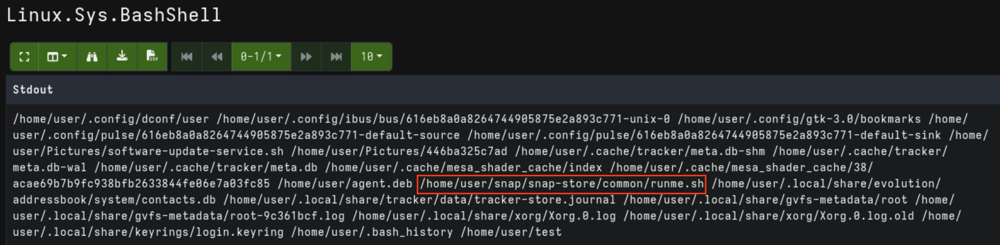
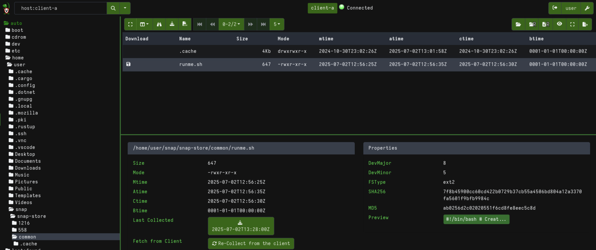
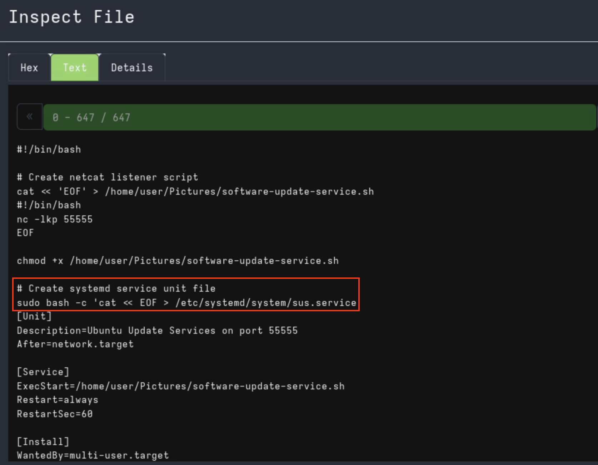
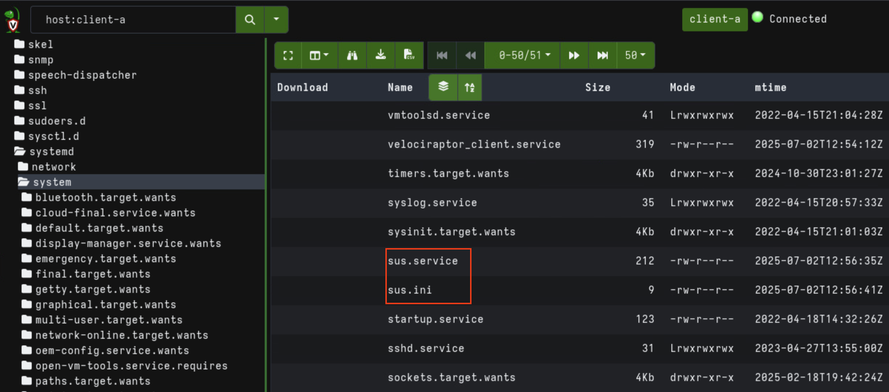
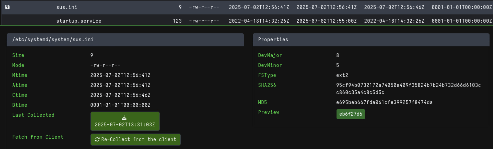
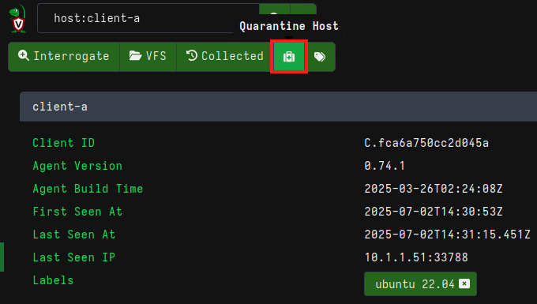
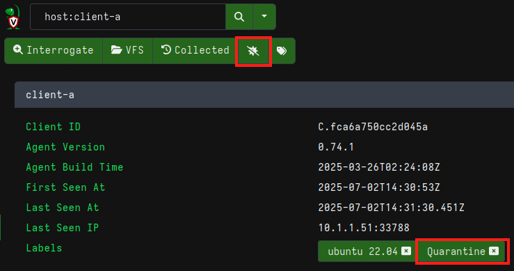

# Incident Response with Velociraptor

## Mini-challenge Solution

### Find the Shell Script That Was Uploaded by the Attacker

1. (**Kali-Investigator, Firefox, Velociraptor WebGUI**) In the `>_Shell` command field for `client-a` run the following command to look for any files within the `/home/user/` directory that have been modified or created within the last 60 minutes (you may need to increase this value based on when you ran the Phase 3 activity script).

```
find /home/user -type f \( -mmin 60 -o -cmin -60 \) 2>/dev/null
```

2. (**Kali-Investigator, Firefox, Velociraptor WebGUI**) View the results by browsing to the `client-a` host details, then click on `Collected Artifacts` tab, click on the Artifact for `Linux.Sys.BashShell`, and then click on `Notebook`. Scroll down to view the results of the command.



**Mini-Challenge Question 1:** *What is the path and name of the shell script that was uploaded by the attacker?*

The path and filename are `/home/user/snap/snap-store/common/runme.sh`

### Find the Token File Placed Alongside the Malicious Service

1. (**Kali-Investigator, Firefox, Velociraptor WebGUI**) Use the VFS option for `client-a` to view the contents of the `runme.sh` file.






2. (**Kali-Investigator, Firefox, Velociraptor WebGUI**) Based on the service file directory of `/etc/systemd/system/`, browse to this directory and find the .ini file.



3. (**Kali-Investigator, Firefox, Velociraptor WebGUI**) Collect this file and view the contents to find the token string for submission.



**Mini-Challenge Question 2:** *What is token string found within the .ini file located next to the suspicious service file?*

In this example, the token string is `eb6f27d6`. Your string will differ.


### Quarantine CLIENT-A

1. (**Kali-Investigator, Firefox, Velociraptor WebGUI**) While viewing `client-a's` host information page, simply click the "Quarantine" button and accept the pop up prompt by clicking "Yes do it".



Once the system is quarantined, the quarantine button icon will change and a label of "Quarantine" will be added to the host info. 



Note that adding a label of "Quarantine" is not possible due to this label being reserved by the Quarantine funtion. Adding a label of "quarantine" will also not work, as the check verifies that the system is actually marked with the "Quarantine" label by Velociraptor.

2. (**Kali-Investigator, Firefox, Sklls Hub Tasks**) Once the system is quarantined, run the grading check to receieve the token for submission.


